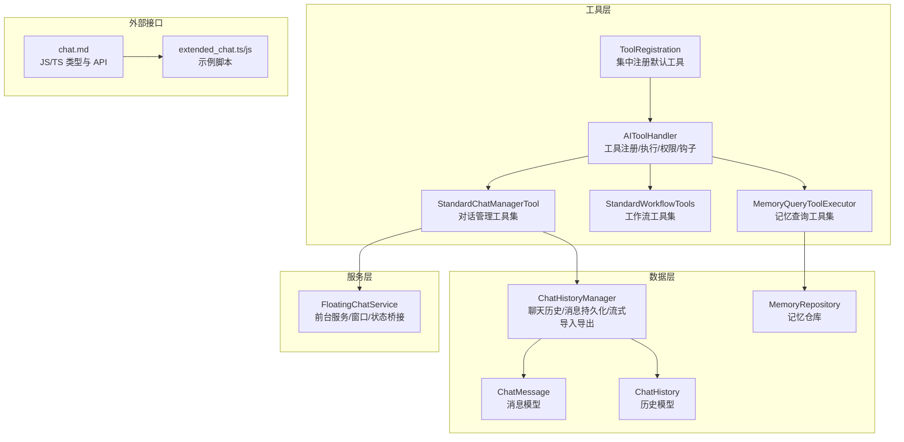
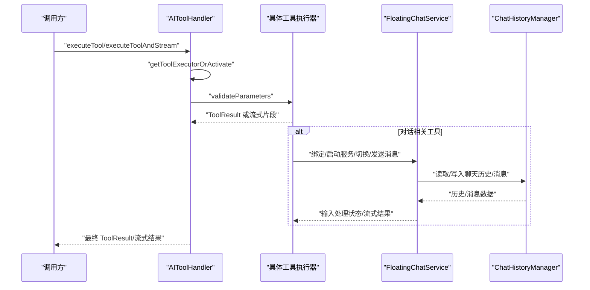
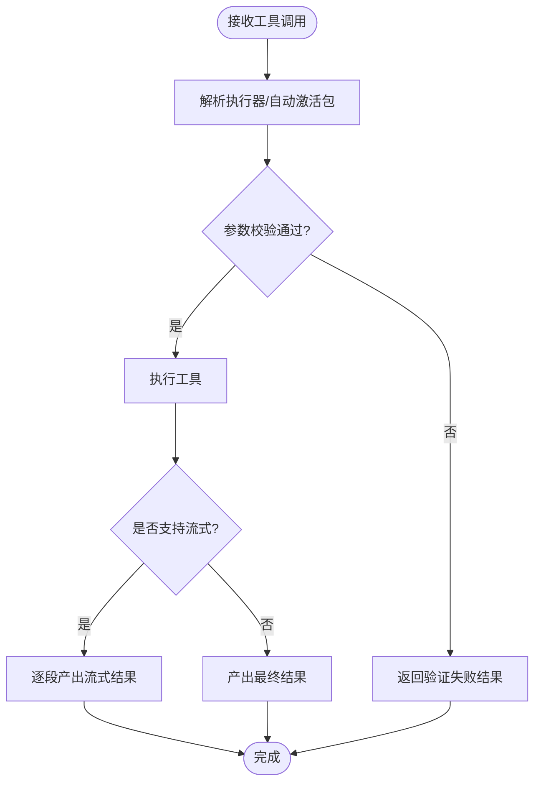
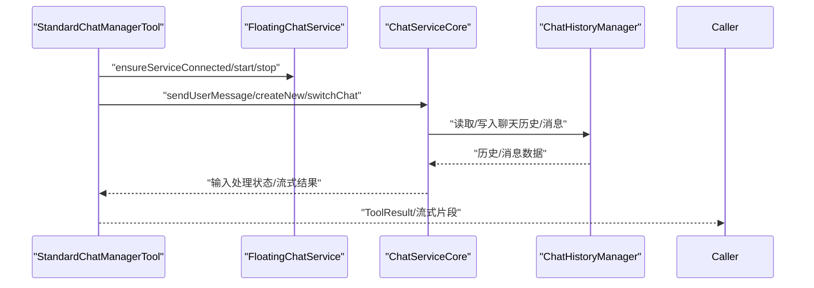
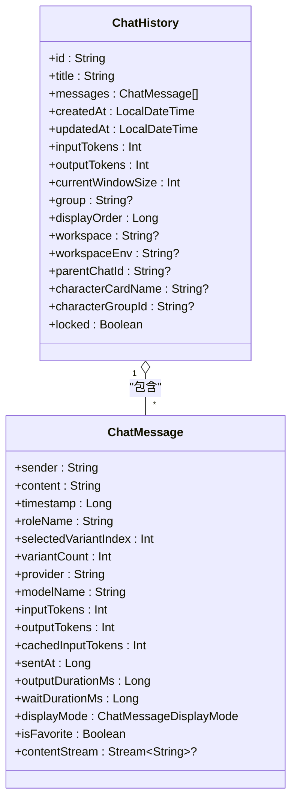
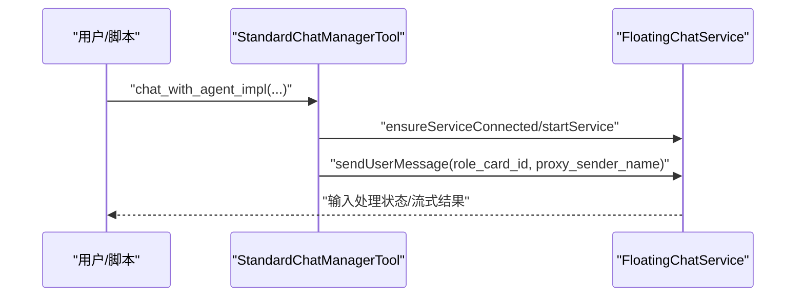
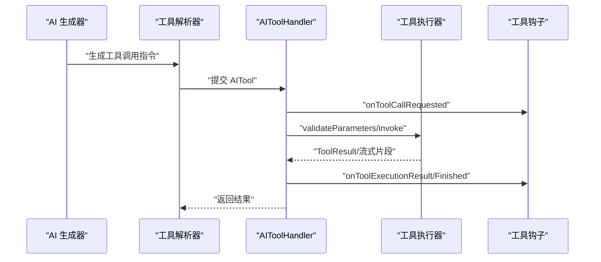
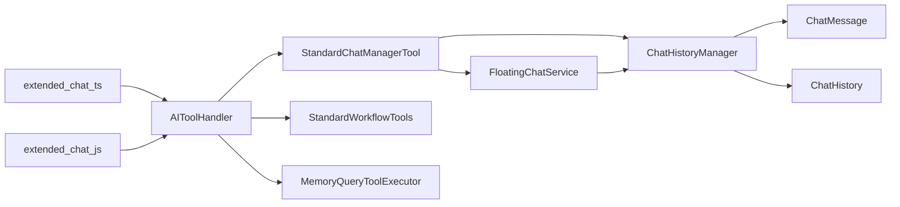

# AI 对话系统

<cite>
**本文引用的文件**   
- [ToolRegistration.kt](file://app/src/main/java/com/ai/assistance/operit/core/tools/ToolRegistration.kt)
- [AIToolHandler.kt](file://app/src/main/java/com/ai/assistance/operit/core/tools/AIToolHandler.kt)
- [StandardChatManagerTool.kt](file://app/src/main/java/com/ai/assistance/operit/core/tools/defaultTool/standard/StandardChatManagerTool.kt)
- [FloatingChatService.kt](file://app/src/main/java/com/ai/assistance/operit/services/FloatingChatService.kt)
- [ChatHistoryManager.kt](file://app/src/main/java/com/ai/assistance/operit/data/repository/ChatHistoryManager.kt)
- [ChatMessage.kt](file://app/src/main/java/com/ai/assistance/operit/data/model/ChatMessage.kt)
- [ChatHistory.kt](file://app/src/main/java/com/ai/assistance/operit/data/model/ChatHistory.kt)
- [chat.md](file://docs/package_dev/chat.md)
- [extended_chat.ts](file://examples/extended_chat.ts)
- [extended_chat.js](file://app/src/main/assets/packages/extended_chat.js)
- [StandardWorkflowTools.kt](file://app/src/main/java/com/ai/assistance/operit/core/tools/defaultTool/standard/StandardWorkflowTools.kt)
- [MemoryQueryToolExecutor.kt](file://app/src/main/java/com/ai/assistance/operit/core/tools/defaultTool/standard/MemoryQueryToolExecutor.kt)
- [MemoryRepository.kt](file://app/src/main/java/com/ai/assistance/operit/data/repository/MemoryRepository.kt)
</cite>

## 目录
1. [简介](#简介)
2. [项目结构](#项目结构)
3. [核心组件](#核心组件)
4. [架构总览](#架构总览)
5. [详细组件分析](#详细组件分析)
6. [依赖关系分析](#依赖关系分析)
7. [性能考量](#性能考量)
8. [故障排查指南](#故障排查指南)
9. [结论](#结论)
10. [附录](#附录)

## 简介
本技术文档围绕 Operit AI 的对话系统，系统性阐述多轮对话的状态维护、上下文管理策略、思维链（Chain of Thought）支持、工具调用处理流程、上下文处理机制（历史对话存储与检索、角色卡绑定、记忆系统）、AI 间相互对话能力，以及并发与持久化等关键技术细节。文档同时提供面向开发者的扩展与定制指导，并通过图示与路径引用帮助读者快速定位实现位置。

## 项目结构
Operit 的对话系统主要由以下层次构成：
- 工具层：统一的工具注册与执行框架，负责解析与调度各类工具（如对话管理、记忆查询、工作流等）。
- 服务层：浮动聊天服务承载 UI 与运行时状态，协调对话生命周期与输入处理状态。
- 数据层：基于 Room 的聊天历史与消息持久化，支持流式导入/导出与变体管理。
- 类型与模型：标准化的消息与历史数据结构，支撑跨模块的数据交换。
- 外部接口：JS/TS 类型定义与示例脚本，提供对外 API 的使用参考。

**图表来源**
- [ToolRegistration.kt:36-800](file://app/src/main/java/com/ai/assistance/operit/core/tools/ToolRegistration.kt#L36-L800)
- [AIToolHandler.kt:29-432](file://app/src/main/java/com/ai/assistance/operit/core/tools/AIToolHandler.kt#L29-L432)
- [StandardChatManagerTool.kt:78-1720](file://app/src/main/java/com/ai/assistance/operit/core/tools/defaultTool/standard/StandardChatManagerTool.kt#L78-L1720)
- [FloatingChatService.kt:59-817](file://app/src/main/java/com/ai/assistance/operit/services/FloatingChatService.kt#L59-L817)
- [ChatHistoryManager.kt:74-800](file://app/src/main/java/com/ai/assistance/operit/data/repository/ChatHistoryManager.kt#L74-L800)
- [ChatMessage.kt:9-100](file://app/src/main/java/com/ai/assistance/operit/data/model/ChatMessage.kt#L9-L100)
- [ChatHistory.kt:8-29](file://app/src/main/java/com/ai/assistance/operit/data/model/ChatHistory.kt#L8-L29)
- [chat.md:1-173](file://docs/package_dev/chat.md#L1-L173)
- [extended_chat.ts:91-398](file://examples/extended_chat.ts#L91-L398)
- [extended_chat.js:91-313](file://app/src/main/assets/packages/extended_chat.js#L91-L313)

**章节来源**
- [ToolRegistration.kt:36-800](file://app/src/main/java/com/ai/assistance/operit/core/tools/ToolRegistration.kt#L36-L800)
- [AIToolHandler.kt:29-432](file://app/src/main/java/com/ai/assistance/operit/core/tools/AIToolHandler.kt#L29-L432)
- [StandardChatManagerTool.kt:78-1720](file://app/src/main/java/com/ai/assistance/operit/core/tools/defaultTool/standard/StandardChatManagerTool.kt#L78-L1720)
- [FloatingChatService.kt:59-817](file://app/src/main/java/com/ai/assistance/operit/services/FloatingChatService.kt#L59-L817)
- [ChatHistoryManager.kt:74-800](file://app/src/main/java/com/ai/assistance/operit/data/repository/ChatHistoryManager.kt#L74-L800)
- [ChatMessage.kt:9-100](file://app/src/main/java/com/ai/assistance/operit/data/model/ChatMessage.kt#L9-L100)
- [ChatHistory.kt:8-29](file://app/src/main/java/com/ai/assistance/operit/data/model/ChatHistory.kt#L8-L29)
- [chat.md:1-173](file://docs/package_dev/chat.md#L1-L173)
- [extended_chat.ts:91-398](file://examples/extended_chat.ts#L91-L398)
- [extended_chat.js:91-313](file://app/src/main/assets/packages/extended_chat.js#L91-L313)

## 核心组件
- 工具注册与执行中枢：统一注册与调度工具，支持参数校验、权限检查、钩子通知、流式结果产出。
- 对话管理工具集：封装启动/停止服务、创建/切换/查找/删除对话、发送消息、查询状态、读取消息等能力。
- 浮动聊天服务：前台服务承载 UI 与状态，订阅输入处理状态、附件与消息流，提供窗口可见性与状态指示控制。
- 聊天历史与消息持久化：基于 Room 的聊天与消息 DAO，支持变体管理、流式导入导出、互斥锁保护并发安全。
- 记忆查询与工作流工具：提供记忆检索、链接管理、用户偏好更新、工作流创建/查询/启用/禁用等工具集。
- 类型与模型：标准化的消息与历史模型，便于跨模块传递与序列化。

**章节来源**
- [AIToolHandler.kt:29-432](file://app/src/main/java/com/ai/assistance/operit/core/tools/AIToolHandler.kt#L29-L432)
- [StandardChatManagerTool.kt:78-1720](file://app/src/main/java/com/ai/assistance/operit/core/tools/defaultTool/standard/StandardChatManagerTool.kt#L78-L1720)
- [FloatingChatService.kt:59-817](file://app/src/main/java/com/ai/assistance/operit/services/FloatingChatService.kt#L59-L817)
- [ChatHistoryManager.kt:74-800](file://app/src/main/java/com/ai/assistance/operit/data/repository/ChatHistoryManager.kt#L74-L800)
- [ChatMessage.kt:9-100](file://app/src/main/java/com/ai/assistance/operit/data/model/ChatMessage.kt#L9-L100)
- [ChatHistory.kt:8-29](file://app/src/main/java/com/ai/assistance/operit/data/model/ChatHistory.kt#L8-L29)
- [StandardWorkflowTools.kt:157-396](file://app/src/main/java/com/ai/assistance/operit/core/tools/defaultTool/standard/StandardWorkflowTools.kt#L157-L396)
- [MemoryQueryToolExecutor.kt:345-362](file://app/src/main/java/com/ai/assistance/operit/core/tools/defaultTool/standard/MemoryQueryToolExecutor.kt#L345-L362)

## 架构总览
Operit 的对话系统采用“工具驱动 + 服务编排 + 数据持久化”的分层架构。AI 的响应与工具调用通过工具处理器统一调度，服务层负责 UI 与状态管理，数据层保障历史与消息的可靠存储与高效检索。

**图表来源**
- [AIToolHandler.kt:324-415](file://app/src/main/java/com/ai/assistance/operit/core/tools/AIToolHandler.kt#L324-L415)
- [StandardChatManagerTool.kt:1185-1523](file://app/src/main/java/com/ai/assistance/operit/core/tools/defaultTool/standard/StandardChatManagerTool.kt#L1185-L1523)
- [FloatingChatService.kt:685-724](file://app/src/main/java/com/ai/assistance/operit/services/FloatingChatService.kt#L685-L724)
- [ChatHistoryManager.kt:426-463](file://app/src/main/java/com/ai/assistance/operit/data/repository/ChatHistoryManager.kt#L426-L463)

## 详细组件分析

### 工具注册与执行（AIToolHandler）
- 统一注册：集中注册默认工具，支持描述生成器与延迟激活包工具。
- 执行流程：参数校验、权限检查、执行器选择、结果通知与异常处理。
- 流式执行：支持工具级流式结果产出，便于实时反馈。
- 自动激活：当工具名含包前缀且未注册时，自动激活对应包并重试解析。

**图表来源**
- [AIToolHandler.kt:324-415](file://app/src/main/java/com/ai/assistance/operit/core/tools/AIToolHandler.kt#L324-L415)

**章节来源**
- [AIToolHandler.kt:29-432](file://app/src/main/java/com/ai/assistance/operit/core/tools/AIToolHandler.kt#L29-L432)
- [ToolRegistration.kt:36-800](file://app/src/main/java/com/ai/assistance/operit/core/tools/ToolRegistration.kt#L36-L800)

### 对话管理工具集（StandardChatManagerTool）
- 服务连接与绑定：确保服务可用，支持超时与重连，提供连接状态查询。
- 对话生命周期：创建、切换、查找、删除、更新标题、列出对话。
- 消息发送：支持流式与非流式两种模式，支持角色卡覆盖、目标对话覆盖、选项控制（持久化、通知、隐藏、禁用警告、超时）。
- 输入状态查询：按对话 ID 查询输入处理状态，涵盖空闲、处理中、执行工具、处理结果、汇总、计划执行、错误等状态。
- JS/TS API：通过 Tools.Chat 提供一致的 API，支持服务启动、消息发送、角色卡枚举、消息读取等。

**图表来源**
- [StandardChatManagerTool.kt:1185-1523](file://app/src/main/java/com/ai/assistance/operit/core/tools/defaultTool/standard/StandardChatManagerTool.kt#L1185-L1523)
- [FloatingChatService.kt:685-724](file://app/src/main/java/com/ai/assistance/operit/services/FloatingChatService.kt#L685-L724)
- [ChatHistoryManager.kt:426-463](file://app/src/main/java/com/ai/assistance/operit/data/repository/ChatHistoryManager.kt#L426-L463)

**章节来源**
- [StandardChatManagerTool.kt:78-1720](file://app/src/main/java/com/ai/assistance/operit/core/tools/defaultTool/standard/StandardChatManagerTool.kt#L78-L1720)
- [chat.md:20-173](file://docs/package_dev/chat.md#L20-L173)
- [extended_chat.ts:91-398](file://examples/extended_chat.ts#L91-L398)
- [extended_chat.js:91-313](file://app/src/main/assets/packages/extended_chat.js#L91-L313)

### 上下文处理机制（历史、角色卡、记忆）
- 历史存储与检索：基于 Room 的 DAO 层，支持消息变体、流式导入导出、互斥锁保护并发。
- 角色卡绑定：对话创建与发送时可指定角色卡 ID，工具层进行存在性校验。
- 记忆系统：提供记忆查询、链接管理、用户偏好更新等工具，支持按标题检索与全文检索。

**图表来源**
- [ChatHistory.kt:8-29](file://app/src/main/java/com/ai/assistance/operit/data/model/ChatHistory.kt#L8-L29)
- [ChatMessage.kt:9-100](file://app/src/main/java/com/ai/assistance/operit/data/model/ChatMessage.kt#L9-L100)

**章节来源**
- [ChatHistoryManager.kt:74-800](file://app/src/main/java/com/ai/assistance/operit/data/repository/ChatHistoryManager.kt#L74-L800)
- [ChatMessage.kt:9-100](file://app/src/main/java/com/ai/assistance/operit/data/model/ChatMessage.kt#L9-L100)
- [ChatHistory.kt:8-29](file://app/src/main/java/com/ai/assistance/operit/data/model/ChatHistory.kt#L8-L29)
- [MemoryQueryToolExecutor.kt:345-362](file://app/src/main/java/com/ai/assistance/operit/core/tools/defaultTool/standard/MemoryQueryToolExecutor.kt#L345-L362)
- [MemoryRepository.kt:2044-2077](file://app/src/main/java/com/ai/assistance/operit/data/repository/MemoryRepository.kt#L2044-L2077)

### AI 间相互对话（角色卡交互）
- 角色卡选择：通过角色卡 ID 指定对话的角色，工具层进行存在性校验。
- 代理发送：支持为消息设置代理发送者名称，便于区分来源。
- 服务启动与模式：支持多种窗口模式与语音模式，满足不同交互场景。

**图表来源**
- [extended_chat.ts:296-398](file://examples/extended_chat.ts#L296-L398)
- [extended_chat.js:296-313](file://app/src/main/assets/packages/extended_chat.js#L296-L313)
- [StandardChatManagerTool.kt:1221-1381](file://app/src/main/java/com/ai/assistance/operit/core/tools/defaultTool/standard/StandardChatManagerTool.kt#L1221-L1381)

**章节来源**
- [extended_chat.ts:91-398](file://examples/extended_chat.ts#L91-L398)
- [extended_chat.js:91-313](file://app/src/main/assets/packages/extended_chat.js#L91-L313)
- [StandardChatManagerTool.kt:1221-1381](file://app/src/main/java/com/ai/assistance/operit/core/tools/defaultTool/standard/StandardChatManagerTool.kt#L1221-L1381)

### 工具调用处理流程（从生成到执行）
- 工具生成：AI 输出包含工具调用指令（名称与参数）。
- 工具解析：工具处理器解析并校验参数，必要时触发权限确认。
- 执行与流式：执行器返回 ToolResult 或流式片段，工具处理器通知钩子与观察者。
- 结果回传：最终结果或流式片段回传给调用方。

**图表来源**
- [AIToolHandler.kt:96-124](file://app/src/main/java/com/ai/assistance/operit/core/tools/AIToolHandler.kt#L96-L124)
- [AIToolHandler.kt:342-366](file://app/src/main/java/com/ai/assistance/operit/core/tools/AIToolHandler.kt#L342-L366)

**章节来源**
- [AIToolHandler.kt:29-432](file://app/src/main/java/com/ai/assistance/operit/core/tools/AIToolHandler.kt#L29-L432)

### 思维链（Chain of Thought）支持
- 流式输出：工具执行器支持流式结果，便于逐步输出推理中间态。
- 状态反馈：输入处理状态覆盖“处理中/执行工具/处理结果/汇总/计划执行/错误”等，便于在思维链过程中可视化状态。
- 超时与取消：发送消息时支持超时控制与取消，避免长时间阻塞。

**章节来源**
- [StandardChatManagerTool.kt:272-334](file://app/src/main/java/com/ai/assistance/operit/core/tools/defaultTool/standard/StandardChatManagerTool.kt#L272-L334)
- [StandardChatManagerTool.kt:1525-1599](file://app/src/main/java/com/ai/assistance/operit/core/tools/defaultTool/standard/StandardChatManagerTool.kt#L1525-L1599)

### 并发与持久化
- 并发控制：聊天互斥锁与消息互斥锁，确保同一聊天内的写入串行化。
- 数据一致性：消息变体与主消息的关联存储，保证多版本回复的一致性。
- 流式导入导出：支持大体量历史的流式处理，降低内存占用。

**章节来源**
- [ChatHistoryManager.kt:383-389](file://app/src/main/java/com/ai/assistance/operit/data/repository/ChatHistoryManager.kt#L383-L389)
- [ChatHistoryManager.kt:546-603](file://app/src/main/java/com/ai/assistance/operit/data/repository/ChatHistoryManager.kt#L546-L603)
- [ChatHistoryManager.kt:293-366](file://app/src/main/java/com/ai/assistance/operit/data/repository/ChatHistoryManager.kt#L293-L366)

## 依赖关系分析
- 工具层依赖服务层与数据层：对话工具通过服务层与数据层协同完成消息发送与历史持久化。
- 服务层依赖数据层：服务层通过 ChatServiceCore 订阅与更新聊天历史、输入处理状态等。
- JS/TS 接口依赖工具层：示例脚本通过 Tools.Chat 调用工具层提供的 API。

**图表来源**
- [AIToolHandler.kt:29-432](file://app/src/main/java/com/ai/assistance/operit/core/tools/AIToolHandler.kt#L29-L432)
- [StandardChatManagerTool.kt:78-1720](file://app/src/main/java/com/ai/assistance/operit/core/tools/defaultTool/standard/StandardChatManagerTool.kt#L78-L1720)
- [FloatingChatService.kt:59-817](file://app/src/main/java/com/ai/assistance/operit/services/FloatingChatService.kt#L59-L817)
- [ChatHistoryManager.kt:74-800](file://app/src/main/java/com/ai/assistance/operit/data/repository/ChatHistoryManager.kt#L74-L800)
- [ChatMessage.kt:9-100](file://app/src/main/java/com/ai/assistance/operit/data/model/ChatMessage.kt#L9-L100)
- [ChatHistory.kt:8-29](file://app/src/main/java/com/ai/assistance/operit/data/model/ChatHistory.kt#L8-L29)
- [extended_chat.ts:91-398](file://examples/extended_chat.ts#L91-L398)
- [extended_chat.js:91-313](file://app/src/main/assets/packages/extended_chat.js#L91-L313)

**章节来源**
- [StandardWorkflowTools.kt:157-396](file://app/src/main/java/com/ai/assistance/operit/core/tools/defaultTool/standard/StandardWorkflowTools.kt#L157-L396)
- [MemoryQueryToolExecutor.kt:345-362](file://app/src/main/java/com/ai/assistance/operit/core/tools/defaultTool/standard/MemoryQueryToolExecutor.kt#L345-L362)

## 性能考量
- 流式处理：工具执行与消息发送均支持流式，减少等待时间，提升交互体验。
- 并发互斥：聊天与消息互斥锁避免竞态，保障数据一致性。
- 数据库优化：懒加载与状态共享，降低 UI 刷新成本；流式导入导出降低内存峰值。
- 超时与取消：发送消息支持超时与取消，防止长时间阻塞影响整体性能。

[本节为通用建议，无需特定文件引用]

## 故障排查指南
- 工具未找到：检查工具是否正确注册或包是否自动激活。
- 参数校验失败：核对参数类型与范围，确保符合工具要求。
- 服务未连接：确认服务已启动并绑定成功，检查连接超时与崩溃防护。
- 输入处理状态异常：关注错误状态与消息，必要时取消当前消息并重试。
- 记忆查询失败：检查标题匹配与异常日志，确认记忆存在与格式正确。

**章节来源**
- [AIToolHandler.kt:324-415](file://app/src/main/java/com/ai/assistance/operit/core/tools/AIToolHandler.kt#L324-L415)
- [StandardChatManagerTool.kt:238-356](file://app/src/main/java/com/ai/assistance/operit/core/tools/defaultTool/standard/StandardChatManagerTool.kt#L238-L356)
- [FloatingChatService.kt:171-197](file://app/src/main/java/com/ai/assistance/operit/services/FloatingChatService.kt#L171-L197)
- [MemoryQueryToolExecutor.kt:345-362](file://app/src/main/java/com/ai/assistance/operit/core/tools/defaultTool/standard/MemoryQueryToolExecutor.kt#L345-L362)

## 结论
Operit 的对话系统通过工具驱动、服务编排与数据持久化的分层设计，实现了稳定、可扩展、可流式的多轮对话能力。工具层提供统一的执行与流式输出能力，服务层承载 UI 与状态，数据层保障历史与消息的可靠性与高性能。结合角色卡绑定、记忆系统与工作流工具，系统具备强大的上下文管理与 AI 间交互能力。开发者可基于现有工具与 API 快速扩展自定义对话行为与复杂工具调用序列。

[本节为总结，无需特定文件引用]

## 附录
- 开发者扩展建议
  - 自定义对话行为：通过注册新工具并在工具处理器中实现参数校验与执行逻辑，支持流式结果以提升交互体验。
  - 复杂工具调用序列：利用工具处理器的流式执行与状态反馈，在工具内部实现步骤化与可中断的流程。
  - 性能优化：优先使用流式导入导出、互斥锁保护写入、合理设置超时与取消策略。
  - 上下文绑定：在工具执行前校验角色卡与目标对话的存在性，确保上下文一致性。
- 参考路径
  - 工具注册与执行：[ToolRegistration.kt:36-800](file://app/src/main/java/com/ai/assistance/operit/core/tools/ToolRegistration.kt#L36-L800)，[AIToolHandler.kt:29-432](file://app/src/main/java/com/ai/assistance/operit/core/tools/AIToolHandler.kt#L29-L432)
  - 对话管理 API：[StandardChatManagerTool.kt:78-1720](file://app/src/main/java/com/ai/assistance/operit/core/tools/defaultTool/standard/StandardChatManagerTool.kt#L78-L1720)，[chat.md:20-173](file://docs/package_dev/chat.md#L20-L173)
  - 历史与消息模型：[ChatHistoryManager.kt:74-800](file://app/src/main/java/com/ai/assistance/operit/data/repository/ChatHistoryManager.kt#L74-L800)，[ChatMessage.kt:9-100](file://app/src/main/java/com/ai/assistance/operit/data/model/ChatMessage.kt#L9-L100)，[ChatHistory.kt:8-29](file://app/src/main/java/com/ai/assistance/operit/data/model/ChatHistory.kt#L8-L29)
  - 记忆与工作流工具：[MemoryQueryToolExecutor.kt:345-362](file://app/src/main/java/com/ai/assistance/operit/core/tools/defaultTool/standard/MemoryQueryToolExecutor.kt#L345-L362)，[StandardWorkflowTools.kt:157-396](file://app/src/main/java/com/ai/assistance/operit/core/tools/defaultTool/standard/StandardWorkflowTools.kt#L157-L396)