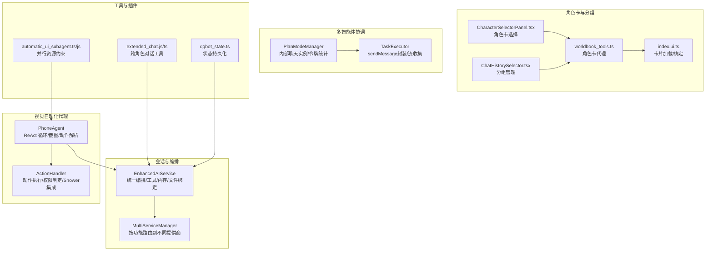
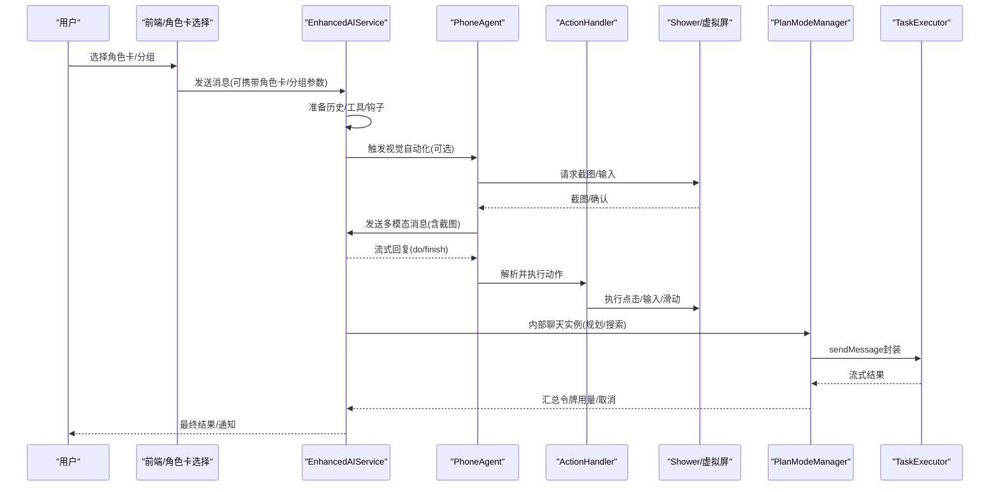
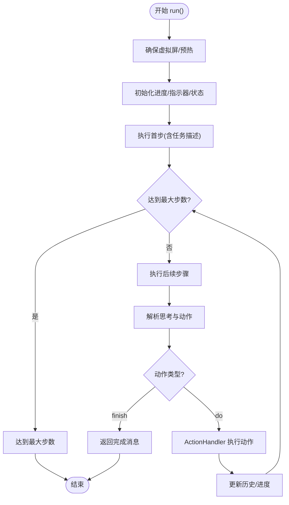
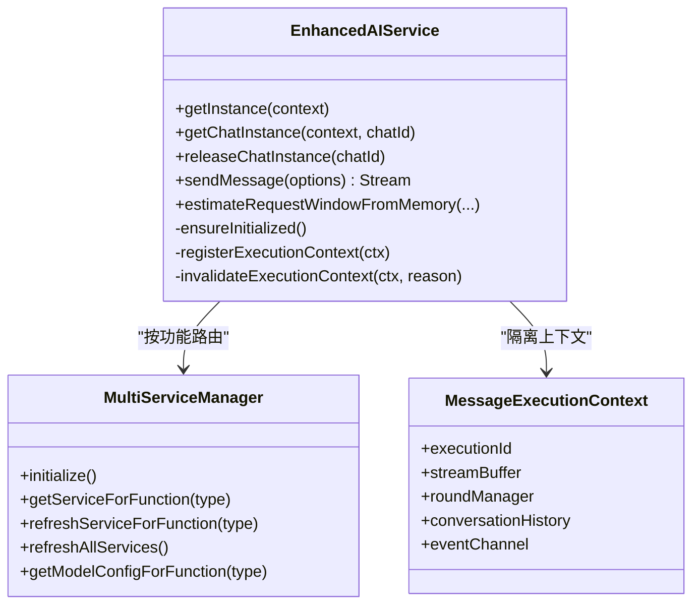
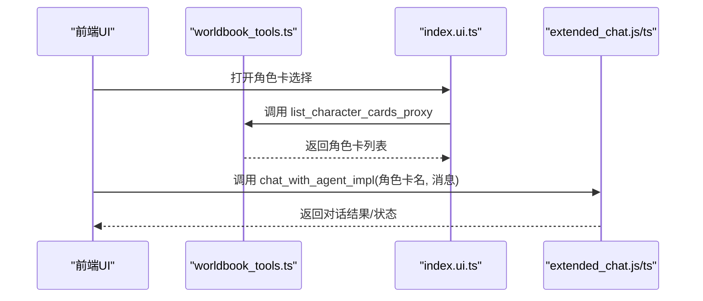
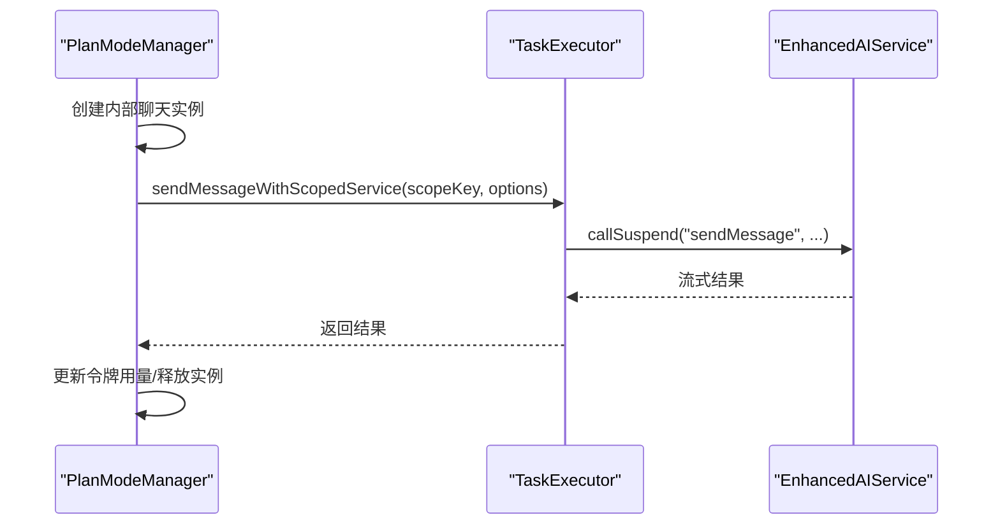
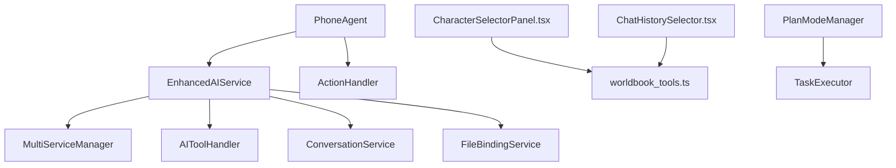

# AI 间交互

<cite>
**本文引用的文件**
- [PhoneAgent.kt](file://app/src/main/java/com/ai/assistance/operit/core/tools/agent/PhoneAgent.kt)
- [EnhancedAIService.kt](file://app/src/main/java/com/ai/assistance/operit/api/chat/EnhancedAIService.kt)
- [PhoneAgentJobRegistry.kt](file://app/src/main/java/com/ai/assistance/operit/core/tools/agent/PhoneAgentJobRegistry.kt)
- [extended_chat.js](file://app/src/main/assets/packages/extended_chat.js)
- [extended_chat.ts](file://examples/extended_chat.ts)
- [worldbook_tools.ts](file://examples/worldbook/src/packages/worldbook_tools.ts)
- [index.ui.ts](file://examples/worldbook/src/ui/worldbook_manager/index.ui.ts)
- [ChatHistorySelector.tsx](file://web-chat/src/ui/features/chat/components/ChatHistorySelector.tsx)
- [CharacterSelectorPanel.tsx](file://web-chat/src/ui/features/chat/components/CharacterSelectorPanel.tsx)
- [plan-mode-manager.ts](file://examples/deepsearching/src/planning/plan-mode-manager.ts)
- [task-executor.ts](file://examples/deepsearching/src/planning/task-executor.ts)
- [qqbot_state.ts](file://examples/qqbot/src/shared/qqbot_state.ts)
- [automatic_ui_subagent.ts](file://examples/automatic_ui_subagent.ts)
- [automatic_ui_subagent.js](file://app/src/main/assets/packages/automatic_ui_subagent.js)
- [AI Agent软件架构设计与业务流程.md](file://my_docs/AI Agent软件架构设计与业务流程.md)
- [Operit Agent 意图路由机制详解.md](file://my_docs/Operit Agent 意图路由机制详解.md)
</cite>

## 目录
1. [简介](#简介)
2. [项目结构](#项目结构)
3. [核心组件](#核心组件)
4. [架构总览](#架构总览)
5. [详细组件分析](#详细组件分析)
6. [依赖关系分析](#依赖关系分析)
7. [性能考量](#性能考量)
8. [故障排查指南](#故障排查指南)
9. [结论](#结论)
10. [附录](#附录)

## 简介
本文件面向开发者，系统性阐述 Operit 的 AI 间交互体系：角色卡定义与管理、角色间通信协议、多智能体协调策略、PhoneAgent 的代理模式与会话管理、角色组卡片与批量操作、AI 间对话的上下文隔离与消息路由、角色状态同步与会话持久化、权限控制与并发安全等。文档以代码级分析为基础，辅以可视化图示，帮助读者快速构建稳定、可扩展的多智能体系统。

## 项目结构
Operit 的 AI 间交互由以下层次构成：
- 会话与编排层：EnhancedAIService 提供统一的对话编排、工具执行、内存与文件绑定、多服务路由与并发隔离。
- 视觉自动化代理层：PhoneAgent 通过视觉语言模型进行 UI 自动化，结合 ActionHandler 执行点击、输入、滑动等动作。
- 角色卡与分组层：前端 UI 与工具包提供角色卡选择、分组管理与批量操作能力。
- 多智能体协调层：PlanModeManager 与 TaskExecutor 支持内部聊天实例隔离、令牌用量统计与跨任务编排。
- 工具与插件层：扩展聊天工具（如跨角色对话）、世界书工具代理、QQBot 状态持久化等。

**图表来源**
- [EnhancedAIService.kt](file://app/src/main/java/com/ai/assistance/operit/api/chat/EnhancedAIService.kt)
- [PhoneAgent.kt](file://app/src/main/java/com/ai/assistance/operit/core/tools/agent/PhoneAgent.kt)
- [CharacterSelectorPanel.tsx](file://web-chat/src/ui/features/chat/components/CharacterSelectorPanel.tsx)
- [ChatHistorySelector.tsx](file://web-chat/src/ui/features/chat/components/ChatHistorySelector.tsx)
- [worldbook_tools.ts](file://examples/worldbook/src/packages/worldbook_tools.ts)
- [index.ui.ts](file://examples/worldbook/src/ui/worldbook_manager/index.ui.ts)
- [plan-mode-manager.ts](file://examples/deepsearching/src/planning/plan-mode-manager.ts)
- [task-executor.ts](file://examples/deepsearching/src/planning/task-executor.ts)
- [extended_chat.js](file://app/src/main/assets/packages/extended_chat.js)
- [extended_chat.ts](file://examples/extended_chat.ts)
- [qqbot_state.ts](file://examples/qqbot/src/shared/qqbot_state.ts)
- [automatic_ui_subagent.ts](file://examples/automatic_ui_subagent.ts)
- [automatic_ui_subagent.js](file://app/src/main/assets/packages/automatic_ui_subagent.js)

**章节来源**
- [AI Agent软件架构设计与业务流程.md](file://my_docs/AI Agent软件架构设计与业务流程.md)
- [Operit Agent 意图路由机制详解.md](file://my_docs/Operit Agent 意图路由机制详解.md)

## 核心组件
- EnhancedAIService：统一的 AI 编排入口，负责对话历史准备、工具执行、文件绑定、内存更新、并发上下文隔离、多服务路由与令牌统计。
- PhoneAgent：基于 ReAct 的 UI 自动化代理，循环执行“截图→LLM 分析→动作执行→更新上下文”，支持虚拟屏与主屏两种运行模式。
- ActionHandler：动作执行器，负责权限判定、Shower 虚拟屏输入、设备输入、应用包名解析、延迟与异常处理。
- 角色卡与分组：前端角色卡选择面板、分组管理弹窗，配合 worldbook 工具代理与 UI 加载逻辑。
- 多智能体协调：PlanModeManager 与 TaskExecutor 提供内部聊天实例隔离、令牌用量聚合与取消控制。
- 工具与插件：extended_chat 跨角色对话工具、qqbot 状态持久化、automatic_ui_subagent 并行资源约束与失败重试策略。

**章节来源**
- [EnhancedAIService.kt](file://app/src/main/java/com/ai/assistance/operit/api/chat/EnhancedAIService.kt)
- [PhoneAgent.kt](file://app/src/main/java/com/ai/assistance/operit/core/tools/agent/PhoneAgent.kt)
- [CharacterSelectorPanel.tsx](file://web-chat/src/ui/features/chat/components/CharacterSelectorPanel.tsx)
- [ChatHistorySelector.tsx](file://web-chat/src/ui/features/chat/components/ChatHistorySelector.tsx)
- [plan-mode-manager.ts](file://examples/deepsearching/src/planning/plan-mode-manager.ts)
- [task-executor.ts](file://examples/deepsearching/src/planning/task-executor.ts)
- [extended_chat.js](file://app/src/main/assets/packages/extended_chat.js)
- [extended_chat.ts](file://examples/extended_chat.ts)
- [qqbot_state.ts](file://examples/qqbot/src/shared/qqbot_state.ts)
- [automatic_ui_subagent.ts](file://examples/automatic_ui_subagent.ts)
- [automatic_ui_subagent.js](file://app/src/main/assets/packages/automatic_ui_subagent.js)

## 架构总览
下图展示了从用户意图到多智能体交互的关键路径：EnhancedAIService 统一编排，PhoneAgent 通过视觉语言模型进行 UI 自动化，角色卡与分组通过前端与工具代理协同，PlanModeManager 支持内部聊天实例隔离与令牌统计，工具包提供跨角色对话与状态持久化能力。

**图表来源**
- [EnhancedAIService.kt](file://app/src/main/java/com/ai/assistance/operit/api/chat/EnhancedAIService.kt)
- [PhoneAgent.kt](file://app/src/main/java/com/ai/assistance/operit/core/tools/agent/PhoneAgent.kt)
- [plan-mode-manager.ts](file://examples/deepsearching/src/planning/plan-mode-manager.ts)
- [task-executor.ts](file://examples/deepsearching/src/planning/task-executor.ts)

## 详细组件分析

### PhoneAgent：代理模式与会话管理
- 代理模式：PhoneAgent 将“视觉理解 + 动作执行”解耦为独立模块，通过 AIService 与 ActionHandler 进行协作，便于替换模型与输入法。
- 会话管理：维护上下文历史、步骤计数、暂停/恢复、进度覆盖层、虚拟屏显示与清理。
- 执行循环：_executeStep 捕获截图、构建多模态消息、调用 uiService.sendMessage、解析思考与动作、执行 ActionHandler、更新历史与进度。
- 权限与虚拟屏：根据权限级别与设备状态选择 Shower 虚拟屏或本地输入，确保主屏与虚拟屏的 UI 指示一致。

**图表来源**
- [PhoneAgent.kt](file://app/src/main/java/com/ai/assistance/operit/core/tools/agent/PhoneAgent.kt)

**章节来源**
- [PhoneAgent.kt](file://app/src/main/java/com/ai/assistance/operit/core/tools/agent/PhoneAgent.kt)
- [AI Agent软件架构设计与业务流程.md](file://my_docs/AI Agent软件架构设计与业务流程.md)

### EnhancedAIService：统一编排与并发隔离
- 统一入口：集中管理对话历史、工具执行、文件绑定、内存更新、令牌统计与 UI 状态。
- 并发隔离：MessageExecutionContext 为每次 sendMessage 提供独立上下文，避免交叉污染。
- 多服务路由：MultiServiceManager 按功能类型路由到不同提供商，支持配置覆盖与刷新。
- 内部聊天实例：getChatInstance/releaseChatInstance 提供多实例隔离与令牌用量聚合。
- 钩子链：PromptHookRegistry 支持 7 阶段钩子，允许 ToolPkg 注入修改。

**图表来源**
- [EnhancedAIService.kt](file://app/src/main/java/com/ai/assistance/operit/api/chat/EnhancedAIService.kt)

**章节来源**
- [EnhancedAIService.kt](file://app/src/main/java/com/ai/assistance/operit/api/chat/EnhancedAIService.kt)
- [AI Agent软件架构设计与业务流程.md](file://my_docs/AI Agent软件架构设计与业务流程.md)

### 角色卡与角色组卡片
- 角色卡选择：前端 CharacterSelectorPanel 展示角色卡列表，支持头像、名称、描述与选中态。
- 分组管理：ChatHistorySelector 提供分组重命名、删除等操作，支持与角色卡绑定。
- 工具代理：worldbook_tools.ts 暴露 list_character_cards_proxy，前端 index.ui.ts 调用加载卡片并绑定表单。
- 扩展聊天工具：extended_chat.js/ts 提供 chat_with_agent_impl，支持按角色卡名称发起对话，强制“每聊一个角色”（one role per chat）。

**图表来源**
- [CharacterSelectorPanel.tsx](file://web-chat/src/ui/features/chat/components/CharacterSelectorPanel.tsx)
- [ChatHistorySelector.tsx](file://web-chat/src/ui/features/chat/components/ChatHistorySelector.tsx)
- [worldbook_tools.ts](file://examples/worldbook/src/packages/worldbook_tools.ts)
- [index.ui.ts](file://examples/worldbook/src/ui/worldbook_manager/index.ui.ts)
- [extended_chat.js](file://app/src/main/assets/packages/extended_chat.js)
- [extended_chat.ts](file://examples/extended_chat.ts)

**章节来源**
- [CharacterSelectorPanel.tsx](file://web-chat/src/ui/features/chat/components/CharacterSelectorPanel.tsx)
- [ChatHistorySelector.tsx](file://web-chat/src/ui/features/chat/components/ChatHistorySelector.tsx)
- [worldbook_tools.ts](file://examples/worldbook/src/packages/worldbook_tools.ts)
- [index.ui.ts](file://examples/worldbook/src/ui/worldbook_manager/index.ui.ts)
- [extended_chat.js](file://app/src/main/assets/packages/extended_chat.js)
- [extended_chat.ts](file://examples/extended_chat.ts)

### 多智能体协调：内部聊天实例与令牌统计
- PlanModeManager：为每个作用域创建内部聊天实例，跟踪活动实例集合，汇总令牌用量，支持取消。
- TaskExecutor：封装 sendMessage，支持回调、流式收集与工具调用通知。
- 令牌统计：在内部实例完成后累加到全局统计，便于资源控制与成本估算。

**图表来源**
- [plan-mode-manager.ts](file://examples/deepsearching/src/planning/plan-mode-manager.ts)
- [task-executor.ts](file://examples/deepsearching/src/planning/task-executor.ts)
- [EnhancedAIService.kt](file://app/src/main/java/com/ai/assistance/operit/api/chat/EnhancedAIService.kt)

**章节来源**
- [plan-mode-manager.ts](file://examples/deepsearching/src/planning/plan-mode-manager.ts)
- [task-executor.ts](file://examples/deepsearching/src/planning/task-executor.ts)
- [EnhancedAIService.kt](file://app/src/main/java/com/ai/assistance/operit/api/chat/EnhancedAIService.kt)

### AI 间对话的特殊处理：上下文隔离与消息路由
- 上下文隔离：EnhancedAIService 使用 MessageExecutionContext 与 getChatInstance/releaseChatInstance 隔离不同会话与内部实例。
- 消息路由：MultiServiceManager 按 FunctionType 路由到不同提供商；sendMessage 支持自定义系统提示模板、角色卡参数、代理发送者等。
- 角色标识：sendMessageOptions 支持 characterName/avatarUri/roleCardId/proxySenderName 等字段，便于在多角色场景中区分来源与身份。
- 跨角色对话：extended_chat 工具强制“每聊一个角色”，避免角色间共享上下文，降低冲突风险。

**章节来源**
- [EnhancedAIService.kt](file://app/src/main/java/com/ai/assistance/operit/api/chat/EnhancedAIService.kt)
- [extended_chat.js](file://app/src/main/assets/packages/extended_chat.js)
- [extended_chat.ts](file://examples/extended_chat.ts)

### 并行与冲突控制：资源约束与失败重试
- 并行资源约束：automatic_ui_subagent 文档明确并行分支数受“可用独立 App 数量/可用虚拟屏数量”限制，同一 App 不得在多个 agent_id 中并行操作。
- 冲突检测：并行调用需提供不同的 target_app_i，且所有 target_app_i 互不相同。
- 失败与完成：半成功不算完成，需持续纠错；连续 2-3 次失败后停止并给出替代方案。

**章节来源**
- [automatic_ui_subagent.ts](file://examples/automatic_ui_subagent.ts)
- [automatic_ui_subagent.js](file://app/src/main/assets/packages/automatic_ui_subagent.js)

### 会话持久化与权限控制
- 会话持久化：qqbot_state.ts 提供读写持久化配置与自动回复状态存储，支持清洗与缓存刷新。
- 权限控制：PhoneAgent/ActionHandler 在执行前解析权限级别（ADB/DEBUGGER/ADMIN/ROOT），并在需要时校验 Shizuku 权限，确保虚拟屏与输入的安全使用。

**章节来源**
- [qqbot_state.ts](file://examples/qqbot/src/shared/qqbot_state.ts)
- [PhoneAgent.kt](file://app/src/main/java/com/ai/assistance/operit/core/tools/agent/PhoneAgent.kt)

## 依赖关系分析
- 组件耦合：
  - PhoneAgent 依赖 EnhancedAIService（对话）与 ActionHandler（动作），耦合度适中，职责清晰。
  - EnhancedAIService 依赖 MultiServiceManager、AIToolHandler、ConversationService、FileBindingService 等，形成高内聚低耦合的编排层。
  - 角色卡与分组通过工具代理与前端 UI 协同，避免直接耦合到核心服务。
- 外部依赖：
  - 虚拟屏与输入：ShowerController/VirtualDisplayOverlay，受权限与设备状态影响。
  - 工具包生态：ExtendedAIService 与 ToolPkg 生态，支持跨角色对话与外部工具集成。

**图表来源**
- [PhoneAgent.kt](file://app/src/main/java/com/ai/assistance/operit/core/tools/agent/PhoneAgent.kt)
- [EnhancedAIService.kt](file://app/src/main/java/com/ai/assistance/operit/api/chat/EnhancedAIService.kt)
- [CharacterSelectorPanel.tsx](file://web-chat/src/ui/features/chat/components/CharacterSelectorPanel.tsx)
- [ChatHistorySelector.tsx](file://web-chat/src/ui/features/chat/components/ChatHistorySelector.tsx)
- [worldbook_tools.ts](file://examples/worldbook/src/packages/worldbook_tools.ts)
- [plan-mode-manager.ts](file://examples/deepsearching/src/planning/plan-mode-manager.ts)
- [task-executor.ts](file://examples/deepsearching/src/planning/task-executor.ts)

**章节来源**
- [PhoneAgent.kt](file://app/src/main/java/com/ai/assistance/operit/core/tools/agent/PhoneAgent.kt)
- [EnhancedAIService.kt](file://app/src/main/java/com/ai/assistance/operit/api/chat/EnhancedAIService.kt)

## 性能考量
- Token 窗口估计：EnhancedAIService 提供 estimateRequestWindowFromMemory，提前评估请求窗口大小，减少无效调用。
- 并发与隔离：MessageExecutionContext 与内部聊天实例隔离，避免阻塞与竞态。
- 截图与压缩：ActionHandler 采用压缩与缓存策略，降低传输与存储开销。
- 虚拟屏输入：优先使用 Shower 虚拟屏输入，减少本地 Overlay 干扰，提升稳定性。

[本节为通用指导，无需特定文件引用]

## 故障排查指南
- 虚拟屏相关：
  - 症状：无法创建虚拟屏/启动失败
  - 排查：检查权限级别与 Shizuku 状态；确认 ShowerServerManager.ensureServerStarted 与 ShowerController.ensureDisplay 成功
- 截图失败：
  - 症状：无截图或解码失败
  - 排查：确认 UIAutomationProgressOverlay/状态指示器隐藏时机；检查保存与压缩流程
- 动作执行失败：
  - 症状：Tap/Type/Swipe 失败
  - 排查：确认 Shower 输入可用性；检查 ActionHandler 的 withAgentUiHiddenForAction 与延迟策略
- 令牌超限：
  - 症状：流中断/报错
  - 排查：使用 estimateRequestWindowFromMemory 评估；调整 maxTokens 与 tokenUsageThreshold
- 角色冲突：
  - 症状：跨角色共享上下文导致异常
  - 排查：使用 extended_chat 的“每聊一个角色”策略；确保角色卡唯一性与隔离

**章节来源**
- [PhoneAgent.kt](file://app/src/main/java/com/ai/assistance/operit/core/tools/agent/PhoneAgent.kt)
- [EnhancedAIService.kt](file://app/src/main/java/com/ai/assistance/operit/api/chat/EnhancedAIService.kt)
- [extended_chat.js](file://app/src/main/assets/packages/extended_chat.js)
- [extended_chat.ts](file://examples/extended_chat.ts)

## 结论
Operit 的 AI 间交互体系以 EnhancedAIService 为核心编排器，结合 PhoneAgent 的 ReAct 循环与 ActionHandler 的动作执行，实现了从角色卡管理、跨角色对话、内部聊天实例隔离到并行资源约束与失败重试的完整闭环。通过上下文隔离、权限控制与令牌统计，系统在保证安全性的同时兼顾性能与可扩展性。开发者可在此基础上快速构建稳定的多智能体系统。

[本节为总结，无需特定文件引用]

## 附录
- 代码示例路径（不含具体代码内容）：
  - [PhoneAgent.run 主循环](file://app/src/main/java/com/ai/assistance/operit/core/tools/agent/PhoneAgent.kt)
  - [PhoneAgent._executeStep 单步执行](file://app/src/main/java/com/ai/assistance/operit/core/tools/agent/PhoneAgent.kt)
  - [EnhancedAIService.sendMessage 统一入口](file://app/src/main/java/com/ai/assistance/operit/api/chat/EnhancedAIService.kt)
  - [EnhancedAIService.getChatInstance 内部实例](file://app/src/main/java/com/ai/assistance/operit/api/chat/EnhancedAIService.kt)
  - [PlanModeManager.sendMessageWithScopedService](file://examples/deepsearching/src/planning/plan-mode-manager.ts)
  - [TaskExecutor.sendMessage 封装](file://examples/deepsearching/src/planning/task-executor.ts)
  - [跨角色对话工具 chat_with_agent_impl](file://examples/extended_chat.ts)
  - [角色卡代理 list_character_cards_proxy](file://examples/worldbook/src/packages/worldbook_tools.ts)
  - [并行资源约束与失败重试](file://examples/automatic_ui_subagent.ts)

[本节为附录，无需特定文件引用]