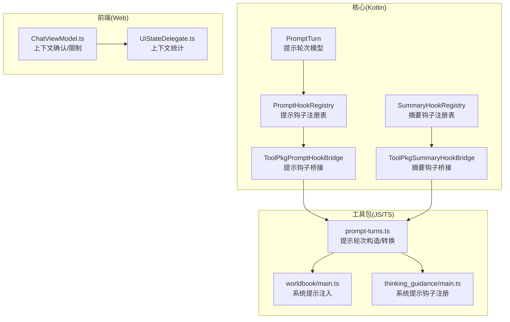
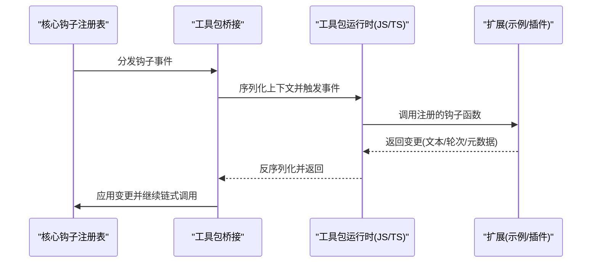
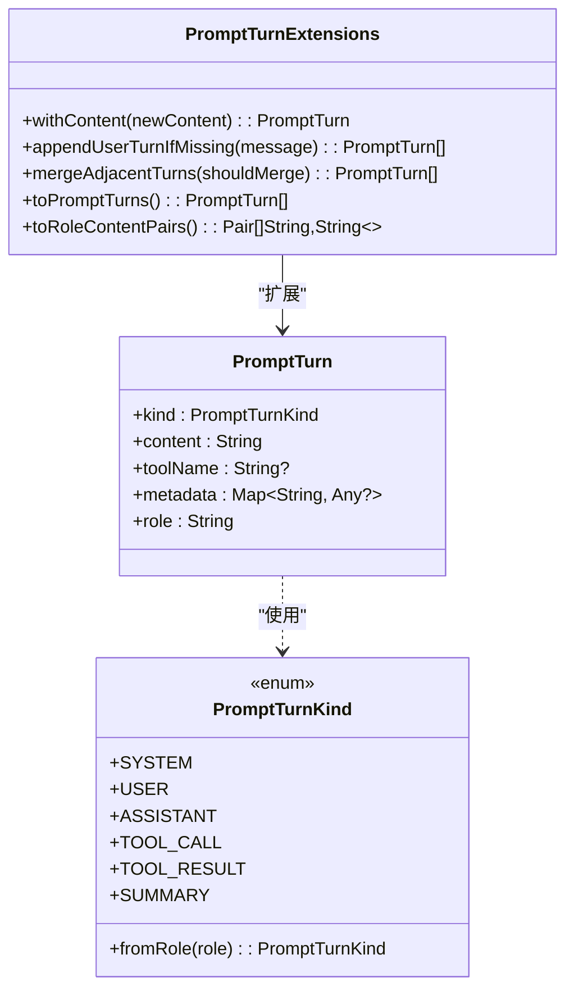
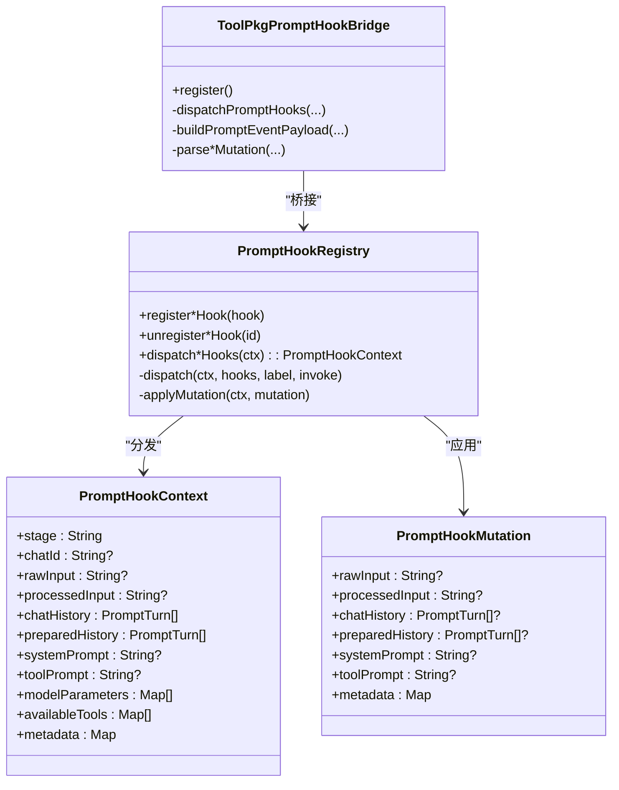
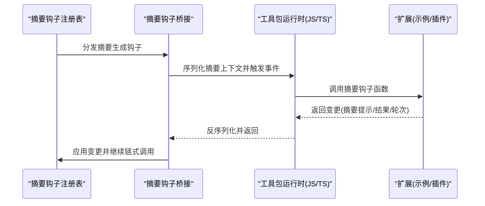
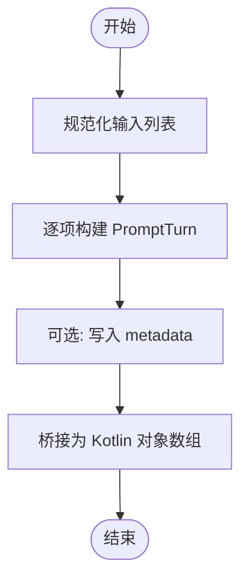
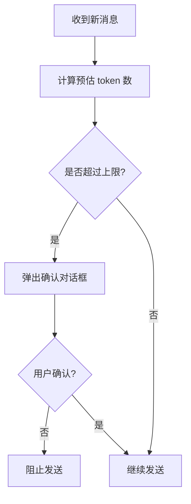
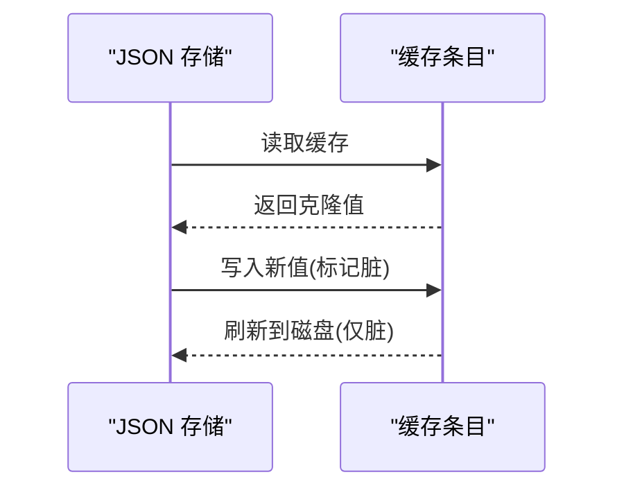
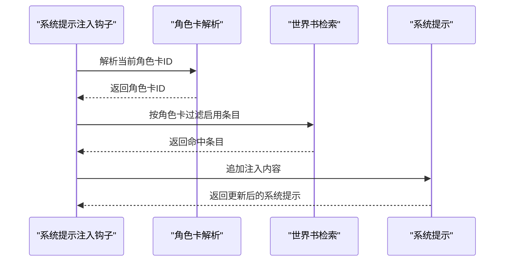
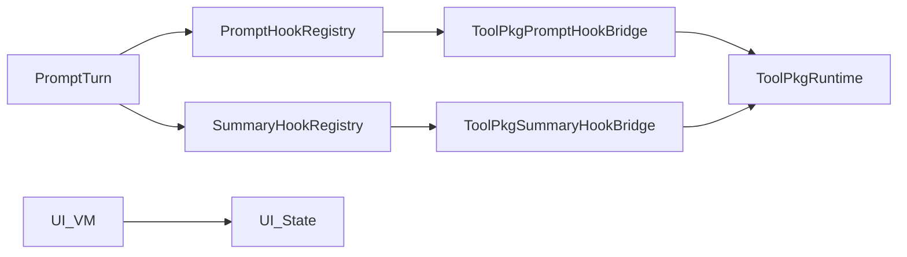

# 上下文管理

<cite>
**本文引用的文件**
- [PromptTurn.kt](file://app/src/main/java/com/ai/assistance/operit/core/chat/hooks/PromptTurn.kt)
- [PromptHookRegistry.kt](file://app/src/main/java/com/ai/assistance/operit/core/chat/hooks/PromptHookRegistry.kt)
- [SummaryHookRegistry.kt](file://app/src/main/java/com/ai/assistance/operit/core/chat/hooks/SummaryHookRegistry.kt)
- [ToolPkgPromptHookBridge.kt](file://app/src/main/java/com/ai/assistance/operit/plugins/toolpkg/ToolPkgPromptHookBridge.kt)
- [ToolPkgSummaryHookBridge.kt](file://app/src/main/java/com/ai/assistance/operit/plugins/toolpkg/ToolPkgSummaryHookBridge.kt)
- [prompt-turns.ts](file://examples/deepsearching/src/prompt-turns.ts)
- [main.ts（worldbook）](file://examples/worldbook/src/main.ts)
- [main.ts（thinking_guidance）](file://examples/thinking_guidance/src/main.ts)
- [UiStateDelegate.ts](file://web-chat/src/ui/features/chat/viewmodel/UiStateDelegate.ts)
- [ChatViewModel.ts](file://web-chat/src/ui/features/chat/viewmodel/ChatViewModel.ts)
- [qqbot_state.ts](file://examples/qqbot/src/shared/qqbot_state.ts)
</cite>

## 目录
1. [引言](#引言)
2. [项目结构](#项目结构)
3. [核心组件](#核心组件)
4. [架构总览](#架构总览)
5. [详细组件分析](#详细组件分析)
6. [依赖关系分析](#依赖关系分析)
7. [性能考量](#性能考量)
8. [故障排查指南](#故障排查指南)
9. [结论](#结论)
10. [附录](#附录)

## 引言
本文件围绕 Operit 的上下文管理系统进行深入技术解析，重点覆盖以下方面：
- 上下文的动态构建与维护：历史对话的上下文提取、角色卡的上下文绑定、记忆系统的上下文集成
- 上下文钩子系统：PromptTurnAppend、PromptTurnConversion 等钩子的作用与实现
- 聊天格式转换器：不同格式的转换、元数据处理、结构化数据管理
- 上下文窗口优化策略：重要信息优先级排序、冗余信息过滤、长度控制
- 缓存、增量更新、版本管理等技术细节
- 面向开发者的定制指导：如何实现自定义上下文处理、优化上下文质量、处理大规模对话历史

## 项目结构
Operit 的上下文管理由 Kotlin 核心模块与 JavaScript/TypeScript 扩展包共同组成：
- 核心层（Kotlin）：定义 PromptTurn 数据模型、上下文钩子接口与注册表、桥接到工具包（ToolPkg）的桥接器
- 工具包层（JavaScript/TypeScript）：通过 ToolPkg 暴露钩子事件，实现系统提示词注入、历史对话处理、摘要生成等扩展逻辑
- 前端层（Web）：提供上下文统计与窗口限制的 UI 层面支持
- 示例层（Examples）：演示世界书注入、思考引导、QQ机器人状态持久化等场景

图表来源
- [PromptTurn.kt:1-114](file://app/src/main/java/com/ai/assistance/operit/core/chat/hooks/PromptTurn.kt#L1-L114)
- [PromptHookRegistry.kt:1-274](file://app/src/main/java/com/ai/assistance/operit/core/chat/hooks/PromptHookRegistry.kt#L1-L274)
- [SummaryHookRegistry.kt:1-100](file://app/src/main/java/com/ai/assistance/operit/core/chat/hooks/SummaryHookRegistry.kt#L1-L100)
- [ToolPkgPromptHookBridge.kt:1-493](file://app/src/main/java/com/ai/assistance/operit/plugins/toolpkg/ToolPkgPromptHookBridge.kt#L1-L493)
- [ToolPkgSummaryHookBridge.kt:1-222](file://app/src/main/java/com/ai/assistance/operit/plugins/toolpkg/ToolPkgSummaryHookBridge.kt#L1-L222)
- [prompt-turns.ts:1-142](file://examples/deepsearching/src/prompt-turns.ts#L1-L142)
- [main.ts（worldbook）:148-190](file://examples/worldbook/src/main.ts#L148-L190)
- [main.ts（thinking_guidance）:83-99](file://examples/thinking_guidance/src/main.ts#L83-L99)
- [UiStateDelegate.ts:1-61](file://web-chat/src/ui/features/chat/viewmodel/UiStateDelegate.ts#L1-L61)
- [ChatViewModel.ts:794-837](file://web-chat/src/ui/features/chat/viewmodel/ChatViewModel.ts#L794-L837)

章节来源
- [PromptTurn.kt:1-114](file://app/src/main/java/com/ai/assistance/operit/core/chat/hooks/PromptTurn.kt#L1-L114)
- [PromptHookRegistry.kt:1-274](file://app/src/main/java/com/ai/assistance/operit/core/chat/hooks/PromptHookRegistry.kt#L1-L274)
- [SummaryHookRegistry.kt:1-100](file://app/src/main/java/com/ai/assistance/operit/core/chat/hooks/SummaryHookRegistry.kt#L1-L100)
- [ToolPkgPromptHookBridge.kt:1-493](file://app/src/main/java/com/ai/assistance/operit/plugins/toolpkg/ToolPkgPromptHookBridge.kt#L1-L493)
- [ToolPkgSummaryHookBridge.kt:1-222](file://app/src/main/java/com/ai/assistance/operit/plugins/toolpkg/ToolPkgSummaryHookBridge.kt#L1-L222)
- [prompt-turns.ts:1-142](file://examples/deepsearching/src/prompt-turns.ts#L1-L142)
- [main.ts（worldbook）:148-190](file://examples/worldbook/src/main.ts#L148-L190)
- [main.ts（thinking_guidance）:83-99](file://examples/thinking_guidance/src/main.ts#L83-L99)
- [UiStateDelegate.ts:1-61](file://web-chat/src/ui/features/chat/viewmodel/UiStateDelegate.ts#L1-L61)
- [ChatViewModel.ts:794-837](file://web-chat/src/ui/features/chat/viewmodel/ChatViewModel.ts#L794-L837)

## 核心组件
- 提示轮次模型（PromptTurn）
  - 定义角色类型（系统、用户、助手、工具调用、工具结果、摘要），并提供从角色字符串到枚举的映射、角色到内容对的互转、合并相邻轮次、追加用户轮次等工具函数
- 提示钩子注册表（PromptHookRegistry）
  - 定义输入、历史、估计历史、系统提示词合成、工具提示词合成、最终化等钩子接口与执行流程；提供线程安全的注册与分发机制
- 摘要钩子注册表（SummaryHookRegistry）
  - 定义摘要生成阶段的钩子接口与执行流程，支持在摘要生成前后注入或修改上下文
- 工具包桥接（ToolPkgPromptHookBridge / ToolPkgSummaryHookBridge）
  - 将 Kotlin 钩子注册表与 ToolPkg 的 JS/TS 钩子事件打通，负责事件载荷序列化/反序列化、回调执行与变更应用
- 提示轮次转换器（prompt-turns.ts）
  - 在 JS/TS 侧提供 PromptTurn 构造、规范化、与 Kotlin 对象桥接的转换方法，支持 metadata 元数据传递
- 前端上下文统计（UiStateDelegate.ts / ChatViewModel.ts）
  - 提供上下文大小估算、窗口上限检查与交互确认，辅助用户避免超出模型上下文限制

章节来源
- [PromptTurn.kt:1-114](file://app/src/main/java/com/ai/assistance/operit/core/chat/hooks/PromptTurn.kt#L1-L114)
- [PromptHookRegistry.kt:1-274](file://app/src/main/java/com/ai/assistance/operit/core/chat/hooks/PromptHookRegistry.kt#L1-L274)
- [SummaryHookRegistry.kt:1-100](file://app/src/main/java/com/ai/assistance/operit/core/chat/hooks/SummaryHookRegistry.kt#L1-L100)
- [ToolPkgPromptHookBridge.kt:1-493](file://app/src/main/java/com/ai/assistance/operit/plugins/toolpkg/ToolPkgPromptHookBridge.kt#L1-L493)
- [ToolPkgSummaryHookBridge.kt:1-222](file://app/src/main/java/com/ai/assistance/operit/plugins/toolpkg/ToolPkgSummaryHookBridge.kt#L1-L222)
- [prompt-turns.ts:1-142](file://examples/deepsearching/src/prompt-turns.ts#L1-L142)
- [UiStateDelegate.ts:1-61](file://web-chat/src/ui/features/chat/viewmodel/UiStateDelegate.ts#L1-L61)
- [ChatViewModel.ts:794-837](file://web-chat/src/ui/features/chat/viewmodel/ChatViewModel.ts#L794-L837)

## 架构总览
Operit 的上下文管理采用“核心钩子 + 工具包桥接 + 外部扩展”的分层设计：
- 核心层负责上下文数据结构与钩子生命周期
- 桥接层负责将 Kotlin 钩子与 ToolPkg 的 JS/TS 钩子事件互通
- 扩展层（示例与插件）通过钩子实现具体业务逻辑（如世界书注入、思考模式提示词）

图表来源
- [PromptHookRegistry.kt:163-231](file://app/src/main/java/com/ai/assistance/operit/core/chat/hooks/PromptHookRegistry.kt#L163-L231)
- [ToolPkgPromptHookBridge.kt:159-217](file://app/src/main/java/com/ai/assistance/operit/plugins/toolpkg/ToolPkgPromptHookBridge.kt#L159-L217)

## 详细组件分析

### 组件A：提示轮次模型与格式转换器
- PromptTurn 数据模型
  - 角色枚举与角色字符串互转
  - 角色到内容对互转、合并相邻轮次、追加用户轮次
- 转换器（prompt-turns.ts）
  - 构造 PromptTurn、规范化列表、桥接到 Kotlin 对象数组
  - 支持 metadata 元数据传递，便于扩展字段（如工具名、来源标识等）

图表来源
- [PromptTurn.kt:26-114](file://app/src/main/java/com/ai/assistance/operit/core/chat/hooks/PromptTurn.kt#L26-L114)

章节来源
- [PromptTurn.kt:1-114](file://app/src/main/java/com/ai/assistance/operit/core/chat/hooks/PromptTurn.kt#L1-L114)
- [prompt-turns.ts:1-142](file://examples/deepsearching/src/prompt-turns.ts#L1-L142)

### 组件B：上下文钩子系统
- 钩子接口族
  - 输入钩子、历史钩子、估计历史钩子、系统提示合成钩子、工具提示合成钩子、最终化钩子、估计最终化钩子
- 注册与分发
  - 使用并发安全集合注册钩子；按顺序分发，捕获异常并继续链式调用；变更合并与元数据合并
- 与工具包桥接
  - 将 Kotlin 钩子映射为 ToolPkg 事件，序列化上下文，回调 JS/TS 函数，反序列化返回值并应用变更

图表来源
- [PromptHookRegistry.kt:77-273](file://app/src/main/java/com/ai/assistance/operit/core/chat/hooks/PromptHookRegistry.kt#L77-L273)
- [ToolPkgPromptHookBridge.kt:31-217](file://app/src/main/java/com/ai/assistance/operit/plugins/toolpkg/ToolPkgPromptHookBridge.kt#L31-L217)

章节来源
- [PromptHookRegistry.kt:1-274](file://app/src/main/java/com/ai/assistance/operit/core/chat/hooks/PromptHookRegistry.kt#L1-L274)
- [ToolPkgPromptHookBridge.kt:1-493](file://app/src/main/java/com/ai/assistance/operit/plugins/toolpkg/ToolPkgPromptHookBridge.kt#L1-L493)

### 组件C：摘要钩子与摘要生成
- 摘要钩子注册表
  - 定义摘要生成阶段的上下文与变更对象，支持在摘要生成前/后注入或修改系统提示、摘要提示、摘要结果
- 与工具包桥接
  - 将 Kotlin 摘要钩子映射为 ToolPkg 事件，序列化上下文，回调 JS/TS 函数，反序列化返回值并应用变更

图表来源
- [SummaryHookRegistry.kt:36-99](file://app/src/main/java/com/ai/assistance/operit/core/chat/hooks/SummaryHookRegistry.kt#L36-L99)
- [ToolPkgSummaryHookBridge.kt:51-107](file://app/src/main/java/com/ai/assistance/operit/plugins/toolpkg/ToolPkgSummaryHookBridge.kt#L51-L107)

章节来源
- [SummaryHookRegistry.kt:1-100](file://app/src/main/java/com/ai/assistance/operit/core/chat/hooks/SummaryHookRegistry.kt#L1-L100)
- [ToolPkgSummaryHookBridge.kt:1-222](file://app/src/main/java/com/ai/assistance/operit/plugins/toolpkg/ToolPkgSummaryHookBridge.kt#L1-L222)

### 组件D：聊天格式转换器与元数据处理
- 不同格式的转换
  - 角色字符串与 PromptTurn 的互转、轮次列表与角色内容对的互转
- 元数据处理
  - metadata 字段用于携带工具名、来源标识、时间戳等扩展信息
- 结构化数据管理
  - 通过统一的数据模型与桥接层，确保 Kotlin 与 JS/TS 侧的数据一致性

图表来源
- [prompt-turns.ts:31-69](file://examples/deepsearching/src/prompt-turns.ts#L31-L69)
- [PromptTurn.kt:103-114](file://app/src/main/java/com/ai/assistance/operit/core/chat/hooks/PromptTurn.kt#L103-L114)

章节来源
- [prompt-turns.ts:1-142](file://examples/deepsearching/src/prompt-turns.ts#L1-L142)
- [PromptTurn.kt:1-114](file://app/src/main/java/com/ai/assistance/operit/core/chat/hooks/PromptTurn.kt#L1-L114)

### 组件E：上下文窗口优化策略
- 重要信息优先级排序
  - 通过钩子在“before_prepare_history”阶段对历史进行筛选与重排，保留关键对话与工具调用结果
- 冗余信息过滤
  - 合并相邻相同角色轮次，去除重复或空内容
- 长度控制
  - 前端提供上下文统计与确认弹窗，避免超出模型上下文上限

图表来源
- [UiStateDelegate.ts:31-53](file://web-chat/src/ui/features/chat/viewmodel/UiStateDelegate.ts#L31-L53)
- [ChatViewModel.ts:823-837](file://web-chat/src/ui/features/chat/viewmodel/ChatViewModel.ts#L823-L837)

章节来源
- [UiStateDelegate.ts:1-61](file://web-chat/src/ui/features/chat/viewmodel/UiStateDelegate.ts#L1-L61)
- [ChatViewModel.ts:794-837](file://web-chat/src/ui/features/chat/viewmodel/ChatViewModel.ts#L794-L837)

### 组件F：上下文缓存、增量更新与版本管理
- 缓存与持久化
  - 使用缓存 JSON 存储与异步刷新，避免频繁 IO；仅在脏标记为 true 时写回
- 增量更新
  - 通过钩子在“before_prepare_history”阶段对历史进行增量裁剪与合并
- 版本管理
  - 通过 metadata 或钩子版本号区分不同版本的上下文处理策略

图表来源
- [qqbot_state.ts:54-89](file://examples/qqbot/src/shared/qqbot_state.ts#L54-L89)

章节来源
- [qqbot_state.ts:1-120](file://examples/qqbot/src/shared/qqbot_state.ts#L1-L120)

### 组件G：角色卡与记忆系统的上下文绑定
- 角色卡绑定
  - 在系统提示注入阶段根据当前角色卡 ID 进行条件匹配，仅注入适用于该角色卡的内容
- 记忆系统集成
  - 通过世界书注入示例，将检索到的记忆条目注入到系统提示中，形成“角色卡 + 记忆”的上下文组合

图表来源
- [main.ts（worldbook）:152-190](file://examples/worldbook/src/main.ts#L152-L190)

章节来源
- [main.ts（worldbook）:148-190](file://examples/worldbook/src/main.ts#L148-L190)

### 组件H：自定义上下文处理与最佳实践
- 自定义钩子
  - 在 JS/TS 中注册系统提示合成钩子、消息处理钩子等，实现个性化上下文增强
- 优化上下文质量
  - 使用合并相邻轮次、过滤冗余、保留关键工具调用结果等策略
- 处理大规模对话历史
  - 通过估计历史钩子进行预裁剪，减少后续处理成本

章节来源
- [main.ts（thinking_guidance）:83-99](file://examples/thinking_guidance/src/main.ts#L83-L99)
- [ToolPkgPromptHookBridge.kt:159-217](file://app/src/main/java/com/ai/assistance/operit/plugins/toolpkg/ToolPkgPromptHookBridge.kt#L159-L217)

## 依赖关系分析
- PromptTurn 作为数据模型被所有钩子与桥接层依赖
- PromptHookRegistry 与 SummaryHookRegistry 是核心调度中心，分别被 ToolPkgPromptHookBridge 与 ToolPkgSummaryHookBridge 依赖
- ToolPkgPromptHookBridge 与 ToolPkgSummaryHookBridge 依赖工具包运行时以执行 JS/TS 钩子函数
- 前端 UI 通过上下文统计与确认逻辑间接影响上下文窗口使用行为

图表来源
- [PromptTurn.kt:1-114](file://app/src/main/java/com/ai/assistance/operit/core/chat/hooks/PromptTurn.kt#L1-L114)
- [PromptHookRegistry.kt:1-274](file://app/src/main/java/com/ai/assistance/operit/core/chat/hooks/PromptHookRegistry.kt#L1-L274)
- [SummaryHookRegistry.kt:1-100](file://app/src/main/java/com/ai/assistance/operit/core/chat/hooks/SummaryHookRegistry.kt#L1-L100)
- [ToolPkgPromptHookBridge.kt:1-493](file://app/src/main/java/com/ai/assistance/operit/plugins/toolpkg/ToolPkgPromptHookBridge.kt#L1-L493)
- [ToolPkgSummaryHookBridge.kt:1-222](file://app/src/main/java/com/ai/assistance/operit/plugins/toolpkg/ToolPkgSummaryHookBridge.kt#L1-L222)
- [UiStateDelegate.ts:1-61](file://web-chat/src/ui/features/chat/viewmodel/UiStateDelegate.ts#L1-L61)
- [ChatViewModel.ts:794-837](file://web-chat/src/ui/features/chat/viewmodel/ChatViewModel.ts#L794-L837)

## 性能考量
- 钩子链路短路与异常隔离：分发过程中捕获异常并继续执行，避免单点失败导致整体阻塞
- 并发安全：使用并发安全集合存储钩子，保证多线程环境下的稳定性
- 历史预处理：通过估计历史钩子进行预裁剪，降低后续处理开销
- 前端上下文估算：基于 token 估算与上限检查，减少无效请求

## 故障排查指南
- 钩子回调异常
  - 现象：某钩子执行失败但不影响其他钩子
  - 排查：查看日志标签与异常堆栈，定位具体钩子 ID 与容器包名
- 数据不一致
  - 现象：JS/TS 侧传入的 PromptTurn 无法正确映射到 Kotlin
  - 排查：检查 kind 名称大小写、content 是否为空、metadata 是否为对象
- 上下文超限
  - 现象：发送按钮被拦截或弹出确认对话框
  - 排查：检查前端上下文统计与模型参数中的最大窗口配置

章节来源
- [PromptHookRegistry.kt:242-246](file://app/src/main/java/com/ai/assistance/operit/core/chat/hooks/PromptHookRegistry.kt#L242-L246)
- [ToolPkgPromptHookBridge.kt:186-202](file://app/src/main/java/com/ai/assistance/operit/plugins/toolpkg/ToolPkgPromptHookBridge.kt#L186-L202)
- [ToolPkgSummaryHookBridge.kt:77-94](file://app/src/main/java/com/ai/assistance/operit/plugins/toolpkg/ToolPkgSummaryHookBridge.kt#L77-L94)

## 结论
Operit 的上下文管理系统通过统一的数据模型、完善的钩子体系与工具包桥接，实现了灵活且可扩展的上下文构建与维护能力。结合前端上下文统计与确认机制，能够在保证用户体验的同时有效控制上下文长度。开发者可通过注册自定义钩子与优化历史预处理策略，进一步提升上下文质量与性能。

## 附录
- 快速参考
  - 提示轮次模型：[PromptTurn.kt:26-58](file://app/src/main/java/com/ai/assistance/operit/core/chat/hooks/PromptTurn.kt#L26-L58)
  - 钩子注册表：[PromptHookRegistry.kt:77-273](file://app/src/main/java/com/ai/assistance/operit/core/chat/hooks/PromptHookRegistry.kt#L77-L273)
  - 摘要钩子注册表：[SummaryHookRegistry.kt:36-99](file://app/src/main/java/com/ai/assistance/operit/core/chat/hooks/SummaryHookRegistry.kt#L36-L99)
  - 工具包桥接（提示）：[ToolPkgPromptHookBridge.kt:159-217](file://app/src/main/java/com/ai/assistance/operit/plugins/toolpkg/ToolPkgPromptHookBridge.kt#L159-L217)
  - 工具包桥接（摘要）：[ToolPkgSummaryHookBridge.kt:51-107](file://app/src/main/java/com/ai/assistance/operit/plugins/toolpkg/ToolPkgSummaryHookBridge.kt#L51-L107)
  - 转换器（JS/TS）：[prompt-turns.ts:12-69](file://examples/deepsearching/src/prompt-turns.ts#L12-L69)
  - 世界书注入示例：[main.ts（worldbook）:152-190](file://examples/worldbook/src/main.ts#L152-L190)
  - 思考引导钩子注册：[main.ts（thinking_guidance）:83-99](file://examples/thinking_guidance/src/main.ts#L83-L99)
  - 上下文统计与确认：[UiStateDelegate.ts:31-53](file://web-chat/src/ui/features/chat/viewmodel/UiStateDelegate.ts#L31-L53)、[ChatViewModel.ts:823-837](file://web-chat/src/ui/features/chat/viewmodel/ChatViewModel.ts#L823-L837)
  - 缓存与持久化：[qqbot_state.ts:54-89](file://examples/qqbot/src/shared/qqbot_state.ts#L54-L89)