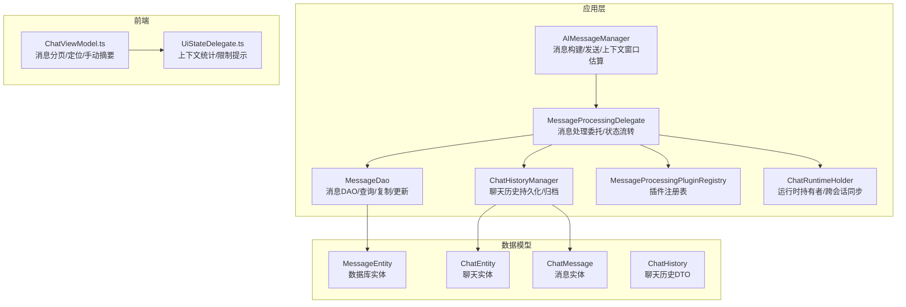
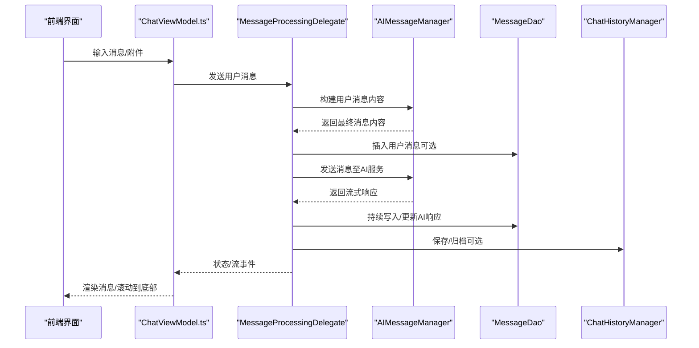
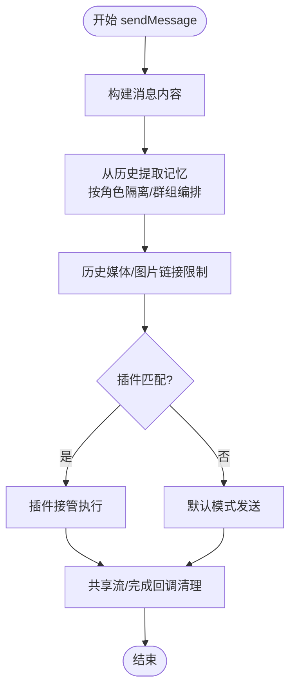
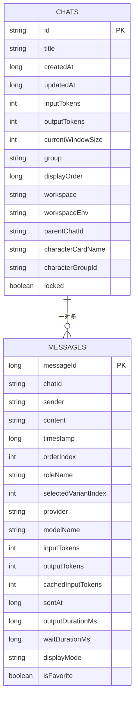
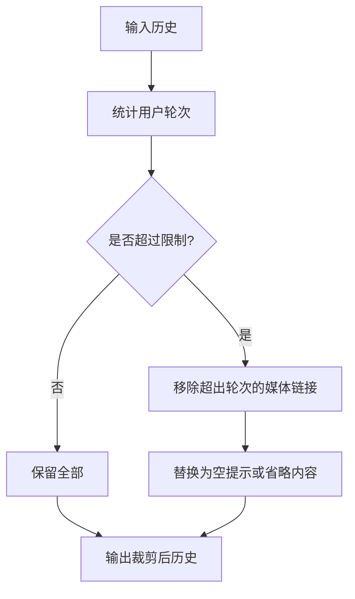
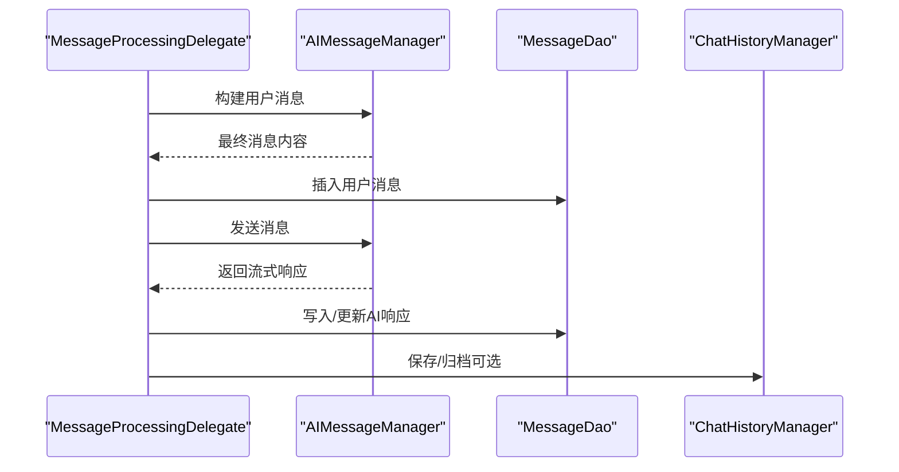
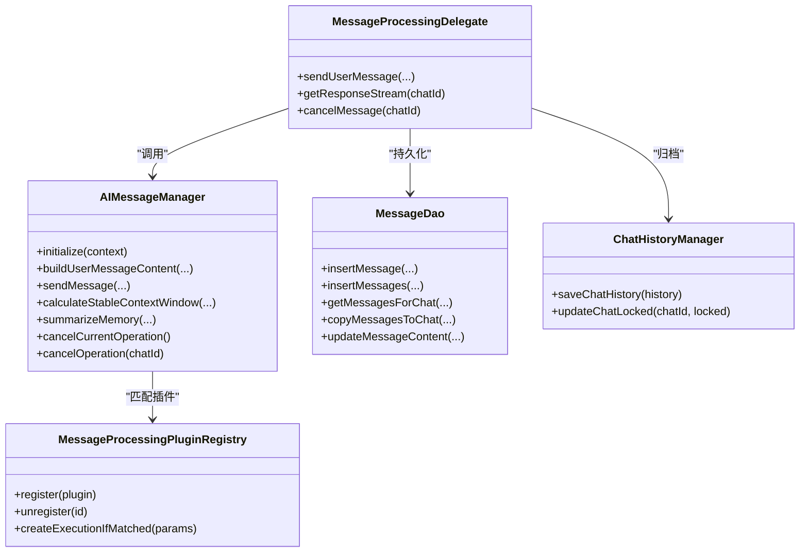

# 对话管理机制

<cite>
**本文引用的文件**
- [AIMessageManager.kt](file://app/src/main/java/com/ai/assistance/operit/core/chat/AIMessageManager.kt)
- [ChatMessage.kt](file://app/src/main/java/com/ai/assistance/operit/data/model/ChatMessage.kt)
- [MessageEntity.kt](file://app/src/main/java/com/ai/assistance/operit/data/model/MessageEntity.kt)
- [ChatEntity.kt](file://app/src/main/java/com/ai/assistance/operit/data/model/ChatEntity.kt)
- [ChatHistory.kt](file://app/src/main/java/com/ai/assistance/operit/data/model/ChatHistory.kt)
- [MessageDao.kt](file://app/src/main/java/com/ai/assistance/operit/data/dao/MessageDao.kt)
- [ChatRuntimeHolder.kt](file://app/src/main/java/com/ai/assistance/operit/api/chat/ChatRuntimeHolder.kt)
- [MessageProcessingPluginRegistry.kt](file://app/src/main/java/com/ai/assistance/operit/core/chat/plugins/MessageProcessingPluginRegistry.kt)
- [MessageProcessingDelegate.kt](file://app/src/main/java/com/ai/assistance/operit/services/core/MessageProcessingDelegate.kt)
- [ChatHistoryManager.kt](file://app/src/main/java/com/ai/assistance/operit/data/repository/ChatHistoryManager.kt)
- [MemoryAutoSaveCandidateRepository.kt](file://app/src/main/java/com/ai/assistance/operit/data/repository/MemoryAutoSaveCandidateRepository.kt)
- [ChatViewModel.ts](file://web-chat/src/ui/features/chat/viewmodel/ChatViewModel.ts)
- [UiStateDelegate.ts](file://web-chat/src/ui/features/chat/viewmodel/UiStateDelegate.ts)
- [context_limiter_c.ts](file://examples/context_limiter_c/src/main.ts)
</cite>

## 目录
1. [简介](#简介)
2. [项目结构](#项目结构)
3. [核心组件](#核心组件)
4. [架构总览](#架构总览)
5. [详细组件分析](#详细组件分析)
6. [依赖关系分析](#依赖关系分析)
7. [性能考量](#性能考量)
8. [故障排查指南](#故障排查指南)
9. [结论](#结论)
10. [附录](#附录)

## 简介
本文件系统性梳理 Operit 的对话管理机制，围绕多轮对话的状态维护、消息与聊天实体设计、AIMessageManager 的核心能力（发送、接收、状态跟踪、错误处理）、上下文窗口与历史截断策略、消息生命周期、持久化与并发安全、消息去重与冲突处理、以及扩展点与最佳实践展开。文档面向开发者，既提供代码级视图，也给出可视化流程图与实用建议。

## 项目结构
Operit 的对话管理横跨 Android 应用层与 Web 前端，核心模块包括：
- 应用层（Kotlin/Android）：AIMessageManager、消息与聊天实体、DAO、运行时持有者、消息处理委托、插件注册表、历史管理与自动保存候选仓库。
- 前端（TypeScript/React）：聊天视图模型与 UI 状态代理，负责上下文统计、分页加载与上下文限制确认。

图表来源
- [AIMessageManager.kt:1-1379](file://app/src/main/java/com/ai/assistance/operit/core/chat/AIMessageManager.kt#L1-L1379)
- [MessageProcessingDelegate.kt:1-1693](file://app/src/main/java/com/ai/assistance/operit/services/core/MessageProcessingDelegate.kt#L1-L1693)
- [MessageProcessingPluginRegistry.kt:1-64](file://app/src/main/java/com/ai/assistance/operit/core/chat/plugins/MessageProcessingPluginRegistry.kt#L1-L64)
- [ChatHistoryManager.kt:164-641](file://app/src/main/java/com/ai/assistance/operit/data/repository/ChatHistoryManager.kt#L164-L641)
- [MessageDao.kt:1-284](file://app/src/main/java/com/ai/assistance/operit/data/dao/MessageDao.kt#L1-L284)
- [ChatRuntimeHolder.kt:1-201](file://app/src/main/java/com/ai/assistance/operit/api/chat/ChatRuntimeHolder.kt#L1-L201)
- [ChatMessage.kt:1-100](file://app/src/main/java/com/ai/assistance/operit/data/model/ChatMessage.kt#L1-L100)
- [MessageEntity.kt:1-95](file://app/src/main/java/com/ai/assistance/operit/data/model/MessageEntity.kt#L1-L95)
- [ChatEntity.kt:1-92](file://app/src/main/java/com/ai/assistance/operit/data/model/ChatEntity.kt#L1-L92)
- [ChatHistory.kt:1-29](file://app/src/main/java/com/ai/assistance/operit/data/model/ChatHistory.kt#L1-L29)
- [ChatViewModel.ts:794-837](file://web-chat/src/ui/features/chat/viewmodel/ChatViewModel.ts#L794-L837)
- [UiStateDelegate.ts:1-61](file://web-chat/src/ui/features/chat/viewmodel/UiStateDelegate.ts#L1-L61)

章节来源
- [AIMessageManager.kt:1-1379](file://app/src/main/java/com/ai/assistance/operit/core/chat/AIMessageManager.kt#L1-L1379)
- [MessageProcessingDelegate.kt:1-1693](file://app/src/main/java/com/ai/assistance/operit/services/core/MessageProcessingDelegate.kt#L1-L1693)
- [MessageProcessingPluginRegistry.kt:1-64](file://app/src/main/java/com/ai/assistance/operit/core/chat/plugins/MessageProcessingPluginRegistry.kt#L1-L64)
- [ChatHistoryManager.kt:164-641](file://app/src/main/java/com/ai/assistance/operit/data/repository/ChatHistoryManager.kt#L164-L641)
- [MessageDao.kt:1-284](file://app/src/main/java/com/ai/assistance/operit/data/dao/MessageDao.kt#L1-L284)
- [ChatRuntimeHolder.kt:1-201](file://app/src/main/java/com/ai/assistance/operit/api/chat/ChatRuntimeHolder.kt#L1-L201)
- [ChatMessage.kt:1-100](file://app/src/main/java/com/ai/assistance/operit/data/model/ChatMessage.kt#L1-L100)
- [MessageEntity.kt:1-95](file://app/src/main/java/com/ai/assistance/operit/data/model/MessageEntity.kt#L1-L95)
- [ChatEntity.kt:1-92](file://app/src/main/java/com/ai/assistance/operit/data/model/ChatEntity.kt#L1-L92)
- [ChatHistory.kt:1-29](file://app/src/main/java/com/ai/assistance/operit/data/model/ChatHistory.kt#L1-L29)
- [ChatViewModel.ts:794-837](file://web-chat/src/ui/features/chat/viewmodel/ChatViewModel.ts#L794-L837)
- [UiStateDelegate.ts:1-61](file://web-chat/src/ui/features/chat/viewmodel/UiStateDelegate.ts#L1-L61)

## 核心组件
- AIMessageManager：负责消息构建、发送、上下文窗口估算、历史截断、总结生成、取消控制等。其设计强调“无状态”，通过参数传递上下文，避免在单例内持有聊天状态。
- MessageProcessingDelegate：协调消息发送流程，管理流式响应、状态流转、工具调用计数、自动朗读、跨会话同步、取消与持久化。
- 数据模型：ChatMessage（运行态消息）、MessageEntity（数据库实体）、ChatEntity/ChatHistory（聊天元数据与历史），支撑消息持久化与 UI 展示。
- DAO：MessageDao 提供按时间窗口、范围、变体等复杂查询，支持消息复制、变体选择、收藏标记等。
- ChatHistoryManager：负责聊天历史的保存、归档、变体管理、并发互斥保护。
- ChatRuntimeHolder：持有多个运行时核心实例，跨会话同步当前聊天与令牌统计。
- 插件注册表：MessageProcessingPluginRegistry 支持消息处理插件接管发送流程。

章节来源
- [AIMessageManager.kt:1-1379](file://app/src/main/java/com/ai/assistance/operit/core/chat/AIMessageManager.kt#L1-L1379)
- [MessageProcessingDelegate.kt:1-1693](file://app/src/main/java/com/ai/assistance/operit/services/core/MessageProcessingDelegate.kt#L1-L1693)
- [ChatMessage.kt:1-100](file://app/src/main/java/com/ai/assistance/operit/data/model/ChatMessage.kt#L1-L100)
- [MessageEntity.kt:1-95](file://app/src/main/java/com/ai/assistance/operit/data/model/MessageEntity.kt#L1-L95)
- [ChatEntity.kt:1-92](file://app/src/main/java/com/ai/assistance/operit/data/model/ChatEntity.kt#L1-L92)
- [ChatHistory.kt:1-29](file://app/src/main/java/com/ai/assistance/operit/data/model/ChatHistory.kt#L1-L29)
- [MessageDao.kt:1-284](file://app/src/main/java/com/ai/assistance/operit/data/dao/MessageDao.kt#L1-L284)
- [ChatHistoryManager.kt:164-641](file://app/src/main/java/com/ai/assistance/operit/data/repository/ChatHistoryManager.kt#L164-L641)
- [ChatRuntimeHolder.kt:1-201](file://app/src/main/java/com/ai/assistance/operit/api/chat/ChatRuntimeHolder.kt#L1-L201)
- [MessageProcessingPluginRegistry.kt:1-64](file://app/src/main/java/com/ai/assistance/operit/core/chat/plugins/MessageProcessingPluginRegistry.kt#L1-L64)

## 架构总览
Operit 的对话管理采用“委托-插件-DAO-持久化”的分层架构：
- 委托层（MessageProcessingDelegate）负责端到端流程编排与状态管理；
- 插件层（MessageProcessingPluginRegistry）提供可扩展的消息处理能力；
- 数据层（ChatMessage/MessageEntity/ChatEntity + MessageDao）提供统一的数据模型与查询能力；
- 运行时层（ChatRuntimeHolder）保障跨会话一致性与统计；
- 前端层（ChatViewModel/UiStateDelegate）负责上下文统计与交互提示。

图表来源
- [MessageProcessingDelegate.kt:492-800](file://app/src/main/java/com/ai/assistance/operit/services/core/MessageProcessingDelegate.kt#L492-L800)
- [AIMessageManager.kt:299-481](file://app/src/main/java/com/ai/assistance/operit/core/chat/AIMessageManager.kt#L299-L481)
- [MessageDao.kt:173-179](file://app/src/main/java/com/ai/assistance/operit/data/dao/MessageDao.kt#L173-L179)
- [ChatHistoryManager.kt:606-641](file://app/src/main/java/com/ai/assistance/operit/data/repository/ChatHistoryManager.kt#L606-L641)
- [ChatViewModel.ts:794-837](file://web-chat/src/ui/features/chat/viewmodel/ChatViewModel.ts#L794-L837)

## 详细组件分析

### AIMessageManager：消息构建、发送与上下文管理
- 消息构建：支持代理发送者标签、回复标签、工作区附着、媒体直链与附件标签组合，具备性能计时日志。
- 发送流程：支持插件接管与默认模式；自动读取流式输出偏好；对历史进行图片/音视频链接限制；支持取消与清理。
- 上下文窗口：提供稳定上下文窗口估算接口，结合历史裁剪策略，避免超限。
- 总结生成：按角色隔离与群组编排模式，生成摘要消息并附加工具包预热块。
- 取消控制：按 chatId 取消插件执行、AI 对话与工具包 JS 执行。

图表来源
- [AIMessageManager.kt:299-481](file://app/src/main/java/com/ai/assistance/operit/core/chat/AIMessageManager.kt#L299-L481)
- [AIMessageManager.kt:535-581](file://app/src/main/java/com/ai/assistance/operit/core/chat/AIMessageManager.kt#L535-L581)
- [AIMessageManager.kt:383-421](file://app/src/main/java/com/ai/assistance/operit/core/chat/AIMessageManager.kt#L383-L421)

章节来源
- [AIMessageManager.kt:117-277](file://app/src/main/java/com/ai/assistance/operit/core/chat/AIMessageManager.kt#L117-L277)
- [AIMessageManager.kt:299-481](file://app/src/main/java/com/ai/assistance/operit/core/chat/AIMessageManager.kt#L299-L481)
- [AIMessageManager.kt:483-533](file://app/src/main/java/com/ai/assistance/operit/core/chat/AIMessageManager.kt#L483-L533)
- [AIMessageManager.kt:631-1040](file://app/src/main/java/com/ai/assistance/operit/core/chat/AIMessageManager.kt#L631-L1040)
- [AIMessageManager.kt:1255-1379](file://app/src/main/java/com/ai/assistance/operit/core/chat/AIMessageManager.kt#L1255-L1379)

### 数据模型与持久化
- ChatMessage：运行态消息，包含发送方、内容、时间戳、令牌统计、显示模式、收藏等；支持 Parcelable 以便跨进程传输。
- MessageEntity：数据库实体，与 ChatEntity 外键关联，索引优化查询；提供 toChatMessage/fromChatMessage 转换。
- ChatEntity/ChatHistory：聊天元数据与历史 DTO，支持 Room 存储与 UI 展示。
- MessageDao：提供按时间窗口、范围、变体、收藏、搜索等复杂查询；支持批量插入、复制、删除、更新。

图表来源
- [MessageEntity.kt:1-95](file://app/src/main/java/com/ai/assistance/operit/data/model/MessageEntity.kt#L1-L95)
- [ChatEntity.kt:1-92](file://app/src/main/java/com/ai/assistance/operit/data/model/ChatEntity.kt#L1-L92)
- [MessageDao.kt:1-284](file://app/src/main/java/com/ai/assistance/operit/data/dao/MessageDao.kt#L1-L284)

章节来源
- [ChatMessage.kt:1-100](file://app/src/main/java/com/ai/assistance/operit/data/model/ChatMessage.kt#L1-L100)
- [MessageEntity.kt:1-95](file://app/src/main/java/com/ai/assistance/operit/data/model/MessageEntity.kt#L1-L95)
- [ChatEntity.kt:1-92](file://app/src/main/java/com/ai/assistance/operit/data/model/ChatEntity.kt#L1-L92)
- [ChatHistory.kt:1-29](file://app/src/main/java/com/ai/assistance/operit/data/model/ChatHistory.kt#L1-L29)
- [MessageDao.kt:1-284](file://app/src/main/java/com/ai/assistance/operit/data/dao/MessageDao.kt#L1-L284)

### 上下文窗口与历史截断策略
- 图片/音视频链接限制：按用户轮次保留最近 N 轮，超出部分移除对应媒体链接并替换为省略提示。
- 稳定窗口估算：基于当前消息与历史计算可接受的历史长度，避免超限。
- 角色隔离与群组编排：在多角色或多参与者场景下，将其他角色消息桥接为用户消息，或在角色隔离模式下仅保留目标角色相关历史。

图表来源
- [AIMessageManager.kt:535-581](file://app/src/main/java/com/ai/assistance/operit/core/chat/AIMessageManager.kt#L535-L581)
- [AIMessageManager.kt:483-533](file://app/src/main/java/com/ai/assistance/operit/core/chat/AIMessageManager.kt#L483-L533)
- [AIMessageManager.kt:1255-1379](file://app/src/main/java/com/ai/assistance/operit/core/chat/AIMessageManager.kt#L1255-L1379)

章节来源
- [AIMessageManager.kt:535-581](file://app/src/main/java/com/ai/assistance/operit/core/chat/AIMessageManager.kt#L535-L581)
- [AIMessageManager.kt:483-533](file://app/src/main/java/com/ai/assistance/operit/core/chat/AIMessageManager.kt#L483-L533)
- [AIMessageManager.kt:1255-1379](file://app/src/main/java/com/ai/assistance/operit/core/chat/AIMessageManager.kt#L1255-L1379)

### 消息生命周期管理
- 创建：构建用户消息内容并插入数据库（可选隐藏占位符）。
- 流式发送：共享流持续写入 AI 响应，支持事件载体与重放缓存。
- 完成：合并流片段，补充令牌统计与时间指标，写入数据库。
- 归档：支持聊天历史归档与变体管理，保证变体索引与数量一致性。

图表来源
- [MessageProcessingDelegate.kt:492-800](file://app/src/main/java/com/ai/assistance/operit/services/core/MessageProcessingDelegate.kt#L492-L800)
- [AIMessageManager.kt:299-481](file://app/src/main/java/com/ai/assistance/operit/core/chat/AIMessageManager.kt#L299-L481)
- [MessageDao.kt:173-179](file://app/src/main/java/com/ai/assistance/operit/data/dao/MessageDao.kt#L173-L179)
- [ChatHistoryManager.kt:606-641](file://app/src/main/java/com/ai/assistance/operit/data/repository/ChatHistoryManager.kt#L606-L641)

章节来源
- [MessageProcessingDelegate.kt:344-434](file://app/src/main/java/com/ai/assistance/operit/services/core/MessageProcessingDelegate.kt#L344-L434)
- [MessageProcessingDelegate.kt:492-800](file://app/src/main/java/com/ai/assistance/operit/services/core/MessageProcessingDelegate.kt#L492-L800)
- [AIMessageManager.kt:299-481](file://app/src/main/java/com/ai/assistance/operit/core/chat/AIMessageManager.kt#L299-L481)
- [MessageDao.kt:173-179](file://app/src/main/java/com/ai/assistance/operit/data/dao/MessageDao.kt#L173-L179)
- [ChatHistoryManager.kt:606-641](file://app/src/main/java/com/ai/assistance/operit/data/repository/ChatHistoryManager.kt#L606-L641)

### 并发安全与消息去重
- 并发互斥：ChatHistoryManager 使用聊天 ID 锁（Mutex）保护保存/归档过程，避免并发写入冲突。
- 去重校验：归档保存前对消息时间戳唯一性进行校验，防止重复。
- 事务一致性：批量插入消息与变体时，先删除旧数据再插入，保证原子性。

章节来源
- [ChatHistoryManager.kt:546-641](file://app/src/main/java/com/ai/assistance/operit/data/repository/ChatHistoryManager.kt#L546-L641)

### 错误处理与取消
- 非致命错误：通过流式事件向 UI 层广播，避免中断主流程。
- 取消策略：AIMessageManager 支持按 chatId 取消插件执行与 AI 对话；MessageProcessingDelegate 在取消时可保留部分响应并补充统计。
- 工具包执行：取消工具包 JS 执行，避免残留副作用。

章节来源
- [AIMessageManager.kt:587-621](file://app/src/main/java/com/ai/assistance/operit/core/chat/AIMessageManager.kt#L587-L621)
- [MessageProcessingDelegate.kt:391-434](file://app/src/main/java/com/ai/assistance/operit/services/core/MessageProcessingDelegate.kt#L391-L434)

### 扩展点与自定义行为
- 插件系统：通过 MessageProcessingPluginRegistry 注册插件，匹配条件满足时接管消息处理。
- 自定义上下文窗口：参考 context_limiter_c 示例，按用户轮次截断历史，确保系统消息优先保留。
- 前端上下文限制提示：UiStateDelegate 计算当前窗口占用百分比，ChatViewModel 提供上下文限制确认与分页加载。

章节来源
- [MessageProcessingPluginRegistry.kt:38-63](file://app/src/main/java/com/ai/assistance/operit/core/chat/plugins/MessageProcessingPluginRegistry.kt#L38-L63)
- [context_limiter_c.ts:148-180](file://examples/context_limiter_c/src/main.ts#L148-L180)
- [UiStateDelegate.ts:31-53](file://web-chat/src/ui/features/chat/viewmodel/UiStateDelegate.ts#L31-L53)
- [ChatViewModel.ts:823-837](file://web-chat/src/ui/features/chat/viewmodel/ChatViewModel.ts#L823-L837)

## 依赖关系分析
AIMessageManager 与各组件的依赖关系如下：

图表来源
- [AIMessageManager.kt:1-1379](file://app/src/main/java/com/ai/assistance/operit/core/chat/AIMessageManager.kt#L1-L1379)
- [MessageProcessingDelegate.kt:1-1693](file://app/src/main/java/com/ai/assistance/operit/services/core/MessageProcessingDelegate.kt#L1-L1693)
- [MessageProcessingPluginRegistry.kt:1-64](file://app/src/main/java/com/ai/assistance/operit/core/chat/plugins/MessageProcessingPluginRegistry.kt#L1-L64)
- [MessageDao.kt:1-284](file://app/src/main/java/com/ai/assistance/operit/data/dao/MessageDao.kt#L1-L284)
- [ChatHistoryManager.kt:164-641](file://app/src/main/java/com/ai/assistance/operit/data/repository/ChatHistoryManager.kt#L164-L641)

章节来源
- [AIMessageManager.kt:1-1379](file://app/src/main/java/com/ai/assistance/operit/core/chat/AIMessageManager.kt#L1-L1379)
- [MessageProcessingDelegate.kt:1-1693](file://app/src/main/java/com/ai/assistance/operit/services/core/MessageProcessingDelegate.kt#L1-L1693)
- [MessageProcessingPluginRegistry.kt:1-64](file://app/src/main/java/com/ai/assistance/operit/core/chat/plugins/MessageProcessingPluginRegistry.kt#L1-L64)
- [MessageDao.kt:1-284](file://app/src/main/java/com/ai/assistance/operit/data/dao/MessageDao.kt#L1-L284)
- [ChatHistoryManager.kt:164-641](file://app/src/main/java/com/ai/assistance/operit/data/repository/ChatHistoryManager.kt#L164-L641)

## 性能考量
- 流式输出与节流：MessageProcessingDelegate 对滚动事件进行节流，降低 UI 抖动；流式写入与持久化间隔控制减少 IO 压力。
- 上下文窗口估算：AIMessageManager 提供稳定窗口估算，避免频繁超限重试。
- 媒体链接裁剪：按用户轮次裁剪图片/音视频链接，显著降低上下文体积。
- 插件接管：在满足条件时由插件接管，避免重复解析与构建。
- 前端上下文统计：UiStateDelegate 计算当前窗口占用，ChatViewModel 提示用户确认是否发送。

章节来源
- [MessageProcessingDelegate.kt:1-800](file://app/src/main/java/com/ai/assistance/operit/services/core/MessageProcessingDelegate.kt#L1-L800)
- [AIMessageManager.kt:483-533](file://app/src/main/java/com/ai/assistance/operit/core/chat/AIMessageManager.kt#L483-L533)
- [AIMessageManager.kt:535-581](file://app/src/main/java/com/ai/assistance/operit/core/chat/AIMessageManager.kt#L535-L581)
- [UiStateDelegate.ts:31-53](file://web-chat/src/ui/features/chat/viewmodel/UiStateDelegate.ts#L31-L53)
- [ChatViewModel.ts:823-837](file://web-chat/src/ui/features/chat/viewmodel/ChatViewModel.ts#L823-L837)

## 故障排查指南
- 发送失败或无响应
  - 检查 AIMessageManager 的非致命错误事件与 MessageProcessingDelegate 的状态流。
  - 确认 EnhancedAIService 实例可用与会话状态正常。
- 历史过长导致超限
  - 使用 AIMessageManager 的上下文窗口估算与媒体链接裁剪策略。
  - 前端通过 UiStateDelegate 的百分比提示用户确认。
- 取消后残留部分响应
  - MessageProcessingDelegate 在取消时会读取统计快照并保留部分响应，确保指标正确。
- 并发写入冲突
  - ChatHistoryManager 使用 Mutex 保护保存/归档过程；若出现异常，检查锁粒度与调用时机。
- 工具包执行异常
  - AIMessageManager 会在取消时尝试取消工具包 JS 执行，若失败记录日志并继续清理。

章节来源
- [AIMessageManager.kt:587-621](file://app/src/main/java/com/ai/assistance/operit/core/chat/AIMessageManager.kt#L587-L621)
- [MessageProcessingDelegate.kt:391-434](file://app/src/main/java/com/ai/assistance/operit/services/core/MessageProcessingDelegate.kt#L391-L434)
- [ChatHistoryManager.kt:546-641](file://app/src/main/java/com/ai/assistance/operit/data/repository/ChatHistoryManager.kt#L546-L641)
- [UiStateDelegate.ts:31-53](file://web-chat/src/ui/features/chat/viewmodel/UiStateDelegate.ts#L31-L53)

## 结论
Operit 的对话管理机制通过 AIMessageManager 的无状态设计与 MessageProcessingDelegate 的端到端编排，实现了高扩展性与强鲁棒性的多轮对话系统。借助 DAO 与 ChatHistoryManager 的统一数据模型与并发互斥保护，系统在复杂场景（角色隔离、群组编排、工具调用、流式响应）下仍能保持一致的用户体验与稳定的性能表现。前端上下文统计与限制提示进一步提升了交互质量。

## 附录
- 自定义对话行为
  - 通过 MessageProcessingPluginRegistry 注册插件，实现消息预处理、特殊路由或旁路逻辑。
  - 参考 context_limiter_c 的用户轮次截断思路，实现自定义上下文窗口策略。
- 处理消息冲突
  - 使用 ChatHistoryManager 的 Mutex 与去重校验，确保并发写入安全。
- 优化对话性能
  - 启用流式输出与节流；合理裁剪媒体链接；利用稳定窗口估算避免超限重试。

章节来源
- [MessageProcessingPluginRegistry.kt:38-63](file://app/src/main/java/com/ai/assistance/operit/core/chat/plugins/MessageProcessingPluginRegistry.kt#L38-L63)
- [context_limiter_c.ts:148-180](file://examples/context_limiter_c/src/main.ts#L148-L180)
- [ChatHistoryManager.kt:546-641](file://app/src/main/java/com/ai/assistance/operit/data/repository/ChatHistoryManager.kt#L546-L641)
- [MessageProcessingDelegate.kt:1-800](file://app/src/main/java/com/ai/assistance/operit/services/core/MessageProcessingDelegate.kt#L1-L800)