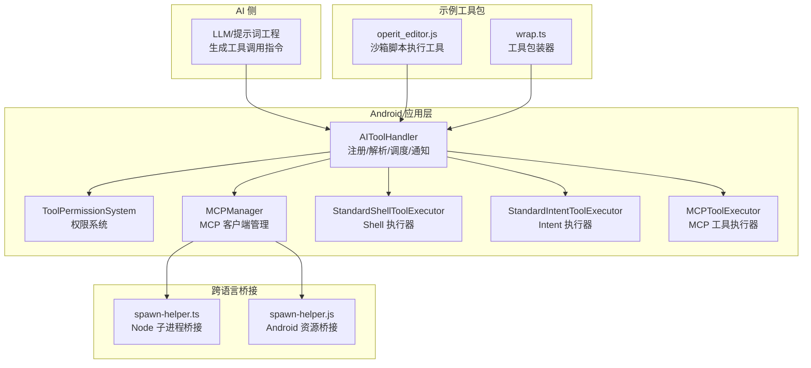
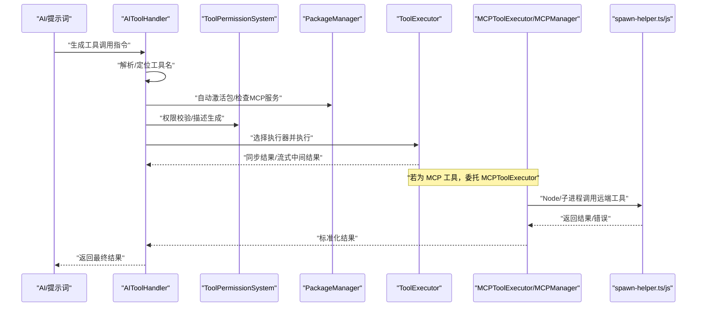
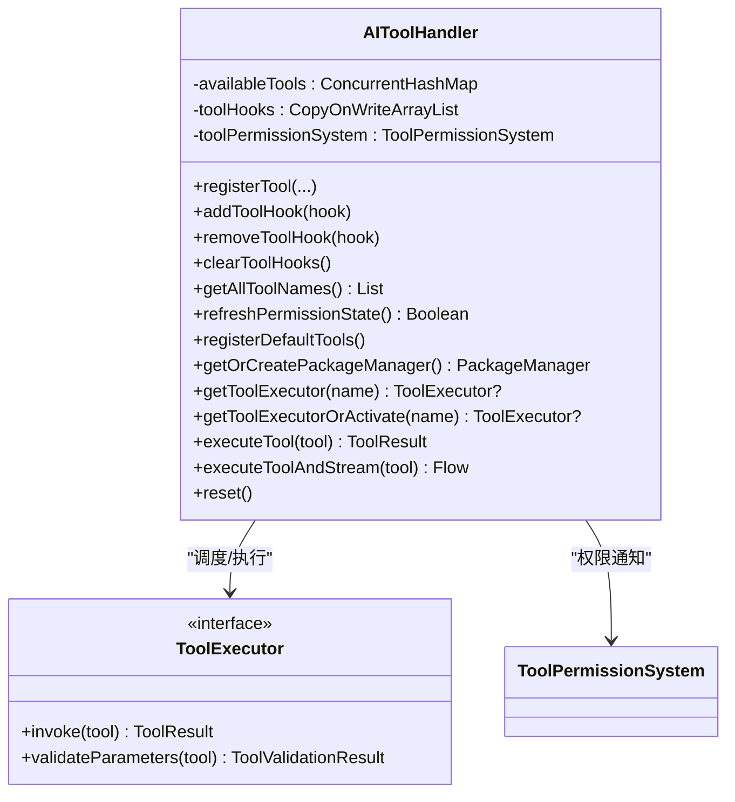
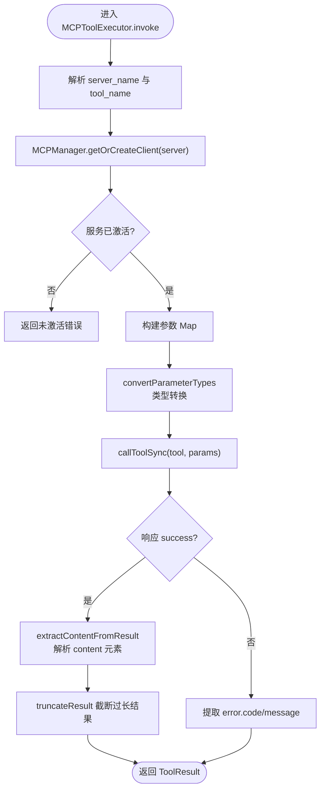
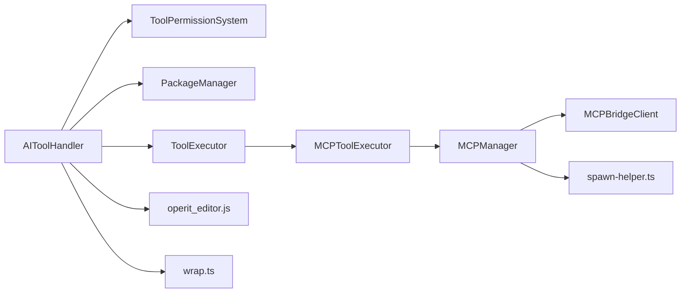

# 工具调用处理

<cite>
**本文引用的文件**
- [AIToolHandler.kt](file://app/src/main/java/com/ai/assistance/operit/core/tools/AIToolHandler.kt)
- [ToolExecutor 接口](file://app/src/main/java/com/ai/assistance/operit/core/tools/AIToolHandler.kt)
- [MCPToolExecutor.kt](file://app/src/main/java/com/ai/assistance/operit/core/tools/mcp/MCPToolExecutor.kt)
- [MCPManager.kt](file://app/src/main/java/com/ai/assistance/operit/core/tools/mcp/MCPToolExecutor.kt)
- [StandardShellToolExecutor.kt](file://app/src/main/java/com/ai/assistance/operit/core/tools/defaultTool/standard/StandardShellToolExecutor.kt)
- [StandardIntentToolExecutor.kt](file://app/src/main/java/com/ai/assistance/operit/core/tools/defaultTool/standard/StandardIntentToolExecutor.kt)
- [ToolExecutionLimits.kt](file://app/src/main/java/com/ai/assistance/operit/core/tools/ToolExecutionLimits.kt)
- [ToolPermissionSystem.kt](file://app/src/main/java/com/ai/assistance/operit/ui/permissions/ToolPermissionSystem.kt)
- [spawn-helper.ts](file://tools/mcp_bridge/spawn-helper.ts)
- [spawn-helper.js](file://app/src/main/assets/bridge/spawn-helper.js)
- [operit_editor.js](file://app/src/main/assets/packages/operit_editor.js)
- [operit_editor.ts](file://examples/operit_editor.ts)
- [tool_error_surface.js](file://app/src/androidTest/js/com/ai/assistance/operit/core/tools/javascript/script_mode_contract/tool_error_surface.js)
- [host_runtime.js](file://app/src/androidTest/js/com/ai/assistance/operit/core/tools/javascript/bridge_contract/host_runtime.js)
- [wrap.ts](file://examples/github/src/utils/wrap.ts)
</cite>

## 目录
1. [简介](#简介)
2. [项目结构](#项目结构)
3. [核心组件](#核心组件)
4. [架构总览](#架构总览)
5. [详细组件分析](#详细组件分析)
6. [依赖关系分析](#依赖关系分析)
7. [性能考量](#性能考量)
8. [故障排查指南](#故障排查指南)
9. [结论](#结论)
10. [附录](#附录)

## 简介
本文件面向开发者，系统性梳理 Operit 的工具调用处理体系，覆盖从 AI 生成的工具调用指令解析、权限校验、执行器调度、结果处理，到工具执行限制、进度报告、日志与调试、性能监控等全链路能力。重点围绕 AIToolHandler 的职责边界、工具注册与钩子通知、并发与错误恢复策略展开；同时对 MCP 工具桥接、标准工具（Shell、Intent）执行路径进行深入剖析，并给出可扩展的实践建议。

## 项目结构
Operit 的工具调用处理主要位于 Android 应用层的工具模块，配合跨语言桥接（JS/TS）与示例工具包（如 operit_editor），形成“AI 指令 → 解析与调度 → 执行器 → 结果回传”的闭环。

图示来源
- [AIToolHandler.kt:29-416](file://app/src/main/java/com/ai/assistance/operit/core/tools/AIToolHandler.kt#L29-L416)
- [MCPToolExecutor.kt:21-394](file://app/src/main/java/com/ai/assistance/operit/core/tools/mcp/MCPToolExecutor.kt#L21-L394)
- [MCPManager.kt:401-575](file://app/src/main/java/com/ai/assistance/operit/core/tools/mcp/MCPToolExecutor.kt#L401-L575)
- [spawn-helper.ts:129-168](file://tools/mcp_bridge/spawn-helper.ts#L129-L168)
- [spawn-helper.js:155-196](file://app/src/main/assets/bridge/spawn-helper.js#L155-L196)
- [operit_editor.js:2755-2871](file://app/src/main/assets/packages/operit_editor.js#L2755-L2871)
- [wrap.ts:8-26](file://examples/github/src/utils/wrap.ts#L8-L26)

章节来源
- [AIToolHandler.kt:29-416](file://app/src/main/java/com/ai/assistance/operit/core/tools/AIToolHandler.kt#L29-L416)
- [MCPToolExecutor.kt:21-394](file://app/src/main/java/com/ai/assistance/operit/core/tools/mcp/MCPToolExecutor.kt#L21-L394)
- [MCPManager.kt:401-575](file://app/src/main/java/com/ai/assistance/operit/core/tools/mcp/MCPToolExecutor.kt#L401-L575)
- [spawn-helper.ts:129-168](file://tools/mcp_bridge/spawn-helper.ts#L129-L168)
- [spawn-helper.js:155-196](file://app/src/main/assets/bridge/spawn-helper.js#L155-L196)
- [operit_editor.js:2755-2871](file://app/src/main/assets/packages/operit_editor.js#L2755-L2871)
- [wrap.ts:8-26](file://examples/github/src/utils/wrap.ts#L8-L26)

## 核心组件
- AIToolHandler：工具注册中心、调用解析与调度、权限通知、生命周期钩子、默认工具注册、包管理器集成、MCP 自动激活。
- ToolExecutor 接口：统一的工具执行契约，支持同步执行与流式结果。
- MCPToolExecutor/MCPManager：MCP 服务发现、连接复用、参数类型转换、结果提取与截断。
- StandardShellToolExecutor/StandardIntentToolExecutor：标准系统工具执行器，分别负责 Shell 命令与 Android Intent。
- ToolPermissionSystem：权限描述注册、权限状态刷新、UI 层交互。
- ToolExecutionLimits：执行限制（如文本结果长度上限）。
- 跨语言桥接：spawn-helper.ts（Node 子进程）与 spawn-helper.js（Android 资源），用于 MCP 工具调用的远端执行与结果回传。
- 示例工具包：operit_editor.js 提供沙箱脚本直接执行工具；wrap.ts 提供通用工具包装器。

章节来源
- [AIToolHandler.kt:29-416](file://app/src/main/java/com/ai/assistance/operit/core/tools/AIToolHandler.kt#L29-L416)
- [ToolExecutor 接口:418-431](file://app/src/main/java/com/ai/assistance/operit/core/tools/AIToolHandler.kt#L418-L431)
- [MCPToolExecutor.kt:21-394](file://app/src/main/java/com/ai/assistance/operit/core/tools/mcp/MCPToolExecutor.kt#L21-L394)
- [MCPManager.kt:401-575](file://app/src/main/java/com/ai/assistance/operit/core/tools/mcp/MCPToolExecutor.kt#L401-L575)
- [StandardShellToolExecutor.kt:18-103](file://app/src/main/java/com/ai/assistance/operit/core/tools/defaultTool/standard/StandardShellToolExecutor.kt#L18-L103)
- [StandardIntentToolExecutor.kt:22-295](file://app/src/main/java/com/ai/assistance/operit/core/tools/defaultTool/standard/StandardIntentToolExecutor.kt#L22-L295)
- [ToolPermissionSystem.kt](file://app/src/main/java/com/ai/assistance/operit/ui/permissions/ToolPermissionSystem.kt)
- [ToolExecutionLimits.kt](file://app/src/main/java/com/ai/assistance/operit/core/tools/ToolExecutionLimits.kt)

## 架构总览
下图展示了从 AI 生成工具调用到执行器执行与结果回传的关键交互：

图示来源
- [AIToolHandler.kt:324-367](file://app/src/main/java/com/ai/assistance/operit/core/tools/AIToolHandler.kt#L324-L367)
- [MCPToolExecutor.kt:213-330](file://app/src/main/java/com/ai/assistance/operit/core/tools/mcp/MCPToolExecutor.kt#L213-L330)
- [MCPManager.kt:452-517](file://app/src/main/java/com/ai/assistance/operit/core/tools/mcp/MCPToolExecutor.kt#L452-L517)
- [spawn-helper.ts:129-168](file://tools/mcp_bridge/spawn-helper.ts#L129-L168)
- [spawn-helper.js:155-196](file://app/src/main/assets/bridge/spawn-helper.js#L155-L196)

## 详细组件分析

### AIToolHandler：工具注册、解析、并发与错误恢复
- 工具注册与钩子
  - registerTool：支持函数式与对象式两种注册方式；可选注册操作描述生成器，用于权限对话框展示。
  - addToolHook/removeToolHook/clearToolHooks/notifyHooks：提供非阻塞的通知钩子，贯穿生命周期事件（请求、权限检查、执行开始、结果、异常、结束）。
- 自动激活与包管理
  - getToolExecutorOrActivate：优先从注册表获取；若未注册默认工具则惰性注册；当工具名为“包名:工具名”且存在可用包或 MCP 服务时自动 usePackage 激活；若 MCP 服务非激活状态则尝试重新激活。
  - getOrCreatePackageManager：延迟初始化包管理器实例。
- 执行与流式输出
  - executeTool：同步执行，先校验参数，再调用执行器，最后通知生命周期事件。
  - executeToolAndStream：支持流式中间结果，逐条 emit 并通知中间结果。
- 并发与线程模型
  - 流式执行通过 Kotlin Flow 支持背压与顺序 emit；钩子回调在 try-catch 内执行，避免单个钩子异常影响整体流程。
- 错误恢复
  - 当执行器未找到或参数校验失败时，构造 ToolResult 并通知结束；异常捕获后通知错误并向上抛出，便于上层统一处理。

图示来源
- [AIToolHandler.kt:29-416](file://app/src/main/java/com/ai/assistance/operit/core/tools/AIToolHandler.kt#L29-L416)
- [ToolExecutor 接口:418-431](file://app/src/main/java/com/ai/assistance/operit/core/tools/AIToolHandler.kt#L418-L431)

章节来源
- [AIToolHandler.kt:29-416](file://app/src/main/java/com/ai/assistance/operit/core/tools/AIToolHandler.kt#L29-L416)

### MCP 工具执行链路：连接、参数转换与结果提取
- 名称解析与激活
  - MCPToolExecutor 从工具名解析 server_name 与 tool_name；通过 MCPManager 获取/创建客户端；若服务未激活则返回明确错误。
- 参数类型转换
  - 依据工具定义的 inputSchema.properties 推断期望类型，使用 smartConvert 进行字符串到目标类型的自动转换（含数组元素递归处理）。
- 结果提取与截断
  - 从 result.content 中提取 text/image/resource 等类型内容，JSON 文本尝试格式化；图片通过 ImagePoolManager 转为链接；超过长度阈值进行截断并提示使用分页/文件操作。
- 连接复用与重连
  - MCPManager 缓存客户端，优先复用；若连接断开尝试 reconnect；注册/注销服务器时清理旧连接；提供 last failure reason 便于诊断。

图示来源
- [MCPToolExecutor.kt:213-330](file://app/src/main/java/com/ai/assistance/operit/core/tools/mcp/MCPToolExecutor.kt#L213-L330)
- [MCPManager.kt:452-517](file://app/src/main/java/com/ai/assistance/operit/core/tools/mcp/MCPToolExecutor.kt#L452-L517)

章节来源
- [MCPToolExecutor.kt:21-394](file://app/src/main/java/com/ai/assistance/operit/core/tools/mcp/MCPToolExecutor.kt#L21-L394)
- [MCPManager.kt:401-575](file://app/src/main/java/com/ai/assistance/operit/core/tools/mcp/MCPToolExecutor.kt#L401-L575)

### 标准工具：Shell 与 Intent
- StandardShellToolExecutor
  - 参数校验：要求 command 不为空；过滤潜在高危命令（如 rm -rf、format）。
  - 执行：通过 AndroidShellExecutor 执行命令，组合 stdout/stderr 作为错误信息；返回 ADBResultData 或错误 ToolResult。
- StandardIntentToolExecutor
  - 参数校验：要求 action 或 component 至少一个；type 必须为 activity/broadcast/service；type=service 时必须提供 component。
  - 执行：根据 type 分派广播、服务或活动；必要时添加 FLAG_ACTIVITY_NEW_TASK；将 Intent 关键字段封装为 IntentResultData 返回。

章节来源
- [StandardShellToolExecutor.kt:18-103](file://app/src/main/java/com/ai/assistance/operit/core/tools/defaultTool/standard/StandardShellToolExecutor.kt#L18-L103)
- [StandardIntentToolExecutor.kt:22-295](file://app/src/main/java/com/ai/assistance/operit/core/tools/defaultTool/standard/StandardIntentToolExecutor.kt#L22-L295)

### 跨语言桥接：Node/子进程与 Android 资源桥接
- spawn-helper.ts（Node）
  - 接收 toolcall 消息，调用 client.callTool，将结果标准化为 tool_result（包含 success/result/error），通过 process.send 回传。
- spawn-helper.js（Android 资源）
  - 与 Node 端对应，接收来自 Android 主进程的消息，调用 NativeInterface.callTool 或 client.callTool，回传 tool_result。

章节来源
- [spawn-helper.ts:129-168](file://tools/mcp_bridge/spawn-helper.ts#L129-L168)
- [spawn-helper.js:155-196](file://app/src/main/assets/bridge/spawn-helper.js#L155-L196)

### 示例工具包：沙箱脚本执行与工具包装
- operit_editor.js
  - 提供 executeSandboxScriptDirect 工具，支持内联代码或外部脚本、参数 JSON 校验、环境变量文件校验、执行等待时间控制、日志记录与最终 payload 组装。
- wrap.ts
  - 通用工具包装器，统一捕获异常、拼装 ToolResponse，便于在工具链中复用。

章节来源
- [operit_editor.js:2755-2871](file://app/src/main/assets/packages/operit_editor.js#L2755-L2871)
- [operit_editor.ts:2896-3047](file://examples/operit_editor.ts#L2896-L3047)
- [wrap.ts:8-26](file://examples/github/src/utils/wrap.ts#L8-L26)

## 依赖关系分析
- AIToolHandler 依赖 ToolPermissionSystem 进行权限描述与状态刷新；通过 PackageManager 实现包的自动激活；在 MCP 场景下依赖 MCPManager 管理客户端连接。
- ToolExecutor 为统一执行契约，具体实现由标准工具与 MCP 工具承担。
- MCPToolExecutor 依赖 MCPManager 与 MCPBridgeClient（Node/子进程桥接）实现远端工具调用。
- 示例工具包与 wrap.ts 为上层工具链提供便捷封装。

图示来源
- [AIToolHandler.kt:52-57](file://app/src/main/java/com/ai/assistance/operit/core/tools/AIToolHandler.kt#L52-L57)
- [MCPToolExecutor.kt:21-394](file://app/src/main/java/com/ai/assistance/operit/core/tools/mcp/MCPToolExecutor.kt#L21-L394)
- [MCPManager.kt:401-575](file://app/src/main/java/com/ai/assistance/operit/core/tools/mcp/MCPToolExecutor.kt#L401-L575)
- [spawn-helper.ts:129-168](file://tools/mcp_bridge/spawn-helper.ts#L129-L168)
- [operit_editor.js:2755-2871](file://app/src/main/assets/packages/operit_editor.js#L2755-L2871)
- [wrap.ts:8-26](file://examples/github/src/utils/wrap.ts#L8-L26)

章节来源
- [AIToolHandler.kt:52-57](file://app/src/main/java/com/ai/assistance/operit/core/tools/AIToolHandler.kt#L52-L57)
- [MCPToolExecutor.kt:21-394](file://app/src/main/java/com/ai/assistance/operit/core/tools/mcp/MCPToolExecutor.kt#L21-L394)
- [MCPManager.kt:401-575](file://app/src/main/java/com/ai/assistance/operit/core/tools/mcp/MCPToolExecutor.kt#L401-L575)
- [spawn-helper.ts:129-168](file://tools/mcp_bridge/spawn-helper.ts#L129-L168)
- [operit_editor.js:2755-2871](file://app/src/main/assets/packages/operit_editor.js#L2755-L2871)
- [wrap.ts:8-26](file://examples/github/src/utils/wrap.ts#L8-L26)

## 性能考量
- 执行限制
  - 文本结果长度上限：MCPToolExecutor 在提取内容后对过长结果进行截断，并提示使用文件/分页方式，避免 UI/网络传输压力。
- 超时与中断
  - 沙箱执行系统具备超时控制机制：预超时计时器与主超时计时器协同，超时后记录警告并取消执行，防止长时间占用资源。
- 并发与流式
  - executeToolAndStream 使用 Flow 支持中间结果实时推送，降低用户等待时间；钩子回调非阻塞，避免阻塞执行主线程。
- 连接复用
  - MCPManager 缓存客户端，减少重复握手成本；断线重连策略避免频繁重建连接。

章节来源
- [MCPToolExecutor.kt:28-37](file://app/src/main/java/com/ai/assistance/operit/core/tools/mcp/MCPToolExecutor.kt#L28-L37)
- [my_docs/Operit 沙箱执行系统设计思想与详细流程分析.md:393-417](file://my_docs/Operit 沙箱执行系统设计思想与详细流程分析.md#L393-L417)

## 故障排查指南
- 工具未找到
  - 现象：返回 ToolResult.success=false，error 包含“Tool not found”。
  - 排查：确认工具是否已注册；对于“包名:工具名”，确认包是否已 usePackage 激活；检查 MCP 服务是否 active。
- 参数校验失败
  - 现象：返回 ToolResult.success=false，error 为校验错误消息。
  - 排查：核对必填参数与类型；Shell 工具禁止高危命令；Intent 工具需满足 type 与 component 的约束。
- MCP 连接失败
  - 现象：返回“Cannot connect to MCP server”或“not activated”。
  - 排查：查看 MCPManager.getLastConnectionFailureReason；确认服务端点、权限、网络；必要时重新 use_package 激活。
- 跨语言桥接异常
  - 现象：Node/子进程或 Android 资源桥接返回 tool_result.error。
  - 排查：检查 spawn-helper.ts/js 的消息协议一致性；确认 client 初始化与 close 生命周期；查看进程日志。
- 脚本/工具错误表面
  - 现象：空工具名导致显式错误提示。
  - 排查：参考测试用例对空工具名的断言，确保上层调用传入有效工具名。

章节来源
- [AIToolHandler.kt:324-367](file://app/src/main/java/com/ai/assistance/operit/core/tools/AIToolHandler.kt#L324-L367)
- [MCPToolExecutor.kt:213-330](file://app/src/main/java/com/ai/assistance/operit/core/tools/mcp/MCPToolExecutor.kt#L213-L330)
- [MCPManager.kt:442-444](file://app/src/main/java/com/ai/assistance/operit/core/tools/mcp/MCPToolExecutor.kt#L442-L444)
- [spawn-helper.ts:129-168](file://tools/mcp_bridge/spawn-helper.ts#L129-L168)
- [spawn-helper.js:155-196](file://app/src/main/assets/bridge/spawn-helper.js#L155-L196)
- [tool_error_surface.js:9-30](file://app/src/androidTest/js/com/ai/assistance/operit/core/tools/javascript/script_mode_contract/tool_error_surface.js#L9-L30)

## 结论
Operit 的工具调用处理体系以 AIToolHandler 为核心，结合 ToolExecutor 统一契约、ToolPermissionSystem 权限系统、MCP 工具桥接与标准系统工具执行器，实现了从指令解析到结果回传的完整闭环。通过流式执行、连接复用、参数类型转换与结果截断等机制，兼顾了易用性、安全性与性能。开发者可在该框架下快速扩展自定义工具，同时遵循权限与执行限制规范，确保稳定与可控。

## 附录

### 实践示例与最佳实践
- 实现自定义工具调用
  - 使用 AIToolHandler.registerTool 注册工具；若需权限描述，提供描述生成器；在 ToolExecutor.validateParameters 中严格校验参数；在 invoke 中返回 ToolResult。
  - 参考路径：[AIToolHandler.kt:139-168](file://app/src/main/java/com/ai/assistance/operit/core/tools/AIToolHandler.kt#L139-L168)，[ToolExecutor 接口:418-431](file://app/src/main/java/com/ai/assistance/operit/core/tools/AIToolHandler.kt#L418-L431)
- 处理复杂工具链
  - 使用 AIToolHandler.executeToolAndStream 获取中间结果，结合 Flow 进行链式处理；在 wrap.ts 中统一异常与返回结构，便于工具链串联。
  - 参考路径：[AIToolHandler.kt:369-415](file://app/src/main/java/com/ai/assistance/operit/core/tools/AIToolHandler.kt#L369-L415)，[wrap.ts:8-26](file://examples/github/src/utils/wrap.ts#L8-L26)
- 优化工具执行性能
  - 合理设置 MCP 结果截断阈值；对高耗时工具采用流式输出；利用 MCPManager 缓存客户端；在 Shell/Intent 工具中避免高风险命令与无效 Intent。
  - 参考路径：[MCPToolExecutor.kt:28-37](file://app/src/main/java/com/ai/assistance/operit/core/tools/mcp/MCPToolExecutor.kt#L28-L37)，[StandardShellToolExecutor.kt:84-101](file://app/src/main/java/com/ai/assistance/operit/core/tools/defaultTool/standard/StandardShellToolExecutor.kt#L84-L101)，[StandardIntentToolExecutor.kt:260-293](file://app/src/main/java/com/ai/assistance/operit/core/tools/defaultTool/standard/StandardIntentToolExecutor.kt#L260-L293)
- 工具调用日志与调试
  - 使用 AppLogger 记录关键步骤；在 operit_editor.js 中记录执行阶段与最终 payload；在 host_runtime.js 中通过断言验证异步/同步行为与 Promise.all 并发顺序。
  - 参考路径：[operit_editor.js:2755-2871](file://app/src/main/assets/packages/operit_editor.js#L2755-L2871)，[host_runtime.js:109-135](file://app/src/androidTest/js/com/ai/assistance/operit/core/tools/javascript/bridge_contract/host_runtime.js#L109-L135)