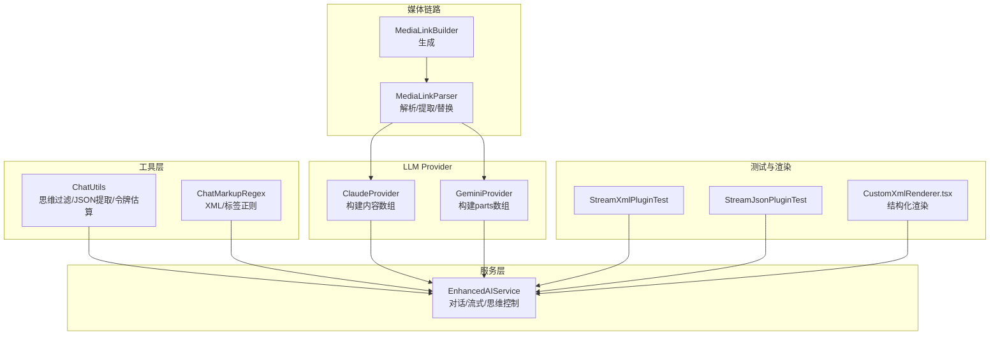
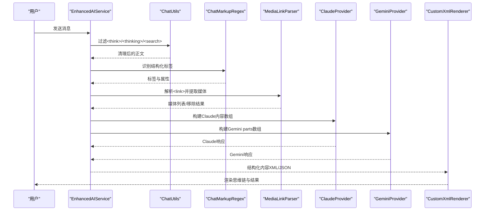
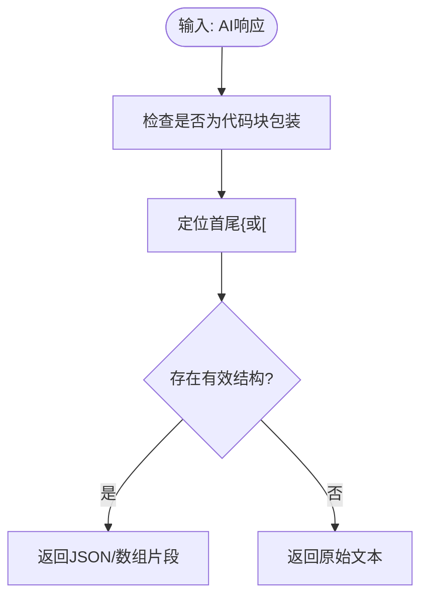
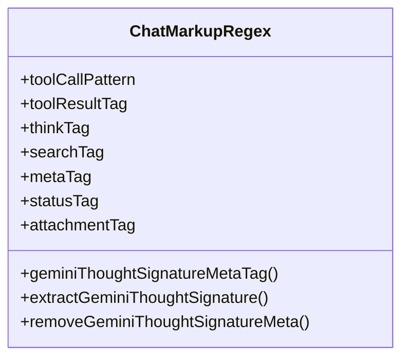
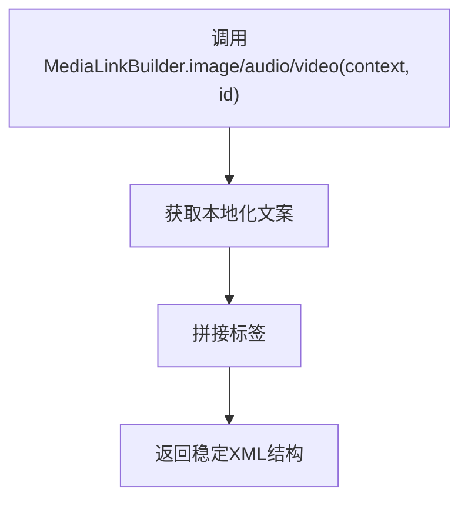
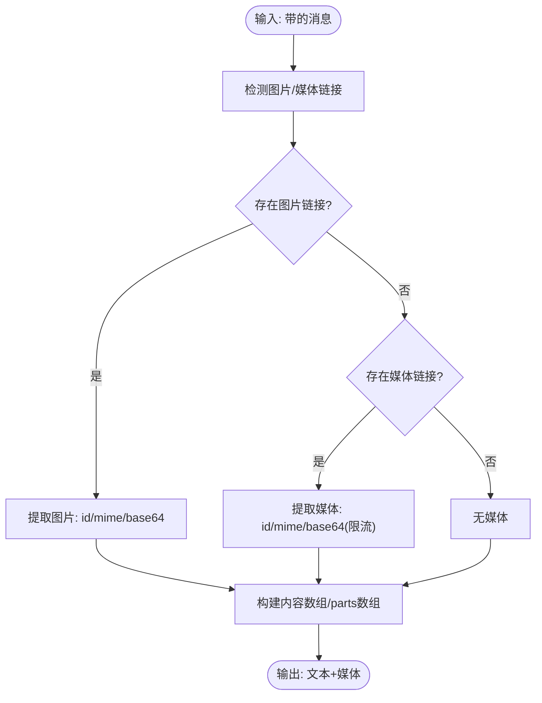
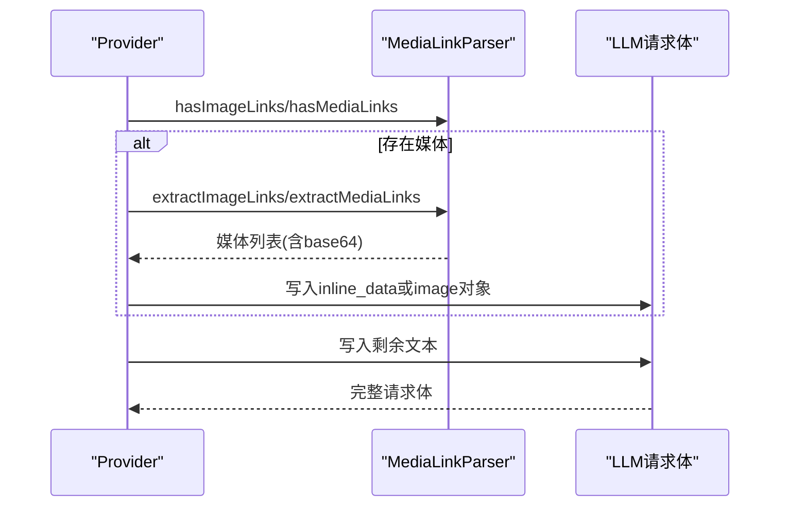
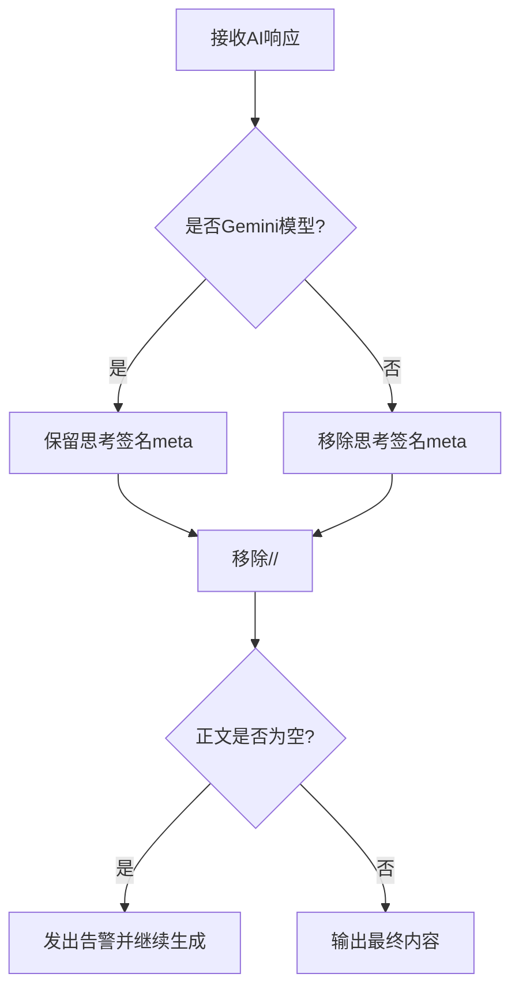
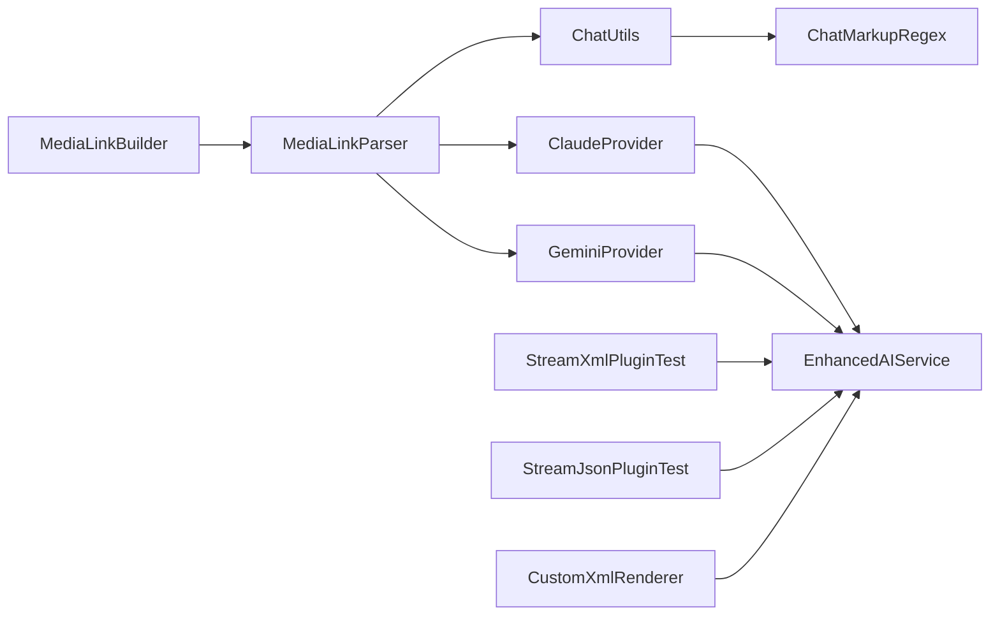

# 思维链支持

<cite>
**本文引用的文件**   
- [ChatUtils.kt](file://app/src/main/java/com/ai/assistance/operit/util/ChatUtils.kt)
- [ChatMarkupRegex.kt](file://app/src/main/java/com/ai/assistance/operit/util/ChatMarkupRegex.kt)
- [MediaLinkBuilder.kt](file://app/src/main/java/com/ai/assistance/operit/api/chat/llmprovider/MediaLinkBuilder.kt)
- [MediaLinkParser.kt](file://app/src/main/java/com/ai/assistance/operit/api/chat/llmprovider/MediaLinkParser.kt)
- [ClaudeProvider.kt](file://app/src/main/java/com/ai/assistance/operit/api/chat/llmprovider/ClaudeProvider.kt)
- [GeminiProvider.kt](file://app/src/main/java/com/ai/assistance/operit/api/chat/llmprovider/GeminiProvider.kt)
- [EnhancedAIService.kt](file://app/src/main/java/com/ai/assistance/operit/api/chat/EnhancedAIService.kt)
- [MediaLinkBuilderAndroidTest.kt](file://app/src/androidTest/java/com/ai/assistance/operit/api/chat/llmprovider/MediaLinkBuilderAndroidTest.kt)
- [MediaLinkBuilderStructureAndroidTest.kt](file://app/src/androidTest/java/com/ai/assistance/operit/api/chat/llmprovider/MediaLinkBuilderStructureAndroidTest.kt)
- [MediaLinkBuilderFormatAndroidTest.kt](file://app/src/androidTest/java/com/ai/assistance/operit/api/chat/llmprovider/MediaLinkBuilderFormatAndroidTest.kt)
- [MediaLinkBuilderIdAndroidTest.kt](file://app/src/androidTest/java/com/ai/assistance/operit/api/chat/llmprovider/MediaLinkBuilderIdAndroidTest.kt)
- [ChatUtilsThinkingTest.kt](file://app/src/test/java/com/ai/assistance/operit/util/ChatUtilsThinkingTest.kt)
- [ChatUtilsThinkingEdgeTest.kt](file://app/src/test/java/com/ai/assistance/operit/util/ChatUtilsThinkingEdgeTest.kt)
- [StreamXmlPluginTest.kt](file://app/src/androidTest/java/com/ai/assistance/operit/util/stream/plugins/StreamXmlPluginTest.kt)
- [StreamJsonPluginTest.kt](file://app/src/androidTest/java/com/ai/assistance/operit/util/stream/plugins/StreamJsonPluginTest.kt)
- [StreamRealTimeSplitTest.kt](file://app/src/androidTest/java/com/ai/assistance/operit/util/stream/StreamRealTimeSplitTest.kt)
- [CustomXmlRenderer.tsx](file://web-chat/src/ui/features/chat/components/part/CustomXmlRenderer.tsx)
</cite>

## 目录
1. [简介](#简介)
2. [项目结构](#项目结构)
3. [核心组件](#核心组件)
4. [架构总览](#架构总览)
5. [详细组件分析](#详细组件分析)
6. [依赖关系分析](#依赖关系分析)
7. [性能考量](#性能考量)
8. [故障排查指南](#故障排查指南)
9. [结论](#结论)
10. [附录](#附录)

## 简介
本文件围绕 Operit 的思维链（Chain of Thought, CoT）支持系统进行系统化技术文档整理，重点覆盖以下方面：
- 思维链的实现机制：思考过程生成、中间推理步骤记录、结论输出与验证
- 媒体链接构建器：多媒体内容的链接生成、格式转换、嵌入处理
- 结构化助手内容解析器：XML/JSON 格式的解析、结构化数据提取、语义理解
- ChatUtils 中的思维链辅助功能：思考标记识别、推理路径追踪、思维过程可视化
- 具体代码示例路径：如何实现复杂思维链推理、多模态内容处理、性能优化
- 验证、错误检测与性能优化建议，以及面向开发者的扩展指导

## 项目结构
Operit 的思维链支持主要分布在如下模块：
- 工具层：ChatUtils（消息处理、JSON 提取、思维内容过滤）、ChatMarkupRegex（XML/标签正则）
- 媒体链路：MediaLinkBuilder（生成<link>标签）、MediaLinkParser（解析<link>、提取媒体、替换/移除）
- LLM Provider 层：ClaudeProvider、GeminiProvider（根据媒体链接构建请求体，处理多模态）
- 服务层：EnhancedAIService（整合工具、历史、流式输出、思维链控制）
- 测试与渲染：Android 单元测试（媒体链接构建器）、Stream 插件测试（XML/JSON 流解析）、Web 渲染器（结构化内容）

图表来源
- [ChatUtils.kt:1-130](file://app/src/main/java/com/ai/assistance/operit/util/ChatUtils.kt#L1-L130)
- [ChatMarkupRegex.kt:1-279](file://app/src/main/java/com/ai/assistance/operit/util/ChatMarkupRegex.kt#L1-L279)
- [MediaLinkBuilder.kt:1-19](file://app/src/main/java/com/ai/assistance/operit/api/chat/llmprovider/MediaLinkBuilder.kt#L1-L19)
- [MediaLinkParser.kt:1-208](file://app/src/main/java/com/ai/assistance/operit/api/chat/llmprovider/MediaLinkParser.kt#L1-L208)
- [ClaudeProvider.kt:440-490](file://app/src/main/java/com/ai/assistance/operit/api/chat/llmprovider/ClaudeProvider.kt#L440-L490)
- [GeminiProvider.kt:440-495](file://app/src/main/java/com/ai/assistance/operit/api/chat/llmprovider/GeminiProvider.kt#L440-L495)
- [EnhancedAIService.kt:1-200](file://app/src/main/java/com/ai/assistance/operit/api/chat/EnhancedAIService.kt#L1-L200)
- [StreamXmlPluginTest.kt:1-50](file://app/src/androidTest/java/com/ai/assistance/operit/util/stream/plugins/StreamXmlPluginTest.kt#L1-L50)
- [StreamJsonPluginTest.kt:41-84](file://app/src/androidTest/java/com/ai/assistance/operit/util/stream/plugins/StreamJsonPluginTest.kt#L41-L84)
- [CustomXmlRenderer.tsx:406-475](file://web-chat/src/ui/features/chat/components/part/CustomXmlRenderer.tsx#L406-L475)

章节来源
- [ChatUtils.kt:1-130](file://app/src/main/java/com/ai/assistance/operit/util/ChatUtils.kt#L1-L130)
- [ChatMarkupRegex.kt:1-279](file://app/src/main/java/com/ai/assistance/operit/util/ChatMarkupRegex.kt#L1-L279)
- [MediaLinkBuilder.kt:1-19](file://app/src/main/java/com/ai/assistance/operit/api/chat/llmprovider/MediaLinkBuilder.kt#L1-L19)
- [MediaLinkParser.kt:1-208](file://app/src/main/java/com/ai/assistance/operit/api/chat/llmprovider/MediaLinkParser.kt#L1-L208)
- [ClaudeProvider.kt:440-490](file://app/src/main/java/com/ai/assistance/operit/api/chat/llmprovider/ClaudeProvider.kt#L440-L490)
- [GeminiProvider.kt:440-495](file://app/src/main/java/com/ai/assistance/operit/api/chat/llmprovider/GeminiProvider.kt#L440-L495)
- [EnhancedAIService.kt:1-200](file://app/src/main/java/com/ai/assistance/operit/api/chat/EnhancedAIService.kt#L1-L200)

## 核心组件
- ChatUtils：提供思维内容过滤（移除<think>/<thinking>/<search>）、提取 JSON/数组、令牌估算、Gemini 思考签名清理等能力
- ChatMarkupRegex：提供工具调用、状态、情感、记忆、附件、回复等标签的识别与提取，以及 Gemini 思考签名的 meta 标签处理
- MediaLinkBuilder：生成标准<link>标签，支持 image/audio/video 类型与本地化文案
- MediaLinkParser：解析<link>标签，提取图片/媒体链接，移除/替换链接，限制媒体 base64 大小
- ClaudeProvider/GeminiProvider：在构建请求体时处理媒体链接，分别适配 Claude 的 content 数组与 Gemini 的 parts 数组
- EnhancedAIService：整合上述能力，负责对话生命周期、流式输出、思维链控制与错误处理

章节来源
- [ChatUtils.kt:31-128](file://app/src/main/java/com/ai/assistance/operit/util/ChatUtils.kt#L31-L128)
- [ChatMarkupRegex.kt:125-279](file://app/src/main/java/com/ai/assistance/operit/util/ChatMarkupRegex.kt#L125-L279)
- [MediaLinkBuilder.kt:6-18](file://app/src/main/java/com/ai/assistance/operit/api/chat/llmprovider/MediaLinkBuilder.kt#L6-L18)
- [MediaLinkParser.kt:47-206](file://app/src/main/java/com/ai/assistance/operit/api/chat/llmprovider/MediaLinkParser.kt#L47-L206)
- [ClaudeProvider.kt:441-484](file://app/src/main/java/com/ai/assistance/operit/api/chat/llmprovider/ClaudeProvider.kt#L441-L484)
- [GeminiProvider.kt:442-495](file://app/src/main/java/com/ai/assistance/operit/api/chat/llmprovider/GeminiProvider.kt#L442-L495)
- [EnhancedAIService.kt:1-200](file://app/src/main/java/com/ai/assistance/operit/api/chat/EnhancedAIService.kt#L1-L200)

## 架构总览
思维链在系统中的流转路径如下：
- 输入阶段：用户消息经 EnhancedAIService 接收，结合历史与工具准备输入
- 思维过滤：ChatUtils 移除<think>/<thinking>/<search>标签，保留可读正文；ChatMarkupRegex 识别结构化标签
- 媒体处理：MediaLinkParser 解析<link>，Claude/Gemini 将媒体转为各自 API 的内容结构
- 输出阶段：EnhancedAIService 通过流式插件（XML/JSON）解析结构化输出，Web 端渲染结构化内容
- 验证与优化：单元测试覆盖媒体链接构建稳定性、结构化解析鲁棒性；ChatUtils 提供令牌估算与 JSON 提取

图表来源
- [EnhancedAIService.kt:1-200](file://app/src/main/java/com/ai/assistance/operit/api/chat/EnhancedAIService.kt#L1-L200)
- [ChatUtils.kt:31-128](file://app/src/main/java/com/ai/assistance/operit/util/ChatUtils.kt#L31-L128)
- [ChatMarkupRegex.kt:125-279](file://app/src/main/java/com/ai/assistance/operit/util/ChatMarkupRegex.kt#L125-L279)
- [MediaLinkParser.kt:47-206](file://app/src/main/java/com/ai/assistance/operit/api/chat/llmprovider/MediaLinkParser.kt#L47-L206)
- [ClaudeProvider.kt:441-484](file://app/src/main/java/com/ai/assistance/operit/api/chat/llmprovider/ClaudeProvider.kt#L441-L484)
- [GeminiProvider.kt:442-495](file://app/src/main/java/com/ai/assistance/operit/api/chat/llmprovider/GeminiProvider.kt#L442-L495)
- [CustomXmlRenderer.tsx:406-475](file://web-chat/src/ui/features/chat/components/part/CustomXmlRenderer.tsx#L406-L475)

## 详细组件分析

### ChatUtils：思维链辅助与结构化数据提取
- 思维内容过滤：removeThinkingContent 支持<think>/<thinking>/<search>标签的完整与未闭合场景，确保正文可读
- 思维内容提取：extractThinkingContent 返回“去除思维标签的正文 + 所有<think>/<thinking>片段”，便于后续分析
- JSON 提取：extractJson/extractJsonArray 处理 AI 输出中夹带的说明文字与代码块包装，稳定提取结构化数据
- 令牌估算：estimateTokenCount 提供中文/英文的粗略估算，辅助长度控制与成本预估
- Gemini 思考签名：stripGeminiThoughtSignatureMeta/stripGeminiThoughtSignatureMetaTurns 清理特定 provider 的 meta 标签

图表来源
- [ChatUtils.kt:84-128](file://app/src/main/java/com/ai/assistance/operit/util/ChatUtils.kt#L84-L128)

章节来源
- [ChatUtils.kt:31-128](file://app/src/main/java/com/ai/assistance/operit/util/ChatUtils.kt#L31-L128)

### ChatMarkupRegex：结构化标签识别与语义理解
- 工具调用与结果：toolCallPattern/toolResultTag 等正则识别工具调用与结果块，支持自闭合与带属性
- 思维与搜索标签：thinkTag/searchTag 正则覆盖<think>/<thinking>与<search>，支持未闭合场景
- Meta 与状态：metaTag、statusTag、emotionTag、memoryTag、attachmentTag 等，支撑多模态与状态管理
- Gemini 思考签名：geminiThoughtSignatureMetaTag/extractGeminiThoughtSignature/removeGeminiThoughtSignatureMeta

图表来源
- [ChatMarkupRegex.kt:25-279](file://app/src/main/java/com/ai/assistance/operit/util/ChatMarkupRegex.kt#L25-L279)

章节来源
- [ChatMarkupRegex.kt:125-279](file://app/src/main/java/com/ai/assistance/operit/util/ChatMarkupRegex.kt#L125-L279)

### MediaLinkBuilder：媒体链接生成
- 生成规则：image/audio/video 三类，统一使用<link>标签，包含 type 与 id 属性，本地化显示文案
- 测试保障：Android 单元测试覆盖起始/结束结构、本地化文案、ID 规范（支持短横线与数字）

图表来源
- [MediaLinkBuilder.kt:6-18](file://app/src/main/java/com/ai/assistance/operit/api/chat/llmprovider/MediaLinkBuilder.kt#L6-L18)
- [MediaLinkBuilderAndroidTest.kt:14-62](file://app/src/androidTest/java/com/ai/assistance/operit/api/chat/llmprovider/MediaLinkBuilderAndroidTest.kt#L14-L62)
- [MediaLinkBuilderStructureAndroidTest.kt:14-25](file://app/src/androidTest/java/com/ai/assistance/operit/api/chat/llmprovider/MediaLinkBuilderStructureAndroidTest.kt#L14-L25)
- [MediaLinkBuilderFormatAndroidTest.kt:14-25](file://app/src/androidTest/java/com/ai/assistance/operit/api/chat/llmprovider/MediaLinkBuilderFormatAndroidTest.kt#L14-L25)
- [MediaLinkBuilderIdAndroidTest.kt:14-25](file://app/src/androidTest/java/com/ai/assistance/operit/api/chat/llmprovider/MediaLinkBuilderIdAndroidTest.kt#L14-L25)

章节来源
- [MediaLinkBuilder.kt:6-18](file://app/src/main/java/com/ai/assistance/operit/api/chat/llmprovider/MediaLinkBuilder.kt#L6-L18)
- [MediaLinkBuilderAndroidTest.kt:14-62](file://app/src/androidTest/java/com/ai/assistance/operit/api/chat/llmprovider/MediaLinkBuilderAndroidTest.kt#L14-L62)
- [MediaLinkBuilderStructureAndroidTest.kt:14-25](file://app/src/androidTest/java/com/ai/assistance/operit/api/chat/llmprovider/MediaLinkBuilderStructureAndroidTest.kt#L14-L25)
- [MediaLinkBuilderFormatAndroidTest.kt:14-25](file://app/src/androidTest/java/com/ai/assistance/operit/api/chat/llmprovider/MediaLinkBuilderFormatAndroidTest.kt#L14-L25)
- [MediaLinkBuilderIdAndroidTest.kt:14-25](file://app/src/androidTest/java/com/ai/assistance/operit/api/chat/llmprovider/MediaLinkBuilderIdAndroidTest.kt#L14-L25)

### MediaLinkParser：媒体链接解析与处理
- 图片链接：extractImageLinks/hasImageLinks/removeImageLinks/replaceImageLinks，支持普通与转义两种<link>模式
- 媒体链接：extractMediaLinks/extractMediaLinkTags/removeMediaLinks/replaceMediaLinks，自动限制 base64 大小
- 去重与安全：基于 id 的去重集合，避免重复处理；对 error ID 进行保护

图表来源
- [MediaLinkParser.kt:47-206](file://app/src/main/java/com/ai/assistance/operit/api/chat/llmprovider/MediaLinkParser.kt#L47-L206)
- [ClaudeProvider.kt:441-484](file://app/src/main/java/com/ai/assistance/operit/api/chat/llmprovider/ClaudeProvider.kt#L441-L484)
- [GeminiProvider.kt:442-495](file://app/src/main/java/com/ai/assistance/operit/api/chat/llmprovider/GeminiProvider.kt#L442-L495)

章节来源
- [MediaLinkParser.kt:47-206](file://app/src/main/java/com/ai/assistance/operit/api/chat/llmprovider/MediaLinkParser.kt#L47-L206)
- [ClaudeProvider.kt:441-484](file://app/src/main/java/com/ai/assistance/operit/api/chat/llmprovider/ClaudeProvider.kt#L441-L484)
- [GeminiProvider.kt:442-495](file://app/src/main/java/com/ai/assistance/operit/api/chat/llmprovider/GeminiProvider.kt#L442-L495)

### ClaudeProvider 与 GeminiProvider：多模态内容构建
- Claude：buildContentArray 将图片与文本拆分为 content 数组元素，移除不支持的音视频链接并给出日志提示
- Gemini：buildPartsArray 先移除图片/媒体链接，再按顺序添加 inline_data（音频/视频）与图片，最后添加文本

图表来源
- [ClaudeProvider.kt:441-484](file://app/src/main/java/com/ai/assistance/operit/api/chat/llmprovider/ClaudeProvider.kt#L441-L484)
- [GeminiProvider.kt:442-495](file://app/src/main/java/com/ai/assistance/operit/api/chat/llmprovider/GeminiProvider.kt#L442-L495)
- [MediaLinkParser.kt:47-206](file://app/src/main/java/com/ai/assistance/operit/api/chat/llmprovider/MediaLinkParser.kt#L47-L206)

章节来源
- [ClaudeProvider.kt:441-484](file://app/src/main/java/com/ai/assistance/operit/api/chat/llmprovider/ClaudeProvider.kt#L441-L484)
- [GeminiProvider.kt:442-495](file://app/src/main/java/com/ai/assistance/operit/api/chat/llmprovider/GeminiProvider.kt#L442-L495)

### EnhancedAIService：思维链控制与流式输出
- 思维过滤：在非 Gemini 模型时移除思考签名 meta，在对话汇总与历史中清理<think>/<thinking>/<search>
- 纯思考输出防护：当移除思维后正文为空时发出专用告警并回传继续生成
- 流式解析：结合 StreamXmlPlugin/StreamJsonPlugin 对结构化输出进行实时切分与解析
- 多服务集成：MultiServiceManager 管理不同功能的 AIService，统一刷新与配置

图表来源
- [EnhancedAIService.kt:760-762](file://app/src/main/java/com/ai/assistance/operit/api/chat/EnhancedAIService.kt#L760-L762)
- [EnhancedAIService.kt:972-974](file://app/src/main/java/com/ai/assistance/operit/api/chat/EnhancedAIService.kt#L972-L974)
- [EnhancedAIService.kt:1633-1655](file://app/src/main/java/com/ai/assistance/operit/api/chat/EnhancedAIService.kt#L1633-L1655)

章节来源
- [EnhancedAIService.kt:760-762](file://app/src/main/java/com/ai/assistance/operit/api/chat/EnhancedAIService.kt#L760-L762)
- [EnhancedAIService.kt:972-974](file://app/src/main/java/com/ai/assistance/operit/api/chat/EnhancedAIService.kt#L972-L974)
- [EnhancedAIService.kt:1633-1655](file://app/src/main/java/com/ai/assistance/operit/api/chat/EnhancedAIService.kt#L1633-L1655)

### Web 渲染：结构化内容可视化
- CustomXmlRenderer：将结构化内容（XML/JSON）解析为 UI 组件，支持思维链与状态标签的开关显示
- 流式渲染：配合流式插件，逐步渲染标签块，提升交互体验

章节来源
- [CustomXmlRenderer.tsx:406-475](file://web-chat/src/ui/features/chat/components/part/CustomXmlRenderer.tsx#L406-L475)

## 依赖关系分析
- ChatUtils 依赖 ChatMarkupRegex 进行标签识别与清理
- MediaLinkParser 依赖 ImagePoolManager/MediaPoolManager/MediaBase64Limiter 获取媒体数据与限制大小
- ClaudeProvider/GeminiProvider 依赖 MediaLinkParser 进行媒体提取与替换
- EnhancedAIService 整合 ChatUtils/ChatMarkupRegex/MediaLinkParser/ClaudeProvider/GeminiProvider，负责对话与流式输出
- 测试层覆盖 MediaLinkBuilder 与结构化插件，保障稳定性与兼容性

图表来源
- [ChatUtils.kt:1-130](file://app/src/main/java/com/ai/assistance/operit/util/ChatUtils.kt#L1-L130)
- [ChatMarkupRegex.kt:1-279](file://app/src/main/java/com/ai/assistance/operit/util/ChatMarkupRegex.kt#L1-L279)
- [MediaLinkBuilder.kt:1-19](file://app/src/main/java/com/ai/assistance/operit/api/chat/llmprovider/MediaLinkBuilder.kt#L1-L19)
- [MediaLinkParser.kt:1-208](file://app/src/main/java/com/ai/assistance/operit/api/chat/llmprovider/MediaLinkParser.kt#L1-L208)
- [ClaudeProvider.kt:440-490](file://app/src/main/java/com/ai/assistance/operit/api/chat/llmprovider/ClaudeProvider.kt#L440-L490)
- [GeminiProvider.kt:440-495](file://app/src/main/java/com/ai/assistance/operit/api/chat/llmprovider/GeminiProvider.kt#L440-L495)
- [EnhancedAIService.kt:1-200](file://app/src/main/java/com/ai/assistance/operit/api/chat/EnhancedAIService.kt#L1-L200)
- [StreamXmlPluginTest.kt:1-50](file://app/src/androidTest/java/com/ai/assistance/operit/util/stream/plugins/StreamXmlPluginTest.kt#L1-L50)
- [StreamJsonPluginTest.kt:41-84](file://app/src/androidTest/java/com/ai/assistance/operit/util/stream/plugins/StreamJsonPluginTest.kt#L41-L84)
- [CustomXmlRenderer.tsx:406-475](file://web-chat/src/ui/features/chat/components/part/CustomXmlRenderer.tsx#L406-L475)

## 性能考量
- 令牌估算：ChatUtils.estimateTokenCount 提供快速估算，有助于控制输入长度与成本
- 媒体大小限制：MediaLinkParser 在提取媒体时通过 MediaBase64Limiter 限制 base64，避免超长传输
- 流式解析：StreamXmlPlugin/StreamJsonPlugin 降低一次性解析压力，提升实时性
- 历史清洗：EnhancedAIService 在构建 token 计算前清理思考签名与思维标签，减少无效 token 计算

章节来源
- [ChatUtils.kt:73-78](file://app/src/main/java/com/ai/assistance/operit/util/ChatUtils.kt#L73-L78)
- [MediaLinkParser.kt:142-143](file://app/src/main/java/com/ai/assistance/operit/api/chat/llmprovider/MediaLinkParser.kt#L142-L143)
- [EnhancedAIService.kt:501-536](file://app/src/main/java/com/ai/assistance/operit/api/chat/EnhancedAIService.kt#L501-L536)

## 故障排查指南
- 思维内容残留：确认 ChatUtils.removeThinkingContent 是否正确执行；若仍残留，检查 ChatMarkupRegex 的 thinkTag/searchTag 是否覆盖所有变体
- JSON 提取失败：检查 ChatUtils.extractJson/extractJsonArray 的边界条件（首尾括号位置），必要时先去除代码块包装
- 媒体链接不生效：确认 MediaLinkBuilder 生成的<link>结构与 MediaLinkParser 的正则一致；检查 ID 规范（支持短横线与数字）
- 流式解析异常：参考 StreamXmlPluginTest/StreamJsonPluginTest 的断言点，定位解析状态机问题
- 纯思考输出告警：EnhancedAIService 在移除思维后正文为空时发出告警，需回退继续生成或调整提示词

章节来源
- [ChatUtilsThinkingTest.kt:8-26](file://app/src/test/java/com/ai/assistance/operit/util/ChatUtilsThinkingTest.kt#L8-L26)
- [ChatUtilsThinkingEdgeTest.kt:8-21](file://app/src/test/java/com/ai/assistance/operit/util/ChatUtilsThinkingEdgeTest.kt#L8-L21)
- [MediaLinkBuilderAndroidTest.kt:14-62](file://app/src/androidTest/java/com/ai/assistance/operit/api/chat/llmprovider/MediaLinkBuilderAndroidTest.kt#L14-L62)
- [StreamXmlPluginTest.kt:21-50](file://app/src/androidTest/java/com/ai/assistance/operit/util/stream/plugins/StreamXmlPluginTest.kt#L21-L50)
- [StreamJsonPluginTest.kt:41-84](file://app/src/androidTest/java/com/ai/assistance/operit/util/stream/plugins/StreamJsonPluginTest.kt#L41-L84)
- [EnhancedAIService.kt:1633-1655](file://app/src/main/java/com/ai/assistance/operit/api/chat/EnhancedAIService.kt#L1633-L1655)

## 结论
Operit 的思维链支持通过“工具层 + 媒体链路 + LLM Provider + 服务层”的协同，实现了：
- 稳健的思维内容过滤与提取
- 多模态媒体的链接生成与嵌入
- 结构化标签的识别与流式解析
- 面向 Gemini/非 Gemini 的差异化处理与验证
开发者可在上述组件基础上扩展新的思维链模式、优化媒体处理策略与流式解析性能。

## 附录
- 示例路径（代码片段路径，不含具体代码内容）：
  - 思维内容过滤与提取：[ChatUtils.kt:31-128](file://app/src/main/java/com/ai/assistance/operit/util/ChatUtils.kt#L31-L128)
  - 结构化标签识别：[ChatMarkupRegex.kt:125-279](file://app/src/main/java/com/ai/assistance/operit/util/ChatMarkupRegex.kt#L125-L279)
  - 媒体链接生成：[MediaLinkBuilder.kt:6-18](file://app/src/main/java/com/ai/assistance/operit/api/chat/llmprovider/MediaLinkBuilder.kt#L6-L18)
  - 媒体链接解析与替换：[MediaLinkParser.kt:47-206](file://app/src/main/java/com/ai/assistance/operit/api/chat/llmprovider/MediaLinkParser.kt#L47-L206)
  - Claude 多模态构建：[ClaudeProvider.kt:441-484](file://app/src/main/java/com/ai/assistance/operit/api/chat/llmprovider/ClaudeProvider.kt#L441-L484)
  - Gemini 多模态构建：[GeminiProvider.kt:442-495](file://app/src/main/java/com/ai/assistance/operit/api/chat/llmprovider/GeminiProvider.kt#L442-L495)
  - 服务层思维链控制：[EnhancedAIService.kt:760-762](file://app/src/main/java/com/ai/assistance/operit/api/chat/EnhancedAIService.kt#L760-L762), [EnhancedAIService.kt:972-974](file://app/src/main/java/com/ai/assistance/operit/api/chat/EnhancedAIService.kt#L972-L974), [EnhancedAIService.kt:1633-1655](file://app/src/main/java/com/ai/assistance/operit/api/chat/EnhancedAIService.kt#L1633-L1655)
  - 流式解析测试：[StreamXmlPluginTest.kt:21-50](file://app/src/androidTest/java/com/ai/assistance/operit/util/stream/plugins/StreamXmlPluginTest.kt#L21-L50), [StreamJsonPluginTest.kt:41-84](file://app/src/androidTest/java/com/ai/assistance/operit/util/stream/plugins/StreamJsonPluginTest.kt#L41-L84)
  - Web 渲染：[CustomXmlRenderer.tsx:406-475](file://web-chat/src/ui/features/chat/components/part/CustomXmlRenderer.tsx#L406-L475)