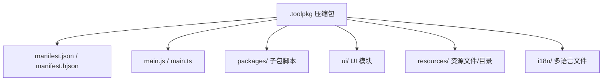
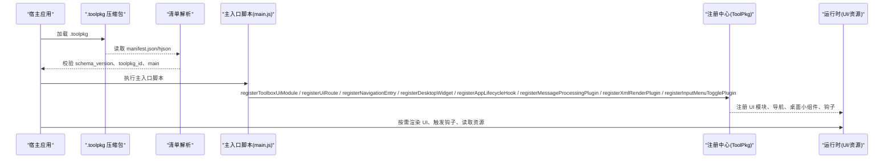
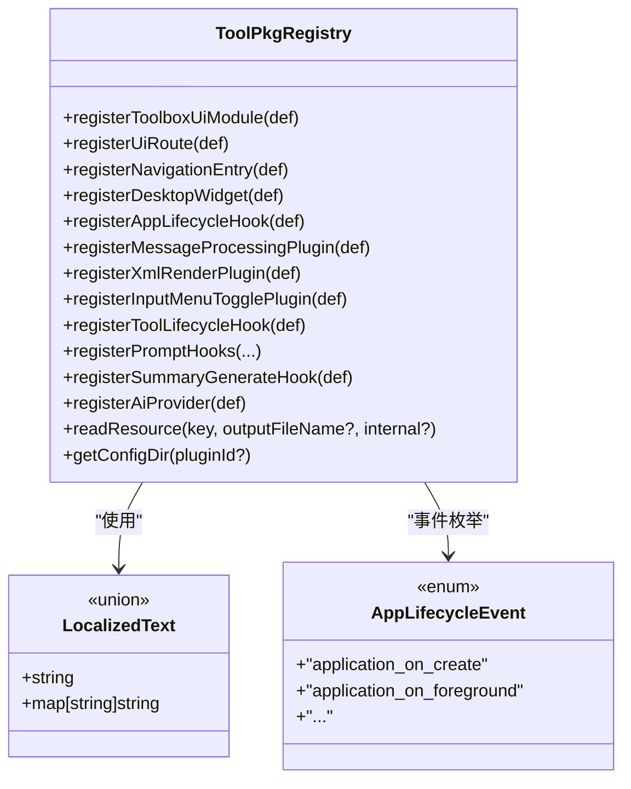

# ToolPkg 格式规范

<cite>
**本文引用的文件**
- [TOOLPKG_FORMAT_GUIDE.md](file://docs/TOOLPKG_FORMAT_GUIDE.md)
- [toolpkg.d.ts](file://examples/types/toolpkg.d.ts)
- [index.d.ts](file://examples/types/index.d.ts)
- [manifest.json（deepsearching 示例）](file://examples/deepsearching/manifest.json)
- [manifest.json（desktop_widget_demo 示例）](file://examples/desktop_widget_demo/manifest.json)
- [manifest.json（dino_runner 示例）](file://examples/dino_runner/manifest.json)
- [manifest.json（linux_ssh 示例）](file://examples/linux_ssh/manifest.json)
- [manifest.json（sidebar_account_book 示例）](file://examples/sidebar_account_book/manifest.json)
- [manifest.json（template_try 示例）](file://examples/template_try/manifest.json)
- [main.js（template_try 构建产物）](file://examples/template_try/dist/main.js)
- [debug_toolpkg.py](file://tools/debug_toolpkg.py)
- [sync_example_packages.py](file://sync_example_packages.py)
- [qqbot_device_diag.js](file://tools/qqbot_device_diag.js)
- [config.json（template_try 工作区模板）](file://examples/template_try/resources/workspaces/quick_start/.operit/config.json)
</cite>

## 目录
1. [简介](#简介)
2. [项目结构](#项目结构)
3. [核心组件](#核心组件)
4. [架构总览](#架构总览)
5. [详细组件分析](#详细组件分析)
6. [依赖关系分析](#依赖关系分析)
7. [性能考量](#性能考量)
8. [故障排查指南](#故障排查指南)
9. [结论](#结论)
10. [附录](#附录)

## 简介
ToolPkg 是 Operit 项目中用于打包和分发工具包的标准格式，本质为 ZIP 压缩包，包含清单文件与相关资源。其目标是将多个子包、资源文件、UI 模块与工作流/工作区模板统一管理，便于分发、版本化与跨平台复用。

- 与传统 JS 脚本相比，ToolPkg 提供：
  - 模块化子包组织
  - 资源打包与目录资源导出
  - 内置多语言支持
  - 明确的清单与版本管理
  - UI 模块与生命周期钩子的集中注册

**章节来源**
- [TOOLPKG_FORMAT_GUIDE.md: 1-25:1-25](file://docs/TOOLPKG_FORMAT_GUIDE.md#L1-L25)

## 项目结构
ToolPkg 的内部结构通常包含以下元素：
- 必需：清单文件（manifest.json 或 manifest.hjson）
- 必需：主入口脚本（main.js 或 main.ts）
- 可选：packages/ 子包脚本目录
- 可选：ui/ UI 模块目录
- 可选：resources/ 资源目录（含文件与目录资源）
- 可选：i18n/ 国际化文件

**图表来源**
- [TOOLPKG_FORMAT_GUIDE.md: 26-58:26-58](file://docs/TOOLPKG_FORMAT_GUIDE.md#L26-L58)

**章节来源**
- [TOOLPKG_FORMAT_GUIDE.md: 26-58:26-58](file://docs/TOOLPKG_FORMAT_GUIDE.md#L26-L58)

## 核心组件
- 清单文件（manifest）：定义 schema_version、toolpkg_id、version、author、main、display_name、description、subpackages、resources、workflow_templates、workspace_templates 等字段。
- 主入口脚本（main）：通过注册函数声明 UI 模块、导航入口、桌面小组件、生命周期钩子、消息处理插件、XML 渲染插件、输入菜单开关插件等。
- 子包脚本（packages/*.js）：按约定包含 METADATA 注释块，定义工具名称、描述、参数、环境变量等。
- 资源（resources/）：任意类型文件或目录资源，支持 MIME 类型与目录资源自动打包为 zip。
- 工作流模板（workflow_templates）：指向 resources 中的 Workflow JSON 文件。
- 工作区模板（workspace_templates）：指向 resources 中的目录资源，目录内包含 .operit/config.json。

**章节来源**
- [TOOLPKG_FORMAT_GUIDE.md: 59-541:59-541](file://docs/TOOLPKG_FORMAT_GUIDE.md#L59-L541)
- [toolpkg.d.ts: 531-677:531-677](file://examples/types/toolpkg.d.ts#L531-L677)

## 架构总览
ToolPkg 的加载与运行流程如下：

**图表来源**
- [TOOLPKG_FORMAT_GUIDE.md: 214-396:214-396](file://docs/TOOLPKG_FORMAT_GUIDE.md#L214-L396)
- [toolpkg.d.ts: 655-677:655-677](file://examples/types/toolpkg.d.ts#L655-L677)

## 详细组件分析

### 清单文件（manifest.json）字段定义与规则
- schema_version：数字，当前为 1
- toolpkg_id：字符串，包唯一标识，建议反向域名格式
- version：字符串，语义化版本
- author：字符串或字符串数组
- main：字符串，主入口脚本相对路径
- display_name / description：支持 LocalizedText（简单字符串或带语言键的对象）
- subpackages：数组，子包定义
- resources：数组，资源定义（key、path、mime）
- workflow_templates：数组，工作流模板定义（id、display_name、description、resource_key）
- workspace_templates：数组，工作区模板定义（id、display_name、description、resource_key、project_type）

字段类型与验证要点
- 必需字段：schema_version、toolpkg_id、main
- 可选字段：version、author、display_name、description、subpackages、resources、workflow_templates、workspace_templates
- LocalizedText 解析顺序：完整语言标签（如 zh-CN）、简体语言代码（如 zh）、default、对象中任意值
- 子包字段：id、entry 必需；enabled_by_default 默认 false
- 资源字段：key、path 必需；mime 可选；目录资源 mime 建议 inode/directory 或 application/x-directory
- 工作流模板：resource_key 指向 resources 中的文件资源（不可为目录）
- 工作区模板：resource_key 指向 resources 中的目录资源；目录内需包含 .operit/config.json

示例参考
- [manifest.json（deepsearching 示例）:1-17](file://examples/deepsearching/manifest.json#L1-L17)
- [manifest.json（desktop_widget_demo 示例）:1-22](file://examples/desktop_widget_demo/manifest.json#L1-L22)
- [manifest.json（dino_runner 示例）:1-43](file://examples/dino_runner/manifest.json#L1-L43)
- [manifest.json（linux_ssh 示例）:1-22](file://examples/linux_ssh/manifest.json#L1-L22)
- [manifest.json（sidebar_account_book 示例）:1-47](file://examples/sidebar_account_book/manifest.json#L1-L47)
- [manifest.json（template_try 示例）:1-58](file://examples/template_try/manifest.json#L1-L58)

**章节来源**
- [TOOLPKG_FORMAT_GUIDE.md: 137-541:137-541](file://docs/TOOLPKG_FORMAT_GUIDE.md#L137-L541)
- [manifest.json（deepsearching 示例）:1-17](file://examples/deepsearching/manifest.json#L1-L17)
- [manifest.json（desktop_widget_demo 示例）:1-22](file://examples/desktop_widget_demo/manifest.json#L1-L22)
- [manifest.json（dino_runner 示例）:1-43](file://examples/dino_runner/manifest.json#L1-L43)
- [manifest.json（linux_ssh 示例）:1-22](file://examples/linux_ssh/manifest.json#L1-L22)
- [manifest.json（sidebar_account_book 示例）:1-47](file://examples/sidebar_account_book/manifest.json#L1-L47)
- [manifest.json（template_try 示例）:1-58](file://examples/template_try/manifest.json#L1-L58)

### 主入口脚本（main.js）注册机制
- 通过 ToolPkg.registerToolboxUiModule、registerUiRoute、registerNavigationEntry、registerDesktopWidget、registerAppLifecycleHook、registerMessageProcessingPlugin、registerXmlRenderPlugin、registerInputMenuTogglePlugin 等注册 UI、导航、桌面小组件与生命周期钩子。
- 支持 Compose DSL 运行时，提供声明式 UI 能力。
- 生命周期事件包括 application/activity 等阶段事件。

示例参考
- [main.js（template_try 构建产物）:1-16](file://examples/template_try/dist/main.js#L1-L16)

**章节来源**
- [TOOLPKG_FORMAT_GUIDE.md: 214-396:214-396](file://docs/TOOLPKG_FORMAT_GUIDE.md#L214-L396)
- [main.js（template_try 构建产物）:1-16](file://examples/template_try/dist/main.js#L1-L16)

### 子包脚本（packages/*.js）
- 必须包含 METADATA 注释块，定义工具名称、描述、是否默认启用、环境变量、工具列表与参数等。
- 工具注册后以 <subpackage_id>:<tool_name> 形式暴露给宿主。
- 支持多语言描述与参数说明。

**章节来源**
- [TOOLPKG_FORMAT_GUIDE.md: 610-760:610-760](file://docs/TOOLPKG_FORMAT_GUIDE.md#L610-L760)

### 资源（resources/）
- 支持文件资源与目录资源。
- 目录资源在读取时会被自动打包为 zip 并返回临时路径；未指定输出文件名时默认补 .zip 后缀。
- 通过 ToolPkg.readResource(key[, outputFileName][, internal]) 访问资源。

示例参考
- [manifest.json（dino_runner 示例）:18-42](file://examples/dino_runner/manifest.json#L18-L42)
- [qqbot_device_diag.js:60-100](file://tools/qqbot_device_diag.js#L60-L100)

**章节来源**
- [TOOLPKG_FORMAT_GUIDE.md: 397-432:397-432](file://docs/TOOLPKG_FORMAT_GUIDE.md#L397-L432)
- [manifest.json（dino_runner 示例）:18-42](file://examples/dino_runner/manifest.json#L18-L42)
- [qqbot_device_diag.js: 60-100:60-100](file://tools/qqbot_device_diag.js#L60-L100)

### 工作流模板（workflow_templates）
- 通过 manifest 直接注册，指向 resources 中的 Workflow JSON 文件。
- 导入时会重新生成工作流 id、重置执行统计字段、落库为正式 Workflow。

**章节来源**
- [TOOLPKG_FORMAT_GUIDE.md: 433-476:433-476](file://docs/TOOLPKG_FORMAT_GUIDE.md#L433-L476)
- [manifest.json（template_try 示例）:28-41](file://examples/template_try/manifest.json#L28-L41)

### 工作区模板（workspace_templates）
- 通过 manifest 注册，指向 resources 中的目录资源，目录内需包含 .operit/config.json。
- 宿主导入时会复制整个目录到当前聊天的 workspace 目录。

示例参考
- [manifest.json（template_try 示例）:42-57](file://examples/template_try/manifest.json#L42-L57)
- [config.json（template_try 工作区模板）:1-29](file://examples/template_try/resources/workspaces/quick_start/.operit/config.json#L1-L29)

**章节来源**
- [TOOLPKG_FORMAT_GUIDE.md: 477-541:477-541](file://docs/TOOLPKG_FORMAT_GUIDE.md#L477-L541)
- [manifest.json（template_try 示例）:42-57](file://examples/template_try/manifest.json#L42-L57)
- [config.json（template_try 工作区模板）:1-29](file://examples/template_try/resources/workspaces/quick_start/.operit/config.json#L1-L29)

### 多语言支持机制
- LocalizedText 支持简单字符串与多语言对象，解析优先级：完整语言标签 → 语言代码 → default → 任意值。
- 子包 METADATA 中的描述、工具描述、参数描述、环境变量描述均支持多语言。
- UI 文案与资源可通过 i18n 目录组织。

**章节来源**
- [TOOLPKG_FORMAT_GUIDE.md: 155-180:155-180](file://docs/TOOLPKG_FORMAT_GUIDE.md#L155-L180)
- [TOOLPKG_FORMAT_GUIDE.md: 684-692:684-692](file://docs/TOOLPKG_FORMAT_GUIDE.md#L684-L692)

### 版本管理与兼容性
- schema_version：当前为 1，用于区分清单结构版本。
- version：建议使用语义化版本，便于升级与回滚。
- 兼容性：manifest 支持 JSON 与 HJSON（带注释的宽松语法），解析器会尝试 JSON 解析，失败则回退正则匹配关键字段。

**章节来源**
- [TOOLPKG_FORMAT_GUIDE.md: 61-65:61-65](file://docs/TOOLPKG_FORMAT_GUIDE.md#L61-L65)
- [TOOLPKG_FORMAT_GUIDE.md: 141-146:141-146](file://docs/TOOLPKG_FORMAT_GUIDE.md#L141-L146)

### 字段优先级与默认值
- LocalizedText 优先级：完整语言标签 > 语言代码 > default > 任意值
- 子包 enabled_by_default：默认 false
- UI 注册项 runtime：默认 compose_dsl
- 资源 mime：未指定时由宿主根据路径推断或保持空

**章节来源**
- [TOOLPKG_FORMAT_GUIDE.md: 175-180:175-180](file://docs/TOOLPKG_FORMAT_GUIDE.md#L175-L180)
- [TOOLPKG_FORMAT_GUIDE.md: 338-375:338-375](file://docs/TOOLPKG_FORMAT_GUIDE.md#L338-L375)
- [TOOLPKG_FORMAT_GUIDE.md: 419-424:419-424](file://docs/TOOLPKG_FORMAT_GUIDE.md#L419-L424)

### 错误处理机制
- 清单缺失：解析器会在文件夹与归档中查找 manifest.json/hjson，缺失时报错。
- main 入口缺失：若 manifest.main 指向的文件不存在于归档中，报错。
- 资源读取：ToolPkg.readResource 返回路径或抛出异常，调用方应捕获并提示用户。

**章节来源**
- [debug_toolpkg.py: 106-135:106-135](file://tools/debug_toolpkg.py#L106-L135)
- [qqbot_device_diag.js: 60-100:60-100](file://tools/qqbot_device_diag.js#L60-L100)

## 依赖关系分析
ToolPkg 的类型与注册接口由 TypeScript 定义文件提供约束，确保主入口脚本与宿主之间的契约一致。

**图表来源**
- [toolpkg.d.ts: 531-677:531-677](file://examples/types/toolpkg.d.ts#L531-L677)

**章节来源**
- [toolpkg.d.ts: 1-L718:1-718](file://examples/types/toolpkg.d.ts#L1-L718)
- [index.d.ts: 1-L323:1-323](file://examples/types/index.d.ts#L1-L323)

## 性能考量
- 资源目录资源自动打包为 zip，读取时可能产生 IO 开销；建议仅在首次访问时缓存路径。
- UI 模块与生命周期钩子数量过多会影响启动与渲染性能；建议按需注册与懒加载。
- 工作流与工作区模板导入时会进行反序列化与落库，建议控制模板大小与复杂度。

[本节为通用指导，无需具体文件分析]

## 故障排查指南
- 清单校验失败
  - 现象：找不到 manifest.json/hjson 或 main 入口缺失
  - 排查：确认清单存在且 main 指向的文件存在于归档中
  - 参考：[debug_toolpkg.py: 106-135:106-135](file://tools/debug_toolpkg.py#L106-L135)
- 资源读取异常
  - 现象：ToolPkg.readResource 抛错或返回空路径
  - 排查：确认 key 正确、资源已打包、目录资源 mime 设置为目录类型
  - 参考：[qqbot_device_diag.js: 60-100:60-100](file://tools/qqbot_device_diag.js#L60-L100)
- UI 注册无效
  - 现象：导航入口、桌面小组件未出现
  - 排查：确认主入口脚本已正确调用注册函数，id 唯一，route/routeId 规范
  - 参考：[toolpkg.d.ts: 531-677:531-677](file://examples/types/toolpkg.d.ts#L531-L677)

**章节来源**
- [debug_toolpkg.py: 106-135:106-135](file://tools/debug_toolpkg.py#L106-L135)
- [qqbot_device_diag.js: 60-100:60-100](file://tools/qqbot_device_diag.js#L60-L100)
- [toolpkg.d.ts: 531-677:531-677](file://examples/types/toolpkg.d.ts#L531-L677)

## 结论
ToolPkg 通过标准化的清单与目录结构，将子包、资源、UI、模板与生命周期钩子整合为统一的分发单元。借助 LocalizedText、资源目录自动打包、工作流/工作区模板注册等能力，开发者可以高效地构建与分发复杂的工具包。遵循本文档的字段定义、验证规则与最佳实践，可显著提升工具包的可维护性与用户体验。

[本节为总结，无需具体文件分析]

## 附录

### 最佳实践示例
- 简单工具包：仅包含 main.js 与少量资源
  - 参考：[manifest.json（desktop_widget_demo 示例）:1-22](file://examples/desktop_widget_demo/manifest.json#L1-L22)
- 多子包工具包：包含 packages/ 与 ui/ 目录
  - 参考：[manifest.json（linux_ssh 示例）:1-22](file://examples/linux_ssh/manifest.json#L1-L22)
- WebView/资源丰富工具包：包含 HTML/CSS/JS/PNG 等资源
  - 参考：[manifest.json（dino_runner 示例）:1-43](file://examples/dino_runner/manifest.json#L1-L43)
- 模板集成工具包：同时注册工作流模板与工作区模板
  - 参考：[manifest.json（template_try 示例）:1-58](file://examples/template_try/manifest.json#L1-L58)

**章节来源**
- [manifest.json（desktop_widget_demo 示例）:1-22](file://examples/desktop_widget_demo/manifest.json#L1-L22)
- [manifest.json（linux_ssh 示例）:1-22](file://examples/linux_ssh/manifest.json#L1-L22)
- [manifest.json（dino_runner 示例）:1-43](file://examples/dino_runner/manifest.json#L1-L43)
- [manifest.json（template_try 示例）:1-58](file://examples/template_try/manifest.json#L1-L58)

### 打包与调试
- 手动打包：将目录打包为 .toolpkg
- 自动打包：使用 sync_example_packages.py 扫描 examples/ 目录并生成 .toolpkg
- 调试工具：debug_toolpkg.py 用于检查清单与入口有效性

**章节来源**
- [TOOLPKG_FORMAT_GUIDE.md: 542-610:542-610](file://docs/TOOLPKG_FORMAT_GUIDE.md#L542-L610)
- [sync_example_packages.py: 538-574:538-574](file://sync_example_packages.py#L538-L574)
- [debug_toolpkg.py: 106-135:106-135](file://tools/debug_toolpkg.py#L106-L135)