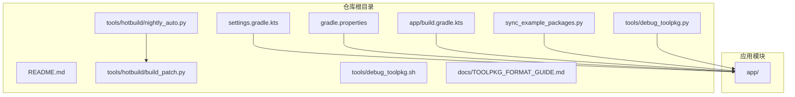
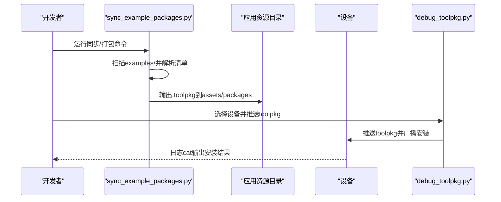
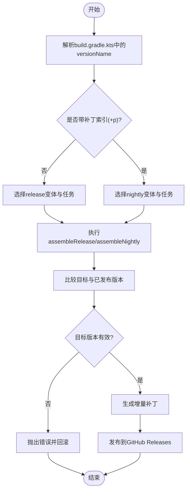
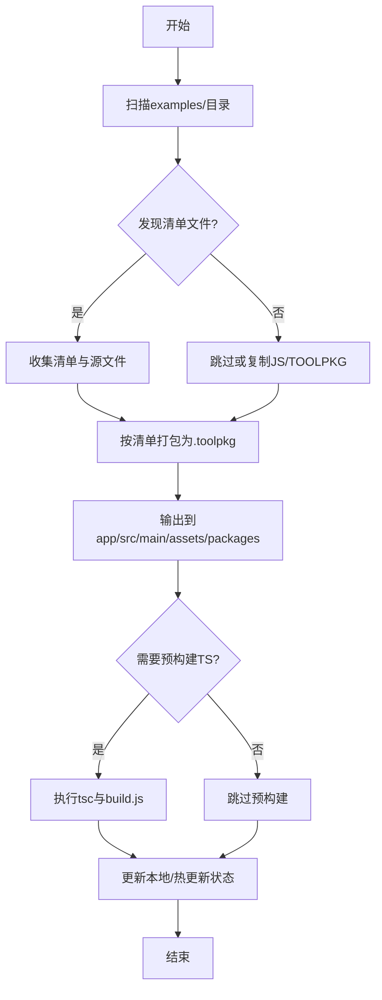
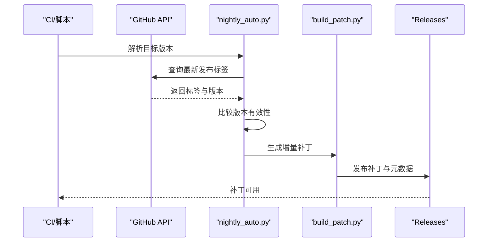
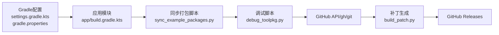

# 发布与分发流程

<cite>
**本文引用的文件**
- [README.md](file://README.md)
- [TOOLPKG_FORMAT_GUIDE.md](file://docs/TOOLPKG_FORMAT_GUIDE.md)
- [sync_example_packages.py](file://sync_example_packages.py)
- [debug_toolpkg.py](file://tools/debug_toolpkg.py)
- [debug_toolpkg.sh](file://tools/debug_toolpkg.sh)
- [nightly_auto.py](file://tools/hotbuild/nightly_auto.py)
- [build_patch.py](file://tools/hotbuild/build_patch.py)
- [build.gradle.kts](file://app/build.gradle.kts)
- [settings.gradle.kts](file://settings.gradle.kts)
- [gradle.properties](file://gradle.properties)
</cite>

## 目录
1. [简介](#简介)
2. [项目结构](#项目结构)
3. [核心组件](#核心组件)
4. [架构总览](#架构总览)
5. [详细组件分析](#详细组件分析)
6. [依赖关系分析](#依赖关系分析)
7. [性能考量](#性能考量)
8. [故障排查指南](#故障排查指南)
9. [结论](#结论)
10. [附录](#附录)

## 简介
本指南面向 ToolPkg 的发布与分发，围绕版本管理策略、打包发布流程、分发策略、更新机制、质量保证与发布检查清单，结合仓库现有脚本与文档，给出可落地的操作步骤与最佳实践，帮助开发者高效完成工具包的发布与维护。

## 项目结构
Operit 仓库采用多模块 Gradle 架构，ToolPkg 作为应用内的可分发工具包，主要通过 Python 脚本进行打包、同步与热更新，配合 Gradle 构建系统与夜间构建脚本实现增量补丁与发布。

**图表来源**
- [settings.gradle.kts:1-30](file://settings.gradle.kts#L1-L30)
- [gradle.properties:1-29](file://gradle.properties#L1-L29)
- [app/build.gradle.kts](file://app/build.gradle.kts)
- [sync_example_packages.py:1-800](file://sync_example_packages.py#L1-L800)
- [debug_toolpkg.py:1-394](file://tools/debug_toolpkg.py#L1-L394)
- [nightly_auto.py:1-342](file://tools/hotbuild/nightly_auto.py#L1-L342)
- [build_patch.py:1-558](file://tools/hotbuild/build_patch.py#L1-L558)
- [TOOLPKG_FORMAT_GUIDE.md:1-800](file://docs/TOOLPKG_FORMAT_GUIDE.md#L1-L800)

**章节来源**
- [settings.gradle.kts:1-30](file://settings.gradle.kts#L1-L30)
- [gradle.properties:1-29](file://gradle.properties#L1-L29)
- [README.md:1-469](file://README.md#L1-L469)

## 核心组件
- ToolPkg 格式与清单：ToolPkg 本质为 ZIP，清单文件定义元数据、主入口、子包、资源、工作流与工作区模板等。
- 自动打包与同步：Python 脚本扫描 examples 目录，按清单打包为 .toolpkg，并输出至应用资源目录，支持白名单与预构建。
- 调试安装与热更新：Python 脚本将 .toolpkg 推送到设备并广播安装，支持 SHA256 热更新与状态持久化。
- 夜间构建与增量补丁：Python 脚本解析版本号、构建 APK、生成 APKRAW/APKZIP/OPTCH 增量补丁并发布到 GitHub Releases。

**章节来源**
- [TOOLPKG_FORMAT_GUIDE.md:1-800](file://docs/TOOLPKG_FORMAT_GUIDE.md#L1-L800)
- [sync_example_packages.py:1-800](file://sync_example_packages.py#L1-L800)
- [debug_toolpkg.py:1-394](file://tools/debug_toolpkg.py#L1-L394)
- [nightly_auto.py:1-342](file://tools/hotbuild/nightly_auto.py#L1-L342)
- [build_patch.py:1-558](file://tools/hotbuild/build_patch.py#L1-L558)

## 架构总览
ToolPkg 发布与分发涉及以下关键流程：
- 版本管理：基于 Gradle 的 versionName 解析，支持 v.M.m.p 格式与补丁索引。
- 打包发布：Python 脚本扫描示例包，按清单打包为 .toolpkg，输出到应用资源目录。
- 分发策略：支持 GitHub Releases、夜间构建与增量补丁发布。
- 更新机制：设备侧通过广播安装 .toolpkg，支持热更新与回滚。
- 质量保证：脚本内置校验、日志与错误处理，配合 Gradle 并行与缓存优化。

**图表来源**
- [sync_example_packages.py:748-800](file://sync_example_packages.py#L748-L800)
- [debug_toolpkg.py:256-318](file://tools/debug_toolpkg.py#L256-L318)

## 详细组件分析

### 版本管理策略
- 版本号规范
  - 基于 Gradle 的 versionName 解析，支持 v.M.m.p 格式与补丁索引（+p）。
  - 夜间构建根据目标版本选择 release/nightly 变体与任务。
- 语义化版本控制
  - 通过比较版本字符串与补丁索引，确保补丁版本大于已发布版本。
- 变更日志维护
  - 仓库 README 提供版本历程与更新摘要，便于发布说明。
- 向后兼容性保证
  - ToolPkg 清单 schema_version 与 manifest 字段保持稳定，避免破坏性变更。

**图表来源**
- [nightly_auto.py:206-342](file://tools/hotbuild/nightly_auto.py#L206-L342)
- [build_patch.py:429-558](file://tools/hotbuild/build_patch.py#L429-L558)

**章节来源**
- [nightly_auto.py:25-63](file://tools/hotbuild/nightly_auto.py#L25-L63)
- [nightly_auto.py:206-342](file://tools/hotbuild/nightly_auto.py#L206-L342)
- [README.md:197-406](file://README.md#L197-L406)

### 打包发布流程
- 自动打包脚本使用
  - 扫描 examples 目录，识别包含 manifest.json/hjson 的文件夹并打包为 .toolpkg。
  - 支持白名单、追加包含、预构建 TypeScript/JS、Dry-Run、删除多余输出。
- 手动打包步骤
  - 准备文件结构（manifest.json、packages/、ui/、resources/、i18n/）。
  - 使用 ZIP 工具打包为 .toolpkg。
- 文件完整性验证
  - Python 脚本内置 SHA256 校验与清单解析，确保主入口存在且可读。
- 签名证书管理
  - 仓库未提供签名证书脚本，建议在 Gradle 中配置签名策略并在 CI 中注入密钥。

**图表来源**
- [sync_example_packages.py:168-248](file://sync_example_packages.py#L168-L248)
- [sync_example_packages.py:414-453](file://sync_example_packages.py#L414-L453)
- [debug_toolpkg.py:106-136](file://tools/debug_toolpkg.py#L106-L136)

**章节来源**
- [sync_example_packages.py:581-603](file://sync_example_packages.py#L581-L603)
- [sync_example_packages.py:748-800](file://sync_example_packages.py#L748-L800)
- [debug_toolpkg.py:106-136](file://tools/debug_toolpkg.py#L106-L136)

### 分发策略指导
- 插件市场发布
  - 通过 ToolPkg 清单中的工作流与工作区模板，将包注册到宿主入口，便于用户安装与使用。
- GitHub 分发
  - 夜间构建脚本解析最新发布标签，生成增量补丁并发布到 Releases。
- 私有服务器部署
  - 将 .toolpkg 文件托管在私有服务器，通过应用内下载与安装流程完成分发。
- 企业内部分发
  - 结合企业分发平台或 MDM，统一推送 .toolpkg 与版本策略。

**章节来源**
- [TOOLPKG_FORMAT_GUIDE.md:433-524](file://docs/TOOLPKG_FORMAT_GUIDE.md#L433-L524)
- [nightly_auto.py:267-289](file://tools/hotbuild/nightly_auto.py#L267-L289)
- [build_patch.py:363-427](file://tools/hotbuild/build_patch.py#L363-L427)

### 更新机制设计
- 版本检测
  - 通过 GitHub API/gh/git 获取最新发布标签，解析版本与补丁索引。
- 增量更新
  - 生成 APKRAW/APKZIP/OPTCH 增量补丁，减少传输体积。
- 回滚策略
  - 夜间构建脚本在失败时回滚 to.apk 到 from.apk，保障稳定性。
- 用户通知机制
  - 应用侧通过日志与广播反馈安装状态，便于用户确认。

**图表来源**
- [nightly_auto.py:75-177](file://tools/hotbuild/nightly_auto.py#L75-L177)
- [nightly_auto.py:206-342](file://tools/hotbuild/nightly_auto.py#L206-L342)
- [build_patch.py:429-558](file://tools/hotbuild/build_patch.py#L429-L558)

**章节来源**
- [nightly_auto.py:196-204](file://tools/hotbuild/nightly_auto.py#L196-L204)
- [build_patch.py:363-427](file://tools/hotbuild/build_patch.py#L363-L427)

### 质量保证流程
- 代码审查
  - 通过 GitHub Issues/PR 流程进行审查（参考 README 中的贡献与问题反馈说明）。
- 安全扫描
  - 建议在 CI 中集成静态分析与依赖扫描，确保第三方库与脚本安全。
- 性能测试
  - Gradle 并行与缓存配置（org.gradle.parallel、org.gradle.caching）提升构建效率。
- 兼容性验证
  - 多设备 ADB 测试与日志捕获，验证 ToolPkg 安装与运行。

**章节来源**
- [README.md:409-459](file://README.md#L409-L459)
- [gradle.properties:24-29](file://gradle.properties#L24-L29)
- [debug_toolpkg.py:307-318](file://tools/debug_toolpkg.py#L307-L318)

## 依赖关系分析
- Gradle 插件与仓库
  - 根构建脚本声明 Android/Kotlin/Compose 等插件，settings 与 gradle.properties 管理仓库与并行配置。
- ToolPkg 打包与调试
  - Python 脚本依赖 adb、git、zip 等工具，与应用资源目录耦合。
- 夜间构建与补丁
  - 依赖 GitHub API/gh/git 获取标签，发布到 Releases。

**图表来源**
- [settings.gradle.kts:1-30](file://settings.gradle.kts#L1-L30)
- [gradle.properties:1-29](file://gradle.properties#L1-L29)
- [app/build.gradle.kts](file://app/build.gradle.kts)
- [sync_example_packages.py:1-800](file://sync_example_packages.py#L1-L800)
- [debug_toolpkg.py:1-394](file://tools/debug_toolpkg.py#L1-L394)
- [build_patch.py:1-558](file://tools/hotbuild/build_patch.py#L1-L558)

**章节来源**
- [settings.gradle.kts:1-30](file://settings.gradle.kts#L1-L30)
- [gradle.properties:1-29](file://gradle.properties#L1-L29)

## 性能考量
- 构建性能
  - 启用并行构建与构建缓存，减少重复编译时间。
- 打包性能
  - 使用 ZIP_DEFLATED 压缩，合理设置块大小与分块策略。
- 传输性能
  - 增量补丁显著降低网络传输与存储成本。

[本节为通用指导，无需具体文件分析]

## 故障排查指南
- ADB 设备不可用
  - 检查 adb 是否在 PATH，设备是否授权。
- 清单缺失或主入口不存在
  - 确保 manifest.json/hjson 存在且 main 字段指向的文件存在。
- 版本无效或小于已发布版本
  - 校验版本字符串与补丁索引，确保目标版本更高。
- 日志捕获
  - 使用调试脚本的日志等待参数与日志标签，捕获安装过程输出。

**章节来源**
- [debug_toolpkg.py:207-254](file://tools/debug_toolpkg.py#L207-L254)
- [debug_toolpkg.py:307-318](file://tools/debug_toolpkg.py#L307-L318)
- [nightly_auto.py:196-204](file://tools/hotbuild/nightly_auto.py#L196-L204)

## 结论
通过 ToolPkg 格式规范、Python 自动化脚本与 Gradle 构建体系，Operit 实现了从打包、调试、热更新到夜间构建与增量补丁发布的完整闭环。遵循本文档的版本管理、打包流程、分发策略与质量保证措施，可显著提升发布效率与稳定性。

[本节为总结，无需具体文件分析]

## 附录
- 发布检查清单
  - 版本号与补丁索引正确，已发布版本比较有效
  - 清单文件完整，主入口存在且可读
  - 预构建产物齐全（TS/JS），无多余文件残留
  - .toolpkg 打包成功，SHA256 校验通过
  - 设备 ADB 可用，日志捕获正常
  - 夜间构建与增量补丁生成并通过发布校验
- 最佳实践
  - 使用白名单控制输出，避免误删
  - 在 CI 中注入 GitHub Token，提高 API 限额
  - 对关键补丁进行人工复核后再发布

[本节为通用指导，无需具体文件分析]