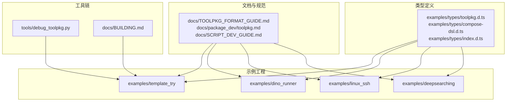
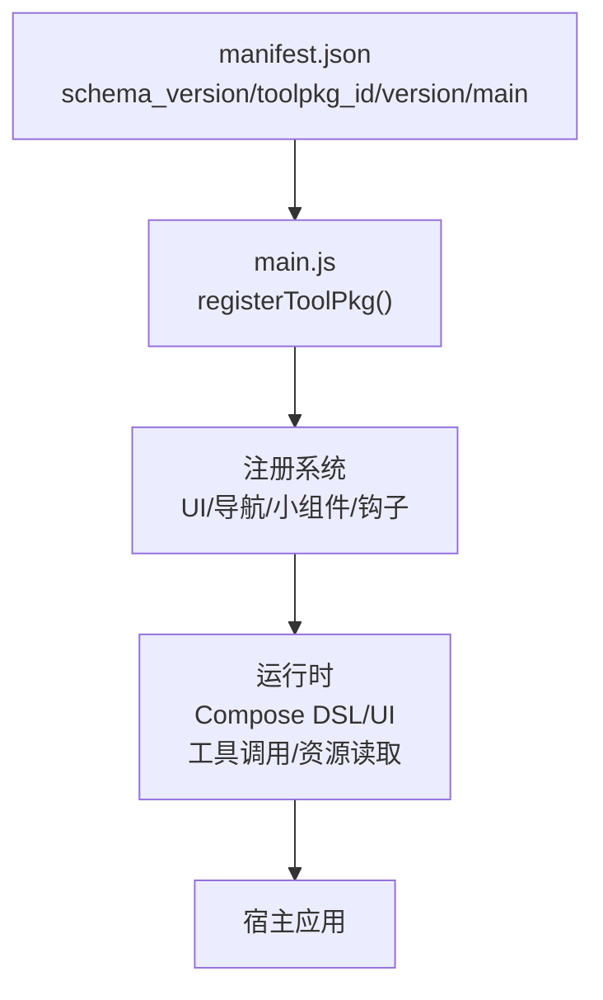
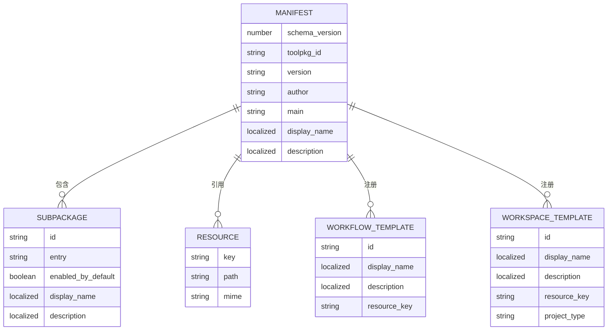
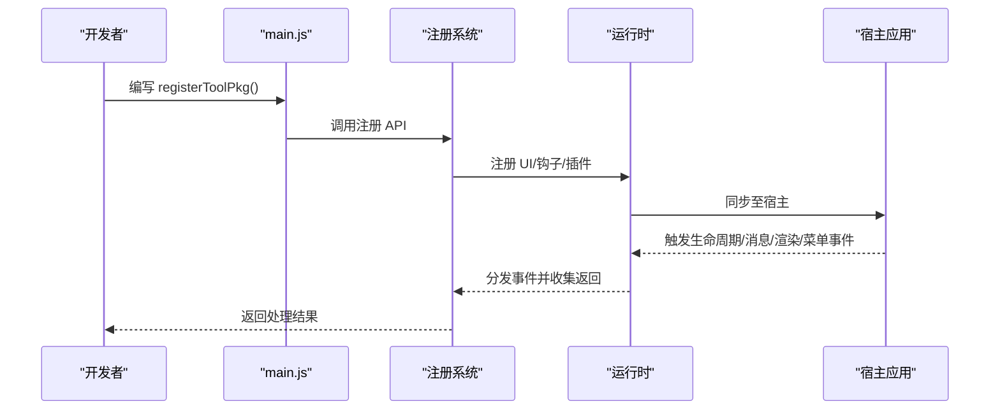
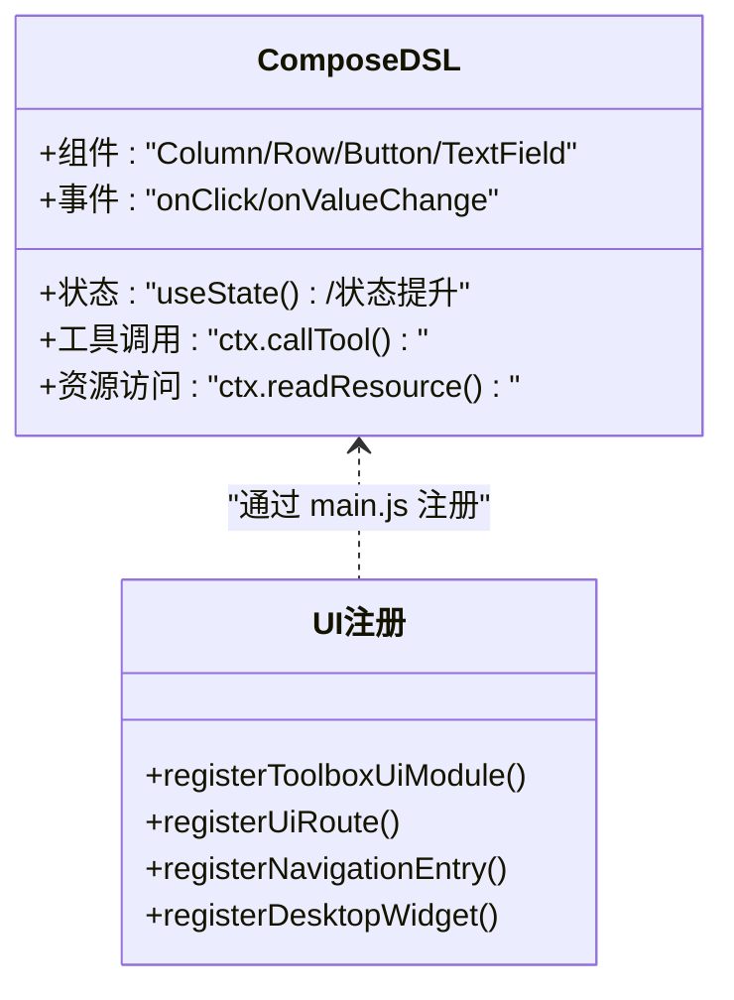
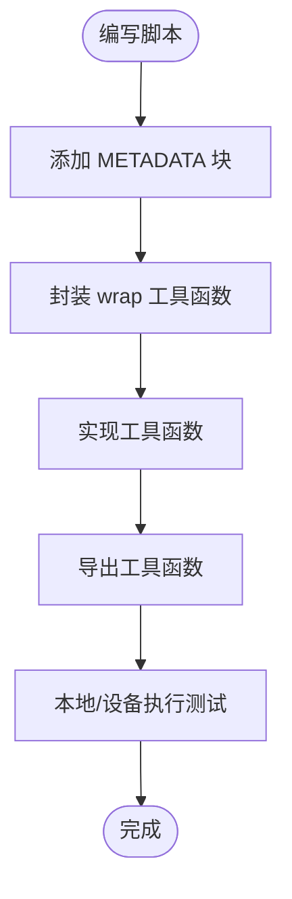
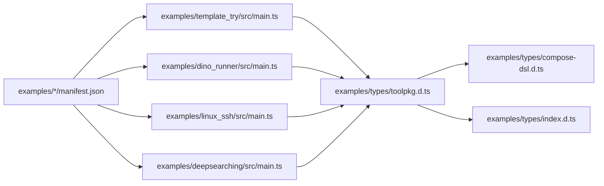
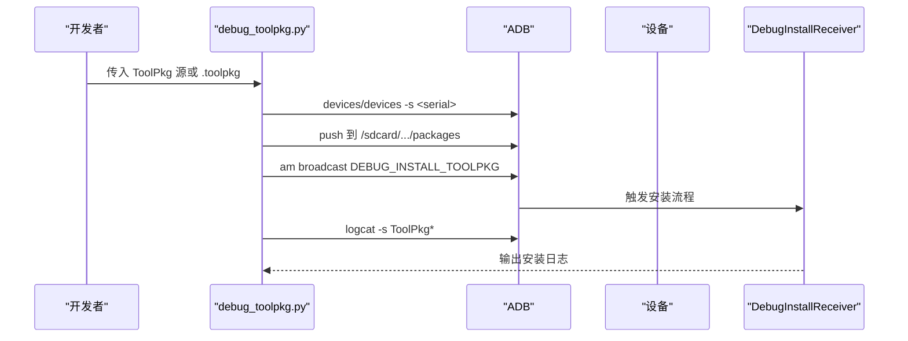

# 工具包开发指南

<cite>
**本文档引用的文件**
- [TOOLPKG_FORMAT_GUIDE.md](file://docs/TOOLPKG_FORMAT_GUIDE.md)
- [toolpkg.md](file://docs/package_dev/toolpkg.md)
- [SCRIPT_DEV_GUIDE.md](file://docs/SCRIPT_DEV_GUIDE.md)
- [BUILDING.md](file://docs/BUILDING.md)
- [debug_toolpkg.py](file://tools/debug_toolpkg.py)
- [toolpkg.d.ts](file://examples/types/toolpkg.d.ts)
- [compose-dsl.d.ts](file://examples/types/compose-dsl.d.ts)
- [index.d.ts](file://examples/types/index.d.ts)
- [template_try/manifest.json](file://examples/template_try/manifest.json)
- [dino_runner/manifest.json](file://examples/dino_runner/manifest.json)
- [deepsearching/manifest.json](file://examples/deepsearching/manifest.json)
- [template_try/src/main.ts](file://examples/template_try/src/main.ts)
- [dino_runner/src/main.ts](file://examples/dino_runner/src/main.ts)
- [linux_ssh/src/main.ts](file://examples/linux_ssh/src/main.ts)
- [deepsearching/src/main.ts](file://examples/deepsearching/src/main.ts)
</cite>

## 目录
1. [简介](#简介)
2. [项目结构](#项目结构)
3. [核心组件](#核心组件)
4. [架构总览](#架构总览)
5. [详细组件分析](#详细组件分析)
6. [依赖关系分析](#依赖关系分析)
7. [性能考虑](#性能考虑)
8. [故障排查指南](#故障排查指南)
9. [结论](#结论)
10. [附录](#附录)

## 简介
本指南面向 Operit AI 工具包开发者，系统讲解 ToolPkg 格式规范、开发流程、调试方法、发布流程、生命周期管理与系统集成要点。文档结合仓库内的格式规范、类型定义与示例工程，帮助你在 Android 环境下高效构建、调试与分发工具包。

## 项目结构
Operit 项目采用多模块与示例工程并存的组织方式：
- 文档与规范：docs 目录包含 ToolPkg 格式、API 类型定义与开发指南
- 示例工程：examples 目录包含多个可直接参考的 ToolPkg 示例（如 template_try、dino_runner、linux_ssh、deepsearching 等）
- 工具链：tools 目录提供调试安装脚本与构建工具
- 类型系统：examples/types 目录提供 TypeScript 类型定义，支撑开发体验与 IDE 智能提示

**图表来源**
- [TOOLPKG_FORMAT_GUIDE.md:1-1241](file://docs/TOOLPKG_FORMAT_GUIDE.md#L1-L1241)
- [toolpkg.md:1-596](file://docs/package_dev/toolpkg.md#L1-L596)
- [SCRIPT_DEV_GUIDE.md:1-1045](file://docs/SCRIPT_DEV_GUIDE.md#L1-L1045)
- [BUILDING.md:1-266](file://docs/BUILDING.md#L1-L266)
- [toolpkg.d.ts:1-718](file://examples/types/toolpkg.d.ts#L1-L718)
- [compose-dsl.d.ts:1-1188](file://examples/types/compose-dsl.d.ts#L1-L1188)
- [index.d.ts:1-323](file://examples/types/index.d.ts#L1-L323)

**章节来源**
- [TOOLPKG_FORMAT_GUIDE.md:1-1241](file://docs/TOOLPKG_FORMAT_GUIDE.md#L1-L1241)
- [toolpkg.md:1-596](file://docs/package_dev/toolpkg.md#L1-L596)
- [SCRIPT_DEV_GUIDE.md:1-1045](file://docs/SCRIPT_DEV_GUIDE.md#L1-L1045)
- [BUILDING.md:1-266](file://docs/BUILDING.md#L1-L266)

## 核心组件
- ToolPkg 格式与清单：ToolPkg 是基于 ZIP 的标准包格式，核心为 manifest.json（或 manifest.hjson），定义 schema_version、toolpkg_id、version、main、display_name、description、subpackages、resources、workflow_templates、workspace_templates 等字段
- 注册系统：通过 main.js 导出 registerToolPkg()，集中注册 UI 模块、导航入口、桌面小组件、应用生命周期钩子、消息处理插件、XML 渲染插件、输入菜单开关插件等
- 类型定义：examples/types/toolpkg.d.ts 提供完整的注册对象、事件类型、返回值类型与运行时 API（如 ToolPkg.readResource）
- Compose DSL：UI 模块运行时，支持声明式 UI 组件与状态管理，配合 ctx 调用工具与资源
- 脚本开发：examples/types/index.d.ts 提供 Tools.* API、Java/Kotlin 桥接、全局工具函数等

**章节来源**
- [TOOLPKG_FORMAT_GUIDE.md:59-135](file://docs/TOOLPKG_FORMAT_GUIDE.md#L59-L135)
- [toolpkg.md:1-596](file://docs/package_dev/toolpkg.md#L1-L596)
- [toolpkg.d.ts:1-718](file://examples/types/toolpkg.d.ts#L1-L718)
- [compose-dsl.d.ts:1-1188](file://examples/types/compose-dsl.d.ts#L1-L1188)
- [index.d.ts:1-323](file://examples/types/index.d.ts#L1-L323)

## 架构总览
ToolPkg 的运行时架构围绕“注册—执行—反馈”闭环展开：开发者在 manifest 中声明元数据与资源，通过 main.js 注册 UI 与钩子，运行时在生命周期、消息处理、XML 渲染、输入菜单等节点注入行为，最终通过 ctx 调用工具与访问资源。

**图表来源**
- [TOOLPKG_FORMAT_GUIDE.md:26-135](file://docs/TOOLPKG_FORMAT_GUIDE.md#L26-L135)
- [toolpkg.md:392-430](file://docs/package_dev/toolpkg.md#L392-L430)

**章节来源**
- [TOOLPKG_FORMAT_GUIDE.md:26-135](file://docs/TOOLPKG_FORMAT_GUIDE.md#L26-L135)
- [toolpkg.md:392-430](file://docs/package_dev/toolpkg.md#L392-L430)

## 详细组件分析

### 组件A：清单与资源管理
- 清单字段：schema_version、toolpkg_id、version、author、main、display_name、description、subpackages、resources、workflow_templates、workspace_templates
- 资源声明：resources[].key、path、mime；目录资源会自动打包为 zip
- 工作流与工作区模板：通过 manifest 直接注册，导入后生成正式实体

**图表来源**
- [TOOLPKG_FORMAT_GUIDE.md:59-135](file://docs/TOOLPKG_FORMAT_GUIDE.md#L59-L135)

**章节来源**
- [TOOLPKG_FORMAT_GUIDE.md:59-135](file://docs/TOOLPKG_FORMAT_GUIDE.md#L59-L135)
- [template_try/manifest.json:1-58](file://examples/template_try/manifest.json#L1-L58)
- [dino_runner/manifest.json:1-43](file://examples/dino_runner/manifest.json#L1-L43)
- [deepsearching/manifest.json:1-17](file://examples/deepsearching/manifest.json#L1-L17)

### 组件B：注册系统与生命周期钩子
- 注册项：ToolPkg.registerToolboxUiModule、registerUiRoute、registerNavigationEntry、registerDesktopWidget、registerAppLifecycleHook、registerMessageProcessingPlugin、registerXmlRenderPlugin、registerInputMenuTogglePlugin、registerToolLifecycleHook、prompt 系列钩子、registerSummaryGenerateHook、registerAiProvider
- 生命周期事件：application_on_create、application_on_foreground、application_on_background、activity_* 等
- 返回值与事件载荷：统一使用 JsonValue/JsonObject 约束，支持字符串、数组、对象与空返回

**图表来源**
- [toolpkg.md:392-430](file://docs/package_dev/toolpkg.md#L392-L430)
- [toolpkg.d.ts:655-677](file://examples/types/toolpkg.d.ts#L655-L677)

**章节来源**
- [toolpkg.md:392-430](file://docs/package_dev/toolpkg.md#L392-L430)
- [toolpkg.d.ts:655-677](file://examples/types/toolpkg.d.ts#L655-L677)

### 组件C：UI 模块与 Compose DSL
- Compose DSL：提供 Column、Row、Button、TextField 等组件，支持状态管理、事件处理与 ctx 调用工具
- UI 注册：registerToolboxUiModule、registerUiRoute、registerNavigationEntry、registerDesktopWidget
- 示例：dino_runner 展示了 UI 路由与侧边栏导航入口的注册

**图表来源**
- [compose-dsl.d.ts:1-1188](file://examples/types/compose-dsl.d.ts#L1-L1188)
- [dino_runner/src/main.ts:1-33](file://examples/dino_runner/src/main.ts#L1-L33)

**章节来源**
- [compose-dsl.d.ts:1-1188](file://examples/types/compose-dsl.d.ts#L1-L1188)
- [dino_runner/src/main.ts:1-33](file://examples/dino_runner/src/main.ts#L1-L33)

### 组件D：脚本开发与工具调用
- 脚本元数据：METADATA 块定义 name、display_name、description、author、category、env、tools 等
- 工具函数：通过 exports 导出，支持 wrap 统一错误处理与 complete 返回
- Tools.* API：System、UI、Files、Net、FFmpeg、Tasker、Workflow、Chat、Memory 等
- Java/Kotlin 桥接：Java/Kotlin 全局对象，支持类获取、静态调用、接口实现、suspend 调用

**图表来源**
- [SCRIPT_DEV_GUIDE.md:272-761](file://docs/SCRIPT_DEV_GUIDE.md#L272-L761)
- [index.d.ts:298-322](file://examples/types/index.d.ts#L298-L322)

**章节来源**
- [SCRIPT_DEV_GUIDE.md:272-761](file://docs/SCRIPT_DEV_GUIDE.md#L272-L761)
- [index.d.ts:298-322](file://examples/types/index.d.ts#L298-L322)

## 依赖关系分析
- 类型依赖：toolpkg.d.ts 依赖 compose-dsl.d.ts 与 core 类型，index.d.ts 汇总导出各模块类型
- 示例依赖：各示例通过 main.ts 导出 registerToolPkg 与钩子函数，依赖 ToolPkg 注册系统
- 资源依赖：manifest.resources 声明资源键，main.js/子包脚本通过 ToolPkg.readResource 访问

**图表来源**
- [toolpkg.d.ts:1-718](file://examples/types/toolpkg.d.ts#L1-L718)
- [compose-dsl.d.ts:1-1188](file://examples/types/compose-dsl.d.ts#L1-L1188)
- [index.d.ts:1-323](file://examples/types/index.d.ts#L1-L323)
- [template_try/src/main.ts:1-14](file://examples/template_try/src/main.ts#L1-L14)
- [dino_runner/src/main.ts:1-33](file://examples/dino_runner/src/main.ts#L1-L33)
- [linux_ssh/src/main.ts:1-27](file://examples/linux_ssh/src/main.ts#L1-L27)
- [deepsearching/src/main.ts:1-8](file://examples/deepsearching/src/main.ts#L1-L8)

**章节来源**
- [toolpkg.d.ts:1-718](file://examples/types/toolpkg.d.ts#L1-L718)
- [compose-dsl.d.ts:1-1188](file://examples/types/compose-dsl.d.ts#L1-L1188)
- [index.d.ts:1-323](file://examples/types/index.d.ts#L1-L323)
- [template_try/src/main.ts:1-14](file://examples/template_try/src/main.ts#L1-L14)
- [dino_runner/src/main.ts:1-33](file://examples/dino_runner/src/main.ts#L1-L33)
- [linux_ssh/src/main.ts:1-27](file://examples/linux_ssh/src/main.ts#L1-L27)
- [deepsearching/src/main.ts:1-8](file://examples/deepsearching/src/main.ts#L1-L8)

## 性能考虑
- 资源访问：目录资源会打包为 zip，注意 I/O 与解压成本；建议按需读取与缓存
- UI 渲染：Compose DSL 组件应避免过度嵌套与频繁重组；合理使用状态提升与 key
- 工具调用：批量工具调用可考虑并发（Promise.all），但需遵守宿主实现与工具执行器限制
- 日志与监控：使用宿主日志系统记录关键路径耗时与错误，便于定位性能瓶颈

[本节为通用指导，无需特定文件引用]

## 故障排查指南
- 调试安装：使用 tools/debug_toolpkg.py 将 ToolPkg 推送到设备 /sdcard/Android/data/<package>/files/packages，并广播 DEBUG_INSTALL_TOOLPKG 触发安装与日志捕获
- 设备选择：脚本会自动检测 ADB 设备，支持多设备选择
- 日志分析：关注 ToolPkgDebugInstallReceiver、ToolPkg、PackageManager 相关日志标签
- 常见问题：manifest.main 缺失、manifest.toolpkg_id 未找到、资源路径不存在、主入口文件不存在等

**图表来源**
- [debug_toolpkg.py:1-394](file://tools/debug_toolpkg.py#L1-L394)

**章节来源**
- [debug_toolpkg.py:1-394](file://tools/debug_toolpkg.py#L1-L394)

## 结论
通过本指南，你可以系统掌握 Operit AI 工具包的格式规范、开发流程、调试方法与发布策略。建议从 template_try、dino_runner 等示例入手，结合类型定义与调试脚本，快速构建高质量的 ToolPkg 并与宿主应用深度集成。

[本节为总结性内容，无需特定文件引用]

## 附录

### A. 开发流程速览
- 项目初始化：参考 BUILDING.md 完成 Android 环境与依赖安装
- 创建 ToolPkg：准备 manifest.json、main.js、packages/ui/resources/i18n 目录结构
- 编写与测试：使用 tools/execute_js.* 执行脚本，调试 ToolPkg 使用 tools/debug_toolpkg.*
- 打包与分发：使用 sync_example_packages.py 或手动 ZIP 打包为 .toolpkg

**章节来源**
- [BUILDING.md:1-266](file://docs/BUILDING.md#L1-L266)
- [TOOLPKG_FORMAT_GUIDE.md:542-610](file://docs/TOOLPKG_FORMAT_GUIDE.md#L542-L610)

### B. 开发示例路径
- 模板接入演示：template_try（工作流/工作区模板注册）
- 小恐龙快跑：dino_runner（UI 路由与导航入口）
- Linux SSH 管理：linux_ssh（工具箱 UI 模块与生命周期钩子）
- 深度搜索：deepsearching（消息处理/XML 渲染/输入菜单开关插件）

**章节来源**
- [template_try/manifest.json:1-58](file://examples/template_try/manifest.json#L1-L58)
- [dino_runner/manifest.json:1-43](file://examples/dino_runner/manifest.json#L1-L43)
- [deepsearching/manifest.json:1-17](file://examples/deepsearching/manifest.json#L1-L17)
- [template_try/src/main.ts:1-14](file://examples/template_try/src/main.ts#L1-L14)
- [dino_runner/src/main.ts:1-33](file://examples/dino_runner/src/main.ts#L1-L33)
- [linux_ssh/src/main.ts:1-27](file://examples/linux_ssh/src/main.ts#L1-L27)
- [deepsearching/src/main.ts:1-8](file://examples/deepsearching/src/main.ts#L1-L8)