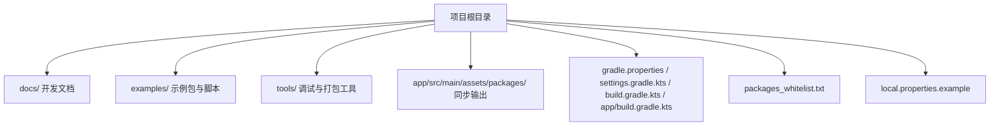
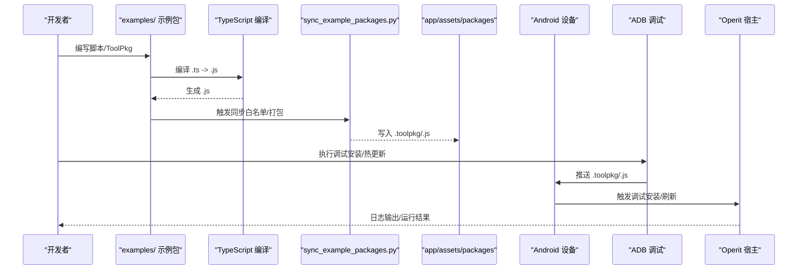
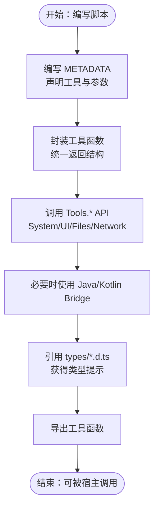
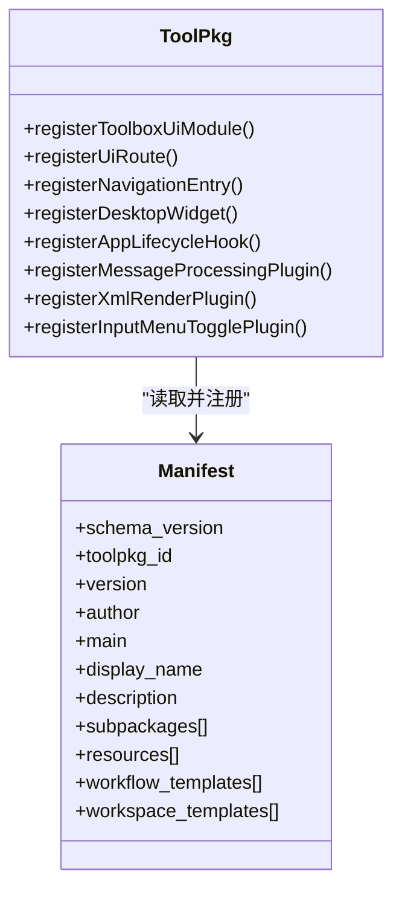
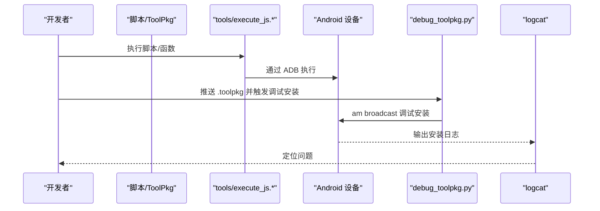
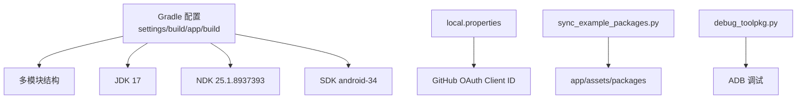

# 开发流程指南

<cite>
**本文引用的文件**   
- [README.md](file://README.md)
- [BUILDING.md](file://docs/BUILDING.md)
- [CONTRIBUTING.md](file://docs/CONTRIBUTING.md)
- [SCRIPT_DEV_GUIDE.md](file://docs/SCRIPT_DEV_GUIDE.md)
- [SCRIPT_DEV_SKILL.md](file://docs/SCRIPT_DEV_SKILL.md)
- [TOOLPKG_FORMAT_GUIDE.md](file://docs/TOOLPKG_FORMAT_GUIDE.md)
- [DEFAULT_TOOLS_ARCH.md](file://docs/DEFAULT_TOOLS_ARCH.md)
- [JAVA_BRIDGE_INTERFACE.md](file://docs/JAVA_BRIDGE_INTERFACE.md)
- [RENDERER_ARCH.md](file://docs/RENDERER_ARCH.md)
- [debug_toolpkg.py](file://tools/debug_toolpkg.py)
- [sync_example_packages.py](file://sync_example_packages.py)
- [packages_whitelist.txt](file://packages_whitelist.txt)
- [gradle.properties](file://gradle.properties)
- [settings.gradle.kts](file://settings.gradle.kts)
- [build.gradle.kts](file://build.gradle.kts)
- [app/build.gradle.kts](file://app/build.gradle.kts)
- [local.properties.example](file://local.properties.example)
- [tools/execute_js.sh](file://tools/execute_js.sh)
- [tools/execute_js.bat](file://tools/execute_js.bat)
- [tools/run_sandbox_script.sh](file://tools/run_sandbox_script.sh)
- [tools/run_sandbox_script.bat](file://tools/run_sandbox_script.bat)
</cite>

## 目录
1. [简介](#简介)
2. [项目结构](#项目结构)
3. [核心组件](#核心组件)
4. [架构总览](#架构总览)
5. [详细组件分析](#详细组件分析)
6. [依赖分析](#依赖分析)
7. [性能考量](#性能考量)
8. [故障排查指南](#故障排查指南)
9. [结论](#结论)
10. [附录](#附录)

## 简介
本指南面向希望参与 ToolPkg 开发与发布的工程师与爱好者，提供从项目初始化、开发环境搭建、代码规范、UI 模块与资源管理、多语言支持、调试测试、打包发布到工具链配置的全流程操作说明。文档以 Operit 项目为蓝本，结合其脚本开发、ToolPkg 格式、示例包同步与热更新、ADB 调试工具等能力，帮助你高效完成从“想法”到“可用工具包”的全过程。

## 项目结构
Operit 采用多模块 Android 项目结构，核心模块包括应用层、脚本与工具生态、示例包、工具链脚本与文档。与 ToolPkg 开发直接相关的关键目录与文件：
- docs：开发与构建指南、脚本开发指南、ToolPkg 格式说明、Java Bridge 接口契约、渲染引擎架构等
- examples：示例脚本与 ToolPkg 包，包含 manifest、packages、ui、resources、i18n 等
- tools：调试与执行脚本（ADB、JS 执行、ToolPkg 调试安装等）
- app/src/main/assets/packages：示例包同步输出目录
- gradle.properties、settings.gradle.kts、build.gradle.kts、app/build.gradle.kts：Gradle 构建配置
- packages_whitelist.txt：示例包同步白名单
- local.properties.example：本地配置示例（OAuth Client ID）

**图表来源**
- [BUILDING.md:1-266](file://docs/BUILDING.md#L1-L266)
- [README.md:1-469](file://README.md#L1-L469)

**章节来源**
- [BUILDING.md:1-266](file://docs/BUILDING.md#L1-L266)
- [README.md:1-469](file://README.md#L1-L469)

## 核心组件
- 脚本开发与工具生态：基于 TypeScript/JavaScript 的脚本体系，通过 METADATA 声明工具与参数，配合 Tools.* API 与 Java Bridge 实现系统与设备能力调用
- ToolPkg 包格式：标准 ZIP 容器，包含 manifest、main、packages、ui、resources、i18n 等，支持 Compose DSL UI、工作流模板、工作区模板、资源打包与多语言
- 示例包同步与热更新：通过 sync_example_packages.py 将 examples 下的包同步至 app/src/main/assets/packages，并支持 ADB 热更新
- 调试与安装：debug_toolpkg.py 支持将 ToolPkg 推送到设备并触发调试安装，logcat 聚合便于问题定位
- 构建与发布：Gradle 配置、NDK/SDK/许可证、本地配置（OAuth Client ID）、web-chat 前端构建与资产同步

**章节来源**
- [SCRIPT_DEV_GUIDE.md:1-800](file://docs/SCRIPT_DEV_GUIDE.md#L1-L800)
- [TOOLPKG_FORMAT_GUIDE.md:1-800](file://docs/TOOLPKG_FORMAT_GUIDE.md#L1-L800)
- [sync_example_packages.py:1-800](file://sync_example_packages.py#L1-L800)
- [debug_toolpkg.py:1-394](file://tools/debug_toolpkg.py#L1-L394)

## 架构总览
下图概述了从开发到发布的端到端流程：开发者在 examples 中编写脚本或 ToolPkg，通过 TypeScript 编译与同步脚本生成 app/assets/packages 中的产物，随后在设备上通过 ADB 调试安装或热更新，最终由宿主应用加载执行。

**图表来源**
- [sync_example_packages.py:748-800](file://sync_example_packages.py#L748-L800)
- [debug_toolpkg.py:256-320](file://tools/debug_toolpkg.py#L256-L320)

## 详细组件分析

### 1) 项目初始化与开发环境搭建
- 系统与工具：JDK 17、Node.js/npm/pnpm、Python 3、Android SDK/NDK、ADB
- 环境变量：JAVA_HOME、ANDROID_HOME、PATH
- SDK 许可：使用 sdkmanager 接受许可
- 依赖库：从 Google Drive 下载 models.zip、subpack.zip、jniLibs.zip、libs.zip 并放置到指定目录
- 本地配置：复制 local.properties.example 为 local.properties，配置 GitHub OAuth Client ID
- 前端构建：web-chat 使用 Vite，需先安装依赖并构建，再同步到 app/assets/web-chat
- 示例包同步：执行 sync_example_packages.py，将 examples 下的包打包或复制到 app/assets/packages

**章节来源**
- [BUILDING.md:13-266](file://docs/BUILDING.md#L13-L266)
- [local.properties.example](file://local.properties.example)

### 2) 代码编写规范与脚本开发
- 脚本元数据（METADATA）：声明包名、显示名、描述、作者、分类、环境变量、工具列表与参数
- 工具封装：统一 wrap 函数处理成功/失败返回，导出工具函数
- Tools.* API：System/UI/Files/Network 等异步 API，调用时使用 await
- Java/Kotlin Bridge：通过 Java/Kotlin 全局对象访问 Android/宿主类与接口，支持接口实现与挂起调用
- 类型定义：引用 types/index.d.ts 获得类型提示，确保参数与返回结构一致
- 多语言支持：METADATA 中文本字段支持 LocalizedText，按语言标签优先级选择

**图表来源**
- [SCRIPT_DEV_GUIDE.md:272-800](file://docs/SCRIPT_DEV_GUIDE.md#L272-L800)
- [JAVA_BRIDGE_INTERFACE.md:1-215](file://docs/JAVA_BRIDGE_INTERFACE.md#L1-L215)

**章节来源**
- [SCRIPT_DEV_GUIDE.md:1-800](file://docs/SCRIPT_DEV_GUIDE.md#L1-L800)
- [JAVA_BRIDGE_INTERFACE.md:1-215](file://docs/JAVA_BRIDGE_INTERFACE.md#L1-L215)

### 3) ToolPkg 包格式与开发
- 文件结构：manifest.json/hjson、main.js/ts、packages/、ui/、resources/、i18n/
- 清单字段：schema_version、toolpkg_id、version、author、main、display_name/description、subpackages、resources、workflow_templates、workspace_templates
- 主入口注册：main.js 通过 registerToolPkg 注册 UI 模块、导航入口、桌面小组件、生命周期钩子、消息处理插件、XML 渲染插件、输入菜单开关插件
- 子包脚本：每个子包独立脚本，包含 METADATA，工具以 <subpackage_id>:<tool_name> 格式注册
- 资源管理：支持文件与目录资源，目录资源会被压缩为 zip 输出
- 多语言：i18n 目录支持多语言文本
- 工作流与工作区模板：在 manifest 中直接注册，导入后生成正式 Workflow/Workspace

**图表来源**
- [TOOLPKG_FORMAT_GUIDE.md:542-610](file://docs/TOOLPKG_FORMAT_GUIDE.md#L542-L610)
- [TOOLPKG_FORMAT_GUIDE.md:610-800](file://docs/TOOLPKG_FORMAT_GUIDE.md#L610-L800)

**章节来源**
- [TOOLPKG_FORMAT_GUIDE.md:1-800](file://docs/TOOLPKG_FORMAT_GUIDE.md#L1-L800)

### 4) UI 模块与 Compose DSL
- Compose DSL：基于 JavaScript 的声明式 UI，支持 Column/Row/Button/TextField 等组件，状态管理与事件处理
- UI 模块注册：通过 ToolPkg.registerToolboxUiModule/registerUiRoute/registerNavigationEntry 等注册 UI 模块与导航入口
- 资源访问：UI 模块可通过 ToolPkg.readResource 访问资源文件
- 与工具交互：UI 中可调用 ctx.callTool 调用工具，支持 toast、导航等上下文能力

**章节来源**
- [TOOLPKG_FORMAT_GUIDE.md:761-800](file://docs/TOOLPKG_FORMAT_GUIDE.md#L761-L800)

### 5) 资源文件管理与多语言支持
- 资源文件：支持任意类型文件与目录资源，目录资源会被压缩为 zip 输出
- 多语言：manifest 与脚本 METADATA 支持 LocalizedText，按 zh/en/default 优先级选择
- i18n 目录：ToolPkg 的 i18n 目录用于多语言文本，脚本侧也可通过 getLang 获取当前语言

**章节来源**
- [TOOLPKG_FORMAT_GUIDE.md:397-541](file://docs/TOOLPKG_FORMAT_GUIDE.md#L397-L541)
- [SCRIPT_DEV_GUIDE.md:379-470](file://docs/SCRIPT_DEV_GUIDE.md#L379-L470)

### 6) 调试测试与本地执行
- 本地执行：tools/execute_js.* 与 tools/run_sandbox_script.* 支持在设备上直接执行脚本或函数
- ADB 调试：debug_toolpkg.py 支持将 ToolPkg 推送到设备并触发调试安装，自动抓取 logcat
- 热更新：sync_example_packages.py 支持将本地包热推送到设备并广播刷新，减少重复安装
- 日志分析：关注 ToolPkgDebugInstallReceiver、ToolPkg、PackageManager 等标签

**图表来源**
- [tools/execute_js.sh](file://tools/execute_js.sh)
- [tools/execute_js.bat](file://tools/execute_js.bat)
- [tools/run_sandbox_script.sh](file://tools/run_sandbox_script.sh)
- [tools/run_sandbox_script.bat](file://tools/run_sandbox_script.bat)
- [debug_toolpkg.py:256-320](file://tools/debug_toolpkg.py#L256-L320)

**章节来源**
- [tools/execute_js.sh](file://tools/execute_js.sh)
- [tools/execute_js.bat](file://tools/execute_js.bat)
- [tools/run_sandbox_script.sh](file://tools/run_sandbox_script.sh)
- [tools/run_sandbox_script.bat](file://tools/run_sandbox_script.bat)
- [debug_toolpkg.py:1-394](file://tools/debug_toolpkg.py#L1-L394)

### 7) 打包发布与版本管理
- 自动打包：sync_example_packages.py 支持将 examples 下的包打包为 .toolpkg 或复制 .js 至 app/assets/packages
- 手动打包：按 ToolPkg 格式要求准备 manifest、main、packages、ui、resources、i18n，使用 zip 工具打包为 .toolpkg
- 白名单管理：packages_whitelist.txt 控制同步范围，支持 JSON/文本两种格式
- 版本管理：manifest 中 version 字段与语义化版本，工具链脚本会保留并传播
- 签名验证：发布前确保签名与权限配置正确，遵循 Android 安全策略

**章节来源**
- [sync_example_packages.py:748-800](file://sync_example_packages.py#L748-L800)
- [TOOLPKG_FORMAT_GUIDE.md:542-610](file://docs/TOOLPKG_FORMAT_GUIDE.md#L542-L610)
- [packages_whitelist.txt](file://packages_whitelist.txt)

### 8) 开发工具链与 IDE 配置
- TypeScript：tsconfig.json 指定目标、模块系统、类型根目录，确保与宿主类型定义兼容
- 依赖管理：npm install、pnpm、package.json
- 类型提示：types/*.d.ts 提供 Tools.*、Java Bridge、结果结构等类型定义
- IDE 建议：VS Code 等支持 TypeScript 与 ESLint/Prettier，建议开启自动格式化与类型检查

**章节来源**
- [SCRIPT_DEV_GUIDE.md:145-271](file://docs/SCRIPT_DEV_GUIDE.md#L145-L271)

### 9) 复杂交互与用户体验优化
- 流式渲染：高性能 Markdown 渲染引擎，支持 KMP 模式匹配与插件化架构，实现“打字机”效果与低内存占用
- UI 批量更新：通过 BatchNodeUpdater 合并短时间内的多次更新，减少重组开销
- 状态驱动 UI：利用 SnapshotStateList 与 key，仅更新变化节点，提升流畅度

**章节来源**
- [RENDERER_ARCH.md:1-154](file://docs/RENDERER_ARCH.md#L1-L154)

### 10) 默认工具架构与参数变更
- 参数变更 Checklist：Schema/Prompt、工具注册、Kotlin 执行实现、JS 侧封装、类型定义、示例与文档、打包资源/产物
- 全局搜索：变更参数后搜索旧参数名，避免遗漏
- 自检：Kotlin 编译自检与示例/脚本侧检查，确保三端一致性

**章节来源**
- [DEFAULT_TOOLS_ARCH.md:25-203](file://docs/DEFAULT_TOOLS_ARCH.md#L25-L203)

## 依赖分析
- 构建系统：Gradle 多模块，settings.gradle.kts、build.gradle.kts、app/build.gradle.kts 组成
- 运行时依赖：JDK 17、NDK 25.1.8937393、SDK android-34、构建工具 34.0.0
- 本地配置：local.properties 中的 GITHUB_CLIENT_ID
- 示例包同步：packages_whitelist.txt 控制白名单，sync_example_packages.py 读取并执行同步
- 调试工具：debug_toolpkg.py 依赖 ADB，使用广播触发安装

**图表来源**
- [settings.gradle.kts](file://settings.gradle.kts)
- [build.gradle.kts](file://build.gradle.kts)
- [app/build.gradle.kts](file://app/build.gradle.kts)
- [gradle.properties](file://gradle.properties)
- [local.properties.example](file://local.properties.example)
- [sync_example_packages.py:748-800](file://sync_example_packages.py#L748-L800)
- [debug_toolpkg.py:256-320](file://tools/debug_toolpkg.py#L256-L320)

**章节来源**
- [BUILDING.md:106-167](file://docs/BUILDING.md#L106-L167)
- [sync_example_packages.py:748-800](file://sync_example_packages.py#L748-L800)
- [debug_toolpkg.py:256-320](file://tools/debug_toolpkg.py#L256-L320)

## 性能考量
- 编译性能：gradle.properties 中 org.gradle.jvmargs、org.gradle.parallel 等参数可提升编译速度
- 渲染性能：Markdown 渲染引擎采用 KMP 算法与插件化架构，支持流式处理与批量 UI 更新
- 热更新：sync_example_packages.py 仅推送变更文件并广播刷新，减少安装与重启成本

**章节来源**
- [BUILDING.md:127-142](file://docs/BUILDING.md#L127-L142)
- [RENDERER_ARCH.md:1-154](file://docs/RENDERER_ARCH.md#L1-L154)

## 故障排查指南
- 环境变量未生效：检查 ~/.bashrc 中 JAVA_HOME、ANDROID_HOME、PATH，执行 source ~/.bashrc
- NDK 未找到：确认已使用 sdkmanager 安装 ndk;25.1.8937393
- pnpm 未找到：执行 sudo npm install -g pnpm
- web-chat 未构建：先 npm --prefix web-chat install，再 npm run build:webchat
- sync_example_packages.py 失败：确认已执行 npm install，检查 pnpm 与 Python 版本
- 未接受 SDK 许可：执行 yes | sdkmanager --licenses
- ADB 设备未授权：检查 adb devices，确保设备已授权

**章节来源**
- [BUILDING.md:254-266](file://docs/BUILDING.md#L254-L266)

## 结论
通过本指南，你可以从零开始完成 ToolPkg 的开发与发布：在 examples 中编写脚本或 ToolPkg，借助 TypeScript 编译与 sync_example_packages.py 同步到 app/assets/packages，使用 debug_toolpkg.py 与 ADB 进行调试安装与热更新，最终在设备上验证功能。遵循 METADATA、Tools.* API、Java Bridge 与多语言规范，结合性能与调试最佳实践，将有效提升开发效率与工具质量。

## 附录
- 贡献指南：参考 CONTRIBUTING.md，遵循开发流程与提交规范
- 脚本开发指南：参考 SCRIPT_DEV_GUIDE.md，涵盖 METADATA、Tools.*、Java Bridge、类型定义与示例
- ToolPkg 格式说明：参考 TOOLPKG_FORMAT_GUIDE.md，涵盖 manifest、UI 模块、资源与模板
- SandboxPackage_DEV：参考 SCRIPT_DEV_SKILL.md，了解本地技能目录与更新流程
- 默认工具架构：参考 DEFAULT_TOOLS_ARCH.md，掌握参数变更 Checklist 与自检流程
- Java Bridge 接口契约：参考 JAVA_BRIDGE_INTERFACE.md，确保桥接行为一致
- 渲染引擎架构：参考 RENDERER_ARCH.md，理解流式渲染与性能优化

**章节来源**
- [CONTRIBUTING.md:1-96](file://docs/CONTRIBUTING.md#L1-L96)
- [SCRIPT_DEV_GUIDE.md:1-800](file://docs/SCRIPT_DEV_GUIDE.md#L1-L800)
- [TOOLPKG_FORMAT_GUIDE.md:1-800](file://docs/TOOLPKG_FORMAT_GUIDE.md#L1-L800)
- [SCRIPT_DEV_SKILL.md:1-163](file://docs/SCRIPT_DEV_SKILL.md#L1-L163)
- [DEFAULT_TOOLS_ARCH.md:1-203](file://docs/DEFAULT_TOOLS_ARCH.md#L1-L203)
- [JAVA_BRIDGE_INTERFACE.md:1-215](file://docs/JAVA_BRIDGE_INTERFACE.md#L1-L215)
- [RENDERER_ARCH.md:1-154](file://docs/RENDERER_ARCH.md#L1-L154)