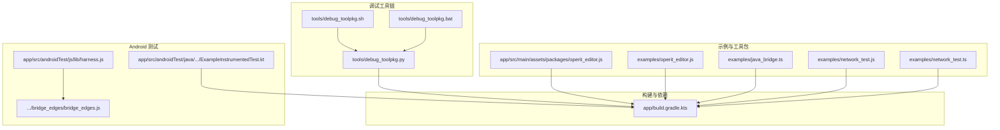
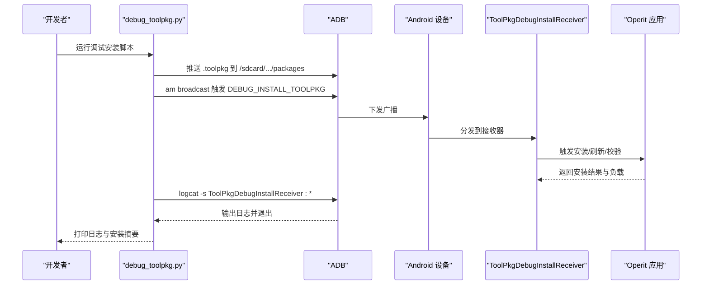
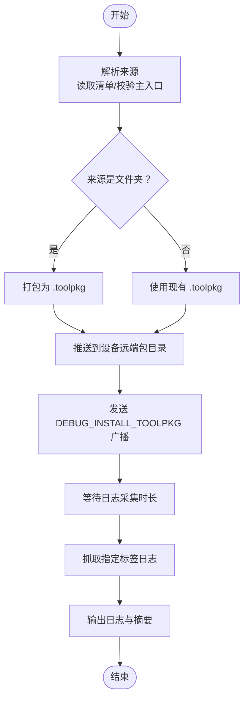
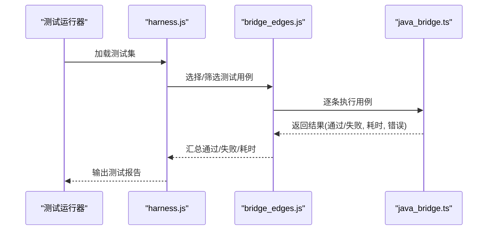
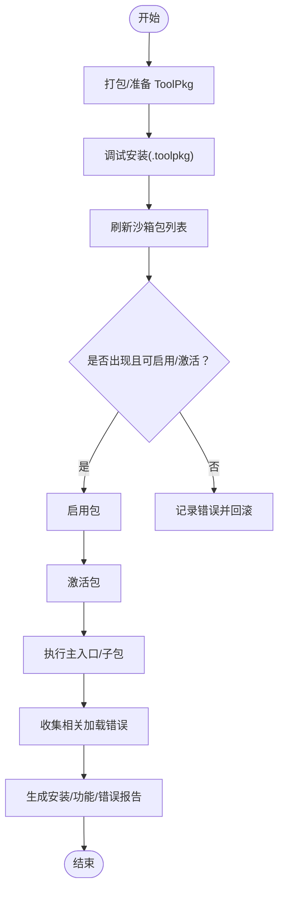
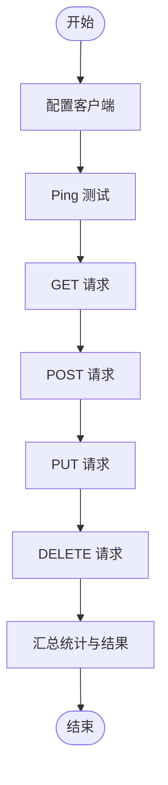
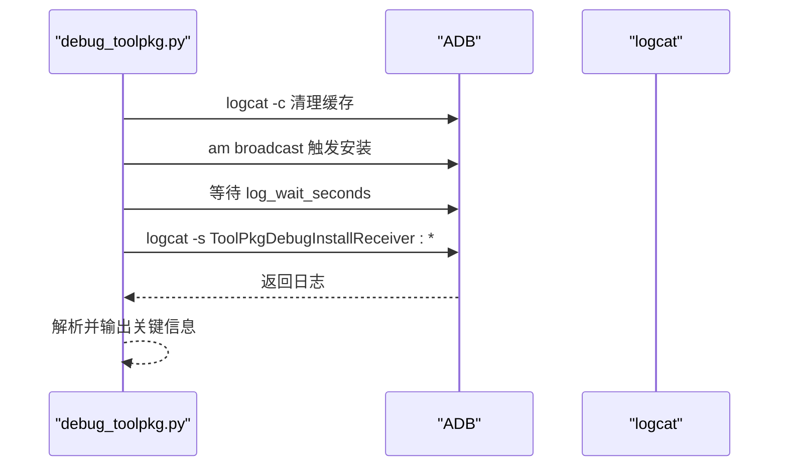
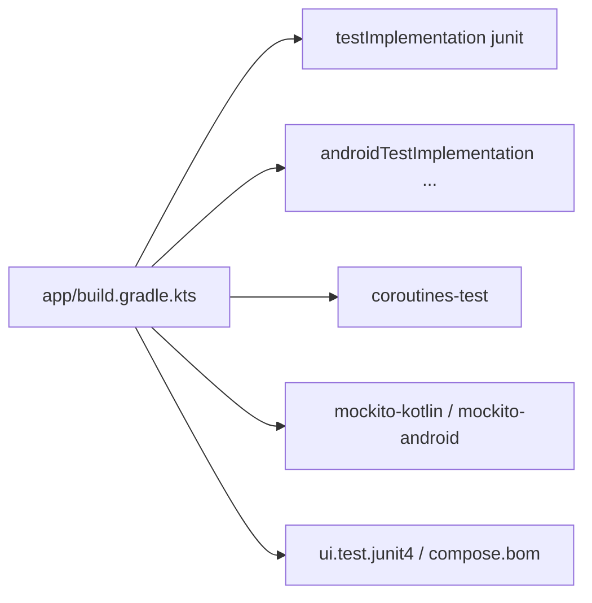

# 调试与测试方法

<cite>
**本文引用的文件**
- [tools/debug_toolpkg.py](file://tools/debug_toolpkg.py)
- [tools/debug_toolpkg.sh](file://tools/debug_toolpkg.sh)
- [tools/debug_toolpkg.bat](file://tools/debug_toolpkg.bat)
- [app/src/androidTest/java/com/ai/assistance/operit/ExampleInstrumentedTest.kt](file://app/src/androidTest/java/com/ai/assistance/operit/ExampleInstrumentedTest.kt)
- [app/src/androidTest/js/lib/harness.js](file://app/src/androidTest/js/lib/harness.js)
- [app/src/androidTest/js/com/ai/assistance/operit/core/tools/javascript/bridge_edges/bridge_edges.js](file://app/src/androidTest/js/com/ai/assistance/operit/core/tools/javascript/bridge_edges/bridge_edges.js)
- [examples/java_bridge.ts](file://examples/java_bridge.ts)
- [app/src/main/assets/packages/operit_editor.js](file://app/src/main/assets/packages/operit_editor.js)
- [examples/operit_editor.js](file://examples/operit_editor.js)
- [examples/network_test.js](file://examples/network_test.js)
- [examples/network_test.ts](file://examples/network_test.ts)
- [app/build.gradle.kts](file://app/build.gradle.kts)
- [tools/shower/app/src/main/java/com/ai/assistance/shower/Main.java](file://tools/shower/app/src/main/java/com/ai/assistance/shower/Main.java)
- [tools/shower/app/src/main/java/com/ai/assistance/shower/wrappers/ActivityManager.java](file://tools/shower/app/src/main/java/com/ai/assistance/shower/wrappers/ActivityManager.java)
</cite>

## 目录
1. [简介](#简介)
2. [项目结构](#项目结构)
3. [核心组件](#核心组件)
4. [架构总览](#架构总览)
5. [详细组件分析](#详细组件分析)
6. [依赖关系分析](#依赖关系分析)
7. [性能考量](#性能考量)
8. [故障排除指南](#故障排除指南)
9. [结论](#结论)
10. [附录](#附录)

## 简介
本指南面向 ToolPkg 的调试与测试工作，系统化地覆盖以下主题：
- 本地与远程调试环境配置
- 断点设置与变量监视技巧
- 日志分析：级别设置、关键信息提取、错误追踪、性能瓶颈定位
- 测试策略：单元测试、集成测试、UI 测试、自动化测试框架使用
- 工具包生命周期测试：安装、功能、兼容性、回归测试
- 性能测试：内存、CPU、网络、响应时间
- 故障排除：常见错误类型、解决方案、预防与最佳实践
- 调试工具使用教程与测试用例示例路径

## 项目结构
围绕 ToolPkg 调试与测试的相关目录与文件：
- 调试工具链：Python 脚本与跨平台启动器（Windows/Unix）
- Android 测试：仪器化测试与 JS 测试夹具
- 示例工具包与网络测试脚本
- 构建与依赖配置：Gradle 配置测试依赖与构建变体

**图示来源**
- [tools/debug_toolpkg.py:1-394](file://tools/debug_toolpkg.py#L1-L394)
- [tools/debug_toolpkg.sh:1-16](file://tools/debug_toolpkg.sh#L1-L16)
- [tools/debug_toolpkg.bat:1-26](file://tools/debug_toolpkg.bat#L1-L26)
- [app/src/androidTest/java/com/ai/assistance/operit/ExampleInstrumentedTest.kt:1-24](file://app/src/androidTest/java/com/ai/assistance/operit/ExampleInstrumentedTest.kt#L1-L24)
- [app/src/androidTest/js/lib/harness.js:1-84](file://app/src/androidTest/js/lib/harness.js#L1-L84)
- [app/src/androidTest/js/com/ai/assistance/operit/core/tools/javascript/bridge_edges/bridge_edges.js:574-620](file://app/src/androidTest/js/com/ai/assistance/operit/core/tools/javascript/bridge_edges/bridge_edges.js#L574-L620)
- [app/src/main/assets/packages/operit_editor.js:2528-2720](file://app/src/main/assets/packages/operit_editor.js#L2528-L2720)
- [examples/operit_editor.js:2528-2720](file://examples/operit_editor.js#L2528-L2720)
- [examples/java_bridge.ts:337-383](file://examples/java_bridge.ts#L337-L383)
- [examples/network_test.js:557-747](file://examples/network_test.js#L557-L747)
- [examples/network_test.ts:157-758](file://examples/network_test.ts#L157-L758)
- [app/build.gradle.kts:1-446](file://app/build.gradle.kts#L1-L446)

**章节来源**
- [tools/debug_toolpkg.py:1-394](file://tools/debug_toolpkg.py#L1-L394)
- [app/build.gradle.kts:1-446](file://app/build.gradle.kts#L1-L446)

## 核心组件
- 调试安装工具链：封装 ToolPkg 打包、推送、广播触发、日志采集的完整流程，支持多设备选择与日志等待时长配置。
- Android 测试框架：Junit/Espresso 与 JS 测试夹具，提供断言、选择性执行、统计汇总能力。
- 示例工具包与桥接测试：演示启用/激活、桥接交互、网络连通性测试等场景。
- 构建与测试依赖：Gradle 配置测试运行器、协程测试、Mock 框架等。

**章节来源**
- [tools/debug_toolpkg.py:256-317](file://tools/debug_toolpkg.py#L256-L317)
- [app/src/androidTest/js/lib/harness.js:1-84](file://app/src/androidTest/js/lib/harness.js#L1-L84)
- [app/src/androidTest/js/com/ai/assistance/operit/core/tools/javascript/bridge_edges/bridge_edges.js:574-620](file://app/src/androidTest/js/com/ai/assistance/operit/core/tools/javascript/bridge_edges/bridge_edges.js#L574-L620)
- [examples/java_bridge.ts:337-383](file://examples/java_bridge.ts#L337-L383)
- [examples/network_test.js:557-747](file://examples/network_test.js#L557-L747)
- [app/build.gradle.kts:360-409](file://app/build.gradle.kts#L360-L409)

## 架构总览
下图展示 ToolPkg 调试安装从本地到设备端的端到端流程，以及日志采集与分析路径。

**图示来源**
- [tools/debug_toolpkg.py:256-317](file://tools/debug_toolpkg.py#L256-L317)
- [app/src/main/assets/packages/operit_editor.js:2581-2720](file://app/src/main/assets/packages/operit_editor.js#L2581-L2720)
- [examples/operit_editor.js:2581-2720](file://examples/operit_editor.js#L2581-L2720)

## 详细组件分析

### 组件A：调试安装工具链（Python 脚本）
- 功能要点
  - 解析 ToolPkg 来源（文件夹/归档），读取清单并校验主入口
  - 自动打包为 .toolpkg，安全命名，过滤无关文件
  - 设备选择与 ADB 命令封装，支持显式串口或自动选择
  - 推送归档、清理日志、发送广播、等待日志、抓取日志
  - 可配置等待时长，便于观察安装过程与错误
- 关键流程（含日志采集）

**图示来源**
- [tools/debug_toolpkg.py:138-204](file://tools/debug_toolpkg.py#L138-L204)
- [tools/debug_toolpkg.py:256-317](file://tools/debug_toolpkg.py#L256-L317)

**章节来源**
- [tools/debug_toolpkg.py:138-204](file://tools/debug_toolpkg.py#L138-L204)
- [tools/debug_toolpkg.py:256-317](file://tools/debug_toolpkg.py#L256-L317)

### 组件B：Android 仪器化测试与 JS 测试夹具
- 仪器化测试
  - 示例测试验证应用上下文包名，作为基础测试骨架
- JS 测试夹具
  - 提供断言、测试选择（only/startAt）、运行统计与失败收集
  - 用于 JS 环境下的工具包桥接与转换测试套件
- 桥接测试
  - 定义用例集合与执行流程，输出通过/失败计数、耗时与错误详情

**图示来源**
- [app/src/androidTest/js/lib/harness.js:1-84](file://app/src/androidTest/js/lib/harness.js#L1-L84)
- [app/src/androidTest/js/com/ai/assistance/operit/core/tools/javascript/bridge_edges/bridge_edges.js:574-620](file://app/src/androidTest/js/com/ai/assistance/operit/core/tools/javascript/bridge_edges/bridge_edges.js#L574-L620)
- [examples/java_bridge.ts:337-383](file://examples/java_bridge.ts#L337-L383)

**章节来源**
- [app/src/androidTest/java/com/ai/assistance/operit/ExampleInstrumentedTest.kt:1-24](file://app/src/androidTest/java/com/ai/assistance/operit/ExampleInstrumentedTest.kt#L1-L24)
- [app/src/androidTest/js/lib/harness.js:1-84](file://app/src/androidTest/js/lib/harness.js#L1-L84)
- [app/src/androidTest/js/com/ai/assistance/operit/core/tools/javascript/bridge_edges/bridge_edges.js:574-620](file://app/src/androidTest/js/com/ai/assistance/operit/core/tools/javascript/bridge_edges/bridge_edges.js#L574-L620)
- [examples/java_bridge.ts:337-383](file://examples/java_bridge.ts#L337-L383)

### 组件C：工具包生命周期测试（安装/功能/兼容性/回归）
- 安装测试
  - 通过调试安装流程验证 ToolPkg 是否出现在沙箱包列表中
  - 校验清单字段（toolpkg_id、main）是否正确
- 功能测试
  - 启用/激活工具包后，调用其主入口与子包，检查返回与副作用
- 兼容性测试
  - 在不同设备/ABI/系统版本上重复安装与功能验证
- 回归测试
  - 将安装、启用、激活、刷新、错误收集纳入自动化流水线

**图示来源**
- [app/src/main/assets/packages/operit_editor.js:2528-2720](file://app/src/main/assets/packages/operit_editor.js#L2528-L2720)
- [examples/operit_editor.js:2528-2720](file://examples/operit_editor.js#L2528-L2720)
- [tools/debug_toolpkg.py:256-317](file://tools/debug_toolpkg.py#L256-L317)

**章节来源**
- [app/src/main/assets/packages/operit_editor.js:2528-2720](file://app/src/main/assets/packages/operit_editor.js#L2528-L2720)
- [examples/operit_editor.js:2528-2720](file://examples/operit_editor.js#L2528-L2720)
- [tools/debug_toolpkg.py:256-317](file://tools/debug_toolpkg.py#L256-L317)

### 组件D：网络功能测试（性能与稳定性）
- 覆盖项
  - 客户端配置、Ping、GET、POST、PUT、DELETE 请求
  - 统计指标：成功率、平均耗时、详细结果
- 使用建议
  - 将测试结果作为回归基线，持续监控网络稳定性
  - 结合日志分析定位慢请求与异常

**图示来源**
- [examples/network_test.js:557-747](file://examples/network_test.js#L557-L747)
- [examples/network_test.ts:597-758](file://examples/network_test.ts#L597-L758)

**章节来源**
- [examples/network_test.js:557-747](file://examples/network_test.js#L557-L747)
- [examples/network_test.ts:597-758](file://examples/network_test.ts#L597-L758)

### 组件E：日志分析与错误追踪
- 日志采集
  - 使用 ADB 清理日志、按标签抓取日志、等待时长控制
- 关键标签
  - ToolPkgDebugInstallReceiver、ToolPkg、PackageManager
- 错误追踪
  - 安装后刷新包列表，收集相关加载错误并输出
  - JS 层面记录步骤日志，便于回溯

**图示来源**
- [tools/debug_toolpkg.py:276-317](file://tools/debug_toolpkg.py#L276-L317)

**章节来源**
- [tools/debug_toolpkg.py:276-317](file://tools/debug_toolpkg.py#L276-L317)
- [app/src/main/assets/packages/operit_editor.js:2581-2720](file://app/src/main/assets/packages/operit_editor.js#L2581-L2720)

## 依赖关系分析
- 构建与测试依赖
  - Gradle 配置测试运行器、协程测试、Mock 框架、Compose 测试依赖
  - 为 JS 测试与桥接测试提供运行时与断言能力

**图示来源**
- [app/build.gradle.kts:360-409](file://app/build.gradle.kts#L360-L409)

**章节来源**
- [app/build.gradle.kts:360-409](file://app/build.gradle.kts#L360-L409)

## 性能考量
- 内存与 CPU
  - 使用 ADB 与系统日志观察安装与运行阶段的内存占用与 CPU 占用峰值
  - 对比启用前后指标，定位异常抖动
- 网络
  - 使用网络测试脚本进行基准测试，记录平均耗时与成功率
  - 结合日志分析慢请求与异常重试
- 响应时间
  - 在工具包启用/激活后，记录关键操作耗时，建立回归基线

[本节为通用指导，无需特定文件引用]

## 故障排除指南
- 常见错误类型
  - 清单缺失或字段不合法（toolpkg_id、main）
  - 归档缺少主入口文件
  - 设备未授权或 ADB 不可用
  - 安装后包未出现在沙箱列表
- 解决方案
  - 校验清单与主入口一致性；确保打包包含必要文件
  - 使用脚本自动选择设备或指定串口
  - 增加日志等待时长，抓取关键标签日志
  - 若包未出现，检查相关加载错误并回滚
- 预防措施
  - 将安装/功能/网络测试纳入 CI
  - 建立日志与指标基线，及时发现回归
- 最佳实践
  - 使用“仅启用/仅激活”模式进行最小化验证
  - 记录每一步日志与结果，便于复现与回溯

**章节来源**
- [tools/debug_toolpkg.py:75-104](file://tools/debug_toolpkg.py#L75-L104)
- [tools/debug_toolpkg.py:118-135](file://tools/debug_toolpkg.py#L118-L135)
- [tools/debug_toolpkg.py:207-248](file://tools/debug_toolpkg.py#L207-L248)
- [app/src/main/assets/packages/operit_editor.js:2581-2720](file://app/src/main/assets/packages/operit_editor.js#L2581-L2720)

## 结论
通过统一的调试安装工具链、完善的 Android 与 JS 测试夹具、系统化的日志采集与分析，以及覆盖全生命周期的测试策略，可以高效地定位 ToolPkg 的问题、保障功能稳定，并持续优化性能与兼容性。

[本节为总结，无需特定文件引用]

## 附录

### 调试工具使用教程（步骤）
- 准备
  - 确保已安装 Python 与 ADB，并在 PATH 中可用
  - 准备 ToolPkg 文件夹或 .toolpkg 归档
- 本地运行
  - Unix/Linux/macOS：使用脚本启动器
    - [tools/debug_toolpkg.sh:1-16](file://tools/debug_toolpkg.sh#L1-L16)
  - Windows：使用批处理启动器
    - [tools/debug_toolpkg.bat:1-26](file://tools/debug_toolpkg.bat#L1-L26)
- 执行调试安装
  - 传入 ToolPkg 源路径，自动解析清单、打包、推送、广播、抓取日志
  - 参考实现与参数说明
    - [tools/debug_toolpkg.py:320-351](file://tools/debug_toolpkg.py#L320-L351)
    - [tools/debug_toolpkg.py:354-394](file://tools/debug_toolpkg.py#L354-L394)

**章节来源**
- [tools/debug_toolpkg.sh:1-16](file://tools/debug_toolpkg.sh#L1-L16)
- [tools/debug_toolpkg.bat:1-26](file://tools/debug_toolpkg.bat#L1-L26)
- [tools/debug_toolpkg.py:320-351](file://tools/debug_toolpkg.py#L320-L351)
- [tools/debug_toolpkg.py:354-394](file://tools/debug_toolpkg.py#L354-L394)

### 测试用例示例（路径）
- Android 仪器化测试
  - [app/src/androidTest/java/com/ai/assistance/operit/ExampleInstrumentedTest.kt:1-24](file://app/src/androidTest/java/com/ai/assistance/operit/ExampleInstrumentedTest.kt#L1-L24)
- JS 测试夹具与桥接套件
  - [app/src/androidTest/js/lib/harness.js:1-84](file://app/src/androidTest/js/lib/harness.js#L1-L84)
  - [app/src/androidTest/js/com/ai/assistance/operit/core/tools/javascript/bridge_edges/bridge_edges.js:574-620](file://app/src/androidTest/js/com/ai/assistance/operit/core/tools/javascript/bridge_edges/bridge_edges.js#L574-L620)
  - [examples/java_bridge.ts:337-383](file://examples/java_bridge.ts#L337-L383)
- 网络测试
  - [examples/network_test.js:557-747](file://examples/network_test.js#L557-L747)
  - [examples/network_test.ts:597-758](file://examples/network_test.ts#L597-L758)

**章节来源**
- [app/src/androidTest/java/com/ai/assistance/operit/ExampleInstrumentedTest.kt:1-24](file://app/src/androidTest/java/com/ai/assistance/operit/ExampleInstrumentedTest.kt#L1-L24)
- [app/src/androidTest/js/lib/harness.js:1-84](file://app/src/androidTest/js/lib/harness.js#L1-L84)
- [app/src/androidTest/js/com/ai/assistance/operit/core/tools/javascript/bridge_edges/bridge_edges.js:574-620](file://app/src/androidTest/js/com/ai/assistance/operit/core/tools/javascript/bridge_edges/bridge_edges.js#L574-L620)
- [examples/java_bridge.ts:337-383](file://examples/java_bridge.ts#L337-L383)
- [examples/network_test.js:557-747](file://examples/network_test.js#L557-L747)
- [examples/network_test.ts:597-758](file://examples/network_test.ts#L597-L758)