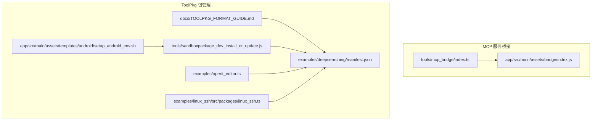
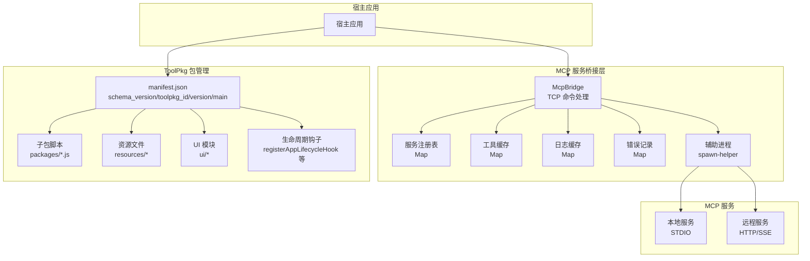
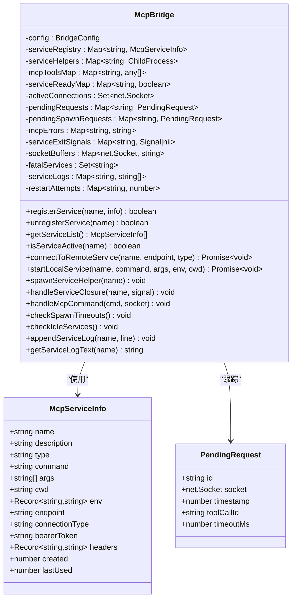
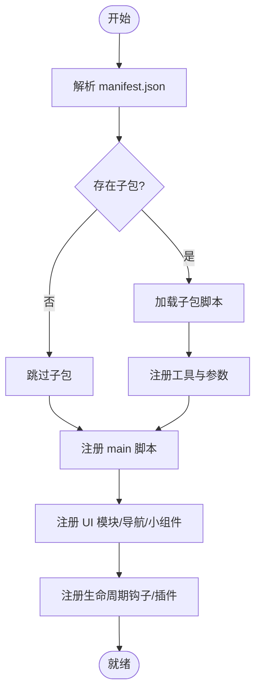
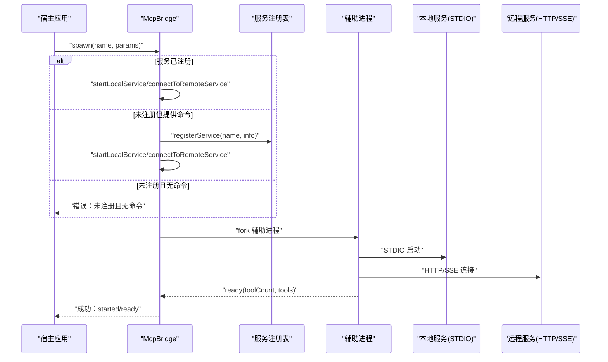
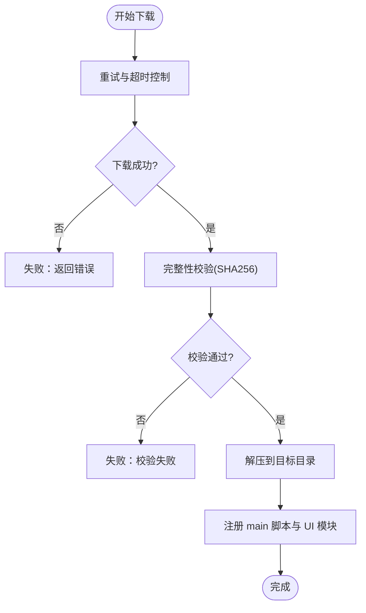
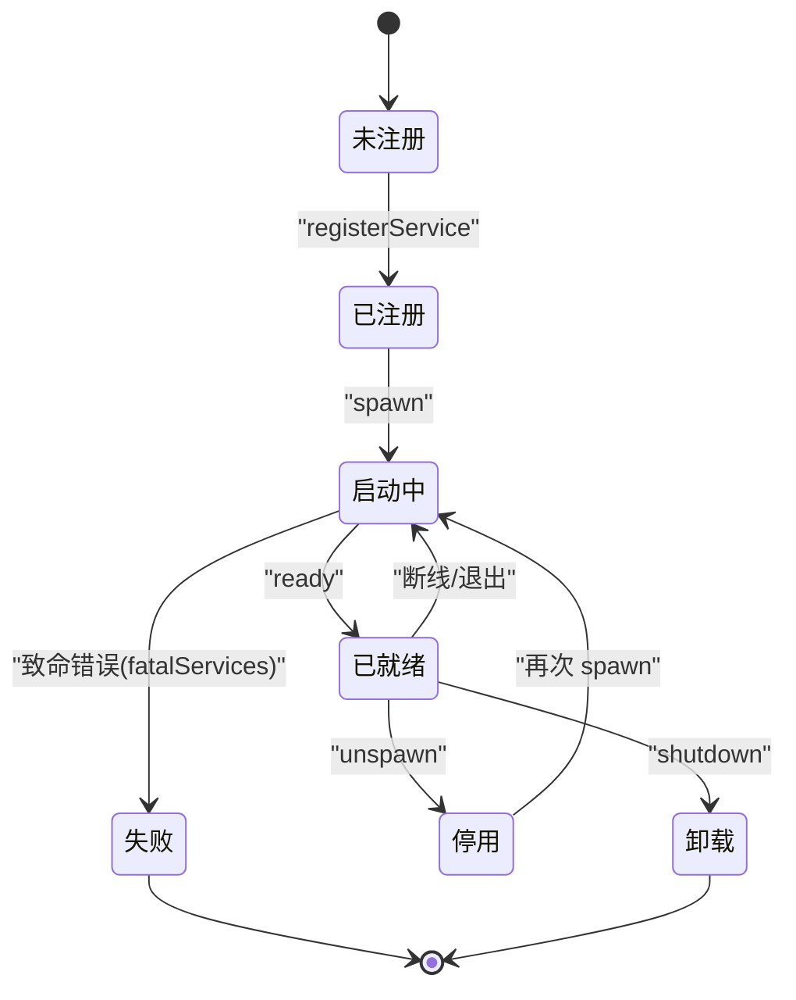
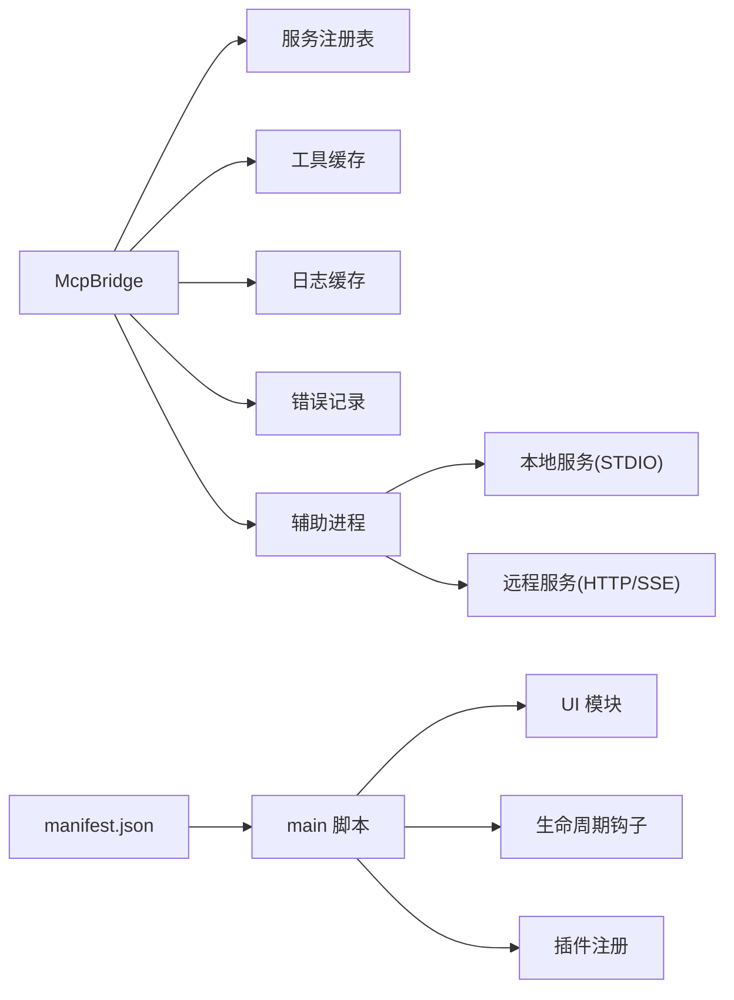

# MCP 包管理

<cite>
**本文档引用的文件**
- [index.ts](file://tools/mcp_bridge/index.ts)
- [index.js](file://app/src/main/assets/bridge/index.js)
- [manifest.json](file://examples/deepsearching/manifest.json)
- [TOOLPKG_FORMAT_GUIDE.md](file://docs/TOOLPKG_FORMAT_GUIDE.md)
- [sandboxpackage_dev_install_or_update.js](file://tools/sandboxpackage_dev_install_or_update.js)
- [setup_android_env.sh](file://app/src/main/assets/templates/android/setup_android_env.sh)
- [linux_ssh.ts](file://examples/linux_ssh/src/packages/linux_ssh.ts)
- [operit_editor.ts](file://examples/operit_editor.ts)
</cite>

## 目录
1. [简介](#简介)
2. [项目结构](#项目结构)
3. [核心组件](#核心组件)
4. [架构总览](#架构总览)
5. [详细组件分析](#详细组件分析)
6. [依赖关系分析](#依赖关系分析)
7. [性能考量](#性能考量)
8. [故障排查指南](#故障排查指南)
9. [结论](#结论)
10. [附录](#附录)

## 简介
本文件系统化梳理 Operit 的 MCP 包管理能力，围绕以下目标展开：
- 解释 MCP 包结构规范（包描述文件、依赖声明、版本信息）
- 说明包发现机制（远程仓库扫描、元数据获取、可用性检查）
- 阐述包安装流程（下载管理、完整性校验、安装执行、回滚机制）
- 解释包版本管理（版本解析、兼容性检查、升级策略、降级处理）
- 提供包仓库管理（本地缓存、远程同步、离线模式支持）
- 展示包生命周期管理（激活、停用、卸载）
- 面向包开发者提供发布指南（打包、签名、上传、版本发布流程）

说明：当前仓库中 MCP 包管理主要体现在两方面：
- MCP 服务桥接与生命周期管理（TCP 桥接、服务注册、启动/停止、日志与错误处理）
- ToolPkg 包（Operit 自身的包格式）的结构规范与生命周期（manifest、子包、资源、工作流/工作区模板）

后续章节将分别对这两部分进行深入分析。

## 项目结构
与 MCP 包管理直接相关的代码与文档分布如下：
- MCP 服务桥接与生命周期管理
  - TypeScript 实现：tools/mcp_bridge/index.ts
  - Webpack 打包产物（Android 运行时桥接）：app/src/main/assets/bridge/index.js
- ToolPkg 包结构与生命周期
  - 格式规范文档：docs/TOOLPKG_FORMAT_GUIDE.md
  - 示例包清单：examples/deepsearching/manifest.json
  - 开发者安装器（示例包同步）：tools/sandboxpackage_dev_install_or_update.js
  - 环境准备与下载镜像选择：app/src/main/assets/templates/android/setup_android_env.sh
  - 子包启用/激活流程示例：examples/operit_editor.ts
  - 依赖安装与可用性检查示例：examples/linux_ssh/src/packages/linux_ssh.ts

**图表来源**
- [index.ts](file://tools/mcp_bridge/index.ts)
- [index.js](file://app/src/main/assets/bridge/index.js)
- [TOOLPKG_FORMAT_GUIDE.md](file://docs/TOOLPKG_FORMAT_GUIDE.md)
- [manifest.json](file://examples/deepsearching/manifest.json)
- [sandboxpackage_dev_install_or_update.js](file://tools/sandboxpackage_dev_install_or_update.js)
- [setup_android_env.sh](file://app/src/main/assets/templates/android/setup_android_env.sh)
- [operit_editor.ts](file://examples/operit_editor.ts)
- [linux_ssh.ts](file://examples/linux_ssh/src/packages/linux_ssh.ts)

**章节来源**
- [index.ts](file://tools/mcp_bridge/index.ts)
- [index.js](file://app/src/main/assets/bridge/index.js)
- [TOOLPKG_FORMAT_GUIDE.md](file://docs/TOOLPKG_FORMAT_GUIDE.md)
- [manifest.json](file://examples/deepsearching/manifest.json)
- [sandboxpackage_dev_install_or_update.js](file://tools/sandboxpackage_dev_install_or_update.js)
- [setup_android_env.sh](file://app/src/main/assets/templates/android/setup_android_env.sh)
- [operit_editor.ts](file://examples/operit_editor.ts)
- [linux_ssh.ts](file://examples/linux_ssh/src/packages/linux_ssh.ts)

## 核心组件
- MCP 服务桥接器（McpBridge）
  - 统一管理本地与远程 MCP 服务的注册、启动、停止、重连与日志
  - 通过辅助进程（spawn-helper）管理本地服务生命周期
  - 提供 TCP 命令接口（spawn/list/listtools/toolcall/logs/register/unregister/reset/unspawn/cachetools）
- ToolPkg 包管理
  - ToolPkg 格式规范（ZIP 容器 + manifest + 资源 + 子包 + UI + 模板）
  - manifest 字段（schema_version、toolpkg_id、version、author、main、display_name、description、subpackages、resources、workflow_templates、workspace_templates）
  - 子包脚本与 UI 模块注册、生命周期钩子、消息处理插件、XML 渲染插件、输入菜单开关插件
  - 开发者安装器用于同步内置示例包与类型文件
  - 环境准备脚本用于镜像选择与下载稳定性保障
  - 子包启用/激活流程示例（设置启用状态并使用包）

**章节来源**
- [index.ts](file://tools/mcp_bridge/index.ts)
- [index.js](file://app/src/main/assets/bridge/index.js)
- [TOOLPKG_FORMAT_GUIDE.md](file://docs/TOOLPKG_FORMAT_GUIDE.md)
- [sandboxpackage_dev_install_or_update.js](file://tools/sandboxpackage_dev_install_or_update.js)
- [setup_android_env.sh](file://app/src/main/assets/templates/android/setup_android_env.sh)
- [operit_editor.ts](file://examples/operit_editor.ts)

## 架构总览
下图展示了 MCP 服务桥接与 ToolPkg 包管理的整体交互关系：

**图表来源**
- [index.ts](file://tools/mcp_bridge/index.ts)
- [index.js](file://app/src/main/assets/bridge/index.js)
- [TOOLPKG_FORMAT_GUIDE.md](file://docs/TOOLPKG_FORMAT_GUIDE.md)
- [manifest.json](file://examples/deepsearching/manifest.json)

## 详细组件分析

### MCP 服务桥接器（McpBridge）
- 统一服务模型
  - 服务注册表（内存 Map）保存服务信息（名称、类型、命令/端点、认证、环境变量、描述、时间戳）
  - 工具缓存（Map）保存已成功启动服务的工具列表
  - 日志缓存（Map）限制最大行数与每行长度，便于诊断
  - 错误记录（Map）与致命服务集合（Set）用于区分可恢复与不可恢复错误
- 启动与停止
  - spawn：支持自动注册本地服务或复用注册表信息；带超时与替换旧请求
  - shutdown：移除注册表后杀死辅助进程，清理状态
  - unspawn：仅停止进程，保留注册表，便于后续快速重启
- 连接与重连
  - 远程服务通过 HTTP Stream/SSE 连接；本地服务通过辅助进程 fork 子进程
  - 断线/退出后按指数退避重连，最多尝试固定次数
  - SIGABRT 触发立即重连
- 命令接口
  - list/listtools/logs/register/unregister/reset/unspawn/cachetools/toolcall/spawn/shutdown
  - 统一响应结构（success/result/error），支持 pending 请求与超时处理
- 日志与诊断
  - stdout/stderr 捕获并写入日志缓存
  - fatalServices 标记致命错误（如缺少必要环境变量/API Key），拒绝继续重试
  - logs 命令返回活跃/就绪状态、最近错误与日志快照

**图表来源**
- [index.ts](file://tools/mcp_bridge/index.ts)

**章节来源**
- [index.ts](file://tools/mcp_bridge/index.ts)
- [index.js](file://app/src/main/assets/bridge/index.js)

### ToolPkg 包结构与生命周期
- 包结构
  - manifest.json（或 manifest.hjson）为核心，定义 schema_version、toolpkg_id、version、author、main、display_name、description、subpackages、resources、workflow_templates、workspace_templates
  - packages/ 子包脚本目录
  - ui/ UI 模块目录
  - resources/ 资源文件目录
  - i18n/ 国际化文件目录
- 子包与资源
  - 子包脚本通过 METADATA 声明工具、参数、环境变量
  - 资源支持文件与目录（目录资源会被压缩为 zip 返回）
- 生命周期与注册
  - main 脚本通过注册函数声明 UI 模块、导航入口、桌面小组件、应用生命周期钩子、消息处理插件、XML 渲染插件、输入菜单开关插件
- 开发者安装器
  - 下载参考文档与类型文件，同步内置示例包至设备
- 环境准备与下载
  - 镜像速度探测与 Ping 探测，结合重试与超时策略提升下载稳定性
- 子包启用/激活
  - 设置子包启用状态并使用包，形成完整的激活链路

**图表来源**
- [TOOLPKG_FORMAT_GUIDE.md](file://docs/TOOLPKG_FORMAT_GUIDE.md)
- [manifest.json](file://examples/deepsearching/manifest.json)

**章节来源**
- [TOOLPKG_FORMAT_GUIDE.md](file://docs/TOOLPKG_FORMAT_GUIDE.md)
- [manifest.json](file://examples/deepsearching/manifest.json)
- [sandboxpackage_dev_install_or_update.js](file://tools/sandboxpackage_dev_install_or_update.js)
- [setup_android_env.sh](file://app/src/main/assets/templates/android/setup_android_env.sh)
- [operit_editor.ts](file://examples/operit_editor.ts)

### 包发现机制
- ToolPkg 发现
  - 通过扫描 assets/packages 目录（或示例目录）发现 .toolpkg 文件
  - 读取 manifest.json 获取包元数据（toolpkg_id、version、display_name、description、subpackages、resources、workflow_templates、workspace_templates）
  - 通过 main 脚本注册 UI 模块、导航入口、桌面小组件、生命周期钩子、消息处理插件、XML 渲染插件、输入菜单开关插件
- MCP 服务发现
  - 通过注册表（serviceRegistry）列出已注册服务
  - 通过 list/listtools/logs 命令查询服务状态、工具列表与日志
  - 通过缓存（mcpToolsMap）避免重复拉取工具列表

**图表来源**
- [index.ts](file://tools/mcp_bridge/index.ts)
- [index.js](file://app/src/main/assets/bridge/index.js)

**章节来源**
- [index.ts](file://tools/mcp_bridge/index.ts)
- [index.js](file://app/src/main/assets/bridge/index.js)

### 包安装流程
- ToolPkg 安装
  - 下载 .toolpkg 文件（可参考开发者安装器的并发下载与重试策略）
  - 校验 manifest.json 与资源完整性（可结合 SHA256 校验）
  - 解压至目标目录（assets/packages 或自定义目录）
  - 通过 main 脚本注册 UI 模块、导航入口、桌面小组件、生命周期钩子、消息处理插件、XML 渲染插件、输入菜单开关插件
  - 初始化资源（目录资源会被压缩为 zip）
- MCP 服务安装
  - 本地服务：通过 registerService 指定 command/args/env/cwd
  - 远程服务：通过 registerService 指定 endpoint/connectionType/bearerToken/headers
  - 通过 spawn 命令启动，等待 ready 事件完成安装

**图表来源**
- [sandboxpackage_dev_install_or_update.js](file://tools/sandboxpackage_dev_install_or_update.js)
- [setup_android_env.sh](file://app/src/main/assets/templates/android/setup_android_env.sh)

**章节来源**
- [sandboxpackage_dev_install_or_update.js](file://tools/sandboxpackage_dev_install_or_update.js)
- [setup_android_env.sh](file://app/src/main/assets/templates/android/setup_android_env.sh)

### 包版本管理
- ToolPkg 版本
  - manifest.json 中的 version 字段（建议语义化版本）
  - schema_version 用于清单结构演进
  - author 字段用于归属信息
- MCP 服务版本
  - 通过服务描述（description）与创建时间（created）辅助管理
  - 通过 logs 命令查看服务日志，定位版本问题
- 升级与降级
  - ToolPkg：替换 .toolpkg 文件后重新注册（main 脚本重新执行）
  - MCP 服务：通过 shutdown/unspawn 后重新 spawn，或更新注册表信息后重启
- 兼容性检查
  - ToolPkg：通过子包脚本 METADATA 的参数与环境变量声明进行兼容性约束
  - MCP 服务：通过 fatalServices 与错误日志判断不可恢复错误

**章节来源**
- [TOOLPKG_FORMAT_GUIDE.md](file://docs/TOOLPKG_FORMAT_GUIDE.md)
- [index.ts](file://tools/mcp_bridge/index.ts)

### 包仓库管理
- 本地缓存
  - ToolPkg：assets/packages 目录作为本地缓存
  - MCP 服务：服务注册表与工具缓存（mcpToolsMap）作为内存缓存
- 远程同步
  - 开发者安装器从 CDN 同步参考文档与类型文件
  - 环境准备脚本进行镜像选择与下载加速
- 离线模式支持
  - 依赖本地缓存与注册表，无需网络即可列出与使用已安装包
  - MCP 服务可通过本地命令与环境变量在离线场景启动

**章节来源**
- [sandboxpackage_dev_install_or_update.js](file://tools/sandboxpackage_dev_install_or_update.js)
- [setup_android_env.sh](file://app/src/main/assets/templates/android/setup_android_env.sh)
- [index.ts](file://tools/mcp_bridge/index.ts)

### 包生命周期管理
- ToolPkg
  - 启用：设置子包启用状态（示例：operit_editor.ts 中的启用与激活）
  - 激活：使用包（System.usePackage）
  - 卸载：删除 .toolpkg 文件并清理注册表
- MCP 服务
  - 启动：spawn
  - 停用：unspawn（保持注册表）
  - 卸载：shutdown（移除注册表）

**图表来源**
- [index.ts](file://tools/mcp_bridge/index.ts)

**章节来源**
- [operit_editor.ts](file://examples/operit_editor.ts)
- [index.ts](file://tools/mcp_bridge/index.ts)

### 面向包开发者的发布指南
- 打包
  - 准备 manifest.json（schema_version、toolpkg_id、version、main、display_name、description、subpackages、resources、workflow_templates、workspace_templates）
  - 将 packages/ui/resources/i18n 等内容放入 ZIP，重命名为 .toolpkg
- 签名
  - 建议在服务器端对 .toolpkg 进行哈希校验（SHA256），并在 CDN 提供对应校验信息
- 上传
  - 将 .toolpkg 上传至 CDN 或内部仓库
  - 提供 manifest.json 与校验信息，便于客户端校验
- 版本发布流程
  - 更新 manifest.json 的 version
  - 重新打包并上传新版本
  - 通过宿主应用的安装流程替换旧版本

**章节来源**
- [TOOLPKG_FORMAT_GUIDE.md](file://docs/TOOLPKG_FORMAT_GUIDE.md)
- [manifest.json](file://examples/deepsearching/manifest.json)

## 依赖关系分析
- 组件耦合
  - McpBridge 与辅助进程（spawn-helper）强耦合，负责本地服务生命周期
  - McpBridge 与服务注册表、工具缓存、日志缓存、错误记录弱耦合，便于扩展
- 外部依赖
  - MCP 服务：本地服务依赖 STDIO，远程服务依赖 HTTP/SSE
  - ToolPkg：依赖 manifest.json 结构与 main 脚本注册函数
  - 下载与镜像：依赖 curl/wget 与网络探测工具（ping/busybox）

**图表来源**
- [index.ts](file://tools/mcp_bridge/index.ts)
- [TOOLPKG_FORMAT_GUIDE.md](file://docs/TOOLPKG_FORMAT_GUIDE.md)

**章节来源**
- [index.ts](file://tools/mcp_bridge/index.ts)
- [TOOLPKG_FORMAT_GUIDE.md](file://docs/TOOLPKG_FORMAT_GUIDE.md)

## 性能考量
- 并发下载
  - 开发者安装器采用并发下载（MAX_DOWNLOAD_CONCURRENCY），提升同步效率
- 超时与重试
  - 下载脚本设置连接/最大超时与重试次数，提高网络不稳定场景的稳定性
- 日志与缓存
  - 限制日志行数与行长，避免内存膨胀
  - 工具缓存减少重复查询
- 闲置回收
  - 定期检查闲置服务并 unspawn，降低资源占用

**章节来源**
- [sandboxpackage_dev_install_or_update.js](file://tools/sandboxpackage_dev_install_or_update.js)
- [setup_android_env.sh](file://app/src/main/assets/templates/android/setup_android_env.sh)
- [index.ts](file://tools/mcp_bridge/index.ts)

## 故障排查指南
- MCP 服务启动失败
  - 检查 fatalServices 与错误日志（logs 命令）
  - 若出现致命错误（如缺少必要环境变量/API Key），需修复后再启动
- 服务断线/退出
  - 查看重启尝试次数与指数退避延迟
  - 若为 SIGABRT，立即重连
- 下载失败
  - 检查镜像选择与网络状况
  - 查看重试与超时日志，确认 curl/wget 可用
- ToolPkg 安装失败
  - 校验 manifest.json 与资源完整性
  - 检查 main 脚本注册是否成功

**章节来源**
- [index.ts](file://tools/mcp_bridge/index.ts)
- [index.js](file://app/src/main/assets/bridge/index.js)
- [setup_android_env.sh](file://app/src/main/assets/templates/android/setup_android_env.sh)

## 结论
Operit 的 MCP 包管理由两部分组成：MCP 服务桥接与 ToolPkg 包管理。前者通过统一的桥接器管理本地与远程服务的生命周期、日志与重连；后者通过标准化的 manifest.json 与 main 脚本注册函数实现包的结构化管理与生命周期控制。二者共同支撑了 Operit 的扩展生态与开发者体验。建议在生产环境中强化校验与监控（如 SHA256 校验、健康检查、可观测性），以进一步提升可靠性与安全性。

## 附录
- 关键术语
  - ToolPkg：Operit 的包格式，本质为 ZIP，包含 manifest.json 与资源
  - 子包：ToolPkg 的功能单元，通过 packages 目录组织
  - manifest.json：包的元数据与结构定义
  - main 脚本：注册 UI 模块、导航入口、桌面小组件、生命周期钩子、插件等
  - MCP 服务：通过 STDIO 或 HTTP/SSE 提供工具调用能力的服务