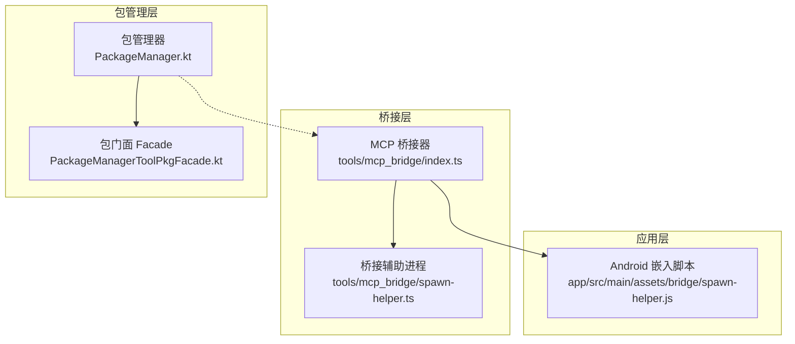
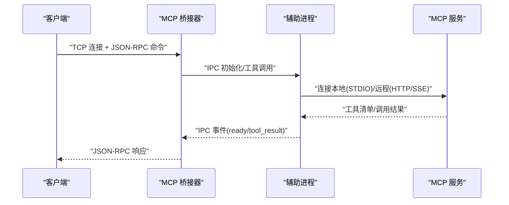
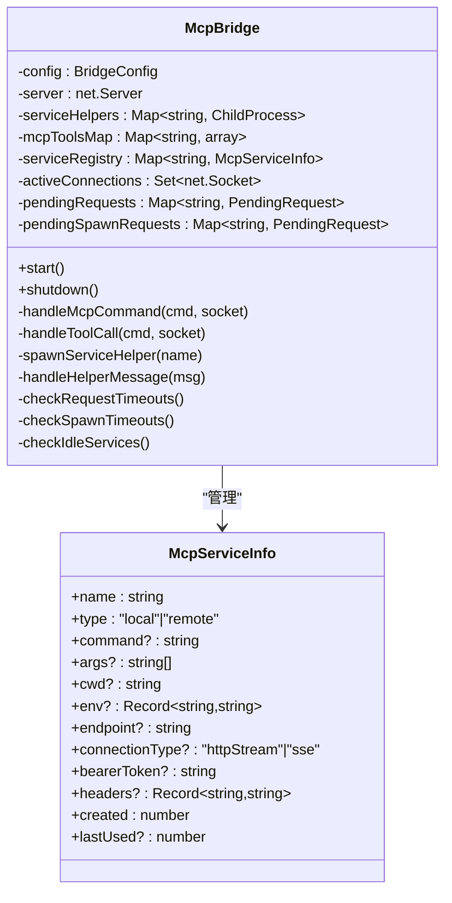
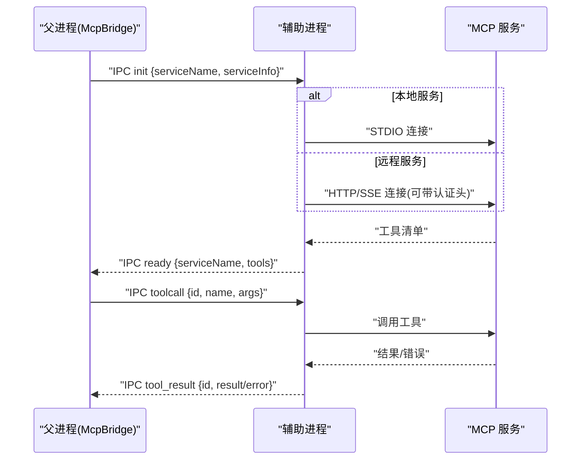
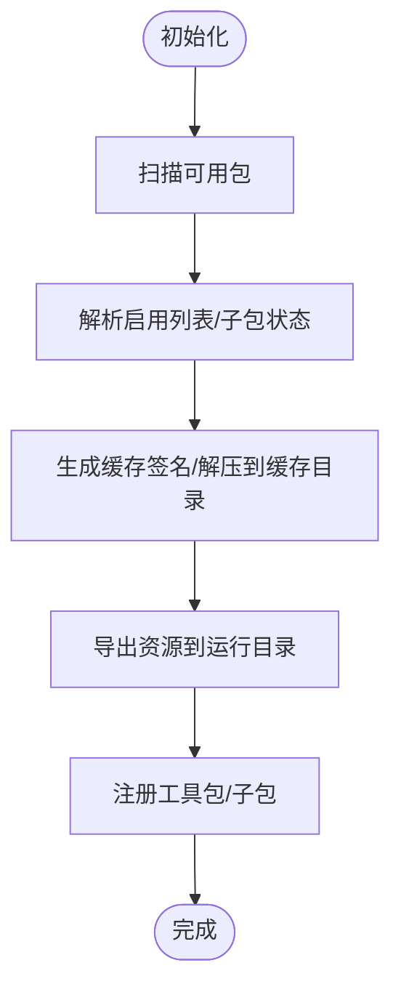
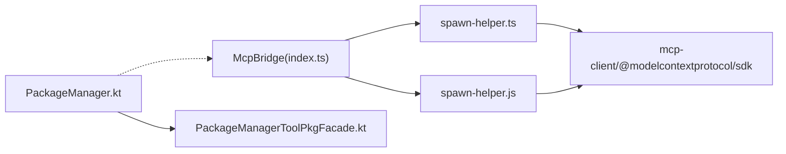
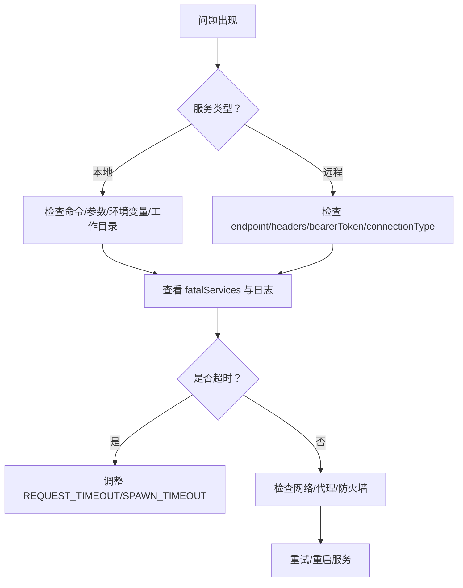

# MCP 协议支持

<cite>
**本文档引用的文件**
- [index.ts](file://tools/mcp_bridge/index.ts)
- [spawn-helper.ts](file://tools/mcp_bridge/spawn-helper.ts)
- [spawn-helper.js](file://app/src/main/assets/bridge/spawn-helper.js)
- [package.json](file://tools/mcp_bridge/package.json)
- [PackageManager.kt](file://app/src/main/java/com/ai/assistance/operit/core/tools/packTool/PackageManager.kt)
- [PackageManagerToolPkgFacade.kt](file://app/src/main/java/com/ai/assistance/operit/core/tools/packTool/PackageManagerToolPkgFacade.kt)
- [operit_editor.js](file://examples/operit_editor.js)
- [AndroidUtils.js](file://app/src/main/assets/js/AndroidUtils.js)
</cite>

## 目录
1. [简介](#简介)
2. [项目结构](#项目结构)
3. [核心组件](#核心组件)
4. [架构总览](#架构总览)
5. [详细组件分析](#详细组件分析)
6. [依赖关系分析](#依赖关系分析)
7. [性能考虑](#性能考虑)
8. [故障排查指南](#故障排查指南)
9. [结论](#结论)
10. [附录](#附录)

## 简介
本文件面向 Operit 的 MCP（Model Context Protocol）协议支持，提供从协议实现、服务器桥接、客户端适配、包管理到工具执行的完整技术文档。内容涵盖：
- MCP 协议规范要点与消息格式
- 服务器配置、客户端连接与协议适配层
- MCP 包管理：远程包发现、自动安装、版本兼容性检查
- MCP 工具执行机制：工具调用封装、结果传输、错误处理
- MCP 集成示例：与第三方 MCP 服务器通信、发布本地工具为 MCP 服务
- MCP 协议调试工具：消息追踪、性能分析、故障诊断
- 面向 MCP 开发者的集成指导：协议实现、服务器搭建、客户端开发

## 项目结构
Operit 的 MCP 支持由三层组成：
- 桥接层（tools/mcp_bridge）：将 STDIO 型 MCP 服务桥接到 TCP，支持本地与远程服务统一接入
- 应用层（app/src/main/assets/bridge）：Android 端嵌入的桥接脚本，负责与桥接层交互
- 包管理层（app/src/main/java/.../packTool）：工具包与 MCP 管理器集成，提供包扫描、启用、缓存与资源导出

图表来源
- [index.ts:1-1468](file://tools/mcp_bridge/index.ts#L1-L1468)
- [spawn-helper.ts:1-216](file://tools/mcp_bridge/spawn-helper.ts#L1-L216)
- [spawn-helper.js:1-230](file://app/src/main/assets/bridge/spawn-helper.js#L1-L230)
- [PackageManager.kt:1-800](file://app/src/main/java/com/ai/assistance/operit/core/tools/packTool/PackageManager.kt#L1-L800)
- [PackageManagerToolPkgFacade.kt:1-800](file://app/src/main/java/com/ai/assistance/operit/core/tools/packTool/PackageManagerToolPkgFacade.kt#L1-L800)

章节来源
- [index.ts:1-1468](file://tools/mcp_bridge/index.ts#L1-L1468)
- [spawn-helper.ts:1-216](file://tools/mcp_bridge/spawn-helper.ts#L1-L216)
- [spawn-helper.js:1-230](file://app/src/main/assets/bridge/spawn-helper.js#L1-L230)
- [PackageManager.kt:1-800](file://app/src/main/java/com/ai/assistance/operit/core/tools/packTool/PackageManager.kt#L1-L800)
- [PackageManagerToolPkgFacade.kt:1-800](file://app/src/main/java/com/ai/assistance/operit/core/tools/packTool/PackageManagerToolPkgFacade.kt#L1-L800)

## 核心组件
- MCP 桥接器（McpBridge）：提供 TCP 服务端，统一管理本地与远程 MCP 服务，处理工具调用、注册/注销、日志与错误收集
- 桥接辅助进程（spawn-helper）：负责实际连接 MCP 客户端（本地 STDIO 或远程 HTTP/SSE），拉取工具清单并通过 IPC 通知父进程
- Android 嵌入脚本：与桥接器同构的辅助脚本，便于在 Android 环境下复用同一套连接逻辑
- 包管理器（PackageManager）：扫描、启用、缓存工具包，解析子包状态，与 MCP 管理器协作
- 包门面（PackageManagerToolPkgFacade）：提供 UI 导航、模板导入、资源导出等能力

章节来源
- [index.ts:84-1441](file://tools/mcp_bridge/index.ts#L84-L1441)
- [spawn-helper.ts:46-176](file://tools/mcp_bridge/spawn-helper.ts#L46-L176)
- [spawn-helper.js:76-229](file://app/src/main/assets/bridge/spawn-helper.js#L76-L229)
- [PackageManager.kt:58-800](file://app/src/main/java/com/ai/assistance/operit/core/tools/packTool/PackageManager.kt#L58-L800)
- [PackageManagerToolPkgFacade.kt:16-800](file://app/src/main/java/com/ai/assistance/operit/core/tools/packTool/PackageManagerToolPkgFacade.kt#L16-L800)

## 架构总览
MCP 在 Operit 中通过“桥接器 + 辅助进程 + 应用层脚本”的组合实现统一接入。桥接器负责 TCP 会话、命令分发与状态管理；辅助进程负责与 MCP 服务的实际连接与工具拉取；包管理器负责工具包生命周期与资源导出。

图表来源
- [index.ts:1278-1441](file://tools/mcp_bridge/index.ts#L1278-L1441)
- [spawn-helper.ts:46-176](file://tools/mcp_bridge/spawn-helper.ts#L46-L176)
- [spawn-helper.js:76-229](file://app/src/main/assets/bridge/spawn-helper.js#L76-L229)

## 详细组件分析

### MCP 桥接器（McpBridge）
职责与特性：
- TCP 服务端：监听本地端口，接收 JSON-RPC 命令，分发至对应处理逻辑
- 服务注册与管理：支持本地与远程 MCP 服务注册、注销、列表查询、状态检查
- 工具调用：将客户端请求转发给辅助进程，等待工具执行结果并回传
- 生命周期管理：自动重启、闲置回收、超时控制、错误记录与致命错误标记
- 日志与诊断：维护每个服务的日志缓冲、错误码与状态快照

关键数据结构与流程：
- 服务注册表（Map）：保存服务名称到服务信息的映射
- 工具缓存（Map）：缓存已获取的工具清单，避免重复拉取
- 活跃连接集合（Set）：跟踪当前 TCP 连接，用于清理与超时控制
- 待处理请求映射（Map）：记录请求 ID 到 Socket 的映射，支持超时与结果回传

图表来源
- [index.ts:16-47](file://tools/mcp_bridge/index.ts#L16-L47)
- [index.ts:84-1441](file://tools/mcp_bridge/index.ts#L84-L1441)

章节来源
- [index.ts:84-1441](file://tools/mcp_bridge/index.ts#L84-L1441)

### 桥接辅助进程（spawn-helper）
职责与特性：
- 本地服务：通过 STDIO 连接本地 MCP 服务器，支持命令替换（如 npx → pnpm dlx）、工作目录展开、环境变量合并
- 远程服务：通过 HTTP 流或 SSE 连接远程 MCP 服务，支持自定义头部与 Bearer Token
- 工具拉取：连接成功后拉取工具清单，通过 IPC 通知父进程
- 工具调用：接收父进程的工具调用请求，执行后回传结果或错误
- 异常处理：捕获未捕获异常与未处理拒绝，发送关闭事件并退出

图表来源
- [spawn-helper.ts:46-176](file://tools/mcp_bridge/spawn-helper.ts#L46-L176)
- [spawn-helper.js:76-229](file://app/src/main/assets/bridge/spawn-helper.js#L76-L229)

章节来源
- [spawn-helper.ts:46-176](file://tools/mcp_bridge/spawn-helper.ts#L46-L176)
- [spawn-helper.js:76-229](file://app/src/main/assets/bridge/spawn-helper.js#L76-L229)

### Android 嵌入脚本（spawn-helper.js）
职责与特性：
- 与 TypeScript 版本保持一致的连接逻辑与 IPC 协议
- 用于在 Android 环境下复用同一套 MCP 客户端连接能力
- 通过 Webpack 打包，随应用资源分发

章节来源
- [spawn-helper.js:1-230](file://app/src/main/assets/bridge/spawn-helper.js#L1-L230)

### 包管理器（PackageManager）
职责与特性：
- 工具包扫描与启用：扫描内置与外部工具包，解析子包状态，维护启用列表
- 缓存与签名：基于源文件信息生成缓存签名，避免重复解压
- 资源导出：将工具包内的资源导出到指定文件，供 MCP 服务使用
- 与 MCP 管理器协作：通过 MCP 管理器加载与注册 MCP 服务

图表来源
- [PackageManager.kt:575-800](file://app/src/main/java/com/ai/assistance/operit/core/tools/packTool/PackageManager.kt#L575-L800)

章节来源
- [PackageManager.kt:575-800](file://app/src/main/java/com/ai/assistance/operit/core/tools/packTool/PackageManager.kt#L575-L800)

### 包门面（PackageManagerToolPkgFacade）
职责与特性：
- 提供 UI 导航、Compose DSL 脚本、桌面小部件、工作流与工作区模板等能力
- 支持根据子包 ID 查找首选包名，优先启用容器
- 资源导出与文件复制，支持目录资源打包为 zip

章节来源
- [PackageManagerToolPkgFacade.kt:237-800](file://app/src/main/java/com/ai/assistance/operit/core/tools/packTool/PackageManagerToolPkgFacade.kt#L237-L800)

## 依赖关系分析
- 桥接器依赖 Node.js net 模块提供 TCP 服务端，依赖 child_process fork 子进程作为辅助进程
- 辅助进程依赖 mcp-client 与 @modelcontextprotocol/sdk 实现 MCP 客户端连接
- Android 嵌入脚本与 TypeScript 版本保持接口一致性，便于跨平台复用
- 包管理器依赖工具包解析器与资源导出器，配合 MCP 管理器完成工具包生命周期管理

图表来源
- [index.ts:9-14](file://tools/mcp_bridge/index.ts#L9-L14)
- [spawn-helper.ts:1-7](file://tools/mcp_bridge/spawn-helper.ts#L1-L7)
- [spawn-helper.js:43-47](file://app/src/main/assets/bridge/spawn-helper.js#L43-L47)
- [package.json:22-26](file://tools/mcp_bridge/package.json#L22-L26)
- [PackageManager.kt:17-21](file://app/src/main/java/com/ai/assistance/operit/core/tools/packTool/PackageManager.kt#L17-L21)
- [PackageManagerToolPkgFacade.kt:16-24](file://app/src/main/java/com/ai/assistance/operit/core/tools/packTool/PackageManagerToolPkgFacade.kt#L16-L24)

章节来源
- [index.ts:9-14](file://tools/mcp_bridge/index.ts#L9-L14)
- [spawn-helper.ts:1-7](file://tools/mcp_bridge/spawn-helper.ts#L1-L7)
- [spawn-helper.js:43-47](file://app/src/main/assets/bridge/spawn-helper.js#L43-L47)
- [package.json:22-26](file://tools/mcp_bridge/package.json#L22-L26)
- [PackageManager.kt:17-21](file://app/src/main/java/com/ai/assistance/operit/core/tools/packTool/PackageManager.kt#L17-L21)
- [PackageManagerToolPkgFacade.kt:16-24](file://app/src/main/java/com/ai/assistance/operit/core/tools/packTool/PackageManagerToolPkgFacade.kt#L16-L24)

## 性能考虑
- 连接池与复用：桥接器对每个服务维护单一辅助进程，避免频繁创建销毁带来的开销
- 工具缓存：工具清单缓存在内存中，减少重复拉取
- 超时与重试：请求与 spawn 操作均设置超时，失败后指数退避重试，避免阻塞
- 日志截断：服务日志按最大行数与长度限制，防止内存膨胀
- 闲置回收：长时间未使用的服务会被自动卸载，释放资源

章节来源
- [index.ts:104-117](file://tools/mcp_bridge/index.ts#L104-L117)
- [index.ts:193-213](file://tools/mcp_bridge/index.ts#L193-L213)
- [index.ts:237-240](file://tools/mcp_bridge/index.ts#L237-L240)
- [index.ts:215-234](file://tools/mcp_bridge/index.ts#L215-L234)

## 故障排查指南
常见问题与定位方法：
- 服务启动失败：检查 fatalServices 标记与错误日志，确认认证头、环境变量、工作目录展开是否正确
- 工具调用超时：检查 REQUEST_TIMEOUT 配置与网络状况，查看 pendingRequests 映射是否清理
- 远程服务连接失败：确认 endpoint、connectionType、headers/bearerToken 是否正确
- 本地服务命令解析：确认 npx → pnpm dlx 替换逻辑与工作目录展开是否符合预期
- 包管理器资源导出：确认缓存签名匹配、目标目录可写、资源路径有效

图表来源
- [index.ts:165-188](file://tools/mcp_bridge/index.ts#L165-L188)
- [index.ts:1246-1273](file://tools/mcp_bridge/index.ts#L1246-L1273)
- [spawn-helper.ts:86-106](file://tools/mcp_bridge/spawn-helper.ts#L86-L106)
- [spawn-helper.js:111-128](file://app/src/main/assets/bridge/spawn-helper.js#L111-L128)

章节来源
- [index.ts:165-188](file://tools/mcp_bridge/index.ts#L165-L188)
- [index.ts:1246-1273](file://tools/mcp_bridge/index.ts#L1246-L1273)
- [spawn-helper.ts:86-106](file://tools/mcp_bridge/spawn-helper.ts#L86-L106)
- [spawn-helper.js:111-128](file://app/src/main/assets/bridge/spawn-helper.js#L111-L128)

## 结论
Operit 的 MCP 支持通过桥接器与辅助进程实现了对本地与远程 MCP 服务的统一接入，结合包管理器的工具包生命周期管理，形成了从协议适配、工具执行到资源导出的完整闭环。该方案具备良好的可扩展性与可维护性，适合在移动端场景下稳定运行 MCP 生态。

## 附录

### MCP 协议与消息格式
- 协议版本：遵循 Model Context Protocol 规范
- 消息格式：JSON-RPC 2.0，支持请求与通知
- 命令类型：spawn、shutdown、list、listtools、toolcall、register、unregister、cachetools、logs、reset 等
- 错误码：采用标准 JSON-RPC 错误码范围，结合业务错误码进行扩展

章节来源
- [index.ts:50-69](file://tools/mcp_bridge/index.ts#L50-L69)
- [index.ts:1314-1344](file://tools/mcp_bridge/index.ts#L1314-L1344)

### 服务器配置与客户端连接
- 本地服务：通过 STDIO 连接，支持命令替换与工作目录展开
- 远程服务：支持 HTTP 流与 SSE，支持自定义头部与 Bearer Token
- 连接建立：辅助进程负责实际连接，桥接器通过 IPC 管理生命周期

章节来源
- [spawn-helper.ts:56-106](file://tools/mcp_bridge/spawn-helper.ts#L56-L106)
- [spawn-helper.js:84-128](file://app/src/main/assets/bridge/spawn-helper.js#L84-L128)

### MCP 包管理
- 远程包发现：通过包管理器扫描与解析工具包元数据
- 自动安装：根据工具包资源与依赖，自动执行安装与缓存
- 版本兼容性：通过缓存签名与版本字段进行兼容性校验

章节来源
- [PackageManager.kt:575-800](file://app/src/main/java/com/ai/assistance/operit/core/tools/packTool/PackageManager.kt#L575-L800)

### 工具执行机制
- 工具调用封装：桥接器将客户端请求封装为 IPC 消息，交由辅助进程执行
- 结果传输：工具执行结果通过 IPC 回传，桥接器组装 JSON-RPC 响应
- 错误处理：统一捕获异常与错误，标记 fatalServices 并进行重试或终止

章节来源
- [index.ts:1041-1241](file://tools/mcp_bridge/index.ts#L1041-L1241)
- [spawn-helper.ts:129-168](file://tools/mcp_bridge/spawn-helper.ts#L129-L168)

### 集成示例
- 与第三方 MCP 服务器通信：配置 endpoint、connectionType、headers/bearerToken，通过 register 命令注册
- 发布本地工具为 MCP 服务：准备本地命令与参数，通过 spawn 命令启动服务

章节来源
- [index.ts:931-992](file://tools/mcp_bridge/index.ts#L931-L992)
- [index.ts:821-846](file://tools/mcp_bridge/index.ts#L821-L846)

### MCP 协议调试工具
- 消息追踪：通过 logs 命令查看服务日志与状态
- 性能分析：监控请求超时、spawn 超时与重试次数
- 故障诊断：利用 fatalServices 标记与错误日志快速定位问题

章节来源
- [index.ts:583-611](file://tools/mcp_bridge/index.ts#L583-L611)
- [index.ts:175-188](file://tools/mcp_bridge/index.ts#L175-L188)
- [index.ts:349-380](file://tools/mcp_bridge/index.ts#L349-L380)

### MCP 开发者集成指导
- 协议实现：遵循 JSON-RPC 2.0 与 MCP 规范，确保工具清单与调用响应格式一致
- 服务器搭建：本地服务使用 STDIO，远程服务提供 HTTP/SSE 接口并支持认证
- 客户端开发：通过桥接器提供的命令集进行服务注册、工具调用与状态查询

章节来源
- [package.json:22-26](file://tools/mcp_bridge/package.json#L22-L26)
- [index.ts:577-1147](file://tools/mcp_bridge/index.ts#L577-L1147)