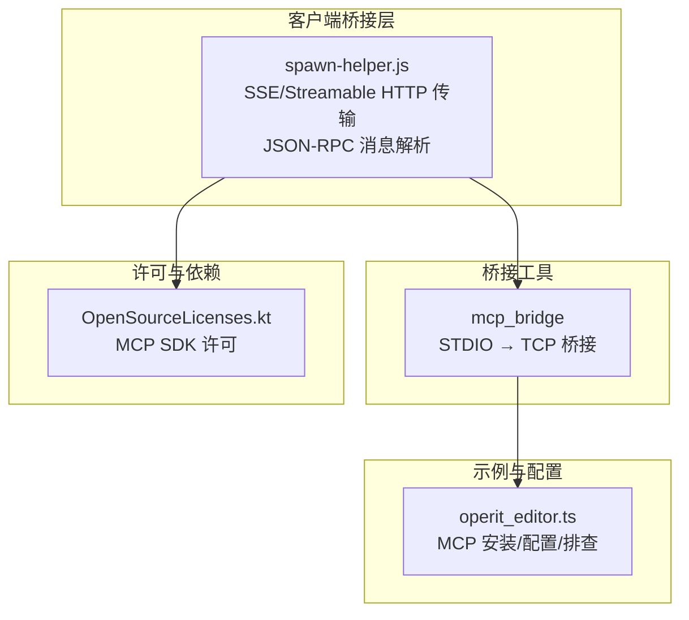
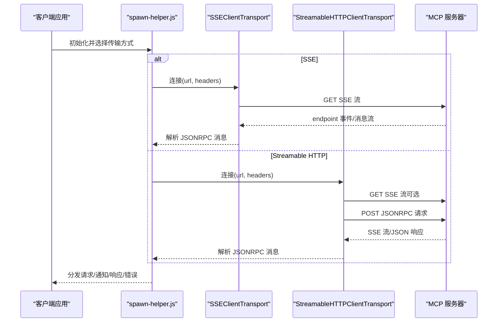
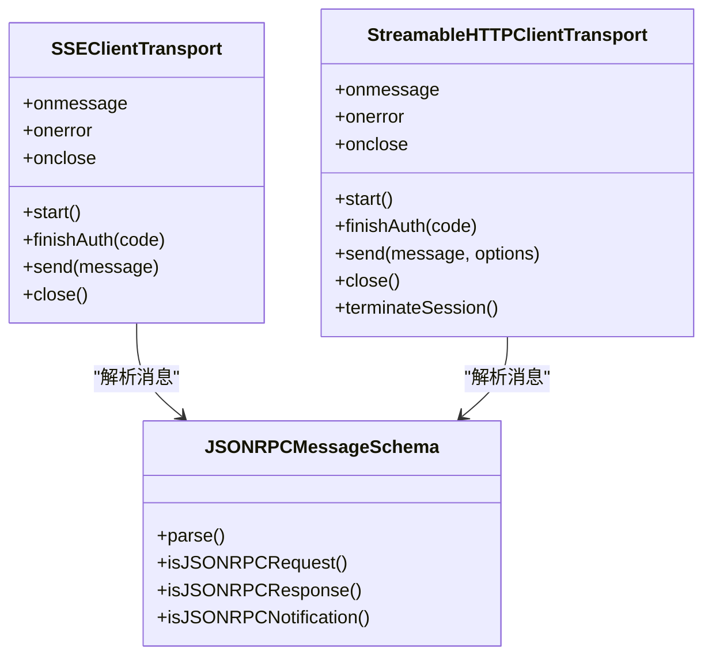
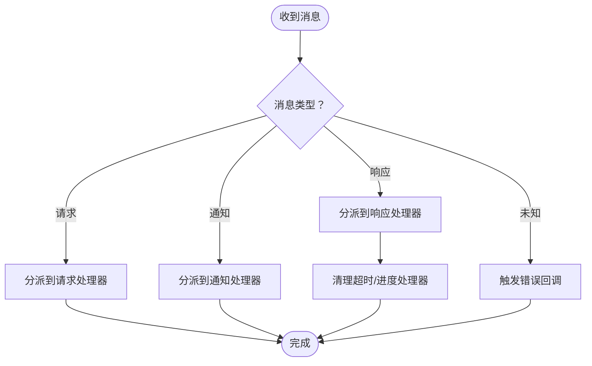
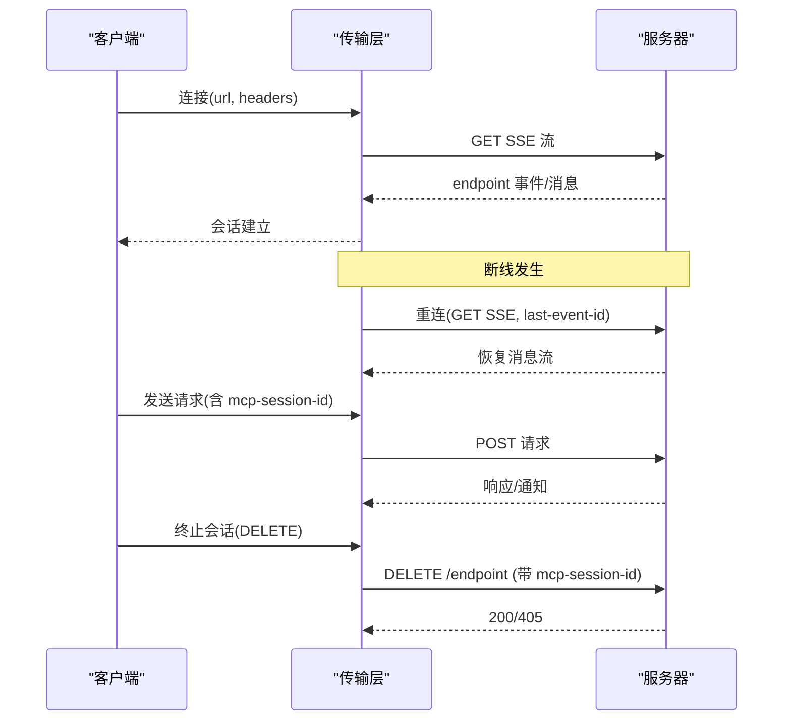
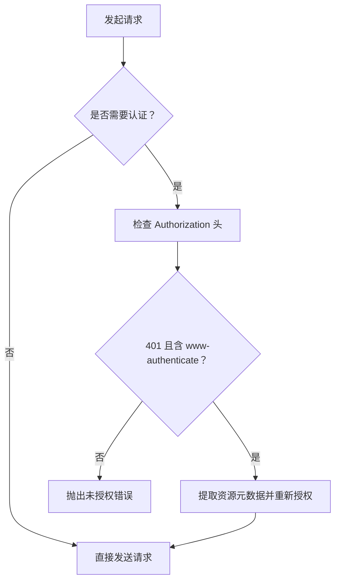
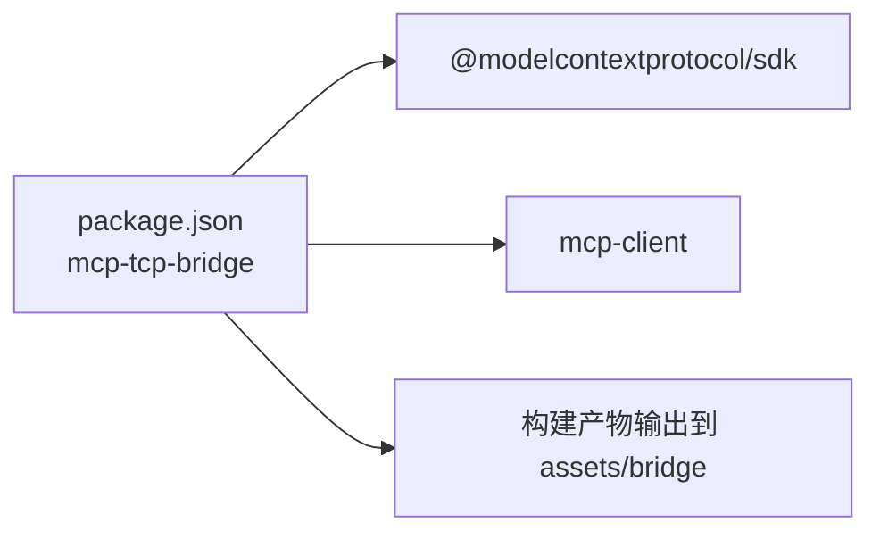

# MCP 协议规范

<cite>
**本文引用的文件**
- [spawn-helper.js](file://app/src/main/assets/bridge/spawn-helper.js)
- [package.json](file://tools/mcp_bridge/package.json)
- [OpenSourceLicenses.kt](file://app/src/main/java/com/ai/assistance/operit/ui/features/about/screens/OpenSourceLicenses.kt)
- [operit_editor.ts](file://examples/operit_editor.ts)
</cite>

## 目录
1. [简介](#简介)
2. [项目结构](#项目结构)
3. [核心组件](#核心组件)
4. [架构总览](#架构总览)
5. [详细组件分析](#详细组件分析)
6. [依赖关系分析](#依赖关系分析)
7. [性能考量](#性能考量)
8. [故障排查指南](#故障排查指南)
9. [结论](#结论)
10. [附录](#附录)

## 简介
本文件面向 MCP（Model Context Protocol）协议在本项目的实现与使用，系统化梳理协议版本演进、消息格式、连接建立、会话生命周期、请求/响应与通知、错误处理、安全机制（认证、授权、资源限制）、扩展性设计（自定义方法、版本协商、向后兼容）、实现指南（序列化、传输、状态同步）以及调试工具与流量分析方法。文档所有技术细节均来源于仓库中已存在的实现文件与示例。

## 项目结构
本项目围绕 MCP 协议的关键实现集中在以下位置：
- 客户端桥接与传输层：位于 assets/bridge 下的 spawn-helper.js，封装了 SSE 与 Streamable HTTP 两种传输方式，以及 JSON-RPC 消息解析与错误处理。
- MCP 桥接工具链：tools/mcp_bridge 提供将 STDIO 型 MCP 服务桥接至 TCP 的工具，便于在移动端或无终端环境下运行 MCP 服务。
- 示例与配置：examples/operit_editor.ts 提供 MCP 插件安装、配置与排查的实践说明。
- 许可与依赖：OpenSourceLicenses.kt 显示项目使用了 MCP SDK（Model Context Protocol SDK）。

**图表来源**
- [spawn-helper.js:9173-9550](file://app/src/main/assets/bridge/spawn-helper.js#L9173-L9550)
- [package.json:1-34](file://tools/mcp_bridge/package.json#L1-L34)
- [OpenSourceLicenses.kt:93-93](file://app/src/main/java/com/ai/assistance/operit/ui/features/about/screens/OpenSourceLicenses.kt#L93-L93)

**章节来源**
- [spawn-helper.js:9173-9550](file://app/src/main/assets/bridge/spawn-helper.js#L9173-L9550)
- [package.json:1-34](file://tools/mcp_bridge/package.json#L1-L34)
- [OpenSourceLicenses.kt:93-93](file://app/src/main/java/com/ai/assistance/operit/ui/features/about/screens/OpenSourceLicenses.kt#L93-L93)

## 核心组件
- 传输层
  - SSEClientTransport：基于 Server-Sent Events 的客户端传输，支持 endpoint 事件接收、消息解析与认证失败后的重试。
  - StreamableHTTPClientTransport：基于 HTTP 的客户端传输，支持 GET SSE 流监听与 POST 发送消息，具备断线重连与会话恢复能力。
- 协议层
  - JSONRPCMessageSchema：统一的 JSON-RPC 消息类型定义，涵盖请求、通知、成功响应与错误响应。
  - 错误码体系：包含 SDK 自定义错误（如连接关闭、请求超时）与标准 JSON-RPC 错误码。
- 认证与授权
  - 支持 Bearer Token 认证，自动注入 Authorization 头；在 401 且携带 www-authenticate 时，能提取资源元数据并触发重新授权。
- 会话管理
  - 通过 mcp-session-id 头部进行会话标识与终止；支持显式删除会话（DELETE）与 SSE 断线重连恢复。

**章节来源**
- [spawn-helper.js:9000-9162](file://app/src/main/assets/bridge/spawn-helper.js#L9000-L9162)
- [spawn-helper.js:9173-9550](file://app/src/main/assets/bridge/spawn-helper.js#L9173-L9550)
- [spawn-helper.js:10093-10165](file://app/src/main/assets/bridge/spawn-helper.js#L10093-L10165)
- [spawn-helper.js:20648-20712](file://app/src/main/assets/bridge/spawn-helper.js#L20648-L20712)

## 架构总览
下图展示了客户端桥接层如何通过两种传输方式与 MCP 服务器交互，以及消息在各组件间的流转。

**图表来源**
- [spawn-helper.js:9000-9162](file://app/src/main/assets/bridge/spawn-helper.js#L9000-L9162)
- [spawn-helper.js:9173-9550](file://app/src/main/assets/bridge/spawn-helper.js#L9173-L9550)

## 详细组件分析

### 传输层组件
- SSEClientTransport
  - 功能要点：建立 SSE 连接、接收 endpoint 事件、解析消息、处理 401 重认证、发送消息、关闭连接。
  - 关键头：mcp-protocol-version、Authorization。
- StreamableHTTPClientTransport
  - 功能要点：GET SSE 流监听、POST 发送消息、202 Accepted 处理、SSE 断线重连、会话恢复、显式终止会话。
  - 关键头：mcp-session-id、mcp-protocol-version、Authorization。
  - 重连策略：指数回退，最大重试次数可配置。

**图表来源**
- [spawn-helper.js:9000-9162](file://app/src/main/assets/bridge/spawn-helper.js#L9000-L9162)
- [spawn-helper.js:9173-9550](file://app/src/main/assets/bridge/spawn-helper.js#L9173-L9550)
- [spawn-helper.js:10093-10165](file://app/src/main/assets/bridge/spawn-helper.js#L10093-L10165)

**章节来源**
- [spawn-helper.js:9000-9162](file://app/src/main/assets/bridge/spawn-helper.js#L9000-L9162)
- [spawn-helper.js:9173-9550](file://app/src/main/assets/bridge/spawn-helper.js#L9173-L9550)

### 消息格式与处理流程
- 消息类型
  - 请求：包含 jsonrpc 版本、唯一 id、方法与参数。
  - 通知：包含 jsonrpc 版本与方法，不期望响应。
  - 成功响应：包含 jsonrpc 版本、对应请求 id 与结果。
  - 错误响应：包含 jsonrpc 版本、对应请求 id、错误码与错误信息。
- 处理流程
  - 接收端根据类型分派到请求处理器、通知处理器或响应处理器。
  - 对于响应，清理超时与进度处理器；对于错误响应，构造标准化错误对象。
  - 对于未知消息类型，触发错误回调。

**图表来源**
- [spawn-helper.js:21980-22124](file://app/src/main/assets/bridge/spawn-helper.js#L21980-L22124)

**章节来源**
- [spawn-helper.js:10093-10165](file://app/src/main/assets/bridge/spawn-helper.js#L10093-L10165)
- [spawn-helper.js:21980-22124](file://app/src/main/assets/bridge/spawn-helper.js#L21980-L22124)

### 连接建立与会话生命周期
- 连接建立
  - SSE：通过 endpoint 事件获取服务器端点，随后进入消息监听。
  - Streamable HTTP：GET SSE 流监听；若服务器返回 202，则在初始化通知后启动 SSE 流。
- 会话管理
  - 会话 ID：由服务器在响应头 mcp-session-id 中下发，后续请求需携带该头。
  - 会话终止：客户端可通过 DELETE 请求显式终止当前会话；服务器可能返回 405 表示不支持显式终止。
- 断线重连
  - SSE 断线时，使用指数回退策略尝试重连；支持基于 last-event-id 的会话恢复。

**图表来源**
- [spawn-helper.js:9226-9548](file://app/src/main/assets/bridge/spawn-helper.js#L9226-L9548)

**章节来源**
- [spawn-helper.js:9226-9548](file://app/src/main/assets/bridge/spawn-helper.js#L9226-L9548)

### 安全机制
- 认证
  - Bearer Token：自动注入 Authorization 头；当收到 401 且包含 www-authenticate 时，提取资源元数据并触发重新授权。
- 授权检查
  - 通过资源 URL 与配置资源 URL 的匹配规则进行资源访问控制（同源 + 路径前缀）。
- 传输安全
  - 传输层通过 fetch/EventSource 进行网络交互，建议配合 HTTPS 使用以保障传输安全。

**图表来源**
- [spawn-helper.js:9000-9162](file://app/src/main/assets/bridge/spawn-helper.js#L9000-L9162)
- [spawn-helper.js:9785-9799](file://app/src/main/assets/bridge/spawn-helper.js#L9785-L9799)

**章节来源**
- [spawn-helper.js:9000-9162](file://app/src/main/assets/bridge/spawn-helper.js#L9000-L9162)
- [spawn-helper.js:9785-9799](file://app/src/main/assets/bridge/spawn-helper.js#L9785-L9799)

### 协议扩展性与版本协商
- 版本协商
  - 客户端通过 mcp-protocol-version 头声明支持的协议版本；服务器可声明其希望使用的版本；若客户端不支持服务器版本，必须断开连接。
- 向后兼容
  - 通过支持多个协议版本（SUPPORTED_PROTOCOL_VERSIONS）与默认协商版本（DEFAULT_NEGOTIATED_PROTOCOL_VERSION）实现兼容。
- 自定义方法
  - 协议层提供通用请求/通知/响应解析，便于扩展自定义方法与能力。

**章节来源**
- [spawn-helper.js:10296-10366](file://app/src/main/assets/bridge/spawn-helper.js#L10296-L10366)
- [spawn-helper.js:20833-20898](file://app/src/main/assets/bridge/spawn-helper.js#L20833-L20898)

### 实现指南
- 消息序列化
  - 使用 JSONRPCMessageSchema 对消息进行解析与校验，确保字段完整与类型正确。
- 网络传输
  - SSE：适用于持续消息流；Streamable HTTP：适用于请求-响应与可选的 SSE 流。
- 状态同步
  - 通过 last-event-id 实现 SSE 断线恢复；通过 mcp-session-id 实现会话状态同步。

**章节来源**
- [spawn-helper.js:9336-9396](file://app/src/main/assets/bridge/spawn-helper.js#L9336-L9396)
- [spawn-helper.js:9423-9501](file://app/src/main/assets/bridge/spawn-helper.js#L9423-L9501)

## 依赖关系分析
- mcp_bridge 工具链
  - 依赖 @modelcontextprotocol/sdk 与 mcp-client，用于桥接 STDIO 型 MCP 服务。
  - 构建脚本将编译产物复制到 app/src/main/assets/bridge，供客户端运行时使用。
- 第三方库
  - OpenSourceLicenses.kt 显示使用了 MCP SDK（MIT 许可），表明项目采用官方 SDK 进行协议实现。

**图表来源**
- [package.json:22-26](file://tools/mcp_bridge/package.json#L22-L26)

**章节来源**
- [package.json:1-34](file://tools/mcp_bridge/package.json#L1-L34)
- [OpenSourceLicenses.kt:93-93](file://app/src/main/java/com/ai/assistance/operit/ui/features/about/screens/OpenSourceLicenses.kt#L93-L93)

## 性能考量
- 重连策略
  - 初始延迟、最大延迟与增长因子可配置；最大重试次数限制避免无限重试。
- 超时管理
  - 对每个请求维护超时信息，支持在进度回调时重置超时，防止长耗时操作误判。
- 流式处理
  - SSE 流式解析与解码，降低内存占用并提升实时性。

**章节来源**
- [spawn-helper.js:9179-9296](file://app/src/main/assets/bridge/spawn-helper.js#L9179-L9296)
- [spawn-helper.js:21930-21960](file://app/src/main/assets/bridge/spawn-helper.js#L21930-L21960)

## 故障排查指南
- 连接失败
  - 检查 401 与 www-authenticate 头，确认资源元数据提取与重新授权流程是否正常。
  - 确认 mcp-protocol-version 与服务器支持版本匹配。
- 会话异常
  - 检查 mcp-session-id 是否正确下发与携带；若服务器不支持显式终止，DELETE 可能返回 405。
- 断线重连
  - 观察 last-event-id 是否正确传递；确认指数回退策略与最大重试次数配置。
- MCP 插件安装与配置
  - 参考 operit_editor.ts 中的配置目录、命令型 MCP 的执行方式与环境变量设置，确保插件可被正确识别与启动。

**章节来源**
- [spawn-helper.js:9048-9051](file://app/src/main/assets/bridge/spawn-helper.js#L9048-L9051)
- [spawn-helper.js:9270-9274](file://app/src/main/assets/bridge/spawn-helper.js#L9270-L9274)
- [spawn-helper.js:9517-9541](file://app/src/main/assets/bridge/spawn-helper.js#L9517-L9541)
- [operit_editor.ts:33-67](file://examples/operit_editor.ts#L33-L67)

## 结论
本项目基于官方 MCP SDK 与自研传输层实现了完整的 MCP 协议栈，覆盖了版本协商、消息格式、连接建立、会话管理、安全机制与扩展性设计。通过 SSE 与 Streamable HTTP 两种传输方式，结合断线重连与会话恢复，满足移动端与桌面端的多样化部署场景。配合 mcp_bridge 工具链与示例配置，可快速集成第三方 MCP 服务并进行调试与排障。

## 附录
- 相关文件路径
  - 客户端桥接与传输层：app/src/main/assets/bridge/spawn-helper.js
  - MCP 桥接工具：tools/mcp_bridge/package.json
  - 示例与配置：examples/operit_editor.ts
  - 许可与依赖：app/src/main/java/com/ai/assistance/operit/ui/features/about/screens/OpenSourceLicenses.kt