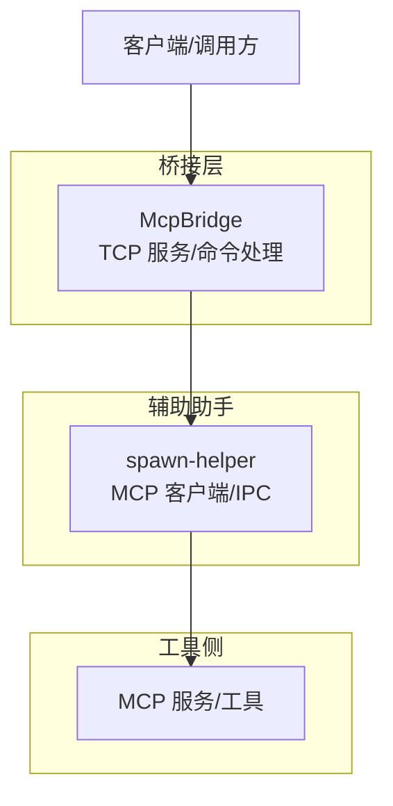
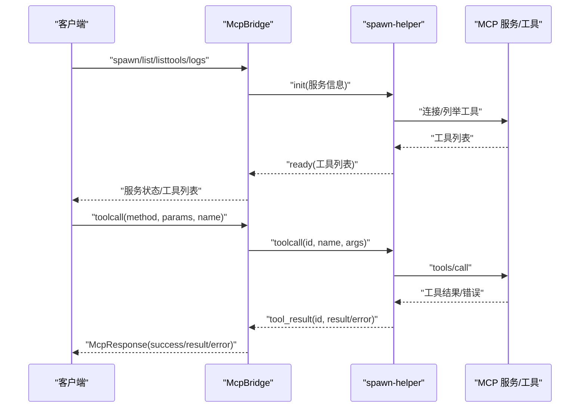
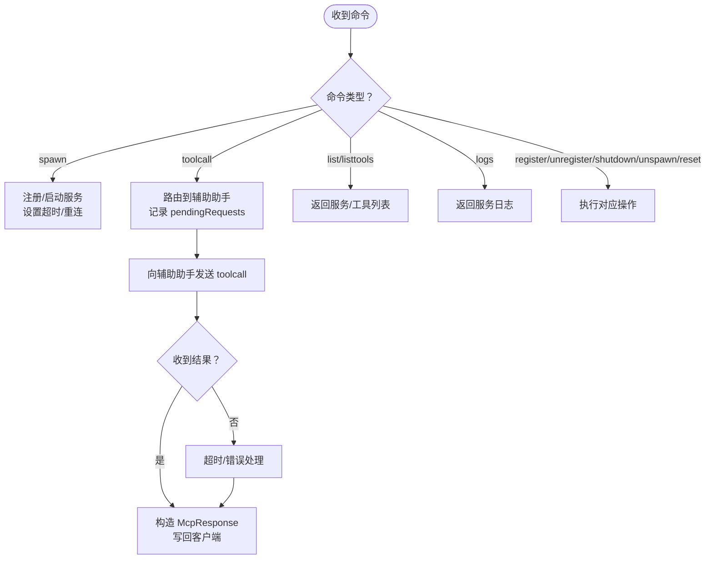
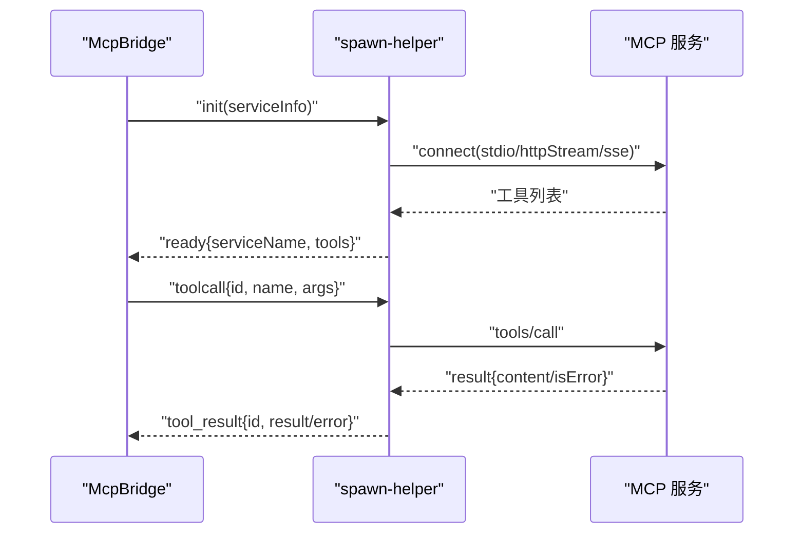
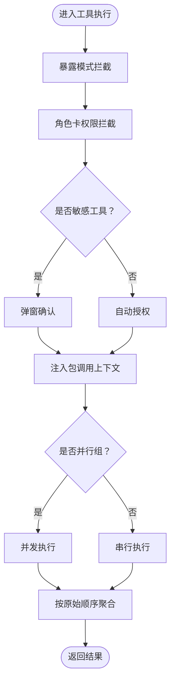
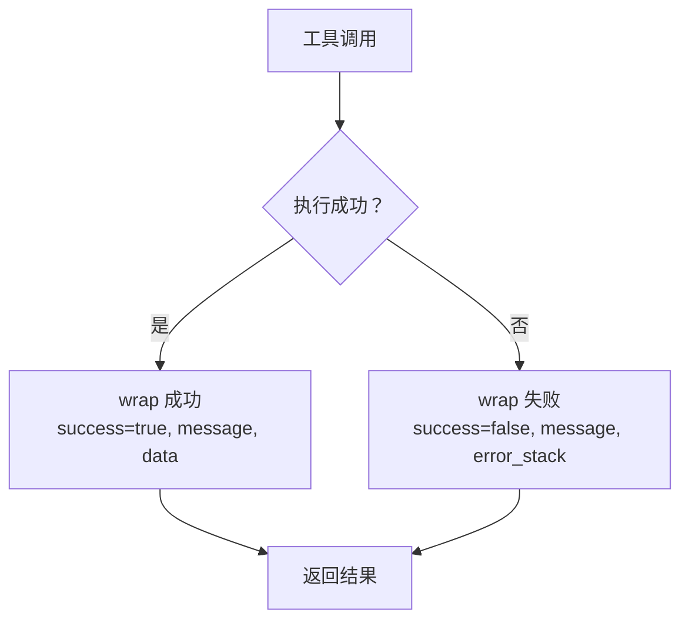
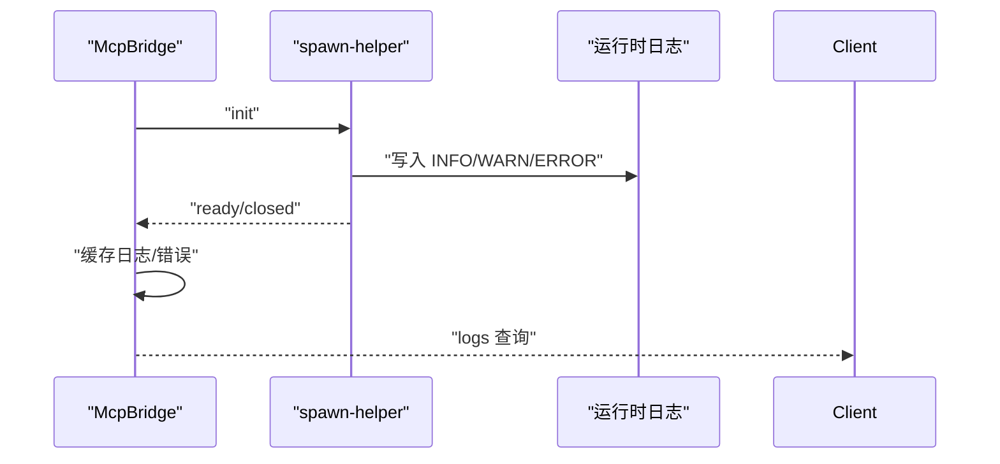
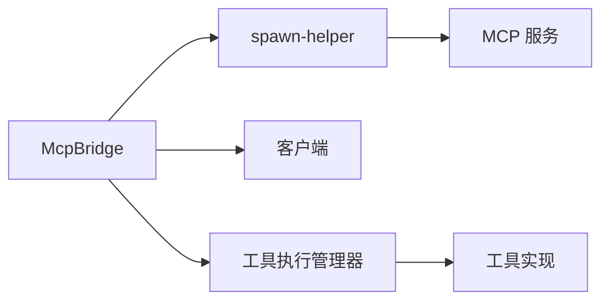

# MCP 工具执行

<cite>
**本文引用的文件**
- [tools/mcp_bridge/index.ts](file://tools/mcp_bridge/index.ts)
- [app/src/main/assets/bridge/spawn-helper.js](file://app/src/main/assets/bridge/spawn-helper.js)
- [my_docs/AI Agent软件架构设计与业务流程.md](file://my_docs/AI Agent软件架构设计与业务流程.md)
- [examples/github/src/utils/wrap.ts](file://examples/github/src/utils/wrap.ts)
- [examples/linux_ssh/src/linux_ssh_setup/index.ui.ts](file://examples/linux_ssh/src/linux_ssh_setup/index.ui.ts)
- [app/src/androidTest/js/com/ai/assistance/operit/core/tools/javascript/bridge_contract/host_runtime.js](file://app/src/androidTest/js/com/ai/assistance/operit/core/tools/javascript/bridge_contract/host_runtime.js)
- [examples/windows_control/resources/pc_agent/operit-pc-agent/src/lib/logger.js](file://examples/windows_control/resources/pc_agent/operit-pc-agent/src/lib/logger.js)
- [examples/super_admin.ts](file://examples/super_admin.ts)
- [examples/remote_operit/src/packages/remote_operit.ts](file://examples/remote_operit/src/packages/remote_operit.ts)
</cite>

## 目录
1. [简介](#简介)
2. [项目结构](#项目结构)
3. [核心组件](#核心组件)
4. [架构总览](#架构总览)
5. [详细组件分析](#详细组件分析)
6. [依赖关系分析](#依赖关系分析)
7. [性能考量](#性能考量)
8. [故障排查指南](#故障排查指南)
9. [结论](#结论)
10. [附录](#附录)

## 简介
本文聚焦 Operit 的 MCP 工具执行机制，系统阐述从工具发现、参数传递、执行调度、结果收集，到工具执行封装、上下文传递、权限检查、资源隔离；再到异步执行模型（并发控制、队列管理、进度报告、取消机制）、结果处理（数据转换、格式标准化、错误传播、异常处理）、执行监控（执行日志、性能指标、资源使用、超时处理）、执行限制（时间、内存、网络等）以及面向工具开发者的实现指南（接口规范、参数定义、返回值格式、错误处理最佳实践）。文档同时给出与现有代码结构相对应的可视化图示，帮助读者快速建立对系统执行链路的整体认知。

## 项目结构
Operit 的 MCP 工具执行由“桥接层 + 辅助助手 + 工具侧”三部分协同完成：
- 桥接层（tools/mcp_bridge/index.ts）：提供 TCP 接口，负责服务注册、生命周期管理、请求路由、超时与重连、日志与错误聚合。
- 辅助助手（app/src/main/assets/bridge/spawn-helper.js）：作为 MCP 客户端，承载实际的 MCP 连接、工具发现、工具调用、输出校验与 IPC 通信。
- 工具侧（各类工具包与示例）：提供具体工具实现，遵循统一的参数与返回约定，配合包装器进行错误与结果标准化。

图表来源
- [tools/mcp_bridge/index.ts:1278-1428](file://tools/mcp_bridge/index.ts#L1278-L1428)
- [app/src/main/assets/bridge/spawn-helper.js:77-146](file://app/src/main/assets/bridge/spawn-helper.js#L77-L146)

章节来源
- [tools/mcp_bridge/index.ts:1278-1428](file://tools/mcp_bridge/index.ts#L1278-L1428)
- [app/src/main/assets/bridge/spawn-helper.js:77-146](file://app/src/main/assets/bridge/spawn-helper.js#L77-L146)

## 核心组件
- MCP 桥接器（McpBridge）
  - 负责 TCP 服务监听、命令解析与分发、服务注册与生命周期管理、请求超时与重连、日志与错误聚合。
  - 支持本地与远程 MCP 服务，统一通过辅助助手进行连接与工具调用。
- 辅助助手（spawn-helper）
  - 作为 MCP 客户端，负责连接 MCP 服务、列举工具、调用工具、输出结构化校验、通过 IPC 将结果回传桥接器。
- 工具执行管理与上下文
  - 工具执行在系统中受暴露模式、角色卡权限、敏感工具弹窗确认等策略约束；执行上下文通过包调用信息注入，支持并行/串行分组执行。

章节来源
- [tools/mcp_bridge/index.ts:84-1441](file://tools/mcp_bridge/index.ts#L84-L1441)
- [app/src/main/assets/bridge/spawn-helper.js:77-192](file://app/src/main/assets/bridge/spawn-helper.js#L77-L192)
- [my_docs/AI Agent软件架构设计与业务流程.md:256-299](file://my_docs/AI Agent软件架构设计与业务流程.md#L256-L299)

## 架构总览
下图展示了 MCP 工具调用从客户端发起到工具返回结果的完整链路，包括工具发现、参数传递、执行调度、结果收集与错误传播。

图表来源
- [tools/mcp_bridge/index.ts:577-1147](file://tools/mcp_bridge/index.ts#L577-L1147)
- [app/src/main/assets/bridge/spawn-helper.js:130-184](file://app/src/main/assets/bridge/spawn-helper.js#L130-L184)

## 详细组件分析

### 组件 A：MCP 桥接器（McpBridge）
- 服务注册与生命周期
  - 支持本地与远程 MCP 服务注册，统一通过辅助助手进行连接与管理。
  - 提供 spawn、list、listtools、logs、register、unregister、unspawn、shutdown、cachetools、reset 等命令。
- 请求路由与超时
  - 维护 pendingRequests 映射，按请求 ID 路由响应；默认请求超时 180 秒，spawn 超时同样为 180 秒。
  - 定期清理闲置服务（默认 5 分钟），并具备失败重连与致命错误标记。
- 日志与错误
  - 服务日志缓存（最多 400 行，每行最长 4000 字符），支持通过 logs 命令查询。
  - 致命错误检测（如缺少 API Key 等），阻止重复尝试重启。

图表来源
- [tools/mcp_bridge/index.ts:577-1147](file://tools/mcp_bridge/index.ts#L577-L1147)
- [tools/mcp_bridge/index.ts:1246-1273](file://tools/mcp_bridge/index.ts#L1246-L1273)

章节来源
- [tools/mcp_bridge/index.ts:84-1441](file://tools/mcp_bridge/index.ts#L84-L1441)

### 组件 B：辅助助手（spawn-helper）
- 连接与工具发现
  - 支持本地 stdio 连接与远程 HTTP/SSE 连接，自动合并环境变量与工作目录。
  - 成功连接后列举工具并缓存输出模式校验器，用于后续工具调用结果校验。
- 工具调用与输出校验
  - 调用工具时将结果封装为 content 结构，若 isError 为真则映射为标准错误对象。
  - 若工具声明 outputSchema，则对 structuredContent 进行 Ajv 校验，不符合则抛出 InvalidParams 错误。
- IPC 通信
  - 通过 process.send 发送 ready、tool_result、closed、error 等事件，供桥接器处理。

图表来源
- [app/src/main/assets/bridge/spawn-helper.js:77-146](file://app/src/main/assets/bridge/spawn-helper.js#L77-L146)
- [app/src/main/assets/bridge/spawn-helper.js:148-184](file://app/src/main/assets/bridge/spawn-helper.js#L148-L184)
- [app/src/main/assets/bridge/spawn-helper.js:22548-22575](file://app/src/main/assets/bridge/spawn-helper.js#L22548-L22575)

章节来源
- [app/src/main/assets/bridge/spawn-helper.js:77-192](file://app/src/main/assets/bridge/spawn-helper.js#L77-L192)
- [app/src/main/assets/bridge/spawn-helper.js:22548-22575](file://app/src/main/assets/bridge/spawn-helper.js#L22548-L22575)

### 组件 C：工具执行封装与上下文传递
- 上下文注入
  - 在工具执行前注入包调用上下文（如 caller 名称、卡片 ID、聊天 ID），便于工具侧感知调用来源。
- 权限检查与拦截
  - 暴露模式（CLI/FULL）拦截、角色卡工具权限拦截、敏感工具弹窗确认。
- 并行/串行分组
  - 并行组工具（如文件类、内存检索类）并发执行，其余串行执行，最终按原始顺序聚合结果。

图表来源
- [my_docs/AI Agent软件架构设计与业务流程.md:265-299](file://my_docs/AI Agent软件架构设计与业务流程.md#L265-L299)

章节来源
- [my_docs/AI Agent软件架构设计与业务流程.md:256-299](file://my_docs/AI Agent软件架构设计与业务流程.md#L256-L299)

### 组件 D：异步执行模型与并发控制
- 并发控制
  - 并行组使用协程并发执行，串行组逐个执行，避免资源竞争与状态冲突。
- 队列管理与超时
  - 桥接器维护 pendingRequests 映射，按请求 ID 路由响应；默认请求超时 180 秒。
  - 客户端 Socket 设置超时（请求超时的两倍），防止挂起。
- 取消机制
  - 当前实现未显式暴露取消 API；建议在工具侧自行实现超时与中断逻辑（见“执行限制”）。

章节来源
- [tools/mcp_bridge/index.ts:1246-1273](file://tools/mcp_bridge/index.ts#L1246-L1273)
- [tools/mcp_bridge/index.ts:1288-1294](file://tools/mcp_bridge/index.ts#L1288-L1294)
- [my_docs/AI Agent软件架构设计与业务流程.md:286-296](file://my_docs/AI Agent软件架构设计与业务流程.md#L286-L296)

### 组件 E：工具结果处理与格式标准化
- 数据转换与格式标准化
  - 工具侧通过包装器（wrap）统一返回 success/message/data/error_stack 结构，便于上层一致处理。
  - 结果解析示例：优先使用 output，其次 rawOutput，再次 error，最后字符串化 result 或格式化对象。
- 错误传播与异常处理
  - 空工具名调用会得到明确错误提示；工具内部异常被捕获并转化为统一的错误结构。
  - 远程 MCP 工具调用失败时，辅助助手将 isError 标记映射为标准错误对象。

图表来源
- [examples/github/src/utils/wrap.ts:8-26](file://examples/github/src/utils/wrap.ts#L8-L26)
- [app/src/androidTest/js/com/ai/assistance/operit/core/tools/javascript/bridge_contract/host_runtime.js:109-122](file://app/src/androidTest/js/com/ai/assistance/operit/core/tools/javascript/bridge_contract/host_runtime.js#L109-L122)
- [app/src/main/assets/bridge/spawn-helper.js:157-184](file://app/src/main/assets/bridge/spawn-helper.js#L157-L184)

章节来源
- [examples/github/src/utils/wrap.ts:1-26](file://examples/github/src/utils/wrap.ts#L1-L26)
- [examples/linux_ssh/src/linux_ssh_setup/index.ui.ts:100-134](file://examples/linux_ssh/src/linux_ssh_setup/index.ui.ts#L100-L134)
- [app/src/androidTest/js/com/ai/assistance/operit/core/tools/javascript/bridge_contract/host_runtime.js:109-122](file://app/src/androidTest/js/com/ai/assistance/operit/core/tools/javascript/bridge_contract/host_runtime.js#L109-L122)
- [app/src/main/assets/bridge/spawn-helper.js:157-184](file://app/src/main/assets/bridge/spawn-helper.js#L157-L184)

### 组件 F：执行监控与日志
- 执行日志
  - 桥接器缓存服务日志（最多 400 行，每行最长 4000 字符），可通过 logs 命令查询。
  - 远程 MCP 服务连接失败时，辅助助手会发送 closed 事件并携带错误信息。
- 性能指标与资源使用
  - 工具侧可参考远程包对超时与输出大小的处理（如大输出保存到文件），避免内存压力。
- 超时处理
  - 桥接器默认请求超时 180 秒；客户端 Socket 超时为 120 秒；远程包示例对超时进行参数解析与转换。

图表来源
- [tools/mcp_bridge/index.ts:215-234](file://tools/mcp_bridge/index.ts#L215-L234)
- [app/src/main/assets/bridge/spawn-helper.js:137-146](file://app/src/main/assets/bridge/spawn-helper.js#L137-L146)
- [examples/windows_control/resources/pc_agent/operit-pc-agent/src/lib/logger.js:4-38](file://examples/windows_control/resources/pc_agent/operit-pc-agent/src/lib/logger.js#L4-L38)

章节来源
- [tools/mcp_bridge/index.ts:215-234](file://tools/mcp_bridge/index.ts#L215-L234)
- [examples/windows_control/resources/pc_agent/operit-pc-agent/src/lib/logger.js:1-38](file://examples/windows_control/resources/pc_agent/operit-pc-agent/src/lib/logger.js#L1-L38)
- [examples/super_admin.ts:100-128](file://examples/super_admin.ts#L100-L128)

### 组件 G：执行限制与资源隔离
- 执行时间
  - 桥接器默认请求超时 180 秒；远程包示例对 timeout_ms 进行参数解析与校验，转换为 HTTP 超时秒数。
- 内存与输出
  - 当工具输出过大时，远程包示例将输出保存到文件并返回路径，避免内存溢出。
- 网络
  - 远程 MCP 服务支持 HTTP/SSE 连接，辅助助手可附加认证头（Bearer Token、自定义 Headers）。

章节来源
- [tools/mcp_bridge/index.ts:103-105](file://tools/mcp_bridge/index.ts#L103-L105)
- [examples/remote_operit/src/packages/remote_operit.ts:335-384](file://examples/remote_operit/src/packages/remote_operit.ts#L335-L384)
- [examples/super_admin.ts:100-128](file://examples/super_admin.ts#L100-L128)
- [app/src/main/assets/bridge/spawn-helper.js:111-127](file://app/src/main/assets/bridge/spawn-helper.js#L111-L127)

### 组件 H：面向工具开发者的实现指南
- 接口规范
  - 工具名称与参数需满足 MCP 工具定义（inputSchema、outputSchema），辅助助手会对 outputSchema 进行 Ajv 校验。
- 参数定义
  - 使用 JSON Schema 定义 inputSchema 与 outputSchema，确保参数与返回值结构清晰。
- 返回值格式
  - 使用包装器（wrap）统一返回 success/message/data/error_stack，便于上层一致处理。
- 错误处理最佳实践
  - 明确区分业务错误与系统错误；对空工具名、无效参数、远程调用失败等情况提供明确错误信息。
  - 工具内部异常捕获并转化为统一错误结构，避免泄露底层细节。

章节来源
- [app/src/main/assets/bridge/spawn-helper.js:22548-22575](file://app/src/main/assets/bridge/spawn-helper.js#L22548-L22575)
- [examples/github/src/utils/wrap.ts:8-26](file://examples/github/src/utils/wrap.ts#L8-L26)
- [app/src/androidTest/js/com/ai/assistance/operit/core/tools/javascript/bridge_contract/host_runtime.js:109-122](file://app/src/androidTest/js/com/ai/assistance/operit/core/tools/javascript/bridge_contract/host_runtime.js#L109-L122)

## 依赖关系分析
- 桥接器依赖辅助助手进行 MCP 连接与工具调用，二者通过 IPC 事件通信。
- 工具执行管理器在系统层面负责暴露模式、权限拦截、上下文注入与并发分组。
- 工具侧通过包装器与解析器实现结果标准化与错误传播。

图表来源
- [tools/mcp_bridge/index.ts:577-1147](file://tools/mcp_bridge/index.ts#L577-L1147)
- [app/src/main/assets/bridge/spawn-helper.js:77-146](file://app/src/main/assets/bridge/spawn-helper.js#L77-L146)
- [my_docs/AI Agent软件架构设计与业务流程.md:265-299](file://my_docs/AI Agent软件架构设计与业务流程.md#L265-L299)

章节来源
- [tools/mcp_bridge/index.ts:577-1147](file://tools/mcp_bridge/index.ts#L577-L1147)
- [app/src/main/assets/bridge/spawn-helper.js:77-146](file://app/src/main/assets/bridge/spawn-helper.js#L77-L146)
- [my_docs/AI Agent软件架构设计与业务流程.md:265-299](file://my_docs/AI Agent软件架构设计与业务流程.md#L265-L299)

## 性能考量
- 并发与队列
  - 并行组工具并发执行，串行组串行执行，减少整体等待时间。
- 超时与重连
  - 默认请求超时 180 秒，spawn 超时 180 秒；客户端 Socket 超时 120 秒；远程 MCP 断线具备指数退避重连与致命错误保护。
- 输出与内存
  - 大输出自动落盘，避免内存压力；远程包示例对输出大小进行阈值判断与持久化处理。

## 故障排查指南
- 致命错误
  - 若日志包含“缺少 API Key/Token”等提示，桥接器会标记服务为致命错误，不再尝试重启。
- 连接失败
  - 检查服务端点、认证头、网络连通性；查看 logs 命令返回的最近日志。
- 超时问题
  - 调整工具侧超时设置或优化工具执行逻辑；确认客户端 Socket 超时配置。
- 输出过大
  - 使用远程包示例的输出落盘策略，避免内存溢出。

章节来源
- [tools/mcp_bridge/index.ts:165-170](file://tools/mcp_bridge/index.ts#L165-L170)
- [tools/mcp_bridge/index.ts:357-380](file://tools/mcp_bridge/index.ts#L357-L380)
- [examples/super_admin.ts:100-128](file://examples/super_admin.ts#L100-L128)

## 结论
Operit 的 MCP 工具执行机制通过桥接器与辅助助手实现了对本地与远程 MCP 服务的统一接入，结合系统级的权限拦截、上下文注入与并发分组策略，形成了稳定、可观测、可扩展的工具执行体系。工具开发者只需遵循统一的参数与返回规范，并在工具侧做好超时与错误处理，即可无缝融入该执行链路。

## 附录
- 命令与参数要点
  - spawn：name、command、args、cwd、env、timeoutMs
  - toolcall：method、params、name
  - list/listtools：name（可选）
  - logs：name
  - register/unregister/shutdown/unspawn/reset：name（按需）

章节来源
- [tools/mcp_bridge/index.ts:577-1147](file://tools/mcp_bridge/index.ts#L577-L1147)