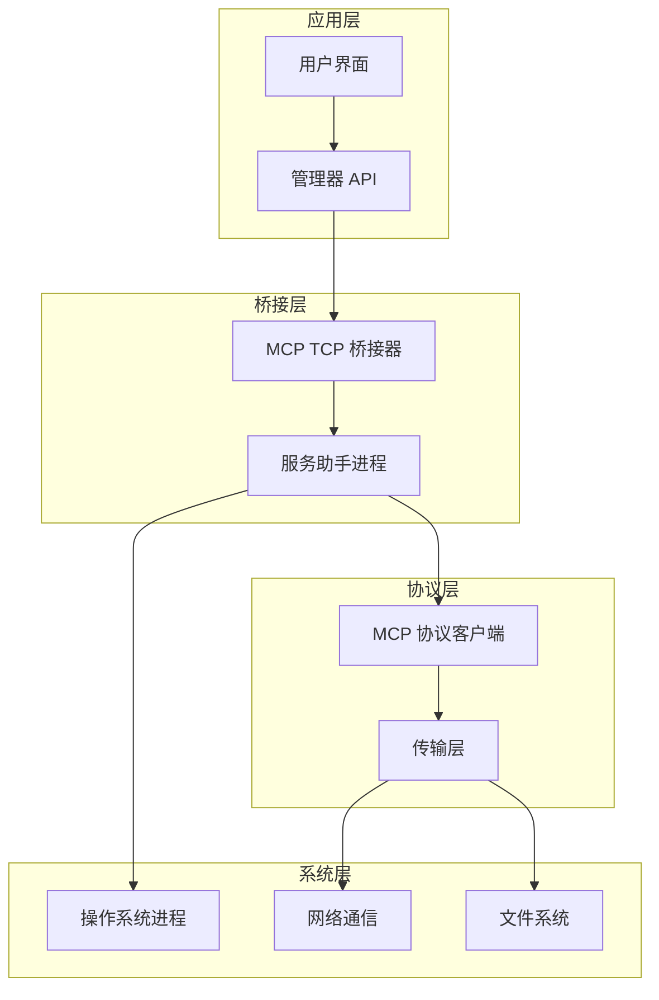
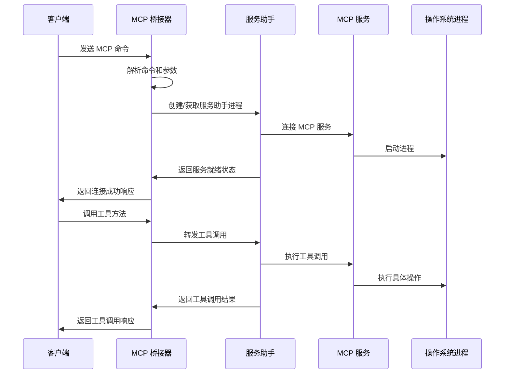
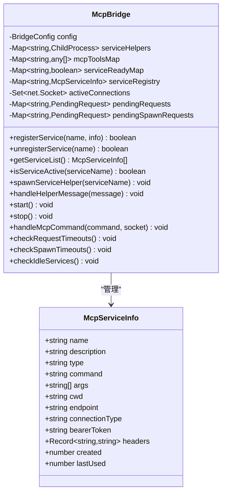
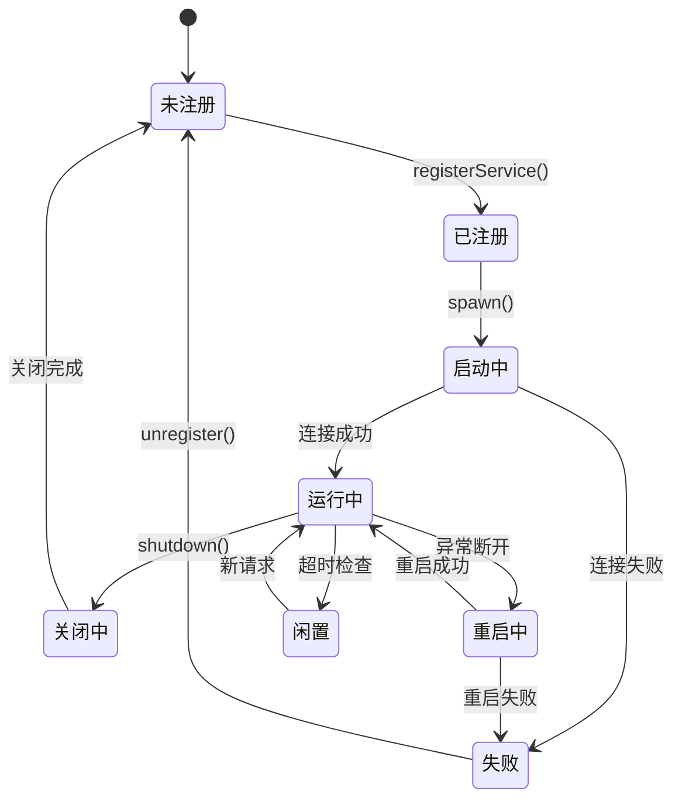
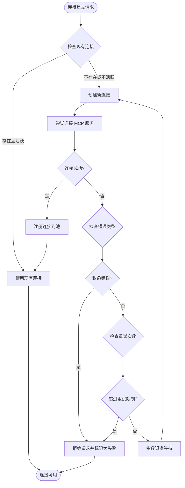
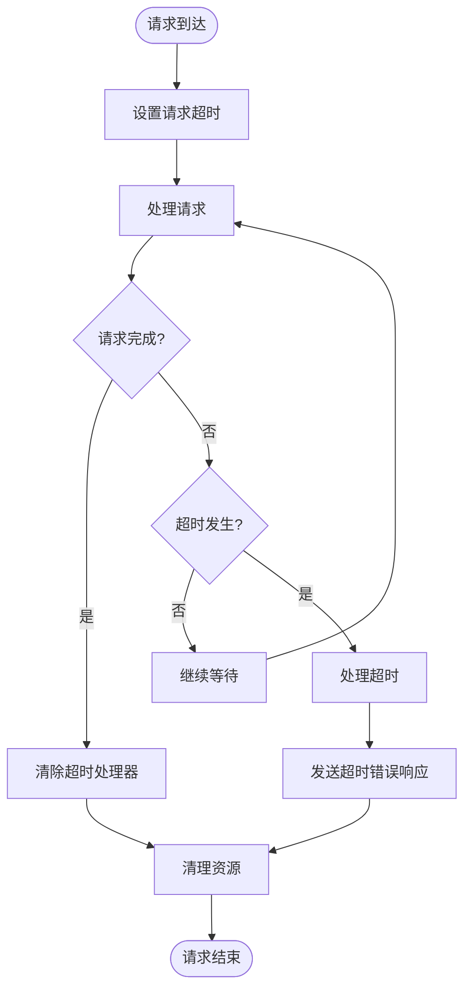
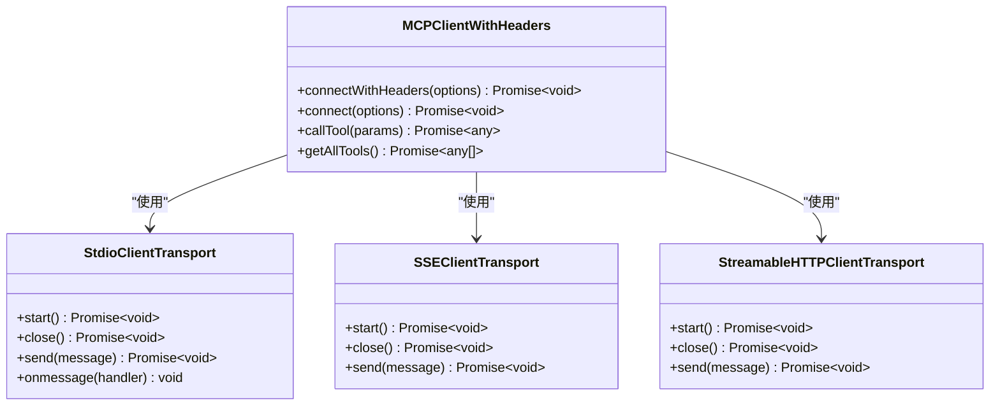

# MCP 管理器实现

<cite>
**本文档引用的文件**
- [tools/mcp_bridge/index.ts](file://tools/mcp_bridge/index.ts)
- [tools/mcp_bridge/spawn-helper.ts](file://tools/mcp_bridge/spawn-helper.ts)
- [app/src/main/assets/bridge/index.js](file://app/src/main/assets/bridge/index.js)
- [app/src/main/assets/bridge/spawn-helper.js](file://app/src/main/assets/bridge/spawn-helper.js)
- [examples/operit_editor.js](file://examples/operit_editor.js)
- [examples/operit_editor.ts](file://examples/operit_editor.ts)
- [app/src/main/assets/packages/operit_editor.js](file://app/src/main/assets/packages/operit_editor.js)
- [README.md](file://README.md)
</cite>

## 目录
1. [简介](#简介)
2. [项目结构](#项目结构)
3. [核心组件](#核心组件)
4. [架构概览](#架构概览)
5. [详细组件分析](#详细组件分析)
6. [依赖分析](#依赖分析)
7. [性能考虑](#性能考虑)
8. [故障排除指南](#故障排除指南)
9. [结论](#结论)
10. [附录](#附录)

## 简介

Operit 的 MCP（Model Context Protocol）管理器实现是一个完整的跨平台工具调用管理系统，专为移动端 AI 助手应用设计。该系统实现了标准的 MCP 协议，支持本地和远程 MCP 服务的统一管理，提供了一套完整的工具调用、服务发现和生命周期管理功能。

MCP 管理器的核心特性包括：
- **统一服务管理**：支持本地和远程 MCP 服务的统一注册、启动和管理
- **进程隔离**：通过子进程实现服务间的完全隔离
- **自动重连机制**：具备智能的错误检测和自动重启能力
- **超时管理**：完善的请求超时和资源清理机制
- **日志监控**：全面的服务状态监控和日志记录
- **包管理集成**：与 Operit 的包管理系统无缝集成

## 项目结构

MCP 管理器的实现采用了清晰的分层架构，主要分为以下几个层次：



**图表来源**
- [tools/mcp_bridge/index.ts:1-1468](file://tools/mcp_bridge/index.ts#L1-L1468)
- [tools/mcp_bridge/spawn-helper.ts:1-216](file://tools/mcp_bridge/spawn-helper.ts#L1-L216)

**章节来源**
- [tools/mcp_bridge/index.ts:1-1468](file://tools/mcp_bridge/index.ts#L1-L1468)
- [tools/mcp_bridge/spawn-helper.ts:1-216](file://tools/mcp_bridge/spawn-helper.ts#L1-L216)

## 核心组件

### MCP TCP 桥接器

MCP TCP 桥接器是整个系统的核心组件，负责管理 MCP 服务的生命周期和客户端连接。它实现了以下关键功能：

- **服务注册管理**：维护 MCP 服务的注册表，支持本地和远程服务的统一管理
- **进程生命周期管理**：通过子进程实现服务的启动、停止和重启
- **请求路由**：将客户端请求路由到相应的 MCP 服务
- **状态监控**：实时监控服务状态和健康状况
- **错误处理**：提供完善的错误检测和恢复机制

### 服务助手进程

服务助手进程是运行在独立子进程中的轻量级代理，负责与具体的 MCP 服务进行通信：

- **协议适配**：将 MCP 协议转换为应用程序可理解的格式
- **工具调用执行**：执行具体的工具调用并返回结果
- **状态同步**：向父进程报告服务状态和工具列表
- **错误传播**：将 MCP 服务的错误信息准确传达给客户端

### 协议适配层

协议适配层实现了 MCP 协议的标准接口，支持多种传输方式：

- **STDIO 传输**：用于本地 MCP 服务的进程间通信
- **HTTP 传输**：支持基于 HTTP 的 MCP 服务连接
- **SSE 传输**：支持服务器发送事件的实时通信
- **认证支持**：提供 Bearer Token 和自定义头部的认证机制

**章节来源**
- [tools/mcp_bridge/index.ts:84-256](file://tools/mcp_bridge/index.ts#L84-L256)
- [tools/mcp_bridge/spawn-helper.ts:10-29](file://tools/mcp_bridge/spawn-helper.ts#L10-L29)

## 架构概览

MCP 管理器采用事件驱动的异步架构，通过消息传递实现组件间的解耦：



**图表来源**
- [tools/mcp_bridge/index.ts:577-727](file://tools/mcp_bridge/index.ts#L577-L727)
- [tools/mcp_bridge/spawn-helper.ts:129-168](file://tools/mcp_bridge/spawn-helper.ts#L129-L168)

## 详细组件分析

### 服务注册与管理

MCP 管理器实现了完整的服务注册机制，支持本地和远程服务的统一管理：



**图表来源**
- [tools/mcp_bridge/index.ts:25-47](file://tools/mcp_bridge/index.ts#L25-L47)
- [tools/mcp_bridge/index.ts:84-116](file://tools/mcp_bridge/index.ts#L84-L116)

#### 服务生命周期管理

服务生命周期管理是 MCP 管理器的核心功能之一，实现了从服务启动到完全销毁的完整流程：



**图表来源**
- [tools/mcp_bridge/index.ts:339-380](file://tools/mcp_bridge/index.ts#L339-L380)
- [tools/mcp_bridge/index.ts:193-213](file://tools/mcp_bridge/index.ts#L193-L213)

### 连接池与重连机制

MCP 管理器实现了智能的连接池管理和自动重连机制：



**图表来源**
- [tools/mcp_bridge/index.ts:339-380](file://tools/mcp_bridge/index.ts#L339-L380)
- [tools/mcp_bridge/index.ts:175-188](file://tools/mcp_bridge/index.ts#L175-L188)

### 超时处理机制

MCP 管理器实现了多层次的超时处理机制，确保系统的稳定性和响应性：



**图表来源**
- [tools/mcp_bridge/index.ts:1253-1273](file://tools/mcp_bridge/index.ts#L1253-L1273)
- [tools/mcp_bridge/index.ts:21930-21952](file://tools/mcp_bridge/index.ts#L21930-L21952)

### 协议适配层实现

协议适配层实现了 MCP 协议的标准接口，支持多种传输方式和认证机制：



**图表来源**
- [tools/mcp_bridge/spawn-helper.ts:10-29](file://tools/mcp_bridge/spawn-helper.ts#L10-L29)
- [tools/mcp_bridge/spawn-helper.ts:178-195](file://tools/mcp_bridge/spawn-helper.ts#L178-L195)

**章节来源**
- [tools/mcp_bridge/spawn-helper.ts:10-216](file://tools/mcp_bridge/spawn-helper.ts#L10-L216)

## 依赖分析

MCP 管理器的依赖关系体现了清晰的分层架构和职责分离：

```mermaid
graph TB
subgraph "外部依赖"
NodeFS[node:fs]
NodeNet[node:net]
NodeChildProc[child_process]
UUID[uuid]
Path[path]
OS[os]
end
subgraph "MCP 协议库"
MCPClient[mcp-client]
SDKClient[@modelcontextprotocol/sdk/client]
SSETransport[@modelcontextprotocol/sdk/client/sse]
HTTPTransport[@modelcontextprotocol/sdk/client/streamableHttp]
end
subgraph "应用内部模块"
Bridge[index.ts]
Helper[spawn-helper.ts]
BridgeJS[index.js]
HelperJS[spawn-helper.js]
end
Bridge --> NodeFS
Bridge --> NodeNet
Bridge --> NodeChildProc
Bridge --> UUID
Bridge --> Path
Bridge --> OS
Helper --> MCPClient
Helper --> SDKClient
Helper --> SSETransport
Helper --> HTTPTransport
BridgeJS --> NodeFS
BridgeJS --> NodeNet
BridgeJS --> NodeChildProc
HelperJS --> MCPClient
HelperJS --> SDKClient
HelperJS --> SSETransport
HelperJS --> HTTPTransport
```

**图表来源**
- [tools/mcp_bridge/index.ts:9-13](file://tools/mcp_bridge/index.ts#L9-L13)
- [tools/mcp_bridge/spawn-helper.ts:1-7](file://tools/mcp_bridge/spawn-helper.ts#L1-L7)

### 核心依赖关系

MCP 管理器的关键依赖关系包括：

- **操作系统层依赖**：使用 Node.js 的核心模块实现进程管理和网络通信
- **MCP 协议实现**：依赖官方的 MCP 客户端库实现协议标准
- **传输层抽象**：支持多种传输方式的统一抽象层
- **进程间通信**：通过 IPC 实现父子进程间的高效通信

**章节来源**
- [tools/mcp_bridge/index.ts:9-13](file://tools/mcp_bridge/index.ts#L9-L13)
- [tools/mcp_bridge/spawn-helper.ts:1-7](file://tools/mcp_bridge/spawn-helper.ts#L1-L7)

## 性能考虑

MCP 管理器在设计时充分考虑了性能优化和资源管理：

### 内存管理

- **服务状态缓存**：使用 Map 结构缓存服务状态和工具列表，避免重复查询
- **日志轮转**：限制日志数量和长度，防止内存泄漏
- **连接池优化**：智能管理连接池大小，避免资源浪费

### 网络性能

- **连接复用**：支持多个请求复用同一连接
- **异步处理**：所有网络操作采用异步非阻塞模式
- **超时控制**：合理的超时设置平衡响应时间和资源占用

### 进程管理

- **进程隔离**：每个 MCP 服务运行在独立进程中，避免相互影响
- **资源监控**：实时监控进程资源使用情况
- **优雅关闭**：确保进程在退出前完成必要的清理工作

## 故障排除指南

### 常见问题诊断

#### 服务启动失败

当 MCP 服务启动失败时，系统会进行以下诊断：

1. **检查致命错误**：系统会检测特定的错误模式（如缺少必需的环境变量）
2. **重试机制**：对于非致命错误，系统会进行有限次数的自动重试
3. **日志分析**：详细的错误日志帮助定位问题原因

#### 连接超时问题

连接超时通常是由于以下原因：

- **网络延迟过高**
- **MCP 服务响应缓慢**
- **防火墙阻止连接**
- **认证信息错误**

#### 工具调用失败

工具调用失败的常见原因：

- **工具参数错误**
- **MCP 服务不可用**
- **权限不足**
- **资源限制**

### 调试技巧

1. **启用详细日志**：通过 `setLoggingLevel` 方法调整日志级别
2. **检查服务状态**：使用 `list` 命令查看所有服务的状态
3. **监控连接数**：观察活跃连接的数量和使用情况
4. **分析错误模式**：根据错误类型判断问题的严重程度

**章节来源**
- [tools/mcp_bridge/index.ts:165-170](file://tools/mcp_bridge/index.ts#L165-L170)
- [tools/mcp_bridge/index.ts:215-234](file://tools/mcp_bridge/index.ts#L215-L234)

## 结论

Operit 的 MCP 管理器实现展现了现代异步架构的最佳实践，通过精心设计的分层结构和完善的错误处理机制，为移动端 AI 助手应用提供了稳定可靠的工具调用能力。

该实现的主要优势包括：

- **架构清晰**：层次分明的设计便于维护和扩展
- **可靠性强**：完善的错误处理和自动恢复机制
- **性能优秀**：高效的资源管理和异步处理
- **易于集成**：标准化的 API 接口便于与其他系统集成

未来的发展方向包括：

- **更多传输协议支持**：扩展对更多 MCP 传输方式的支持
- **性能进一步优化**：减少内存占用和提高响应速度
- **监控能力增强**：提供更详细的性能指标和监控数据
- **安全性改进**：加强认证和授权机制

## 附录

### API 使用示例

以下是一些常用的 MCP 管理器 API 使用示例：

#### 初始化管理器

```javascript
// 创建 MCP 管理器实例
const bridge = new McpBridge({
    port: 8752,
    host: '127.0.0.1',
    mcpCommand: 'node',
    mcpArgs: ['../your-mcp-server.js']
});

// 启动管理器
bridge.start();
```

#### 配置服务器

```javascript
// 注册本地 MCP 服务
bridge.registerService('my-service', {
    type: 'local',
    command: 'node',
    args: ['dist/index.js'],
    cwd: '~/mcp_plugins/my-service',
    env: {
        'NODE_ENV': 'production'
    }
});

// 注册远程 MCP 服务
bridge.registerService('remote-service', {
    type: 'remote',
    endpoint: 'https://api.example.com/mcp',
    connectionType: 'httpStream',
    bearerToken: 'your-token-here'
});
```

#### 执行工具调用

```javascript
// 获取服务工具列表
const tools = await bridge.listtools('my-service');

// 执行工具调用
const result = await bridge.toolcall('my-service', 'my-tool', {
    param1: 'value1',
    param2: 'value2'
});
```

#### 管理器状态监控

```javascript
// 获取所有服务状态
const services = await bridge.list();

// 获取特定服务日志
const logs = await bridge.logs('my-service');

// 获取服务工具列表
const tools = await bridge.cachetools('my-service');
```

### 配置最佳实践

#### 服务器配置

- **端口选择**：使用非特权端口（>1024）避免权限问题
- **主机绑定**：生产环境建议绑定到 0.0.0.0 或特定网卡
- **超时设置**：根据服务特点合理设置超时时间
- **日志级别**：开发环境使用详细日志，生产环境使用警告级别

#### 安全配置

- **认证机制**：为远程服务配置适当的认证信息
- **网络隔离**：使用防火墙限制 MCP 服务的访问
- **权限控制**：限制 MCP 服务的系统权限
- **数据加密**：在传输层启用 TLS 加密

#### 性能优化

- **连接池大小**：根据系统资源合理设置连接池大小
- **超时参数**：为不同类型的操作设置合适的超时时间
- **资源监控**：定期监控 CPU、内存和网络使用情况
- **日志轮转**：配置日志文件的轮转和清理策略

**章节来源**
- [examples/operit_editor.js:30-92](file://examples/operit_editor.js#L30-L92)
- [examples/operit_editor.ts:30-92](file://examples/operit_editor.ts#L30-L92)
- [app/src/main/assets/packages/operit_editor.js:30-92](file://app/src/main/assets/packages/operit_editor.js#L30-L92)