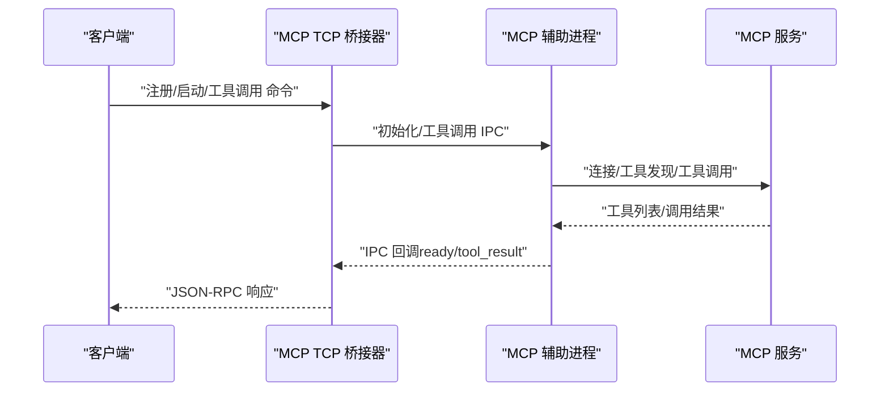
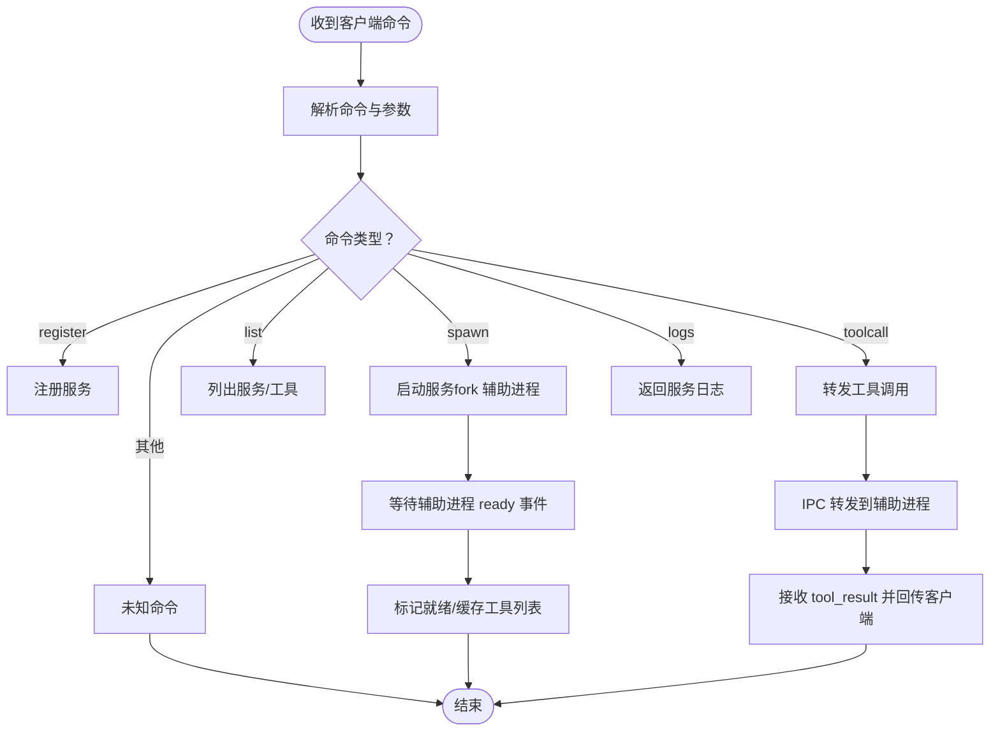
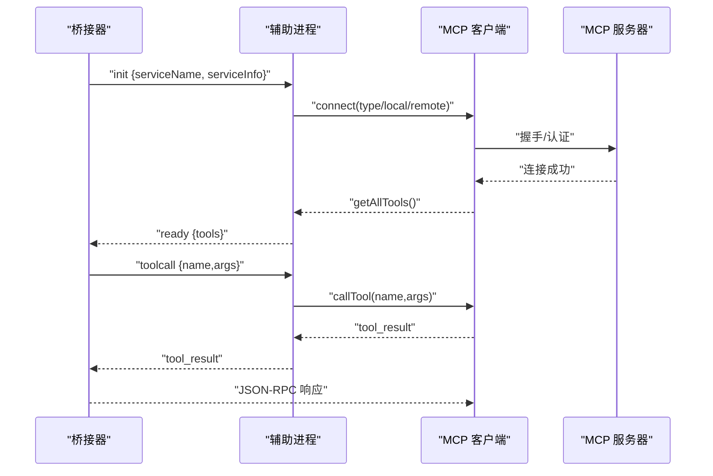
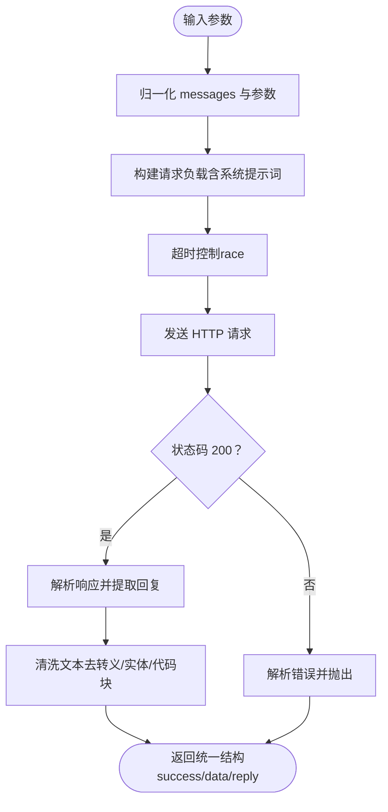
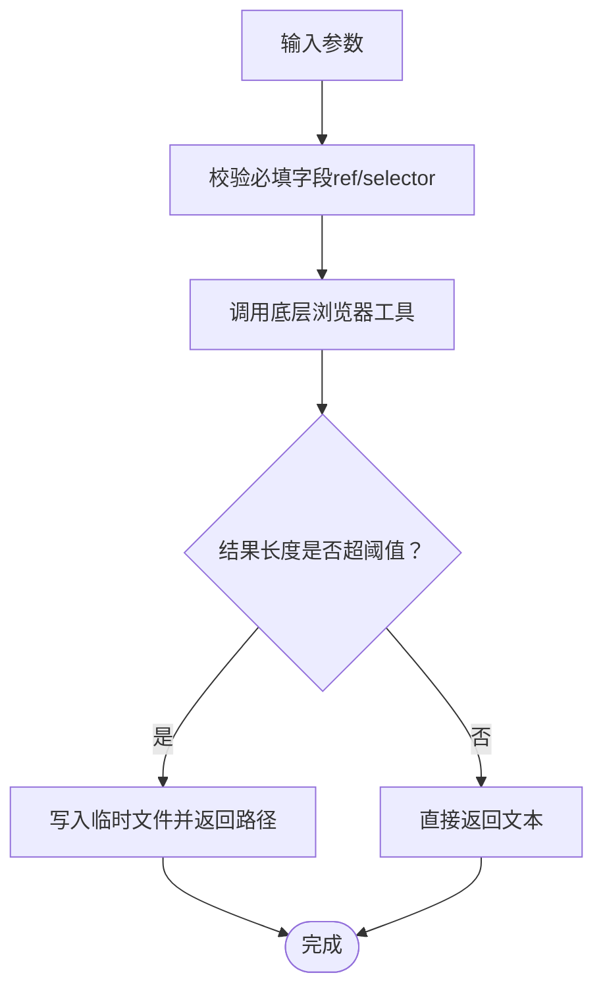
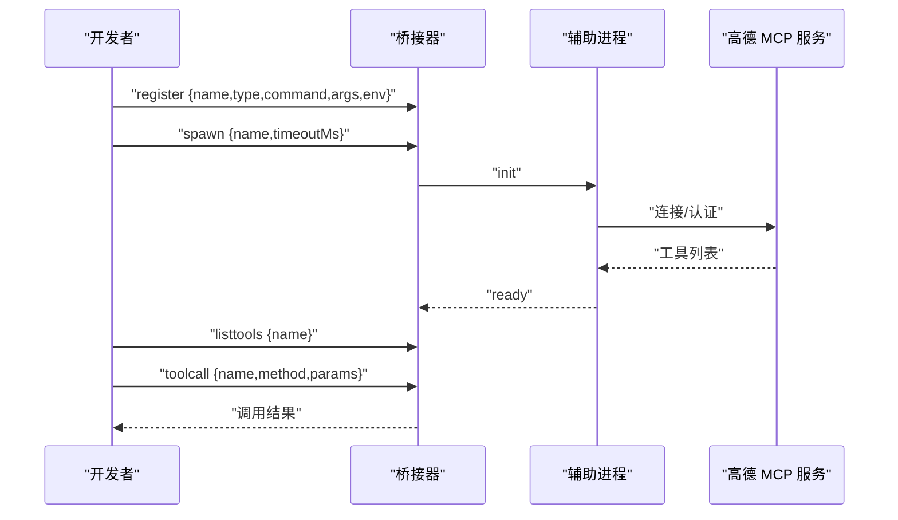

# MCP 集成示例

<cite>
**本文引用的文件**
- [tools/mcp_bridge/index.ts](file://tools/mcp_bridge/index.ts)
- [app/src/main/assets/bridge/spawn-helper.js](file://app/src/main/assets/bridge/spawn-helper.js)
- [examples/ai_chat.ts](file://examples/ai_chat.ts)
- [examples/browser.ts](file://examples/browser.ts)
- [examples/types/toolpkg.d.ts](file://examples/types/toolpkg.d.ts)
- [my_docs/高德 MCP 配置指南.md](file://my_docs/高德 MCP 配置指南.md)
- [app/src/androidTest/js/browser_tool_smoke.js](file://app/src/androidTest/js/browser_tool_smoke.js)
- [app/src/androidTest/js/browser_tool_suite_probe.js](file://app/src/androidTest/js/browser_tool_suite_probe.js)
</cite>

## 目录
1. [简介](#简介)
2. [项目结构](#项目结构)
3. [核心组件](#核心组件)
4. [架构总览](#架构总览)
5. [详细组件分析](#详细组件分析)
6. [依赖关系分析](#依赖关系分析)
7. [性能考虑](#性能考虑)
8. [故障排查指南](#故障排查指南)
9. [结论](#结论)
10. [附录](#附录)

## 简介
本技术文档围绕 Operit 的 MCP（Model Context Protocol）集成示例，提供从服务器搭建、配置管理、客户端连接、工具暴露到第三方 MCP 服务集成的完整实施指南。文档覆盖以下关键主题：
- MCP 桥接器（TCP Bridge）：统一管理本地与远程 MCP 服务，提供工具发现与调用能力。
- 工具包与工具实现：展示如何编写工具包、定义工具接口、参数校验、结果格式化与错误处理。
- 第三方 MCP 服务器集成：以高德地图 MCP 为例，演示注册、启动、工具发现与调用流程。
- MCP 协议调试：消息追踪、日志分析、性能监控与故障排查方法。
- 常见集成场景：与 AI 模型服务、外部工具系统、企业内部系统的对接实践。

## 项目结构
Operit 仓库中与 MCP 相关的关键模块分布如下：
- tools/mcp_bridge：MCP TCP 桥接器，负责与 MCP 服务交互、工具发现与调用、生命周期管理。
- app/src/main/assets/bridge：MCP 客户端辅助程序（spawn-helper），封装 MCP 官方客户端，支持本地 stdio 与远程 HTTP/SSE 连接。
- examples：示例工具包，包含 AI 对话工具与浏览器自动化工具，展示工具包元数据、参数定义与调用流程。
- examples/types/toolpkg.d.ts：工具包类型定义与钩子事件规范，指导工具包开发。
- my_docs/高德 MCP 配置指南.md：第三方 MCP 服务（高德地图）集成示例与步骤说明。
- app/src/androidTest/js：浏览器工具的端到端测试脚本，体现工具调用与结果处理。

```mermaid
graph TB
subgraph "桥接层"
Bridge["MCP TCP 桥接器<br/>tools/mcp_bridge/index.ts"]
Helper["MCP 辅助进程<br/>app/src/main/assets/bridge/spawn-helper.js"]
end
subgraph "工具包层"
AIChat["AI 对话工具包<br/>examples/ai_chat.ts"]
Browser["浏览器自动化工具包<br/>examples/browser.ts"]
ToolTypes["工具包类型定义<br/>examples/types/toolpkg.d.ts"]
end
subgraph "第三方服务"
AMap["高德地图 MCP 服务<br/>示例"]
end
Bridge --> Helper
Bridge <- --> AIChat
Bridge <- --> Browser
Bridge --> AMap
```

图表来源
- [tools/mcp_bridge/index.ts:1-1468](file://tools/mcp_bridge/index.ts#L1-L1468)
- [app/src/main/assets/bridge/spawn-helper.js:1-200](file://app/src/main/assets/bridge/spawn-helper.js#L1-L200)
- [examples/ai_chat.ts:1-459](file://examples/ai_chat.ts#L1-L459)
- [examples/browser.ts:1-510](file://examples/browser.ts#L1-L510)
- [examples/types/toolpkg.d.ts:1-718](file://examples/types/toolpkg.d.ts#L1-L718)

章节来源
- [tools/mcp_bridge/index.ts:1-1468](file://tools/mcp_bridge/index.ts#L1-L1468)
- [app/src/main/assets/bridge/spawn-helper.js:1-200](file://app/src/main/assets/bridge/spawn-helper.js#L1-L200)
- [examples/ai_chat.ts:1-459](file://examples/ai_chat.ts#L1-L459)
- [examples/browser.ts:1-510](file://examples/browser.ts#L1-L510)
- [examples/types/toolpkg.d.ts:1-718](file://examples/types/toolpkg.d.ts#L1-L718)

## 核心组件
- MCP TCP 桥接器（McpBridge）
  - 提供 TCP 接口，接收客户端命令，统一管理本地与远程 MCP 服务。
  - 支持服务注册、启动、关闭、工具列表缓存、工具调用与超时处理。
  - 内置日志采集、错误分类与自动重连机制。
- MCP 辅助进程（spawn-helper）
  - 封装 MCP 官方客户端，支持本地 stdio 与远程 HTTP/SSE 连接。
  - 提供工具发现与工具调用转发，通过 IPC 与桥接器通信。
- 示例工具包
  - AI 对话工具包：封装 HTTP 请求、参数校验、超时保护与结果清洗。
  - 浏览器自动化工具包：提供点击、输入、截图、表单填充等工具，支持大结果落盘。
- 工具包类型定义
  - 规范工具包元数据、参数结构、钩子事件与注册接口，指导工具包开发。

章节来源
- [tools/mcp_bridge/index.ts:84-1441](file://tools/mcp_bridge/index.ts#L84-L1441)
- [app/src/main/assets/bridge/spawn-helper.js:49-192](file://app/src/main/assets/bridge/spawn-helper.js#L49-L192)
- [examples/ai_chat.ts:15-459](file://examples/ai_chat.ts#L15-L459)
- [examples/browser.ts:1-510](file://examples/browser.ts#L1-L510)
- [examples/types/toolpkg.d.ts:1-718](file://examples/types/toolpkg.d.ts#L1-L718)

## 架构总览
下图展示了 MCP 桥接器、辅助进程与工具包之间的交互关系，以及与第三方 MCP 服务的连接方式。



图表来源
- [tools/mcp_bridge/index.ts:507-561](file://tools/mcp_bridge/index.ts#L507-L561)
- [app/src/main/assets/bridge/spawn-helper.js:130-185](file://app/src/main/assets/bridge/spawn-helper.js#L130-L185)

章节来源
- [tools/mcp_bridge/index.ts:507-561](file://tools/mcp_bridge/index.ts#L507-L561)
- [app/src/main/assets/bridge/spawn-helper.js:130-185](file://app/src/main/assets/bridge/spawn-helper.js#L130-L185)

## 详细组件分析

### MCP TCP 桥接器（McpBridge）
- 功能要点
  - TCP 服务器：监听本地端口，解析客户端 JSON-RPC 命令，分发至对应处理逻辑。
  - 服务管理：支持注册本地/远程 MCP 服务，自动启动与重连，闲置回收。
  - 工具管理：缓存工具列表，支持查询与转发工具调用。
  - 错误与日志：记录服务错误、致命错误标记、日志截断与上限控制。
- 关键流程
  - 注册服务：校验参数，写入注册表。
  - 启动服务：fork 辅助进程，等待 ready 事件，更新就绪状态。
  - 工具调用：将请求转发至辅助进程，等待 tool_result 并回传客户端。
  - 超时与清理：定时检查请求与 spawn 超时，清理断开连接与闲置服务。



图表来源
- [tools/mcp_bridge/index.ts:577-1147](file://tools/mcp_bridge/index.ts#L577-L1147)
- [tools/mcp_bridge/index.ts:1246-1273](file://tools/mcp_bridge/index.ts#L1246-L1273)

章节来源
- [tools/mcp_bridge/index.ts:84-1441](file://tools/mcp_bridge/index.ts#L84-L1441)

### MCP 辅助进程（spawn-helper）
- 功能要点
  - 封装 MCP 官方客户端，支持本地 stdio 与远程 HTTP/SSE 连接。
  - 工具发现：连接后拉取工具列表，通过 IPC 通知桥接器。
  - 工具调用：接收桥接器转发的工具调用，调用 MCP 客户端并回传结果。
  - 头部与认证：支持远程连接的 Authorization 与自定义头部。
- 关键流程
  - 初始化：根据服务类型（local/remote）构建连接参数。
  - 连接：建立 MCP 连接，拉取工具列表。
  - 调用：转发工具调用，处理错误并回传。



图表来源
- [app/src/main/assets/bridge/spawn-helper.js:77-146](file://app/src/main/assets/bridge/spawn-helper.js#L77-L146)
- [app/src/main/assets/bridge/spawn-helper.js:148-192](file://app/src/main/assets/bridge/spawn-helper.js#L148-L192)

章节来源
- [app/src/main/assets/bridge/spawn-helper.js:49-192](file://app/src/main/assets/bridge/spawn-helper.js#L49-L192)

### 示例工具包：AI 对话工具
- 元数据与工具定义
  - 工具名称、描述、参数（消息数组/字符串、系统提示词、温度、最大生成长度、超时）。
- 实现要点
  - 参数归一化：支持字符串与对象两种输入，校验 messages 结构。
  - 请求构造：拼接系统提示词与用户消息，设置模型参数与超时。
  - 超时保护：使用 Promise.race 控制整体超时。
  - 结果清洗：去除转义、HTML 实体与代码块，强制非分点输出。
  - 错误处理：捕获网络错误与 API 异常，统一返回结构。



图表来源
- [examples/ai_chat.ts:217-370](file://examples/ai_chat.ts#L217-L370)
- [examples/ai_chat.ts:372-450](file://examples/ai_chat.ts#L372-L450)

章节来源
- [examples/ai_chat.ts:15-459](file://examples/ai_chat.ts#L15-L459)

### 示例工具包：浏览器自动化工具
- 工具清单
  - 点击、关闭、控制台消息、拖拽、执行脚本、文件上传、表单填充、对话框处理、悬停、导航、后退、网络请求、按键、窗口尺寸、运行代码、选项选择、截图、输入、等待、标签页管理。
- 实现要点
  - 参数标准化：对 ref/selector 等进行必填校验与裁剪。
  - 大结果落盘：超过阈值时将结果写入临时文件，返回文件路径。
  - 统一导出：将工具函数导出为 CommonJS 接口。



图表来源
- [examples/browser.ts:381-410](file://examples/browser.ts#L381-L410)
- [examples/browser.ts:331-344](file://examples/browser.ts#L331-L344)

章节来源
- [examples/browser.ts:1-510](file://examples/browser.ts#L1-L510)

### 第三方 MCP 服务器集成（以高德地图为例）
- 步骤概览
  - 注册服务：通过 register 命令注册本地/远程 MCP 服务，设置命令、参数、环境变量与描述。
  - 启动服务：通过 spawn 命令启动服务，支持超时配置。
  - 工具发现：通过 listtools 查询工具列表。
  - 工具调用：通过 toolcall 调用具体工具，传入参数。
- 配置示例
  - 环境变量：AMAP_API_KEY、AMAP_API_BASE_URL。
  - 远程连接：支持 HTTP/SSE，可配置 Authorization 与自定义头部。



图表来源
- [my_docs/高德 MCP 配置指南.md:20-86](file://my_docs/高德 MCP 配置指南.md#L20-L86)
- [tools/mcp_bridge/index.ts:931-1039](file://tools/mcp_bridge/index.ts#L931-L1039)

章节来源
- [my_docs/高德 MCP 配置指南.md:1-96](file://my_docs/高德 MCP 配置指南.md#L1-L96)
- [tools/mcp_bridge/index.ts:931-1039](file://tools/mcp_bridge/index.ts#L931-L1039)

### MCP 工具开发示例（接口、参数、结果、错误）
- 接口定义
  - 工具包元数据：名称、显示名、描述、类别、工具列表（名称、描述、参数）。
  - 类型定义：参数结构、返回结构、钩子事件与注册接口。
- 参数处理
  - 必填校验、类型转换、默认值设置、长度与格式限制。
- 结果格式化
  - 统一 success/message/data 结构，必要时进行文本清洗与大结果落盘。
- 错误处理
  - 捕获异常、记录堆栈、返回标准错误结构，避免泄露敏感信息。

章节来源
- [examples/types/toolpkg.d.ts:1-718](file://examples/types/toolpkg.d.ts#L1-L718)
- [examples/ai_chat.ts:400-412](file://examples/ai_chat.ts#L400-L412)
- [examples/browser.ts:331-344](file://examples/browser.ts#L331-L344)

## 依赖关系分析
- 组件耦合
  - 桥接器与辅助进程通过 IPC 通信，职责清晰：桥接器负责网络与状态管理，辅助进程负责 MCP 协议细节。
  - 工具包与桥接器松耦合：通过工具名与参数约定进行调用，便于扩展新工具包。
- 外部依赖
  - MCP 官方客户端库（在辅助进程中使用）。
  - 第三方 MCP 服务（如高德地图 MCP）。
- 潜在循环依赖
  - 当前结构未见循环依赖，桥接器与辅助进程为单向通信。

```mermaid
graph LR
Bridge["McpBridge"] --> Helper["spawn-helper"]
Bridge <- --> AIChat["AI 对话工具包"]
Bridge <- --> Browser["浏览器工具包"]
Helper --> MCPClient["MCP 客户端库"]
Bridge --> AMap["高德 MCP 服务"]
```

图表来源
- [tools/mcp_bridge/index.ts:84-1441](file://tools/mcp_bridge/index.ts#L84-L1441)
- [app/src/main/assets/bridge/spawn-helper.js:49-192](file://app/src/main/assets/bridge/spawn-helper.js#L49-L192)

章节来源
- [tools/mcp_bridge/index.ts:84-1441](file://tools/mcp_bridge/index.ts#L84-L1441)
- [app/src/main/assets/bridge/spawn-helper.js:49-192](file://app/src/main/assets/bridge/spawn-helper.js#L49-L192)

## 性能考虑
- 连接与重连
  - 指数退避重连策略，避免频繁重启造成抖动。
  - 闲置服务定期回收，降低资源占用。
- 超时控制
  - 请求超时与 spawn 超时分离，防止长时间阻塞。
  - 工具调用超时采用 race 模式，保证响应及时性。
- 日志与监控
  - 服务日志截断与上限控制，避免内存膨胀。
  - 可通过 logs 命令获取服务状态与最近错误，辅助定位问题。

章节来源
- [tools/mcp_bridge/index.ts:175-188](file://tools/mcp_bridge/index.ts#L175-L188)
- [tools/mcp_bridge/index.ts:237-240](file://tools/mcp_bridge/index.ts#L237-L240)
- [tools/mcp_bridge/index.ts:1136-1147](file://tools/mcp_bridge/index.ts#L1136-L1147)

## 故障排查指南
- 常见问题与定位
  - 服务启动失败：查看 logs 命令返回的 lastError 与日志内容，确认致命错误（如缺少 API Key）。
  - 工具调用超时：检查 REQUEST_TIMEOUT 与工具本身耗时，适当增加超时或优化工具实现。
  - 连接中断：观察自动重连次数与间隔，确认网络稳定性与服务端可达性。
- 调试建议
  - 启用详细日志：通过服务日志与桥接器日志交叉比对。
  - 分阶段验证：先注册与启动，再 listtools，最后 toolcall。
  - 端到端测试：使用浏览器工具测试脚本验证工具链路。

章节来源
- [tools/mcp_bridge/index.ts:583-611](file://tools/mcp_bridge/index.ts#L583-L611)
- [tools/mcp_bridge/index.ts:1246-1273](file://tools/mcp_bridge/index.ts#L1246-L1273)
- [app/src/androidTest/js/browser_tool_smoke.js:34-146](file://app/src/androidTest/js/browser_tool_smoke.js#L34-L146)
- [app/src/androidTest/js/browser_tool_suite_probe.js:80-87](file://app/src/androidTest/js/browser_tool_suite_probe.js#L80-L87)

## 结论
Operit 的 MCP 集成方案通过 TCP 桥接器与辅助进程实现了对本地与远程 MCP 服务的统一接入，配合示例工具包与类型定义，能够快速扩展各类工具与第三方服务。借助完善的日志、超时与重连机制，系统具备良好的稳定性与可观测性。建议在生产环境中结合业务需求，完善配置管理、安全认证与性能监控体系。

## 附录
- 环境准备
  - Node.js 运行时（用于 MCP 服务与桥接器）。
  - Android 设备或模拟器（用于浏览器工具包测试）。
- 配置步骤
  - 注册 MCP 服务：使用 register 命令配置服务类型、命令、参数与环境变量。
  - 启动 MCP 服务：使用 spawn 命令启动并等待 ready。
  - 工具发现与调用：使用 listtools 与 toolcall 验证工具链路。
- 测试验证
  - 使用浏览器工具测试脚本进行端到端验证。
  - 对 AI 对话工具进行超时与错误场景测试。
- 上线部署
  - 将桥接器作为系统服务运行，配置开机自启与健康检查。
  - 对第三方 MCP 服务启用认证与访问控制，确保网络安全。

章节来源
- [my_docs/高德 MCP 配置指南.md:18-96](file://my_docs/高德 MCP 配置指南.md#L18-L96)
- [app/src/androidTest/js/browser_tool_smoke.js:34-146](file://app/src/androidTest/js/browser_tool_smoke.js#L34-L146)
- [examples/ai_chat.ts:418-433](file://examples/ai_chat.ts#L418-L433)