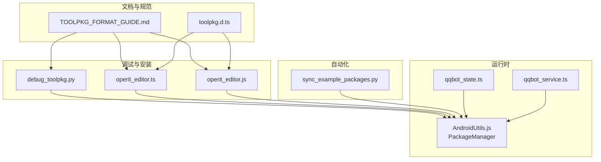
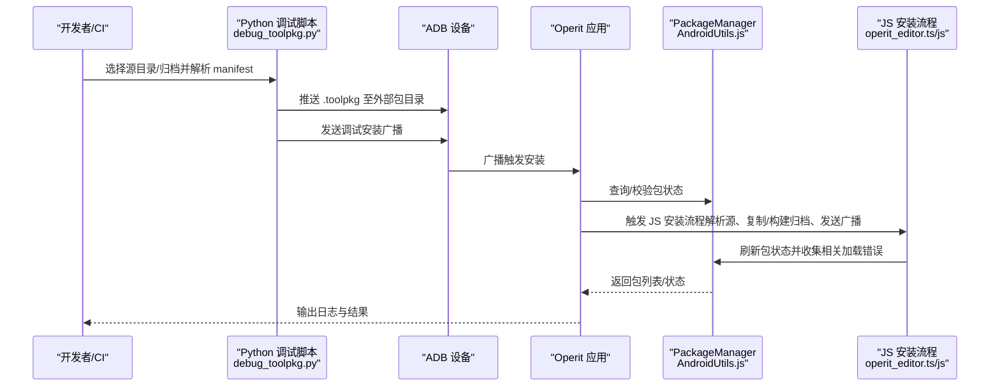
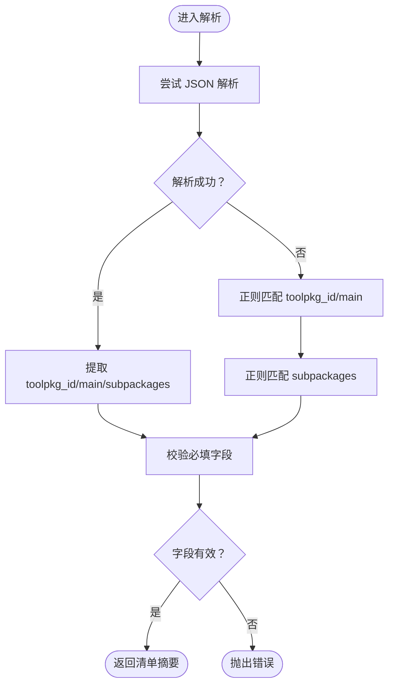
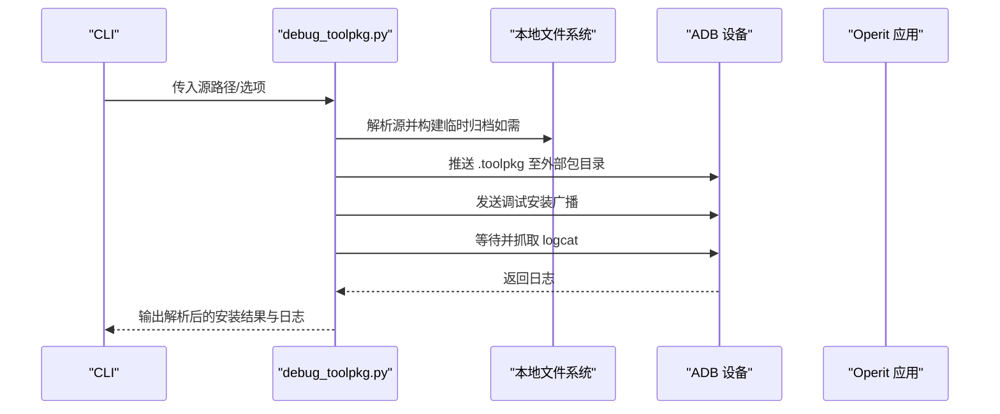
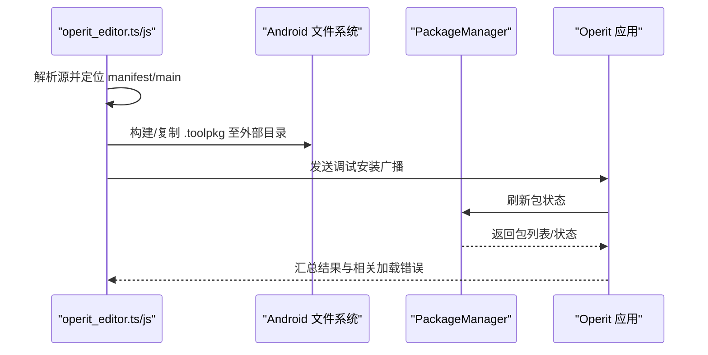
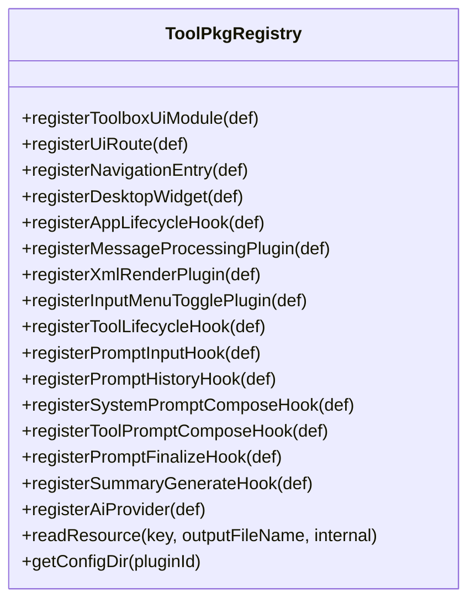
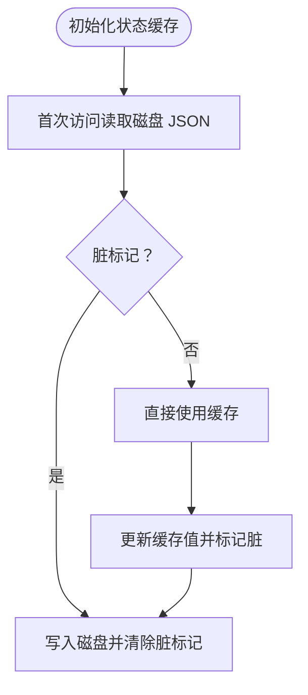
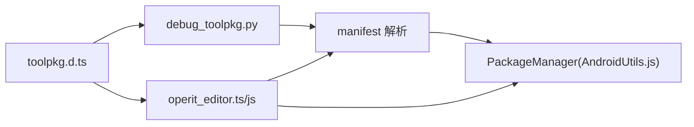

# 包管理机制

<cite>
**本文引用的文件**
- [TOOLPKG_FORMAT_GUIDE.md](file://docs/TOOLPKG_FORMAT_GUIDE.md)
- [toolpkg.d.ts](file://examples/types/toolpkg.d.ts)
- [debug_toolpkg.py](file://tools/debug_toolpkg.py)
- [operit_editor.ts](file://examples/operit_editor.ts)
- [operit_editor.js](file://app/src/main/assets/packages/operit_editor.js)
- [AndroidUtils.js](file://app/src/main/assets/js/AndroidUtils.js)
- [qqbot_service.ts](file://examples/qqbot/src/shared/qqbot_service.ts)
- [qqbot_state.ts](file://examples/qqbot/src/shared/qqbot_state.ts)
- [sync_example_packages.py](file://sync_example_packages.py)
</cite>

## 目录
1. [简介](#简介)
2. [项目结构](#项目结构)
3. [核心组件](#核心组件)
4. [架构总览](#架构总览)
5. [详细组件分析](#详细组件分析)
6. [依赖分析](#依赖分析)
7. [性能考虑](#性能考虑)
8. [故障排查指南](#故障排查指南)
9. [结论](#结论)
10. [附录](#附录)

## 简介
本文件系统化阐述 Operit 的包管理机制，聚焦于 ToolPkg（.toolpkg）包的发现、加载、注册、卸载全流程，解析 .toolpkg 文件结构与 manifest.json/manifest.hjson 的解析策略，梳理包状态管理（可用包列表、已启用包集合、活动包状态跟踪），总结缓存策略（缓存目录管理、清理机制、一致性保障），并提供包管理 API 使用指南（编程接口、回调机制、错误处理）、调试工具（状态查询、加载日志、性能监控），以及面向系统管理员的维护指导（批量操作、版本升级、故障排除、安全审计）。

## 项目结构
Operit 的包管理围绕 ToolPkg 格式展开，核心由以下部分组成：
- 文档与规范：ToolPkg 格式说明与开发指南，定义 manifest 字段、文件结构、注册项与资源模型。
- 类型与契约：TypeScript 类型定义，约束包注册 API、事件钩子、生命周期回调等。
- 调试与安装：Python 调试脚本与 JS 安装流程，负责解析 manifest、构建/推送 .toolpkg、触发安装广播、刷新包状态。
- 运行时工具：AndroidUtils.js 中的 PackageManager 类，提供包列表、安装状态检查等基础能力。
- 状态与缓存：示例包（QQBot）的状态缓存与刷新模式，体现包状态持久化与一致性保障思路。
- 自动化与同步：同步脚本，批量打包与热更新策略。

**图表来源**
- [TOOLPKG_FORMAT_GUIDE.md:1-1241](file://docs/TOOLPKG_FORMAT_GUIDE.md#L1-L1241)
- [toolpkg.d.ts:655-718](file://examples/types/toolpkg.d.ts#L655-L718)
- [debug_toolpkg.py:1-394](file://tools/debug_toolpkg.py#L1-L394)
- [operit_editor.ts:2379-2776](file://examples/operit_editor.ts#L2379-L2776)
- [operit_editor.js:2581-2720](file://app/src/main/assets/packages/operit_editor.js#L2581-L2720)
- [AndroidUtils.js:391-575](file://app/src/main/assets/js/AndroidUtils.js#L391-L575)
- [qqbot_state.ts:54-89](file://examples/qqbot/src/shared/qqbot_state.ts#L54-L89)
- [qqbot_service.ts:393-442](file://examples/qqbot/src/shared/qqbot_service.ts#L393-L442)
- [sync_example_packages.py:538-667](file://sync_example_packages.py#L538-L667)

**章节来源**
- [TOOLPKG_FORMAT_GUIDE.md:1-1241](file://docs/TOOLPKG_FORMAT_GUIDE.md#L1-L1241)
- [toolpkg.d.ts:655-718](file://examples/types/toolpkg.d.ts#L655-L718)
- [debug_toolpkg.py:1-394](file://tools/debug_toolpkg.py#L1-L394)
- [operit_editor.ts:2379-2776](file://examples/operit_editor.ts#L2379-L2776)
- [operit_editor.js:2581-2720](file://app/src/main/assets/packages/operit_editor.js#L2581-L2720)
- [AndroidUtils.js:391-575](file://app/src/main/assets/js/AndroidUtils.js#L391-L575)
- [qqbot_state.ts:54-89](file://examples/qqbot/src/shared/qqbot_state.ts#L54-L89)
- [qqbot_service.ts:393-442](file://examples/qqbot/src/shared/qqbot_service.ts#L393-L442)
- [sync_example_packages.py:538-667](file://sync_example_packages.py#L538-L667)

## 核心组件
- ToolPkg 规范与清单：定义 schema_version、toolpkg_id、version、author、main、display_name、description、subpackages、resources、workflow_templates、workspace_templates 等字段，支持 manifest.json 与 manifest.hjson。
- 注册 API 与事件钩子：通过 ToolPkg.Registry 提供的注册函数（如 registerToolboxUiModule、registerUiRoute、registerNavigationEntry、registerDesktopWidget、registerAppLifecycleHook、registerMessageProcessingPlugin、registerXmlRenderPlugin、registerInputMenuTogglePlugin、registerToolLifecycleHook、registerPromptHooks、registerSummaryGenerateHook、registerAiProvider 等）声明 UI 模块、导航入口、桌面小部件、生命周期钩子、消息处理插件、XML 渲染插件、输入菜单开关插件、工具生命周期钩子、提示词钩子、摘要生成钩子与 AI Provider。
- 调试与安装流程：Python 脚本解析 manifest、构建 .toolpkg、推送设备、发送调试安装广播、等待日志输出；JS 流程解析源、构建/复制 .toolpkg 到沙箱外部目录、发送广播、刷新包状态并收集相关加载错误。
- 运行时包管理：PackageManager 提供包列表、安装状态检查等基础能力；示例包状态缓存与刷新体现包状态持久化与一致性保障。
- 自动化与同步：同步脚本扫描 examples 目录，按清单打包为 .toolpkg 并输出到应用资产目录，支持删除多余包、仅打包白名单附加包等。

**章节来源**
- [TOOLPKG_FORMAT_GUIDE.md:59-541](file://docs/TOOLPKG_FORMAT_GUIDE.md#L59-L541)
- [toolpkg.d.ts:655-718](file://examples/types/toolpkg.d.ts#L655-L718)
- [debug_toolpkg.py:75-172](file://tools/debug_toolpkg.py#L75-L172)
- [operit_editor.ts:2453-2509](file://examples/operit_editor.ts#L2453-L2509)
- [AndroidUtils.js:538-575](file://app/src/main/assets/js/AndroidUtils.js#L538-L575)
- [qqbot_state.ts:54-89](file://examples/qqbot/src/shared/qqbot_state.ts#L54-L89)
- [sync_example_packages.py:581-610](file://sync_example_packages.py#L581-L610)

## 架构总览
下图展示包管理从“发现/解析 manifest”到“安装/注册/激活”的整体流程，以及调试工具与运行时包管理的交互。

**图表来源**
- [debug_toolpkg.py:256-318](file://tools/debug_toolpkg.py#L256-L318)
- [operit_editor.ts:2762-2776](file://examples/operit_editor.ts#L2762-L2776)
- [operit_editor.js:2633-2642](file://app/src/main/assets/packages/operit_editor.js#L2633-L2642)
- [AndroidUtils.js:538-575](file://app/src/main/assets/js/AndroidUtils.js#L538-L575)

## 详细组件分析

### 组件 A：ToolPkg 清单解析与验证
- 解析策略
  - 优先尝试 JSON 解析；若失败则回退正则匹配 toolpkg_id、main、subpackages 等字段。
  - 支持 manifest.json 与 manifest.hjson，兼容宽松语法。
- 关键字段
  - toolpkg_id、main、subpackages、resources、workflow_templates、workspace_templates 等。
- 错误处理
  - 缺少必要字段时抛出明确错误；manifest.main 指向的文件不存在时报错。
- 复杂度
  - 解析复杂度 O(n)，n 为 manifest 文本长度；subpackages 正则遍历为 O(m)，m 为匹配次数。

**图表来源**
- [debug_toolpkg.py:75-104](file://tools/debug_toolpkg.py#L75-L104)
- [operit_editor.ts:2382-2437](file://examples/operit_editor.ts#L2382-L2437)

**章节来源**
- [debug_toolpkg.py:75-172](file://tools/debug_toolpkg.py#L75-L172)
- [operit_editor.ts:2382-2437](file://examples/operit_editor.ts#L2382-L2437)
- [TOOLPKG_FORMAT_GUIDE.md:59-135](file://docs/TOOLPKG_FORMAT_GUIDE.md#L59-L135)

### 组件 B：包发现与安装流程（Python 调试脚本）
- 功能要点
  - 解析源（文件夹/清单/归档），构建临时归档或复用现有 .toolpkg。
  - 推送至设备外部包目录，发送调试安装广播，等待日志输出。
  - 支持设备选择、日志等待秒数配置、是否重置子包状态。
- 关键路径
  - resolve_source → build_temp_archive → install_toolpkg → adb broadcast → logcat 输出。
- 错误处理
  - 设备检测失败、路径不存在、manifest 缺失、main 文件缺失、归档缺失等均抛出 ToolPkgDebugError。

**图表来源**
- [debug_toolpkg.py:138-172](file://tools/debug_toolpkg.py#L138-L172)
- [debug_toolpkg.py:256-318](file://tools/debug_toolpkg.py#L256-L318)

**章节来源**
- [debug_toolpkg.py:138-172](file://tools/debug_toolpkg.py#L138-L172)
- [debug_toolpkg.py:256-318](file://tools/debug_toolpkg.py#L256-L318)

### 组件 C：包发现与安装流程（JS 安装流程）
- 功能要点
  - 解析源（文件夹/清单/归档），必要时解压到临时目录。
  - 将归档复制到沙箱外部包目录，发送调试安装广播。
  - 刷新包状态，收集相关加载错误，汇总日志与结果。
- 关键路径
  - resolve_toolpkg_source → build_toolpkg_archive_from_folder → 复制/构建归档 → sendBroadcast → refresh_sandbox_packages_until。
- 错误处理
  - 源路径不存在、manifest 缺失、main 文件缺失、归档复制失败、包未出现等均记录日志并返回错误。

**图表来源**
- [operit_editor.ts:2453-2509](file://examples/operit_editor.ts#L2453-L2509)
- [operit_editor.ts:2762-2776](file://examples/operit_editor.ts#L2762-L2776)
- [operit_editor.js:2581-2720](file://app/src/main/assets/packages/operit_editor.js#L2581-L2720)

**章节来源**
- [operit_editor.ts:2453-2509](file://examples/operit_editor.ts#L2453-L2509)
- [operit_editor.ts:2762-2776](file://examples/operit_editor.ts#L2762-L2776)
- [operit_editor.js:2581-2720](file://app/src/main/assets/packages/operit_editor.js#L2581-L2720)

### 组件 D：包注册 API 与事件钩子
- 注册 API
  - UI 模块：registerToolboxUiModule、registerUiRoute、registerNavigationEntry、registerDesktopWidget。
  - 生命周期：registerAppLifecycleHook。
  - 插件：registerMessageProcessingPlugin、registerXmlRenderPlugin、registerInputMenuTogglePlugin。
  - 工具链：registerToolLifecycleHook、registerPromptInputHook、registerPromptHistoryHook、registerSystemPromptComposeHook、registerToolPromptComposeHook、registerPromptFinalizeHook、registerSummaryGenerateHook。
  - AI Provider：registerAiProvider（含 listModels/sendMessage/testConnection/calculateInputTokens）。
- 事件钩子
  - AppLifecycleEvent、MessageProcessing、XmlRender、InputMenuToggle、ToolLifecycle、Prompt 系列、SummaryGenerate 等。
- 类型约束
  - 通过 toolpkg.d.ts 的 ToolPkg.Registry 与各类注册接口定义，确保参数与返回值结构一致。

**图表来源**
- [toolpkg.d.ts:655-676](file://examples/types/toolpkg.d.ts#L655-L676)

**章节来源**
- [toolpkg.d.ts:655-718](file://examples/types/toolpkg.d.ts#L655-L718)

### 组件 E：包状态管理与缓存策略
- 可用包列表与已启用包集合
  - 通过 PackageManager.getList 与 isInstalled 获取包列表与安装状态，作为可用包列表的基础。
  - 已启用包集合可通过 manifest 默认启用状态与用户配置共同决定。
- 活动包状态跟踪
  - 示例包（QQBot）采用缓存 JSON Store 的方式，延迟加载、标记脏写入，确保状态一致性与性能。
- 缓存目录管理与清理
  - 外部包目录（如 /sdcard/Android/data/<package>/files/packages）用于存放 .toolpkg 归档。
  - 清理机制：删除重复文件、临时归档、过期缓存；一致性保障：刷新包状态后比对包条目存在性与内置标志位。
- 性能监控
  - 通过日志与状态刷新等待时间（如等待日志输出）评估安装耗时与稳定性。

**图表来源**
- [qqbot_state.ts:54-89](file://examples/qqbot/src/shared/qqbot_state.ts#L54-L89)

**章节来源**
- [AndroidUtils.js:538-575](file://app/src/main/assets/js/AndroidUtils.js#L538-L575)
- [qqbot_state.ts:54-89](file://examples/qqbot/src/shared/qqbot_state.ts#L54-L89)
- [qqbot_service.ts:393-442](file://examples/qqbot/src/shared/qqbot_service.ts#L393-L442)
- [operit_editor.ts:2762-2776](file://examples/operit_editor.ts#L2762-L2776)

### 组件 F：包管理 API 使用指南
- 编程接口
  - Python 调试脚本：解析 manifest、构建归档、推送设备、发送广播、抓取日志。
  - JS 安装流程：解析源、复制/构建归档、发送广播、刷新包状态、收集相关加载错误。
- 回调机制
  - 广播动作与组件：ACTION_DEBUG_INSTALL_TOOLPKG 与接收组件，用于触发安装流程。
  - 状态刷新：refresh_sandbox_packages_until，等待包出现在包列表中。
- 错误处理
  - 路径不存在、manifest 缺失、main 文件缺失、归档缺失、包未出现等均记录日志并返回错误。

**章节来源**
- [debug_toolpkg.py:256-318](file://tools/debug_toolpkg.py#L256-L318)
- [operit_editor.ts:2762-2776](file://examples/operit_editor.ts#L2762-L2776)
- [operit_editor.js:2633-2642](file://app/src/main/assets/packages/operit_editor.js#L2633-L2642)

### 组件 G：包管理调试工具
- 包状态查询
  - 通过 PackageManager.getList 与 isInstalled 获取包列表与安装状态。
  - 通过 QQBot 状态缓存读取/写入，结合 flushCachedJsonStoreAsync 刷新磁盘。
- 加载日志
  - Python 调试脚本抓取 logcat 标签（ToolPkgDebugInstallReceiver、ToolPkg、PackageManager）。
  - JS 安装流程记录步骤日志与最终 payload。
- 性能监控
  - 设置等待日志输出秒数（如 OPERIT_LOG_WAIT_SECONDS），评估安装耗时。

**章节来源**
- [AndroidUtils.js:538-575](file://app/src/main/assets/js/AndroidUtils.js#L538-L575)
- [qqbot_state.ts:82-89](file://examples/qqbot/src/shared/qqbot_state.ts#L82-L89)
- [debug_toolpkg.py:342-350](file://tools/debug_toolpkg.py#L342-L350)
- [operit_editor.ts:2707-2717](file://examples/operit_editor.ts#L2707-L2717)

### 组件 H：系统管理员维护指导
- 批量操作
  - 使用 sync_example_packages.py 批量打包 examples 下的包，支持白名单、附加包、仅查看、删除多余包等。
- 版本升级
  - 更新 manifest.json 中的 version 字段，重新打包 .toolpkg 并推送至外部包目录，触发安装广播。
- 故障排除
  - 检查 manifest 必填字段、main 文件是否存在、归档是否包含 manifest.json/hjson、设备是否授权。
  - 通过日志抓取与状态刷新等待时间定位问题。
- 安全审计
  - 审核 manifest.author、resources、workflow_templates、workspace_templates 等字段，确保来源可信与合规。

**章节来源**
- [sync_example_packages.py:581-610](file://sync_example_packages.py#L581-L610)
- [TOOLPKG_FORMAT_GUIDE.md:59-135](file://docs/TOOLPKG_FORMAT_GUIDE.md#L59-L135)

## 依赖分析
- 组件耦合
  - Python 调试脚本与 JS 安装流程共享 manifest 解析与 .toolpkg 构建逻辑。
  - 运行时包管理（PackageManager）为安装流程提供状态查询与安装状态检查。
  - 类型定义（toolpkg.d.ts）约束注册 API，确保前后端契约一致。
- 外部依赖
  - ADB 设备用于推送与广播；日志抓取用于调试。
  - 文件系统用于 .toolpkg 的构建、复制与外部目录管理。

**图表来源**
- [debug_toolpkg.py:75-172](file://tools/debug_toolpkg.py#L75-L172)
- [operit_editor.ts:2453-2509](file://examples/operit_editor.ts#L2453-L2509)
- [AndroidUtils.js:538-575](file://app/src/main/assets/js/AndroidUtils.js#L538-L575)
- [toolpkg.d.ts:655-718](file://examples/types/toolpkg.d.ts#L655-L718)

**章节来源**
- [debug_toolpkg.py:75-172](file://tools/debug_toolpkg.py#L75-L172)
- [operit_editor.ts:2453-2509](file://examples/operit_editor.ts#L2453-L2509)
- [AndroidUtils.js:538-575](file://app/src/main/assets/js/AndroidUtils.js#L538-L575)
- [toolpkg.d.ts:655-718](file://examples/types/toolpkg.d.ts#L655-L718)

## 性能考虑
- 解析性能
  - JSON 解析优于正则匹配，应优先使用 manifest.json；正则匹配 subpackages 时注意避免过度回溯。
- I/O 优化
  - 复制/构建 .toolpkg 时尽量避免重复写入，优先复用现有归档；临时目录清理及时。
- 状态刷新
  - 设置合理的等待时间（如 OPERIT_LOG_WAIT_SECONDS），平衡调试体验与等待成本。
- 缓存策略
  - 使用缓存 JSON Store 延迟加载与脏写入，减少频繁磁盘 IO；刷新后及时清理过期缓存。

[本节为通用指导，无需具体文件分析]

## 故障排查指南
- 常见问题
  - manifest 缺失或字段不合法：检查 manifest.json/hjson 与必填字段。
  - main 文件不存在：确认 manifest.main 指向的文件存在且可访问。
  - 设备未授权：确保 ADB 设备在线且具备权限。
  - 包未出现：检查广播动作与组件、等待时间设置、日志输出。
- 调试手段
  - 抓取 logcat 标签（ToolPkgDebugInstallReceiver、ToolPkg、PackageManager）。
  - 使用 JS 安装流程的日志记录与 payload 汇总定位问题。
  - 通过 PackageManager.getList 与 isInstalled 核对包状态。

**章节来源**
- [debug_toolpkg.py:358-361](file://tools/debug_toolpkg.py#L358-L361)
- [operit_editor.ts:2762-2776](file://examples/operit_editor.ts#L2762-L2776)
- [AndroidUtils.js:538-575](file://app/src/main/assets/js/AndroidUtils.js#L538-L575)

## 结论
Operit 的包管理机制以 ToolPkg 为核心，通过规范的清单文件与严格的解析策略，配合调试脚本与 JS 安装流程，实现了从包发现、加载、注册到卸载的闭环。运行时包管理与状态缓存策略保障了包状态的一致性与性能。系统管理员可通过自动化脚本与调试工具高效完成批量操作、版本升级与故障排除。

[本节为总结，无需具体文件分析]

## 附录
- 相关文件
  - ToolPkg 格式说明与开发指南：docs/TOOLPKG_FORMAT_GUIDE.md
  - 包注册 API 类型定义：examples/types/toolpkg.d.ts
  - Python 调试脚本：tools/debug_toolpkg.py
  - JS 安装流程（TS/JS）：examples/operit_editor.ts、app/src/main/assets/packages/operit_editor.js
  - 运行时包管理：app/src/main/assets/js/AndroidUtils.js
  - 状态缓存与刷新：examples/qqbot/src/shared/qqbot_state.ts、examples/qqbot/src/shared/qqbot_service.ts
  - 自动化与同步：sync_example_packages.py

[本节为概览，无需具体文件分析]