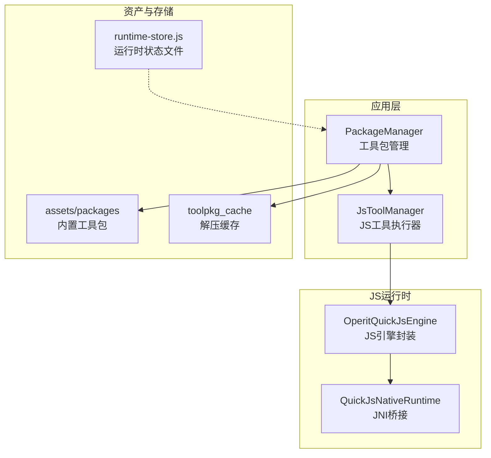
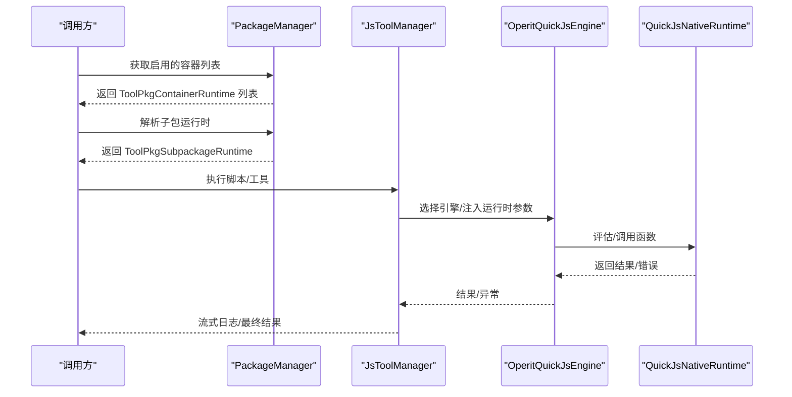
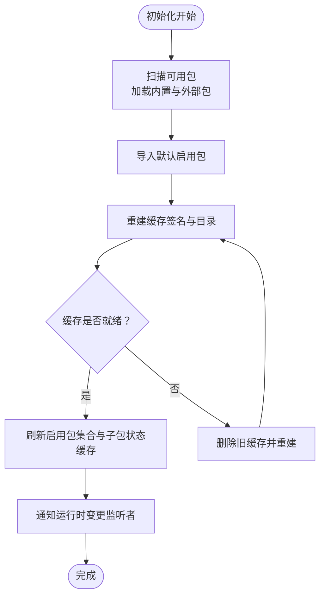
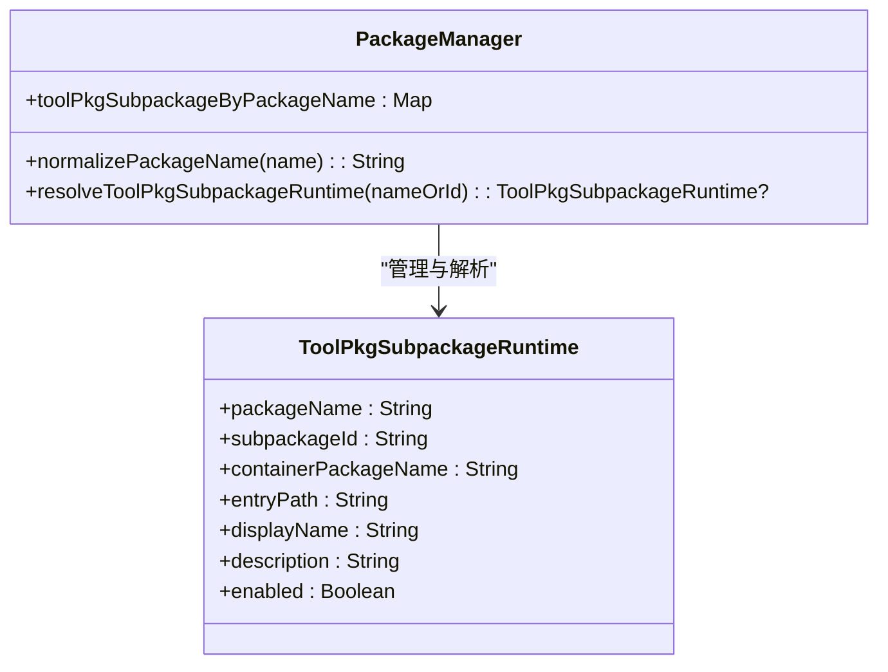
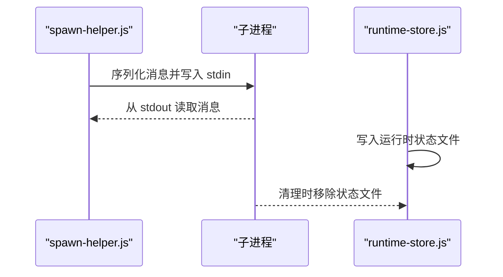
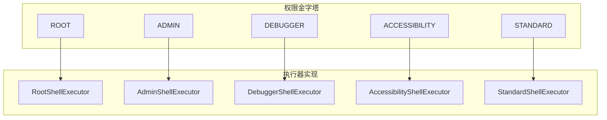
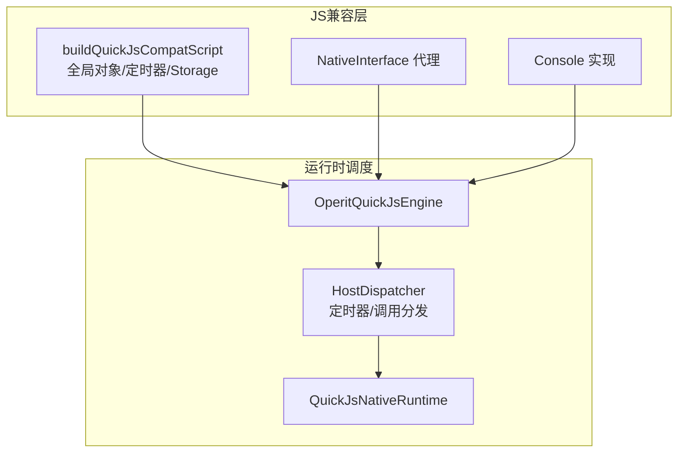
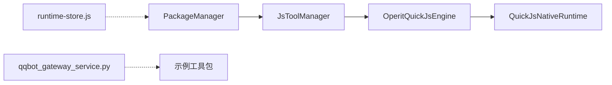

# 工具包容器设计

<cite>
**本文引用的文件**
- [PackageManager.kt](file://app/src/main/java/com/ai/assistance/operit/core/tools/packTool/PackageManager.kt)
- [JsToolManager.kt](file://app/src/main/java/com/ai/assistance/operit/core/tools/javascript/JsToolManager.kt)
- [OperitQuickJsEngine.kt](file://quickjs/src/main/java/com/ai/assistance/operit/core/tools/javascript/OperitQuickJsEngine.kt)
- [QuickJsNativeRuntime.kt](file://quickjs/src/main/java/com/ai/assistance/operit/core/tools/javascript/QuickJsNativeRuntime.kt)
- [spawn-helper.js](file://app/src/main/assets/bridge/spawn-helper.js)
- [operit_editor.js](file://app/src/main/assets/packages/operit_editor.js)
- [operit_editor.ts](file://examples/operit_editor.ts)
- [runtime-store.js](file://examples/windows_control/resources/pc_agent/operit-pc-agent/src/stores/runtime-store.js)
- [qqbot_gateway_service.py](file://examples/qqbot/resources/qqbot_gateway_service.py)
- [Operit 沙箱执行系统设计思想与详细流程分析.md](file://my_docs/Operit 沙箱执行系统设计思想与详细流程分析.md)
- [Operit 安全机制设计思想与详细流程分析.md](file://my_docs/Operit 安全机制设计思想与详细流程分析.md)
- [quickjs模块软件架构与业务流程.md](file://my_docs/quickjs模块软件架构与业务流程.md)
</cite>

## 目录
1. [简介](#简介)
2. [项目结构](#项目结构)
3. [核心组件](#核心组件)
4. [架构总览](#架构总览)
5. [详细组件分析](#详细组件分析)
6. [依赖关系分析](#依赖关系分析)
7. [性能考虑](#性能考虑)
8. [故障排查指南](#故障排查指南)
9. [结论](#结论)
10. [附录](#附录)

## 简介
本文件面向系统架构师与高级开发者，系统性阐述 Operit 工具包容器的设计与实现，重点覆盖以下方面：
- ToolPkgContainerRuntime 的容器化架构：容器隔离、资源管理、生命周期控制、状态同步
- ToolPkgSubpackageRuntime 的子包运行时：子包标识、作用域管理、资源共享、依赖关系处理
- 容器间通信机制：进程间通信、消息传递、事件广播、状态共享
- 安全隔离：沙箱环境、权限控制、资源限制、攻击防护
- 性能优化：内存管理、CPU 调度、I/O 优化、并发控制
- 监控与调试：状态监控、性能指标、日志收集、错误追踪

## 项目结构
Operit 将“工具包”（ToolPkg）作为可插拔的功能单元，通过 PackageManager 统一加载、注册与运行。JavaScript 子包通过 JsEngine 提供沙箱执行能力；跨语言桥接由 QuickJS 与原生 JNI 层支撑；运行时状态持久化与事件队列在示例工程中体现。

图表来源
- [PackageManager.kt:575-641](file://app/src/main/java/com/ai/assistance/operit/core/tools/packTool/PackageManager.kt#L575-L641)
- [JsToolManager.kt:18-43](file://app/src/main/java/com/ai/assistance/operit/core/tools/javascript/JsToolManager.kt#L18-L43)
- [OperitQuickJsEngine.kt:13-31](file://quickjs/src/main/java/com/ai/assistance/operit/core/tools/javascript/OperitQuickJsEngine.kt#L13-L31)
- [QuickJsNativeRuntime.kt:36-59](file://quickjs/src/main/java/com/ai/assistance/operit/core/tools/javascript/QuickJsNativeRuntime.kt#L36-L59)
- [runtime-store.js:4-29](file://examples/windows_control/resources/pc_agent/operit-pc-agent/src/stores/runtime-store.js#L4-L29)

章节来源
- [PackageManager.kt:575-641](file://app/src/main/java/com/ai/assistance/operit/core/tools/packTool/PackageManager.kt#L575-L641)
- [JsToolManager.kt:18-43](file://app/src/main/java/com/ai/assistance/operit/core/tools/javascript/JsToolManager.kt#L18-L43)

## 核心组件
- 工具包管理器（PackageManager）
  - 负责扫描、加载、缓存工具包，维护容器与子包运行时映射，提供启用/禁用、状态持久化、缓存签名与重建等能力。
- JS 工具执行器（JsToolManager）
  - 提供并发引擎池、参数转换、运行时参数注入、超时控制、流式日志与中间结果回传。
- JS 引擎封装（OperitQuickJsEngine）
  - 单线程运行时线程模型、方法调用桥接、参数类型转换、定时器回调分发。
- QuickJS 原生运行时（QuickJsNativeRuntime）
  - JNI 接口封装、评估/函数调用、挂起任务执行、中断与清理。

章节来源
- [PackageManager.kt:97-98](file://app/src/main/java/com/ai/assistance/operit/core/tools/packTool/PackageManager.kt#L97-L98)
- [JsToolManager.kt:18-43](file://app/src/main/java/com/ai/assistance/operit/core/tools/javascript/JsToolManager.kt#L18-L43)
- [OperitQuickJsEngine.kt:13-31](file://quickjs/src/main/java/com/ai/assistance/operit/core/tools/javascript/OperitQuickJsEngine.kt#L13-L31)
- [QuickJsNativeRuntime.kt:36-59](file://quickjs/src/main/java/com/ai/assistance/operit/core/tools/javascript/QuickJsNativeRuntime.kt#L36-L59)

## 架构总览
下图展示工具包容器与子包运行时的整体交互，以及 JS 执行链路与桥接层：

图表来源
- [PackageManager.kt:469-475](file://app/src/main/java/com/ai/assistance/operit/core/tools/packTool/PackageManager.kt#L469-L475)
- [JsToolManager.kt:310-381](file://app/src/main/java/com/ai/assistance/operit/core/tools/javascript/JsToolManager.kt#L310-L381)
- [OperitQuickJsEngine.kt:38-63](file://quickjs/src/main/java/com/ai/assistance/operit/core/tools/javascript/OperitQuickJsEngine.kt#L38-L63)
- [QuickJsNativeRuntime.kt:63-81](file://quickjs/src/main/java/com/ai/assistance/operit/core/tools/javascript/QuickJsNativeRuntime.kt#L63-L81)

## 详细组件分析

### ToolPkgContainerRuntime 容器运行时
- 容器隔离机制
  - 通过独立的 JS 引擎实例池与单线程运行时线程模型，实现 JS 执行的线程级隔离；QuickJS 运行时在专用线程上执行，避免阻塞主线程。
  - 类加载器隔离与只读文件准备，见沙箱文档中的隔离策略。
- 资源管理策略
  - 缓存签名与解压缓存目录，避免重复解压；根据源类型（内置/外部）生成缓存签名，命中则复用。
  - 引擎生命周期管理：按需创建、释放，支持取消聊天级执行。
- 生命周期控制
  - 初始化阶段扫描可用包、自动导入默认包、重建缓存；启用包集合变更后刷新缓存并通知监听者。
- 状态同步
  - 启用包名集合、子包状态集合、包加载错误信息等通过偏好存储持久化，并在初始化完成后统一刷新。

图表来源
- [PackageManager.kt:604-641](file://app/src/main/java/com/ai/assistance/operit/core/tools/packTool/PackageManager.kt#L604-L641)
- [PackageManager.kt:371-401](file://app/src/main/java/com/ai/assistance/operit/core/tools/packTool/PackageManager.kt#L371-L401)
- [PackageManager.kt:714-751](file://app/src/main/java/com/ai/assistance/operit/core/tools/packTool/PackageManager.kt#L714-L751)

章节来源
- [PackageManager.kt:97-98](file://app/src/main/java/com/ai/assistance/operit/core/tools/packTool/PackageManager.kt#L97-L98)
- [PackageManager.kt:339-348](file://app/src/main/java/com/ai/assistance/operit/core/tools/packTool/PackageManager.kt#L339-L348)
- [PackageManager.kt:371-401](file://app/src/main/java/com/ai/assistance/operit/core/tools/packTool/PackageManager.kt#L371-L401)
- [PackageManager.kt:714-751](file://app/src/main/java/com/ai/assistance/operit/core/tools/packTool/PackageManager.kt#L714-L751)

### ToolPkgSubpackageRuntime 子包运行时
- 子包标识与作用域
  - 通过 packageName 与 subpackageId 唯一标识子包；运行时参数注入包含容器包名、工具包 ID、UI 包名与脚本入口路径，用于作用域隔离与路由。
- 共享资源与依赖
  - 子包运行时与容器运行时共享 JS 引擎池；参数转换阶段将必需参数缺失时抛出异常，保证调用契约。
- 依赖关系处理
  - 子包状态通过偏好存储持久化，启动时进行规范化与清洗，仅保留已存在的子包键。

图表来源
- [PackageManager.kt:643-654](file://app/src/main/java/com/ai/assistance/operit/core/tools/packTool/PackageManager.kt#L643-L654)
- [JsToolManager.kt:105-117](file://app/src/main/java/com/ai/assistance/operit/core/tools/javascript/JsToolManager.kt#L105-L117)

章节来源
- [JsToolManager.kt:105-117](file://app/src/main/java/com/ai/assistance/operit/core/tools/javascript/JsToolManager.kt#L105-L117)
- [PackageManager.kt:643-654](file://app/src/main/java/com/ai/assistance/operit/core/tools/packTool/PackageManager.kt#L643-L654)

### 容器间通信机制
- 进程间通信（IPC）
  - 通过 spawn-helper.js 中的进程读写缓冲与消息序列化/反序列化实现；支持异步关闭与错误回调。
- 消息传递与事件广播
  - 示例运行时存储（runtime-store.js）以 JSON 文件记录运行时 PID、端口与启动时间，便于外部服务发现与事件广播。
- 状态共享
  - 运行时状态文件与包管理器的启用包集合、子包状态集合共同构成状态共享基础。

图表来源
- [spawn-helper.js:24950-24964](file://app/src/main/assets/bridge/spawn-helper.js#L24950-L24964)
- [runtime-store.js:4-29](file://examples/windows_control/resources/pc_agent/operit-pc-agent/src/stores/runtime-store.js#L4-L29)

章节来源
- [spawn-helper.js:24923-24966](file://app/src/main/assets/bridge/spawn-helper.js#L24923-L24966)
- [runtime-store.js:4-29](file://examples/windows_control/resources/pc_agent/operit-pc-agent/src/stores/runtime-store.js#L4-L29)

### 容器安全隔离
- 沙箱环境
  - 基于 QuickJS 的单线程运行时与专用线程模型，结合类加载器隔离与只读文件准备，防止外部代码直接访问宿主资源。
- 权限控制与资源限制
  - 权限金字塔与多种 Shell 执行器实现，按需降级权限；JS 沙箱通过兼容层与定时器调度委托，避免滥用系统能力。
- 攻击防护
  - 方法调用桥接采用反射缓存与严格参数类型转换，异常路径清晰；运行时中断与清理确保资源回收。

图表来源
- [Operit 安全机制设计思想与详细流程分析.md:115-152](file://my_docs/Operit 安全机制设计思想与详细流程分析.md#L115-L152)

章节来源
- [Operit 沙箱执行系统设计思想与详细流程分析.md:1-777](file://my_docs/Operit 沙箱执行系统设计思想与详细流程分析.md#L1-L777)
- [Operit 安全机制设计思想与详细流程分析.md:115-205](file://my_docs/Operit 安全机制设计思想与详细流程分析.md#L115-L205)

### JS 执行与桥接
- JS 兼容层补齐
  - 通过 buildQuickJsCompatScript 生成的兼容脚本，提供全局对象标准化、NativeInterface 代理、Console 实现、定时器委托等。
- 运行时线程与调度
  - OperitQuickJsEngine 使用单线程执行器与 HostDispatcher，确保 JS 回调在运行时线程执行；定时器回调通过 __operitDispatchTimer 分发。

图表来源
- [quickjs模块软件架构与业务流程.md:343-417](file://my_docs/quickjs模块软件架构与业务流程.md#L343-L417)
- [OperitQuickJsEngine.kt:18-30](file://quickjs/src/main/java/com/ai/assistance/operit/core/tools/javascript/OperitQuickJsEngine.kt#L18-L30)
- [QuickJsNativeRuntime.kt:83-111](file://quickjs/src/main/java/com/ai/assistance/operit/core/tools/javascript/QuickJsNativeRuntime.kt#L83-L111)

章节来源
- [quickjs模块软件架构与业务流程.md:343-417](file://my_docs/quickjs模块软件架构与业务流程.md#L343-L417)
- [OperitQuickJsEngine.kt:18-30](file://quickjs/src/main/java/com/ai/assistance/operit/core/tools/javascript/OperitQuickJsEngine.kt#L18-L30)
- [QuickJsNativeRuntime.kt:83-111](file://quickjs/src/main/java/com/ai/assistance/operit/core/tools/javascript/QuickJsNativeRuntime.kt#L83-L111)

## 依赖关系分析
- PackageManager 依赖 JsEngine 与 MCP 管理器，维护容器与子包运行时映射。
- JsToolManager 依赖 PackageManager 获取包脚本与工具定义，使用 OperitQuickJsEngine 执行脚本。
- OperitQuickJsEngine 依赖 QuickJsNativeRuntime 与 HostDispatcher，后者负责定时器与原生调用分发。
- 示例工程提供运行时状态存储与事件队列处理，体现 IPC 与事件广播。

图表来源
- [PackageManager.kt:280-288](file://app/src/main/java/com/ai/assistance/operit/core/tools/packTool/PackageManager.kt#L280-L288)
- [JsToolManager.kt:18-43](file://app/src/main/java/com/ai/assistance/operit/core/tools/javascript/JsToolManager.kt#L18-L43)
- [OperitQuickJsEngine.kt:13-31](file://quickjs/src/main/java/com/ai/assistance/operit/core/tools/javascript/OperitQuickJsEngine.kt#L13-L31)
- [QuickJsNativeRuntime.kt:36-59](file://quickjs/src/main/java/com/ai/assistance/operit/core/tools/javascript/QuickJsNativeRuntime.kt#L36-L59)
- [runtime-store.js:4-29](file://examples/windows_control/resources/pc_agent/operit-pc-agent/src/stores/runtime-store.js#L4-L29)
- [qqbot_gateway_service.py:641-684](file://examples/qqbot/resources/qqbot_gateway_service.py#L641-L684)

章节来源
- [PackageManager.kt:280-288](file://app/src/main/java/com/ai/assistance/operit/core/tools/packTool/PackageManager.kt#L280-L288)
- [JsToolManager.kt:18-43](file://app/src/main/java/com/ai/assistance/operit/core/tools/javascript/JsToolManager.kt#L18-L43)

## 性能考虑
- 内存管理
  - JS 引擎池容量上限与按需创建/销毁策略，避免过多并发运行时占用内存；缓存签名命中后复用解压产物，减少 I/O。
- CPU 调度
  - 单线程运行时线程模型降低上下文切换开销；定时器回调在运行时线程执行，避免跨线程调度。
- I/O 优化
  - 工具包缓存目录与只读文件准备，确保文件系统访问稳定；运行时状态文件采用原子写入与清理。
- 并发控制
  - 引擎池通道容量限制并发；超时控制保障长时间执行不会阻塞；取消聊天级执行快速回收资源。

章节来源
- [JsToolManager.kt:29-48](file://app/src/main/java/com/ai/assistance/operit/core/tools/javascript/JsToolManager.kt#L29-L48)
- [JsToolManager.kt:351-375](file://app/src/main/java/com/ai/assistance/operit/core/tools/javascript/JsToolManager.kt#L351-L375)
- [PackageManager.kt:714-751](file://app/src/main/java/com/ai/assistance/operit/core/tools/packTool/PackageManager.kt#L714-L751)
- [runtime-store.js:4-29](file://examples/windows_control/resources/pc_agent/operit-pc-agent/src/stores/runtime-store.js#L4-L29)

## 故障排查指南
- 包加载错误
  - 包加载错误信息包含源路径前缀，可通过 strip/format 工具函数提取与格式化；外部源路径检测用于区分内置与外部包。
- 运行时状态异常
  - 运行时状态文件写入失败或清理异常会被忽略但记录日志；检查数据目录权限与磁盘空间。
- JS 执行异常
  - JS 执行失败时记录详细错误与堆栈；兼容层初始化失败会明确提示；参数类型转换异常给出具体参数名与期望类型。
- 事件队列问题
  - 示例网关服务支持移除指定事件键、清空队列与序列号更新，便于调试事件流。

章节来源
- [PackageManager.kt:514-544](file://app/src/main/java/com/ai/assistance/operit/core/tools/packTool/PackageManager.kt#L514-L544)
- [runtime-store.js:16-24](file://examples/windows_control/resources/pc_agent/operit-pc-agent/src/stores/runtime-store.js#L16-L24)
- [JsToolManager.kt:376-379](file://app/src/main/java/com/ai/assistance/operit/core/tools/javascript/JsToolManager.kt#L376-L379)
- [qqbot_gateway_service.py:641-684](file://examples/qqbot/resources/qqbot_gateway_service.py#L641-L684)

## 结论
Operit 工具包容器通过“容器 + 子包”的两级运行时模型，结合 JS 沙箱与严格的资源/权限隔离，实现了高内聚、低耦合且可扩展的工具包执行体系。配合缓存、并发与超时控制，系统在安全性与性能之间取得平衡；通过状态持久化与事件广播，满足复杂场景下的可观测性与运维需求。

## 附录
- 开发与调试建议
  - 使用 debug_run_sandbox_script 与 operit_editor 的调试安装流程，观察安装与激活子包的结果与相关负载信息。
  - 在示例工程中验证 IPC 与事件队列行为，确保运行时状态文件正确写入与清理。

章节来源
- [operit_editor.js:2652-2720](file://app/src/main/assets/packages/operit_editor.js#L2652-L2720)
- [operit_editor.ts:2896-2930](file://examples/operit_editor.ts#L2896-L2930)