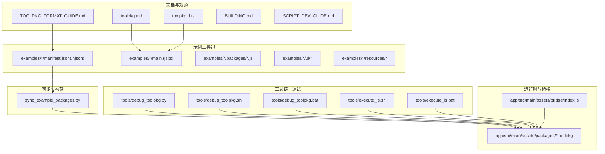
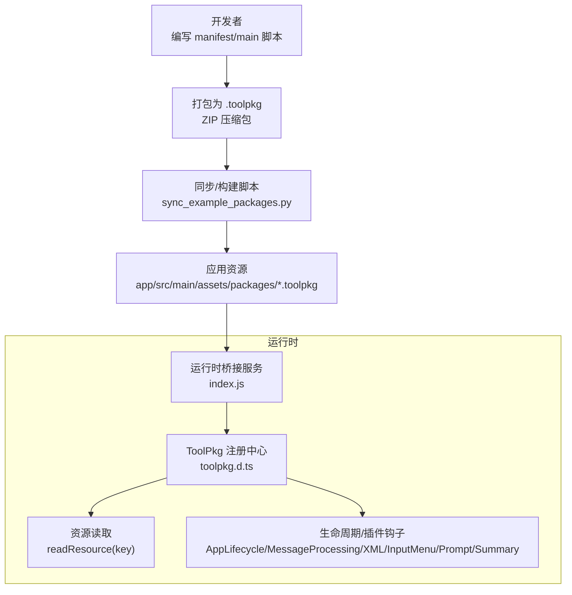
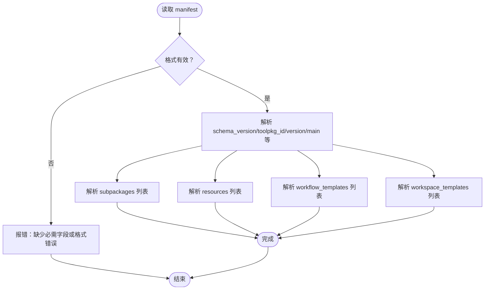
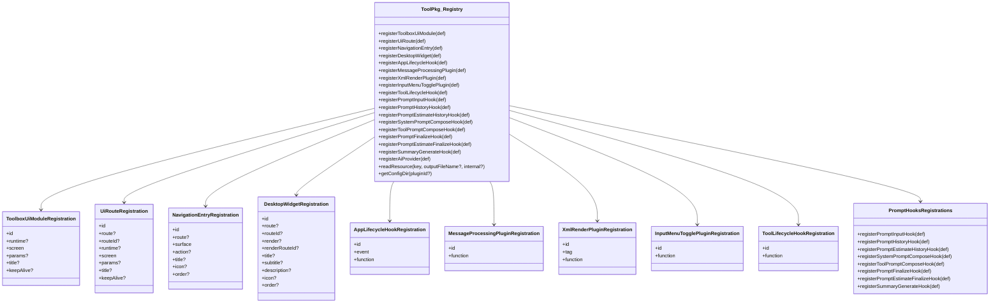
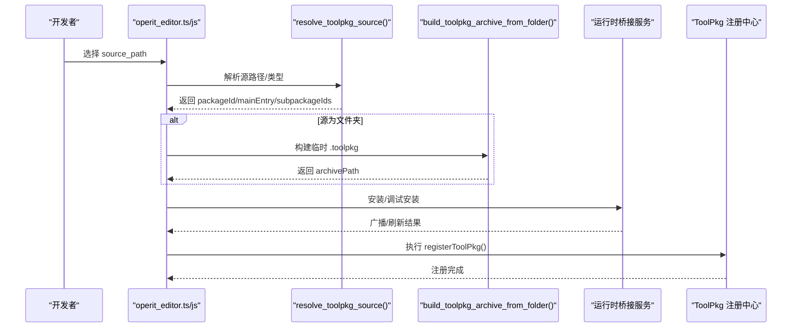
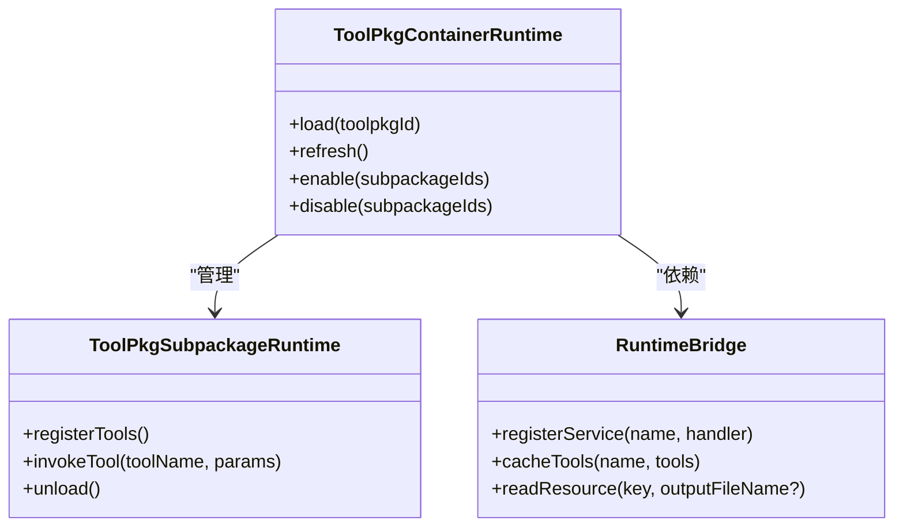
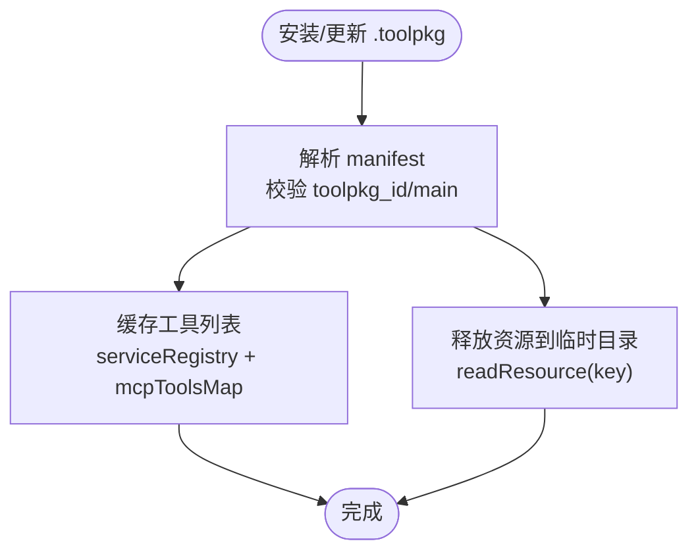
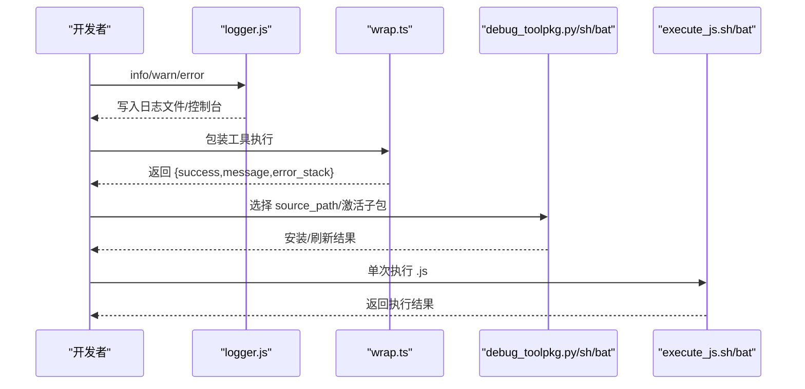
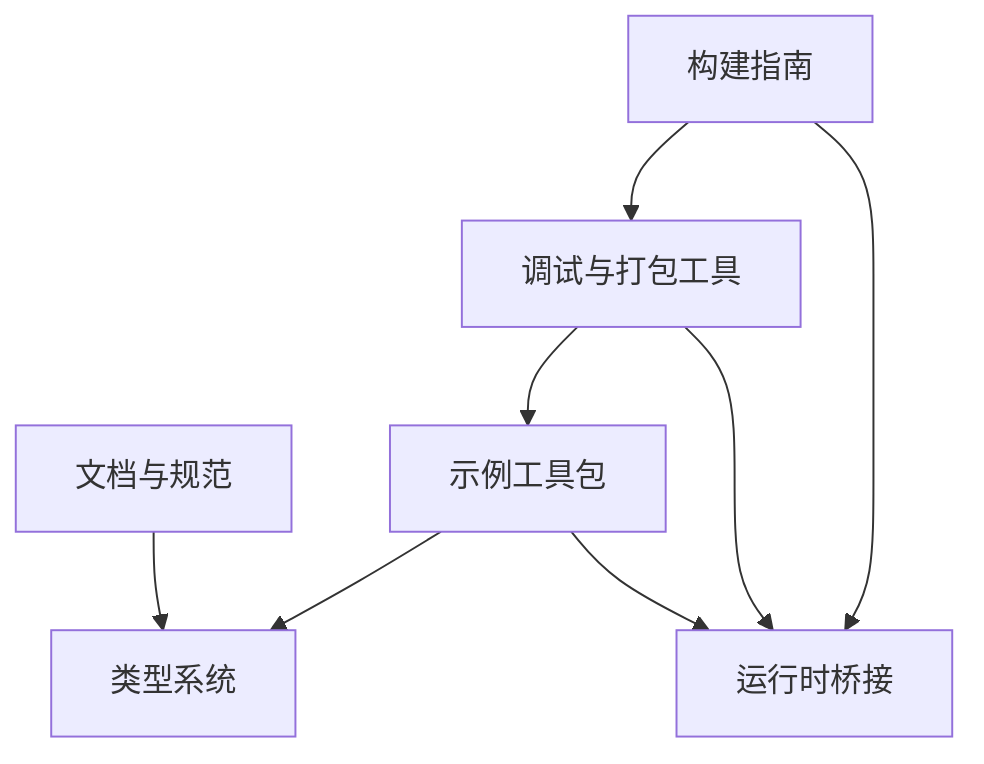

# 工具包架构设计

<cite>
**本文引用的文件**
- [TOOLPKG_FORMAT_GUIDE.md](file://docs/TOOLPKG_FORMAT_GUIDE.md)
- [toolpkg.md](file://docs/package_dev/toolpkg.md)
- [toolpkg.d.ts](file://examples/types/toolpkg.d.ts)
- [BUILDING.md](file://docs/BUILDING.md)
- [SCRIPT_DEV_GUIDE.md](file://docs/SCRIPT_DEV_GUIDE.md)
- [debug_toolpkg.py](file://tools/debug_toolpkg.py)
- [debug_toolpkg.sh](file://tools/debug_toolpkg.sh)
- [debug_toolpkg.bat](file://tools/debug_toolpkg.bat)
- [execute_js.sh](file://tools/execute_js.sh)
- [execute_js.bat](file://tools/execute_js.bat)
- [operit_editor.js](file://examples/operit_editor.js)
- [operit_editor.ts](file://examples/operit_editor.ts)
- [logger.js](file://examples/windows_control/resources/pc_agent/operit-pc-agent/src/lib/logger.js)
- [wrap.ts](file://examples/github/src/utils/wrap.ts)
- [index.js](file://app/src/main/assets/bridge/index.js)
- [sync_example_packages.py](file://sync_example_packages.py)
</cite>

## 目录
1. [简介](#简介)
2. [项目结构](#项目结构)
3. [核心组件](#核心组件)
4. [架构总览](#架构总览)
5. [详细组件分析](#详细组件分析)
6. [依赖关系分析](#依赖关系分析)
7. [性能考量](#性能考量)
8. [故障排查指南](#故障排查指南)
9. [结论](#结论)
10. [附录](#附录)

## 简介
本文件面向工具包开发者，系统化阐述 Operit 工具包（ToolPkg）的架构设计与实现细节，涵盖工具包格式规范、清单（manifest）结构、资源组织方式、生命周期管理、容器与运行时设计、缓存与签名验证、增量更新策略、开发最佳实践、调试方法与发布流程。文档以仓库内的权威文档与示例脚本为依据，配合可视化图示帮助读者建立从概念到落地的完整认知。

## 项目结构
Operit 采用多模块与示例包并行的组织方式：
- 文档与规范：docs 目录包含工具包格式、API 规范、构建指南等
- 示例工具包：examples 目录包含多个可直接打包为 .toolpkg 的示例包
- 工具链与调试：tools 目录提供调试与打包脚本
- 运行时与桥接：app/src/main/assets/bridge 提供运行时桥接与缓存服务
- 同步与构建：sync_example_packages.py 用于将示例包批量打包至应用资源

**图表来源**
- [TOOLPKG_FORMAT_GUIDE.md](file://docs/TOOLPKG_FORMAT_GUIDE.md)
- [toolpkg.md](file://docs/package_dev/toolpkg.md)
- [toolpkg.d.ts](file://examples/types/toolpkg.d.ts)
- [BUILDING.md](file://docs/BUILDING.md)
- [SCRIPT_DEV_GUIDE.md](file://docs/SCRIPT_DEV_GUIDE.md)
- [debug_toolpkg.py](file://tools/debug_toolpkg.py)
- [debug_toolpkg.sh](file://tools/debug_toolpkg.sh)
- [debug_toolpkg.bat](file://tools/debug_toolpkg.bat)
- [execute_js.sh](file://tools/execute_js.sh)
- [execute_js.bat](file://tools/execute_js.bat)
- [index.js](file://app/src/main/assets/bridge/index.js)
- [sync_example_packages.py](file://sync_example_packages.py)

**章节来源**
- [TOOLPKG_FORMAT_GUIDE.md](file://docs/TOOLPKG_FORMAT_GUIDE.md)
- [toolpkg.md](file://docs/package_dev/toolpkg.md)
- [toolpkg.d.ts](file://examples/types/toolpkg.d.ts)
- [BUILDING.md](file://docs/BUILDING.md)
- [SCRIPT_DEV_GUIDE.md](file://docs/SCRIPT_DEV_GUIDE.md)
- [debug_toolpkg.py](file://tools/debug_toolpkg.py)
- [debug_toolpkg.sh](file://tools/debug_toolpkg.sh)
- [debug_toolpkg.bat](file://tools/debug_toolpkg.bat)
- [execute_js.sh](file://tools/execute_js.sh)
- [execute_js.bat](file://tools/execute_js.bat)
- [index.js](file://app/src/main/assets/bridge/index.js)
- [sync_example_packages.py](file://sync_example_packages.py)

## 核心组件
- 工具包格式与清单：.toolpkg 为 ZIP 压缩包，核心为 manifest.json/hjson 与资源目录
- 注册 API 与类型系统：ToolPkg 命名空间提供注册方法与事件类型定义
- 运行时与桥接：运行时桥接服务负责工具缓存、资源读取与服务注册
- 调试与打包工具：debug_toolpkg.* 与 execute_js.* 提供调试安装与单次执行
- 示例与同步：examples 目录提供示例包，sync_example_packages.py 自动打包并输出到应用资源

**章节来源**
- [TOOLPKG_FORMAT_GUIDE.md](file://docs/TOOLPKG_FORMAT_GUIDE.md)
- [toolpkg.md](file://docs/package_dev/toolpkg.md)
- [toolpkg.d.ts](file://examples/types/toolpkg.d.ts)
- [index.js](file://app/src/main/assets/bridge/index.js)
- [debug_toolpkg.py](file://tools/debug_toolpkg.py)
- [execute_js.sh](file://tools/execute_js.sh)

## 架构总览
Operit 工具包体系围绕“清单驱动 + 注册 API + 运行时桥接”的模式展开。开发者通过编写 manifest 与 main 脚本，声明 UI 模块、生命周期钩子、消息处理插件、XML 渲染插件、输入菜单开关插件、提示词流水线钩子、摘要生成钩子等；运行时通过 ToolPkg 注册中心接收并管理这些扩展点；资源通过 readResource 释放到宿主临时目录；调试与打包工具贯穿开发到部署的全流程。

**图表来源**
- [TOOLPKG_FORMAT_GUIDE.md](file://docs/TOOLPKG_FORMAT_GUIDE.md)
- [toolpkg.md](file://docs/package_dev/toolpkg.md)
- [toolpkg.d.ts](file://examples/types/toolpkg.d.ts)
- [index.js](file://app/src/main/assets/bridge/index.js)
- [sync_example_packages.py](file://sync_example_packages.py)

## 详细组件分析

### 工具包格式与清单（manifest）
- 文件结构：.toolpkg 为 ZIP，包含 manifest.json/hjson、main.(js|ts)、packages/、ui/、resources/、i18n/ 等
- 清单字段：schema_version、toolpkg_id、version、author、main、display_name、description、subpackages、resources、workflow_templates、workspace_templates
- 子包与资源：子包脚本通过 METADATA 声明工具，resources 支持文件与目录（目录资源会被压缩为 zip）
- 工作流与工作区模板：通过 manifest 直接注册，导入时生成唯一 id 并重置统计字段

**图表来源**
- [TOOLPKG_FORMAT_GUIDE.md](file://docs/TOOLPKG_FORMAT_GUIDE.md)

**章节来源**
- [TOOLPKG_FORMAT_GUIDE.md](file://docs/TOOLPKG_FORMAT_GUIDE.md)

### 注册 API 与类型系统（ToolPkg）
- 类型命名空间与运行时对象：ToolPkg 命名空间承载类型定义，运行时 ToolPkg 对象提供注册方法
- 事件分类：应用生命周期事件、消息处理、XML 渲染、输入菜单开关、工具生命周期、提示词流水线、摘要生成
- 注册对象：ToolboxUiModule、UiRoute、NavigationEntry、DesktopWidget、AppLifecycleHook、MessageProcessingPlugin、XmlRenderPlugin、InputMenuTogglePlugin、ToolLifecycleHook、Prompt*Hooks、SummaryGenerateHook、AiProvider
- 资源读取：readResource(key, outputFileName?, internal?) 释放资源到宿主临时目录并返回绝对路径

**图表来源**
- [toolpkg.md](file://docs/package_dev/toolpkg.md)
- [toolpkg.d.ts](file://examples/types/toolpkg.d.ts)

**章节来源**
- [toolpkg.md](file://docs/package_dev/toolpkg.md)
- [toolpkg.d.ts](file://examples/types/toolpkg.d.ts)

### 工具包生命周期管理
- 包发现：扫描 examples 目录或指定路径，定位 manifest.json/hjson
- 加载：解析清单、读取 main 入口、加载子包脚本
- 注册：执行 main 脚本导出的 registerToolPkg，向运行时注册 UI 模块、导航入口、桌面小组件、生命周期钩子、消息处理插件、XML 渲染插件、输入菜单开关插件、提示词与摘要钩子
- 启用/禁用：通过 UI 或配置控制包的启用状态与子包启用状态
- 刷新与同步：运行时广播刷新，重新同步注册项与资源

**图表来源**
- [operit_editor.ts](file://examples/operit_editor.ts)
- [operit_editor.js](file://examples/operit_editor.js)
- [index.js](file://app/src/main/assets/bridge/index.js)

**章节来源**
- [operit_editor.ts](file://examples/operit_editor.ts)
- [operit_editor.js](file://examples/operit_editor.js)
- [index.js](file://app/src/main/assets/bridge/index.js)

### 工具包容器与运行时设计
- ToolPkgContainerRuntime：负责装载与管理 ToolPkg 的运行时上下文
- ToolPkgSubpackageRuntime：负责子包级别的生命周期与工具注册
- 运行时桥接：运行时桥接服务提供服务注册、工具缓存、资源读取等能力

**图表来源**
- [toolpkg.md](file://docs/package_dev/toolpkg.md)
- [toolpkg.d.ts](file://examples/types/toolpkg.d.ts)
- [index.js](file://app/src/main/assets/bridge/index.js)

**章节来源**
- [toolpkg.md](file://docs/package_dev/toolpkg.md)
- [toolpkg.d.ts](file://examples/types/toolpkg.d.ts)
- [index.js](file://app/src/main/assets/bridge/index.js)

### 工具包缓存机制
- 缓存策略：运行时桥接服务维护工具缓存映射，按服务名缓存工具列表
- 签名验证：manifest 中的 toolpkg_id 与 main 字段为必需，调试脚本会校验这些字段
- 增量更新：通过解析清单与资源键，按需释放资源到临时目录，避免重复拷贝

**图表来源**
- [debug_toolpkg.py](file://tools/debug_toolpkg.py)
- [index.js](file://app/src/main/assets/bridge/index.js)
- [toolpkg.d.ts](file://examples/types/toolpkg.d.ts)

**章节来源**
- [debug_toolpkg.py](file://tools/debug_toolpkg.py)
- [index.js](file://app/src/main/assets/bridge/index.js)
- [toolpkg.d.ts](file://examples/types/toolpkg.d.ts)

### 开发最佳实践
- 目录结构规范：遵循 TOOLPKG_FORMAT_GUIDE.md 的文件结构，确保 manifest.json/hjson、main 脚本、packages/、ui/、resources/、i18n/ 等齐全
- 配置文件编写：使用 toolpkg.d.ts 的类型定义与注册 API，确保事件类型与返回值符合规范
- 资源管理策略：资源键唯一且 mime 正确，目录资源会自动压缩为 zip
- UI 模块：使用 Compose DSL，通过 registerToolboxUiModule/registerUiRoute/registerNavigationEntry/registerDesktopWidget 注册
- 生命周期与插件：合理使用 AppLifecycleHook、MessageProcessingPlugin、XmlRenderPlugin、InputMenuTogglePlugin、Prompt*Hooks、SummaryGenerateHook
- 错误处理：参考 wrap.ts 的统一包装模式，捕获异常并返回结构化结果

**章节来源**
- [TOOLPKG_FORMAT_GUIDE.md](file://docs/TOOLPKG_FORMAT_GUIDE.md)
- [toolpkg.md](file://docs/package_dev/toolpkg.md)
- [toolpkg.d.ts](file://examples/types/toolpkg.d.ts)
- [wrap.ts](file://examples/github/src/utils/wrap.ts)

### 调试方法
- 日志输出：示例包中的 logger.js 提供 info/warn/error 写入，便于运行时日志记录
- 错误处理：wrap.ts 统一封装工具执行结果，包含 success/message/error_stack
- 性能监控：结合提示词流水线钩子与摘要生成钩子，观察阶段耗时与结果
- 调试安装：使用 debug_toolpkg.* 脚本解析清单、构建临时 .toolpkg、安装到设备并刷新运行时
- 单次执行：使用 execute_js.* 脚本对普通 .js 包进行单次执行调试

**图表来源**
- [logger.js](file://examples/windows_control/resources/pc_agent/operit-pc-agent/src/lib/logger.js)
- [wrap.ts](file://examples/github/src/utils/wrap.ts)
- [debug_toolpkg.py](file://tools/debug_toolpkg.py)
- [debug_toolpkg.sh](file://tools/debug_toolpkg.sh)
- [debug_toolpkg.bat](file://tools/debug_toolpkg.bat)
- [execute_js.sh](file://tools/execute_js.sh)
- [execute_js.bat](file://tools/execute_js.bat)

**章节来源**
- [logger.js](file://examples/windows_control/resources/pc_agent/operit-pc-agent/src/lib/logger.js)
- [wrap.ts](file://examples/github/src/utils/wrap.ts)
- [debug_toolpkg.py](file://tools/debug_toolpkg.py)
- [debug_toolpkg.sh](file://tools/debug_toolpkg.sh)
- [debug_toolpkg.bat](file://tools/debug_toolpkg.bat)
- [execute_js.sh](file://tools/execute_js.sh)
- [execute_js.bat](file://tools/execute_js.bat)

### 发布流程
- 构建与打包：使用 sync_example_packages.py 扫描 examples 目录，按清单打包为 .toolpkg 并输出到 app/src/main/assets/packages/
- 安装与调试：使用 debug_toolpkg.* 脚本进行安装与刷新，确保 ToolPkg 容器出现且未被内置包遮蔽
- 构建 APK：参考 BUILDING.md 完成 Android 项目编译，确保 web-chat 构建与示例包同步

**章节来源**
- [sync_example_packages.py](file://sync_example_packages.py)
- [operit_editor.js](file://examples/operit_editor.js)
- [BUILDING.md](file://docs/BUILDING.md)

## 依赖关系分析
- 文档与规范依赖：TOOLPKG_FORMAT_GUIDE.md 与 toolpkg.md 互为补充，toolpkg.d.ts 提供类型约束
- 示例与运行时依赖：examples 目录中的包通过 manifest 与 main 脚本依赖运行时注册 API
- 工具链与运行时依赖：debug_toolpkg.* 与 sync_example_packages.py 依赖运行时桥接服务与资源读取
- 构建与发布依赖：BUILDING.md 为编译与打包提供环境与步骤

**图表来源**
- [TOOLPKG_FORMAT_GUIDE.md](file://docs/TOOLPKG_FORMAT_GUIDE.md)
- [toolpkg.md](file://docs/package_dev/toolpkg.md)
- [toolpkg.d.ts](file://examples/types/toolpkg.d.ts)
- [index.js](file://app/src/main/assets/bridge/index.js)
- [debug_toolpkg.py](file://tools/debug_toolpkg.py)
- [sync_example_packages.py](file://sync_example_packages.py)
- [BUILDING.md](file://docs/BUILDING.md)

**章节来源**
- [TOOLPKG_FORMAT_GUIDE.md](file://docs/TOOLPKG_FORMAT_GUIDE.md)
- [toolpkg.md](file://docs/package_dev/toolpkg.md)
- [toolpkg.d.ts](file://examples/types/toolpkg.d.ts)
- [index.js](file://app/src/main/assets/bridge/index.js)
- [debug_toolpkg.py](file://tools/debug_toolpkg.py)
- [sync_example_packages.py](file://sync_example_packages.py)
- [BUILDING.md](file://docs/BUILDING.md)

## 性能考量
- 资源释放：目录资源自动压缩为 zip，减少多次 IO；readResource 按需释放，避免重复拷贝
- 注册与刷新：批量注册与广播刷新，减少不必要的重建
- 日志与监控：通过 logger.js 与 wrap.ts 的结构化输出，便于定位性能瓶颈
- 构建优化：参考 BUILDING.md 的 Gradle 配置，提升编译效率

## 故障排查指南
- 清单字段缺失：debug_toolpkg.py 会校验 toolpkg_id 与 main，缺失时报错
- 安装失败：operit_editor.js 在安装后检查 ToolPkg 容器是否出现，若被内置包遮蔽则提示
- 资源读取：readResource 返回绝对路径，若 mime 为目录类型会自动补 .zip
- 日志与错误：logger.js 输出 INFO/WARN/ERROR，wrap.ts 返回 error_stack 便于定位

**章节来源**
- [debug_toolpkg.py](file://tools/debug_toolpkg.py)
- [operit_editor.js](file://examples/operit_editor.js)
- [toolpkg.d.ts](file://examples/types/toolpkg.d.ts)
- [logger.js](file://examples/windows_control/resources/pc_agent/operit-pc-agent/src/lib/logger.js)
- [wrap.ts](file://examples/github/src/utils/wrap.ts)

## 结论
Operit 工具包架构以清单驱动与注册 API 为核心，结合运行时桥接与资源管理，形成从开发、调试、打包到发布的完整闭环。通过规范的目录结构、严格的类型定义与完善的调试工具链，开发者可以高效构建高质量的工具包扩展。

## 附录
- 开发环境搭建：参考 BUILDING.md 完成系统依赖、Android SDK/NDK、项目克隆与构建
- 脚本开发指南：参考 SCRIPT_DEV_GUIDE.md 了解 METADATA、Tools API、Java/Kotlin 桥接等
- 示例与模板：examples 目录提供可直接使用的示例包与模板，便于快速上手

**章节来源**
- [BUILDING.md](file://docs/BUILDING.md)
- [SCRIPT_DEV_GUIDE.md](file://docs/SCRIPT_DEV_GUIDE.md)