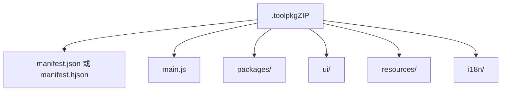
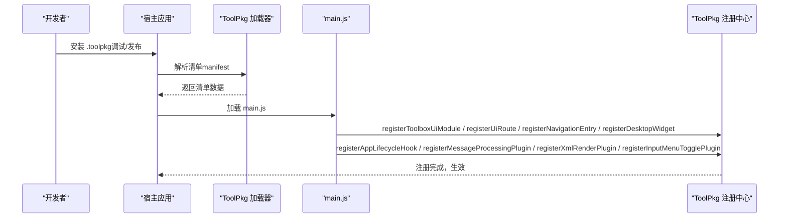
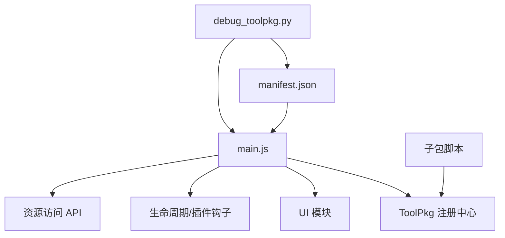

# 工具包格式规范

<cite>
**本文引用的文件**
- [TOOLPKG_FORMAT_GUIDE.md](file://docs/TOOLPKG_FORMAT_GUIDE.md)
- [toolpkg.md](file://docs/package_dev/toolpkg.md)
- [manifest.json（模板示例）](file://examples/template_try/manifest.json)
- [manifest.json（Windows 工具包示例）](file://examples/windows_control/manifest.json)
- [manifest.json（Linux SSH 示例）](file://examples/linux_ssh/manifest.json)
- [manifest.json（深度搜索示例）](file://examples/deepsearching/manifest.json)
- [debug_toolpkg.py](file://tools/debug_toolpkg.py)
- [main.js（模板示例）](file://examples/template_try/dist/main.js)
- [main.js（Windows 工具包示例）](file://examples/windows_control/dist/main.js)
- [main.js（Linux SSH 示例）](file://examples/linux_ssh/dist/main.js)
- [tsconfig.json（模板示例）](file://examples/template_try/tsconfig.json)
</cite>

## 目录
1. [简介](#简介)
2. [项目结构](#项目结构)
3. [核心组件](#核心组件)
4. [架构总览](#架构总览)
5. [详细组件分析](#详细组件分析)
6. [依赖关系分析](#依赖关系分析)
7. [性能考量](#性能考量)
8. [故障排查指南](#故障排查指南)
9. [结论](#结论)
10. [附录](#附录)

## 简介
本文件为 Operit 工具包（ToolPkg）格式规范的权威技术文档，面向工具包开发者，提供从文件结构、清单定义、元数据约束、资源组织、版本管理策略到签名与完整性校验的完整参考。ToolPkg 采用 .toolpkg 作为分发格式，本质为 ZIP 压缩包，内部包含清单文件与相关资源、脚本、UI 模块等。

## 项目结构
ToolPkg 的物理结构与目录组织如下：
- 必需文件
  - manifest.json 或 manifest.hjson：清单文件，定义包元数据、入口、子包、资源、模板等
  - main.js：ToolPkg 主入口脚本，负责注册 UI 模块、导航、桌面小组件、生命周期钩子、消息处理插件、XML 渲染插件、输入菜单开关插件等
- 可选目录
  - packages/：子包脚本集合（JavaScript）
  - ui/：UI 模块（Compose DSL 等）
  - resources/：任意资源文件（图片、压缩包、配置文件等）
  - i18n/：多语言文本（可选）

图表来源
- [TOOLPKG_FORMAT_GUIDE.md:26-46](file://docs/TOOLPKG_FORMAT_GUIDE.md#L26-L46)

章节来源
- [TOOLPKG_FORMAT_GUIDE.md:26-46](file://docs/TOOLPKG_FORMAT_GUIDE.md#L26-L46)

## 核心组件
- 清单（manifest）：定义 schema_version、toolpkg_id、version、author、main、display_name、description、subpackages、resources、workflow_templates、workspace_templates 等字段
- 主入口脚本（main.js）：通过 ToolPkg 注册 API 向宿主注入 UI、导航、桌面小组件、生命周期钩子、消息处理插件、XML 渲染插件、输入菜单开关插件等
- 子包脚本（packages/*.js）：按约定包含 METADATA 块，注册具体工具
- 资源（resources/）：文件或目录资源，可通过 ToolPkg.readResource(key) 访问
- UI 模块（ui/）：Compose DSL 等运行时 UI，通过 ToolPkg.registerToolboxUiModule/registerUiRoute/registerNavigationEntry/registerDesktopWidget 注册

章节来源
- [TOOLPKG_FORMAT_GUIDE.md:59-135](file://docs/TOOLPKG_FORMAT_GUIDE.md#L59-L135)
- [TOOLPKG_FORMAT_GUIDE.md:214-334](file://docs/TOOLPKG_FORMAT_GUIDE.md#L214-L334)
- [toolpkg.md:18-48](file://docs/package_dev/toolpkg.md#L18-L48)

## 架构总览
ToolPkg 的加载与注册流程概览：

图表来源
- [TOOLPKG_FORMAT_GUIDE.md:214-334](file://docs/TOOLPKG_FORMAT_GUIDE.md#L214-L334)
- [toolpkg.md:392-429](file://docs/package_dev/toolpkg.md#L392-L429)

章节来源
- [TOOLPKG_FORMAT_GUIDE.md:214-334](file://docs/TOOLPKG_FORMAT_GUIDE.md#L214-L334)
- [toolpkg.md:392-429](file://docs/package_dev/toolpkg.md#L392-L429)

## 详细组件分析

### 清单（manifest）结构与字段定义
- 必需字段
  - schema_version：当前为 1
  - toolpkg_id：包唯一标识，建议反向域名格式
  - main：主入口脚本路径（相对 ZIP 根目录）
- 可选字段
  - version：语义化版本
  - author：字符串或字符串数组
  - display_name/description：支持 LocalizedText（简单字符串或多语言对象）
  - subpackages：子包数组，每项含 id、entry、enabled_by_default、display_name、description
  - resources：资源数组，每项含 key、path、mime
  - workflow_templates：工作流模板数组，每项含 id、display_name、description、resource_key
  - workspace_templates：工作区模板数组，每项含 id、display_name、description、resource_key、project_type

字段与类型要点
- LocalizedText 支持简单字符串或对象，语言代码优先级：完整语言标签 > 语言代码 > default > 任意值
- subpackages.id 在包内唯一；entry 相对于 ZIP 根目录
- resources.key 唯一，path 指向 ZIP 内资源路径；当 mime 为目录类型时，ToolPkg.readResource 会将目录打包为 zip 并返回 zip 路径
- workflow_templates.resource_key 引用 resources 中的文件资源；workspace_templates.resource_key 引用目录资源

章节来源
- [TOOLPKG_FORMAT_GUIDE.md:137-180](file://docs/TOOLPKG_FORMAT_GUIDE.md#L137-L180)
- [TOOLPKG_FORMAT_GUIDE.md:181-213](file://docs/TOOLPKG_FORMAT_GUIDE.md#L181-L213)
- [TOOLPKG_FORMAT_GUIDE.md:397-432](file://docs/TOOLPKG_FORMAT_GUIDE.md#L397-L432)
- [TOOLPKG_FORMAT_GUIDE.md:433-476](file://docs/TOOLPKG_FORMAT_GUIDE.md#L433-L476)
- [TOOLPKG_FORMAT_GUIDE.md:477-541](file://docs/TOOLPKG_FORMAT_GUIDE.md#L477-L541)

### 主入口脚本（main.js）与注册 API
- main.js 通过 ToolPkg 注册 API 向宿主注入能力，包括：
  - Toolbox UI 模块、UI 路由、导航入口、桌面小组件
  - 应用生命周期钩子
  - 消息处理插件、XML 渲染插件、输入菜单开关插件
  - 工具生命周期钩子、Prompt 输入/历史/系统提示词/工具提示词/最终发送/摘要生成等钩子
- 注册 API 的运行时对象 ToolPkg 与类型定义位于 toolpkg.d.ts，支持多种事件与返回值结构

章节来源
- [TOOLPKG_FORMAT_GUIDE.md:214-334](file://docs/TOOLPKG_FORMAT_GUIDE.md#L214-L334)
- [toolpkg.md:392-596](file://docs/package_dev/toolpkg.md#L392-L596)

### 子包脚本（packages/*.js）与 METADATA
- 子包脚本需包含 METADATA 注释块，定义工具名称、描述、参数、环境变量等
- 工具注册后以 <subpackage_id>:<tool_name> 形式暴露给宿主
- 多语言支持：description、tools[].description、tools[].parameters[].description、env[].description 支持 LocalizedText

章节来源
- [TOOLPKG_FORMAT_GUIDE.md:610-760](file://docs/TOOLPKG_FORMAT_GUIDE.md#L610-L760)

### 资源文件组织与访问
- resources 目录可放置任意类型文件；也可声明目录资源（mime 为目录类型），ToolPkg.readResource 会将其打包为 zip 并返回 zip 路径
- 访问方式：在子包脚本中通过 PackageManager API，在 UI 模块中通过 ToolPkg.readResource(key)

章节来源
- [TOOLPKG_FORMAT_GUIDE.md:397-432](file://docs/TOOLPKG_FORMAT_GUIDE.md#L397-L432)
- [toolpkg.md:415-429](file://docs/package_dev/toolpkg.md#L415-L429)

### UI 模块与 Compose DSL
- UI 模块通过 ToolPkg.registerToolboxUiModule/registerUiRoute/registerNavigationEntry/registerDesktopWidget 注册
- Compose DSL 提供声明式 UI、状态管理、事件处理等能力
- 示例入口文件导出 registerToolPkg 函数，集中调用各类注册方法

章节来源
- [TOOLPKG_FORMAT_GUIDE.md:761-800](file://docs/TOOLPKG_FORMAT_GUIDE.md#L761-L800)
- [toolpkg.md:430-596](file://docs/package_dev/toolpkg.md#L430-L596)
- [main.js（模板示例）:5-15](file://examples/template_try/dist/main.js#L5-L15)
- [main.js（Windows 工具包示例）:9-25](file://examples/windows_control/dist/main.js#L9-L25)
- [main.js（Linux SSH 示例）:9-25](file://examples/linux_ssh/dist/main.js#L9-L25)

### 工作流模板与工作区模板
- workflow_templates：注册后出现在宿主“工作流 -> 从模板新建”入口
- workspace_templates：注册后出现在宿主“工作区 -> 创建默认”入口
- 要求：workflow_templates.resource_key 引用文件资源；workspace_templates.resource_key 引用目录资源，且目录包含 .operit/config.json

章节来源
- [TOOLPKG_FORMAT_GUIDE.md:433-541](file://docs/TOOLPKG_FORMAT_GUIDE.md#L433-L541)
- [manifest.json（模板示例）:28-57](file://examples/template_try/manifest.json#L28-L57)

### 版本管理策略
- 版本号建议采用语义化版本（如 0.2.0）
- 清单字段 version 为可选，但建议填写以支持宿主的版本识别与更新提示
- 升级路径：宿主根据 toolpkg_id 与 version 进行匹配与替换；manifest 中的 enabled_by_default 可影响默认启用状态

章节来源
- [TOOLPKG_FORMAT_GUIDE.md:145](file://docs/TOOLPKG_FORMAT_GUIDE.md#L145)
- [manifest.json（Windows 工具包示例）:4](file://examples/windows_control/manifest.json#L4)
- [manifest.json（Linux SSH 示例）:4](file://examples/linux_ssh/manifest.json#L4)
- [manifest.json（模板示例）:4](file://examples/template_try/manifest.json#L4)

### 签名与完整性校验（现状与建议）
- 当前仓库未提供 ToolPkg 数字签名与完整性校验的实现细节
- 建议在生产环境中引入：
  - 对 .toolpkg 进行哈希校验（如 SHA-256）
  - 使用公钥基础设施（PKI）对清单与关键资源进行数字签名
  - 在宿主侧实现签名校验与来源验证流程
- 以上为最佳实践建议，非现有实现约束

章节来源
- [TOOLPKG_FORMAT_GUIDE.md:1-25](file://docs/TOOLPKG_FORMAT_GUIDE.md#L1-L25)

## 依赖关系分析
ToolPkg 的关键依赖与耦合关系：
- 清单（manifest）驱动 ToolPkg 的结构与行为
- main.js 依赖 ToolPkg 注册 API，向宿主注入 UI、钩子、插件
- 子包脚本依赖清单中的 subpackages.entry 与 ToolPkg 注册 API
- 资源访问依赖 ToolPkg.readResource 与 PackageManager API
- 调试与安装依赖调试脚本（debug_toolpkg.py）

图表来源
- [TOOLPKG_FORMAT_GUIDE.md:59-135](file://docs/TOOLPKG_FORMAT_GUIDE.md#L59-L135)
- [toolpkg.md:392-429](file://docs/package_dev/toolpkg.md#L392-L429)
- [debug_toolpkg.py:106-171](file://tools/debug_toolpkg.py#L106-L171)

章节来源
- [TOOLPKG_FORMAT_GUIDE.md:59-135](file://docs/TOOLPKG_FORMAT_GUIDE.md#L59-L135)
- [toolpkg.md:392-429](file://docs/package_dev/toolpkg.md#L392-L429)
- [debug_toolpkg.py:106-171](file://tools/debug_toolpkg.py#L106-L171)

## 性能考量
- 资源体积：目录资源经打包为 zip，可能增大传输与解压开销；建议仅包含必要文件
- 注册数量：过多 UI 模块与钩子会增加宿主初始化成本；建议按需注册
- 主入口脚本复杂度：避免在 main.js 中执行阻塞操作，尽量异步化
- 调试安装：使用调试脚本批量打包与推送，减少手工操作带来的重复开销

章节来源
- [TOOLPKG_FORMAT_GUIDE.md:397-432](file://docs/TOOLPKG_FORMAT_GUIDE.md#L397-L432)
- [toolpkg.md:415-429](file://docs/package_dev/toolpkg.md#L415-L429)
- [debug_toolpkg.py:195-204](file://tools/debug_toolpkg.py#L195-L204)

## 故障排查指南
- 缺失清单文件
  - 现象：安装失败或无法识别 ToolPkg
  - 排查：确认 manifest.json 或 manifest.hjson 存在于根目录
- main 字段缺失或路径错误
  - 现象：宿主找不到主入口脚本
  - 排查：确保 manifest.main 指向 ZIP 内存在的文件，且路径正确
- 调试安装失败
  - 现象：adb 设备不可用或广播未触发
  - 排查：使用调试脚本检查设备列表、ADB 版本、日志输出
- 资源访问异常
  - 现象：ToolPkg.readResource 返回空或路径不存在
  - 排查：确认 resources.key 与 manifest 中声明一致，目录资源 mime 正确

章节来源
- [debug_toolpkg.py:55-73](file://tools/debug_toolpkg.py#L55-L73)
- [debug_toolpkg.py:106-171](file://tools/debug_toolpkg.py#L106-L171)
- [debug_toolpkg.py:256-318](file://tools/debug_toolpkg.py#L256-L318)
- [toolpkg.md:415-429](file://docs/package_dev/toolpkg.md#L415-L429)

## 结论
ToolPkg 通过 ZIP 容器与清单驱动的方式，将脚本、资源、UI、模板等模块化整合，提供强大的扩展能力。开发者应严格遵循清单字段定义、主入口注册约定、资源组织规范与版本管理策略，确保工具包在宿主中的正确加载与运行。关于签名与完整性校验，建议结合生产需求引入安全机制以保障分发与运行安全。

## 附录

### 清单字段对照表（摘要）
- schema_version：number，必需
- toolpkg_id：string，必需
- version：string，可选
- author：string | string[]，可选
- main：string，必需
- display_name/description：LocalizedText，可选
- subpackages：array，可选
- resources：array，可选
- workflow_templates：array，可选
- workspace_templates：array，可选

章节来源
- [TOOLPKG_FORMAT_GUIDE.md:137-154](file://docs/TOOLPKG_FORMAT_GUIDE.md#L137-L154)

### 示例清单与入口脚本
- 模板示例清单与入口脚本
  - [manifest.json（模板示例）](file://examples/template_try/manifest.json)
  - [main.js（模板示例）](file://examples/template_try/dist/main.js)
- Windows 工具包示例清单与入口脚本
  - [manifest.json（Windows 工具包示例）](file://examples/windows_control/manifest.json)
  - [main.js（Windows 工具包示例）](file://examples/windows_control/dist/main.js)
- Linux SSH 示例清单与入口脚本
  - [manifest.json（Linux SSH 示例）](file://examples/linux_ssh/manifest.json)
  - [main.js（Linux SSH 示例）](file://examples/linux_ssh/dist/main.js)
- 深度搜索示例清单
  - [manifest.json（深度搜索示例）](file://examples/deepsearching/manifest.json)

章节来源
- [manifest.json（模板示例）:1-58](file://examples/template_try/manifest.json#L1-L58)
- [main.js（模板示例）:5-15](file://examples/template_try/dist/main.js#L5-L15)
- [manifest.json（Windows 工具包示例）:1-29](file://examples/windows_control/manifest.json#L1-L29)
- [main.js（Windows 工具包示例）:9-25](file://examples/windows_control/dist/main.js#L9-L25)
- [manifest.json（Linux SSH 示例）:1-22](file://examples/linux_ssh/manifest.json#L1-L22)
- [main.js（Linux SSH 示例）:9-25](file://examples/linux_ssh/dist/main.js#L9-L25)
- [manifest.json（深度搜索示例）:1-17](file://examples/deepsearching/manifest.json#L1-L17)

### 调试与打包脚本
- 调试安装脚本：支持从文件夹或 .toolpkg 归档构建临时 ZIP，推送到设备并触发安装广播，捕获日志
  - [debug_toolpkg.py](file://tools/debug_toolpkg.py)

章节来源
- [debug_toolpkg.py:106-171](file://tools/debug_toolpkg.py#L106-L171)
- [debug_toolpkg.py:195-204](file://tools/debug_toolpkg.py#L195-L204)
- [debug_toolpkg.py:256-318](file://tools/debug_toolpkg.py#L256-L318)