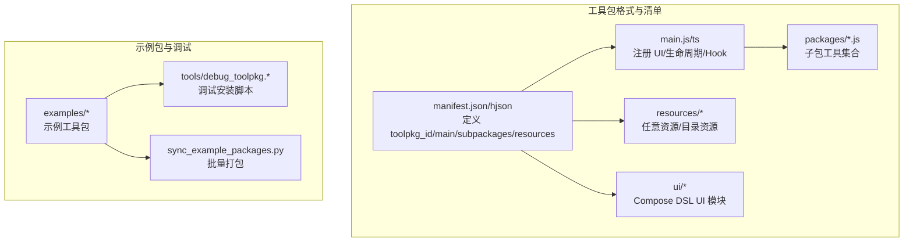
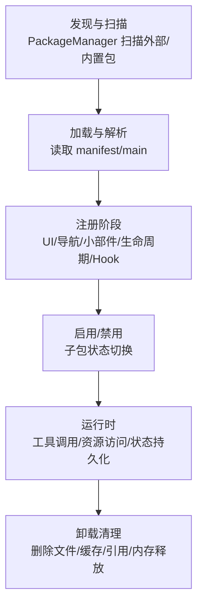
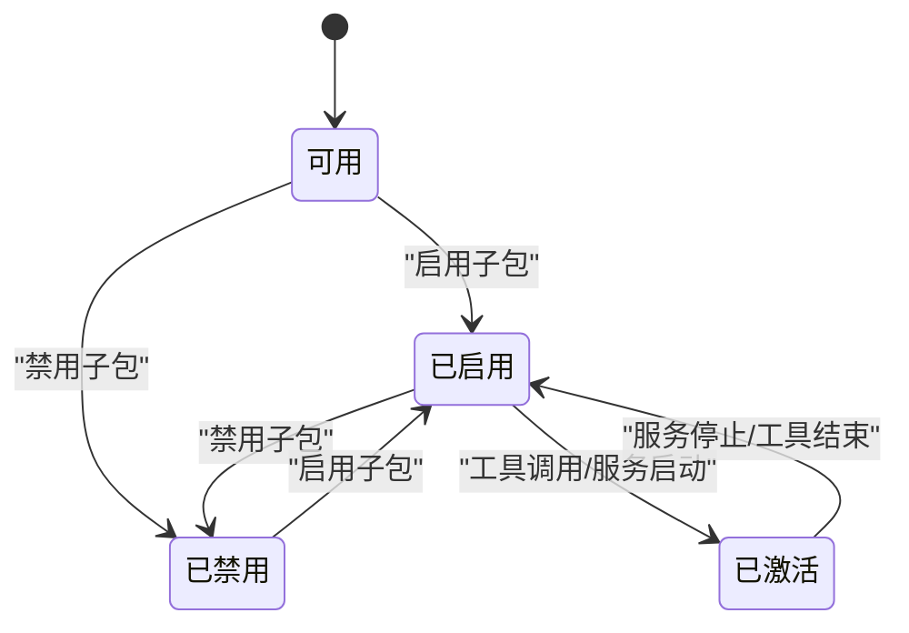
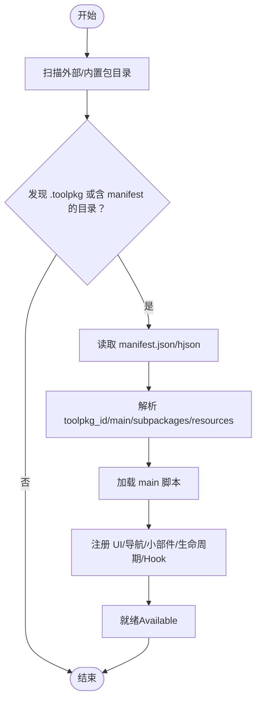
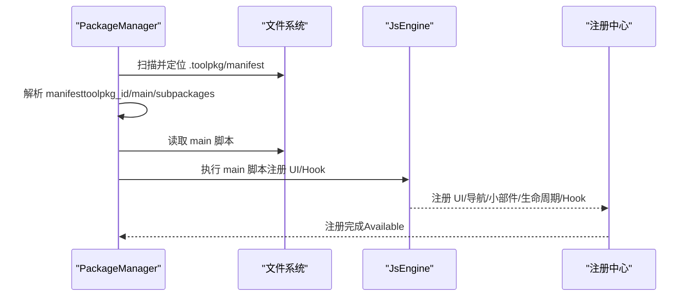
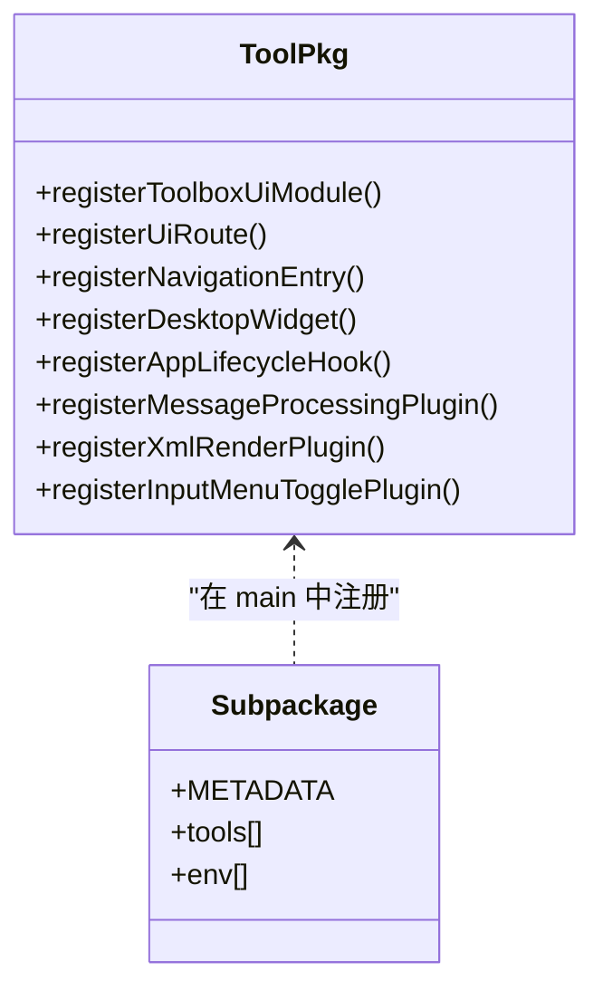
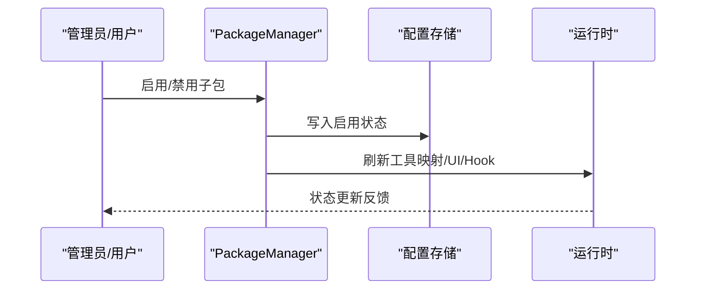
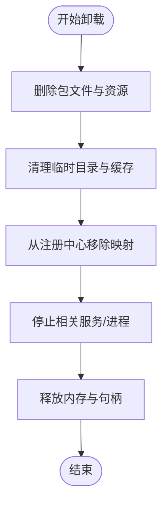
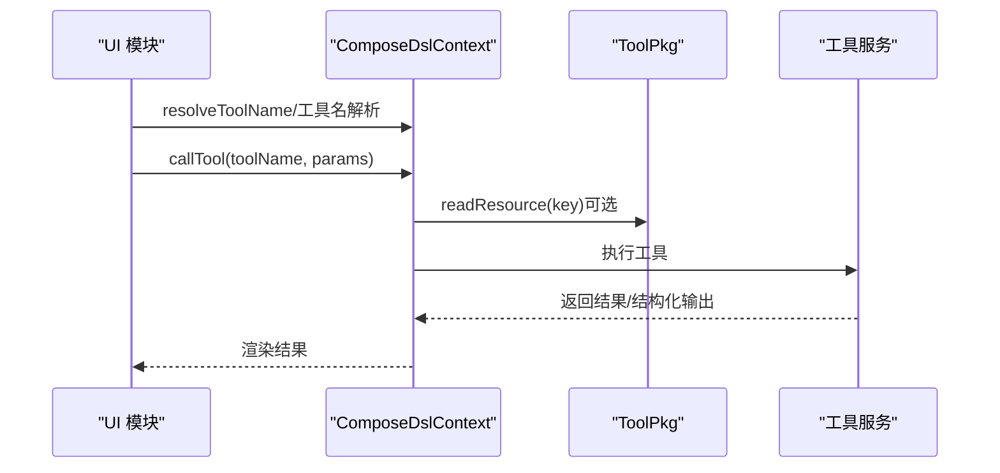
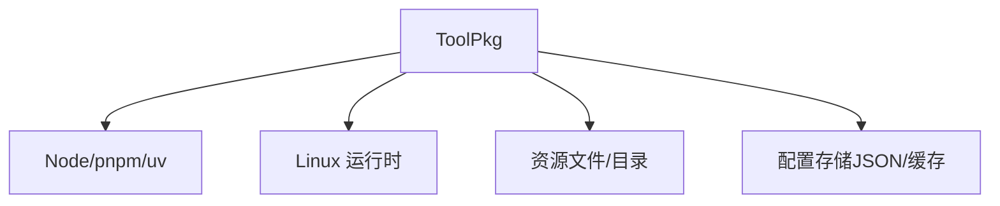

# 工具包生命周期管理

<cite>
**本文引用的文件**
- [TOOLPKG_FORMAT_GUIDE.md](file://docs/TOOLPKG_FORMAT_GUIDE.md)
- [operit_editor.js](file://examples/operit_editor.js)
- [operit_editor.ts](file://examples/operit_editor.ts)
- [index.js](file://app/src/main/assets/bridge/index.js)
- [spawn-helper.js](file://app/src/main/assets/bridge/spawn-helper.js)
- [index.ts](file://tools/mcp_bridge/index.ts)
- [logger.js](file://examples/windows_control/resources/pc_agent/operit-pc-agent/src/lib/logger.js)
- [runtime-store.js](file://examples/windows_control/resources/pc_agent/operit-pc-agent/src/stores/runtime-store.js)
- [server.js](file://examples/windows_control/resources/pc_agent/operit-pc-agent/src/server.js)
- [qqbot_device_diag.js](file://tools/qqbot_device_diag.js)
- [account_book_web_runtime.ts](file://examples/sidebar_account_book/src/shared/account_book_web_runtime.ts)
- [qqbot_state.ts](file://examples/qqbot/src/shared/qqbot_state.ts)
- [debug_toolpkg.py](file://tools/debug_toolpkg.py)
- [sync_example_packages.py](file://sync_example_packages.py)
- [index.ui.ts](file://examples/remote_operit/src/ui/remote_operit_setup/index.ui.ts)
- [index.ui.ts](file://examples/windows_control/src/ui/windows_setup/index.ui.ts)
- [index.ui.ts](file://examples/linux_ssh/src/linux_ssh_setup/index.ui.ts)
- [subagent-xml-render-plugin.ts](file://examples/subagent/src/plugin/subagent-xml-render-plugin.ts)
</cite>

## 目录
1. [简介](#简介)
2. [项目结构](#项目结构)
3. [核心组件](#核心组件)
4. [架构总览](#架构总览)
5. [详细组件分析](#详细组件分析)
6. [依赖分析](#依赖分析)
7. [性能考虑](#性能考虑)
8. [故障排查指南](#故障排查指南)
9. [结论](#结论)
10. [附录](#附录)

## 简介
本文件面向系统管理员与高级用户，系统性阐述 Operit 工具包（ToolPkg）的生命周期管理，涵盖状态模型、发现与加载、注册与启用/禁用、运行时切换与资源回收、卸载清理等全流程。文档以仓库内的工具包格式规范、示例包与桥接脚本为依据，结合调试与打包工具，提供可操作的运维与排障指导。

## 项目结构
Operit 的工具包生态围绕“清单（manifest）—主入口（main）—子包（subpackages）—资源（resources）—UI 模块（ui）”展开，工具包以 .toolpkg 形式交付，内部包含 manifest.json/hjson 与资源文件。示例包展示了工具包的打包、导入、启用、调试与运行时交互。

图示来源
- [TOOLPKG_FORMAT_GUIDE.md:26-46](file://docs/TOOLPKG_FORMAT_GUIDE.md#L26-L46)
- [TOOLPKG_FORMAT_GUIDE.md:542-610](file://docs/TOOLPKG_FORMAT_GUIDE.md#L542-L610)
- [debug_toolpkg.py:138-171](file://tools/debug_toolpkg.py#L138-L171)
- [sync_example_packages.py:538-574](file://sync_example_packages.py#L538-L574)

章节来源
- [TOOLPKG_FORMAT_GUIDE.md:26-46](file://docs/TOOLPKG_FORMAT_GUIDE.md#L26-L46)
- [TOOLPKG_FORMAT_GUIDE.md:542-610](file://docs/TOOLPKG_FORMAT_GUIDE.md#L542-L610)
- [debug_toolpkg.py:138-171](file://tools/debug_toolpkg.py#L138-L171)
- [sync_example_packages.py:538-574](file://sync_example_packages.py#L538-L574)

## 核心组件
- 工具包格式与清单：定义 toolpkg_id、main、subpackages、resources、UI 与模板注册等。
- 主入口注册：在 main.js/ts 中注册 UI 模块、导航入口、桌面小部件、生命周期钩子、消息处理与 XML 渲染插件等。
- 子包与工具：子包脚本通过 METADATA 声明工具、参数、环境变量与默认启用状态。
- 资源与目录资源：支持文件与目录资源，目录资源经压缩后以临时 zip 路径提供。
- UI 模块：基于 Compose DSL 的声明式 UI，支持状态管理、工具调用、路由导航与资源访问。
- 调试与打包：debug_toolpkg.* 与 sync_example_packages.py 提供调试安装与批量打包能力。

章节来源
- [TOOLPKG_FORMAT_GUIDE.md:59-135](file://docs/TOOLPKG_FORMAT_GUIDE.md#L59-L135)
- [TOOLPKG_FORMAT_GUIDE.md:214-334](file://docs/TOOLPKG_FORMAT_GUIDE.md#L214-L334)
- [TOOLPKG_FORMAT_GUIDE.md:397-432](file://docs/TOOLPKG_FORMAT_GUIDE.md#L397-L432)
- [TOOLPKG_FORMAT_GUIDE.md:761-927](file://docs/TOOLPKG_FORMAT_GUIDE.md#L761-L927)

## 架构总览
工具包生命周期由“发现—加载—注册—启用/禁用—运行—卸载清理”构成。系统通过 PackageManager 扫描外部与内置包，解析 manifest，加载 main 注册项，建立 UI/工具/Hook 映射；运行时通过工具调用与资源访问实现功能；启用/禁用影响子包可用性；卸载时清理文件、缓存与引用。

图示来源
- [TOOLPKG_FORMAT_GUIDE.md:965-984](file://docs/TOOLPKG_FORMAT_GUIDE.md#L965-L984)
- [TOOLPKG_FORMAT_GUIDE.md:1042-1087](file://docs/TOOLPKG_FORMAT_GUIDE.md#L1042-L1087)

章节来源
- [TOOLPKG_FORMAT_GUIDE.md:965-984](file://docs/TOOLPKG_FORMAT_GUIDE.md#L965-L984)
- [TOOLPKG_FORMAT_GUIDE.md:1042-1087](file://docs/TOOLPKG_FORMAT_GUIDE.md#L1042-L1087)

## 详细组件分析

### 状态模型与转换
- 可用（Available）：工具包被发现并可被启用。系统扫描到 .toolpkg 或外部包目录中的包文件，完成基础解析（toolpkg_id、main、subpackages）。
- 已启用（Enabled）：用户或默认策略将子包设为启用，子包工具进入可用状态，UI/Hook 生效。
- 已禁用（Disabled）：子包被显式禁用，工具不可用，UI/Hook 不生效。
- 已激活（Active）：在运行时，工具被调用或服务被启动，处于活跃状态（如 MCP 服务、远程连接等）。Active 与 Enabled 的区别在于“运行态”与“配置态”。

图示来源
- [index.js:509-535](file://app/src/main/assets/bridge/index.js#L509-L535)
- [index.ts:617-688](file://tools/mcp_bridge/index.ts#L617-L688)

章节来源
- [index.js:509-535](file://app/src/main/assets/bridge/index.js#L509-L535)
- [index.ts:617-688](file://tools/mcp_bridge/index.ts#L617-L688)

### 工具包发现机制
- 资产包扫描：PackageManager 扫描内置与外部包目录，识别 .toolpkg 文件与包含 manifest 的目录。
- 外部存储检测：支持从外部存储导入包，导入后触发重新扫描与注册。
- 包信息提取：解析 manifest.json/hjson，提取 toolpkg_id、main、subpackages、resources 等。
- 元数据解析：读取 main 脚本，注册 UI 模块、导航入口、桌面小部件、生命周期钩子、消息处理与 XML 渲染插件。

图示来源
- [TOOLPKG_FORMAT_GUIDE.md:542-610](file://docs/TOOLPKG_FORMAT_GUIDE.md#L542-L610)
- [operit_editor.ts:2439-2451](file://examples/operit_editor.ts#L2439-L2451)
- [operit_editor.js:2361-2371](file://examples/operit_editor.js#L2361-L2371)

章节来源
- [TOOLPKG_FORMAT_GUIDE.md:542-610](file://docs/TOOLPKG_FORMAT_GUIDE.md#L542-L610)
- [operit_editor.ts:2439-2451](file://examples/operit_editor.ts#L2439-L2451)
- [operit_editor.js:2361-2371](file://examples/operit_editor.js#L2361-L2371)

### 工具包加载流程
- 包验证：校验 manifest 字段完整性（toolpkg_id、main 等），必要时进行正则匹配与默认值回退。
- 依赖检查：对于运行时依赖（如 Node/pnpm/uv 等），在 MCP/PC Agent 等场景中进行环境检查。
- 资源解压：目录资源自动压缩为临时 zip；文件资源提供临时路径。
- 初始化执行：执行 main 脚本中的注册逻辑，建立 UI/Hook 映射。
- 错误处理：捕获解析、加载、注册阶段的异常，提供清晰错误信息与回退策略。

图示来源
- [TOOLPKG_FORMAT_GUIDE.md:214-334](file://docs/TOOLPKG_FORMAT_GUIDE.md#L214-L334)
- [TOOLPKG_FORMAT_GUIDE.md:397-432](file://docs/TOOLPKG_FORMAT_GUIDE.md#L397-L432)
- [debug_toolpkg.py:75-101](file://tools/debug_toolpkg.py#L75-L101)

章节来源
- [TOOLPKG_FORMAT_GUIDE.md:214-334](file://docs/TOOLPKG_FORMAT_GUIDE.md#L214-L334)
- [TOOLPKG_FORMAT_GUIDE.md:397-432](file://docs/TOOLPKG_FORMAT_GUIDE.md#L397-L432)
- [debug_toolpkg.py:75-101](file://tools/debug_toolpkg.py#L75-L101)

### 工具包注册过程
- 工具注册：子包脚本通过 METADATA 声明工具与参数，工具名以 subpackage_id:tool_name 命名。
- 权限声明：在 METADATA.env 中声明所需环境变量与默认值。
- 配置注入：通过 ctx.getEnv/setEnv 访问与设置运行时配置。
- 回调函数绑定：在 main.js/ts 中注册生命周期钩子、消息处理插件、XML 渲染插件与输入菜单开关插件。

图示来源
- [TOOLPKG_FORMAT_GUIDE.md:336-375](file://docs/TOOLPKG_FORMAT_GUIDE.md#L336-L375)
- [TOOLPKG_FORMAT_GUIDE.md:610-711](file://docs/TOOLPKG_FORMAT_GUIDE.md#L610-L711)

章节来源
- [TOOLPKG_FORMAT_GUIDE.md:336-375](file://docs/TOOLPKG_FORMAT_GUIDE.md#L336-L375)
- [TOOLPKG_FORMAT_GUIDE.md:610-711](file://docs/TOOLPKG_FORMAT_GUIDE.md#L610-L711)

### 启用/禁用管理
- 状态持久化：通过配置文件与运行时存储记录子包启用状态与运行时信息。
- 配置更新：启用/禁用时按 manifest 默认值重置子包状态（可选择保留现有状态）。
- 运行时切换：启用后子包工具可用，禁用后工具不可用；UI/Hook 与导航入口随之生效/失效。
- 资源回收：禁用时释放相关资源（如 MCP 服务、临时文件等）。

图示来源
- [index.ui.ts:125-133](file://examples/remote_operit/src/ui/remote_operit_setup/index.ui.ts#L125-L133)
- [index.ui.ts:215-240](file://examples/windows_control/src/ui/windows_setup/index.ui.ts#L215-L240)
- [qqbot_state.ts:193-201](file://examples/qqbot/src/shared/qqbot_state.ts#L193-L201)

章节来源
- [index.ui.ts:125-133](file://examples/remote_operit/src/ui/remote_operit_setup/index.ui.ts#L125-L133)
- [index.ui.ts:215-240](file://examples/windows_control/src/ui/windows_setup/index.ui.ts#L215-L240)
- [qqbot_state.ts:193-201](file://examples/qqbot/src/shared/qqbot_state.ts#L193-L201)

### 卸载清理机制
- 文件删除：移除外部包目录中的 .toolpkg/js 文件与相关资源。
- 缓存清理：清理临时解压目录与缓存文件。
- 引用解除：从注册中心移除 UI/Hook/工具映射。
- 内存释放：停止相关服务（如 MCP/PC Agent），释放进程与资源句柄。

图示来源
- [runtime-store.js:16-24](file://examples/windows_control/resources/pc_agent/operit-pc-agent/src/stores/runtime-store.js#L16-L24)
- [server.js:200-230](file://examples/windows_control/resources/pc_agent/operit-pc-agent/src/server.js#L200-L230)
- [qqbot_device_diag.js:60-73](file://tools/qqbot_device_diag.js#L60-L73)

章节来源
- [runtime-store.js:16-24](file://examples/windows_control/resources/pc_agent/operit-pc-agent/src/stores/runtime-store.js#L16-L24)
- [server.js:200-230](file://examples/windows_control/resources/pc_agent/operit-pc-agent/src/server.js#L200-L230)
- [qqbot_device_diag.js:60-73](file://tools/qqbot_device_diag.js#L60-L73)

### 运行时工具调用与资源访问
- 工具调用：UI 模块通过 ctx.callTool 调用工具，支持工具名解析与多候选路径。
- 资源访问：UI 模块通过 ToolPkg.readResource 访问资源；目录资源自动压缩为 zip。
- 输出校验：对结构化输出进行模式校验，确保符合工具输出模式。

图示来源
- [index.js:509-535](file://app/src/main/assets/bridge/index.js#L509-L535)
- [index.ts:617-688](file://tools/mcp_bridge/index.ts#L617-L688)
- [spawn-helper.js:22556-22585](file://app/src/main/assets/bridge/spawn-helper.js#L22556-L22585)
- [index.ui.ts:212-234](file://examples/remote_operit/src/ui/remote_operit_setup/index.ui.ts#L212-L234)

章节来源
- [index.js:509-535](file://app/src/main/assets/bridge/index.js#L509-L535)
- [index.ts:617-688](file://tools/mcp_bridge/index.ts#L617-L688)
- [spawn-helper.js:22556-22585](file://app/src/main/assets/bridge/spawn-helper.js#L22556-L22585)
- [index.ui.ts:212-234](file://examples/remote_operit/src/ui/remote_operit_setup/index.ui.ts#L212-L234)

## 依赖分析
- 运行时依赖：MCP/PC Agent 场景依赖 Node/pnpm/uv 等；Windows Agent 场景依赖 Linux 运行时环境。
- 资源依赖：目录资源需压缩为 zip；文件资源需校验 MIME 类型与路径有效性。
- 配置依赖：环境变量与配置文件需持久化与回写，确保状态一致性。

图示来源
- [account_book_web_runtime.ts:279-322](file://examples/sidebar_account_book/src/shared/account_book_web_runtime.ts#L279-L322)
- [qqbot_state.ts:193-201](file://examples/qqbot/src/shared/qqbot_state.ts#L193-L201)

章节来源
- [account_book_web_runtime.ts:279-322](file://examples/sidebar_account_book/src/shared/account_book_web_runtime.ts#L279-L322)
- [qqbot_state.ts:193-201](file://examples/qqbot/src/shared/qqbot_state.ts#L193-L201)

## 性能考虑
- 资源压缩：目录资源自动压缩，减少传输与 IO 开销。
- 缓存策略：注册中心缓存 UI/Hook/工具映射，避免重复解析。
- 依赖预检：提前检查运行时依赖，减少启动失败重试成本。
- 日志与监控：通过日志与运行时存储记录状态，辅助性能分析与故障定位。

## 故障排查指南
- 常见问题
  - 包无法导入：检查 manifest.json 格式、toolpkg_id 唯一性与 ZIP 结构。
  - 子包无法加载：检查 entry 路径、脚本包含有效 METADATA、查看应用日志。
  - 资源无法访问：检查资源 key、路径存在性与 MIME 类型。
  - UI 模块不显示：检查 main.js 导出 registerToolPkg、注册函数调用与 screen 引用。
- 调试技巧
  - 使用 dry-run 模式预览打包结果。
  - 通过 adb logcat 查看 PackageManager/JsEngine 日志。
  - 使用调试安装脚本快速重新安装与刷新缓存。
- 运行时清理
  - 停止相关服务（如 MCP/PC Agent），删除运行时文件与日志，释放内存。

章节来源
- [TOOLPKG_FORMAT_GUIDE.md:1042-1087](file://docs/TOOLPKG_FORMAT_GUIDE.md#L1042-L1087)
- [debug_toolpkg.py:1169-1187](file://tools/debug_toolpkg.py#L1169-L1187)
- [server.js:200-230](file://examples/windows_control/resources/pc_agent/operit-pc-agent/src/server.js#L200-L230)
- [logger.js:1-38](file://examples/windows_control/resources/pc_agent/operit-pc-agent/src/lib/logger.js#L1-L38)

## 结论
Operit 的工具包生命周期管理以清单驱动与注册中心为核心，通过严格的发现、加载、注册与启用/禁用流程，确保工具包在运行时的稳定性与可维护性。配合调试与打包工具，管理员与高级用户可高效地完成工具包的导入、启用、运行与卸载清理，保障系统的整体性能与可靠性。

## 附录
- 调试安装脚本用法与注意事项参见工具包格式指南中的调试章节。
- 批量打包工具支持白名单与附加包选项，便于示例包与生产包的统一管理。

章节来源
- [TOOLPKG_FORMAT_GUIDE.md:1108-1187](file://docs/TOOLPKG_FORMAT_GUIDE.md#L1108-L1187)
- [sync_example_packages.py:538-574](file://sync_example_packages.py#L538-L574)