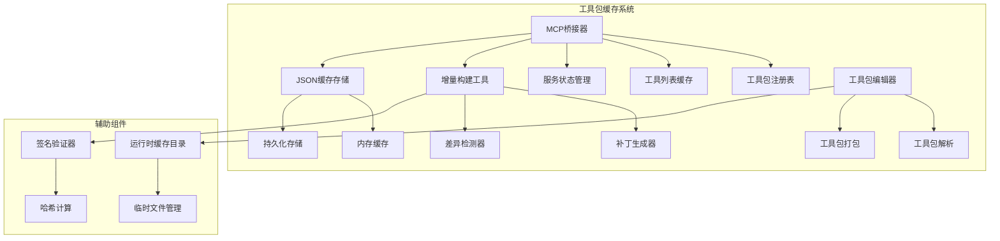
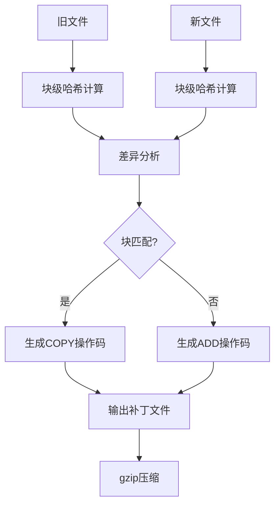
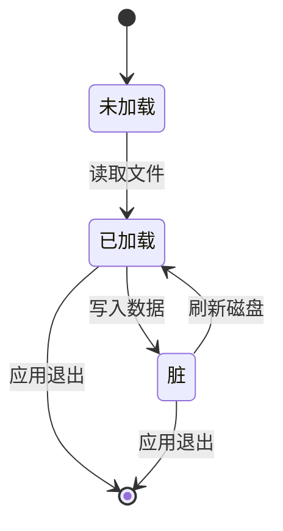
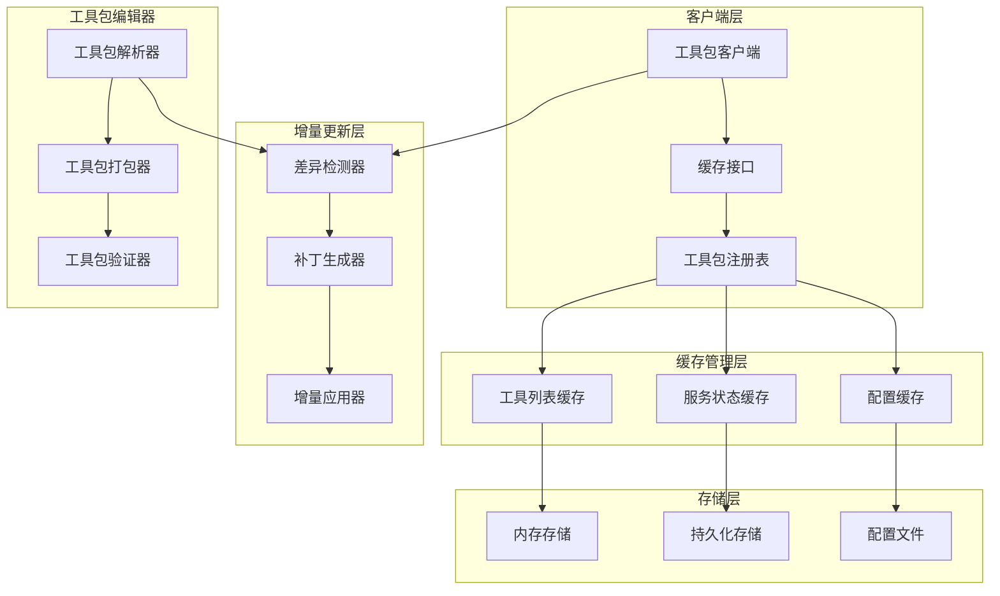
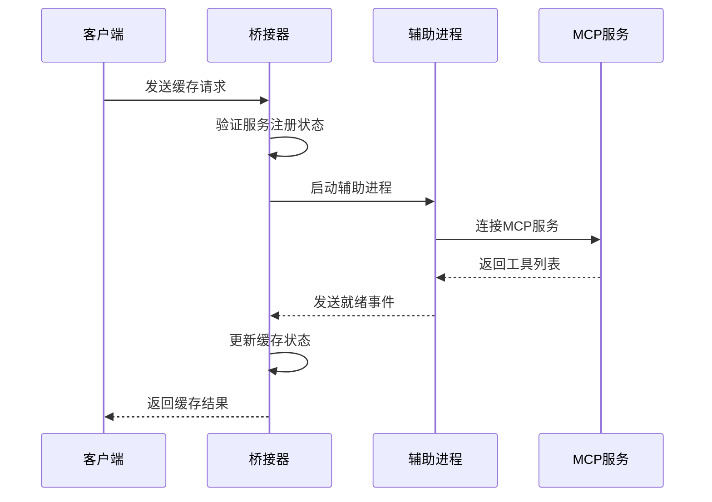
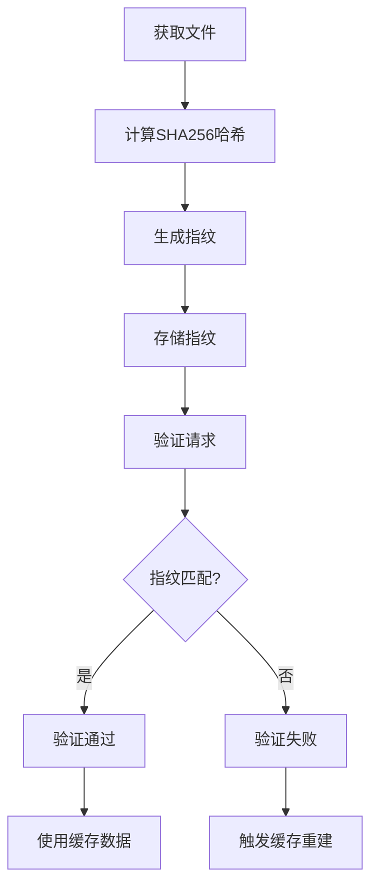
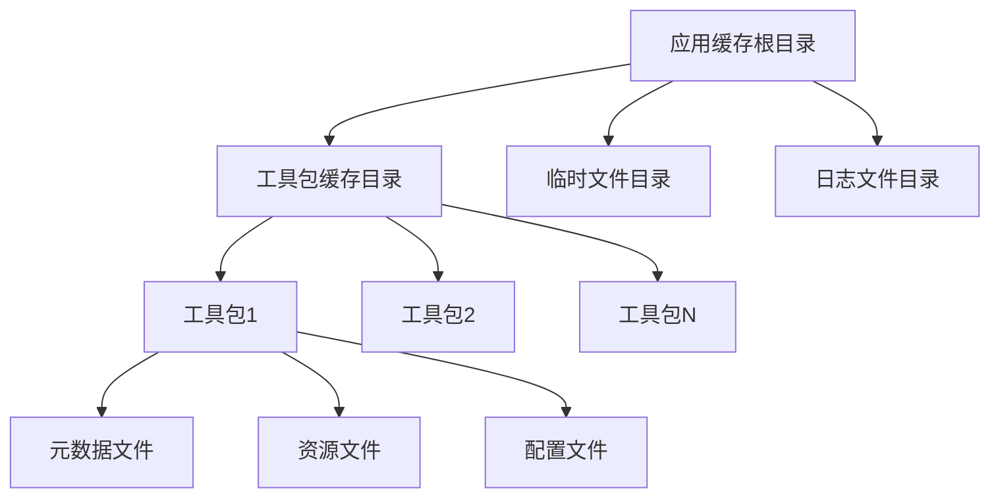
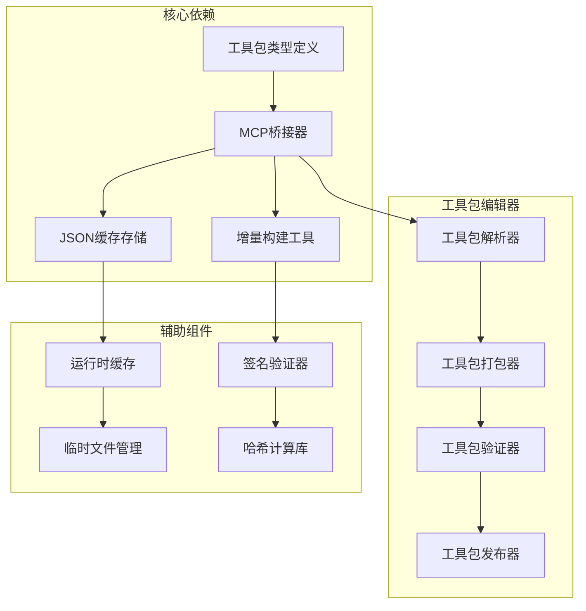

# 工具包缓存机制

<cite>
**本文档引用的文件**
- [index.ts](file://tools/mcp_bridge/index.ts)
- [index.js](file://app/src/main/assets/bridge/index.js)
- [toolpkg.d.ts](file://examples/types/toolpkg.d.ts)
- [build_patch.py](file://tools/hotbuild/build_patch.py)
- [qqbot_state.ts](file://examples/qqbot/src/shared/qqbot_state.ts)
- [apk_reverse.ts](file://examples/apktool/src/packages/apk_reverse.ts)
- [operit_editor.ts](file://examples/operit_editor.ts)
- [operit_editor.js](file://examples/operit_editor.js)
</cite>

## 目录
1. [简介](#简介)
2. [项目结构](#项目结构)
3. [核心组件](#核心组件)
4. [架构概览](#架构概览)
5. [详细组件分析](#详细组件分析)
6. [依赖关系分析](#依赖关系分析)
7. [性能考虑](#性能考虑)
8. [故障排除指南](#故障排除指南)
9. [结论](#结论)

## 简介

Operit 工具包缓存机制是一个多层次的缓存系统，旨在优化工具包的加载、管理和更新效率。该系统通过多种缓存策略和机制，包括缓存层次结构、缓存粒度控制、缓存失效策略、缓存预热机制等，实现了高效的工具包管理。

系统主要包含以下核心功能：
- **工具包缓存管理**：支持工具包的缓存、预热和失效控制
- **增量更新机制**：基于差异检测的增量打包和解压
- **缓存签名验证**：文件指纹计算和完整性校验
- **存储管理**：磁盘空间分配和缓存清理策略
- **性能优化**：并发访问控制和异步加载机制

## 项目结构



**图表来源**
- [index.ts:84-117](file://tools/mcp_bridge/index.ts#L84-L117)
- [build_patch.py:48-141](file://tools/hotbuild/build_patch.py#L48-L141)

## 核心组件

### MCP桥接器缓存管理

MCP桥接器是整个缓存系统的核心组件，负责管理工具包服务的生命周期和缓存状态。

**关键特性：**
- **统一服务管理**：支持本地和远程MCP服务的统一管理
- **工具列表缓存**：维护每个服务的工具列表缓存
- **服务状态跟踪**：跟踪服务的活跃状态和就绪状态
- **超时管理**：提供请求超时和服务闲置超时机制

**缓存数据结构：**
- `mcpToolsMap`: 存储服务名称到工具列表的映射
- `serviceReadyMap`: 存储服务就绪状态
- `serviceRegistry`: 服务注册表，包含服务配置信息

### 增量构建系统

增量构建系统通过差异检测和智能打包算法，实现高效的工具包更新。

**核心算法：**
- **块级差异检测**：使用SHA1哈希进行块级比较
- **操作码序列**：使用COPY和ADD操作码表示差异
- **压缩存储**：采用gzip压缩减少存储空间

**数据流：**


**图表来源**
- [build_patch.py:48-141](file://tools/hotbuild/build_patch.py#L48-L141)

### JSON缓存存储

JSON缓存存储提供了内存级别的缓存机制，支持异步读写和批量刷新。

**缓存策略：**
- **懒加载**：首次访问时才从磁盘读取
- **脏标记**：跟踪缓存项是否需要持久化
- **批量刷新**：支持批量写入磁盘

**缓存生命周期：**


**图表来源**
- [qqbot_state.ts:54-89](file://examples/qqbot/src/shared/qqbot_state.ts#L54-L89)

## 架构概览



**图表来源**
- [index.ts:84-117](file://tools/mcp_bridge/index.ts#L84-L117)
- [toolpkg.d.ts:655-676](file://examples/types/toolpkg.d.ts#L655-L676)

## 详细组件分析

### 工具包缓存接口

工具包缓存接口提供了统一的缓存访问方法，支持同步和异步操作。

**核心方法：**
- `readResource(key, outputFileName?, internal?)`: 读取资源文件
- `getConfigDir(pluginId?)`: 获取配置目录路径
- `registerToolboxUiModule(def)`: 注册UI模块
- `registerToolLifecycleHook(def)`: 注册工具生命周期钩子

**缓存策略：**
- **按需加载**：只在需要时加载资源文件
- **内部/外部资源分离**：区分内部和外部资源的缓存策略
- **插件隔离**：每个插件拥有独立的配置目录

**章节来源**
- [toolpkg.d.ts:655-676](file://examples/types/toolpkg.d.ts#L655-L676)

### MCP服务缓存管理

MCP服务缓存管理器负责管理MCP服务的生命周期和缓存状态。

**服务状态管理：**


**图表来源**
- [index.ts:507-561](file://tools/mcp_bridge/index.ts#L507-L561)

**关键功能：**
- **服务发现**：自动发现和注册可用的MCP服务
- **状态同步**：保持服务状态与实际运行状态一致
- **错误处理**：处理服务启动失败和连接异常
- **重连机制**：实现智能的自动重连逻辑

### 增量更新机制

增量更新机制通过智能的差异检测和补丁应用，实现高效的工具包更新。

**差异检测算法：**
- **块级比较**：将文件分割为固定大小的块进行比较
- **哈希索引**：使用SHA1哈希值快速定位相同块
- **操作码生成**：根据差异生成最优的操作码序列

**补丁格式：**
```
[Magic Header][Block Size][Old Size][New Size][Old SHA256][New SHA256][操作码序列][结束标记]
```

**章节来源**
- [build_patch.py:48-141](file://tools/hotbuild/build_patch.py#L48-L141)

### 缓存签名验证

缓存签名验证确保缓存数据的完整性和正确性。

**验证机制：**
- **SHA256指纹**：计算文件的SHA256哈希值作为指纹
- **树状签名**：对ZIP文件的目录结构生成签名
- **版本匹配**：验证源文件和目标文件的版本信息

**验证流程：**


**图表来源**
- [build_patch.py:33-46](file://tools/hotbuild/build_patch.py#L33-L46)

### 工具包存储管理

工具包存储管理系统负责管理工具包的存储和清理。

**存储策略：**
- **运行时缓存**：使用应用的缓存目录存储临时文件
- **磁盘空间监控**：实时监控磁盘使用情况
- **自动清理**：定期清理过期和无效的缓存文件

**缓存目录结构：**


**图表来源**
- [apk_reverse.ts:593-601](file://examples/apktool/src/packages/apk_reverse.ts#L593-L601)

## 依赖关系分析



**图表来源**
- [toolpkg.d.ts:1-718](file://examples/types/toolpkg.d.ts#L1-L718)
- [index.ts:1-800](file://tools/mcp_bridge/index.ts#L1-L800)

**依赖特点：**
- **低耦合高内聚**：各组件职责明确，依赖关系清晰
- **可扩展性**：支持新的缓存策略和存储后端
- **向后兼容**：保持API的向后兼容性

## 性能考虑

### 并发访问控制

系统采用多层并发控制机制，确保缓存操作的线程安全：

**锁机制：**
- **读写锁**：支持多个读操作和独占写操作
- **乐观锁**：使用版本号避免写冲突
- **超时机制**：防止死锁和长时间阻塞

**性能优化：**
- **批量操作**：支持批量缓存读写操作
- **异步处理**：非关键操作采用异步执行
- **预加载策略**：提前加载可能使用的缓存数据

### 缓存预热机制

系统提供智能的缓存预热功能，提升首次访问性能：

**预热策略：**
- **静态预热**：预加载常用工具包
- **动态预热**：根据使用模式预测需要的工具包
- **渐进式预热**：分批加载大型工具包

### 存储优化

**压缩策略：**
- **gzip压缩**：对文本和JSON数据进行压缩
- **增量压缩**：只压缩变化的数据块
- **智能缓存**：根据访问频率调整缓存策略

## 故障排除指南

### 常见问题诊断

**缓存失效问题：**
1. 检查缓存目录权限
2. 验证磁盘空间充足
3. 确认文件签名验证通过

**服务连接问题：**
1. 查看服务日志输出
2. 验证网络连接状态
3. 检查防火墙设置

**性能问题：**
1. 分析缓存命中率
2. 监控内存使用情况
3. 检查磁盘I/O性能

### 错误恢复机制

**自动恢复：**
- **服务重启**：自动重启失败的服务
- **缓存重建**：自动重建损坏的缓存
- **数据修复**：尝试修复损坏的数据文件

**手动干预：**
- **缓存清理**：提供强制清理缓存的接口
- **配置重置**：支持重置到默认配置
- **日志导出**：提供详细的诊断日志

## 结论

Operit 工具包缓存机制通过多层次的设计和优化，实现了高效、可靠的工具包管理。系统的主要优势包括：

**技术优势：**
- **灵活的缓存策略**：支持多种缓存策略和粒度控制
- **智能的增量更新**：显著减少更新时间和存储空间
- **完善的错误处理**：提供全面的故障检测和恢复机制

**性能优势：**
- **高效的并发控制**：通过多层锁机制保证线程安全
- **智能的预加载策略**：提升用户体验和响应速度
- **优化的存储管理**：合理利用磁盘空间和内存资源

**可维护性：**
- **清晰的架构设计**：模块化设计便于维护和扩展
- **完善的监控机制**：提供全面的性能和健康监控
- **详细的文档支持**：完整的API文档和使用指南

该缓存机制为Operit平台提供了强大的工具包管理能力，为性能工程师和系统管理员提供了完整的优化指导和故障排查工具。