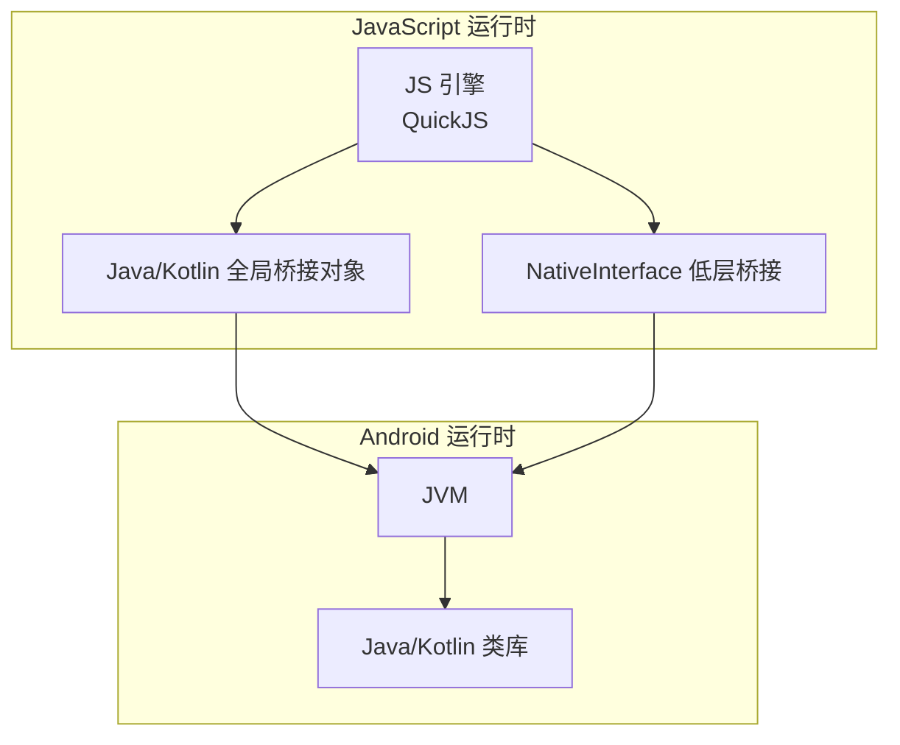
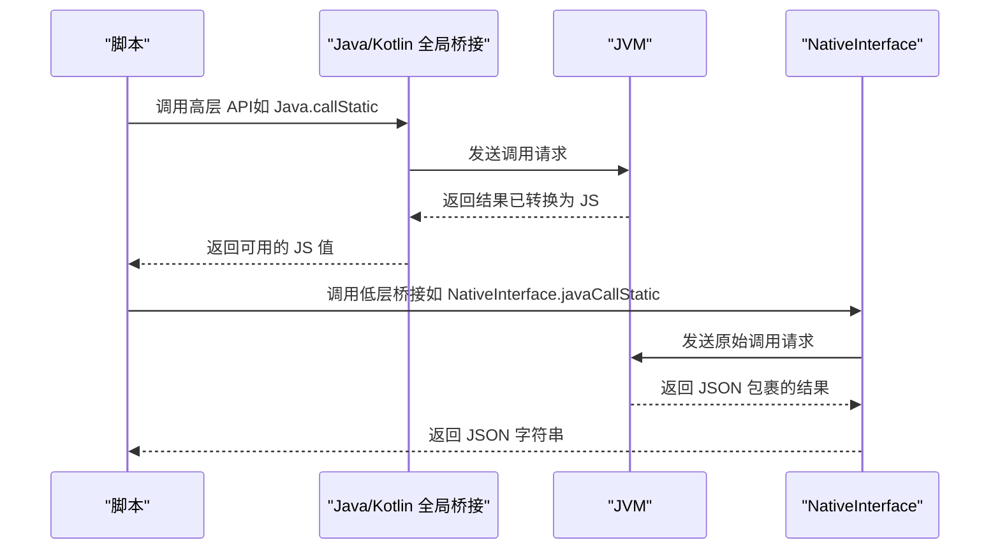
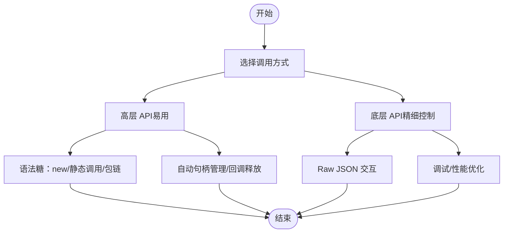
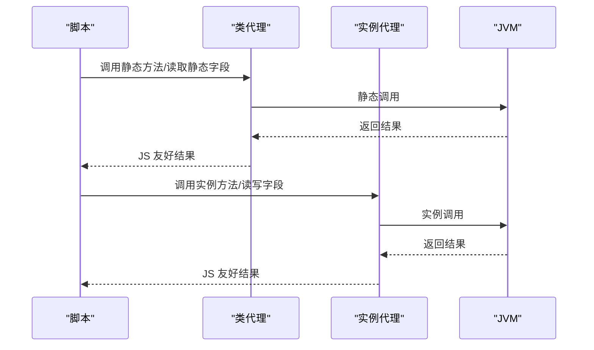
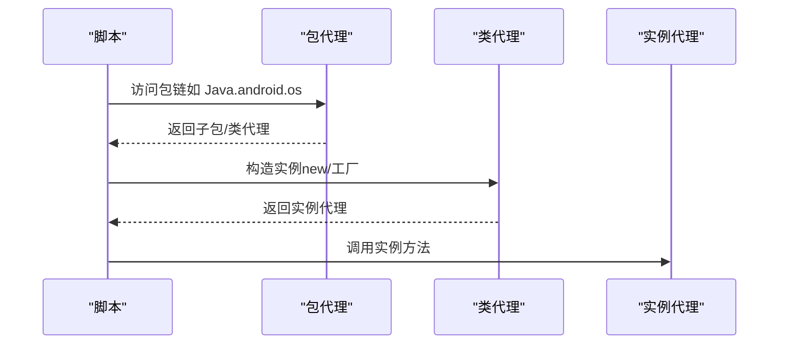
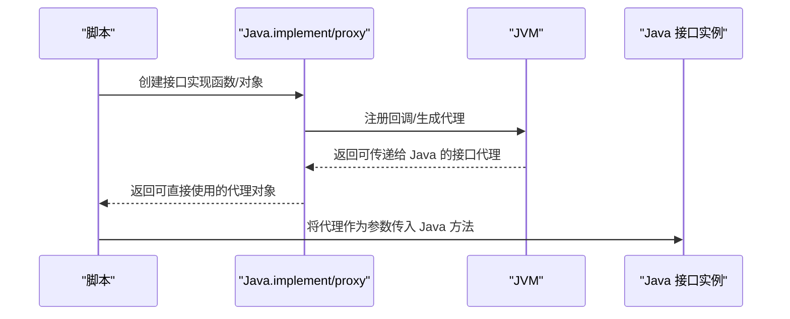
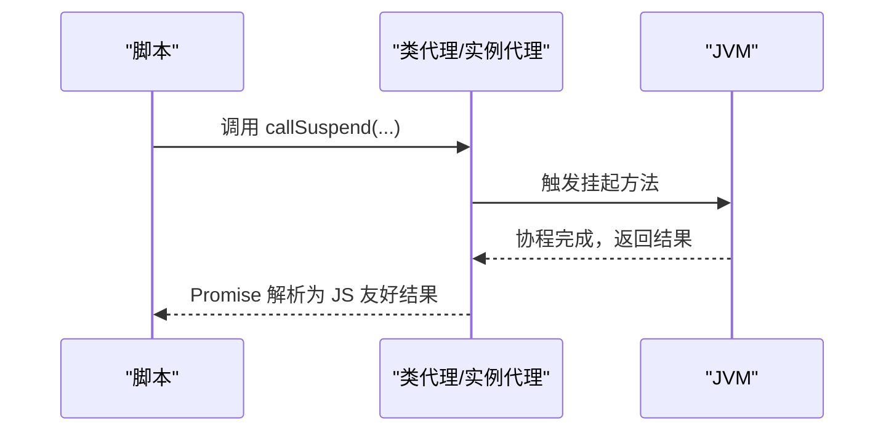
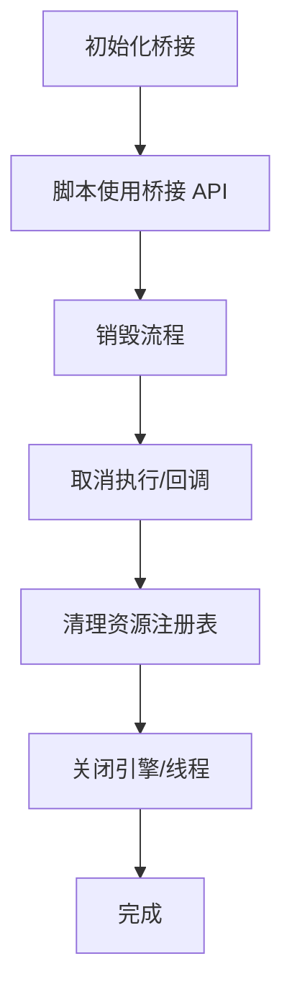
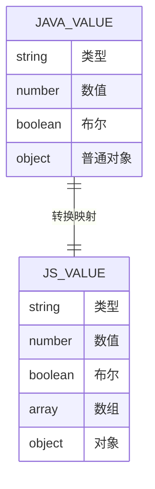
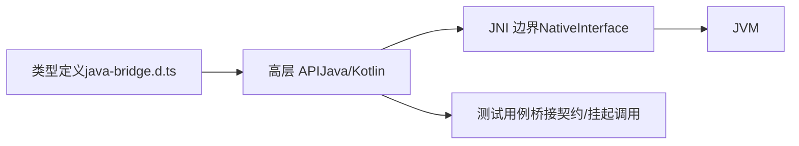

# Java/Kotlin 桥接系统

<cite>
**本文引用的文件**
- [JAVA_BRIDGE_INTERFACE.md](file://docs/JAVA_BRIDGE_INTERFACE.md)
- [java-bridge.d.ts](file://examples/types/java-bridge.d.ts)
- [java_bridge.ts](file://examples/java_bridge.ts)
- [java_bridge.js](file://examples/java_bridge.js)
- [bridge_edges.js](file://app/src/androidTest/js/com/ai/assistance/operit/core/tools/javascript/bridge_edges/bridge_edges.js)
- [suspend_await.js](file://app/src/androidTest/js/com/ai/assistance/operit/core/tools/javascript/bridge_contract/suspend_await.js)
- [quickjs_jni.cpp](file://quickjs/src/main/cpp/quickjs_jni.cpp)
</cite>

## 目录
1. [简介](#简介)
2. [项目结构](#项目结构)
3. [核心组件](#核心组件)
4. [架构总览](#架构总览)
5. [组件详解](#组件详解)
6. [依赖关系分析](#依赖关系分析)
7. [性能考量](#性能考量)
8. [故障排查指南](#故障排查指南)
9. [结论](#结论)
10. [附录](#附录)

## 简介
本文件面向 Operit 的 Java/Kotlin 桥接系统，系统性阐述高层 API 与底层 API 的差异与使用场景；详解静态调用、构造实例、接口实现等核心能力；深入说明异步挂起调用机制（Promise 返回与回调处理）；并总结生命周期管理（句柄自动管理、回调标记释放、实例代理包装）等自动处理机制。文末提供完整使用示例，覆盖 Android SDK 类访问、宿主应用类调用、接口回调实现等真实场景。

## 项目结构
桥接系统由“类型定义 + 运行时注入 + 测试用例 + JNI 边界”四部分组成：
- 类型定义：提供 TypeScript 类型契约，明确桥接 API 的输入输出与行为边界
- 运行时注入：在 JS 引擎中注入 Java/Kotlin 全局桥接对象，暴露高层 API
- 测试用例：覆盖包链访问、静态/实例调用、接口实现、挂起调用、低层桥接等关键路径
- JNI 边界：通过 NativeInterface 提供底层桥接调用，承载高性能与细粒度控制

**图表来源**
- [quickjs_jni.cpp:265-331](file://quickjs/src/main/cpp/quickjs_jni.cpp#L265-L331)
- [quickjs_jni.cpp:567-598](file://quickjs/src/main/cpp/quickjs_jni.cpp#L567-L598)

**章节来源**
- [JAVA_BRIDGE_INTERFACE.md:13-215](file://docs/JAVA_BRIDGE_INTERFACE.md#L13-L215)
- [java-bridge.d.ts:177-202](file://examples/types/java-bridge.d.ts#L177-L202)

## 核心组件
- Java/Kotlin 全局桥接对象：提供高层 API，如类与包访问、静态/实例调用、接口实现、挂起调用、上下文获取、DEX/JAR 加载等
- 类代理与实例代理：对 Java/Kotlin 类与实例进行动态代理，支持语法糖与显式调用
- 包代理：支持以链式路径访问包与类
- 接口实现与代理：将 JS 函数或对象映射为 Java/Kotlin 接口实现
- 低层桥接 NativeInterface：提供底层调用（类存在性检查、静态调用、实例调用、静态字段读取等），用于调试与性能敏感场景
- 挂起调用 Java.callSuspend：统一返回 Promise，等待协程式挂起方法完成

**章节来源**
- [java-bridge.d.ts:115-172](file://examples/types/java-bridge.d.ts#L115-L172)
- [JAVA_BRIDGE_INTERFACE.md:75-137](file://docs/JAVA_BRIDGE_INTERFACE.md#L75-L137)

## 架构总览
桥接系统采用“高层 API + 低层桥接 + 类型约束”的分层设计：
- 高层 API：面向脚本开发者的易用接口，隐藏句柄与回调管理细节
- 低层桥接：直接对接 NativeInterface，便于性能优化与问题定位
- 类型约束：通过类型定义明确输入输出与转换规则，保证跨语言互操作的稳定性

**图表来源**
- [JAVA_BRIDGE_INTERFACE.md:75-137](file://docs/JAVA_BRIDGE_INTERFACE.md#L75-L137)
- [bridge_edges.js:381-433](file://app/src/androidTest/js/com/ai/assistance/operit/core/tools/javascript/bridge_edges/bridge_edges.js#L381-L433)

## 组件详解

### 高层 API 与底层 API 的区别与使用场景
- 高层 API（推荐）：直接使用 Java.java.lang.StringBuilder、Java.callStatic、Java.newInstance、Java.implement 等，语法简洁，适合大多数业务场景
- 底层 API（低层桥接）：通过 NativeInterface.javaCallStatic、javaNewInstance、javaCallInstance 等直接与 JVM 交互，适合调试、性能敏感或需要精确控制的场景

**章节来源**
- [JAVA_BRIDGE_INTERFACE.md:22-90](file://docs/JAVA_BRIDGE_INTERFACE.md#L22-L90)
- [bridge_edges.js:381-433](file://app/src/androidTest/js/com/ai/assistance/operit/core/tools/javascript/bridge_edges/bridge_edges.js#L381-L433)

### 静态调用与实例调用
- 静态调用：通过类代理或顶层 API 调用静态方法与读取静态字段
- 实例调用：通过实例代理调用实例方法与读写字段，支持语法糖与显式调用

**图表来源**
- [java-bridge.d.ts:143-158](file://examples/types/java-bridge.d.ts#L143-L158)
- [JAVA_BRIDGE_INTERFACE.md:35-74](file://docs/JAVA_BRIDGE_INTERFACE.md#L35-L74)

**章节来源**
- [JAVA_BRIDGE_INTERFACE.md:35-74](file://docs/JAVA_BRIDGE_INTERFACE.md#L35-L74)
- [java_bridge.ts:109-141](file://examples/java_bridge.ts#L109-L141)

### 构造实例与包链访问
- 构造实例：支持 new 与工厂方法两种方式
- 包链访问：支持 Java.java.lang.StringBuilder、Java.android.os.Build 等链式路径

**图表来源**
- [java-bridge.d.ts:164-172](file://examples/types/java-bridge.d.ts#L164-L172)
- [java_bridge.ts:143-163](file://examples/java_bridge.ts#L143-L163)

**章节来源**
- [java_bridge.ts:143-163](file://examples/java_bridge.ts#L143-L163)
- [JAVA_BRIDGE_INTERFACE.md:22-34](file://docs/JAVA_BRIDGE_INTERFACE.md#L22-L34)

### 接口实现与代理（Java.implement / Java.proxy）
- 单接口/SAM 场景：可直接传入 JS 函数
- 多接口场景：需指定接口名称或类代理
- 回调映射：对象方法映射到接口方法，支持 getX()/isX()/setX(v) 到属性的映射

**图表来源**
- [java-bridge.d.ts:177-187](file://examples/types/java-bridge.d.ts#L177-L187)
- [JAVA_BRIDGE_INTERFACE.md:91-126](file://docs/JAVA_BRIDGE_INTERFACE.md#L91-L126)

**章节来源**
- [java_bridge.ts:165-202](file://examples/java_bridge.ts#L165-L202)
- [java_bridge.ts:204-224](file://examples/java_bridge.ts#L204-L224)
- [JAVA_BRIDGE_INTERFACE.md:91-126](file://docs/JAVA_BRIDGE_INTERFACE.md#L91-L126)

### 异步挂起调用（Java.callSuspend）
- 统一返回 Promise，等待协程式挂起方法完成
- 支持类代理与实例代理上的 callSuspend
- 对非挂起方法会给出明确错误提示

**图表来源**
- [java-bridge.d.ts:125-126](file://examples/types/java-bridge.d.ts#L125-L126)
- [suspend_await.js:49-137](file://app/src/androidTest/js/com/ai/assistance/operit/core/tools/javascript/bridge_contract/suspend_await.js#L49-L137)

**章节来源**
- [JAVA_BRIDGE_INTERFACE.md:127-137](file://docs/JAVA_BRIDGE_INTERFACE.md#L127-L137)
- [suspend_await.js:49-137](file://app/src/androidTest/js/com/ai/assistance/operit/core/tools/javascript/bridge_contract/suspend_await.js#L49-L137)

### 生命周期管理与句柄自动管理
- 句柄与代理：Java/Kotlin 对象通过代理返回，内部携带句柄信息，避免直接暴露 JVM 指针
- 自动释放：在销毁流程中统一清理回调、资源注册表与引擎，确保无泄漏
- 回调标记释放：在销毁前取消挂起回调，防止回调在销毁后被触发

**章节来源**
- [my_docs/Operit 沙箱执行系统设计思想与详细流程分析.md:598-650](file://my_docs/Operit 沙箱执行系统设计思想与详细流程分析.md#L598-L650)

### 类型转换与数据模型
- Java/Kotlin → JS：Map/List/数组等归一化为 JS 对象/数组；普通对象保留为实例代理
- JS → Java/Kotlin：JS 数组/对象映射到集合/接口代理；Java 实例代理透传回 JVM

**章节来源**
- [JAVA_BRIDGE_INTERFACE.md:139-177](file://docs/JAVA_BRIDGE_INTERFACE.md#L139-L177)

## 依赖关系分析
桥接系统的关键依赖关系如下：
- Java/Kotlin 全局桥接对象依赖 QuickJS 运行时与 JNI 边界
- 低层桥接 NativeInterface 直接对接 JVM，用于调试与性能优化
- 类型定义为运行时行为提供契约，确保跨语言互操作的稳定性

**图表来源**
- [java-bridge.d.ts:177-202](file://examples/types/java-bridge.d.ts#L177-L202)
- [quickjs_jni.cpp:567-598](file://quickjs/src/main/cpp/quickjs_jni.cpp#L567-L598)

**章节来源**
- [JAVA_BRIDGE_INTERFACE.md:13-215](file://docs/JAVA_BRIDGE_INTERFACE.md#L13-L215)
- [bridge_edges.js:381-433](file://app/src/androidTest/js/com/ai/assistance/operit/core/tools/javascript/bridge_edges/bridge_edges.js#L381-L433)

## 性能考量
- 优先使用高层 API：语法糖与代理封装带来更好的开发体验
- 在性能敏感路径可使用低层桥接：减少中间层开销，但需自行处理 JSON 与错误
- 合理使用挂起调用：避免阻塞主线程，充分利用 Promise 异步特性
- 控制对象生命周期：及时释放不再使用的实例代理，避免内存泄漏

## 故障排查指南
- 类不存在：使用 Java.classExists 或 NativeInterface.javaClassExists 进行诊断
- 静态调用失败：确认方法签名与参数类型匹配；必要时使用低层桥接查看原始 JSON
- 接口实现无效：检查 Java.implement/proxy 的参数是否正确，回调是否在销毁前被释放
- 挂起调用报错：确认目标方法为挂起方法，非挂起方法会拒绝并给出明确提示

**章节来源**
- [bridge_edges.js:381-433](file://app/src/androidTest/js/com/ai/assistance/operit/core/tools/javascript/bridge_edges/bridge_edges.js#L381-L433)
- [suspend_await.js:115-135](file://app/src/androidTest/js/com/ai/assistance/operit/core/tools/javascript/bridge_contract/suspend_await.js#L115-L135)

## 结论
Operit 的 Java/Kotlin 桥接系统通过“高层 API + 低层桥接 + 类型约束 + 生命周期管理”的设计，在易用性与可控性之间取得平衡。开发者可优先使用高层 API 快速构建功能，同时在需要时借助低层桥接进行调试与优化。配合完善的类型定义与测试用例，系统能够稳定地支撑 Android SDK 类访问、宿主应用类调用与接口回调实现等复杂场景。

## 附录

### 使用示例清单
- 包链访问与静态调用：访问 Java.java.lang.System.currentTimeMillis 与 Java.callStatic
- 构造实例与实例调用：new Java.java.lang.StringBuilder 与 append/toString
- 接口实现：Java.implement(Runnable, ...) 与 Java.implement(Callable, ...)
- 低层桥接：NativeInterface.javaCallStatic 与 javaNewInstance/javaCallInstance
- 挂起调用：Java.callSuspend 与类/实例代理上的 callSuspend
- Android SDK 访问：Java.android.os.Build、VERSION、Process、SystemClock
- 宿主应用类调用：Java.com.ai.assistance.operit.core.application.ActivityLifecycleManager

**章节来源**
- [java_bridge.ts:109-163](file://examples/java_bridge.ts#L109-L163)
- [java_bridge.ts:165-247](file://examples/java_bridge.ts#L165-L247)
- [java_bridge.ts:249-319](file://examples/java_bridge.ts#L249-L319)
- [suspend_await.js:49-137](file://app/src/androidTest/js/com/ai/assistance/operit/core/tools/javascript/bridge_contract/suspend_await.js#L49-L137)