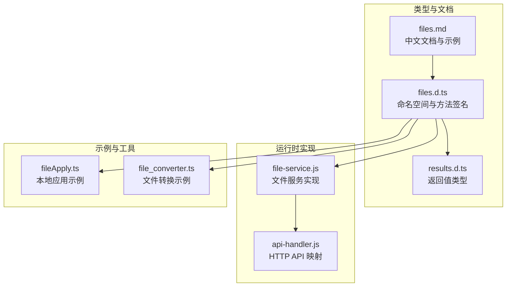
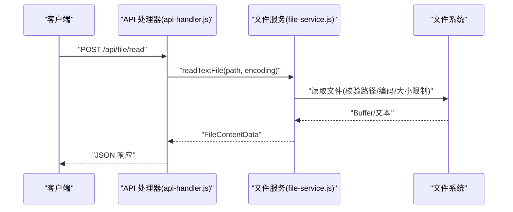
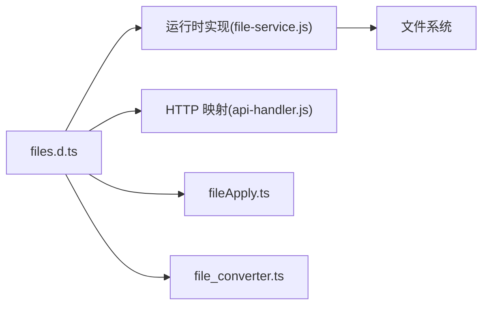

# Files API

<cite>
**本文引用的文件列表**
- [files.d.ts](file://examples/types/files.d.ts)
- [results.d.ts](file://examples/types/results.d.ts)
- [files.md](file://docs/package_dev/files.md)
- [file-service.js](file://examples/windows_control/resources/pc_agent/operit-pc-agent/src/services/file-service.js)
- [api-handler.js](file://examples/windows_control/resources/pc_agent/operit-pc-agent/src/handlers/api-handler.js)
- [fileApply.ts](file://examples/github/src/local/fileApply.ts)
- [file_converter.ts](file://examples/file_converter.ts)
</cite>

## 目录
1. [简介](#简介)
2. [项目结构与命名空间](#项目结构与命名空间)
3. [核心组件与类型](#核心组件与类型)
4. [架构总览](#架构总览)
5. [详细组件分析](#详细组件分析)
6. [依赖关系分析](#依赖关系分析)
7. [性能与安全考量](#性能与安全考量)
8. [故障排查指南](#故障排查指南)
9. [结论](#结论)
10. [附录：常见场景与最佳实践](#附录常见场景与最佳实践)

## 简介
本文件为 Operit 的 Files 命名空间 API 参考文档，面向开发者与集成者，系统梳理文件系统操作接口、参数与返回值、错误与边界条件、编码与路径处理、权限与安全、性能与并发策略，并结合仓库中的类型定义、服务实现与示例脚本给出可落地的实践建议与图示说明。

## 项目结构与命名空间
- 命名空间入口：Tools.Files
- 类型定义来源：examples/types/files.d.ts
- 结果数据结构：examples/types/results.d.ts
- 实现参考（PC Agent）：examples/windows_control/resources/pc_agent/operit-pc-agent/src/services/file-service.js
- API 映射参考（HTTP 层）：examples/windows_control/resources/pc_agent/operit-pc-agent/src/handlers/api-handler.js
- 典型使用示例：examples/github/src/local/fileApply.ts、examples/file_converter.ts
- 中文文档：docs/package_dev/files.md



图表来源
- [files.d.ts](file://examples/types/files.d.ts)
- [results.d.ts](file://examples/types/results.d.ts)
- [file-service.js](file://examples/windows_control/resources/pc_agent/operit-pc-agent/src/services/file-service.js)
- [api-handler.js](file://examples/windows_control/resources/pc_agent/operit-pc-agent/src/handlers/api-handler.js)
- [fileApply.ts](file://examples/github/src/local/fileApply.ts)
- [file_converter.ts](file://examples/file_converter.ts)
- [files.md](file://docs/package_dev/files.md)

章节来源
- [files.d.ts](file://examples/types/files.d.ts)
- [results.d.ts](file://examples/types/results.d.ts)
- [files.md](file://docs/package_dev/files.md)

## 核心组件与类型
- 命名空间：Tools.Files
- 执行环境：FileEnvironment = "android" | "linux"
- 操作类型：ApplyFileType = "replace" | "delete" | "create"
- 关键返回类型：DirectoryListingData、FileContentData、BinaryFileContentData、FilePartContentData、FileOperationData、FileExistsData、FindFilesResultData、FileInfoData、FileApplyResultData、GrepResultData

章节来源
- [files.d.ts](file://examples/types/files.d.ts)
- [results.d.ts](file://examples/types/results.d.ts)

## 架构总览
Files API 在运行时由“类型层”（Typescript 接口）与“实现层”（Node.js 文件服务）构成，HTTP 层通过 API 处理器将请求路由到文件服务，最终落盘或返回结构化结果。



图表来源
- [api-handler.js](file://examples/windows_control/resources/pc_agent/operit-pc-agent/src/handlers/api-handler.js)
- [file-service.js](file://examples/windows_control/resources/pc_agent/operit-pc-agent/src/services/file-service.js)

## 详细组件分析

### 1) 列表与读取
- list(path, environment?)
  - 功能：列出目录内容，支持递归深度限制
  - 参数：path、environment
  - 返回：DirectoryListingData
  - 边界：深度上限、非目录报错
- read(path 或 { path, environment?, intent?, direct_image? })
  - 功能：完整读取文本文件，支持编码与意图增强
  - 返回：FileContentData
- readPart(path, startLine?, endLine?, environment?)
  - 功能：按行范围读取文件片段
  - 返回：FilePartContentData
- readBinary(path, environment?)
  - 功能：读取二进制文件为 Base64
  - 返回：BinaryFileContentData

章节来源
- [files.d.ts](file://examples/types/files.d.ts)
- [results.d.ts](file://examples/types/results.d.ts)
- [file-service.js](file://examples/windows_control/resources/pc_agent/operit-pc-agent/src/services/file-service.js)

### 2) 写入与修改
- write(path, content, append?, environment?)
  - 功能：写入文本，可追加
  - 返回：FileOperationData
- writeBinary(path, base64Content, environment?)
  - 功能：写入 Base64 编码的二进制内容
  - 返回：FileOperationData
- apply(path, type, old?, newContent?, environment?)
  - 功能：基于精确匹配的替换/删除/创建
  - 返回：FileApplyResultData（含 aiDiffInstructions）

章节来源
- [files.d.ts](file://examples/types/files.d.ts)
- [results.d.ts](file://examples/types/results.d.ts)
- [fileApply.ts](file://examples/github/src/local/fileApply.ts)

### 3) 删除、移动、复制与建目录
- deleteFile(path, recursive?, environment?)
  - 功能：删除文件或目录（可递归）
  - 返回：FileOperationData
- move(source, destination, environment?)
  - 功能：移动文件
  - 返回：FileOperationData
- copy(source, destination, recursive?, sourceEnvironment?, destEnvironment?)
  - 功能：跨环境复制（Android <-> Linux）
  - 返回：FileOperationData
- mkdir(path, create_parents?, environment?)
  - 功能：创建目录（可递归创建父目录）
  - 返回：FileOperationData

章节来源
- [files.d.ts](file://examples/types/files.d.ts)
- [results.d.ts](file://examples/types/results.d.ts)

### 4) 搜索与信息
- exists(path, environment?)
  - 功能：检查路径存在性与类型
  - 返回：FileExistsData
- info(path, environment?)
  - 功能：获取文件详细信息（类型、大小、权限、时间戳等）
  - 返回：FileInfoData
- find(path, pattern, options?, environment?)
  - 功能：按模式查找文件
  - 返回：FindFilesResultData
- grep(path, pattern, options?)
  - 功能：正则检索，支持文件过滤、大小写、上下文行数、最大结果数
  - 返回：GrepResultData
- grepContext(path, intent, options?)
  - 功能：基于意图的语义检索
  - 返回：GrepResultData

章节来源
- [files.d.ts](file://examples/types/files.d.ts)
- [results.d.ts](file://examples/types/results.d.ts)

### 5) 压缩、打开、分享、下载
- zip(source, destination, environment?, include_root_directory?)
  - 功能：压缩文件或目录
  - 返回：FileOperationData
- unzip(source, destination, environment?)
  - 功能：解压归档
  - 返回：FileOperationData
- open(path, environment?)
  - 功能：调用系统处理器打开文件
  - 返回：FileOperationData
- share(path, title?, environment?)
  - 功能：分享文件给其他应用
  - 返回：FileOperationData
- download(url 或 { url?, visit_key?, link_number?, image_number?, destination, environment?, headers? })
  - 功能：从 URL 下载文件，或配合 visit_web 结果继续下载
  - 返回：FileOperationData

章节来源
- [files.d.ts](file://examples/types/files.d.ts)
- [results.d.ts](file://examples/types/results.d.ts)
- [files.md](file://docs/package_dev/files.md)

### 6) 类型与类图（代码级）
```mermaid
classDiagram
class FilesNamespace {
+list(path, environment?) : Promise~DirectoryListingData~
+read(path) : Promise~FileContentData~
+read(options) : Promise~FileContentData~
+readPart(path, startLine?, endLine?, environment?) : Promise~FilePartContentData~
+readBinary(path, environment?) : Promise~BinaryFileContentData~
+write(path, content, append?, environment?) : Promise~FileOperationData~
+writeBinary(path, base64Content, environment?) : Promise~FileOperationData~
+apply(path, type, old?, newContent?, environment?) : Promise~FileApplyResultData~
+deleteFile(path, recursive?, environment?) : Promise~FileOperationData~
+move(source, destination, environment?) : Promise~FileOperationData~
+copy(source, destination, recursive?, sourceEnvironment?, destEnvironment?) : Promise~FileOperationData~
+mkdir(path, create_parents?, environment?) : Promise~FileOperationData~
+exists(path, environment?) : Promise~FileExistsData~
+info(path, environment?) : Promise~FileInfoData~
+find(path, pattern, options?, environment?) : Promise~FindFilesResultData~
+grep(path, pattern, options?) : Promise~GrepResultData~
+grepContext(path, intent, options?) : Promise~GrepResultData~
+zip(source, destination, environment?, include_root_directory?) : Promise~FileOperationData~
+unzip(source, destination, environment?) : Promise~FileOperationData~
+open(path, environment?) : Promise~FileOperationData~
+share(path, title?, environment?) : Promise~FileOperationData~
+download(url, destination, environment?, headers?) : Promise~FileOperationData~
+download(options) : Promise~FileOperationData~
}
class FileEnvironment {
<<enumeration>>
"android"
"linux"
}
class ApplyFileType {
<<enumeration>>
"replace"
"delete"
"create"
}
FilesNamespace --> FileEnvironment : "使用"
FilesNamespace --> ApplyFileType : "使用"
```

图表来源
- [files.d.ts](file://examples/types/files.d.ts)

## 依赖关系分析
- 类型层（files.d.ts）定义了所有 API 方法签名与返回类型（results.d.ts）
- 实现层（file-service.js）提供 Node.js 文件系统操作的具体实现，包含编码规范化、分段读取、Base64 校验与大小限制、目录遍历与深度控制等
- HTTP 层（api-handler.js）将 REST 请求映射到文件服务方法，统一鉴权与日志
- 示例层（fileApply.ts、file_converter.ts）展示典型用法与集成模式



图表来源
- [files.d.ts](file://examples/types/files.d.ts)
- [file-service.js](file://examples/windows_control/resources/pc_agent/operit-pc-agent/src/services/file-service.js)
- [api-handler.js](file://examples/windows_control/resources/pc_agent/operit-pc-agent/src/handlers/api-handler.js)
- [fileApply.ts](file://examples/github/src/local/fileApply.ts)
- [file_converter.ts](file://examples/file_converter.ts)

章节来源
- [files.d.ts](file://examples/types/files.d.ts)
- [file-service.js](file://examples/windows_control/resources/pc_agent/operit-pc-agent/src/services/file-service.js)
- [api-handler.js](file://examples/windows_control/resources/pc_agent/operit-pc-agent/src/handlers/api-handler.js)
- [fileApply.ts](file://examples/github/src/local/fileApply.ts)
- [file_converter.ts](file://examples/file_converter.ts)

## 性能与安全考量

### 性能特性
- 分段读取与写入：readTextSegment/readTextLines、readBase64File 支持按偏移与长度读取，避免一次性加载大文件
- 大小限制：实现层对文本与 Base64 内容设置了最大字节数限制，防止内存溢出
- 目录遍历深度限制：listDirectory 支持最大深度，避免深层递归带来的性能问题
- 并发与批处理：建议在业务侧进行批量操作的并发控制与队列化，避免频繁 IO 抖动

章节来源
- [file-service.js](file://examples/windows_control/resources/pc_agent/operit-pc-agent/src/services/file-service.js)

### 安全与权限
- 路径解析与白名单：实现层对路径进行解析与校验，确保在 projectRoot 限定范围内操作
- 权限检查：实现层对可读文件进行存在性与类型校验，非文件路径直接报错
- 编码规范化：仅允许 utf8、utf16le、latin1、ascii 等受支持的编码，非法编码抛错
- Base64 校验：写入前对 Base64 字符串进行合法性与填充校验，防止异常输入
- 访问控制：HTTP 层在 API 处理器中进行令牌校验与授权判定，未授权请求拒绝

章节来源
- [file-service.js](file://examples/windows_control/resources/pc_agent/operit-pc-agent/src/services/file-service.js)
- [api-handler.js](file://examples/windows_control/resources/pc_agent/operit-pc-agent/src/handlers/api-handler.js)

## 故障排查指南
- “路径不存在”：确认 path 是否存在于 projectRoot 限定范围内，且为合法文件/目录
- “目标不是文件”：listDirectory 仅接受目录；read 系列仅接受文件
- “编码不受支持”：仅支持 utf8、utf16le、latin1、ascii
- “Base64 非法”：确保 Base64 字符串去除空白字符后长度模 4 余 0，必要时补齐等号
- “读取过大”：单次读取/写入不得超过实现层设定的最大字节数
- “HTTP 未授权”：检查请求头 token 与 API 处理器的授权逻辑

章节来源
- [file-service.js](file://examples/windows_control/resources/pc_agent/operit-pc-agent/src/services/file-service.js)
- [api-handler.js](file://examples/windows_control/resources/pc_agent/operit-pc-agent/src/handlers/api-handler.js)

## 结论
Operit 的 Files API 通过清晰的类型定义与稳健的实现，提供了覆盖文件系统常用操作的完整能力集。其分段读取、大小限制与目录深度控制等设计，兼顾了性能与安全性。结合 HTTP 映射与示例脚本，开发者可以快速构建从简单读写到复杂搜索与转换的自动化流程。

## 附录：常见场景与最佳实践

### 场景一：批量文件操作
- 建议：将大量文件的读写操作放入队列，按批次处理，避免阻塞
- 注意：合理设置环境参数（android/linux），避免跨平台路径差异导致失败

章节来源
- [files.d.ts](file://examples/types/files.d.ts)

### 场景二：文件监控与增量更新
- 建议：定期调用 list() 获取目录项，结合 exists() 与 info() 判断变更
- 注意：控制遍历深度，避免对大型目录造成性能压力

章节来源
- [files.d.ts](file://examples/types/files.d.ts)
- [file-service.js](file://examples/windows_control/resources/pc_agent/operit-pc-agent/src/services/file-service.js)

### 场景三：临时文件管理
- 建议：使用 mkdir(create_parents=true) 创建临时目录，完成后统一 deleteFile(recursive=true)
- 注意：确保临时目录位于 projectRoot 限定范围内

章节来源
- [files.d.ts](file://examples/types/files.d.ts)
- [file_service.js](file://examples/windows_control/resources/pc_agent/operit-pc-agent/src/services/file-service.js)

### 场景四：跨环境复制
- 建议：明确 sourceEnvironment 与 destEnvironment，确保目标平台可用
- 注意：copy 支持递归，但需关注目标平台的权限与磁盘配额

章节来源
- [files.d.ts](file://examples/types/files.d.ts)

### 场景五：正则与语义检索
- 建议：grep/grepContext 结合 file_pattern、context_lines、max_results 控制结果规模
- 注意：正则表达式需转义特殊字符，避免意外匹配

章节来源
- [files.d.ts](file://examples/types/files.d.ts)

### 场景六：二进制与 Base64 处理
- 建议：writeBinary/readBinary 适合图片、压缩包等二进制文件；注意大小限制
- 注意：Base64 写入前先进行规范化与校验

章节来源
- [files.d.ts](file://examples/types/files.d.ts)
- [file_service.js](file://examples/windows_control/resources/pc_agent/operit-pc-agent/src/services/file-service.js)

### 场景七：下载与分享
- 建议：download 支持直接 URL 或 visit_web 结果的复合下载；分享前确保文件存在
- 注意：headers 仅在直接 URL 下载时有效

章节来源
- [files.d.ts](file://examples/types/files.d.ts)
- [files.md](file://docs/package_dev/files.md)