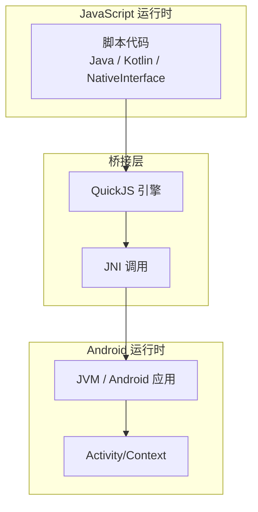
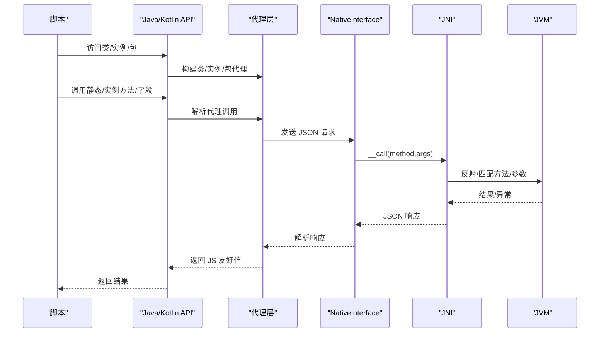
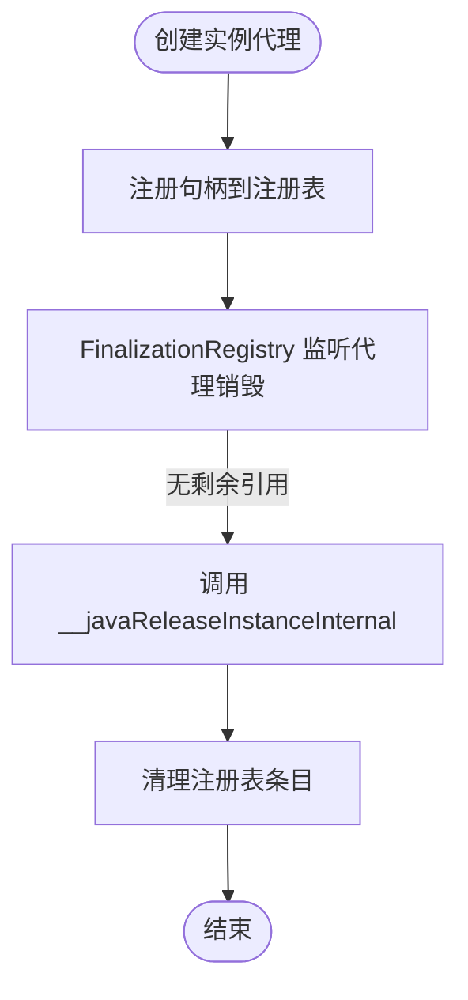
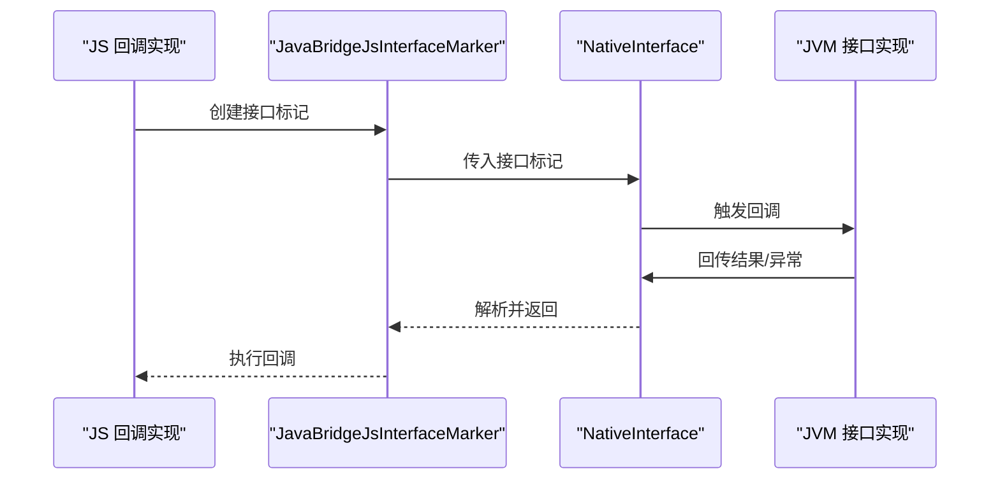
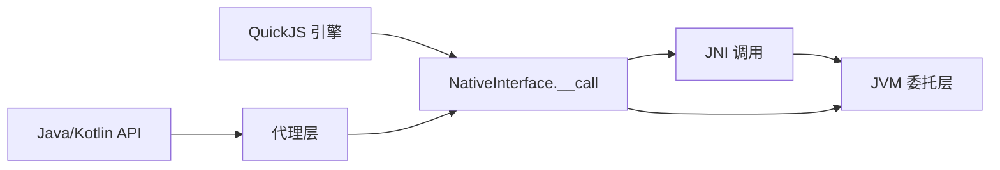

# Java Bridge API

<cite>
**本文引用的文件**
- [JAVA_BRIDGE_INTERFACE.md](file://docs/JAVA_BRIDGE_INTERFACE.md)
- [java-bridge.d.ts](file://examples/types/java-bridge.d.ts)
- [bridge_edges.js](file://app/src/androidTest/js/com/ai/assistance/operit/core/tools/javascript/bridge_edges/bridge_edges.js)
- [java_bridge.js](file://examples/java_bridge.js)
- [java_bridge.ts](file://examples/java_bridge.ts)
- [JsJavaBridge.kt](file://app/src/main/java/com/ai/assistance/operit/core/tools/javascript/JsJavaBridge.kt)
- [JsJavaBridgeDelegates.kt](file://app/src/main/java/com/ai/assistance/operit/core/tools/javascript/JsJavaBridgeDelegates.kt)
- [QuickJsNativeCompatScriptBuilder.kt](file://quickjs/src/main/java/com/ai/assistance/operit/core/tools/javascript/QuickJsNativeCompatScriptBuilder.kt)
- [quickjs_jni.cpp](file://quickjs/src/main/cpp/quickjs_jni.cpp)
</cite>

## 目录
1. [简介](#简介)
2. [项目结构](#项目结构)
3. [核心组件](#核心组件)
4. [架构总览](#架构总览)
5. [详细组件分析](#详细组件分析)
6. [依赖关系分析](#依赖关系分析)
7. [性能考量](#性能考量)
8. [故障排查指南](#故障排查指南)
9. [结论](#结论)
10. [附录](#附录)

## 简介
本文件为 Operit Java Bridge API 的权威参考文档，面向脚本开发者与集成工程师，系统阐述 Java/Kotlin 全局对象在 JavaScript/TypeScript 中的使用方式，覆盖类获取、静态调用、实例创建、接口实现、句柄管理与生命周期控制等核心能力，并明确区分高层 API 与底层 NativeInterface API 的职责边界与适用场景。

## 项目结构
Java Bridge 在运行时通过 QuickJS 注入两类全局对象：
- Java / Kotlin：高层桥接 API（推荐）
- NativeInterface：底层桥接 API（调试与直连）

图示来源
- [quickjs_jni.cpp:567-598](file://quickjs/src/main/cpp/quickjs_jni.cpp#L567-L598)
- [QuickJsNativeCompatScriptBuilder.kt:1-29](file://quickjs/src/main/java/com/ai/assistance/operit/core/tools/javascript/QuickJsNativeCompatScriptBuilder.kt#L1-L29)

章节来源
- [quickjs_jni.cpp:567-598](file://quickjs/src/main/cpp/quickjs_jni.cpp#L567-L598)
- [QuickJsNativeCompatScriptBuilder.kt:1-29](file://quickjs/src/main/java/com/ai/assistance/operit/core/tools/javascript/QuickJsNativeCompatScriptBuilder.kt#L1-L29)

## 核心组件
- 高层 API（Java / Kotlin）：提供类代理、实例代理、包链访问、接口实现、挂起调用等易用能力，适合日常开发。
- 底层 API（NativeInterface）：以方法名+JSON 参数的原始调用形式，便于调试与验证桥接契约。
- 类型定义（java-bridge.d.ts）：描述句柄、接口标记、类/实例代理、包代理等类型模型，确保 TS/JS 开发体验一致。
- 运行时注入：在 QuickJS 初始化阶段注入 Java/Kotlin 与 NativeInterface，形成统一桥接入口。

章节来源
- [JAVA_BRIDGE_INTERFACE.md:13-215](file://docs/JAVA_BRIDGE_INTERFACE.md#L13-L215)
- [java-bridge.d.ts:1-202](file://examples/types/java-bridge.d.ts#L1-L202)
- [bridge_edges.js:1-715](file://app/src/androidTest/js/com/ai/assistance/operit/core/tools/javascript/bridge_edges/bridge_edges.js#L1-L715)
- [java_bridge.js:1-253](file://examples/java_bridge.js#L1-L253)
- [java_bridge.ts:1-130](file://examples/java_bridge.ts#L1-L130)

## 架构总览
Java Bridge 的调用路径分为两条：
- 高层路径：Java/Kotlin → 代理层（类/实例/包）→ NativeInterface（JSON 化调用）→ JNI → JVM
- 底层路径：NativeInterface（直接 JSON 调用）→ JNI → JVM

图示来源
- [JsJavaBridge.kt:470-492](file://app/src/main/java/com/ai/assistance/operit/core/tools/javascript/JsJavaBridge.kt#L470-L492)
- [quickjs_jni.cpp:567-598](file://quickjs/src/main/cpp/quickjs_jni.cpp#L567-L598)

章节来源
- [JsJavaBridge.kt:470-492](file://app/src/main/java/com/ai/assistance/operit/core/tools/javascript/JsJavaBridge.kt#L470-L492)
- [quickjs_jni.cpp:567-598](file://quickjs/src/main/cpp/quickjs_jni.cpp#L567-L598)

## 详细组件分析

### 1) 高层 API（Java / Kotlin）
- 类获取与包访问
  - 支持 Java.type/use/importClass/package 以及 Kotlin.type
  - 支持 Java.java.lang.StringBuilder 与 Java.android.os.Build 等包链访问
- 实例与静态调用
  - new Cls(...) / Cls(...) / Cls.newInstance(...)
  - obj.method(...) / obj.field / obj.field = value
  - Cls.STATIC_FIELD / Cls.STATIC_FIELD = value / Cls.staticMethod(...)
- 顶层 API
  - Java.classExists / Java.newInstance / Java.callStatic / Java.callSuspend
  - Java.getApplicationContext / Java.getCurrentActivity / Java.loadDex / Java.loadJar / Java.listLoadedCodePaths
- 接口实现
  - Java.implement / Java.proxy 支持单接口/SAM 与多接口
  - 回调参数位置若目标类型为接口，可直接传 JS 对象/函数
- 转换规则
  - JS → Java：按目标类型转换（字符串/数字/布尔/数组/对象/接口代理等）
  - Java → JS：返回值归一化（null/Unit→null；String/char→string；Enum→string；Class→string；Map/JSONObject→plain object；List/Set/数组→JS array；其他→Java 实例代理）

章节来源
- [JAVA_BRIDGE_INTERFACE.md:22-215](file://docs/JAVA_BRIDGE_INTERFACE.md#L22-L215)
- [java-bridge.d.ts:177-201](file://examples/types/java-bridge.d.ts#L177-L201)

### 2) 底层 API（NativeInterface）
- 原始方法族
  - javaClassExists / javaNewInstance / javaCallInstance / javaCallStatic / javaGetStaticField / javaGetInstanceField / javaSetInstanceField / javaSetStaticField / javaCallInstanceSuspend 等
- 调用约定
  - 方法名与 JSON 参数字符串，返回 JSON 字符串，包含 success/data/error 字段
- 适用场景
  - 调试桥接契约
  - 字段/方法同名冲突排查
  - 验收测试与回归验证

章节来源
- [bridge_edges.js:381-715](file://app/src/androidTest/js/com/ai/assistance/operit/core/tools/javascript/bridge_edges/bridge_edges.js#L381-L715)
- [quickjs_jni.cpp:567-598](file://quickjs/src/main/cpp/quickjs_jni.cpp#L567-L598)

### 3) 两层 API 的差异与选择
- 推荐使用高层 API（Java/Kotlin），语法糖丰富、类型友好、易于维护
- 底层 API（NativeInterface）用于：
  - 验证桥接契约一致性
  - 排障与定位问题
  - 需要精确控制参数序列化/反序列化的场景

章节来源
- [JAVA_BRIDGE_INTERFACE.md:195-215](file://docs/JAVA_BRIDGE_INTERFACE.md#L195-L215)

### 4) 实例代理与句柄管理
- 句柄模型
  - JavaBridgeInstance 持有 __javaHandle/__javaClass，提供 call/callSuspend/get/set 等方法
- 生命周期
  - 代理注册与 FinalizationRegistry 回收
  - 显式释放：releaseInstanceHandle 或代理终结触发
- JS 接口绑定
  - Java.implement/Java.proxy 返回 JavaBridgeJsInterfaceMarker
  - JS 对象 ID 注册与引用计数，代理回收时自动释放

图示来源
- [JsJavaBridge.kt:80-162](file://app/src/main/java/com/ai/assistance/operit/core/tools/javascript/JsJavaBridge.kt#L80-L162)

章节来源
- [JsJavaBridge.kt:50-162](file://app/src/main/java/com/ai/assistance/operit/core/tools/javascript/JsJavaBridge.kt#L50-L162)

### 5) 接口实现与回调
- 单接口/SAM
  - Java.implement('Runnable', impl) 或 Java.implement(() => {...})
- 多接口
  - Java.implement(['I1','I2'], impl)
- JS 回调到 Java
  - 通过 __javaJsInterface/__javaJsObjectId 传递 JS 对象
  - NativeInterface.javaPollPendingJsCallback / javaResolvePendingJsCallback 协作完成回调分发

图示来源
- [JsJavaBridge.kt:523-587](file://app/src/main/java/com/ai/assistance/operit/core/tools/javascript/JsJavaBridge.kt#L523-L587)
- [JsJavaBridgeDelegates.kt:607-704](file://app/src/main/java/com/ai/assistance/operit/core/tools/javascript/JsJavaBridgeDelegates.kt#L607-L704)

章节来源
- [JsJavaBridge.kt:505-587](file://app/src/main/java/com/ai/assistance/operit/core/tools/javascript/JsJavaBridge.kt#L505-L587)
- [JsJavaBridgeDelegates.kt:607-704](file://app/src/main/java/com/ai/assistance/operit/core/tools/javascript/JsJavaBridgeDelegates.kt#L607-L704)

### 6) 挂起调用（协程/异步）
- Java.callSuspend(...) 永远返回 Promise
- 底层通过 javaCallInstanceSuspend + 回调 ID 机制实现
- 运行时循环处理 javaPollPendingJsCallback，驱动回调完成

章节来源
- [JAVA_BRIDGE_INTERFACE.md:127-138](file://docs/JAVA_BRIDGE_INTERFACE.md#L127-L138)
- [JsJavaBridge.kt:494-500](file://app/src/main/java/com/ai/assistance/operit/core/tools/javascript/JsJavaBridge.kt#L494-L500)

### 7) 类型与转换模型
- JavaBridgeValue：JS 可跨桥传递的值集合（原始/记录/数组/句柄/接口标记/实例/类/包）
- JS → Java：按目标类型转换（字符串/数字/布尔/数组/对象/接口代理）
- Java → JS：返回值归一化（Map/JSONObject→plain object；List/Set/数组→JS array；Class→string；Enum→string；其他→Java 实例代理）

章节来源
- [java-bridge.d.ts:52-60](file://examples/types/java-bridge.d.ts#L52-L60)
- [JAVA_BRIDGE_INTERFACE.md:139-177](file://docs/JAVA_BRIDGE_INTERFACE.md#L139-L177)

### 8) 示例与用法指引
- Android SDK 类与宿主应用类调用
  - 通过 Java.android.* 与 Java.com.ai.assistance.operit.* 访问
  - 获取当前 Activity 并弹窗演示
- 实现回调接口
  - Java.implement('java.lang.Runnable', ...) 或 Java.proxy(...)
  - 将 JS 对象/函数直接传给期望接口类型的参数

章节来源
- [bridge_edges.js:1-715](file://app/src/androidTest/js/com/ai/assistance/operit/core/tools/javascript/bridge_edges/bridge_edges.js#L1-L715)
- [java_bridge.js:187-253](file://examples/java_bridge.js#L187-L253)
- [java_bridge.ts:94-130](file://examples/java_bridge.ts#L94-L130)

## 依赖关系分析
- 运行时注入
  - QuickJS 初始化时注入 NativeInterface，提供 __call 方法
  - 通过 QuickJsNativeCompatScriptBuilder 将 __call 适配为可代理的 NativeInterface
- 代理层
  - JsJavaBridge.kt 提供高层 API 的 JS 侧实现，封装 NativeInterface 调用与值转换
- JVM 侧委托
  - JsJavaBridgeDelegates.kt 负责反射匹配、参数转换、异常包装、JS 接口生命周期管理

图示来源
- [QuickJsNativeCompatScriptBuilder.kt:1-29](file://quickjs/src/main/java/com/ai/assistance/operit/core/tools/javascript/QuickJsNativeCompatScriptBuilder.kt#L1-L29)
- [quickjs_jni.cpp:567-598](file://quickjs/src/main/cpp/quickjs_jni.cpp#L567-L598)
- [JsJavaBridge.kt:470-492](file://app/src/main/java/com/ai/assistance/operit/core/tools/javascript/JsJavaBridge.kt#L470-L492)

章节来源
- [QuickJsNativeCompatScriptBuilder.kt:1-29](file://quickjs/src/main/java/com/ai/assistance/operit/core/tools/javascript/QuickJsNativeCompatScriptBuilder.kt#L1-L29)
- [quickjs_jni.cpp:567-598](file://quickjs/src/main/cpp/quickjs_jni.cpp#L567-L598)
- [JsJavaBridge.kt:470-492](file://app/src/main/java/com/ai/assistance/operit/core/tools/javascript/JsJavaBridge.kt#L470-L492)

## 性能考量
- 代理层开销
  - 类/实例代理的属性访问与方法调用存在一层 JS 到 NativeInterface 的往返
  - 大量小粒度调用建议合并或批量处理
- JSON 序列化/反序列化
  - 参数与返回值均经 JSON 传输，避免过深嵌套与超大对象
- 回调与异步
  - 挂起调用通过回调 ID 与事件循环处理，注意避免阻塞运行时线程
- 外部代码加载
  - Dex/Jar 加载涉及类加载器链与前缀优先策略，合理配置 childFirstPrefixes 以减少冲突

章节来源
- [JsJavaBridge.kt:714-758](file://app/src/main/java/com/ai/assistance/operit/core/tools/javascript/JsJavaBridge.kt#L714-L758)
- [JsJavaBridgeDelegates.kt:720-740](file://app/src/main/java/com/ai/assistance/operit/core/tools/javascript/JsJavaBridgeDelegates.kt#L720-L740)

## 故障排查指南
- 常见问题与定位
  - 类不存在：使用 Java.classExists 或 NativeInterface.javaClassExists 校验
  - 参数类型不匹配：检查 JS → Java 转换规则与目标方法签名
  - 接口实现失败：确认 Java.implement/Java.proxy 的接口名与实现对象
  - 回调未触发：检查 javaPollPendingJsCallback 与 javaResolvePendingJsCallback 的协作
- 错误信息
  - 高层 API 抛错会包含清晰的错误链路与原因
  - 底层 API 返回 JSON 中的 error 字段可用于诊断

章节来源
- [bridge_edges.js:381-715](file://app/src/androidTest/js/com/ai/assistance/operit/core/tools/javascript/bridge_edges/bridge_edges.js#L381-L715)
- [JsJavaBridgeDelegates.kt:720-754](file://app/src/main/java/com/ai/assistance/operit/core/tools/javascript/JsJavaBridgeDelegates.kt#L720-L754)

## 结论
Operit Java Bridge 通过“高层 API + 底层 API”的双层设计，在易用性与可观测性之间取得平衡。日常开发应优先使用 Java/Kotlin API，遇到疑难问题时借助 NativeInterface 进行验证与排障。配合完善的类型定义与生命周期管理，可构建稳定高效的跨语言交互体系。

## 附录
- 快速对照表
  - 类获取：Java.type/use/importClass/package / Kotlin.type
  - 实例创建：new Cls(...) / Cls(...) / Java.newInstance
  - 静态调用：Cls.staticMethod(...) / Java.callStatic
  - 挂起调用：Java.callSuspend
  - 接口实现：Java.implement / Java.proxy
  - 底层直连：NativeInterface.javaClassExists / javaNewInstance / javaCallInstance / javaCallStatic / javaGetStaticField / javaGetInstanceField / javaSetInstanceField / javaSetStaticField / javaCallInstanceSuspend

章节来源
- [JAVA_BRIDGE_INTERFACE.md:22-215](file://docs/JAVA_BRIDGE_INTERFACE.md#L22-L215)
- [java-bridge.d.ts:177-201](file://examples/types/java-bridge.d.ts#L177-L201)