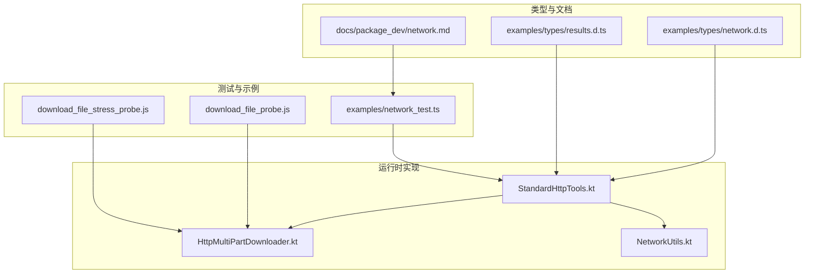
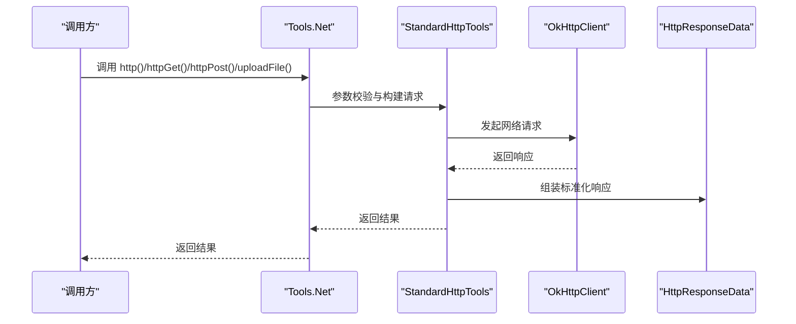
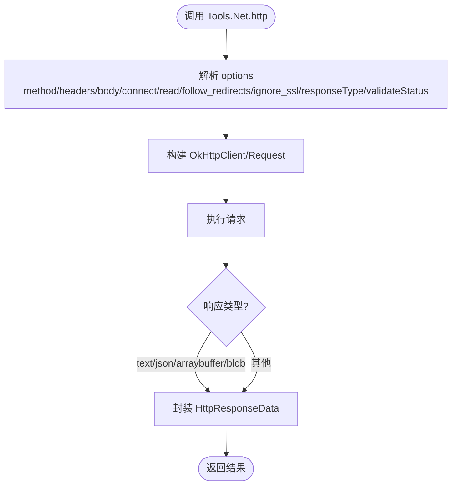
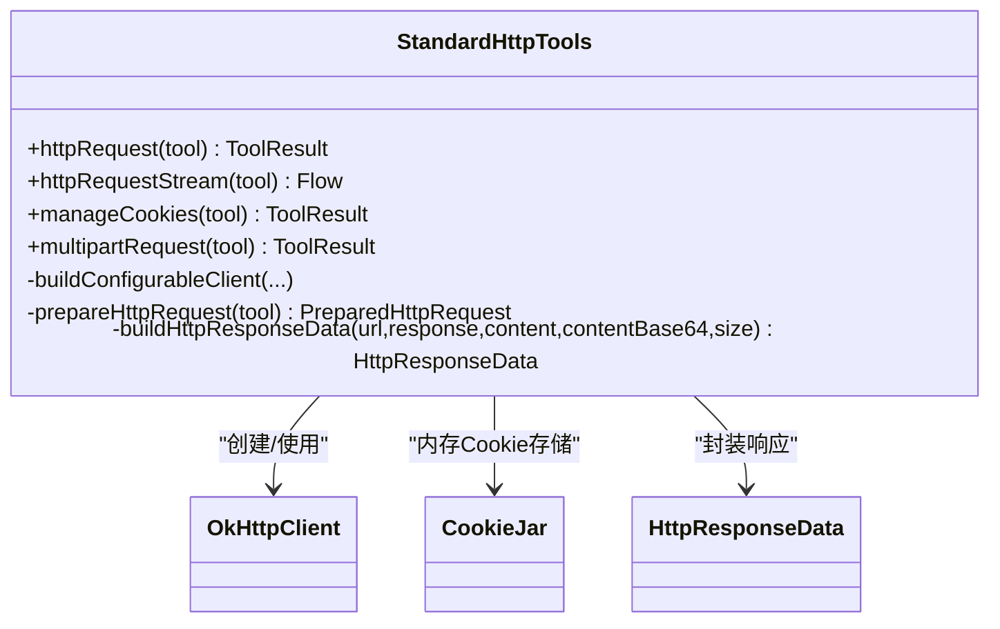
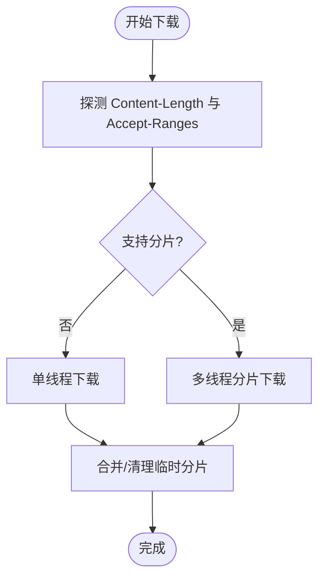
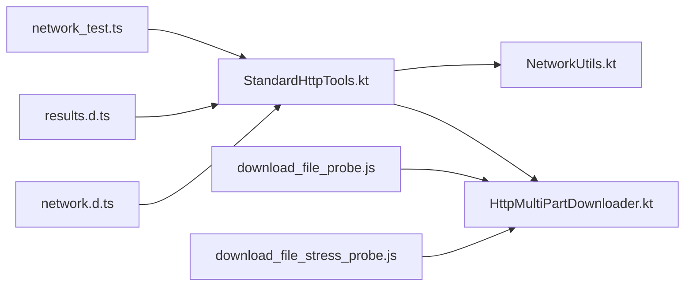

# 网络 API

<cite>
**本文引用的文件**
- [network.d.ts](file://examples/types/network.d.ts)
- [results.d.ts](file://examples/types/results.d.ts)
- [network.md](file://docs/package_dev/network.md)
- [StandardHttpTools.kt](file://app/src/main/java/com/ai/assistance/operit/core/tools/defaultTool/standard/StandardHttpTools.kt)
- [NetworkUtils.kt](file://app/src/main/java/com/ai/assistance/operit/util/NetworkUtils.kt)
- [HttpMultiPartDownloader.kt](file://app/src/main/java/com/ai/assistance/operit/util/HttpMultiPartDownloader.kt)
- [network_test.ts](file://examples/network_test.ts)
- [download_file_probe.js](file://app/src/androidTest/js/com/ai/assistance/operit/core/tools/javascript/script_mode_contract/download_file_probe.js)
- [download_file_stress_probe.js](file://app/src/androidTest/js/com/ai/assistance/operit/core/tools/javascript/script_mode_contract/download_file_stress_probe.js)
</cite>

## 目录
1. [简介](#简介)
2. [项目结构](#项目结构)
3. [核心组件](#核心组件)
4. [架构总览](#架构总览)
5. [详细组件分析](#详细组件分析)
6. [依赖关系分析](#依赖关系分析)
7. [性能考量](#性能考量)
8. [故障排查指南](#故障排查指南)
9. [结论](#结论)
10. [附录](#附录)

## 简介
本文件为 Operit Network API 的全面参考文档，聚焦于 Network 命名空间的网络请求能力，涵盖：
- 基础 HTTP 请求：httpGet()、httpPost()、http()、uploadFile()
- 文件下载与上传：多线程断点续传下载、multipart 表单上传
- Cookie 管理：统一的 Cookie 存储与跨域管理
- 异步特性、超时控制、重定向、代理与 SSL 忽略策略
- 实战示例：RESTful 调用、文件上传下载、表单提交、认证处理
- 安全、性能与调试建议，以及常见问题诊断

## 项目结构
Network API 的类型定义位于 TypeScript 类型声明文件中，运行时实现由 Kotlin 工具类提供，配套的下载器与网络工具用于高性能与可靠性保障。

**图表来源**
- [network.d.ts](file://examples/types/network.d.ts)
- [results.d.ts](file://examples/types/results.d.ts)
- [network.md](file://docs/package_dev/network.md)
- [StandardHttpTools.kt](file://app/src/main/java/com/ai/assistance/operit/core/tools/defaultTool/standard/StandardHttpTools.kt)
- [HttpMultiPartDownloader.kt](file://app/src/main/java/com/ai/assistance/operit/util/HttpMultiPartDownloader.kt)
- [NetworkUtils.kt](file://app/src/main/java/com/ai/assistance/operit/util/NetworkUtils.kt)
- [network_test.ts](file://examples/network_test.ts)
- [download_file_probe.js](file://app/src/androidTest/js/com/ai/assistance/operit/core/tools/javascript/script_mode_contract/download_file_probe.js)
- [download_file_stress_probe.js](file://app/src/androidTest/js/com/ai/assistance/operit/core/tools/javascript/script_mode_contract/download_file_stress_probe.js)

**章节来源**
- [network.d.ts](file://examples/types/network.d.ts)
- [network.md](file://docs/package_dev/network.md)

## 核心组件
- Tools.Net 命名空间：提供 HTTP 请求、网页抓取、持久浏览器会话与 Cookie 管理等能力。
- HttpResponseData/VisitWebResultData：标准化的响应数据结构。
- StandardHttpTools：基于 OkHttp 的 HTTP 请求、流式传输、Cookie 管理与多部分上传。
- HttpMultiPartDownloader：基于 HttpURLConnection 的多线程分片下载，支持范围请求与进度回调。
- NetworkUtils：Android 网络可用性检测与网络类型识别。

**章节来源**
- [network.d.ts](file://examples/types/network.d.ts)
- [results.d.ts](file://examples/types/results.d.ts)
- [StandardHttpTools.kt](file://app/src/main/java/com/ai/assistance/operit/core/tools/defaultTool/standard/StandardHttpTools.kt)
- [HttpMultiPartDownloader.kt](file://app/src/main/java/com/ai/assistance/operit/util/HttpMultiPartDownloader.kt)
- [NetworkUtils.kt](file://app/src/main/java/com/ai/assistance/operit/util/NetworkUtils.kt)

## 架构总览
Network API 的调用链路如下：
- 类型层：Tools.Net.* 方法定义与参数约束
- 结果层：HttpResponseData/VisitWebResultData 等标准化返回
- 运行时层：StandardHttpTools 提供 HTTP、Cookie、multipart 与流式传输
- 下载层：HttpMultiPartDownloader 提供断点续传与多线程分片
- 工具层：NetworkUtils 提供网络状态检测

**图表来源**
- [network.d.ts](file://examples/types/network.d.ts)
- [StandardHttpTools.kt](file://app/src/main/java/com/ai/assistance/operit/core/tools/defaultTool/standard/StandardHttpTools.kt)
- [results.d.ts](file://examples/types/results.d.ts)

## 详细组件分析

### Tools.Net 命名空间 API
- httpGet(url, ignore_ssl?)
  - 功能：发起 HTTP GET 请求，支持忽略 SSL 校验
  - 返回：HttpResponseData
- httpPost(url, body, ignore_ssl?)
  - 功能：发起 HTTP POST 请求，支持忽略 SSL 校验
  - 返回：HttpResponseData
- http(options)
  - 功能：通用 HTTP 请求入口，支持 method、headers、body、超时、重定向、SSL 忽略、响应类型与状态校验
  - 返回：HttpResponseData
- uploadFile(options)
  - 功能：multipart/form-data 文件上传，支持 form_data 与多个文件字段
  - 返回：HttpResponseData

**图表来源**
- [network.d.ts](file://examples/types/network.d.ts)
- [results.d.ts](file://examples/types/results.d.ts)

**章节来源**
- [network.d.ts](file://examples/types/network.d.ts)
- [network.md](file://docs/package_dev/network.md)

### HTTP 请求实现（StandardHttpTools）
- 客户端配置
  - 超时：connectTimeout、readTimeout、writeTimeout
  - 重定向：followRedirects、followSslRedirects
  - Cookie：内存 CookieJar，默认启用
  - 代理：proxyHost/proxyPort
  - SSL：ignoreSsl 时禁用证书校验与主机名校验
- 请求构建
  - 支持 GET/POST/PUT/DELETE/PATCH/HEAD/OPTIONS/TRACE
  - 支持 body_type：json、form、text、xml
  - multipart 专用 multipartRequest
- 响应处理
  - 统一封装为 HttpResponseData，包含 url、statusCode、statusMessage、headers、contentType、content、size、cookies
- 流式传输
  - httpRequestStream：分块推送 HttpStreamEventData，最后汇总 HttpResponseData

**图表来源**
- [StandardHttpTools.kt](file://app/src/main/java/com/ai/assistance/operit/core/tools/defaultTool/standard/StandardHttpTools.kt)
- [results.d.ts](file://examples/types/results.d.ts)

**章节来源**
- [StandardHttpTools.kt](file://app/src/main/java/com/ai/assistance/operit/core/tools/defaultTool/standard/StandardHttpTools.kt)

### 文件下载（HttpMultiPartDownloader）
- 能力
  - 探测服务器是否支持 Range 与 Content-Length
  - 单线程回退与多线程分片下载
  - 分片写入与合并，支持进度回调
  - 取消与异常处理
- 关键流程

**图表来源**
- [HttpMultiPartDownloader.kt](file://app/src/main/java/com/ai/assistance/operit/util/HttpMultiPartDownloader.kt)

**章节来源**
- [HttpMultiPartDownloader.kt](file://app/src/main/java/com/ai/assistance/operit/util/HttpMultiPartDownloader.kt)
- [download_file_probe.js](file://app/src/androidTest/js/com/ai/assistance/operit/core/tools/javascript/script_mode_contract/download_file_probe.js)
- [download_file_stress_probe.js](file://app/src/androidTest/js/com/ai/assistance/operit/core/tools/javascript/script_mode_contract/download_file_stress_probe.js)

### Cookie 管理
- 支持 get/set/clear 三种操作
- get：可按域名或全局查询，返回可读的 Cookie 映射
- set：支持简单 name=value 与复杂 Cookie 对象（含 domain/path/secure/httpOnly/expiresAt）
- clear：清空指定域名或全部 Cookie

**章节来源**
- [StandardHttpTools.kt](file://app/src/main/java/com/ai/assistance/operit/core/tools/defaultTool/standard/StandardHttpTools.kt)

### 网络状态检测（NetworkUtils）
- isNetworkAvailable(context)：判断设备是否有网络连接（WiFi/蜂窝/以太网）
- getNetworkType(context)：返回当前网络类型字符串

**章节来源**
- [NetworkUtils.kt](file://app/src/main/java/com/ai/assistance/operit/util/NetworkUtils.kt)

## 依赖关系分析
- 类型与实现解耦：network.d.ts 定义 API，StandardHttpTools 提供实现
- 结果模型统一：HttpResponseData/VisitWebResultData 在类型与实现间保持一致
- 下载器独立：HttpMultiPartDownloader 与 OkHttp 并行存在，分别满足不同场景
- 工具辅助：NetworkUtils 为上层提供网络状态判断

**图表来源**
- [network.d.ts](file://examples/types/network.d.ts)
- [results.d.ts](file://examples/types/results.d.ts)
- [StandardHttpTools.kt](file://app/src/main/java/com/ai/assistance/operit/core/tools/defaultTool/standard/StandardHttpTools.kt)
- [HttpMultiPartDownloader.kt](file://app/src/main/java/com/ai/assistance/operit/util/HttpMultiPartDownloader.kt)
- [NetworkUtils.kt](file://app/src/main/java/com/ai/assistance/operit/util/NetworkUtils.kt)
- [network_test.ts](file://examples/network_test.ts)
- [download_file_probe.js](file://app/src/androidTest/js/com/ai/assistance/operit/core/tools/javascript/script_mode_contract/download_file_probe.js)
- [download_file_stress_probe.js](file://app/src/androidTest/js/com/ai/assistance/operit/core/tools/javascript/script_mode_contract/download_file_stress_probe.js)

**章节来源**
- [network.d.ts](file://examples/types/network.d.ts)
- [StandardHttpTools.kt](file://app/src/main/java/com/ai/assistance/operit/core/tools/defaultTool/standard/StandardHttpTools.kt)

## 性能考量
- 超时与重定向
  - 合理设置 connect/read/write 超时，避免长时间阻塞
  - followRedirects/followSslRedirects 控制重定向行为，减少不必要的跳转
- 代理与 SSL
  - 仅在必要时开启 ignoreSsl，生产环境不建议忽略证书校验
  - 代理需配合 proxyHost/proxyPort 使用
- 流式传输
  - 大响应体建议使用 httpRequestStream，边接收边处理，降低内存峰值
- 下载优化
  - 大文件优先使用 HttpMultiPartDownloader 的多线程分片下载
  - 服务器需支持 Range 与 Accept-Ranges
- Cookie 管理
  - 合理使用 use_cookies 与自定义 Cookie，避免无谓的头部体积

[本节为通用指导，无需特定文件引用]

## 故障排查指南
- 常见错误与定位
  - URL 格式非法：检查 URL 是否为 http/https
  - 请求体类型不支持：multipart 需使用 multipartRequest
  - 文件不可读：确认文件路径存在且可读
  - SSL 证书错误：在开发环境可临时 ignoreSsl，但不建议线上使用
  - 代理不可达：核对 proxyHost/proxyPort
- 日志与调试
  - 使用 network_test.ts 中的测试函数进行最小复现
  - 观察响应 headers、contentType、status 等关键字段
  - 对大响应使用流式传输，避免一次性加载导致内存溢出
- 网络状态
  - 使用 NetworkUtils 判断设备网络可用性与类型，排除网络环境问题

**章节来源**
- [StandardHttpTools.kt](file://app/src/main/java/com/ai/assistance/operit/core/tools/defaultTool/standard/StandardHttpTools.kt)
- [network_test.ts](file://examples/network_test.ts)
- [NetworkUtils.kt](file://app/src/main/java/com/ai/assistance/operit/util/NetworkUtils.kt)

## 结论
Operit Network API 通过清晰的类型定义与健壮的 Kotlin 实现，提供了从基础 HTTP 请求到文件下载上传、Cookie 管理与流式传输的完整能力。结合多线程下载器与网络状态工具，可在复杂网络环境下稳定高效地完成各类网络任务。建议在生产环境中谨慎使用 SSL 忽略与代理，合理配置超时与重定向，并优先采用流式传输与分片下载以提升性能与稳定性。

[本节为总结，无需特定文件引用]

## 附录

### API 参数与返回说明（摘要）
- httpGet(url, ignore_ssl?)
  - 参数：url、ignore_ssl
  - 返回：HttpResponseData
- httpPost(url, body, ignore_ssl?)
  - 参数：url、body、ignore_ssl
  - 返回：HttpResponseData
- http(options)
  - 关键参数：url、method、headers、body、connect_timeout、read_timeout、follow_redirects、ignore_ssl、responseType、validateStatus
  - 返回：HttpResponseData
- uploadFile(options)
  - 关键参数：url、method、headers、form_data、ignore_ssl、files[]
  - 返回：HttpResponseData

**章节来源**
- [network.d.ts](file://examples/types/network.d.ts)
- [results.d.ts](file://examples/types/results.d.ts)

### 实战示例（步骤说明）
- RESTful API 调用
  - 使用 http() 指定 method、headers、body，获取标准化响应
- 文件上传
  - 使用 uploadFile() 指定 files[] 与 form_data，支持多文件与自定义 Content-Type
- 文件下载
  - 使用 HttpMultiPartDownloader.download() 指定线程数与进度回调
- 认证处理
  - 通过 headers 设置 Authorization，或使用 Cookie 管理进行会话保持

**章节来源**
- [network.md](file://docs/package_dev/network.md)
- [network_test.ts](file://examples/network_test.ts)
- [HttpMultiPartDownloader.kt](file://app/src/main/java/com/ai/assistance/operit/util/HttpMultiPartDownloader.kt)