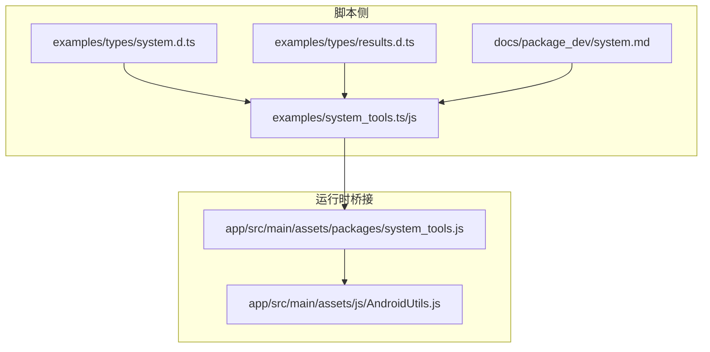
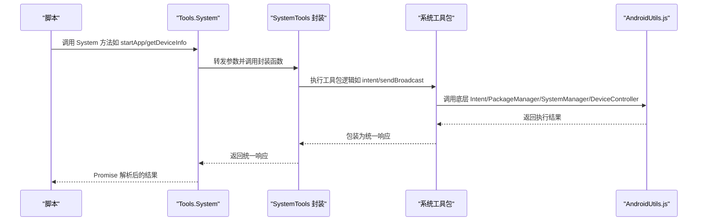

# System API

<cite>
**本文引用的文件**
- [system.d.ts](file://examples/types/system.d.ts)
- [system.md](file://docs/package_dev/system.md)
- [system_tools.js](file://examples/system_tools.js)
- [system_tools.ts](file://examples/system_tools.ts)
- [results.d.ts](file://examples/types/results.d.ts)
- [AndroidUtils.js](file://app/src/main/assets/js/AndroidUtils.js)
- [daily_life.js](file://examples/daily_life.js)
- [app/src/main/assets/packages/system_tools.js](file://app/src/main/assets/packages/system_tools.js)
</cite>

## 目录
1. [简介](#简介)
2. [项目结构](#项目结构)
3. [核心组件](#核心组件)
4. [架构总览](#架构总览)
5. [详细组件分析](#详细组件分析)
6. [依赖分析](#依赖分析)
7. [性能考量](#性能考量)
8. [故障排查指南](#故障排查指南)
9. [结论](#结论)
10. [附录](#附录)

## 简介
本文件为 Operit System API 的系统级操作参考文档，聚焦 System 命名空间中的系统级方法，包括但不限于 sleep()、startApp()、stopApp()、getDeviceInfo()、getBatteryInfo()、isScreenOn()、wakeUp() 等。文档从类型定义、实现映射、调用流程、错误处理与性能优化等维度进行系统化说明，并提供真实脚本示例与最佳实践，帮助开发者在脚本中正确、安全地使用这些 API。

## 项目结构
- 类型与文档
  - 类型定义：examples/types/system.d.ts 定义了 Tools.System 命名空间及其方法签名与返回类型。
  - 文档：docs/package_dev/system.md 对 API 的职责、运行时入口、主要 API、示例与相关文件进行了说明。
  - 结果类型：examples/types/results.d.ts 定义了各 API 返回的数据结构（如 DeviceInfoResultData、SleepResultData 等）。
- 运行时实现
  - 示例工具包：examples/system_tools.ts/js 提供了对 Tools.System 方法的封装与统一返回格式，便于在脚本中直接调用。
  - 包装实现：app/src/main/assets/packages/system_tools.js 展示了系统工具包的元数据与实现映射，作为运行时桥接层。
- 平台辅助
  - AndroidUtils.js 提供了底层 Android 能力（Intent、PackageManager、SystemManager、DeviceController 等）的封装，用于执行系统命令与设备控制。

**图表来源**
- [system.d.ts](file://examples/types/system.d.ts)
- [system.md](file://docs/package_dev/system.md)
- [system_tools.ts](file://examples/system_tools.ts)
- [system_tools.js](file://examples/system_tools.js)
- [results.d.ts](file://examples/types/results.d.ts)
- [app/src/main/assets/packages/system_tools.js](file://app/src/main/assets/packages/system_tools.js)
- [AndroidUtils.js](file://app/src/main/assets/js/AndroidUtils.js)

**章节来源**
- [system.d.ts](file://examples/types/system.d.ts)
- [system.md](file://docs/package_dev/system.md)
- [system_tools.ts](file://examples/system_tools.ts)
- [system_tools.js](file://examples/system_tools.js)
- [results.d.ts](file://examples/types/results.d.ts)
- [app/src/main/assets/packages/system_tools.js](file://app/src/main/assets/packages/system_tools.js)
- [AndroidUtils.js](file://app/src/main/assets/js/AndroidUtils.js)

## 核心组件
- System 命名空间方法概览
  - sleep(milliseconds): 异步睡眠指定毫秒数，返回 SleepResultData。
  - getSetting(setting, namespace?): 读取系统设置，返回 SystemSettingData。
  - setSetting(setting, value, namespace?): 修改系统设置，返回 SystemSettingData。
  - getDeviceInfo(): 获取设备信息，返回 DeviceInfoResultData。
  - toast(message): 显示 Toast，返回 StringResultData。
  - sendNotification(message, title?): 发送通知，返回 StringResultData。
  - installApp(path): 安装应用，返回 AppOperationData。
  - uninstallApp(packageName): 卸载应用，返回 AppOperationData。
  - stopApp(packageName): 停止应用，返回 AppOperationData。
  - listApps(includeSystem?): 枚举应用，返回 AppListData。
  - startApp(packageName, activity?): 启动应用，返回 AppOperationData。
  - getNotifications(limit?, includeOngoing?): 获取通知，返回 NotificationData。
  - getAppUsageTime(options?): 获取前台使用时长，返回 AppUsageTimeResultData。
  - getLocation(highAccuracy?, timeout?): 获取位置，返回 LocationData。
  - shell(command): 执行 Shell 命令（需 root），返回 ADBResultData。
  - intent(options?): 执行 Intent（activity/broadcast/service），返回 IntentResultData。
  - sendBroadcast(options?): 发送广播，返回 IntentResultData。
  - terminal.* 终端会话 API：创建、执行、隐藏执行、关闭、读屏、输入等。

- 关键返回类型
  - DeviceInfoResultData：包含设备标识、型号、厂商、系统版本、屏幕分辨率/密度、内存/存储、电量、CPU、网络类型等。
  - SleepResultData：包含请求睡眠毫秒数与实际睡眠毫秒数。
  - SystemSettingData：包含命名空间、设置项与值。
  - AppOperationData/AppListData：应用安装/卸载/启动/停止与应用列表。
  - NotificationData：通知列表与抓取时间戳。
  - AppUsageTimeResultData：使用时长统计区间、条目数与明细。
  - LocationData：经纬度、精度、提供方、时间戳与地址信息。
  - IntentResultData/ADBResultData/Terminal*ResultData：意图执行、ADB 命令与终端会话结果。

**章节来源**
- [system.d.ts](file://examples/types/system.d.ts)
- [results.d.ts](file://examples/types/results.d.ts)
- [system.md](file://docs/package_dev/system.md)

## 架构总览
System API 在脚本侧通过 Tools.System 暴露，在运行时由系统工具包进行桥接，最终调用底层 Android 能力（Intent、PackageManager、SystemManager、DeviceController 等）或系统命令执行器。

**图表来源**
- [system_tools.ts](file://examples/system_tools.ts)
- [system_tools.js](file://examples/system_tools.js)
- [app/src/main/assets/packages/system_tools.js](file://app/src/main/assets/packages/system_tools.js)
- [AndroidUtils.js](file://app/src/main/assets/js/AndroidUtils.js)

## 详细组件分析

### sleep(milliseconds)
- 参数
  - milliseconds: 字符串或数字，表示睡眠毫秒数。
- 返回
  - Promise<SleepResultData>：包含请求睡眠毫秒数与实际睡眠毫秒数。
- 异步特性
  - 以 Promise 形式返回，内部实现为非阻塞等待。
- 错误处理
  - 无显式异常抛出；若传入非法值，底层行为取决于实现。
- 性能考虑
  - 避免过长睡眠导致脚本长时间阻塞；建议配合超时控制。
- 使用示例
  - 脚本示例：await Tools.System.sleep(1000); await Tools.System.toast('执行完成');

**章节来源**
- [system.d.ts](file://examples/types/system.d.ts)
- [results.d.ts](file://examples/types/results.d.ts)
- [system.md](file://docs/package_dev/system.md)
- [system_tools.ts](file://examples/system_tools.ts)

### startApp(packageName, activity?)
- 参数
  - packageName: 应用包名（必填）。
  - activity: 可选，指定 Activity。
- 返回
  - Promise<AppOperationData>：包含操作类型、包名、成功标志与详情。
- 异步特性
  - Promise；底层通过 Intent 启动应用。
- 错误处理
  - 若包名无效或应用不可启动，返回失败标记与详情。
- 性能考虑
  - 启动外部应用可能触发界面切换，注意前后置状态变化。
- 使用示例
  - 脚本示例：await Tools.System.startApp('com.android.settings');

**章节来源**
- [system.d.ts](file://examples/types/system.d.ts)
- [results.d.ts](file://examples/types/results.d.ts)
- [system.md](file://docs/package_dev/system.md)
- [system_tools.ts](file://examples/system_tools.ts)

### stopApp(packageName)
- 参数
  - packageName: 应用包名（必填）。
- 返回
  - Promise<AppOperationData>：包含操作类型、包名、成功标志与详情。
- 异步特性
  - Promise；底层通过系统命令或 API 停止进程。
- 错误处理
  - 若无权限或应用不存在，返回失败。
- 性能考虑
  - 停止后台应用可能影响其状态，谨慎使用。
- 使用示例
  - 脚本示例：await Tools.System.stopApp('com.example.app');

**章节来源**
- [system.d.ts](file://examples/types/system.d.ts)
- [results.d.ts](file://examples/types/results.d.ts)
- [system.md](file://docs/package_dev/system.md)
- [system_tools.ts](file://examples/system_tools.ts)

### getDeviceInfo()
- 参数
  - 无。
- 返回
  - Promise<DeviceInfoResultData>：包含设备标识、型号、厂商、系统版本、屏幕分辨率/密度、内存/存储、电量、CPU、网络类型等。
- 异步特性
  - Promise；底层通过系统接口收集信息。
- 错误处理
  - 若权限不足或系统接口不可用，可能返回部分字段缺失或报错。
- 性能考虑
  - 信息采集通常较快，但涉及多源数据合并，建议缓存必要字段。
- 使用示例
  - 脚本示例：const info = await Tools.System.getDeviceInfo(); console.log(info.model, info.batteryLevel);

**章节来源**
- [system.d.ts](file://examples/types/system.d.ts)
- [results.d.ts](file://examples/types/results.d.ts)
- [system.md](file://docs/package_dev/system.md)
- [daily_life.js](file://examples/daily_life.js)

### getBatteryInfo()
- 说明
  - System 命名空间未直接暴露 getBatteryInfo() 方法；可通过 getDeviceInfo() 返回的 DeviceInfoResultData.batteryLevel 与 batteryCharging 获取电池状态。
- 使用方式
  - const info = await Tools.System.getDeviceInfo(); const level = info.batteryLevel; const charging = info.batteryCharging;
- 注意
  - 若电池信息不可用，level 可能为负值或字段缺失，需进行容错处理。

**章节来源**
- [system.d.ts](file://examples/types/system.d.ts)
- [results.d.ts](file://examples/types/results.d.ts)
- [daily_life.js](file://examples/daily_life.js)

### isScreenOn() 与 wakeUp()
- 说明
  - System 命名空间未直接暴露 isScreenOn() 与 wakeUp() 方法；可通过底层 AndroidUtils.js 的 DeviceController 提供的能力间接实现。
- 可能的实现思路
  - isScreenOn(): 通过系统属性或输入事件判断屏幕状态。
  - wakeUp(): 通过输入事件唤醒设备（如 KEYCODE_WAKEUP）。
- 注意
  - 需要相应权限与 Shizuku 支持；具体可用性取决于设备与系统版本。

**章节来源**
- [AndroidUtils.js](file://app/src/main/assets/js/AndroidUtils.js)

### 其他常用系统 API（参考）
- getSetting/setSetting：读取/修改系统设置，返回 SystemSettingData。
- toast/sendNotification：显示 Toast 与通知，返回 StringResultData。
- installApp/uninstallApp/listApps：应用安装/卸载/枚举，返回 AppOperationData/AppListData。
- getNotifications/getAppUsageTime/getLocation：通知、使用时长、位置，返回对应数据结构。
- shell/intent/sendBroadcast：Shell 命令（root）、Intent 执行与广播，返回 ADBResultData/IntentResultData。
- terminal.*：终端会话生命周期与输入输出，返回 Terminal*ResultData。

**章节来源**
- [system.d.ts](file://examples/types/system.d.ts)
- [results.d.ts](file://examples/types/results.d.ts)
- [system.md](file://docs/package_dev/system.md)
- [system_tools.ts](file://examples/system_tools.ts)

## 依赖分析
- 类型依赖
  - System 命名空间方法签名依赖 examples/types/system.d.ts。
  - 返回值类型依赖 examples/types/results.d.ts。
- 运行时依赖
  - 脚本通过 examples/system_tools.ts/js 调用 Tools.System。
  - 系统工具包 app/src/main/assets/packages/system_tools.js 将脚本调用映射到底层 Android 能力。
  - AndroidUtils.js 提供 Intent、PackageManager、SystemManager、DeviceController 等底层封装。
- 调用链
  - 脚本 -> SystemTools 封装 -> 系统工具包 -> AndroidUtils.js -> 系统命令/服务。

**图表来源**
- [system_tools.ts](file://examples/system_tools.ts)
- [system_tools.js](file://examples/system_tools.js)
- [app/src/main/assets/packages/system_tools.js](file://app/src/main/assets/packages/system_tools.js)
- [AndroidUtils.js](file://app/src/main/assets/js/AndroidUtils.js)

**章节来源**
- [system_tools.ts](file://examples/system_tools.ts)
- [system_tools.js](file://examples/system_tools.js)
- [app/src/main/assets/packages/system_tools.js](file://app/src/main/assets/packages/system_tools.js)
- [AndroidUtils.js](file://app/src/main/assets/js/AndroidUtils.js)

## 性能考量
- 异步与并发
  - 所有系统 API 均为异步 Promise，建议在脚本中合理组织并发与串行调用，避免阻塞主线程。
- 超时控制
  - 对耗时操作（如终端命令、位置获取、通知读取）建议设置合理超时，防止长时间挂起。
- 权限与授权
  - 部分能力（如使用情况访问、位置、通知读取）需要用户授权，提前检查并引导授权可减少失败重试成本。
- 缓存与复用
  - 对频繁读取的设备信息、应用列表等可进行本地缓存，降低重复调用开销。
- 错误恢复
  - 对易失败的系统调用（如 shell、广播）应具备重试与降级策略。

[本节为通用指导，无需特定文件引用]

## 故障排查指南
- 常见问题
  - 权限不足：如安装/卸载应用、读取通知、使用情况访问、位置等需要用户授权。
  - Shell 命令失败：需 root 权限或 Shizuku 支持；检查执行器返回码与输出。
  - Intent 执行失败：action/component/flags 配置错误或目标应用不存在。
  - 终端会话异常：会话 ID 无效、命令超时、会话被关闭。
- 排查步骤
  - 检查系统工具包返回的 success 字段与 message。
  - 查看底层 AndroidUtils.js 的命令输出与异常日志。
  - 确认设备状态（屏幕、锁屏、权限弹窗）与系统版本兼容性。
- 最佳实践
  - 对关键流程添加 try/catch 与兜底逻辑。
  - 对超时敏感的操作显式传入 timeoutMs。
  - 对需要用户授权的场景，先检测权限再发起调用。

**章节来源**
- [system_tools.ts](file://examples/system_tools.ts)
- [system_tools.js](file://examples/system_tools.js)
- [AndroidUtils.js](file://app/src/main/assets/js/AndroidUtils.js)

## 结论
System API 为脚本提供了与设备、应用、系统设置、通知、位置及终端会话交互的能力。通过统一的 Tools.System 命名空间与系统工具包桥接，开发者可以以一致的方式在脚本中调用这些能力。建议在使用时关注权限、超时与错误处理，并结合实际场景选择合适的调用顺序与参数配置，以获得稳定可靠的自动化体验。

[本节为总结性内容，无需特定文件引用]

## 附录

### API 参考速查表
- sleep(milliseconds): Promise<SleepResultData>
- getSetting(setting, namespace?): Promise<SystemSettingData>
- setSetting(setting, value, namespace?): Promise<SystemSettingData>
- getDeviceInfo(): Promise<DeviceInfoResultData>
- toast(message): Promise<StringResultData>
- sendNotification(message, title?): Promise<StringResultData>
- installApp(path): Promise<AppOperationData>
- uninstallApp(packageName): Promise<AppOperationData>
- stopApp(packageName): Promise<AppOperationData>
- listApps(includeSystem?): Promise<AppListData>
- startApp(packageName, activity?): Promise<AppOperationData>
- getNotifications(limit?, includeOngoing?): Promise<NotificationData>
- getAppUsageTime(options?): Promise<AppUsageTimeResultData>
- getLocation(highAccuracy?, timeout?): Promise<LocationData>
- shell(command): Promise<ADBResultData>
- intent(options?): Promise<IntentResultData>
- sendBroadcast(options?): Promise<IntentResultData>
- terminal.create(sessionName?): Promise<TerminalSessionCreationResultData>
- terminal.exec(sessionId, command, timeoutMs?): Promise<TerminalCommandResultData>
- terminal.close(sessionId): Promise<TerminalSessionCloseResultData>
- terminal.screen(sessionId): Promise<TerminalSessionScreenResultData>
- terminal.input(sessionId, options?): Promise<StringResultData>

**章节来源**
- [system.d.ts](file://examples/types/system.d.ts)
- [results.d.ts](file://examples/types/results.d.ts)
- [system.md](file://docs/package_dev/system.md)