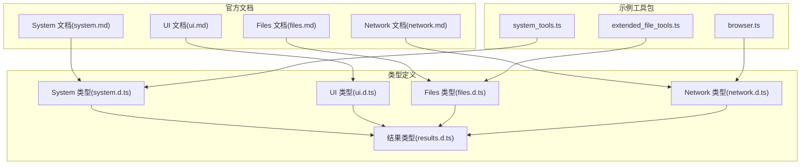
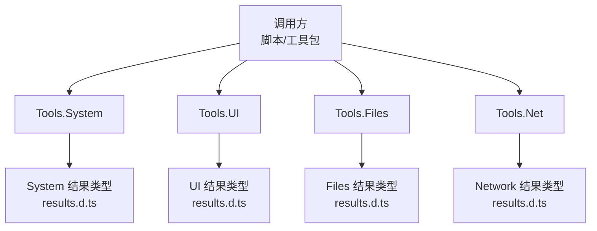
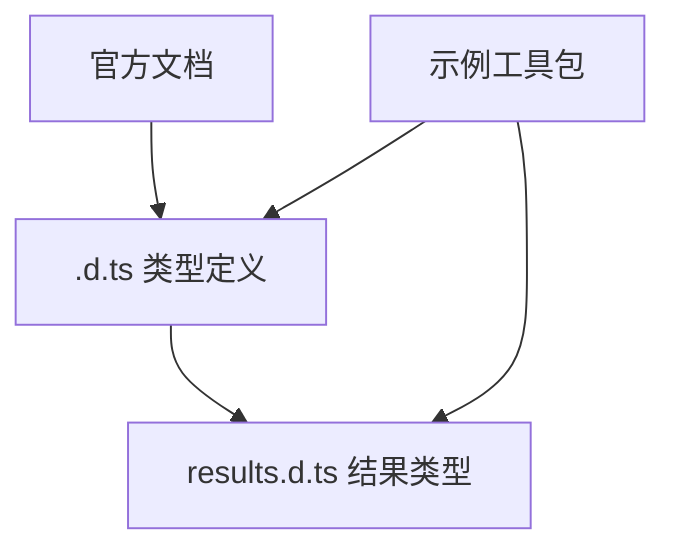

# Tools API 参考

<cite>
**本文档引用的文件**
- [system.d.ts](file://examples/types/system.d.ts)
- [ui.d.ts](file://examples/types/ui.d.ts)
- [files.d.ts](file://examples/types/files.d.ts)
- [network.d.ts](file://examples/types/network.d.ts)
- [results.d.ts](file://examples/types/results.d.ts)
- [system.md](file://docs/package_dev/system.md)
- [ui.md](file://docs/package_dev/ui.md)
- [files.md](file://docs/package_dev/files.md)
- [network.md](file://docs/package_dev/network.md)
- [system_tools.ts](file://examples/system_tools.ts)
- [browser.ts](file://examples/browser.ts)
- [extended_file_tools.ts](file://examples/extended_file_tools.ts)
</cite>

## 目录
1. [简介](#简介)
2. [项目结构](#项目结构)
3. [核心组件](#核心组件)
4. [架构总览](#架构总览)
5. [详细组件分析](#详细组件分析)
6. [依赖关系分析](#依赖关系分析)
7. [性能考量](#性能考量)
8. [故障排查指南](#故障排查指南)
9. [结论](#结论)
10. [附录](#附录)

## 简介
本参考文档面向 Operit 工具生态的 Tools API，聚焦三大核心命名空间：
- System：系统级操作，涵盖睡眠、系统设置、应用生命周期、设备信息、通知、定位、Shell/Intent、终端会话等。
- UI：UI 自动化能力，包含页面信息获取、点击/长按/滑动/按键、文本输入、元素查找与 UINode 对象模型。
- Files：文件系统操作，覆盖读写、目录遍历、搜索、移动/复制/删除、压缩/解压、下载、打开/分享等。
- Network：网络请求与网页访问，包含 HTTP 请求、网页抓取、持久浏览器会话、Cookie 管理等。

文档基于类型定义与官方文档，提供参数、返回值、调用规范与使用示例，并辅以常见问题与排错建议。

## 项目结构
Operit 的工具 API 由 TypeScript 类型定义与配套文档构成，核心文件分布如下：
- 类型定义：examples/types 下的 system.d.ts、ui.d.ts、files.d.ts、network.d.ts、results.d.ts
- 官方文档：docs/package_dev 下的 system.md、ui.md、files.md、network.md
- 示例工具包：examples 下的 system_tools.ts、browser.ts、extended_file_tools.ts 等

**图表来源**
- [system.d.ts:1-230](file://examples/types/system.d.ts#L1-L230)
- [ui.d.ts:1-416](file://examples/types/ui.d.ts#L1-L416)
- [files.d.ts:1-236](file://examples/types/files.d.ts#L1-L236)
- [network.d.ts:1-353](file://examples/types/network.d.ts#L1-L353)
- [results.d.ts:1-800](file://examples/types/results.d.ts#L1-L800)
- [system.md:1-237](file://docs/package_dev/system.md#L1-L237)
- [ui.md:1-203](file://docs/package_dev/ui.md#L1-L203)
- [files.md:1-254](file://docs/package_dev/files.md#L1-L254)
- [network.md:1-224](file://docs/package_dev/network.md#L1-L224)
- [system_tools.ts:1-416](file://examples/system_tools.ts#L1-L416)
- [browser.ts:1-510](file://examples/browser.ts#L1-L510)
- [extended_file_tools.ts:1-199](file://examples/extended_file_tools.ts#L1-L199)

**章节来源**
- [system.d.ts:1-230](file://examples/types/system.d.ts#L1-L230)
- [ui.d.ts:1-416](file://examples/types/ui.d.ts#L1-L416)
- [files.d.ts:1-236](file://examples/types/files.d.ts#L1-L236)
- [network.d.ts:1-353](file://examples/types/network.d.ts#L1-L353)
- [results.d.ts:1-800](file://examples/types/results.d.ts#L1-L800)
- [system.md:1-237](file://docs/package_dev/system.md#L1-L237)
- [ui.md:1-203](file://docs/package_dev/ui.md#L1-L203)
- [files.md:1-254](file://docs/package_dev/files.md#L1-L254)
- [network.md:1-224](file://docs/package_dev/network.md#L1-L224)

## 核心组件
- System 命名空间：系统级控制与设备交互，如 sleep、getSetting/setSetting、getDeviceInfo、toast、sendNotification、installApp/uninstallApp/startApp/stopApp/listApps、getNotifications、getAppUsageTime、getLocation、shell、intent/sendBroadcast、terminal 会话等。
- UI 命名空间：页面信息获取与直接动作，如 getPageInfo、tap/longPress、clickElement、setText、pressKey、swipe、runSubAgent；以及 UINode 对象模型的文本提取、搜索、动作与静态方法。
- Files 命名空间：文件系统操作，如 list/read/readPart/readBinary、write/writeBinary、deleteFile、exists、move/copy、mkdir、find/grep/grepContext、info、apply、zip/unzip、open/share、download。
- Network 命名空间：HTTP 请求（httpGet/httpPost/http）、上传（uploadFile）、网页访问（visit）、持久浏览器会话（startBrowser/stopBrowser/browser* 系列）、Cookie 管理（cookies）。

**章节来源**
- [system.d.ts:15-229](file://examples/types/system.d.ts#L15-L229)
- [ui.d.ts:12-128](file://examples/types/ui.d.ts#L12-L128)
- [files.d.ts:23-235](file://examples/types/files.d.ts#L23-L235)
- [network.d.ts:10-352](file://examples/types/network.d.ts#L10-L352)

## 架构总览
Tools API 采用“命名空间 + 结果类型”的分层设计：
- 命名空间暴露高层 API，统一入口为 Tools.System、Tools.UI、Tools.Files、Tools.Net。
- 结果类型集中定义在 results.d.ts，确保所有 API 的返回值结构一致、可预期。
- 文档与类型定义相互印证，示例工具包演示真实调用场景。

**图表来源**
- [system.d.ts:15-229](file://examples/types/system.d.ts#L15-L229)
- [ui.d.ts:12-128](file://examples/types/ui.d.ts#L12-L128)
- [files.d.ts:23-235](file://examples/types/files.d.ts#L23-L235)
- [network.d.ts:10-352](file://examples/types/network.d.ts#L10-L352)
- [results.d.ts:1-800](file://examples/types/results.d.ts#L1-L800)

## 详细组件分析

### System 命名空间 API 参考
- sleep(milliseconds)
  - 参数：milliseconds（字符串或数字）
  - 返回：SleepResultData
  - 用途：延时控制
  - 示例：[system.md:189-194](file://docs/package_dev/system.md#L189-L194)
- getSetting(setting, namespace?)
  - 返回：SystemSettingData
  - 用途：读取系统设置
- setSetting(setting, value, namespace?)
  - 返回：SystemSettingData
  - 用途：修改系统设置
- getDeviceInfo()
  - 返回：DeviceInfoResultData
  - 用途：获取设备信息
- toast(message)
  - 返回：StringResultData
  - 用途：显示 Toast
- sendNotification(message, title?)
  - 返回：StringResultData
  - 用途：发送通知
- usePackage(packageName)
  - 返回：Promise<string>
  - 用途：加载工具包
- installApp(path)
  - 返回：AppOperationData
  - 用途：安装应用
- uninstallApp(packageName)
  - 返回：AppOperationData
  - 用途：卸载应用
- stopApp(packageName)
  - 返回：AppOperationData
  - 用途：强制停止应用
- listApps(includeSystem?)
  - 返回：AppListData
  - 用途：列举应用
- startApp(packageName, activity?)
  - 返回：AppOperationData
  - 用途：启动应用
- getNotifications(limit?, includeOngoing?)
  - 返回：NotificationData
  - 用途：获取通知
- getAppUsageTime(options?)
  - 返回：AppUsageTimeResultData
  - 说明：需 Usage Access 权限
- getLocation(highAccuracy?, timeout?)
  - 返回：LocationData
  - 用途：获取位置
- shell(command)
  - 返回：ADBResultData
  - 说明：需要 root
- intent(options?)
  - 返回：IntentResultData
  - 用途：执行 Intent
- sendBroadcast(options?)
  - 返回：IntentResultData
  - 用途：发送广播
- terminal.*（终端会话）
  - create(sessionName?) → TerminalSessionCreationResultData
  - exec(sessionId, command, timeoutMs?) → TerminalCommandResultData
  - execStreaming(sessionId, command, options?) → TerminalCommandResultData
  - hiddenExec(command, options?) → HiddenTerminalCommandResultData
  - close(sessionId) → TerminalSessionCloseResultData
  - screen(sessionId) → TerminalSessionScreenResultData
  - input(sessionId, options?) → StringResultData

调用规范与示例
- 建议总是显式传入 timeoutMs（终端命令）
- 终端输入支持 input 与 control 组合键
- Intent extras 支持对象或字符串键值对
- getAppUsageTime 默认统计最近 24 小时，可按包名或排序限制返回条数

**章节来源**
- [system.d.ts:15-229](file://examples/types/system.d.ts#L15-L229)
- [results.d.ts:280-573](file://examples/types/results.d.ts#L280-L573)
- [system.md:1-237](file://docs/package_dev/system.md#L1-L237)
- [system_tools.ts:1-416](file://examples/system_tools.ts#L1-L416)

### UI 命名空间 API 参考
- getPageInfo()
  - 返回：UIPageResultData
  - 用途：获取当前页面信息
- tap(x, y)
  - 返回：UIActionResultData
  - 用途：按坐标点击
- longPress(x, y)
  - 返回：UIActionResultData
  - 用途：按坐标长按
- clickElement(...)
  - 支持多种重载：resourceId、bounds、对象参数、type/value/index 等
  - 返回：UIActionResultData
- setText(text, resourceId?)
  - 返回：UIActionResultData
  - 用途：设置输入框文本
- pressKey(keyCode)
  - 返回：UIActionResultData
  - 用途：按键事件
- swipe(startX, startY, endX, endY, duration?)
  - 返回：UIActionResultData
  - 用途：滑动
- runSubAgent(intent, maxSteps?, agentId?, targetApp?)
  - 返回：AutomationExecutionResultData
  - 用途：高层目标驱动的 UI 自动化

UINode 对象模型
- 创建：UINode.getCurrentPage() 或 UINode.fromPageInfo(page)
- 属性：className/text/contentDesc/resourceId/bounds/isClickable/rawNode/parent/path/centerPoint/children/childCount
- 文本：allTexts()/textContent()/hasText()
- 搜索：find()/findAll()/findByText()/findById()/findByClass()/findByContentDesc()/findClickable()/closest()
- 动作：click()/longPress()/setText()/wait()/clickAndWait()/longPressAndWait()
- 静态：fromPageInfo()/getCurrentPage()/findAndWait()/clickAndWait()/longPressAndWait()

调用规范与示例
- clickElement 支持部分匹配与可点击过滤
- setText 可结合 resourceId 精确定位输入框
- runSubAgent 适合复杂流程编排

**章节来源**
- [ui.d.ts:12-416](file://examples/types/ui.d.ts#L12-L416)
- [results.d.ts:410-469](file://examples/types/results.d.ts#L410-L469)
- [ui.md:1-203](file://docs/package_dev/ui.md#L1-L203)

### Files 命名空间 API 参考
- list(path, environment?)
  - 返回：DirectoryListingData
  - 用途：目录遍历
- read(path)/read(options)
  - 返回：FileContentData
  - 用途：读取文件（支持 intent、direct_image）
- readPart(path, startLine?, endLine?, environment?)
  - 返回：FilePartContentData
  - 用途：按行范围读取
- readBinary(path, environment?)
  - 返回：BinaryFileContentData
  - 用途：读取二进制文件（Base64）
- write(path, content, append?, environment?)
  - 返回：FileOperationData
  - 用途：写入文本
- writeBinary(path, base64Content, environment?)
  - 返回：FileOperationData
  - 用途：写入二进制
- deleteFile(path, recursive?, environment?)
  - 返回：FileOperationData
  - 用途：删除文件/目录
- exists(path, environment?)
  - 返回：FileExistsData
  - 用途：存在性检查
- move(source, destination, environment?)
  - 返回：FileOperationData
  - 用途：移动/重命名
- copy(source, destination, recursive?, sourceEnvironment?, destEnvironment?)
  - 返回：FileOperationData
  - 用途：跨环境复制
- mkdir(path, create_parents?, environment?)
  - 返回：FileOperationData
  - 用途：创建目录
- find(path, pattern, options?, environment?)
  - 返回：FindFilesResultData
  - 用途：按模式搜索
- grep(path, pattern, options?)
  - 返回：GrepResultData
  - 用途：正则检索（含上下文）
- grepContext(path, intent, options?)
  - 返回：GrepResultData
  - 用途：意图驱动的内容检索
- info(path, environment?)
  - 返回：FileInfoData
  - 用途：文件信息
- apply(path, type, old?, newContent?, environment?)
  - 返回：FileApplyResultData
  - 用途：AI 智能合并（replace/delete/create）
- zip(source, destination, environment?, include_root_directory?)
  - 返回：FileOperationData
  - 用途：压缩
- unzip(source, destination, environment?)
  - 返回：FileOperationData
  - 用途：解压
- open(path, environment?)
  - 返回：FileOperationData
  - 用途：系统打开
- share(path, title?, environment?)
  - 返回：FileOperationData
  - 用途：分享
- download(url, destination, environment?, headers?)
  - 返回：FileOperationData
  - 用途：下载文件
- download(options)
  - 返回：FileOperationData
  - 用途：结合 visit_key/link_number/image_number 等参数下载

调用规范与示例
- 多数 API 支持显式指定 environment（android/linux），默认 android
- copy 支持跨环境复制
- grep 支持 file_pattern、case_insensitive、context_lines、max_results
- apply 支持 replace/delete/create 三种类型

**章节来源**
- [files.d.ts:23-235](file://examples/types/files.d.ts#L23-L235)
- [results.d.ts:54-200](file://examples/types/results.d.ts#L54-L200)
- [files.md:1-254](file://docs/package_dev/files.md#L1-L254)
- [extended_file_tools.ts:1-199](file://examples/extended_file_tools.ts#L1-L199)

### Network 命名空间 API 参考
- httpGet(url, ignore_ssl?)
  - 返回：HttpResponseData
  - 用途：GET 请求
- httpPost(url, body, ignore_ssl?)
  - 返回：HttpResponseData
  - 用途：POST 请求
- http(options)
  - 返回：HttpResponseData
  - 用途：通用 HTTP 请求（method/headers/body/connect_timeout/read_timeout/follow_redirects/ignore_ssl/responseType/validateStatus）
- uploadFile(options)
  - 返回：HttpResponseData
  - 用途：multipart 上传
- visit(urlOrParams)
  - 返回：VisitWebResultData
  - 用途：网页访问与内容提取（注意：非原始 HTTP 响应）
- startBrowser(options?)
  - 返回：StringResultData（value 为 JSON 字符串）
  - 用途：启动持久浏览器会话
- stopBrowser(sessionIdOrOptions?)
  - 返回：StringResultData（value 为 JSON 字符串）
  - 用途：关闭会话或全部会话
- browserNavigate(urlOrOptions)
  - 返回：StringResultData
  - 用途：导航
- browserNavigateBack(options?)
  - 返回：StringResultData
  - 用途：后退
- browserClick(options)
  - 返回：StringResultData
  - 用途：点击元素（ref/selector）
- browserClose(options?)
  - 返回：StringResultData
  - 用途：关闭当前标签
- browserCloseAll(options?)
  - 返回：StringResultData
  - 用途：关闭全部标签
- browserConsoleMessages(options?)
  - 返回：StringResultData
  - 用途：读取控制台消息
- browserDrag(options)
  - 返回：StringResultData
  - 用途：拖拽
- browserEvaluate(options)
  - 返回：StringResultData
  - 用途：执行 JS
- browserFileUpload(options?)
  - 返回：StringResultData
  - 用途：处理文件选择器
- browserFillForm(options)
  - 返回：StringResultData
  - 用途：批量填表
- browserHandleDialog(options)
  - 返回：StringResultData
  - 用途：处理对话框
- browserHover(options)
  - 返回：StringResultData
  - 用途：悬停
- browserNetworkRequests(options?)
  - 返回：StringResultData
  - 用途：读取网络请求
- browserPressKey(keyOrOptions)
  - 返回：StringResultData
  - 用途：按键
- browserResize(options)
  - 返回：StringResultData
  - 用途：调整视口
- browserRunCode(options)
  - 返回：StringResultData
  - 用途：运行代码片段
- browserSelectOption(options)
  - 返回：StringResultData
  - 用途：选择下拉选项
- browserSnapshot(options?)
  - 返回：StringResultData
  - 用途：页面快照
- browserTabs(options)
  - 返回：StringResultData
  - 用途：标签管理
- browserType(options)
  - 返回：StringResultData
  - 用途：输入文本
- browserWaitFor(options)
  - 返回：StringResultData
  - 用途：等待
- browserUserscriptList(options?)
  - 返回：StringResultData
  - 用途：列出用户脚本
- browserUserscriptInstall(options)
  - 返回：StringResultData
  - 用途：安装用户脚本
- browserUserscriptStart(options)
  - 返回：StringResultData
  - 用途：启用用户脚本
- browserUserscriptStop(options)
  - 返回：StringResultData
  - 用途：禁用用户脚本
- browserUserscriptUninstall(options)
  - 返回：StringResultData
  - 用途：卸载用户脚本
- cookies.get(domain)
- cookies.set(domain, cookies)
- cookies.clear(domain?)

调用规范与示例
- visit 适合网页内容提取，非原始 HTTP 响应
- startBrowser 返回的 session_id 用于后续浏览器操作
- cookies 接口支持 get/set/clear

**章节来源**
- [network.d.ts:10-352](file://examples/types/network.d.ts#L10-L352)
- [results.d.ts:208-246](file://examples/types/results.d.ts#L208-L246)
- [network.md:1-224](file://docs/package_dev/network.md#L1-L224)
- [browser.ts:1-510](file://examples/browser.ts#L1-L510)

## 依赖关系分析
- 命名空间与结果类型
  - System/UI/Files/Network 均依赖 results.d.ts 中的结果类型定义，保证返回值一致性。
- 文档与类型定义
  - system.md/ui.md/files.md/network.md 与对应的 .d.ts 文件一一对应，文档补充了调用示例与注意事项。
- 示例工具包
  - system_tools.ts、browser.ts、extended_file_tools.ts 展示了真实调用流程与错误处理包装。

**图表来源**
- [system.d.ts:1-230](file://examples/types/system.d.ts#L1-L230)
- [ui.d.ts:1-416](file://examples/types/ui.d.ts#L1-L416)
- [files.d.ts:1-236](file://examples/types/files.d.ts#L1-L236)
- [network.d.ts:1-353](file://examples/types/network.d.ts#L1-L353)
- [results.d.ts:1-800](file://examples/types/results.d.ts#L1-L800)
- [system.md:1-237](file://docs/package_dev/system.md#L1-L237)
- [ui.md:1-203](file://docs/package_dev/ui.md#L1-L203)
- [files.md:1-254](file://docs/package_dev/files.md#L1-L254)
- [network.md:1-224](file://docs/package_dev/network.md#L1-L224)
- [system_tools.ts:1-416](file://examples/system_tools.ts#L1-L416)
- [browser.ts:1-510](file://examples/browser.ts#L1-L510)
- [extended_file_tools.ts:1-199](file://examples/extended_file_tools.ts#L1-L199)

**章节来源**
- [results.d.ts:1-800](file://examples/types/results.d.ts#L1-L800)

## 性能考量
- System
  - sleep 用于协调异步流程，避免过于频繁的轮询。
  - getAppUsageTime 查询需 Usage Access 权限，建议缓存结果并在合理周期刷新。
- UI
  - clickElement 支持多条件筛选，建议优先使用精确标识（resourceId/bounds）减少遍历成本。
  - UINode 的 wait/clickAndWait/longPressAndWait 会触发页面更新，建议在必要时使用。
- Files
  - readPart 适用于大文件分段读取，避免一次性加载。
  - copy 支持跨环境复制，注意网络与权限开销。
  - zip/unzip 对大文件/目录影响较大，建议在后台执行并提供进度反馈。
- Network
  - http/visit/uploadFile 等请求建议设置合理的超时与重试策略。
  - startBrowser/stopBrowser 会占用资源，建议在任务完成后及时释放。

[本节为通用指导，无需特定文件来源]

## 故障排查指南
- 权限相关
  - System.shell：需要 root 权限。
  - System.getNotifications/getAppUsageTime/getLocation：需相应系统权限与授权。
  - Files/Network：涉及外部系统能力时，需确认应用权限与系统策略。
- 超时与稳定性
  - System.terminal.exec：强烈建议传入 timeoutMs。
  - Network.http：建议设置 connect_timeout/read_timeout/follow_redirects。
- 数据完整性
  - Network.visit：返回内容可能被截断并保存至本地文件，需结合 readPart/grep 使用。
- 返回值解析
  - Network.startBrowser/stopBrowser 等返回 StringResultData，value 字段通常为 JSON 字符串，需解析后使用。
  - Files.download 返回 FileOperationData，检查 successful 与 details 字段。

**章节来源**
- [system.md:110-118](file://docs/package_dev/system.md#L110-L118)
- [network.md:72-98](file://docs/package_dev/network.md#L72-L98)
- [results.d.ts:506-573](file://examples/types/results.d.ts#L506-L573)

## 结论
Operit Tools API 通过清晰的命名空间划分与强类型结果定义，提供了系统级控制、UI 自动化、文件操作与网络请求的完整能力矩阵。结合官方文档与示例工具包，开发者可以快速构建稳定、可维护的自动化流程。建议在生产环境中重视权限管理、超时控制与错误处理，并根据场景选择合适的 API 与调用模式。

[本节为总结性内容，无需特定文件来源]

## 附录
- 使用示例索引
  - System：[system.md:187-230](file://docs/package_dev/system.md#L187-L230)
  - UI：[ui.md:158-196](file://docs/package_dev/ui.md#L158-L196)
  - Files：[files.md:181-232](file://docs/package_dev/files.md#L181-L232)
  - Network：[network.md:159-211](file://docs/package_dev/network.md#L159-L211)
- 示例工具包
  - System：[system_tools.ts:1-416](file://examples/system_tools.ts#L1-L416)
  - Browser：[browser.ts:1-510](file://examples/browser.ts#L1-L510)
  - Extended Files：[extended_file_tools.ts:1-199](file://examples/extended_file_tools.ts#L1-L199)

**章节来源**
- [system.md:187-230](file://docs/package_dev/system.md#L187-L230)
- [ui.md:158-196](file://docs/package_dev/ui.md#L158-L196)
- [files.md:181-232](file://docs/package_dev/files.md#L181-L232)
- [network.md:159-211](file://docs/package_dev/network.md#L159-L211)
- [system_tools.ts:1-416](file://examples/system_tools.ts#L1-L416)
- [browser.ts:1-510](file://examples/browser.ts#L1-L510)
- [extended_file_tools.ts:1-199](file://examples/extended_file_tools.ts#L1-L199)