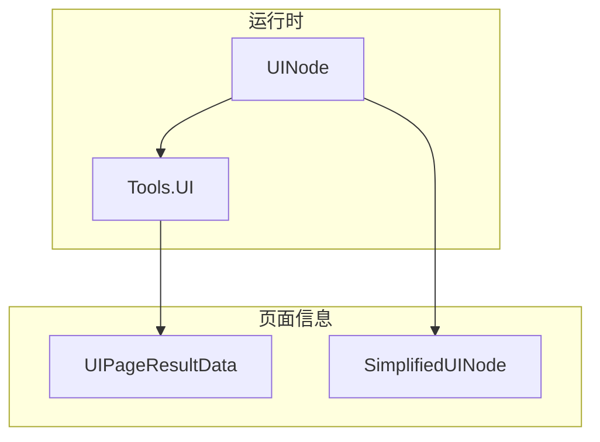
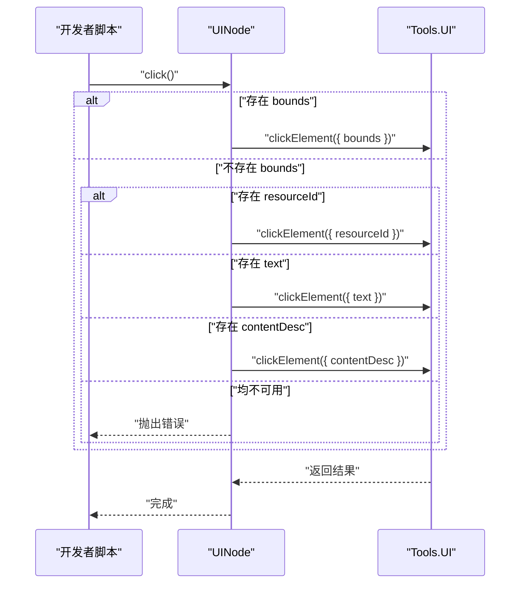
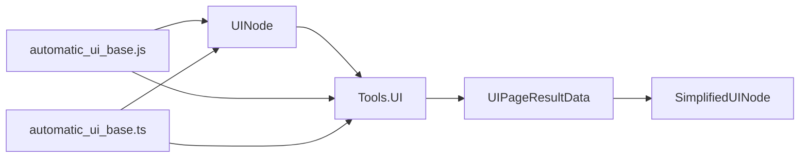

# UI API

<cite>
**本文引用的文件**
- [UINode.js](file://app/src/main/assets/js/UINode.js)
- [ui.d.ts](file://examples/types/ui.d.ts)
- [results.d.ts](file://examples/types/results.d.ts)
- [automatic_ui_base.js](file://app/src/main/assets/packages/automatic_ui_base.js)
- [automatic_ui_base.ts](file://examples/automatic_ui_base.ts)
- [ui.md](file://docs/package_dev/ui.md)
</cite>

## 目录
1. [简介](#简介)
2. [项目结构与入口](#项目结构与入口)
3. [核心组件总览](#核心组件总览)
4. [架构概览](#架构概览)
5. [详细组件分析](#详细组件分析)
6. [依赖关系分析](#依赖关系分析)
7. [性能与稳定性](#性能与稳定性)
8. [故障排查指南](#故障排查指南)
9. [结论](#结论)
10. [附录：API 定义与示例](#附录api-定义与示例)

## 简介
本文件为 Operit UI 自动化能力的完整 API 参考，覆盖以下主题：
- UI 命名空间下的自动化方法：getPageInfo()、pressKey()、swipe()、setText()、findElement()（clickElement）、click()、longPress() 等
- UINode 对象的结构与属性：text、bounds、resourceId、childCount 等
- 元素查找策略与交互操作示例：基于 ID、文本、类名、内容描述、边界等
- 稳定性保障机制与常见问题的解决方案

## 项目结构与入口
- 运行时入口：Tools.UI 与 UINode 为全局可用
- UINode 提供 DOM 风格的节点树封装与查询、交互能力
- Tools.UI 提供直接的动作执行（点击、长按、滑动、按键、输入文本、页面信息获取）



图表来源
- [ui.md:1-203](file://docs/package_dev/ui.md#L1-L203)
- [results.d.ts:410-439](file://examples/types/results.d.ts#L410-L439)
- [UINode.js:42-869](file://app/src/main/assets/js/UINode.js#L42-L869)

章节来源
- [ui.md:1-203](file://docs/package_dev/ui.md#L1-L203)

## 核心组件总览
- Tools.UI 命名空间
  - getPageInfo(): 获取当前页面信息（UIPageResultData）
  - tap(x, y): 按坐标点击
  - longPress(x, y): 按坐标长按
  - setText(text, resourceId?): 在输入框设置文本
  - pressKey(keyCode): 发送按键事件
  - swipe(startX, startY, endX, endY, duration?): 执行滑动
  - clickElement(...): 多种重载形式，支持按 resourceId、className、bounds 或对象参数组合查找并点击
  - runSubAgent(...): 以高层意图驱动的 UI 子代理执行
- UINode 类
  - 属性：className、text、contentDesc、resourceId、bounds、isClickable、rawNode、parent、path、centerPoint、children、childCount
  - 方法：find()/findAll()、findByText()/findAllByText()、findById()/findAllById()、findByClass()/findAllByClass()、findByContentDesc()/findAllByContentDesc()、findClickable()、closest()、click()、longPress()、setText()、wait()/clickAndWait()/longPressAndWait()、toString()/toTree()/toTreeString()/toFormattedString?()、equals()、静态方法 fromPageInfo()/getCurrentPage()/findAndWait()/clickAndWait()/longPressAndWait()

章节来源
- [ui.d.ts:12-128](file://examples/types/ui.d.ts#L12-L128)
- [ui.d.ts:137-416](file://examples/types/ui.d.ts#L137-L416)
- [automatic_ui_base.js:101-325](file://app/src/main/assets/packages/automatic_ui_base.js#L101-L325)
- [automatic_ui_base.ts:102-358](file://examples/automatic_ui_base.ts#L102-L358)

## 架构概览
UI 自动化分层如下：
- 顶层 API：Tools.UI 提供直接动作与页面信息读取
- 中间层：UINode 封装页面结构，提供查询、遍历与交互
- 数据层：SimplifiedUINode 与 UIPageResultData 描述页面层级与元素属性
- 工具层：automatic_ui_base 提供工具函数封装与示例

```mermaid
classDiagram
class Tools_UI {
+getPageInfo() UIPageResultData
+tap(x : number, y : number) UIActionResultData
+longPress(x : number, y : number) UIActionResultData
+setText(text : string, resourceId? : string) UIActionResultData
+pressKey(keyCode : string) UIActionResultData
+swipe(startX : number, startY : number, endX : number, endY : number, duration? : number) UIActionResultData
+clickElement(...)
+runSubAgent(intent : string, maxSteps? : number, agentId? : string, targetApp? : string) AutomationExecutionResultData
}
class UINode {
+className string?
+text string?
+contentDesc string?
+resourceId string?
+bounds string?
+isClickable boolean
+rawNode SimplifiedUINode
+parent UINode?
+path string
+centerPoint {x : number,y : number}?
+children UINode[]
+childCount number
+find(criteria, deep?) UINode|undefined
+findAll(criteria, deep?) UINode[]
+findByText(text, options?)
+findAllByText(text, options?)
+findById(id, options?)
+findAllById(id, options?)
+findByClass(className, options?)
+findAllByClass(className, options?)
+findByContentDesc(description, options?)
+findAllByContentDesc(description, options?)
+findClickable() UINode[]
+closest(criteria) UINode|undefined
+click() UIActionResultData
+longPress() UIActionResultData
+setText(text) UIActionResultData
+wait(ms?) UINode
+clickAndWait(ms?) UINode
+longPressAndWait(ms?) UINode
+toString() string
+toTree(indent?) string
+toTreeString(indent?) string
+toFormattedString?() string
+equals(other : UINode) boolean
+static fromPageInfo(pageInfo : UIPageResultData) UINode
+static getCurrentPage() UINode
+static findAndWait(query, delayMs?) UINode
+static clickAndWait(query, delayMs?) UINode
+static longPressAndWait(query, delayMs?) UINode
}
Tools_UI --> UIPageResultData
UINode --> SimplifiedUINode
UINode --> Tools_UI : "调用动作"
```

图表来源
- [ui.d.ts:12-128](file://examples/types/ui.d.ts#L12-L128)
- [ui.d.ts:137-416](file://examples/types/ui.d.ts#L137-L416)
- [results.d.ts:394-439](file://examples/types/results.d.ts#L394-L439)
- [UINode.js:42-869](file://app/src/main/assets/js/UINode.js#L42-L869)

## 详细组件分析

### Tools.UI 命名空间 API
- getPageInfo()
  - 作用：获取当前页面信息（应用包名、活动名、UI 层级树）
  - 返回：UIPageResultData
- tap(x, y)
  - 作用：按坐标点击
- longPress(x, y)
  - 作用：按坐标长按
- setText(text, resourceId?)
  - 作用：在输入框设置文本；可选指定 resourceId 定位输入框
- pressKey(keyCode)
  - 作用：发送按键事件（如 KEYCODE_BACK、KEYCODE_HOME）
- swipe(startX, startY, endX, endY, duration?)
  - 作用：执行滑动；duration 可选，用于控制手势时长
- clickElement(...)
  - 支持的调用方式：
    - clickElement(resourceId)
    - clickElement(bounds)
    - clickElement(resourceId, index)
    - clickElement(type, value)
    - clickElement(type, value, index)
    - clickElement({ resourceId?, className?, text?, contentDesc?, bounds?, index?, partialMatch?, isClickable? })
  - 说明：type 可为 "resourceId" | "className" | "bounds"；bounds 格式为 "[x1,y1][x2,y2]"
- runSubAgent(intent, maxSteps?, agentId?, targetApp?)
  - 作用：以高层意图驱动的 UI 子代理执行，返回 AutomationExecutionResultData

章节来源
- [ui.d.ts:12-128](file://examples/types/ui.d.ts#L12-L128)
- [automatic_ui_base.js:101-325](file://app/src/main/assets/packages/automatic_ui_base.js#L101-L325)
- [automatic_ui_base.ts:102-358](file://examples/automatic_ui_base.ts#L102-L358)

### UINode 对象与属性
- 常用只读属性
  - className：类名
  - text：文本内容
  - contentDesc：内容描述
  - resourceId：资源 ID
  - bounds：边界字符串 "[x1,y1][x2,y2]"
  - isClickable：是否可点击
  - rawNode：底层 SimplifiedUINode
  - parent：父节点
  - path：从根到当前节点的路径字符串
  - centerPoint：基于 bounds 计算的中心点 {x,y}，若无 bounds 则为 undefined
  - children：子节点数组
  - childCount：子节点数量
- 文本提取
  - allTexts(trim?, skipEmpty?)：收集当前节点及其后代的文本
  - textContent(separator?)：将文本拼接为单个字符串
  - hasText(text, caseSensitive?)：判断是否存在指定文本
- 搜索方法
  - find(criteria, deep?) / findAll(criteria, deep?)
  - findByText(text, options?) / findAllByText(text, options?)
  - findById(id, options?) / findAllById(id, options?)
  - findByClass(className, options?) / findAllByClass(className, options?)
  - findByContentDesc(description, options?) / findAllByContentDesc(description, options?)
  - findClickable()：查找所有可点击节点
  - closest(criteria)：查找最近的祖先节点
- 动作方法
  - click()：优先使用 bounds 中心点坐标点击，否则回退到 resourceId/text/contentDesc
  - longPress()：优先使用 centerPoint，否则抛出错误
  - setText(text)：先 click 再 setText
  - wait(ms?)：等待后返回新的 UINode
  - clickAndWait(ms?) / longPressAndWait(ms?)：执行动作并等待后返回新 UINode
- 工具方法
  - toString() / toTree(indent?) / toTreeString(indent?) / toFormattedString?()
  - equals(other)：比较两个节点（优先比较 resourceId/bounds，其次 text/class）
- 静态方法
  - fromPageInfo(pageInfo)：从 UIPageResultData 构造 UINode
  - getCurrentPage()：获取当前页面 UINode
  - findAndWait(query, delayMs?) / clickAndWait(query, delayMs?) / longPressAndWait(query, delayMs?)

章节来源
- [ui.d.ts:137-416](file://examples/types/ui.d.ts#L137-L416)
- [UINode.js:42-869](file://app/src/main/assets/js/UINode.js#L42-L869)

### 元素查找策略与交互示例
- 基于 ID（resourceId）
  - findById(id, options?) / findAllById(id, options?)
  - clickElement({ resourceId, index? })
- 基于文本（text）
  - findByText(text, options?) / findAllByText(text, options?)
  - clickElement({ text, partialMatch?, isClickable? })
- 基于类名（className）
  - findByClass(className, options?) / findAllByClass(className, options?)
  - clickElement({ className, index? })
- 基于内容描述（contentDesc）
  - findByContentDesc(description, options?) / findAllByContentDesc(description, options?)
- 基于边界（bounds）
  - clickElement({ bounds })
- 组合条件
  - clickElement({ resourceId?, className?, text?, contentDesc?, bounds?, index?, partialMatch?, isClickable? })

章节来源
- [ui.d.ts:48-96](file://examples/types/ui.d.ts#L48-L96)
- [UINode.js:525-581](file://app/src/main/assets/js/UINode.js#L525-L581)

### UINode 点击流程（序列图）


图表来源
- [UINode.js:617-646](file://app/src/main/assets/js/UINode.js#L617-L646)
- [ui.d.ts:48-96](file://examples/types/ui.d.ts#L48-L96)

## 依赖关系分析
- UINode 依赖 Tools.UI 的动作执行（clickElement、setText、longPress、tap、swipe、pressKey）
- UINode 依赖 UIPageResultData/SimplifiedUINode 表达页面结构
- automatic_ui_base.js/ts 提供工具封装与示例，调用 Tools.UI 与 UINode



图表来源
- [results.d.ts:410-439](file://examples/types/results.d.ts#L410-L439)
- [automatic_ui_base.js:101-325](file://app/src/main/assets/packages/automatic_ui_base.js#L101-L325)
- [automatic_ui_base.ts:102-358](file://examples/automatic_ui_base.ts#L102-L358)

章节来源
- [results.d.ts:410-439](file://examples/types/results.d.ts#L410-L439)
- [automatic_ui_base.js:101-325](file://app/src/main/assets/packages/automatic_ui_base.js#L101-L325)
- [automatic_ui_base.ts:102-358](file://examples/automatic_ui_base.ts#L102-L358)

## 性能与稳定性
- 等待与刷新
  - UINode.wait(ms?) 与 clickAndWait()/longPressAndWait() 通过等待后重新抓取页面，确保 UI 状态更新
- 回退策略
  - UINode.click() 优先使用 bounds 中心点坐标；若无则回退至 resourceId/text/contentDesc；若仍不可用则抛错
- 错误处理
  - automatic_ui_base.js/ts 的工具封装统一使用 try/catch 包裹，捕获异常并返回标准化结果
- 建议
  - 在复杂交互前先 getPageInfo() 获取页面快照，再基于 UINode 查询与等待
  - 对于模糊匹配（partialMatch）与大小写敏感性（caseSensitive）谨慎使用，避免误触
  - 对于列表项，优先使用 index 参数精确定位

章节来源
- [UINode.js:661-703](file://app/src/main/assets/js/UINode.js#L661-L703)
- [automatic_ui_base.js:214-226](file://app/src/main/assets/packages/automatic_ui_base.js#L214-L226)
- [automatic_ui_base.ts:238-249](file://examples/automatic_ui_base.ts#L238-L249)

## 故障排查指南
- 现象：click() 抛出“无合适标识符”
  - 原因：节点无 bounds、resourceId、text、contentDesc
  - 解决：先获取页面信息，确认节点属性；或改用坐标点击（Tools.UI.tap/longPress/swipe）
- 现象：clickElement() 未点击到预期元素
  - 原因：匹配条件不精确或 partialMatch 导致多匹配
  - 解决：缩小条件范围；使用 index 精确选择；或改为 bounds 定位
- 现象：setText() 无效
  - 原因：输入框未聚焦或 resourceId 不正确
  - 解决：先 click() 确保聚焦；或明确传入 resourceId
- 现象：滑动无效或方向错误
  - 原因：坐标或距离不当
  - 解决：调整 start/end 坐标；必要时反向滑动或增加距离
- 现象：页面未更新导致后续步骤失败
  - 原因：缺少等待
  - 解决：使用 UINode.wait()/clickAndWait()/longPressAndWait() 等待 UI 更新

章节来源
- [UINode.js:617-646](file://app/src/main/assets/js/UINode.js#L617-L646)
- [automatic_ui_base.js:285-317](file://app/src/main/assets/packages/automatic_ui_base.js#L285-L317)
- [automatic_ui_base.ts:251-330](file://examples/automatic_ui_base.ts#L251-L330)

## 结论
Operit 的 UI 自动化以 Tools.UI 与 UINode 为核心，前者提供直接动作与页面读取，后者提供强大的节点查询与交互能力。通过合理的元素定位策略与等待机制，可构建稳定可靠的自动化流程。建议在实际使用中结合 getPageInfo() 与 UINode 的查询能力，优先采用精确匹配与坐标定位，配合等待与回退策略，提升成功率与鲁棒性。

## 附录：API 定义与示例

### API 定义速查
- Tools.UI
  - getPageInfo(): UIPageResultData
  - tap(x, y): UIActionResultData
  - longPress(x, y): UIActionResultData
  - setText(text, resourceId?): UIActionResultData
  - pressKey(keyCode): UIActionResultData
  - swipe(startX, startY, endX, endY, duration?): UIActionResultData
  - clickElement(...): UIActionResultData
  - runSubAgent(...): AutomationExecutionResultData
- UINode
  - 属性：className/text/contentDesc/resourceId/bounds/isClickable/rawNode/parent/path/centerPoint/children/childCount
  - 方法：find()/findAll()、findByText()/findAllByText()、findById()/findAllById()、findByClass()/findAllByClass()、findByContentDesc()/findAllByContentDesc()、findClickable()、closest()、click()、longPress()、setText()、wait()/clickAndWait()/longPressAndWait()、toString()/toTree()/toTreeString()/toFormattedString?()、equals()、静态方法 fromPageInfo()/getCurrentPage()/findAndWait()/clickAndWait()/longPressAndWait()

章节来源
- [ui.d.ts:12-128](file://examples/types/ui.d.ts#L12-L128)
- [ui.d.ts:137-416](file://examples/types/ui.d.ts#L137-L416)

### 示例参考
- 读取当前页面并查找文本
  - 获取 UINode 根节点，使用 findByText('确定')，存在则 click()
- 使用 clickElement 的对象模式
  - Tools.UI.clickElement({ text: '登录', partialMatch: false, isClickable: true })
- 设置输入框文本
  - Tools.UI.setText('hello world', 'com.example:id/input')
- 调用 UI 子代理
  - Tools.UI.runSubAgent('打开系统设置并进入 WLAN 页面', 20, undefined, 'com.android.settings')

章节来源
- [ui.md:158-196](file://docs/package_dev/ui.md#L158-L196)
- [automatic_ui_base.js:101-325](file://app/src/main/assets/packages/automatic_ui_base.js#L101-L325)
- [automatic_ui_base.ts:102-358](file://examples/automatic_ui_base.ts#L102-L358)