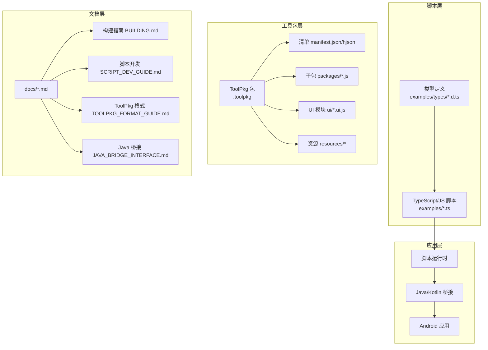
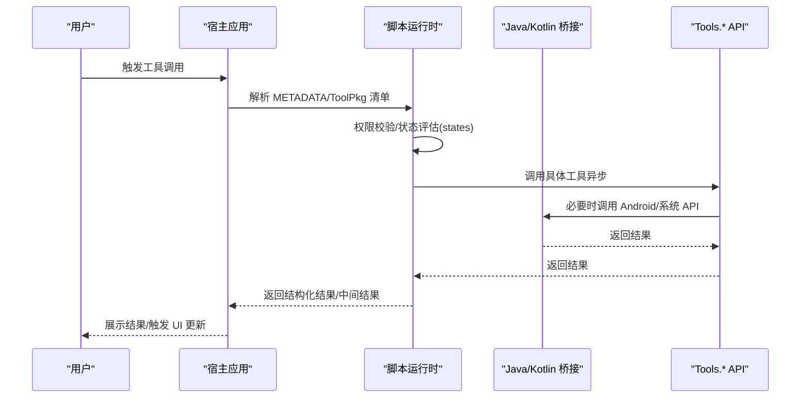
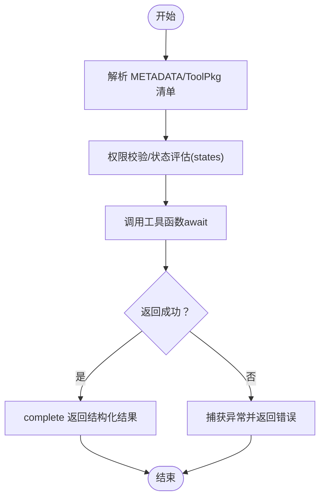
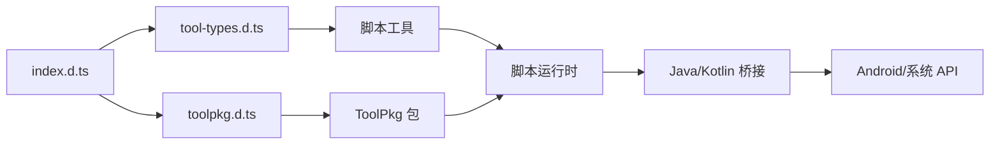

# 工具开发指南

<cite>
**本文引用的文件**
- [README.md](file://README.md)
- [BUILDING.md](file://docs/BUILDING.md)
- [CONTRIBUTING.md](file://docs/CONTRIBUTING.md)
- [SCRIPT_DEV_GUIDE.md](file://docs/SCRIPT_DEV_GUIDE.md)
- [TOOLPKG_FORMAT_GUIDE.md](file://docs/TOOLPKG_FORMAT_GUIDE.md)
- [JAVA_BRIDGE_INTERFACE.md](file://docs/JAVA_BRIDGE_INTERFACE.md)
- [index.d.ts](file://examples/types/index.d.ts)
- [tool-types.d.ts](file://examples/types/tool-types.d.ts)
- [toolpkg.d.ts](file://examples/types/toolpkg.d.ts)
- [system_tools.ts](file://examples/system_tools.ts)
- [extended_file_tools.ts](file://examples/extended_file_tools.ts)
</cite>

## 目录
1. [简介](#简介)
2. [项目结构](#项目结构)
3. [核心组件](#核心组件)
4. [架构总览](#架构总览)
5. [详细组件分析](#详细组件分析)
6. [依赖关系分析](#依赖关系分析)
7. [性能考量](#性能考量)
8. [故障排查指南](#故障排查指南)
9. [结论](#结论)
10. [附录](#附录)

## 简介
本指南面向 Operit 工具开发者，系统讲解工具接口规范、开发流程、工具类型体系、权限与安全、调试技巧与最佳实践。Operit 提供强大的工具生态，涵盖文件系统、网络请求、系统操作、UI 自动化、媒体处理、开发与终端、AI 创作、搜索与工作流等多个领域。开发者可通过 TypeScript/JavaScript 脚本、ToolPkg 包、MCP/Skill 插件等多种方式扩展能力。

## 项目结构
Operit 采用模块化与多语言混合架构：
- 应用层：Android 主工程，包含 UI、桥接、运行时与工具宿主
- 脚本层：examples 目录提供大量示例脚本，涵盖系统、文件、网络、UI 等工具
- 类型层：examples/types 提供完整的 TypeScript 类型定义，覆盖 Tools API、Java/Kotlin 桥接、ToolPkg 注册接口等
- 文档层：docs 目录提供构建指南、脚本开发指南、ToolPkg 格式说明、Java 桥接接口契约等
- 工具包层：ToolPkg 以 .toolpkg 形式打包，支持清单、子包、UI 模块、资源与工作区模板

**图表来源**
- [BUILDING.md:1-266](file://docs/BUILDING.md#L1-L266)
- [SCRIPT_DEV_GUIDE.md:1-800](file://docs/SCRIPT_DEV_GUIDE.md#L1-L800)
- [TOOLPKG_FORMAT_GUIDE.md:1-800](file://docs/TOOLPKG_FORMAT_GUIDE.md#L1-L800)
- [JAVA_BRIDGE_INTERFACE.md:1-215](file://docs/JAVA_BRIDGE_INTERFACE.md#L1-L215)

**章节来源**
- [README.md:1-469](file://README.md#L1-L469)
- [BUILDING.md:1-266](file://docs/BUILDING.md#L1-L266)

## 核心组件
- 工具接口与类型系统
  - Tools 命名空间：System、UI、Files、Net、FFmpeg、Tasker、Workflow、Chat、Memory 等
  - 工具名称到结果类型的映射：tool-types.d.ts
  - 全局工具调用函数 toolCall、complete、sendIntermediateResult、getEnv 等
- Java/Kotlin 桥接：Java/Kotlin 全局对象，支持类访问、构造、静态调用、接口实现、挂起调用等
- ToolPkg 注册接口：ToolPkg 命名空间，提供 UI 模块、导航入口、桌面小部件、生命周期钩子、消息处理插件、XML 渲染插件、输入菜单开关插件、工具生命周期钩子、提示词钩子、摘要生成钩子、AI Provider 注册等
- 脚本开发框架：METADATA 元数据、状态 states、多语言 display_name/description/env、工具导出与执行包装

**章节来源**
- [index.d.ts:1-323](file://examples/types/index.d.ts#L1-L323)
- [tool-types.d.ts:1-179](file://examples/types/tool-types.d.ts#L1-L179)
- [toolpkg.d.ts:1-718](file://examples/types/toolpkg.d.ts#L1-L718)
- [SCRIPT_DEV_GUIDE.md:272-800](file://docs/SCRIPT_DEV_GUIDE.md#L272-L800)

## 架构总览
Operit 的工具系统以“脚本/ToolPkg + 运行时 + 桥接 + 宿主应用”为核心：
- 脚本/ToolPkg 定义工具与 UI，通过 ToolPkg 注册接口声明 UI、导航、小部件、钩子等
- 运行时负责解析 METADATA、执行工具、桥接 Java/Kotlin、处理中间结果与完成结果
- 宿主应用提供权限管理、安全限制、UI 展示与工作流编排

**图表来源**
- [SCRIPT_DEV_GUIDE.md:503-526](file://docs/SCRIPT_DEV_GUIDE.md#L503-L526)
- [JAVA_BRIDGE_INTERFACE.md:13-215](file://docs/JAVA_BRIDGE_INTERFACE.md#L13-L215)
- [toolpkg.d.ts:655-677](file://examples/types/toolpkg.d.ts#L655-L677)

## 详细组件分析

### 工具接口规范与参数传递
- 工具调用
  - 工具调用函数：支持多种重载，可传入工具类型/名称、参数、可选中间结果回调
  - 完成函数：complete 返回结构化结果；sendIntermediateResult 发送中间结果
  - 环境变量：getEnv 读取配置；getState/getLang 获取运行时状态与语言
- 参数与返回
  - 参数类型：字符串、数字、布尔、对象
  - 返回类型：统一结构化对象，包含 success、message、data 等字段
  - 工具名称到结果类型的映射：通过 tool-types.d.ts 明确各工具返回数据结构
- 异步处理
  - 所有工具均为异步，调用需 await
  - 支持中间结果推送，便于长耗时任务的进度反馈

**图表来源**
- [SCRIPT_DEV_GUIDE.md:247-256](file://docs/SCRIPT_DEV_GUIDE.md#L247-L256)
- [tool-types.d.ts:31-179](file://examples/types/tool-types.d.ts#L31-L179)

**章节来源**
- [index.d.ts:247-279](file://examples/types/index.d.ts#L247-L279)
- [tool-types.d.ts:1-179](file://examples/types/tool-types.d.ts#L1-L179)

### 工具开发流程
- 环境准备
  - 参考构建指南，安装 JDK 17、Android SDK/NDK、Node.js/pnpm、Python3
  - 配置 ANDROID_HOME/PATH，接受 SDK 许可
  - 下载 models.zip、subpack.zip、jniLibs.zip、libs.zip 到项目目录
  - 构建 web-chat 并同步到 assets，打包 ToolPkg 并同步示例包
- 项目结构搭建
  - examples 目录存放脚本与类型定义
  - types 目录提供全局类型，确保 IDE 智能提示
  - ToolPkg 采用 manifest.json/hjson 清单，支持子包、UI、资源、工作区模板
- 编码规范
  - 使用 METADATA 声明工具名称、描述、参数、多语言与环境变量
  - 使用 states 根据设备能力/权限动态暴露工具集
  - 工具函数统一包装，使用 complete 返回结果
  - 优先使用 Tools.* API，必要时使用 Java/Kotlin 桥接
- 测试方法
  - 使用 tools/execute_js.* 或 run_sandbox_script.* 在设备上执行脚本
  - 通过日志与结构化结果验证工具行为
  - 对破坏性/敏感工具仅做说明不实际执行，或在沙箱环境中谨慎测试

**章节来源**
- [BUILDING.md:13-266](file://docs/BUILDING.md#L13-L266)
- [SCRIPT_DEV_GUIDE.md:22-142](file://docs/SCRIPT_DEV_GUIDE.md#L22-L142)
- [TOOLPKG_FORMAT_GUIDE.md:542-610](file://docs/TOOLPKG_FORMAT_GUIDE.md#L542-L610)

### 工具类型系统
- 标准工具（脚本工具）
  - 通过 METADATA 暴露，使用 Tools.* API 实现文件、网络、系统、UI 等操作
  - 示例：system_tools.ts、extended_file_tools.ts
- ToolPkg 工具
  - 以 .toolpkg 包形式分发，包含清单、子包、UI 模块、资源与模板
  - 通过 ToolPkg.register* 系列函数注册 UI、导航、小部件、钩子等
  - 示例：windows_control.toolpkg（参考 TOOLPKG_FORMAT_GUIDE.md）
- Java/Kotlin 工具
  - 通过 Java/Kotlin 全局对象直接调用 Android/系统 API
  - 支持构造实例、静态调用、接口实现、挂起调用等
  - 示例：JAVA_BRIDGE_INTERFACE.md 中的 API 行为约定
- MCP/Skill 工具
  - 通过 MCP 协议或 Skill 生态扩展工具，Operit 支持 uvx/npx、远程 MCP、自动描述与配置
  - 与 ToolPkg/脚本工具协同工作，形成统一工具生态

**章节来源**
- [system_tools.ts:1-416](file://examples/system_tools.ts#L1-L416)
- [extended_file_tools.ts:1-199](file://examples/extended_file_tools.ts#L1-L199)
- [TOOLPKG_FORMAT_GUIDE.md:15-25](file://docs/TOOLPKG_FORMAT_GUIDE.md#L15-L25)
- [JAVA_BRIDGE_INTERFACE.md:13-215](file://docs/JAVA_BRIDGE_INTERFACE.md#L13-L215)
- [README.md:116-124](file://README.md#L116-L124)

### 工具权限系统
- 权限声明
  - METADATA.env 声明工具运行所需的环境变量（如 API Key）
  - 工具描述中明确“需要用户授权”等安全提示
- 用户授权
  - 宿主应用在调用前进行权限校验与用户确认
  - 系统工具（如修改系统设置、安装应用、位置、通知）需相应权限
- 安全限制
  - 对破坏性/敏感操作（卸载应用、修改系统设置、强制停止应用）采取保护措施
  - 通过 states 根据权限等级动态暴露工具集
- 权限提升机制
  - 通过 Shizuku/Root/ADB 等通道提升权限，结合虚拟屏/多显示器场景
  - 运行时根据 capabilities 评估并选择合适的状态与工具集

**章节来源**
- [system_tools.ts:15-126](file://examples/system_tools.ts#L15-L126)
- [SCRIPT_DEV_GUIDE.md:329-378](file://docs/SCRIPT_DEV_GUIDE.md#L329-L378)
- [README.md:189-195](file://README.md#L189-L195)

### 工具开发示例
- 文件操作
  - 使用 Tools.Files.* 实现 exists/move/copy/info/zip/unzip/open/share 等
  - 示例：extended_file_tools.ts
- 网络请求
  - 使用 Tools.Net.httpGet/httpPost/visit_web 等
  - 注意区分 httpGet/httpPost 与 visit_web 的差异
- 系统调用
  - 使用 Tools.System.* 实现设置读取/修改、应用安装/卸载/启动/停止、通知获取、位置查询、设备信息等
  - 示例：system_tools.ts
- UI 交互
  - 使用 Tools.UI.* 实现页面信息获取、点击/输入/滑动、组合操作等
  - UINode 提供元素查找与属性读取
- Java/Kotlin 桥接
  - 使用 Java/Kotlin 全局对象直接调用 Android API，实现更底层的能力
  - 示例：JAVA_BRIDGE_INTERFACE.md

**章节来源**
- [extended_file_tools.ts:1-199](file://examples/extended_file_tools.ts#L1-L199)
- [system_tools.ts:1-416](file://examples/system_tools.ts#L1-L416)
- [SCRIPT_DEV_GUIDE.md:503-526](file://docs/SCRIPT_DEV_GUIDE.md#L503-L526)
- [JAVA_BRIDGE_INTERFACE.md:13-215](file://docs/JAVA_BRIDGE_INTERFACE.md#L13-L215)

### 工具调试技巧
- 日志记录
  - 使用 console.log/console.error 输出调试信息
  - 通过结构化结果与中间结果反馈工具执行状态
- 断点调试
  - 在本地/设备上使用 tools/execute_js.* 或 run_sandbox_script.* 执行脚本
  - 对长耗时工具使用 sendIntermediateResult 推送进度
- 性能分析
  - 关注工具调用链路与并发度，合理拆分与合并工具调用
  - 对网络与 I/O 密集型工具设置超时与重试策略
- 错误处理
  - 工具函数统一包装，捕获异常并通过 complete 返回错误信息
  - 对敏感/破坏性工具仅做说明不实际执行，或在沙箱环境中测试

**章节来源**
- [SCRIPT_DEV_GUIDE.md:111-142](file://docs/SCRIPT_DEV_GUIDE.md#L111-L142)
- [system_tools.ts:226-382](file://examples/system_tools.ts#L226-L382)

## 依赖关系分析
- 类型依赖
  - index.d.ts 汇总导出核心类型、结果类型、工具类型、Java 桥接类型、ToolPkg 注册接口
  - tool-types.d.ts 映射工具名称到结果类型
  - toolpkg.d.ts 定义 ToolPkg 注册接口与事件钩子
- 运行时依赖
  - 脚本通过 Tools.* 与 Java/Kotlin 桥接访问系统能力
  - ToolPkg 通过注册接口声明 UI、导航、小部件与钩子
- 文档与构建依赖
  - BUILDING.md 提供编译与打包流程
  - TOOLPKG_FORMAT_GUIDE.md 提供 ToolPkg 结构与清单规范
  - SCRIPT_DEV_GUIDE.md 提供脚本开发与调试指南

**图表来源**
- [index.d.ts:1-323](file://examples/types/index.d.ts#L1-L323)
- [tool-types.d.ts:1-179](file://examples/types/tool-types.d.ts#L1-L179)
- [toolpkg.d.ts:1-718](file://examples/types/toolpkg.d.ts#L1-L718)

**章节来源**
- [index.d.ts:89-125](file://examples/types/index.d.ts#L89-L125)
- [toolpkg.d.ts:655-677](file://examples/types/toolpkg.d.ts#L655-L677)

## 性能考量
- 工具并行
  - 只读工具可并行执行，减少等待时间
  - 对网络与 I/O 密集型工具设置合理的并发度与超时
- 中间结果推送
  - 对长耗时工具使用 sendIntermediateResult 提升用户体验
- 资源与模板
  - ToolPkg 资源与模板按需加载，避免不必要的 IO
- 运行时优化
  - 使用 states 根据设备能力选择最优工具实现
  - 合理使用 Java/Kotlin 桥接，避免频繁跨语言调用

[本节为通用指导，无需特定文件引用]

## 故障排查指南
- 构建问题
  - SDK 许可未接受：执行 yes | sdkmanager --licenses
  - 缺少依赖库：确保 models.zip、subpack.zip、jniLibs.zip、libs.zip 已放置到项目目录
  - Node.js/Python/pnpm 版本不匹配：参考 BUILDING.md 的版本要求
- 脚本执行问题
  - METADATA 缺失或格式错误：检查 manifest.json/hjson 与脚本头部注释
  - 工具未找到：确认工具名称与导出函数一致
  - 权限不足：检查宿主应用权限与用户授权流程
- ToolPkg 打包问题
  - 清单字段缺失：确保 schema_version、toolpkg_id、main 等字段齐全
  - 子包未注册：确认子包脚本包含 METADATA 且入口路径正确
- Java/Kotlin 桥接问题
  - 类/方法不存在：核对类名与方法签名
  - 类型转换异常：参考 JAVA_BRIDGE_INTERFACE.md 的转换规则

**章节来源**
- [BUILDING.md:254-266](file://docs/BUILDING.md#L254-L266)
- [TOOLPKG_FORMAT_GUIDE.md:581-610](file://docs/TOOLPKG_FORMAT_GUIDE.md#L581-L610)
- [JAVA_BRIDGE_INTERFACE.md:139-177](file://docs/JAVA_BRIDGE_INTERFACE.md#L139-L177)

## 结论
Operit 工具开发体系以脚本与 ToolPkg 为核心，辅以完善的类型系统、Java/Kotlin 桥接与宿主应用的权限与安全机制。开发者可按本文档的接口规范、开发流程与调试技巧，快速构建高质量的工具与工具包，融入 Operit 的强大工具生态。

[本节为总结，无需特定文件引用]

## 附录
- 快速开始
  - 克隆项目并安装依赖：npm install
  - 构建 web-chat 并同步到 assets：npm run build:webchat
  - 打包 ToolPkg 并同步示例包：python3 ./sync_example_packages.py
  - 在设备上执行脚本：tools/execute_js.* 或 run_sandbox_script.*
- 参考示例
  - 系统工具：examples/system_tools.ts
  - 文件工具：examples/extended_file_tools.ts
  - ToolPkg 格式：docs/TOOLPKG_FORMAT_GUIDE.md
  - Java 桥接接口：docs/JAVA_BRIDGE_INTERFACE.md

**章节来源**
- [BUILDING.md:169-253](file://docs/BUILDING.md#L169-L253)
- [SCRIPT_DEV_GUIDE.md:22-142](file://docs/SCRIPT_DEV_GUIDE.md#L22-L142)
- [system_tools.ts:1-416](file://examples/system_tools.ts#L1-L416)
- [extended_file_tools.ts:1-199](file://examples/extended_file_tools.ts#L1-L199)
- [TOOLPKG_FORMAT_GUIDE.md:1-800](file://docs/TOOLPKG_FORMAT_GUIDE.md#L1-L800)
- [JAVA_BRIDGE_INTERFACE.md:1-215](file://docs/JAVA_BRIDGE_INTERFACE.md#L1-L215)