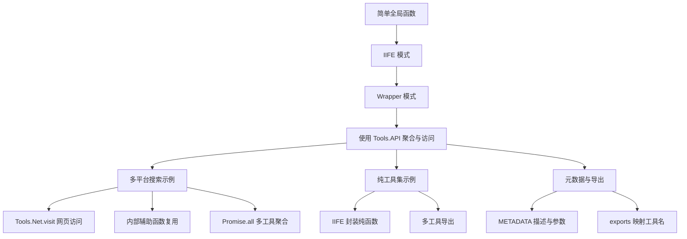
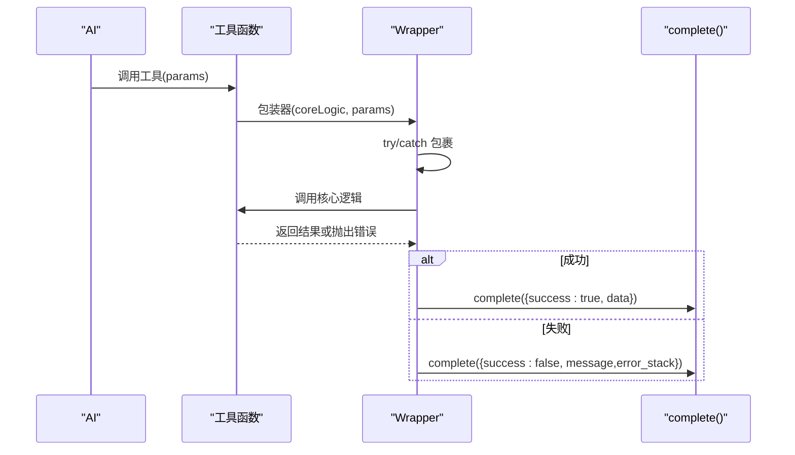
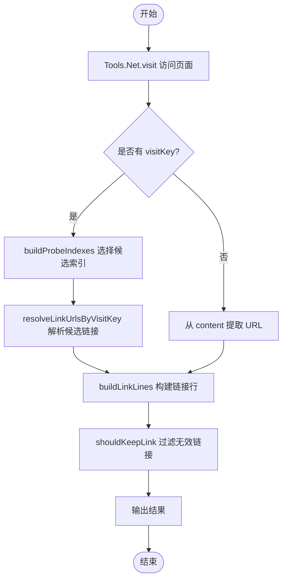
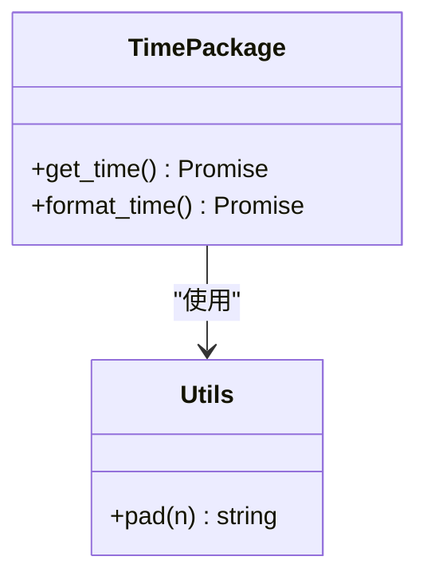
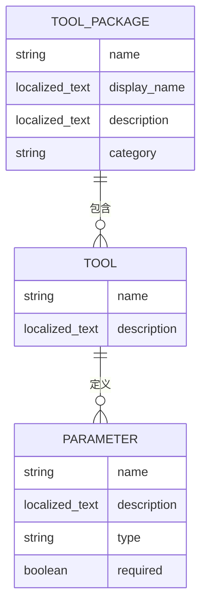
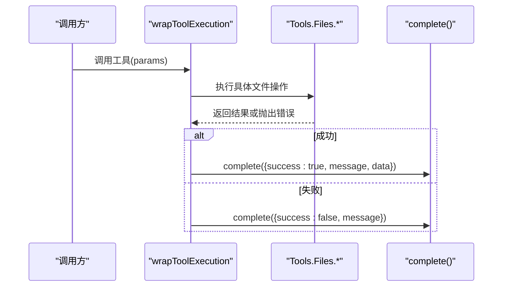
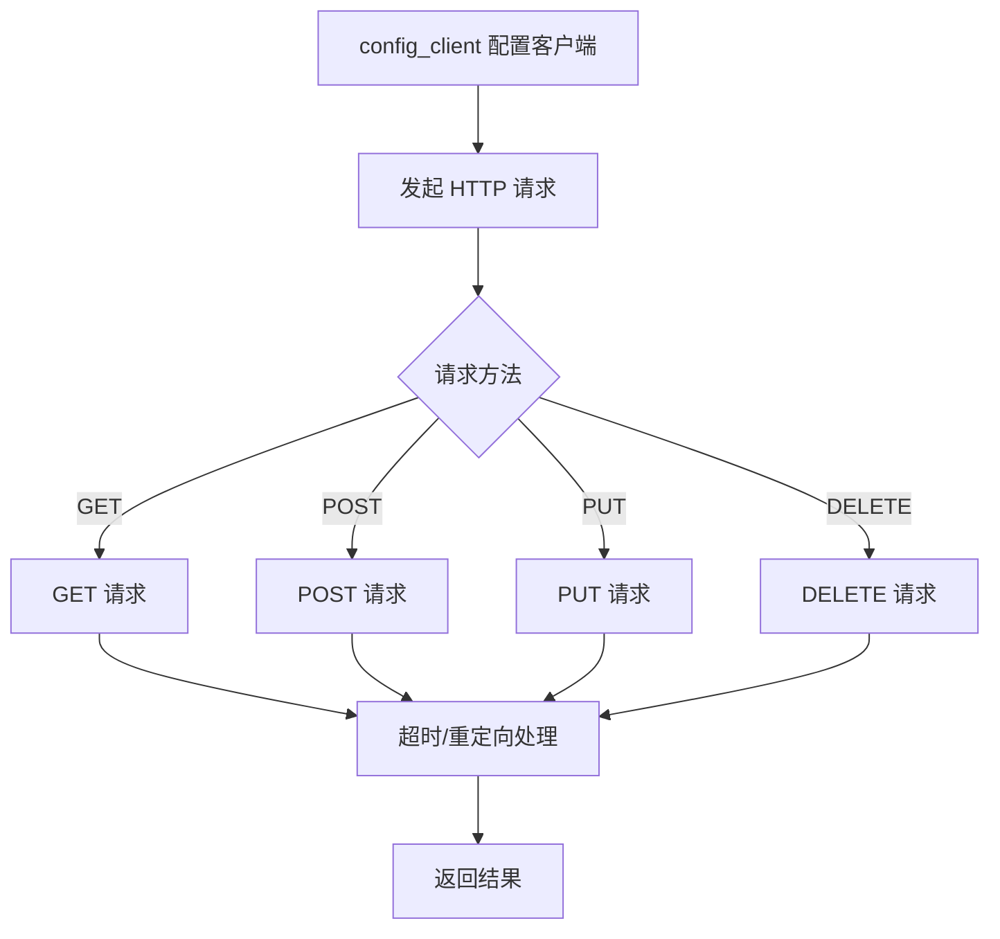
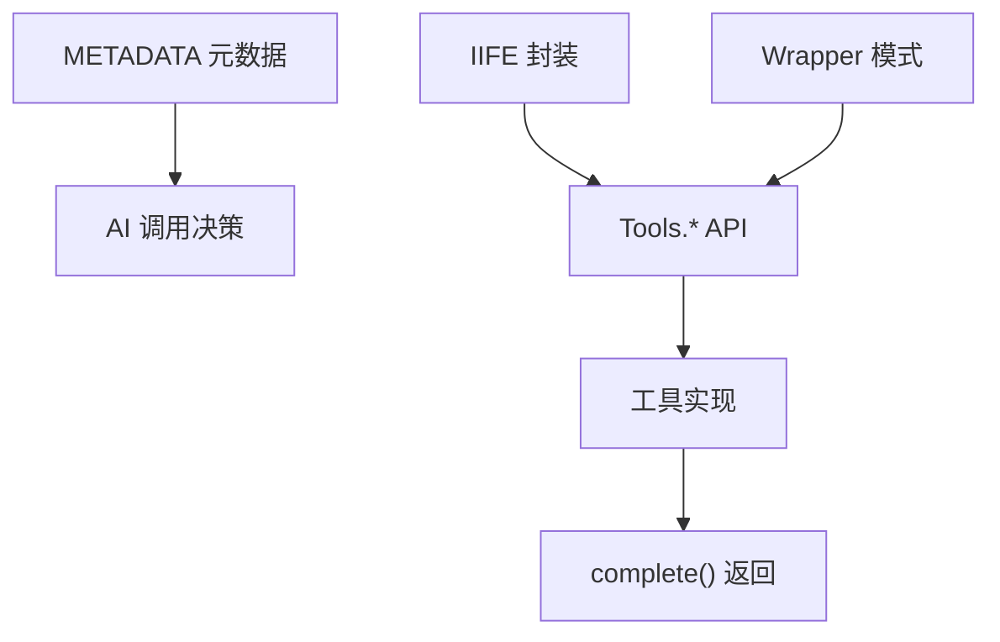

# 工具开发示例

<cite>
**本文引用的文件**   
- [examples/quick_start.ts](file://examples/quick_start.ts)
- [examples/various_search.ts](file://examples/various_search.ts)
- [examples/time.ts](file://examples/time.ts)
- [examples/system_tools.ts](file://examples/system_tools.ts)
- [examples/extended_file_tools.ts](file://examples/extended_file_tools.ts)
- [examples/google_search.ts](file://examples/google_search.ts)
- [examples/network_test.ts](file://examples/network_test.ts)
- [docs/SCRIPT_DEV_GUIDE.md](file://docs/SCRIPT_DEV_GUIDE.md)
- [docs/TOOLPKG_FORMAT_GUIDE.md](file://docs/TOOLPKG_FORMAT_GUIDE.md)
- [docs/package_dev/tool-types.md](file://docs/package_dev/tool-types.md)
</cite>

## 目录
1. [简介](#简介)
2. [项目结构](#项目结构)
3. [核心组件](#核心组件)
4. [架构总览](#架构总览)
5. [详细组件分析](#详细组件分析)
6. [依赖分析](#依赖分析)
7. [性能考虑](#性能考虑)
8. [故障排查指南](#故障排查指南)
9. [结论](#结论)
10. [附录](#附录)

## 简介
本教程围绕 Operit 的工具开发示例，系统讲解从“简单全局函数”到“IIFE 模式”再到“Wrapper 模式”的演进路径；剖析“多平台搜索”示例中如何使用 Tools.Net.visit 进行网页访问、如何用 Promise.all 实现多工具聚合、如何设计内部辅助函数提升复用性；解读“纯工具集”示例如何用 IIFE 模式封装一组无副作用的纯函数；并通过“元数据高级技巧”展示如何利用 description 字段向 AI 传递指令或知识。文档提供循序渐进的学习路径与可视化图示，帮助开发者掌握脚本开发的核心思想与最佳实践。

## 项目结构
Operit 的工具示例集中于 examples/ 目录，每个示例以独立的 TypeScript 文件呈现，遵循统一的“元数据 + IIFE 包装 + exports 导出”结构。典型结构包括：
- 元数据注释块：定义工具包名称、显示名、分类、描述、工具清单及参数规范
- IIFE 包装：将工具函数与内部辅助函数封装在私有作用域，避免全局污染
- exports 导出：将工具函数挂载到 exports 对象，供 AI 调用

**图表来源**
- [examples/quick_start.ts:221-257](file://examples/quick_start.ts#L221-L257)
- [examples/quick_start.ts:289-327](file://examples/quick_start.ts#L289-L327)
- [examples/quick_start.ts:489-492](file://examples/quick_start.ts#L489-L492)

**章节来源**
- [examples/quick_start.ts:10-33](file://examples/quick_start.ts#L10-L33)
- [examples/quick_start.ts:221-257](file://examples/quick_start.ts#L221-L257)
- [examples/quick_start.ts:289-327](file://examples/quick_start.ts#L289-L327)
- [examples/quick_start.ts:489-492](file://examples/quick_start.ts#L489-L492)

## 核心组件
- 元数据系统：通过 METADATA 注释块定义工具包与工具的名称、描述、参数与类型，帮助 AI 理解工具能力与调用方式
- IIFE 模式：将工具函数与内部辅助函数封装在立即执行函数表达式中，形成私有作用域，避免全局污染
- Wrapper 模式：统一处理 try/catch 与 complete() 调用，让核心业务逻辑专注于输入、处理与返回
- Tools API：内置工具集，提供系统、文件、网络、UI、记忆等能力，支持异步调用与链式组合

**章节来源**
- [examples/quick_start.ts:221-257](file://examples/quick_start.ts#L221-L257)
- [examples/quick_start.ts:350-439](file://examples/quick_start.ts#L350-L439)
- [examples/quick_start.ts:443-483](file://examples/quick_start.ts#L443-L483)

## 架构总览
下图展示从“简单工具”到“IIFE + Wrapper + Tools”的演进路径，以及各示例在整体架构中的定位：

**图表来源**
- [examples/quick_start.ts:289-327](file://examples/quick_start.ts#L289-L327)
- [examples/quick_start.ts:350-439](file://examples/quick_start.ts#L350-L439)
- [examples/various_search.ts:251-797](file://examples/various_search.ts#L251-L797)
- [examples/time.ts:35-84](file://examples/time.ts#L35-L84)

## 详细组件分析

### 示例一：从简单到 Wrapper 的演进（quick_start.ts）
本节以 examples/quick_start.ts 为主线，逐步讲解三种开发模式的演进与适用场景。

- 简单全局函数
  - 特点：直接定义工具函数，直接调用 complete() 返回结果
  - 优点：实现简单，适合一次性小工具
  - 缺点：缺乏统一错误处理与模板代码复用
  - 适用场景：快速 PoC、临时脚本

- IIFE 模式
  - 特点：将工具函数与内部辅助函数封装在 IIFE 中，形成私有作用域
  - 优点：避免全局污染，提升模块化与可维护性
  - 适用场景：中大型脚本，需要组织多个工具与辅助函数

- Wrapper 模式
  - 特点：定义通用包装器，统一处理 try/catch 与 complete()，核心逻辑只关注业务
  - 优点：消除重复代码，提升一致性与可维护性
  - 适用场景：生产级工具，强调健壮性与可扩展性

**图表来源**
- [examples/quick_start.ts:354-376](file://examples/quick_start.ts#L354-L376)
- [examples/quick_start.ts:423-430](file://examples/quick_start.ts#L423-L430)

**章节来源**
- [examples/quick_start.ts:273-327](file://examples/quick_start.ts#L273-L327)
- [examples/quick_start.ts:330-439](file://examples/quick_start.ts#L330-L439)
- [examples/quick_start.ts:443-483](file://examples/quick_start.ts#L443-L483)

### 示例二：多平台搜索（various_search.ts）
本节聚焦 examples/various_search.ts，讲解如何使用 Tools.Net.visit 进行网页访问、如何设计内部辅助函数提升复用性、如何实现多工具聚合。

- 网页访问与结果提取
  - 使用 Tools.Net.visit 访问搜索引擎页面，获取 visitKey、links、content 等字段
  - 通过内部辅助函数解析 URL、分类链接目标类型、提取候选链接，提升可读性与复用性

- 多工具聚合与并发
  - 通过内部辅助函数 buildProbeIndexes 与 resolveLinkUrlsByVisitKey，对多个链接进行探测与解析
  - 利用 Promise.all 实现多工具并发执行，缩短整体响应时间

- 结果构建与过滤
  - 通过 buildLinkLines 与 shouldKeepLink 对链接进行去重、聚类与筛选，保证输出质量

**图表来源**
- [examples/various_search.ts:755-797](file://examples/various_search.ts#L755-L797)
- [examples/various_search.ts:680-707](file://examples/various_search.ts#L680-L707)
- [examples/various_search.ts:662-678](file://examples/various_search.ts#L662-L678)
- [examples/various_search.ts:728-753](file://examples/various_search.ts#L728-L753)

**章节来源**
- [examples/various_search.ts:1-249](file://examples/various_search.ts#L1-L249)
- [examples/various_search.ts:251-797](file://examples/various_search.ts#L251-L797)

### 示例三：纯工具集（time.ts）
本节以 examples/time.ts 为例，展示如何用 IIFE 模式封装一组无副作用的纯函数，并在同一文件中定义与导出多个小而美的功能函数。

- IIFE 封装
  - 将 get_time 与 format_time 两个纯函数封装在 IIFE 中，避免全局污染
  - 通过返回对象统一导出，保持接口简洁

- 纯函数设计
  - 两个函数均无外部副作用，输入相同则输出相同，便于测试与复用
  - format_time 内部使用 pad 辅助函数，提升可读性

**图表来源**
- [examples/time.ts:35-84](file://examples/time.ts#L35-L84)

**章节来源**
- [examples/time.ts:1-33](file://examples/time.ts#L1-L33)
- [examples/time.ts:35-84](file://examples/time.ts#L35-L84)
- [examples/time.ts:86-88](file://examples/time.ts#L86-L88)

### 示例四：元数据高级技巧（以 various_search.ts 为例）
本节展示如何利用 description 字段向 AI 传递指令或知识，提升工具的可发现性与可用性。

- 多语言描述
  - 使用 display_name 与 description 的多语言对象，支持 zh 与 en
- 详细参数说明
  - 为每个工具的参数提供清晰的描述，包括默认值、取值范围与使用建议
- 工具别名与兼容性
  - 提供 search、search_web 等别名工具，增强模型误调用时的容错性

**图表来源**
- [examples/various_search.ts:1-249](file://examples/various_search.ts#L1-L249)

**章节来源**
- [examples/various_search.ts:1-249](file://examples/various_search.ts#L1-L249)

### 示例五：系统工具与文件工具（对比学习）
通过 examples/system_tools.ts 与 examples/extended_file_tools.ts，进一步理解 Wrapper 模式与 Tools API 的结合使用。

- 系统工具
  - 通过 IIFE 封装多个系统操作工具，统一返回结构 ToolResponse
  - 使用 Tools.System.* API 实现系统设置、应用管理、通知获取等功能

- 文件工具
  - 通过 wrapToolExecution 统一处理工具执行与错误上报
  - 使用 Tools.Files.* API 实现文件存在性检查、移动、复制、压缩、解压、打开与分享

**图表来源**
- [examples/extended_file_tools.ts:146-157](file://examples/extended_file_tools.ts#L146-L157)
- [examples/extended_file_tools.ts:177-187](file://examples/extended_file_tools.ts#L177-L187)

**章节来源**
- [examples/system_tools.ts:128-200](file://examples/system_tools.ts#L128-L200)
- [examples/extended_file_tools.ts:91-199](file://examples/extended_file_tools.ts#L91-L199)

### 示例六：网络请求与并发（network_test.ts）
本节以 examples/network_test.ts 为例，展示如何使用 OkHttp 客户端进行网络请求，如何配置超时与重定向，以及如何进行并发测试。

- 客户端配置
  - 通过 config_client 配置连接、读取、写入超时，以及是否跟随重定向与连接失败重试
- 请求方法
  - 支持 GET、POST、PUT、DELETE 等方法，支持多种请求体类型（text/json/form/multipart）
- 并发测试
  - 通过 ping_test 与 test_all 实现多轮次网络连通性测试，评估网络性能

**图表来源**
- [examples/network_test.ts:171-334](file://examples/network_test.ts#L171-L334)
- [examples/network_test.ts:191-206](file://examples/network_test.ts#L191-L206)

**章节来源**
- [examples/network_test.ts:1-200](file://examples/network_test.ts#L1-L200)

## 依赖分析
- 元数据依赖：各示例通过 METADATA 注释块定义工具清单，AI 根据此信息决定何时调用工具
- IIFE 依赖：IIFE 将工具函数与内部辅助函数封装，减少对外部命名空间的依赖
- Wrapper 依赖：Wrapper 统一处理错误与完成回调，降低工具实现复杂度
- Tools API 依赖：示例广泛使用 Tools.System、Tools.Files、Tools.Net、Tools.UI、Tools.Memory 等模块

**图表来源**
- [examples/quick_start.ts:221-257](file://examples/quick_start.ts#L221-L257)
- [examples/quick_start.ts:350-439](file://examples/quick_start.ts#L350-L439)
- [examples/various_search.ts:755-797](file://examples/various_search.ts#L755-L797)

**章节来源**
- [examples/quick_start.ts:221-257](file://examples/quick_start.ts#L221-L257)
- [examples/quick_start.ts:350-439](file://examples/quick_start.ts#L350-L439)
- [examples/various_search.ts:755-797](file://examples/various_search.ts#L755-L797)

## 性能考虑
- 并发优化：在多平台搜索示例中，通过内部辅助函数与并发策略减少等待时间，提升用户体验
- 资源复用：IIFE 将公共逻辑抽取为内部函数，避免重复计算与重复调用
- 错误早返回：在 Wrapper 模式中，统一捕获错误并快速返回，减少无效执行
- 网络优化：在网络测试示例中，合理配置超时与重定向，避免长时间阻塞

[本节为通用指导，不直接分析具体文件]

## 故障排查指南
- 元数据问题
  - 确认 METADATA 中工具名与 exports 中导出名一致，避免 AI 无法识别工具
  - 检查参数类型与 required 字段，确保 AI 能正确构造调用参数
- IIFE 作用域问题
  - 确保内部函数通过 IIFE 返回的对象导出，避免外部无法访问
- Wrapper 模式问题
  - 确保核心逻辑通过 return 返回数据，通过 throw 抛出错误，Wrapper 会自动包装
- Tools API 调用问题
  - 确保在 async 函数中使用 await 调用 Tools.* API，并在 IIFE 包装器中统一处理错误

**章节来源**
- [examples/quick_start.ts:221-257](file://examples/quick_start.ts#L221-L257)
- [examples/quick_start.ts:350-439](file://examples/quick_start.ts#L350-L439)
- [examples/extended_file_tools.ts:146-157](file://examples/extended_file_tools.ts#L146-L157)

## 结论
通过对 Operit 工具开发示例的系统解析，我们总结出三条核心开发路径：从简单全局函数到 IIFE 模式，再到 Wrapper 模式；在多平台搜索示例中，我们看到了 Tools.Net.visit 的强大能力与内部辅助函数的复用价值；在纯工具集示例中，IIFE 模式让一组无副作用的纯函数得以优雅封装；在元数据示例中，我们学会了如何通过 description 字段向 AI 传递指令与知识。这些模式与技巧共同构成了 Operit 工具开发的最佳实践，帮助开发者构建健壮、可维护、易扩展的脚本工具。

[本节为总结性内容，不直接分析具体文件]

## 附录
- 开发指南与工具类型参考
  - 脚本开发指南：涵盖快速上手、核心概念、UI 自动化等内容
  - 工具类型映射：提供 toolCall 的返回类型推导与工具名映射
  - ToolPkg 格式：介绍 ToolPkg 文件结构、清单文件与子包组织

**章节来源**
- [docs/SCRIPT_DEV_GUIDE.md:1-200](file://docs/SCRIPT_DEV_GUIDE.md#L1-L200)
- [docs/package_dev/tool-types.md:1-200](file://docs/package_dev/tool-types.md#L1-L200)
- [docs/TOOLPKG_FORMAT_GUIDE.md:1-200](file://docs/TOOLPKG_FORMAT_GUIDE.md#L1-L200)