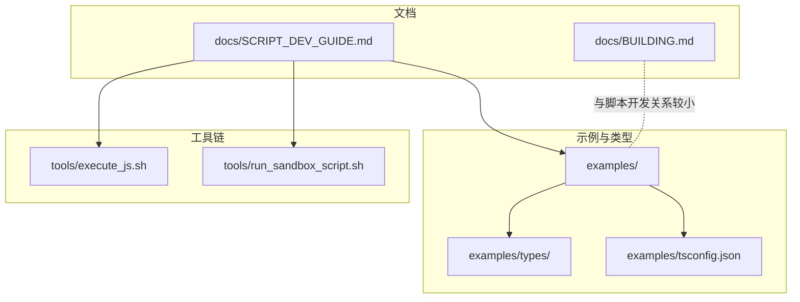
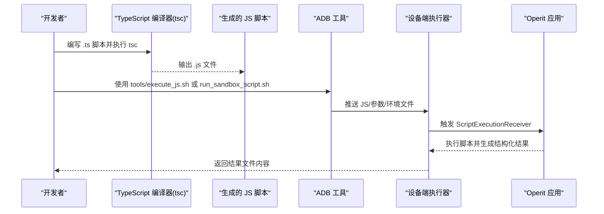
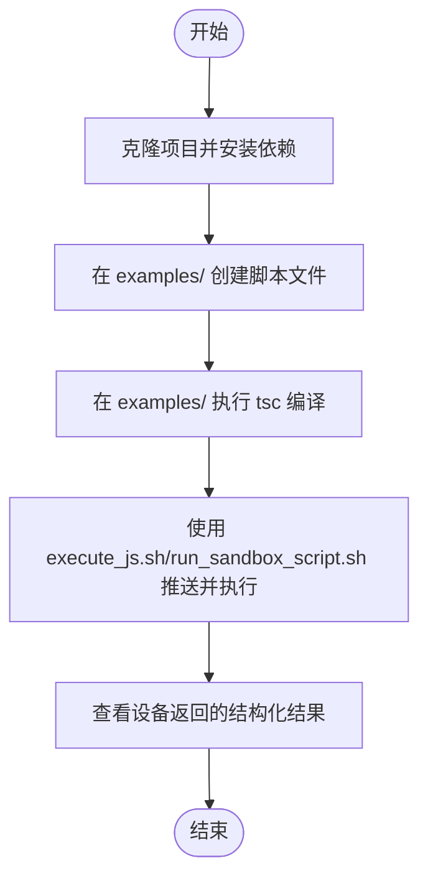
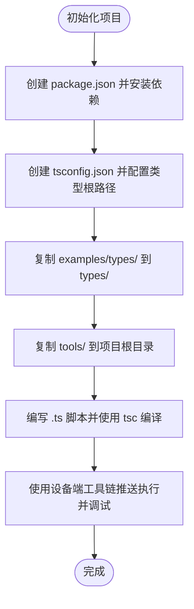
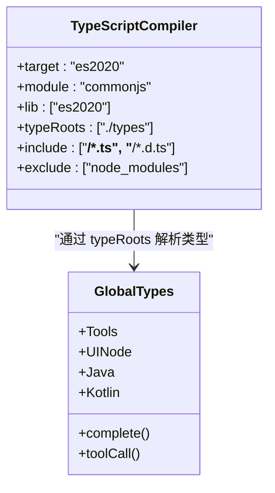
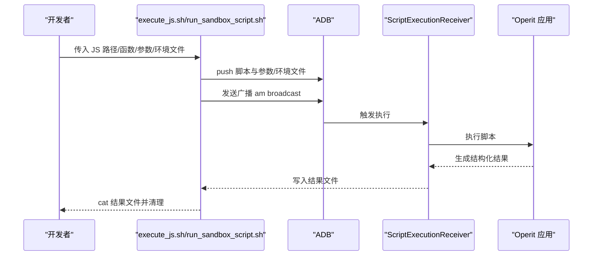
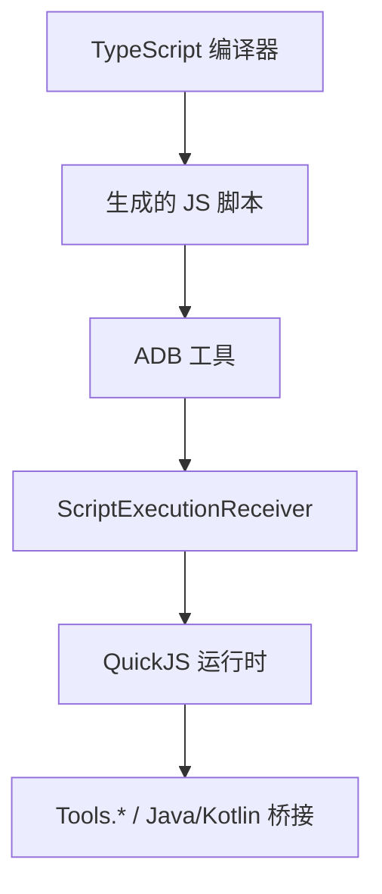

# 开发工作流程

<cite>
**本文引用的文件**
- [README.md](file://README.md)
- [docs/SCRIPT_DEV_GUIDE.md](file://docs/SCRIPT_DEV_GUIDE.md)
- [docs/BUILDING.md](file://docs/BUILDING.md)
- [examples/tsconfig.json](file://examples/tsconfig.json)
- [examples/types/index.d.ts](file://examples/types/index.d.ts)
- [examples/types/core.d.ts](file://examples/types/core.d.ts)
- [examples/types/files.d.ts](file://examples/types/files.d.ts)
- [examples/types/ui.d.ts](file://examples/types/ui.d.ts)
- [tools/execute_js.sh](file://tools/execute_js.sh)
- [tools/run_sandbox_script.sh](file://tools/run_sandbox_script.sh)
- [examples/quick_start.ts](file://examples/quick_start.ts)
</cite>

## 目录
1. [引言](#引言)
2. [项目结构](#项目结构)
3. [核心组件](#核心组件)
4. [架构总览](#架构总览)
5. [详细组件分析](#详细组件分析)
6. [依赖分析](#依赖分析)
7. [性能考虑](#性能考虑)
8. [故障排查指南](#故障排查指南)
9. [结论](#结论)
10. [附录](#附录)

## 引言
本指南面向 Operit 脚本开发者，提供两条高效的工作流程路径：在 Operit 项目中直接开发（推荐入门）与独立脚本项目搭建（适合长期维护与发布）。文档覆盖从环境准备、脚本编写、编译与执行，到调试与测试的全流程，帮助你快速建立稳定的脚本开发工作流。

## 项目结构
Operit 仓库包含 Android 应用、Web 前端、工具链脚本与大量示例脚本。与脚本开发直接相关的关键位置如下：
- examples/：示例脚本与开发模板，包含 TypeScript 配置与类型定义
- examples/types/：核心类型定义，提供 Tools、UI、Java Bridge 等全局对象的类型提示
- tools/：设备端脚本执行工具（execute_js.* 与 run_sandbox_script.*）
- docs/SCRIPT_DEV_GUIDE.md：脚本开发指南，涵盖元数据、工具导出、执行流程等
- docs/BUILDING.md：Android 项目构建指南（与脚本开发关系较小）

**图表来源**
- [docs/SCRIPT_DEV_GUIDE.md](file://docs/SCRIPT_DEV_GUIDE.md)
- [examples/tsconfig.json](file://examples/tsconfig.json)
- [examples/types/index.d.ts](file://examples/types/index.d.ts)
- [tools/execute_js.sh](file://tools/execute_js.sh)
- [tools/run_sandbox_script.sh](file://tools/run_sandbox_script.sh)

**章节来源**
- [README.md](file://README.md)
- [docs/SCRIPT_DEV_GUIDE.md](file://docs/SCRIPT_DEV_GUIDE.md)

## 核心组件
- TypeScript 编译配置：examples/tsconfig.json 提供与项目一致的编译选项，确保与运行时兼容。
- 类型定义：examples/types/index.d.ts 与各模块 d.ts 文件（如 core.d.ts、files.d.ts、ui.d.ts）提供全局对象与工具函数的类型签名，保障开发体验与静态检查。
- 执行工具：tools/execute_js.sh 与 tools/run_sandbox_script.sh 提供将脚本推送至设备并执行的命令行工具，支持参数与环境文件注入。
- 开发指南：docs/SCRIPT_DEV_GUIDE.md 提供元数据、工具导出、IIFE/Wrapper 模式、调试与测试等实践建议。

**章节来源**
- [examples/tsconfig.json](file://examples/tsconfig.json)
- [examples/types/index.d.ts](file://examples/types/index.d.ts)
- [examples/types/core.d.ts](file://examples/types/core.d.ts)
- [examples/types/files.d.ts](file://examples/types/files.d.ts)
- [examples/types/ui.d.ts](file://examples/types/ui.d.ts)
- [tools/execute_js.sh](file://tools/execute_js.sh)
- [tools/run_sandbox_script.sh](file://tools/run_sandbox_script.sh)
- [docs/SCRIPT_DEV_GUIDE.md](file://docs/SCRIPT_DEV_GUIDE.md)

## 架构总览
脚本从编写到执行的整体流程如下：

**图表来源**
- [tools/execute_js.sh](file://tools/execute_js.sh)
- [tools/run_sandbox_script.sh](file://tools/run_sandbox_script.sh)
- [docs/SCRIPT_DEV_GUIDE.md](file://docs/SCRIPT_DEV_GUIDE.md)

## 详细组件分析

### 路径 A：在 Operit 项目中直接开发（5 分钟快速入门）
- 克隆与依赖安装：在项目根目录执行 npm install，安装 TypeScript 编译器等依赖。
- 创建脚本：在 examples/ 下创建 .ts 文件，按指南添加 METADATA 与工具导出。
- 编译：在 examples/ 目录执行 npx tsc，生成 .js 文件。
- 设备执行：使用 tools/execute_js.sh 或 tools/run_sandbox_script.sh 将脚本推送到设备并执行。
- 查看结果：工具等待并打印结构化结果文件内容。

**图表来源**
- [docs/SCRIPT_DEV_GUIDE.md](file://docs/SCRIPT_DEV_GUIDE.md)
- [tools/execute_js.sh](file://tools/execute_js.sh)
- [tools/run_sandbox_script.sh](file://tools/run_sandbox_script.sh)

**章节来源**
- [docs/SCRIPT_DEV_GUIDE.md](file://docs/SCRIPT_DEV_GUIDE.md)

### 路径 B：创建独立脚本项目（高级）
- 初始化 package.json：配置脚本构建脚本与开发依赖（TypeScript、@types/node）。
- 配置 tsconfig.json：与 examples/tsconfig.json 保持一致，确保模块系统、目标版本与类型根路径正确。
- 复制类型与工具：将 examples/types/ 与 tools/ 复制到新项目根目录，确保类型提示与执行工具可用。
- 开发与测试：在本地编写 .ts 脚本，使用 tsc 编译，再通过设备端工具链推送执行。

**图表来源**
- [docs/SCRIPT_DEV_GUIDE.md](file://docs/SCRIPT_DEV_GUIDE.md)
- [examples/tsconfig.json](file://examples/tsconfig.json)
- [examples/types/index.d.ts](file://examples/types/index.d.ts)
- [tools/execute_js.sh](file://tools/execute_js.sh)
- [tools/run_sandbox_script.sh](file://tools/run_sandbox_script.sh)

**章节来源**
- [docs/SCRIPT_DEV_GUIDE.md](file://docs/SCRIPT_DEV_GUIDE.md)
- [examples/tsconfig.json](file://examples/tsconfig.json)

### TypeScript 编译器与类型系统
- 目标与模块：target 为 es2020，module 为 commonjs，与运行时兼容。
- 类型根路径：typeRoots 指向 ./types，确保编译器与 IDE 能找到全局类型定义。
- include/exclude：纳入 .ts 与 .d.ts，排除 node_modules。
- 全局类型：examples/types/index.d.ts 汇总导出核心类型、结果类型、工具类型与 Java Bridge 类型，提供 Tools.*、UINode、Java/Kotlin 等全局对象的类型签名。

**图表来源**
- [examples/tsconfig.json](file://examples/tsconfig.json)
- [examples/types/index.d.ts](file://examples/types/index.d.ts)
- [examples/types/core.d.ts](file://examples/types/core.d.ts)

**章节来源**
- [examples/tsconfig.json](file://examples/tsconfig.json)
- [examples/types/index.d.ts](file://examples/types/index.d.ts)
- [examples/types/core.d.ts](file://examples/types/core.d.ts)

### 执行工具链（设备端）
- execute_js.sh：支持指定函数名与参数 JSON 或参数文件，可选环境文件，自动推送至 /sdcard/Android/data/.../js_temp 并广播触发执行，等待并打印结果文件。
- run_sandbox_script.sh：以“脚本模式”直接运行整段脚本，便于快速验证。

**图表来源**
- [tools/execute_js.sh](file://tools/execute_js.sh)
- [tools/run_sandbox_script.sh](file://tools/run_sandbox_script.sh)

**章节来源**
- [tools/execute_js.sh](file://tools/execute_js.sh)
- [tools/run_sandbox_script.sh](file://tools/run_sandbox_script.sh)

### 调试与测试方法
- 日志记录：在脚本中使用 console.* 输出，结合设备端工具链查看结构化结果。
- 断点调试：在设备端执行时，可通过工具链等待时间与结果文件定位问题；也可在本地使用浏览器/Node 环境进行单元测试（需模拟 Tools 与全局对象）。
- 性能分析：关注异步工具调用的串并行特性，合理拆分任务；使用工具链设置 OPERIT_RESULT_WAIT_SECONDS 以适应较长执行时间。
- 错误处理：遵循 Wrapper 模式，统一 try/catch 与 complete() 返回，确保错误信息可读且结构化。

**章节来源**
- [docs/SCRIPT_DEV_GUIDE.md](file://docs/SCRIPT_DEV_GUIDE.md)
- [examples/quick_start.ts](file://examples/quick_start.ts)

## 依赖分析
- 编译期依赖：TypeScript 与 @types/node（独立项目）；在 Operit 项目中通过 npm install 安装。
- 运行时依赖：QuickJS 运行时（非浏览器环境），Tools.* 与 Java/Kotlin 桥接由平台提供。
- 工具链依赖：Android SDK（adb）、设备授权与 USB 调试。

**图表来源**
- [examples/tsconfig.json](file://examples/tsconfig.json)
- [tools/execute_js.sh](file://tools/execute_js.sh)
- [docs/SCRIPT_DEV_GUIDE.md](file://docs/SCRIPT_DEV_GUIDE.md)

**章节来源**
- [examples/tsconfig.json](file://examples/tsconfig.json)
- [tools/execute_js.sh](file://tools/execute_js.sh)
- [docs/SCRIPT_DEV_GUIDE.md](file://docs/SCRIPT_DEV_GUIDE.md)

## 性能考虑
- 编译配置：target 与 lib 与运行时能力匹配，避免不必要的 polyfill。
- 模块系统：CommonJS 与运行时兼容，避免使用实验性特性。
- 工具调用：合理使用并发（如多工具聚合），但注意底层并发度由宿主实现决定。
- 资源与等待：根据脚本复杂度调整 OPERIT_RESULT_WAIT_SECONDS，避免过早超时。

## 故障排查指南
- ADB 未找到：确认 Android SDK 安装并已将 adb 加入 PATH。
- 设备未授权：确保已开启开发者选项与 USB 调试，并在设备上授权。
- 结果文件未生成：检查工具链等待时间与设备端执行日志；确认 METADATA 与 exports 名称一致。
- 类型提示缺失：确认 tsconfig.json 的 typeRoots 与 types/ 目录结构正确。

**章节来源**
- [tools/execute_js.sh](file://tools/execute_js.sh)
- [tools/run_sandbox_script.sh](file://tools/run_sandbox_script.sh)
- [docs/BUILDING.md](file://docs/BUILDING.md)

## 结论
通过两条开发路径，你可以快速在 Operit 生态中编写、编译与执行脚本。推荐新手优先使用“在 Operit 项目中直接开发”的路径，以减少环境配置成本；有长期维护需求的开发者可选择“独立脚本项目”路径，获得更强的可移植性与发布灵活性。配合完善的类型定义、工具链与调试策略，你将建立起高效稳定的脚本开发工作流。

## 附录
- 快速参考
  - 在 Operit 项目中：examples/ 下编写 .ts → npx tsc → tools/execute_js.sh/run_sandbox_script.sh 推送执行
  - 独立项目：package.json + tsconfig.json + types/ + tools/ → tsc → 设备端工具链执行
- 最佳实践
  - 使用 IIFE/Wrapper 模式隔离作用域与统一错误处理
  - 严格定义 METADATA 与工具参数，确保与 Tools API 一致
  - 通过日志与结构化结果进行调试，必要时在本地模拟运行环境