# 脚本元数据系统

<cite>
**本文档引用的文件**
- [SCRIPT_DEV_GUIDE.md](file://docs/SCRIPT_DEV_GUIDE.md)
- [TOOLPKG_FORMAT_GUIDE.md](file://docs/TOOLPKG_FORMAT_GUIDE.md)
- [toolpkg.d.ts](file://examples/types/toolpkg.d.ts)
- [quick_start.js](file://examples/quick_start.js)
- [build.js](file://examples/github/build.js)
- [spawn-helper.js](file://app/src/main/assets/bridge/spawn-helper.js)
- [strings.js](file://examples/windows_control/resources/pc_agent/operit-pc-agent/public/scripts/i18n/strings.js)
</cite>

## 目录
1. [简介](#简介)
2. [项目结构](#项目结构)
3. [核心组件](#核心组件)
4. [架构概览](#架构概览)
5. [详细组件分析](#详细组件分析)
6. [依赖关系分析](#依赖关系分析)
7. [性能考虑](#性能考虑)
8. [故障排除指南](#故障排除指南)
9. [结论](#结论)
10. [附录](#附录)

## 简介

Operit 脚本元数据系统是一个强大的工具描述和配置框架，它使得开发者能够为 AI 智能助手提供精确的工具元数据描述。该系统通过 METADATA 注释块定义脚本的结构、工具参数和多语言支持，实现了 AI 与脚本之间的无缝集成。

本系统的核心特性包括：
- **结构化元数据定义**：通过 JSON 格式的 METADATA 注释块定义脚本和工具
- **动态工具集机制**：支持基于运行时条件的状态切换
- **多语言本地化支持**：完整的双语/多语文本支持
- **参数验证系统**：严格的工具参数类型和必需性验证
- **环境变量管理**：安全的环境变量声明和验证

## 项目结构

Operit 脚本元数据系统主要分布在以下关键位置：

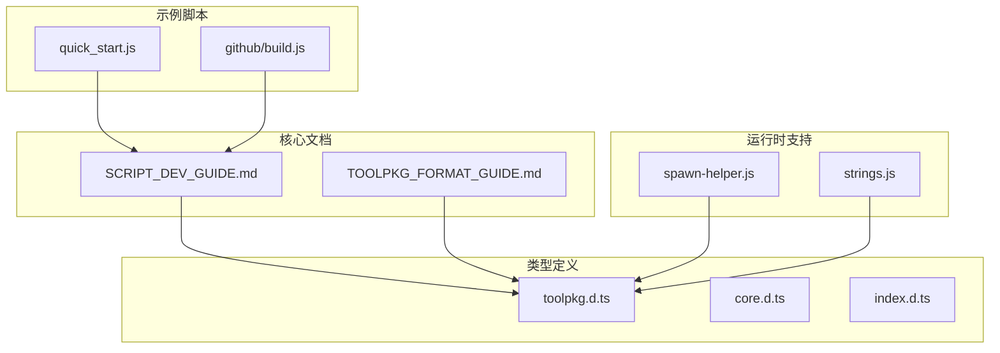

**图表来源**
- [SCRIPT_DEV_GUIDE.md:1-800](file://docs/SCRIPT_DEV_GUIDE.md#L1-L800)
- [TOOLPKG_FORMAT_GUIDE.md:1-800](file://docs/TOOLPKG_FORMAT_GUIDE.md#L1-L800)
- [toolpkg.d.ts:1-718](file://examples/types/toolpkg.d.ts#L1-L718)

**章节来源**
- [SCRIPT_DEV_GUIDE.md:1-800](file://docs/SCRIPT_DEV_GUIDE.md#L1-L800)
- [TOOLPKG_FORMAT_GUIDE.md:1-800](file://docs/TOOLPKG_FORMAT_GUIDE.md#L1-L800)

## 核心组件

### METADATA 注释块系统

METADATA 注释块是脚本元数据系统的核心，它定义了脚本的基本信息和可用工具。

#### 基本结构

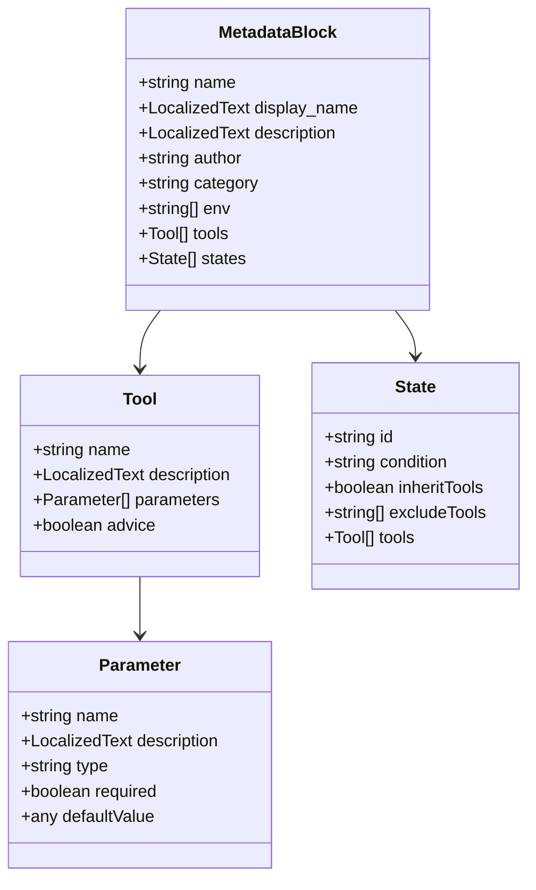

**图表来源**
- [toolpkg.d.ts:4-535](file://examples/types/toolpkg.d.ts#L4-L535)
- [SCRIPT_DEV_GUIDE.md:276-328](file://docs/SCRIPT_DEV_GUIDE.md#L276-L328)

#### 关键字段定义

| 字段名 | 类型 | 必需 | 描述 |
|--------|------|------|------|
| `name` | string | 是 | 脚本的唯一标识符 |
| `display_name` | LocalizedText | 否 | 用于界面显示的名称 |
| `description` | LocalizedText | 是 | 脚本功能的详细描述 |
| `author` | string \| string[] | 否 | 作者信息 |
| `category` | string | 否 | 脚本分类，用于分组显示 |
| `env` | string[] | 否 | 环境变量依赖声明 |
| `tools` | Tool[] | 是 | 工具定义数组 |
| `states` | State[] | 否 | 动态工具集状态定义 |

**章节来源**
- [toolpkg.d.ts:535-572](file://examples/types/toolpkg.d.ts#L535-L572)
- [SCRIPT_DEV_GUIDE.md:315-328](file://docs/SCRIPT_DEV_GUIDE.md#L315-L328)

### 工具参数系统

工具参数系统提供了严格的参数定义和验证机制，确保 AI 能够正确理解和调用工具。

#### 参数属性规范

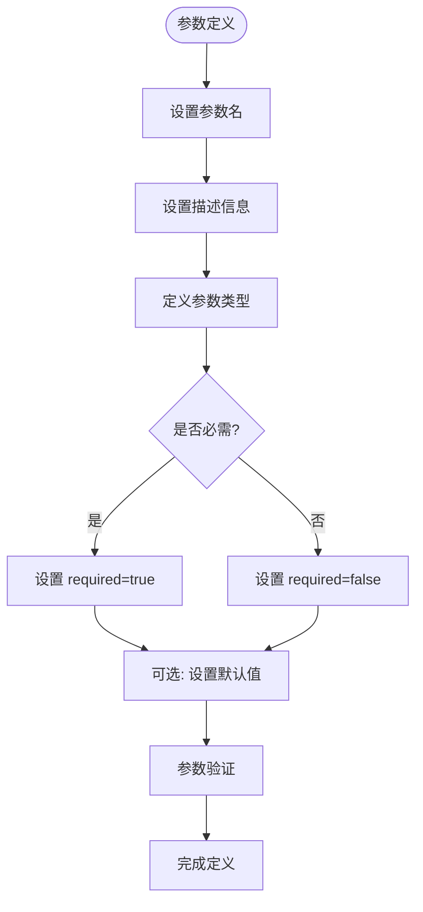

**图表来源**
- [toolpkg.d.ts:559-572](file://examples/types/toolpkg.d.ts#L559-L572)
- [SCRIPT_DEV_GUIDE.md:324-327](file://docs/SCRIPT_DEV_GUIDE.md#L324-L327)

#### 支持的参数类型

系统支持以下参数类型：
- `string`：字符串类型
- `number`：数字类型  
- `boolean`：布尔类型
- `array`：数组类型
- `object`：对象类型
- `null`：空值类型

**章节来源**
- [toolpkg.d.ts:559-572](file://examples/types/toolpkg.d.ts#L559-L572)
- [SCRIPT_DEV_GUIDE.md:324-327](file://docs/SCRIPT_DEV_GUIDE.md#L324-L327)

### states 动态工具集机制

states 机制允许同一脚本在不同运行时条件下暴露不同的工具集，实现了高度灵活的工具管理。

#### 状态选择流程

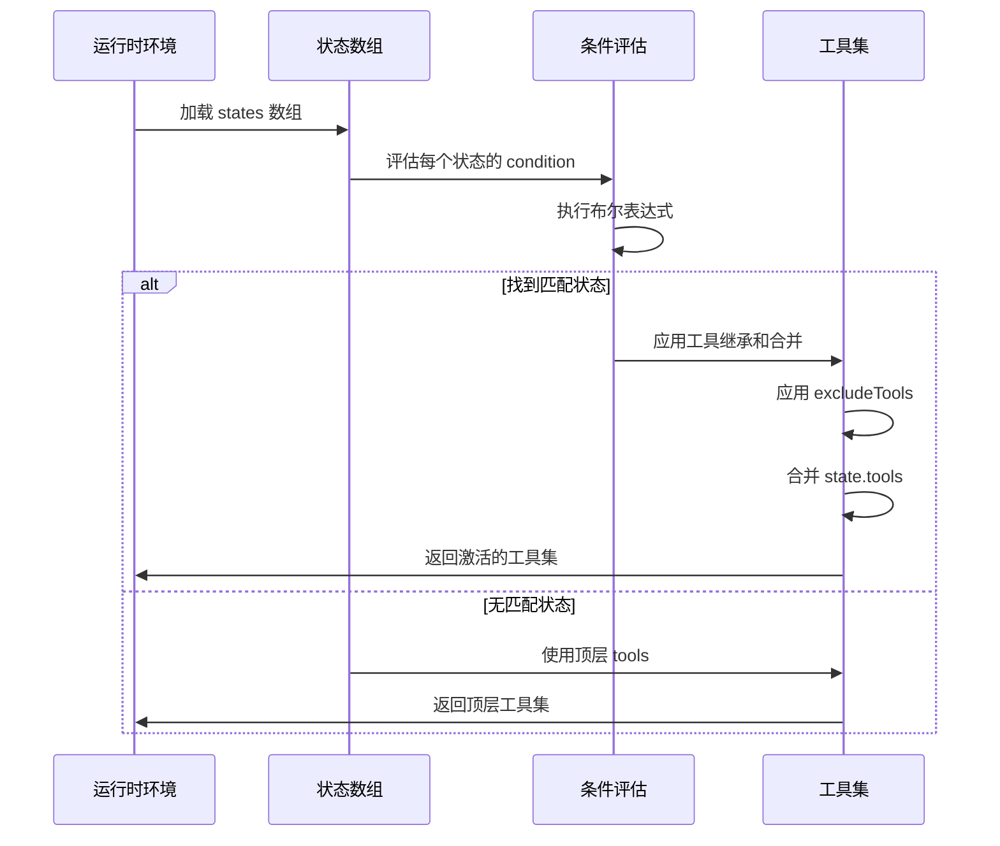

**图表来源**
- [SCRIPT_DEV_GUIDE.md:329-378](file://docs/SCRIPT_DEV_GUIDE.md#L329-L378)

#### 条件表达式语法

支持的条件表达式语法：
- 字面量：`true` / `false` / `null`
- 逻辑运算：`!` / `&&` / `||`
- 比较运算：`==` / `!=` / `>` / `>=` / `<` / `<=`
- 成员测试：`in` 运算符
- 括号：`(...)`
- 数组字面量：`[...]`

**章节来源**
- [SCRIPT_DEV_GUIDE.md:355-378](file://docs/SCRIPT_DEV_GUIDE.md#L355-L378)

### 多语言支持机制

系统提供了完整的多语言本地化支持，通过 LocalizedText 类型实现双语/多语文本。

#### 语言选择优先级

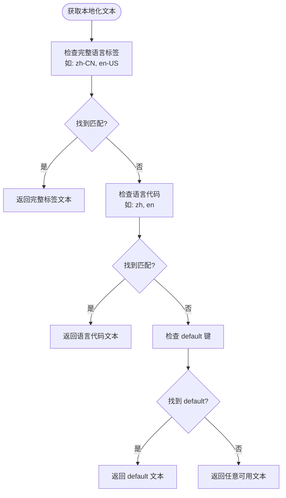

**图表来源**
- [toolpkg.d.ts:4-5](file://examples/types/toolpkg.d.ts#L4-L5)
- [SCRIPT_DEV_GUIDE.md:379-416](file://docs/SCRIPT_DEV_GUIDE.md#L379-L416)

#### 支持的语言键

- `zh` / `zh-CN`：中文
- `en` / `en-US`：英文
- `default`：默认回退文本

**章节来源**
- [toolpkg.d.ts:4-5](file://examples/types/toolpkg.d.ts#L4-L5)
- [SCRIPT_DEV_GUIDE.md:407-416](file://docs/SCRIPT_DEV_GUIDE.md#L407-L416)

## 架构概览

Operit 脚本元数据系统采用分层架构设计，确保了系统的可扩展性和维护性。

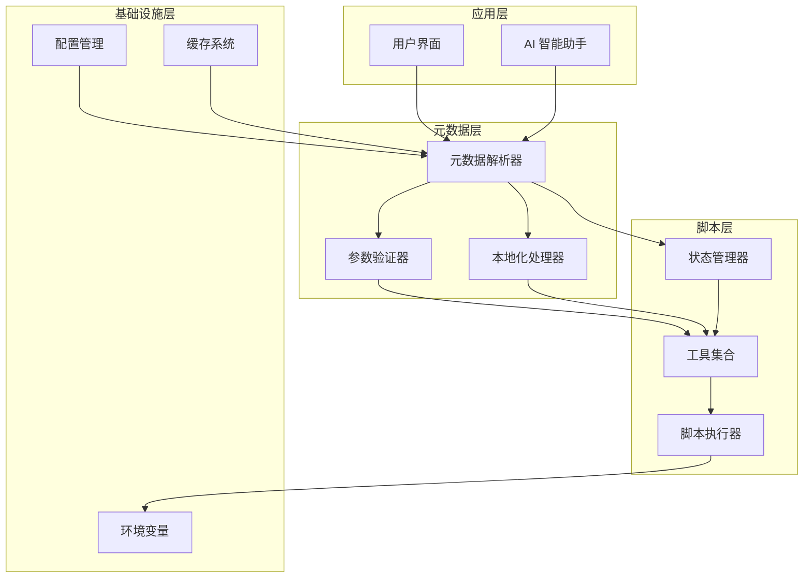

**图表来源**
- [spawn-helper.js:22556-22585](file://app/src/main/assets/bridge/spawn-helper.js#L22556-L22585)
- [toolpkg.d.ts:655-677](file://examples/types/toolpkg.d.ts#L655-L677)

## 详细组件分析

### 元数据解析器

元数据解析器负责从脚本文件中提取和解析 METADATA 注释块。

#### 解析流程

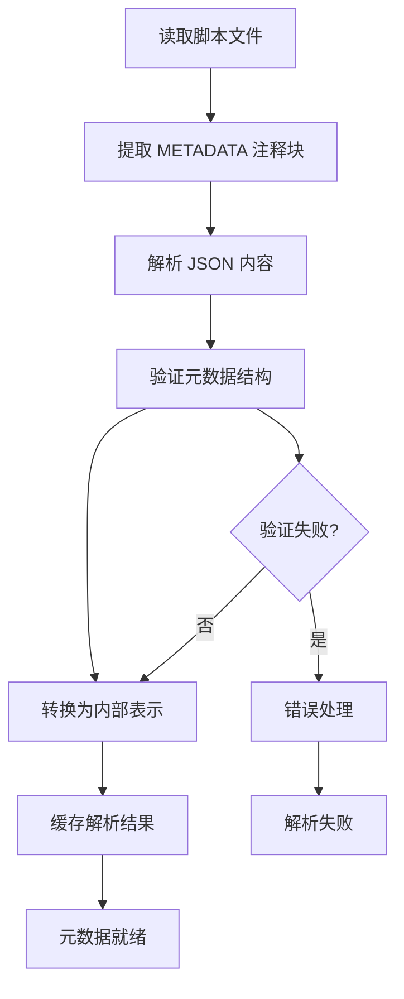

**图表来源**
- [build.js:4-11](file://examples/github/build.js#L4-L11)

#### 错误处理机制

解析器具有完善的错误处理机制：
- 语法错误检测和报告
- 结构完整性验证
- 类型匹配检查
- 默认值处理

**章节来源**
- [build.js:4-11](file://examples/github/build.js#L4-L11)

### 参数验证系统

参数验证系统确保工具调用时的参数完整性和正确性。

#### 验证流程

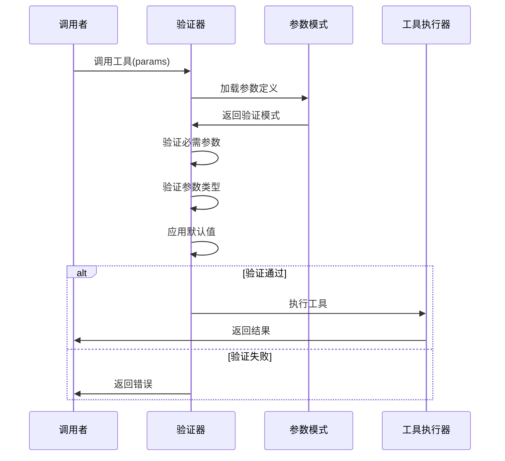

**图表来源**
- [spawn-helper.js:22556-22585](file://app/src/main/assets/bridge/spawn-helper.js#L22556-L22585)

#### 验证规则

- 必需参数检查：确保所有 required=true 的参数都已提供
- 类型匹配：验证参数类型与定义相符
- 范围验证：检查数值范围和字符串长度
- 自定义验证：支持工具特定的验证逻辑

**章节来源**
- [spawn-helper.js:22556-22585](file://app/src/main/assets/bridge/spawn-helper.js#L22556-L22585)

### 状态管理系统

状态管理系统实现了动态工具集的条件切换功能。

#### 状态评估算法

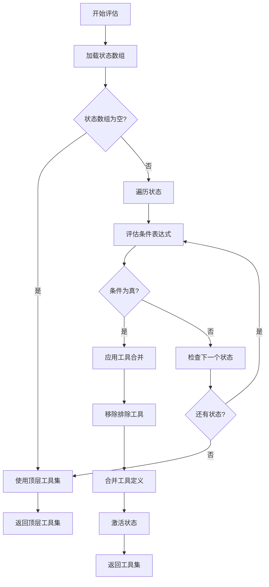

**图表来源**
- [SCRIPT_DEV_GUIDE.md:343-354](file://docs/SCRIPT_DEV_GUIDE.md#L343-L354)

#### 工具合并规则

工具合并遵循以下优先级：
1. **继承工具**：从顶层 tools 基础上继承
2. **排除工具**：先移除 excludeTools 指定的工具
3. **新增工具**：添加 state.tools 中的工具
4. **覆盖规则**：同名工具以 state.tools 为准

**章节来源**
- [SCRIPT_DEV_GUIDE.md:349-354](file://docs/SCRIPT_DEV_GUIDE.md#L349-L354)

### 本地化处理器

本地化处理器负责处理多语言文本的解析和选择。

#### 本地化流程

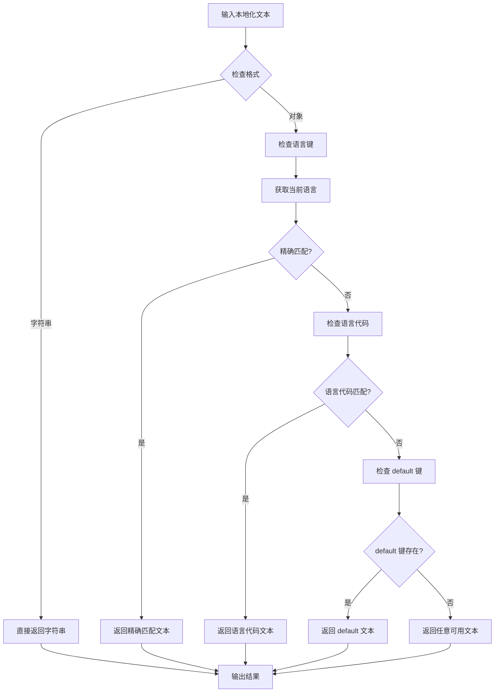

**图表来源**
- [strings.js:384-456](file://examples/windows_control/resources/pc_agent/operit-pc-agent/public/scripts/i18n/strings.js#L384-L456)

#### 语言代码映射

系统支持的语言代码映射：
- `zh` → `zh`（中文）
- 其他 → `en`（英文）

**章节来源**
- [strings.js:384-456](file://examples/windows_control/resources/pc_agent/operit-pc-agent/public/scripts/i18n/strings.js#L384-L456)

## 依赖关系分析

Operit 脚本元数据系统各组件之间存在清晰的依赖关系：

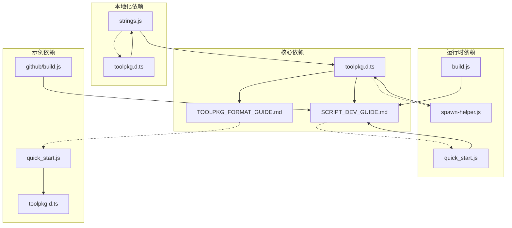

**图表来源**
- [toolpkg.d.ts:1-718](file://examples/types/toolpkg.d.ts#L1-L718)
- [SCRIPT_DEV_GUIDE.md:1-800](file://docs/SCRIPT_DEV_GUIDE.md#L1-L800)
- [TOOLPKG_FORMAT_GUIDE.md:1-800](file://docs/TOOLPKG_FORMAT_GUIDE.md#L1-L800)

### 组件耦合度分析

系统采用松耦合设计：
- **类型定义**：独立的类型声明文件，提供接口契约
- **文档指南**：提供使用规范和最佳实践
- **运行时实现**：独立的执行逻辑和验证机制
- **本地化支持**：可插拔的多语言处理

## 性能考虑

### 元数据解析优化

- **缓存策略**：解析结果缓存，避免重复解析
- **增量更新**：支持部分元数据更新，减少全量解析
- **异步处理**：后台解析，不影响主线程性能

### 参数验证优化

- **预编译模式**：参数模式预编译，提高验证速度
- **批量验证**：支持批量参数验证，减少重复开销
- **延迟验证**：按需验证，避免不必要的验证操作

### 内存管理

- **垃圾回收**：及时释放不再使用的元数据对象
- **内存池**：复用常用对象，减少内存分配
- **弱引用**：使用弱引用避免循环引用

## 故障排除指南

### 常见问题及解决方案

#### 元数据解析失败

**症状**：脚本无法被 AI 识别或报错

**可能原因**：
- METADATA 注释块格式错误
- JSON 语法错误
- 字段类型不匹配

**解决方案**：
1. 检查 METADATA 注释块的语法格式
2. 验证 JSON 结构的正确性
3. 确认字段类型与定义相符

#### 参数验证失败

**症状**：工具调用时报参数错误

**可能原因**：
- 缺少必需参数
- 参数类型不匹配
- 参数值超出范围

**解决方案**：
1. 检查必需参数是否全部提供
2. 验证参数类型是否正确
3. 确认参数值在有效范围内

#### 状态切换异常

**症状**：工具集未按预期切换

**可能原因**：
- 条件表达式语法错误
- 运行时能力不匹配
- 状态定义冲突

**解决方案**：
1. 检查条件表达式的语法
2. 验证运行时能力的可用性
3. 确认状态定义的唯一性

#### 多语言显示问题

**症状**：文本显示为键名而非翻译

**可能原因**：
- 语言文件缺失
- 语言键不匹配
- 本地化格式错误

**解决方案**：
1. 检查语言文件的完整性
2. 验证语言键的存在性
3. 确认本地化格式的正确性

**章节来源**
- [build.js:4-11](file://examples/github/build.js#L4-L11)
- [spawn-helper.js:22556-22585](file://app/src/main/assets/bridge/spawn-helper.js#L22556-L22585)
- [strings.js:384-456](file://examples/windows_control/resources/pc_agent/operit-pc-agent/public/scripts/i18n/strings.js#L384-L456)

## 结论

Operit 脚本元数据系统通过精心设计的架构和完善的机制，为 AI 智能助手提供了强大而灵活的工具描述和管理能力。系统的主要优势包括：

1. **结构化定义**：通过标准化的 METADATA 格式，确保元数据的一致性和可解析性
2. **动态管理**：states 机制实现了工具集的动态切换，适应不同的运行时环境
3. **多语言支持**：完整的本地化机制支持双语/多语文本，提升用户体验
4. **严格验证**：参数验证系统确保工具调用的安全性和正确性
5. **高性能实现**：优化的解析和验证机制保证了系统的响应速度

该系统为开发者提供了清晰的开发指南和最佳实践，使得复杂的脚本功能能够被 AI 智能助手准确理解和调用，从而实现真正的智能化工具集成。

## 附录

### 最佳实践指南

#### 元数据配置最佳实践

1. **明确的工具描述**：使用清晰、简洁的语言描述工具功能
2. **完整的参数定义**：为每个参数提供详细的描述和类型信息
3. **合理的分类**：选择合适的分类标签，便于用户发现和管理
4. **适当的多语言**：为重要的文本字段提供多语言支持

#### 开发流程建议

1. **先设计后实现**：先定义元数据，再实现工具逻辑
2. **渐进式开发**：从小规模工具开始，逐步扩展功能
3. **充分测试**：在不同环境下测试元数据的正确性
4. **持续优化**：根据使用反馈不断改进元数据设计

#### 性能优化建议

1. **合理使用 states**：避免过多的状态定义，保持逻辑简洁
2. **优化条件表达式**：使用高效的条件判断逻辑
3. **缓存策略**：合理使用缓存机制提升性能
4. **内存管理**：注意内存使用，避免内存泄漏