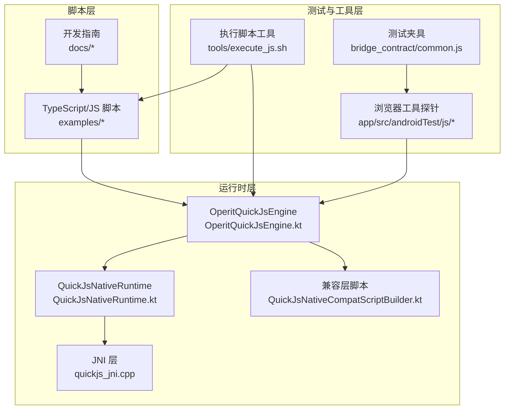
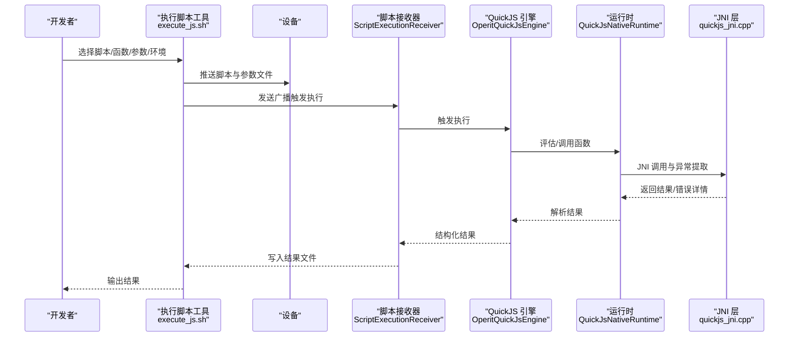
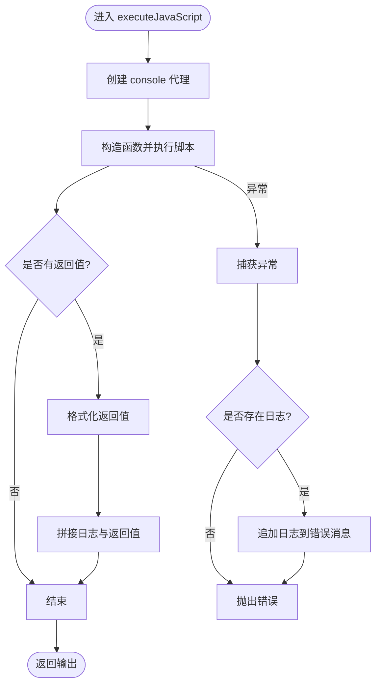
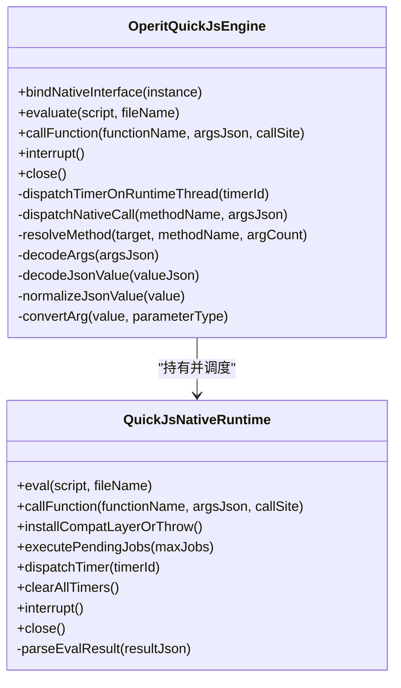
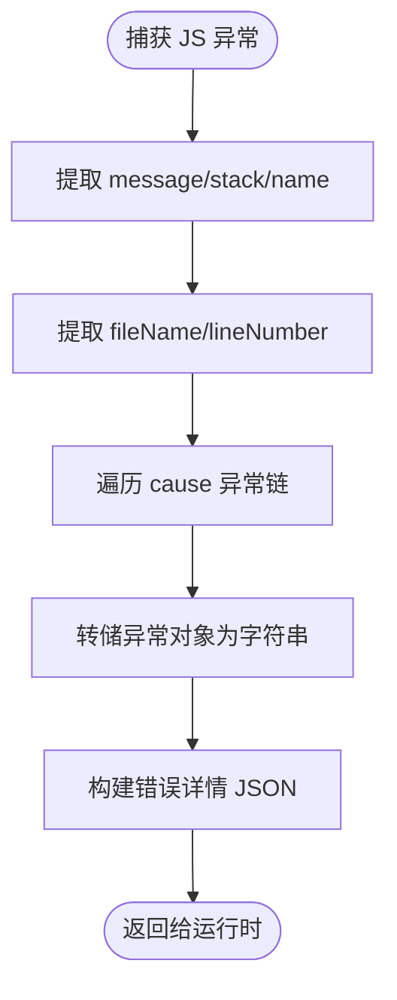
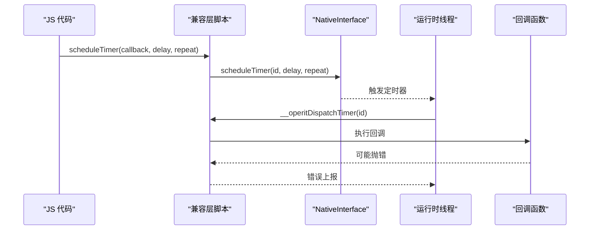
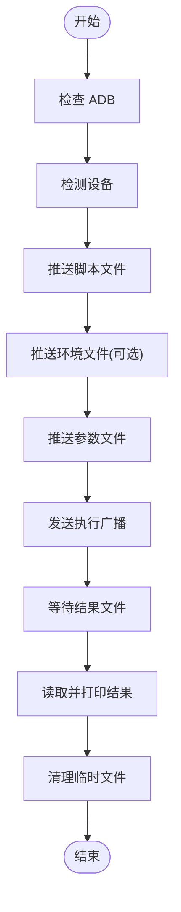
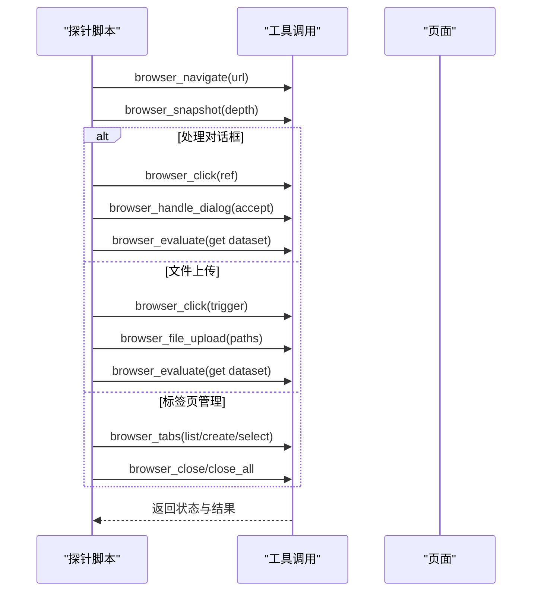
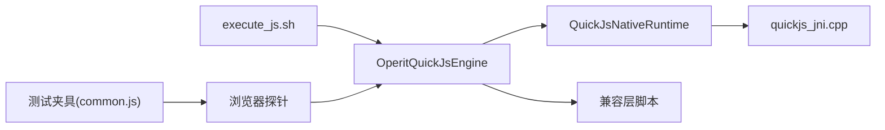

# 调试与测试

<cite>
**本文引用的文件**
- [QuickJsNativeRuntime.kt](file://quickjs/src/main/java/com/ai/assistance/operit/core/tools/javascript/QuickJsNativeRuntime.kt)
- [OperitQuickJsEngine.kt](file://quickjs/src/main/java/com/ai/assistance/operit/core/tools/javascript/OperitQuickJsEngine.kt)
- [quickjs_jni.cpp](file://quickjs/src/main/cpp/quickjs_jni.cpp)
- [QuickJsNativeCompatScriptBuilder.kt](file://quickjs/src/main/java/com/ai/assistance/operit/core/tools/javascript/QuickJsNativeCompatScriptBuilder.kt)
- [code_runner.ts](file://examples/code_runner.ts)
- [execute_js.sh](file://tools/execute_js.sh)
- [browser_tool_smoke.js](file://app/src/androidTest/js/browser_tool_smoke.js)
- [browser_tool_suite_probe.js](file://app/src/androidTest/js/browser_tool_suite_probe.js)
- [SCRIPT_DEV_GUIDE.md](file://docs/SCRIPT_DEV_GUIDE.md)
- [SCRIPT_DEV_SKILL.md](file://docs/SCRIPT_DEV_SKILL.md)
- [bridge_contract/common.js](file://app/src/androidTest/js/com/ai/assistance/operit/core/tools/javascript/bridge_contract/common.js)
- [bridge_edges.js](file://app/src/androidTest/js/com/ai/assistance/operit/core/tools/javascript/bridge_edges/bridge_edges.js)
- [host_runtime.js](file://app/src/androidTest/js/com/ai/assistance/operit/core/tools/javascript/bridge_contract/host_runtime.js)
- [parallel_sleep.js](file://app/src/androidTest/js/com/ai/assistance/operit/core/tools/javascript/script_mode_contract/parallel_sleep.js)
</cite>

## 目录
1. [简介](#简介)
2. [项目结构](#项目结构)
3. [核心组件](#核心组件)
4. [架构总览](#架构总览)
5. [详细组件分析](#详细组件分析)
6. [依赖关系分析](#依赖关系分析)
7. [性能考量](#性能考量)
8. [故障排查指南](#故障排查指南)
9. [结论](#结论)
10. [附录](#附录)

## 简介
本指南面向 Operit 脚本开发者，系统讲解脚本调试与测试方法论与实操要点，涵盖：
- 日志记录与输出捕获的最佳实践
- console.log() 与错误堆栈的分析技巧
- 断点与条件断点、变量监控的调试策略
- 性能分析：执行时间、内存与网络请求观测
- 单元测试与集成测试：用例设计、模拟对象、异步测试
- 常见问题诊断：类型错误、API 调用失败、权限问题、性能瓶颈
- 调试工具链与测试脚本示例

## 项目结构
Operit 的脚本运行与测试涉及三层：
- 脚本层：TypeScript/JavaScript 脚本与工具包
- 运行时层：QuickJS 引擎与桥接（Java/JS 互调）
- 测试与工具层：设备端执行脚本、浏览器工具探针、执行脚本工具

图示来源
- [OperitQuickJsEngine.kt:13-77](file://quickjs/src/main/java/com/ai/assistance/operit/core/tools/javascript/OperitQuickJsEngine.kt#L13-L77)
- [QuickJsNativeRuntime.kt:36-123](file://quickjs/src/main/java/com/ai/assistance/operit/core/tools/javascript/QuickJsNativeRuntime.kt#L36-L123)
- [quickjs_jni.cpp:173-706](file://quickjs/src/main/cpp/quickjs_jni.cpp#L173-L706)
- [QuickJsNativeCompatScriptBuilder.kt:79-147](file://quickjs/src/main/java/com/ai/assistance/operit/core/tools/javascript/QuickJsNativeCompatScriptBuilder.kt#L79-L147)
- [execute_js.sh:1-197](file://tools/execute_js.sh#L1-L197)
- [browser_tool_smoke.js:1-158](file://app/src/androidTest/js/browser_tool_smoke.js#L1-L158)
- [bridge_contract/common.js:1-40](file://app/src/androidTest/js/com/ai/assistance/operit/core/tools/javascript/bridge_contract/common.js#L1-L40)

章节来源
- [SCRIPT_DEV_GUIDE.md:1-142](file://docs/SCRIPT_DEV_GUIDE.md#L1-L142)
- [SCRIPT_DEV_SKILL.md:1-163](file://docs/SCRIPT_DEV_SKILL.md#L1-L163)

## 核心组件
- QuickJS 引擎与桥接
  - 引擎封装：OperitQuickJsEngine 提供 evaluate/callFunction/interrupt/close 等能力，并负责线程调度与参数/返回值归一化
  - 运行时：QuickJsNativeRuntime 封装 JNI 调用，提供 eval/callFunction/executePendingJobs/中断等
  - 兼容层：注入定时器、错误上报等宿主能力，保障 JS 语法与宿主 API 的一致性
  - JNI：负责异常提取、堆栈拼接、错误详情 JSON 化
- 脚本执行与日志捕获
  - code_runner.ts 提供 console.log/warn/error 的代理捕获与返回值格式化输出
- 设备端执行与测试
  - execute_js.sh 将脚本推送至设备并通过广播触发执行，等待结果文件
  - 浏览器工具探针脚本用于 UI 自动化与交互验证
  - 测试夹具提供通用断言与线程/并发工具

章节来源
- [OperitQuickJsEngine.kt:13-178](file://quickjs/src/main/java/com/ai/assistance/operit/core/tools/javascript/OperitQuickJsEngine.kt#L13-L178)
- [QuickJsNativeRuntime.kt:36-161](file://quickjs/src/main/java/com/ai/assistance/operit/core/tools/javascript/QuickJsNativeRuntime.kt#L36-L161)
- [QuickJsNativeCompatScriptBuilder.kt:79-147](file://quickjs/src/main/java/com/ai/assistance/operit/core/tools/javascript/QuickJsNativeCompatScriptBuilder.kt#L79-L147)
- [quickjs_jni.cpp:173-706](file://quickjs/src/main/cpp/quickjs_jni.cpp#L173-L706)
- [code_runner.ts:466-551](file://examples/code_runner.ts#L466-L551)
- [execute_js.sh:1-197](file://tools/execute_js.sh#L1-L197)
- [browser_tool_smoke.js:1-158](file://app/src/androidTest/js/browser_tool_smoke.js#L1-L158)
- [bridge_contract/common.js:1-40](file://app/src/androidTest/js/com/ai/assistance/operit/core/tools/javascript/bridge_contract/common.js#L1-L40)

## 架构总览
下图展示从脚本到设备执行、再到结果返回的端到端流程。

图示来源
- [execute_js.sh:117-197](file://tools/execute_js.sh#L117-L197)
- [OperitQuickJsEngine.kt:37-63](file://quickjs/src/main/java/com/ai/assistance/operit/core/tools/javascript/OperitQuickJsEngine.kt#L37-L63)
- [QuickJsNativeRuntime.kt:63-81](file://quickjs/src/main/java/com/ai/assistance/operit/core/tools/javascript/QuickJsNativeRuntime.kt#L63-L81)
- [quickjs_jni.cpp:173-706](file://quickjs/src/main/cpp/quickjs_jni.cpp#L173-L706)

## 详细组件分析

### 组件A：日志捕获与输出格式化（code_runner.ts）
- 目标：在沙箱内捕获 console.log/warn/error 输出，统一格式化并附加返回值
- 关键点：
  - 代理 console 对象，拦截输出
  - 对对象参数进行安全序列化，避免循环引用导致的异常
  - 捕获异常时，将历史日志拼接进错误消息，便于定位
  - 返回值统一格式化，null/对象/基本类型分别处理

图示来源
- [code_runner.ts:466-551](file://examples/code_runner.ts#L466-L551)

章节来源
- [code_runner.ts:466-551](file://examples/code_runner.ts#L466-L551)

### 组件B：引擎与运行时（OperitQuickJsEngine / QuickJsNativeRuntime）
- 目标：提供线程安全的 JS 执行环境，桥接 Java/JS，处理参数/返回值归一化与错误详情
- 关键点：
  - 单线程执行器保证 JS 运行时线程安全
  - 参数/返回值 JSON 解析与类型归一化
  - 错误描述组合：错误消息 + 堆栈 + 详细 JSON
  - 定时器调度与清理：通过 NativeInterface 与兼容层脚本配合

图示来源
- [OperitQuickJsEngine.kt:13-178](file://quickjs/src/main/java/com/ai/assistance/operit/core/tools/javascript/OperitQuickJsEngine.kt#L13-L178)
- [QuickJsNativeRuntime.kt:36-161](file://quickjs/src/main/java/com/ai/assistance/operit/core/tools/javascript/QuickJsNativeRuntime.kt#L36-L161)

章节来源
- [OperitQuickJsEngine.kt:13-178](file://quickjs/src/main/java/com/ai/assistance/operit/core/tools/javascript/OperitQuickJsEngine.kt#L13-L178)
- [QuickJsNativeRuntime.kt:36-161](file://quickjs/src/main/java/com/ai/assistance/operit/core/tools/javascript/QuickJsNativeRuntime.kt#L36-L161)

### 组件C：错误堆栈与错误详情（JNI 层）
- 目标：从 JS 异常中提取 message/stack/name/fileName/lineNumber/cause 等，并生成结构化错误详情 JSON
- 关键点：
  - 逐层遍历 cause，拼接异常链
  - 将异常对象转为字符串，保留原始 dump
  - 与运行时错误描述组合，便于前端/工具链展示

图示来源
- [quickjs_jni.cpp:663-706](file://quickjs/src/main/cpp/quickjs_jni.cpp#L663-L706)

章节来源
- [quickjs_jni.cpp:173-706](file://quickjs/src/main/cpp/quickjs_jni.cpp#L173-L706)

### 组件D：定时器与兼容层（兼容层脚本）
- 目标：在 JS 环境中提供 setTimeout/setInterval 的调度与回调派发，结合 NativeInterface 实现跨线程回调
- 关键点：
  - 生成 timerId，登记回调与参数
  - 通过 NativeInterface 调度到宿主线程
  - __operitDispatchTimer 在运行时线程执行回调，错误通过 reportDetailedError/console.error 上报

图示来源
- [QuickJsNativeCompatScriptBuilder.kt:79-147](file://quickjs/src/main/java/com/ai/assistance/operit/core/tools/javascript/QuickJsNativeCompatScriptBuilder.kt#L79-L147)

章节来源
- [QuickJsNativeCompatScriptBuilder.kt:79-147](file://quickjs/src/main/java/com/ai/assistance/operit/core/tools/javascript/QuickJsNativeCompatScriptBuilder.kt#L79-L147)

### 组件E：设备端执行与结果收集（execute_js.sh）
- 目标：将本地脚本推送到设备，触发执行，等待并打印结构化结果
- 关键点：
  - 设备检测与选择
  - 参数/环境文件推送与临时文件清理
  - 广播触发执行与轮询结果文件
  - 可配置等待时间

图示来源
- [execute_js.sh:1-197](file://tools/execute_js.sh#L1-L197)

章节来源
- [execute_js.sh:1-197](file://tools/execute_js.sh#L1-L197)

### 组件F：浏览器工具探针（UI 自动化测试）
- 目标：通过工具调用验证浏览器导航、快照、对话框处理、文件上传、标签页管理、代码注入等
- 关键点：
  - 统一的 callTool 包装，捕获错误并提取 data
  - HTML 页面与交互事件（弹窗、拖拽、文件选择）
  - 基于快照的元素引用解析与操作

图示来源
- [browser_tool_smoke.js:110-155](file://app/src/androidTest/js/browser_tool_smoke.js#L110-L155)
- [browser_tool_suite_probe.js:80-101](file://app/src/androidTest/js/browser_tool_suite_probe.js#L80-L101)

章节来源
- [browser_tool_smoke.js:1-158](file://app/src/androidTest/js/browser_tool_smoke.js#L1-L158)
- [browser_tool_suite_probe.js:1-104](file://app/src/androidTest/js/browser_tool_suite_probe.js#L1-L104)

## 依赖关系分析
- 引擎与运行时：OperitQuickJsEngine 持有 QuickJsNativeRuntime，负责线程调度与错误描述组合
- 运行时与 JNI：QuickJsNativeRuntime 通过 JNI 访问底层，提取异常详情并返回 JSON
- 兼容层：注入定时器与错误上报钩子，与 NativeInterface 协作
- 执行工具：execute_js.sh 依赖 ADB 与设备广播，驱动脚本执行
- 测试夹具：common.js 提供线程/并发工具，bridge_edges.js/host_runtime.js/parallel_sleep.js 提供性能测量与并发验证

图示来源
- [OperitQuickJsEngine.kt:13-77](file://quickjs/src/main/java/com/ai/assistance/operit/core/tools/javascript/OperitQuickJsEngine.kt#L13-L77)
- [QuickJsNativeRuntime.kt:36-123](file://quickjs/src/main/java/com/ai/assistance/operit/core/tools/javascript/QuickJsNativeRuntime.kt#L36-L123)
- [quickjs_jni.cpp:173-706](file://quickjs/src/main/cpp/quickjs_jni.cpp#L173-L706)
- [execute_js.sh:1-197](file://tools/execute_js.sh#L1-L197)
- [browser_tool_smoke.js:1-158](file://app/src/androidTest/js/browser_tool_smoke.js#L1-L158)
- [bridge_contract/common.js:1-40](file://app/src/androidTest/js/com/ai/assistance/operit/core/tools/javascript/bridge_contract/common.js#L1-L40)

章节来源
- [bridge_edges.js:120-528](file://app/src/androidTest/js/com/ai/assistance/operit/core/tools/javascript/bridge_edges/bridge_edges.js#L120-L528)
- [host_runtime.js:54-76](file://app/src/androidTest/js/com/ai/assistance/operit/core/tools/javascript/bridge_contract/host_runtime.js#L54-L76)
- [parallel_sleep.js:1-54](file://app/src/androidTest/js/com/ai/assistance/operit/core/tools/javascript/script_mode_contract/parallel_sleep.js#L1-L54)

## 性能考量
- 执行时间测量
  - 使用 Date.now() 记录开始/结束时间，对比串行与并行模式的总耗时
  - 并行：Promise.all(toolCall/Tools.System.sleep) 观察 overlap/serialish 分类
  - 串行：逐个等待，统计累计耗时
- 内存与网络
  - 通过工具调用记录系统/网络工具的返回结构，观察内存占用与请求耗时
  - 对大对象序列化/反序列化进行节流，避免频繁 stringify 导致抖动
- 定时器与回调
  - 合理设置定时器延迟与重复标志，避免过多回调堆积
  - 清理未使用的定时器，防止泄漏

章节来源
- [bridge_edges.js:142-176](file://app/src/androidTest/js/com/ai/assistance/operit/core/tools/javascript/bridge_edges/bridge_edges.js#L142-L176)
- [host_runtime.js:54-76](file://app/src/androidTest/js/com/ai/assistance/operit/core/tools/javascript/bridge_contract/host_runtime.js#L54-L76)
- [parallel_sleep.js:9-54](file://app/src/androidTest/js/com/ai/assistance/operit/core/tools/javascript/script_mode_contract/parallel_sleep.js#L9-L54)

## 故障排查指南
- 类型错误
  - 检查参数类型转换：convertArg 对字符串/数字/布尔/浮点的容错处理
  - 返回值归一化：normalizeJsonValue 将 JSONObject/JSONArray 转换为 JS 对象/数组
- API 调用失败
  - 统一错误描述：运行时将 errorMessage + errorStack + errorDetailsJson 组合
  - JNI 层异常链：cause 遍历与异常 dump，辅助定位根因
- 权限问题
  - 设备端执行需确保 ADB 可用与设备授权
  - 脚本中对系统 API 的调用需在允许范围内
- 性能瓶颈
  - 并发模式对比：toolCall 与 Tools.System.sleep 的并行/串行差异
  - 大量日志输出与对象序列化可能成为瓶颈，建议减少不必要的 console 输出

章节来源
- [OperitQuickJsEngine.kt:149-176](file://quickjs/src/main/java/com/ai/assistance/operit/core/tools/javascript/OperitQuickJsEngine.kt#L149-L176)
- [QuickJsNativeRuntime.kt:142-152](file://quickjs/src/main/java/com/ai/assistance/operit/core/tools/javascript/QuickJsNativeRuntime.kt#L142-L152)
- [quickjs_jni.cpp:663-706](file://quickjs/src/main/cpp/quickjs_jni.cpp#L663-L706)
- [execute_js.sh:44-89](file://tools/execute_js.sh#L44-L89)

## 结论
通过日志捕获、错误堆栈分析、定时器与兼容层、设备端执行工具链与浏览器探针，Operit 提供了完善的脚本调试与测试能力。建议在日常开发中：
- 使用 console 代理捕获输出并格式化返回值
- 以并行/串行对比的方式评估性能
- 用探针脚本验证 UI 自动化与工具链稳定性
- 借助执行脚本工具在设备端快速迭代与回归

## 附录
- 开发与执行参考
  - 脚本开发指南与执行工具链说明：[SCRIPT_DEV_GUIDE.md:1-142](file://docs/SCRIPT_DEV_GUIDE.md#L1-L142)
  - SandboxPackage 开发与技能包安装更新流程：[SCRIPT_DEV_SKILL.md:1-163](file://docs/SCRIPT_DEV_SKILL.md#L1-L163)
- 测试夹具与并发测量
  - 通用断言与线程工具：[bridge_contract/common.js:1-40](file://app/src/androidTest/js/com/ai/assistance/operit/core/tools/javascript/bridge_contract/common.js#L1-L40)
  - 定时器与睡眠测量：[bridge_edges.js:120-528](file://app/src/androidTest/js/com/ai/assistance/operit/core/tools/javascript/bridge_edges/bridge_edges.js#L120-L528)、[host_runtime.js:54-76](file://app/src/androidTest/js/com/ai/assistance/operit/core/tools/javascript/bridge_contract/host_runtime.js#L54-L76)、[parallel_sleep.js:1-54](file://app/src/androidTest/js/com/ai/assistance/operit/core/tools/javascript/script_mode_contract/parallel_sleep.js#L1-L54)