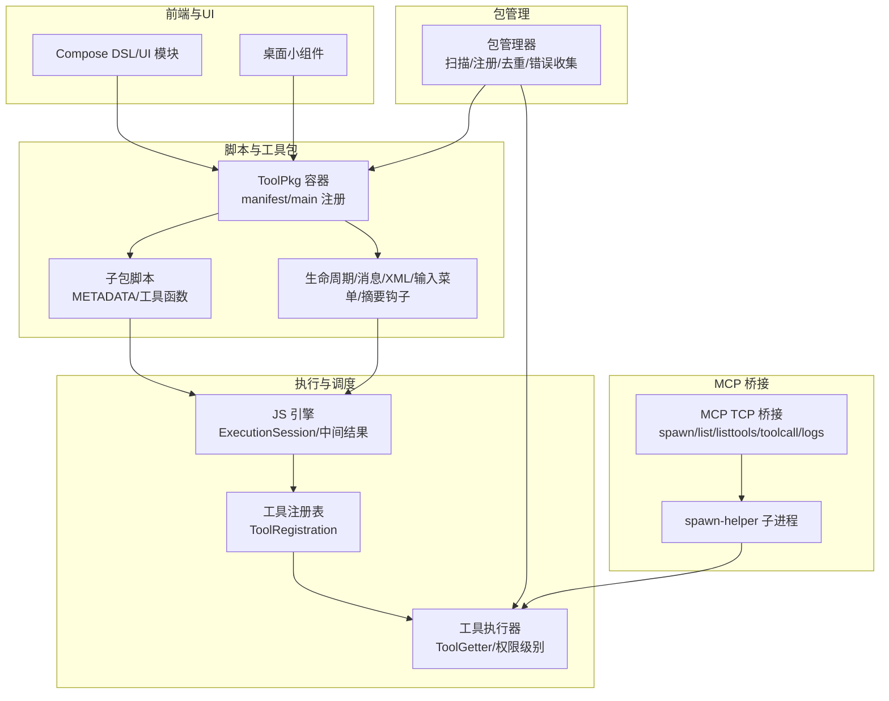
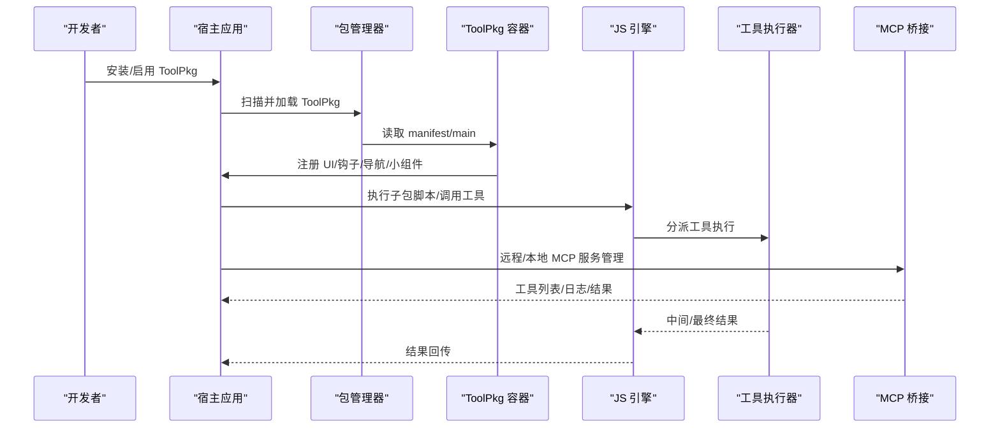
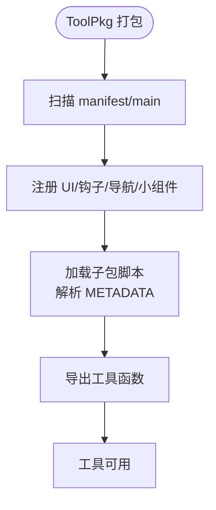
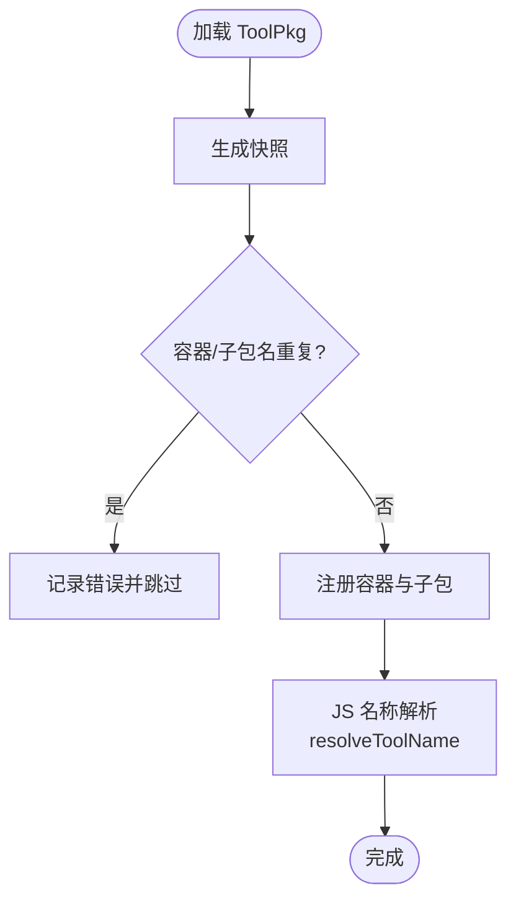
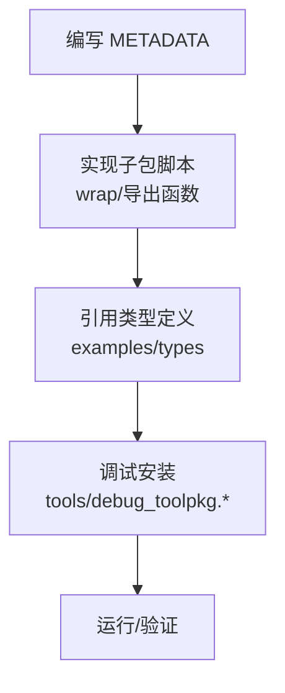
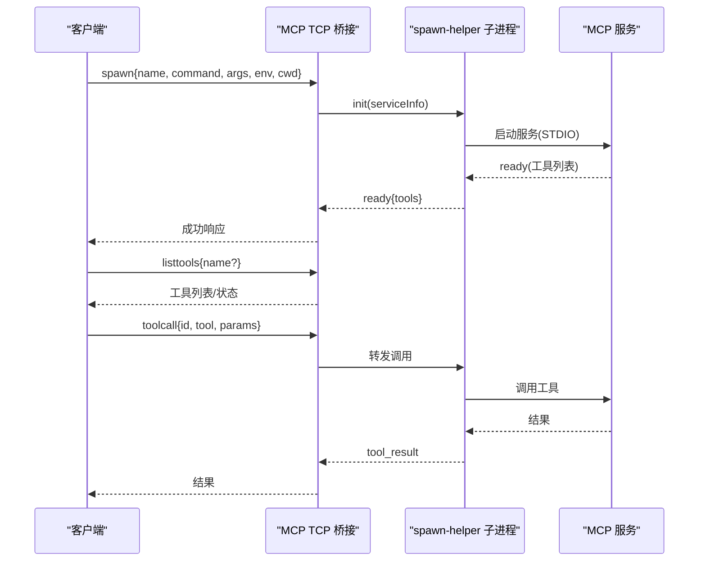
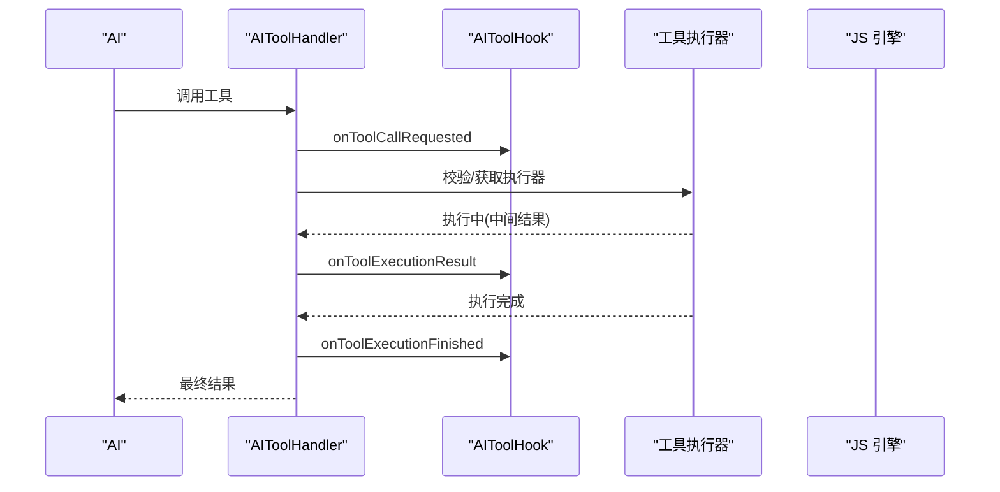
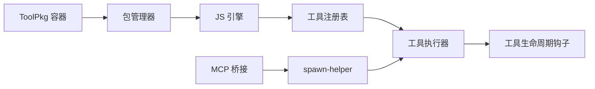

# 工具生态系统

<cite>
**本文引用的文件**
- [README.md](file://README.md)
- [TOOLPKG_FORMAT_GUIDE.md](file://docs/TOOLPKG_FORMAT_GUIDE.md)
- [DEFAULT_TOOLS_ARCH.md](file://docs/DEFAULT_TOOLS_ARCH.md)
- [SCRIPT_DEV_GUIDE.md](file://docs/SCRIPT_DEV_GUIDE.md)
- [toolpkg.md](file://docs/package_dev/toolpkg.md)
- [index.ts](file://tools/mcp_bridge/index.ts)
- [package.json](file://tools/mcp_bridge/package.json)
- [spawn-helper.ts](file://tools/mcp_bridge/spawn-helper.ts)
- [JsEngine.kt](file://app/src/main/java/com/ai/assistance/operit/core/tools/javascript/JsEngine.kt)
- [JsNativeInterfaceDelegates.kt](file://app/src/main/java/com/ai/assistance/operit/core/tools/javascript/JsNativeInterfaceDelegates.kt)
- [PackageManager.kt](file://app/src/main/java/com/ai/assistance/operit/core/tools/packTool/PackageManager.kt)
- [PackageManagerToolPkgFacade.kt](file://app/src/main/java/com/ai/assistance/operit/core/tools/packTool/PackageManagerToolPkgFacade.kt)
- [ToolRegistration.kt](file://app/src/main/java/com/ai/assistance/operit/core/tools/ToolRegistration.kt)
- [ToolGetter.kt](file://app/src/main/java/com/ai/assistance/operit/core/tools/defaultTool/ToolGetter.kt)
- [AIToolHook.kt](file://app/src/main/java/com/ai/assistance/operit/core/tools/AIToolHook.kt)
- [AIToolHandler.kt](file://app/src/main/java/com/ai/assistance/operit/core/tools/AIToolHandler.kt)
- [operit_editor.ts](file://examples/operit_editor.ts)
- [toolpkg_templates](file://examples/template_try/)
</cite>

## 目录
1. [简介](#简介)
2. [项目结构](#项目结构)
3. [核心组件](#核心组件)
4. [架构总览](#架构总览)
5. [组件详解](#组件详解)
6. [依赖关系分析](#依赖关系分析)
7. [性能考量](#性能考量)
8. [故障排查指南](#故障排查指南)
9. [结论](#结论)
10. [附录](#附录)

## 简介
本文件面向工具开发者与系统管理员，系统化梳理 Operit AI 的工具生态系统：工具包架构与格式规范、包管理与依赖解析、MCP 协议桥接与远程工具包管理、工具开发与调试流程、权限控制与安全策略、并发执行与结果处理机制，并提供可落地的开发与运维建议。

## 项目结构
Operit 采用“前端 UI + 脚本引擎 + 工具包生态 + MCP 桥接 + Kotlin 后端执行”的分层架构：
- 前端与 UI：Compose DSL、Web、桌面小组件等
- 脚本与工具包：ToolPkg 格式、子包脚本、UI 模块、生命周期钩子
- 执行与调度：JS 引擎、工具注册与执行器、工具生命周期钩子
- 包管理：ToolPkg 容器扫描、子包注册、重复检测、错误收集
- MCP 桥接：TCP 桥接本地/远程 MCP 服务，统一 spawn/list/listtools/toolcall/logs

**图表来源**
- [index.ts:1-800](file://tools/mcp_bridge/index.ts#L1-L800)
- [spawn-helper.ts](file://tools/mcp_bridge/spawn-helper.ts)
- [JsEngine.kt:279-313](file://app/src/main/java/com/ai/assistance/operit/core/tools/javascript/JsEngine.kt#L279-L313)
- [PackageManager.kt:876-1598](file://app/src/main/java/com/ai/assistance/operit/core/tools/packTool/PackageManager.kt#L876-L1598)
- [ToolRegistration.kt:923-948](file://app/src/main/java/com/ai/assistance/operit/core/tools/ToolRegistration.kt#L923-L948)
- [TOOLPKG_FORMAT_GUIDE.md:1-800](file://docs/TOOLPKG_FORMAT_GUIDE.md#L1-L800)

**章节来源**
- [README.md:1-469](file://README.md#L1-L469)
- [TOOLPKG_FORMAT_GUIDE.md:1-800](file://docs/TOOLPKG_FORMAT_GUIDE.md#L1-L800)
- [SCRIPT_DEV_GUIDE.md:1-800](file://docs/SCRIPT_DEV_GUIDE.md#L1-L800)
- [toolpkg.md:1-596](file://docs/package_dev/toolpkg.md#L1-L596)
- [index.ts:1-800](file://tools/mcp_bridge/index.ts#L1-L800)

## 核心组件
- 工具包与格式规范：ToolPkg 是 ZIP 容器，包含 manifest、main、子包、UI、资源、国际化等；清单字段涵盖 schema_version、toolpkg_id、version、author、main、display_name、description、subpackages、resources、workflow_templates、workspace_templates。
- 子包脚本：每个子包脚本包含 METADATA 块，声明工具名、描述、参数、环境变量、是否默认启用等；导出函数作为可调用工具。
- UI 模块与生命周期钩子：通过 main 脚本注册 Toolbox UI、导航入口、桌面小组件、应用生命周期钩子、消息处理插件、XML 渲染插件、输入菜单开关插件、工具生命周期钩子、Prompt 钩子、摘要生成钩子。
- 包管理器：扫描 ToolPkg 容器，注册容器与子包，去重与错误收集，支持卸载与移除。
- JS 引擎与执行会话：为每次工具调用创建 ExecutionSession，支持中间结果回调、环境变量覆盖、日志快照。
- 工具注册与执行：根据权限级别选择执行器，支持 CLI 模式代理与角色卡访问控制。
- MCP 桥接：将 STDIO 型 MCP 服务桥接至 TCP，支持本地/远程服务、spawn 超时、工具列表缓存、日志采集、自动重连与闲置回收。

**章节来源**
- [TOOLPKG_FORMAT_GUIDE.md:542-800](file://docs/TOOLPKG_FORMAT_GUIDE.md#L542-L800)
- [toolpkg.md:1-596](file://docs/package_dev/toolpkg.md#L1-L596)
- [PackageManager.kt:876-1598](file://app/src/main/java/com/ai/assistance/operit/core/tools/packTool/PackageManager.kt#L876-L1598)
- [JsEngine.kt:279-313](file://app/src/main/java/com/ai/assistance/operit/core/tools/javascript/JsEngine.kt#L279-L313)
- [ToolRegistration.kt:923-948](file://app/src/main/java/com/ai/assistance/operit/core/tools/ToolRegistration.kt#L923-L948)
- [index.ts:1-800](file://tools/mcp_bridge/index.ts#L1-L800)

## 架构总览
Operit 的工具生态以“工具包”为中心，围绕 JS 引擎与 Kotlin 执行层形成闭环。ToolPkg 通过 manifest/main 注册 UI 与钩子，子包脚本暴露工具函数；JS 引擎负责执行与中间结果处理；包管理器负责容器扫描与注册；MCP 桥接提供远程工具包能力。

**图表来源**
- [PackageManager.kt:876-1598](file://app/src/main/java/com/ai/assistance/operit/core/tools/packTool/PackageManager.kt#L876-L1598)
- [TOOLPKG_FORMAT_GUIDE.md:214-334](file://docs/TOOLPKG_FORMAT_GUIDE.md#L214-L334)
- [index.ts:577-800](file://tools/mcp_bridge/index.ts#L577-L800)

## 组件详解

### 工具包格式与清单规范
- 文件结构：ToolPkg 为 ZIP，包含 manifest.json/hjson、main.js/ts、packages/、ui/、resources/、i18n/。
- 清单字段：schema_version、toolpkg_id、version、author、main、display_name、description、subpackages、resources、workflow_templates、workspace_templates。
- 子包：每个子包脚本包含 METADATA 块，声明工具名、描述、参数、环境变量、是否默认启用；导出函数作为工具。
- main 注册：通过 main 脚本集中注册 UI 模块、导航、桌面小组件、生命周期钩子、消息处理、XML 渲染、输入菜单开关、工具生命周期钩子、Prompt 钩子、摘要生成钩子。
- 资源与模板：resources 支持文件/目录（目录会打包为 zip），workflow_templates/workspace_templates 支持注册工作流/工作区模板。

**图表来源**
- [TOOLPKG_FORMAT_GUIDE.md:26-135](file://docs/TOOLPKG_FORMAT_GUIDE.md#L26-L135)
- [TOOLPKG_FORMAT_GUIDE.md:214-334](file://docs/TOOLPKG_FORMAT_GUIDE.md#L214-L334)
- [toolpkg.md:392-430](file://docs/package_dev/toolpkg.md#L392-L430)

**章节来源**
- [TOOLPKG_FORMAT_GUIDE.md:26-135](file://docs/TOOLPKG_FORMAT_GUIDE.md#L26-L135)
- [TOOLPKG_FORMAT_GUIDE.md:214-334](file://docs/TOOLPKG_FORMAT_GUIDE.md#L214-L334)
- [toolpkg.md:1-596](file://docs/package_dev/toolpkg.md#L1-L596)

### 包管理与依赖解析
- 容器扫描：包管理器扫描 ToolPkg 容器，建立容器与子包映射，记录加载错误。
- 重复检测：若容器或子包名重复，记录错误并跳过。
- 子包注册：将 subpackages 注册到运行时，支持按首选包名解析子包。
- 依赖解析：JS 层 resolveToolName 支持“包名:工具名”或“子包:工具名”解析，支持 preferImported 优先启用已导入包。

**图表来源**
- [PackageManager.kt:876-1598](file://app/src/main/java/com/ai/assistance/operit/core/tools/packTool/PackageManager.kt#L876-L1598)
- [JsNativeInterfaceDelegates.kt:282-318](file://app/src/main/java/com/ai/assistance/operit/core/tools/javascript/JsNativeInterfaceDelegates.kt#L282-L318)

**章节来源**
- [PackageManager.kt:876-1598](file://app/src/main/java/com/ai/assistance/operit/core/tools/packTool/PackageManager.kt#L876-L1598)
- [JsNativeInterfaceDelegates.kt:282-318](file://app/src/main/java/com/ai/assistance/operit/core/tools/javascript/JsNativeInterfaceDelegates.kt#L282-L318)

### 工具开发与调试指南
- METADATA：定义工具名、描述、参数、环境变量、是否默认启用；支持多语言 display_name/description。
- 子包脚本：IIFE 包裹 + 包装函数 wrap，统一返回 success/message；导出工具函数。
- TypeScript 类型：examples/types 提供 Tools.* API 类型定义；Java/Kotlin 桥接类型以 JAVA_BRIDGE_INTERFACE.md 为准。
- 调试：使用 tools/debug_toolpkg.* 脚本进行 ToolPkg 调试安装；单脚本可使用 tools/execute_js.*。

**图表来源**
- [SCRIPT_DEV_GUIDE.md:633-761](file://docs/SCRIPT_DEV_GUIDE.md#L633-L761)
- [toolpkg.md:578-596](file://docs/package_dev/toolpkg.md#L578-L596)

**章节来源**
- [SCRIPT_DEV_GUIDE.md:1-800](file://docs/SCRIPT_DEV_GUIDE.md#L1-L800)
- [toolpkg.md:578-596](file://docs/package_dev/toolpkg.md#L578-L596)

### MCP 协议支持与桥接
- 桥接职责：将 STDIO 型 MCP 服务桥接至 TCP，支持本地/远程服务、spawn/list/listtools/toolcall/logs。
- 命令类型：spawn、shutdown、listtools、toolcall、list、register、unregister、reset、unspawn、cachetools、logs。
- 服务管理：注册/注销服务、活跃连接跟踪、请求超时、spawn 超时、日志采集、自动重连、闲置回收。
- 远程服务：支持 HTTP Stream/SSE 连接，可配置 bearerToken/headers。

**图表来源**
- [index.ts:577-800](file://tools/mcp_bridge/index.ts#L577-L800)
- [index.ts:1-800](file://tools/mcp_bridge/index.ts#L1-L800)
- [package.json:1-34](file://tools/mcp_bridge/package.json#L1-L34)

**章节来源**
- [index.ts:1-800](file://tools/mcp_bridge/index.ts#L1-L800)
- [package.json:1-34](file://tools/mcp_bridge/package.json#L1-L34)

### 工具执行机制与并发
- 执行流程：AI 发起工具调用 -> AIToolHandler 校验 -> 获取执行器 -> 执行并流式产出中间结果 -> 通知生命周期钩子 -> 返回最终结果。
- 并发策略：只读工具可并行执行；实际并发度受宿主实现与工具执行器影响。
- 中间结果：JS 引擎支持中间结果回调，便于流式 UI 更新与进度反馈。
- 权限与拦截：支持 CLI 模式代理、角色卡访问控制、保留代理目标检查。

**图表来源**
- [AIToolHandler.kt:369-401](file://app/src/main/java/com/ai/assistance/operit/core/tools/AIToolHandler.kt#L369-L401)
- [AIToolHook.kt:1-29](file://app/src/main/java/com/ai/assistance/operit/core/tools/AIToolHook.kt#L1-L29)
- [JsEngine.kt:279-313](file://app/src/main/java/com/ai/assistance/operit/core/tools/javascript/JsEngine.kt#L279-L313)

**章节来源**
- [AIToolHandler.kt:369-401](file://app/src/main/java/com/ai/assistance/operit/core/tools/AIToolHandler.kt#L369-L401)
- [AIToolHook.kt:1-29](file://app/src/main/java/com/ai/assistance/operit/core/tools/AIToolHook.kt#L1-L29)
- [JsEngine.kt:279-313](file://app/src/main/java/com/ai/assistance/operit/core/tools/javascript/JsEngine.kt#L279-L313)

### 工具权限控制与安全
- 权限声明：子包 METADATA 可声明 env 环境变量；包管理器在激活包前校验环境变量配置。
- 角色卡访问：CLI 模式下对代理目标工具进行访问控制，拒绝保留代理目标与无权限调用。
- 工具生命周期钩子：提供 onToolPermissionChecked/onToolExecutionError 等事件，便于审计与告警。
- 安全限制：MCP 服务致命错误（如缺少 API Key）会阻止重启并记录日志；spawn 超时与闲置回收降低资源占用。

**章节来源**
- [SCRIPT_DEV_GUIDE.md:1-800](file://docs/SCRIPT_DEV_GUIDE.md#L1-L800)
- [ToolRegistration.kt:923-948](file://app/src/main/java/com/ai/assistance/operit/core/tools/ToolRegistration.kt#L923-L948)
- [AIToolHook.kt:1-29](file://app/src/main/java/com/ai/assistance/operit/core/tools/AIToolHook.kt#L1-L29)
- [index.ts:1-800](file://tools/mcp_bridge/index.ts#L1-L800)

### 工具包开发示例
- ToolPkg 模板：examples/template_try/ 展示了 workflow_templates/workspace_templates、目录资源、最小 main.ts。
- manifest 解析：examples/operit_editor.ts 中包含对 ToolPkg manifest 的文本解析逻辑（正则与 JSON 解析回退）。
- 开发流程：编写子包脚本 -> 编译 TypeScript -> 使用调试脚本安装 -> 验证 UI/钩子/工具。

**章节来源**
- [toolpkg_templates](file://examples/template_try/)
- [operit_editor.ts:2379-2423](file://examples/operit_editor.ts#L2379-L2423)
- [TOOLPKG_FORMAT_GUIDE.md:581-610](file://docs/TOOLPKG_FORMAT_GUIDE.md#L581-L610)

## 依赖关系分析
- ToolPkg 依赖包管理器进行扫描与注册，依赖 JS 引擎执行脚本与工具函数。
- JS 引擎依赖工具注册表与执行器；执行器按权限级别选择（ToolGetter）。
- MCP 桥接依赖 spawn-helper 子进程管理本地服务，统一处理本地/远程 MCP 服务。
- 工具生命周期钩子贯穿执行前后，提供可观测性与可扩展性。

**图表来源**
- [PackageManager.kt:876-1598](file://app/src/main/java/com/ai/assistance/operit/core/tools/packTool/PackageManager.kt#L876-L1598)
- [JsEngine.kt:279-313](file://app/src/main/java/com/ai/assistance/operit/core/tools/javascript/JsEngine.kt#L279-L313)
- [ToolGetter.kt:1-13](file://app/src/main/java/com/ai/assistance/operit/core/tools/defaultTool/ToolGetter.kt#L1-L13)
- [index.ts:1-800](file://tools/mcp_bridge/index.ts#L1-L800)

**章节来源**
- [PackageManager.kt:876-1598](file://app/src/main/java/com/ai/assistance/operit/core/tools/packTool/PackageManager.kt#L876-L1598)
- [JsEngine.kt:279-313](file://app/src/main/java/com/ai/assistance/operit/core/tools/javascript/JsEngine.kt#L279-L313)
- [ToolGetter.kt:1-13](file://app/src/main/java/com/ai/assistance/operit/core/tools/defaultTool/ToolGetter.kt#L1-L13)
- [index.ts:1-800](file://tools/mcp_bridge/index.ts#L1-L800)

## 性能考量
- 并发执行：只读工具可并行执行，提升响应速度；实际并发度取决于宿主实现与工具执行器。
- 中间结果流式处理：JS 引擎支持中间结果回调，减少 UI 阻塞，改善用户体验。
- MCP 服务管理：spawn 超时、闲置回收、自动重连降低资源占用与启动成本。
- 包管理去重与错误收集：避免重复加载与无效包，减少运行时开销。

[本节为通用指导，无需特定文件引用]

## 故障排查指南
- ToolPkg 加载失败：检查 manifest/main 是否存在、子包脚本是否包含有效 METADATA、UI/钩子注册是否正确。
- 工具未找到：确认工具名拼写、是否启用、是否被角色卡访问控制拦截。
- MCP 服务启动失败：查看 logs 命令输出，关注致命错误（如缺少 API Key）与超时；检查 spawn 超时与重连次数。
- 权限问题：确认环境变量配置、角色卡访问策略、CLI 模式代理目标权限。
- 日志与诊断：使用 MCP logs 获取服务日志；使用调试脚本安装 ToolPkg 并观察注册与钩子同步情况。

**章节来源**
- [index.ts:583-727](file://tools/mcp_bridge/index.ts#L583-L727)
- [PackageManager.kt:876-1598](file://app/src/main/java/com/ai/assistance/operit/core/tools/packTool/PackageManager.kt#L876-L1598)
- [toolpkg.md:578-596](file://docs/package_dev/toolpkg.md#L578-L596)

## 结论
Operit 的工具生态系统以 ToolPkg 为核心，结合 JS 引擎、包管理器、工具注册与执行器、MCP 桥接，形成了可扩展、可观测、可远程的工具生态。开发者可通过规范的 ToolPkg 格式与调试流程快速交付高质量工具包；管理员可通过包管理与 MCP 桥接实现远程工具包的统一管理与安全控制。

[本节为总结，无需特定文件引用]

## 附录
- 开发者指南：参考脚本开发指南与 ToolPkg 格式说明，使用调试脚本进行本地验证。
- 管理员建议：定期清理闲置 MCP 服务、监控工具包加载错误、配置合理的权限与角色卡访问策略。

[本节为概览，无需特定文件引用]