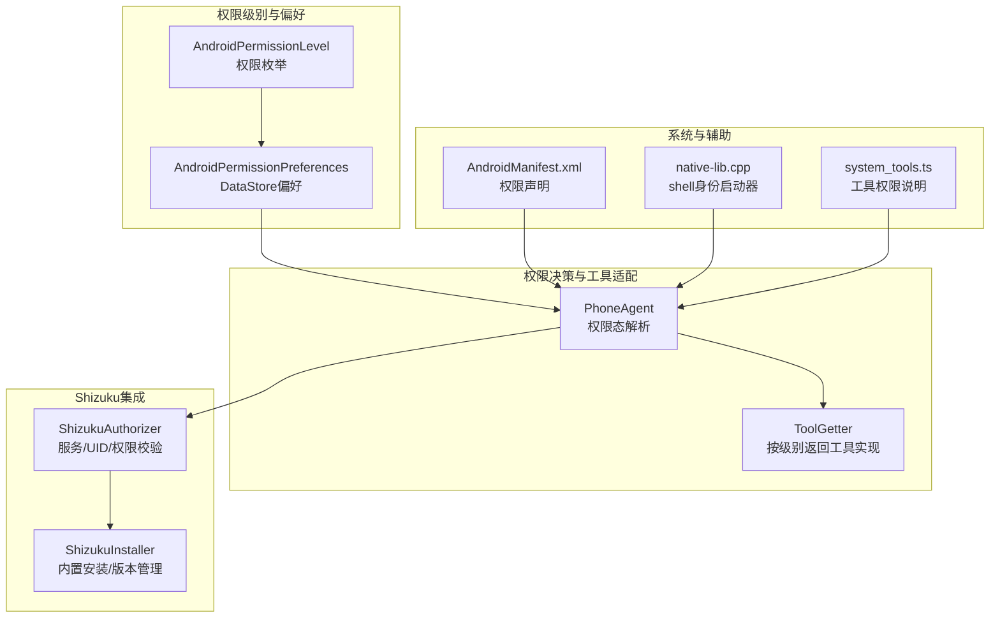
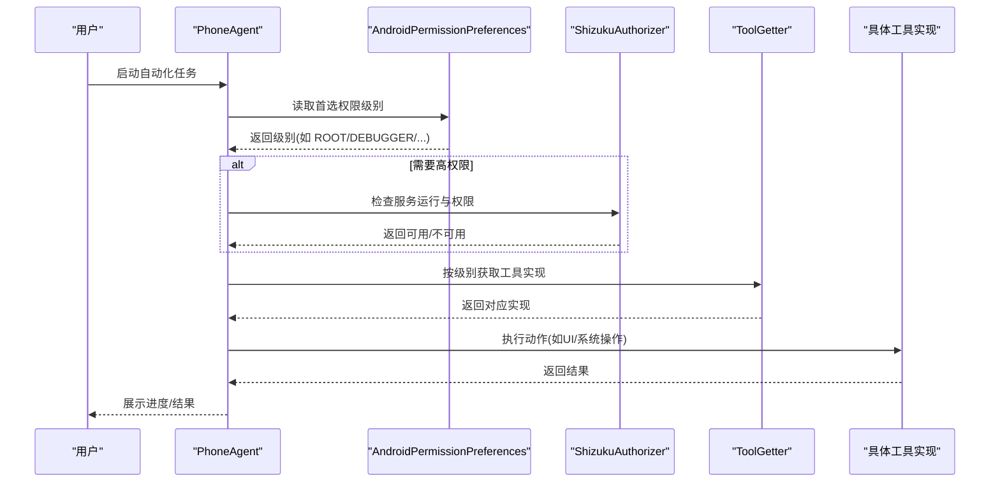
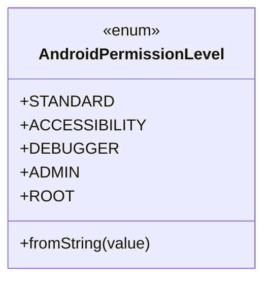
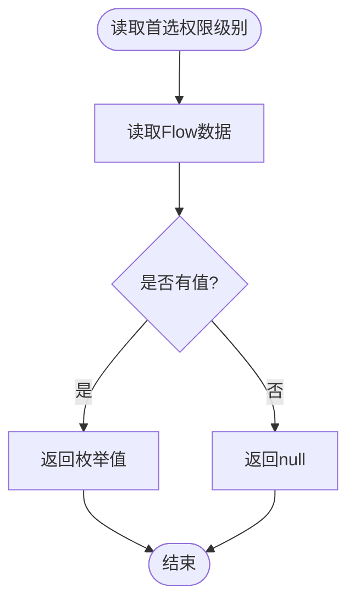
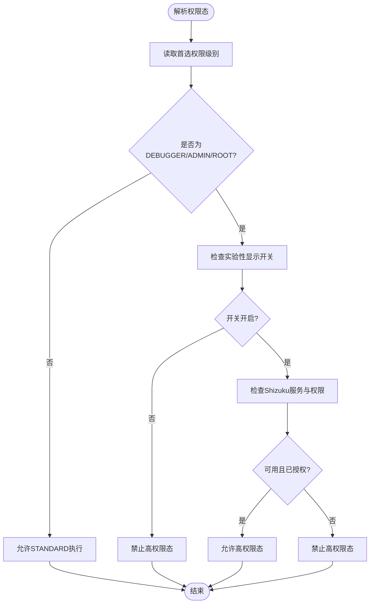
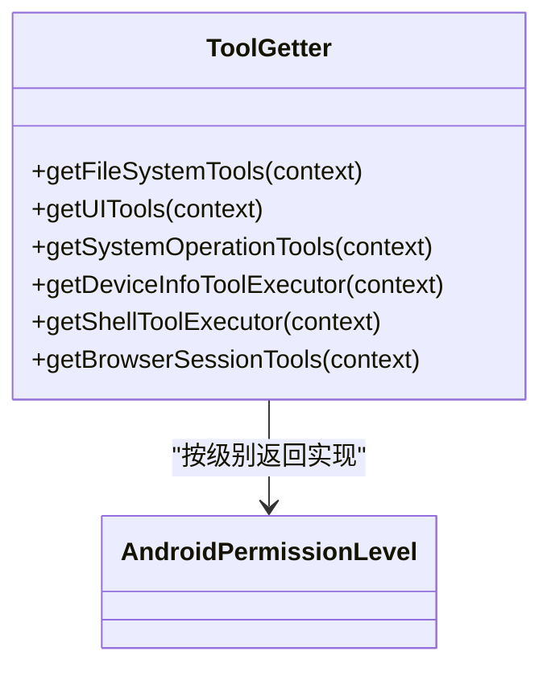
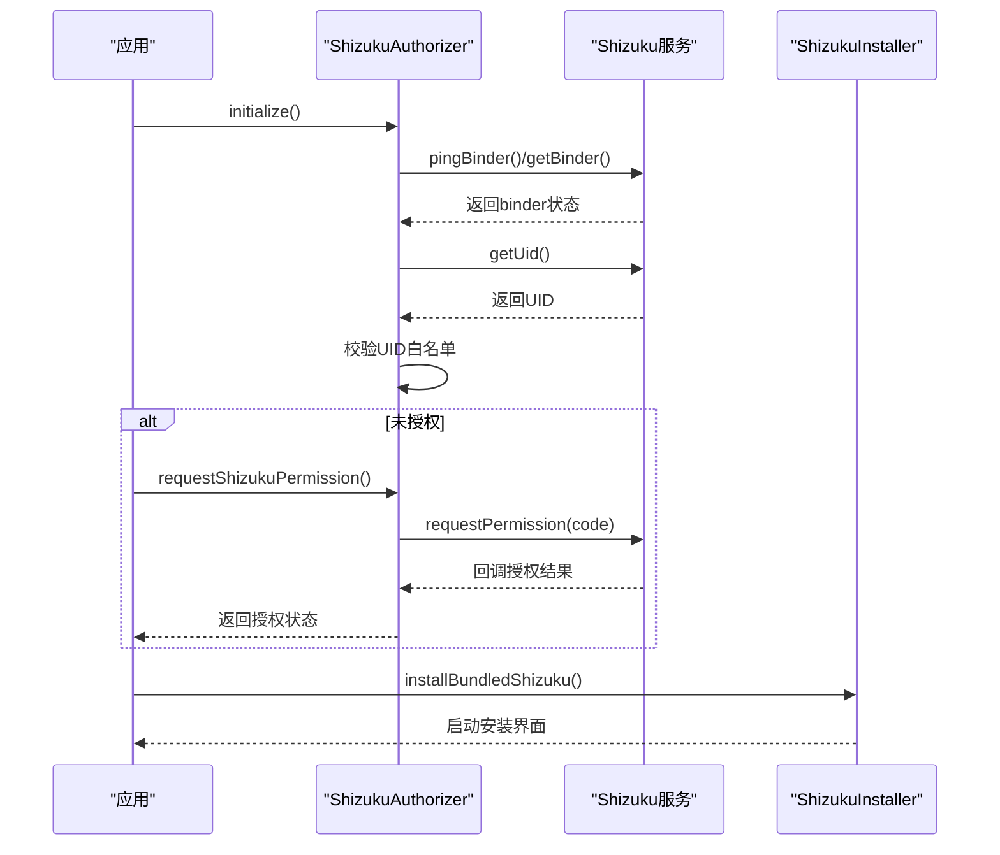
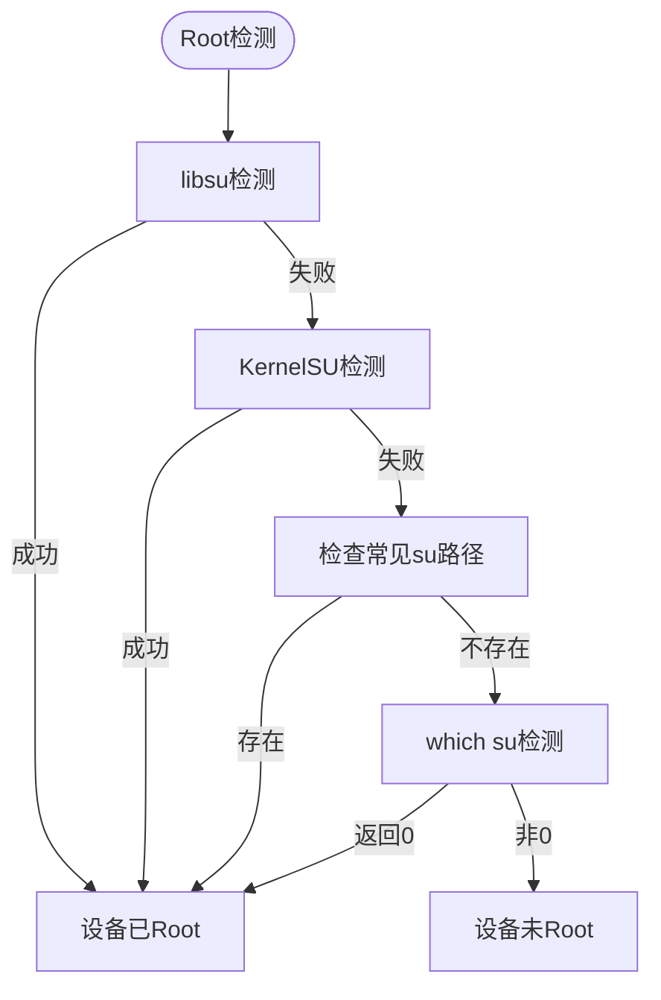
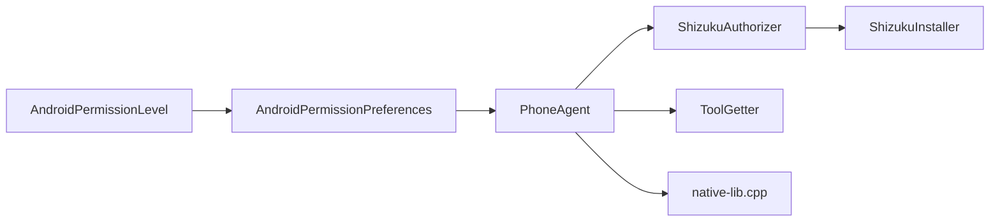

# 权限控制系统

<cite>
**本文引用的文件**
- [AndroidPermissionLevel.kt](file://app/src/main/java/com/ai/assistance/operit/core/tools/system/AndroidPermissionLevel.kt)
- [AndroidPermissionPreferences.kt](file://app/src/main/java/com/ai/assistance/operit/data/preferences/AndroidPermissionPreferences.kt)
- [ShizukuAuthorizer.kt](file://app/src/main/java/com/ai/assistance/operit/core/tools/system/ShizukuAuthorizer.kt)
- [ShizukuInstaller.kt](file://app/src/main/java/com/ai/assistance/operit/core/tools/system/ShizukuInstaller.kt)
- [PhoneAgent.kt](file://app/src/main/java/com/ai/assistance/operit/core/tools/agent/PhoneAgent.kt)
- [ToolGetter.kt](file://app/src/main/java/com/ai/assistance/operit/core/tools/defaultTool/ToolGetter.kt)
- [AndroidManifest.xml](file://app/src/main/AndroidManifest.xml)
- [native-lib.cpp](file://tools/shell_identity_launcher/native-lib.cpp)
- [system_tools.ts](file://examples/system_tools.ts)
</cite>

## 目录
1. [简介](#简介)
2. [项目结构](#项目结构)
3. [核心组件](#核心组件)
4. [架构总览](#架构总览)
5. [详细组件分析](#详细组件分析)
6. [依赖关系分析](#依赖关系分析)
7. [性能考量](#性能考量)
8. [故障排查指南](#故障排查指南)
9. [结论](#结论)
10. [附录](#附录)

## 简介
本技术文档围绕 Operit 的权限控制系统展开，系统性梳理权限级别体系、权限分类与等级划分、权限申请与处理流程、Shizuku 集成方案（含 Root 权限获取、权限代理与安全控制）、工具权限控制策略、最佳实践与调试方法，并面向开发者提供权限设计指导。文档基于仓库中实际源码进行分析，确保内容可追溯、可落地。

## 项目结构
权限控制涉及的核心模块与文件分布如下：
- 权限级别定义：AndroidPermissionLevel 枚举
- 权限偏好存储：AndroidPermissionPreferences（DataStore）
- 权限决策入口：PhoneAgent（根据首选权限级别与环境状态决定执行态）
- 工具适配器：ToolGetter（按权限级别返回不同实现）
- Shizuku 集成：ShizukuAuthorizer（服务可用性、UID 校验、权限请求）、ShizukuInstaller（内置 Shizuku 安装与版本管理）
- 系统集成：AndroidManifest.xml（声明所需权限）
- Root/Shell 辅助：native-lib.cpp（以 shell 身份运行的 C++ 辅助程序）
- 示例与限制：system_tools.ts（对需要特殊权限的工具进行说明与规避）

**图表来源**
- [AndroidPermissionLevel.kt:11-16](file://app/src/main/java/com/ai/assistance/operit/core/tools/system/AndroidPermissionLevel.kt#L11-L16)
- [AndroidPermissionPreferences.kt:41-167](file://app/src/main/java/com/ai/assistance/operit/data/preferences/AndroidPermissionPreferences.kt#L41-L167)
- [PhoneAgent.kt:68-111](file://app/src/main/java/com/ai/assistance/operit/core/tools/agent/PhoneAgent.kt#L68-L111)
- [ToolGetter.kt:13-86](file://app/src/main/java/com/ai/assistance/operit/core/tools/defaultTool/ToolGetter.kt#L13-L86)
- [ShizukuAuthorizer.kt:14-420](file://app/src/main/java/com/ai/assistance/operit/core/tools/system/ShizukuAuthorizer.kt#L14-L420)
- [ShizukuInstaller.kt:19-298](file://app/src/main/java/com/ai/assistance/operit/core/tools/system/ShizukuInstaller.kt#L19-L298)
- [AndroidManifest.xml:13-55](file://app/src/main/AndroidManifest.xml#L13-L55)
- [native-lib.cpp:130-207](file://tools/shell_identity_launcher/native-lib.cpp#L130-L207)
- [system_tools.ts:334-346](file://examples/system_tools.ts#L334-L346)

**章节来源**
- [AndroidPermissionLevel.kt:1-35](file://app/src/main/java/com/ai/assistance/operit/core/tools/system/AndroidPermissionLevel.kt#L1-L35)
- [AndroidPermissionPreferences.kt:1-168](file://app/src/main/java/com/ai/assistance/operit/data/preferences/AndroidPermissionPreferences.kt#L1-L168)
- [PhoneAgent.kt:68-111](file://app/src/main/java/com/ai/assistance/operit/core/tools/agent/PhoneAgent.kt#L68-L111)
- [ToolGetter.kt:13-86](file://app/src/main/java/com/ai/assistance/operit/core/tools/defaultTool/ToolGetter.kt#L13-L86)
- [ShizukuAuthorizer.kt:14-420](file://app/src/main/java/com/ai/assistance/operit/core/tools/system/ShizukuAuthorizer.kt#L14-L420)
- [ShizukuInstaller.kt:19-298](file://app/src/main/java/com/ai/assistance/operit/core/tools/system/ShizukuInstaller.kt#L19-L298)
- [AndroidManifest.xml:13-55](file://app/src/main/AndroidManifest.xml#L13-L55)
- [native-lib.cpp:130-207](file://tools/shell_identity_launcher/native-lib.cpp#L130-L207)
- [system_tools.ts:334-346](file://examples/system_tools.ts#L334-L346)

## 核心组件
- 权限级别体系：定义五级权限（STANDARD、ACCESSIBILITY、DEBUGGER、ADMIN、ROOT），支持字符串转换与默认回退策略。
- 权限偏好存储：通过 DataStore 持久化首选权限级别、Root 执行模式与自定义 su 命令，提供 Flow 读取与阻塞读取两种方式。
- 权限态解析：PhoneAgent 在运行前解析“ADB/高权限”与“调试器 Shizuku 访问”状态，决定虚拟显示与交互能力。
- 工具适配：ToolGetter 根据首选权限级别返回对应实现（文件系统、UI、系统操作、设备信息等），未覆盖的类别默认走 STANDARD。
- Shizuku 管理：ShizukuAuthorizer 负责服务可用性检测、UID 白名单校验、权限请求与监听；ShizukuInstaller 负责内置 Shizuku 的提取、安装与版本对比。
- 系统权限声明：AndroidManifest.xml 明确列出网络、存储、前台服务、悬浮窗、系统设置、包查询等权限。
- Root/Shell 辅助：native-lib.cpp 提供以 root/shell 身份运行并降权至 shell 用户的流程，便于系统服务调用。

**章节来源**
- [AndroidPermissionLevel.kt:11-35](file://app/src/main/java/com/ai/assistance/operit/core/tools/system/AndroidPermissionLevel.kt#L11-L35)
- [AndroidPermissionPreferences.kt:41-167](file://app/src/main/java/com/ai/assistance/operit/data/preferences/AndroidPermissionPreferences.kt#L41-L167)
- [PhoneAgent.kt:68-111](file://app/src/main/java/com/ai/assistance/operit/core/tools/agent/PhoneAgent.kt#L68-L111)
- [ToolGetter.kt:13-86](file://app/src/main/java/com/ai/assistance/operit/core/tools/defaultTool/ToolGetter.kt#L13-L86)
- [ShizukuAuthorizer.kt:14-420](file://app/src/main/java/com/ai/assistance/operit/core/tools/system/ShizukuAuthorizer.kt#L14-L420)
- [ShizukuInstaller.kt:19-298](file://app/src/main/java/com/ai/assistance/operit/core/tools/system/ShizukuInstaller.kt#L19-L298)
- [AndroidManifest.xml:13-55](file://app/src/main/AndroidManifest.xml#L13-L55)
- [native-lib.cpp:130-207](file://tools/shell_identity_launcher/native-lib.cpp#L130-L207)

## 架构总览
权限控制的整体流程围绕“首选权限级别 + 环境检测 + 工具适配 + 安全控制”展开：

**图表来源**
- [PhoneAgent.kt:68-111](file://app/src/main/java/com/ai/assistance/operit/core/tools/agent/PhoneAgent.kt#L68-L111)
- [AndroidPermissionPreferences.kt:57-113](file://app/src/main/java/com/ai/assistance/operit/data/preferences/AndroidPermissionPreferences.kt#L57-L113)
- [ShizukuAuthorizer.kt:224-254](file://app/src/main/java/com/ai/assistance/operit/core/tools/system/ShizukuAuthorizer.kt#L224-L254)
- [ToolGetter.kt:13-86](file://app/src/main/java/com/ai/assistance/operit/core/tools/defaultTool/ToolGetter.kt#L13-L86)

## 详细组件分析

### 权限级别与分类
- 枚举定义：STANDARD（普通）、ACCESSIBILITY（无障碍）、DEBUGGER（调试）、ADMIN（设备管理员）、ROOT（Root）。
- 字符串映射：支持从字符串恢复权限级别，默认回退到 STANDARD。
- 分类意义：不同级别对应不同的系统能力与风险等级，驱动工具实现与执行策略的选择。

**图表来源**
- [AndroidPermissionLevel.kt:11-35](file://app/src/main/java/com/ai/assistance/operit/core/tools/system/AndroidPermissionLevel.kt#L11-L35)

**章节来源**
- [AndroidPermissionLevel.kt:11-35](file://app/src/main/java/com/ai/assistance/operit/core/tools/system/AndroidPermissionLevel.kt#L11-L35)

### 权限偏好存储与读取
- DataStore 持久化：使用 preferences DataStore 存储首选权限级别、Root 执行模式、自定义 su 命令。
- Flow 读取：提供 Flow 类型的读取接口，便于 UI 与业务层响应式更新。
- 阻塞读取：提供阻塞读取方法，用于非协程场景。
- 默认值与重置：未设置时默认 null，Root 执行模式默认 AUTO，支持重置。

**图表来源**
- [AndroidPermissionPreferences.kt:57-113](file://app/src/main/java/com/ai/assistance/operit/data/preferences/AndroidPermissionPreferences.kt#L57-L113)

**章节来源**
- [AndroidPermissionPreferences.kt:41-167](file://app/src/main/java/com/ai/assistance/operit/data/preferences/AndroidPermissionPreferences.kt#L41-L167)

### 权限态解析与执行策略
- 解析逻辑：根据首选权限级别判断是否为 ADB/高权限；若为 DEBUGGER 且需要 Shizuku，进一步检查服务运行与权限授予。
- 实验性标志：当启用实验性虚拟显示时才允许更高权限态。
- 执行前置条件：若无高权限或 Shizuku 不可用，将返回明确提示，避免非法操作。

**图表来源**
- [PhoneAgent.kt:68-111](file://app/src/main/java/com/ai/assistance/operit/core/tools/agent/PhoneAgent.kt#L68-L111)
- [ShizukuAuthorizer.kt:224-254](file://app/src/main/java/com/ai/assistance/operit/core/tools/system/ShizukuAuthorizer.kt#L224-L254)

**章节来源**
- [PhoneAgent.kt:68-111](file://app/src/main/java/com/ai/assistance/operit/core/tools/agent/PhoneAgent.kt#L68-L111)

### 工具适配与权限级别映射
- 文件系统、UI、系统操作、设备信息等工具族均按权限级别返回不同实现。
- 未覆盖的工具默认走 STANDARD 实现，保证最小权限与兼容性。
- Shell 执行器与浏览器会话工具保持 STANDARD 实现，避免越权。

**图表来源**
- [ToolGetter.kt:13-86](file://app/src/main/java/com/ai/assistance/operit/core/tools/defaultTool/ToolGetter.kt#L13-L86)

**章节来源**
- [ToolGetter.kt:13-86](file://app/src/main/java/com/ai/assistance/operit/core/tools/defaultTool/ToolGetter.kt#L13-L86)

### Shizuku 集成方案
- 服务可用性检测：兼容 Shizuku 与 Sui 后端，支持 pingBinder 与 binder 存活检测。
- UID 白名单：仅允许 root(0) 与 shell(2000)。
- 权限请求与监听：注册权限结果监听器，请求后回调结果并触发状态变更通知。
- 初始化流程：设置 binder 接收与死亡监听，首次检查服务状态并在需要时延时重检。
- 内置安装与版本管理：从 assets 提取内置 Shizuku APK，生成 FileProvider URI，启动安装界面；对比内置与已安装版本，支持缓存与失效控制。

**图表来源**
- [ShizukuAuthorizer.kt:158-218](file://app/src/main/java/com/ai/assistance/operit/core/tools/system/ShizukuAuthorizer.kt#L158-L218)
- [ShizukuAuthorizer.kt:260-322](file://app/src/main/java/com/ai/assistance/operit/core/tools/system/ShizukuAuthorizer.kt#L260-L322)
- [ShizukuAuthorizer.kt:325-403](file://app/src/main/java/com/ai/assistance/operit/core/tools/system/ShizukuAuthorizer.kt#L325-L403)
- [ShizukuInstaller.kt:73-125](file://app/src/main/java/com/ai/assistance/operit/core/tools/system/ShizukuInstaller.kt#L73-L125)

**章节来源**
- [ShizukuAuthorizer.kt:14-420](file://app/src/main/java/com/ai/assistance/operit/core/tools/system/ShizukuAuthorizer.kt#L14-L420)
- [ShizukuInstaller.kt:19-298](file://app/src/main/java/com/ai/assistance/operit/core/tools/system/ShizukuInstaller.kt#L19-L298)

### Root 权限获取与安全控制
- Root 检测：多层检测（libsu、KernelSU、常见 su 路径、which su），提升准确性。
- 执行模式：AUTO、FORCE_LIBSU、FORCE_EXEC，支持自定义 su 命令。
- Shell 身份降权：native-lib.cpp 在 root(0) 下初始化 SELinux helper，降权至 shell 用户(uid/gid=2000)，切换 SELinux 上下文，确保系统服务调用满足包名与 UID 校验。
- 安全策略：严格 UID 白名单、Binder 生命周期管理、错误信息缓存与清理。

**图表来源**
- [native-lib.cpp:130-207](file://tools/shell_identity_launcher/native-lib.cpp#L130-L207)

**章节来源**
- [native-lib.cpp:130-207](file://tools/shell_identity_launcher/native-lib.cpp#L130-L207)

### 工具权限控制与用户确认
- 工具声明：部分工具需要 WRITE_SETTINGS、INSTALL_PACKAGES、DELETE_PACKAGES、KILL_BACKGROUND_PROCESSES 等权限，仓库示例脚本明确标注“跳过破坏性/需要特殊权限的工具测试”，避免误操作。
- 用户确认机制：通过 UI 层引导用户授予必要权限，结合权限偏好设置与工具适配，确保最小权限原则。
- 权限撤销处理：当权限被撤销时，系统应回退到低权限实现或提示用户重新授权。

**章节来源**
- [system_tools.ts:334-346](file://examples/system_tools.ts#L334-L346)

### 权限申请流程（静态/动态/特殊）
- 静态权限：在 AndroidManifest.xml 中声明，如 INTERNET、FOREGROUND_SERVICE、SYSTEM_ALERT_WINDOW、WRITE_SETTINGS、PACKAGE_USAGE_STATS、POST_NOTIFICATIONS 等。
- 动态权限：对于敏感权限（如位置、短信、存储），需在运行时向用户申请并处理授权结果。
- 特殊权限：如 SYSTEM_ALERT_WINDOW、WRITE_SETTINGS、REQUEST_IGNORE_BATTERY_OPTIMIZATIONS 等，需引导用户在系统设置中手动授权。

**章节来源**
- [AndroidManifest.xml:13-55](file://app/src/main/AndroidManifest.xml#L13-L55)

## 依赖关系分析
- 权限级别与偏好：AndroidPermissionLevel 与 AndroidPermissionPreferences 相互配合，前者定义级别，后者持久化与读取。
- 决策与适配：PhoneAgent 依赖 AndroidPermissionPreferences 与 ShizukuAuthorizer 决定执行态，再通过 ToolGetter 获取对应工具实现。
- 安全与系统：ShizukuAuthorizer 依赖 Shizuku SDK，native-lib.cpp 依赖系统 SELinux 与 setuid/setgid 能力。

**图表来源**
- [AndroidPermissionLevel.kt:11-35](file://app/src/main/java/com/ai/assistance/operit/core/tools/system/AndroidPermissionLevel.kt#L11-L35)
- [AndroidPermissionPreferences.kt:41-167](file://app/src/main/java/com/ai/assistance/operit/data/preferences/AndroidPermissionPreferences.kt#L41-L167)
- [PhoneAgent.kt:68-111](file://app/src/main/java/com/ai/assistance/operit/core/tools/agent/PhoneAgent.kt#L68-L111)
- [ShizukuAuthorizer.kt:14-420](file://app/src/main/java/com/ai/assistance/operit/core/tools/system/ShizukuAuthorizer.kt#L14-L420)
- [ShizukuInstaller.kt:19-298](file://app/src/main/java/com/ai/assistance/operit/core/tools/system/ShizukuInstaller.kt#L19-L298)
- [ToolGetter.kt:13-86](file://app/src/main/java/com/ai/assistance/operit/core/tools/defaultTool/ToolGetter.kt#L13-L86)
- [native-lib.cpp:130-207](file://tools/shell_identity_launcher/native-lib.cpp#L130-L207)

**章节来源**
- [PhoneAgent.kt:68-111](file://app/src/main/java/com/ai/assistance/operit/core/tools/agent/PhoneAgent.kt#L68-L111)
- [ShizukuAuthorizer.kt:14-420](file://app/src/main/java/com/ai/assistance/operit/core/tools/system/ShizukuAuthorizer.kt#L14-L420)
- [ToolGetter.kt:13-86](file://app/src/main/java/com/ai/assistance/operit/core/tools/defaultTool/ToolGetter.kt#L13-L86)

## 性能考量
- 权限状态缓存：ShizukuAuthorizer 对连接与错误信息进行缓存，减少重复检测成本。
- 版本对比缓存：ShizukuInstaller 对已安装与内置版本进行缓存，降低频繁读取资产带来的 IO 压力。
- UI 切换与渲染：PhoneAgent 在高权限态与普通态之间切换时，尽量复用 Overlay，避免频繁创建销毁带来的开销。
- 执行模式选择：Root 执行模式 AUTO/ FORCE_LIBSU/ FORCE_EXEC 的选择应结合设备环境，避免不必要的降级或失败重试。

[本节为通用建议，无需源码引用]

## 故障排查指南
- Shizuku 未运行或未授权
  - 现象：PhoneAgent 返回“需要调试权限/不可用”。
  - 排查：检查服务运行与权限授予；查看 ShizukuAuthorizer 的错误信息缓存。
- Root 检测失败
  - 现象：提示设备未 Root。
  - 排查：确认 Magisk 授权、Zygisk/排除列表、执行模式（AUTO/LIBSU/EXEC）；查看 native-lib.cpp 的降权与上下文切换日志。
- 权限态解析异常
  - 现象：高权限态未生效。
  - 排查：检查实验性显示开关、首选权限级别、ToolGetter 返回的实现是否符合预期。
- 工具权限冲突
  - 现象：某些工具无法执行。
  - 排查：参考 system_tools.ts 的说明，确认 WRITE_SETTINGS、INSTALL_PACKAGES 等权限是否已授予。

**章节来源**
- [ShizukuAuthorizer.kt:118-128](file://app/src/main/java/com/ai/assistance/operit/core/tools/system/ShizukuAuthorizer.kt#L118-L128)
- [ShizukuAuthorizer.kt:224-254](file://app/src/main/java/com/ai/assistance/operit/core/tools/system/ShizukuAuthorizer.kt#L224-L254)
- [PhoneAgent.kt:68-111](file://app/src/main/java/com/ai/assistance/operit/core/tools/agent/PhoneAgent.kt#L68-L111)
- [system_tools.ts:334-346](file://examples/system_tools.ts#L334-L346)

## 结论
Operit 的权限控制系统以“最小权限 + 分层权限 + 安全控制”为核心设计思想，通过权限级别枚举、偏好存储、权限态解析、工具适配与 Shizuku/Root 集成，实现了灵活而安全的权限管理。开发者在设计新工具时应遵循最小权限原则、透明度设计与用户体验优化，同时重视权限状态检查、冲突诊断与异常处理，确保系统稳定与用户信任。

[本节为总结，无需源码引用]

## 附录
- 权限最小化原则：仅在必要时提升权限级别，优先使用 STANDARD 实现。
- 透明度设计：在 UI 中清晰展示所需权限与用途，提供一键跳转系统设置的能力。
- 用户体验优化：在权限缺失时提供引导文案与自动重试机制，避免长时间等待。
- 安全考虑：严格限制 UID 白名单、Binder 生命周期管理、SELinux 上下文切换，防止越权与滥用。

[本节为通用建议，无需源码引用]