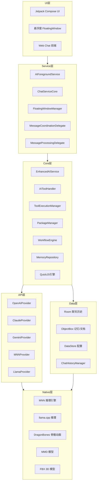

# 快速开始

<cite>
**本文引用的文件**
- [QUICK_START_GUIDE.md](file://QUICK_START_GUIDE.md)
- [README.md](file://README.md)
- [docs/BUILDING.md](file://docs/BUILDING.md)
- [docs/SCRIPT_DEV_GUIDE.md](file://docs/SCRIPT_DEV_GUIDE.md)
- [docs/CONTRIBUTING.md](file://docs/CONTRIBUTING.md)
- [app/build.gradle.kts](file://app/build.gradle.kts)
- [settings.gradle.kts](file://settings.gradle.kts)
- [gradle.properties](file://gradle.properties)
- [local.properties.example](file://local.properties.example)
- [app/src/main/AndroidManifest.xml](file://app/src/main/AndroidManifest.xml)
- [sync_example_packages.py](file://sync_example_packages.py)
</cite>

## 目录
1. [简介](#简介)
2. [系统要求](#系统要求)
3. [下载与安装](#下载与安装)
4. [首次启动与基础配置](#首次启动与基础配置)
5. [开发环境搭建](#开发环境搭建)
6. [项目克隆与配置](#项目克隆与配置)
7. [依赖库下载与放置](#依赖库下载与放置)
8. [构建与运行](#构建与运行)
9. [常见问题与故障排除](#常见问题与故障排除)
10. [基本使用示例](#基本使用示例)
11. [架构概览](#架构概览)
12. [结语](#结语)

## 简介
Operit AI 是移动端首个功能完备的开源 AI 智能助手应用，支持本地与云端 AI 推理、工具生态、工作流与自动化、记忆系统、虚拟形象与悬浮窗等能力。本文面向初学者，提供从系统要求、安装、首次配置到开发环境搭建、构建运行、常见问题排查与基础使用示例的完整指南。

## 系统要求
- **操作系统与平台**：Android 8.0+（minSdk 26），建议 4GB+ 内存，200MB+ 可用存储空间
- **开发环境（可选）**：Linux/Ubuntu（推荐）或 Windows/macOS，需安装 JDK 17、Android SDK/NDK、Node.js、Python 3、Git

**章节来源**
- [README.md: 176-184:176-184](file://README.md#L176-L184)
- [app/build.gradle.kts: 56](file://app/build.gradle.kts#L56)

## 下载与安装
- 从官方 Release 页面下载最新 APK 并安装
- 首次启动后按引导完成基础配置

**章节来源**
- [README.md: 178-184:178-184](file://README.md#L178-L184)

## 首次启动与基础配置
- 安装完成后启动应用，按引导完成初始设置
- 建议在设置中配置模型偏好、工具权限与工作区绑定等

**章节来源**
- [README.md: 178-184:178-184](file://README.md#L178-L184)

## 开发环境搭建
为便于二次开发与调试，建议按以下步骤搭建开发环境：
- 安装系统基础依赖：Git、JDK 17、Node.js、npm、Python 3、pnpm
- 安装 Android SDK/NDK（NDK 25.1.8937393）
- 配置环境变量（JAVA_HOME、ANDROID_HOME、PATH）
- 安装 Android SDK 平台与构建工具（android-34、34.0.0）
- 配置 GitHub OAuth 应用（用于 GitHub 相关功能）

**章节来源**
- [docs/BUILDING.md: 21-46:21-46](file://docs/BUILDING.md#L21-L46)
- [docs/BUILDING.md: 48-126:48-126](file://docs/BUILDING.md#L48-L126)
- [docs/BUILDING.md: 143-167:143-167](file://docs/BUILDING.md#L143-L167)

## 项目克隆与配置
- 克隆仓库（含子模块）：使用递归子模块克隆
- 若已克隆但未含子模块，执行子模块初始化
- 可选：添加上游仓库以同步更新

**章节来源**
- [docs/BUILDING.md: 169-201:169-201](file://docs/BUILDING.md#L169-L201)

## 依赖库下载与放置
- 从 Google Drive 下载以下压缩包并解压到对应目录：
  - models.zip → app/src/main/assets/models/
  - subpack.zip → app/src/main/assets/subpack/
  - jniLibs.zip → app/src/main/jniLibs/
  - libs.zip → app/libs/
- 注意：这些依赖为构建关键步骤，缺少会导致编译失败

**章节来源**
- [README.md: 415](file://README.md#L415)
- [docs/BUILDING.md: 202-209:202-209](file://docs/BUILDING.md#L202-L209)

## 构建与运行
- 安装项目根目录与 web-chat 的依赖
- 先构建 web-chat 并同步到 Android assets
- 打包 ToolPkg 并同步示例包到 app/assets
- 授予 Gradle 包装器可执行权限
- 使用 Gradle 构建 Debug/Release/Nightly 版本
- 查找生成的 APK 输出路径

**章节来源**
- [docs/BUILDING.md: 217-253:217-253](file://docs/BUILDING.md#L217-L253)
- [QUICK_START_GUIDE.md: 684-729:684-729](file://QUICK_START_GUIDE.md#L684-L729)

## 常见问题与故障排除
- sdkmanager: command not found：检查环境变量是否正确设置并生效
- Could not determine Java version…：确认安装 JDK 17 并指向正确路径
- NDK not found：确认已使用 sdkmanager 安装 NDK 25.1.8937393
- pnpm: command not found：安装 pnpm 后重试
- Missing web-chat/dist：先安装 web-chat 依赖并执行构建
- ERROR: prebuild step failed：确认已安装 npm 依赖，检查 pnpm 与 Python 版本
- You have not accepted the license agreements：执行接受许可步骤

**章节来源**
- [docs/BUILDING.md: 254-266:254-266](file://docs/BUILDING.md#L254-L266)

## 基本使用示例
- 开始第一次对话：在主界面输入消息，选择模型与工具，查看流式回复
- 使用基础工具：如文件读写、网络请求、系统操作等（工具权限可在设置中配置）
- 配置本地 AI 模型：在设置中选择本地推理（MNN/llama.cpp）并导入模型文件
- 工作流与自动化：在工作流界面创建触发器、执行器与条件节点，实现定时或事件驱动的任务

**章节来源**
- [QUICK_START_GUIDE.md: 299-332:299-332](file://QUICK_START_GUIDE.md#L299-L332)
- [QUICK_START_GUIDE.md: 469-507:469-507](file://QUICK_START_GUIDE.md#L469-L507)

## 架构概览
Operit 采用模块化架构，包含 UI、服务、核心业务、API、数据与 Native 层。应用通过前台服务维持会话，消息经由消息协调与处理链路流转，AI Provider 负责调用云端或本地推理，工具系统负责执行各类工具，数据层负责持久化。

**图表来源**
- [QUICK_START_GUIDE.md: 92-147:92-147](file://QUICK_START_GUIDE.md#L92-L147)

## 结语
通过本文档，您可以顺利完成 Operit AI 的安装与首次配置，并在开发环境中完成构建与运行。如需进一步扩展功能，可参考脚本开发指南与贡献指南，参与社区共建。