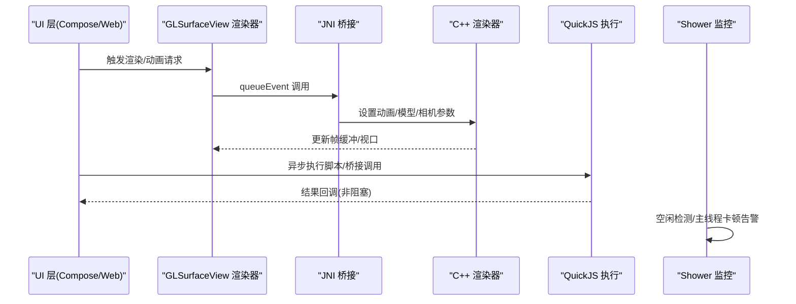
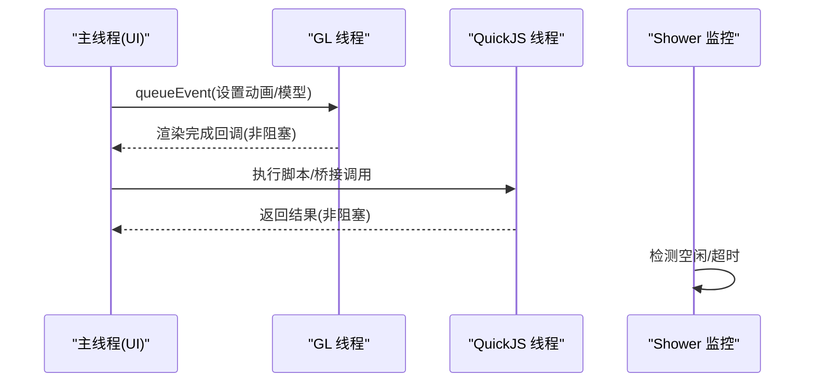
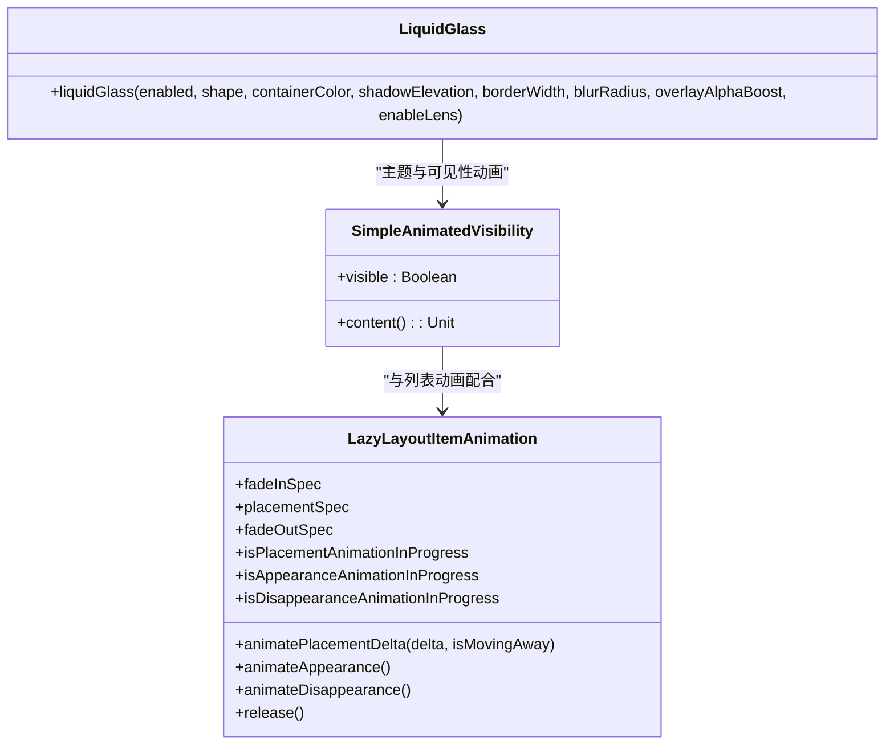
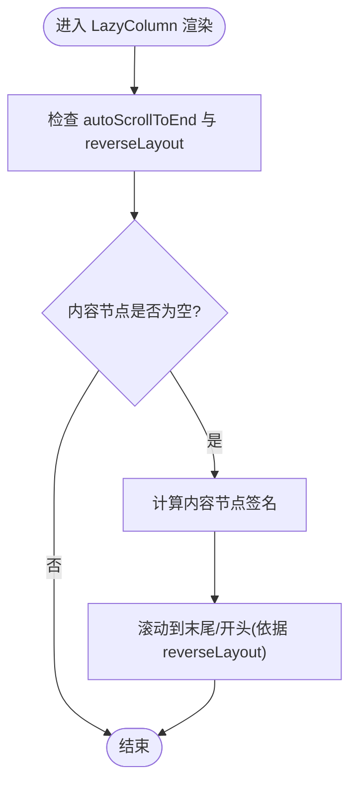
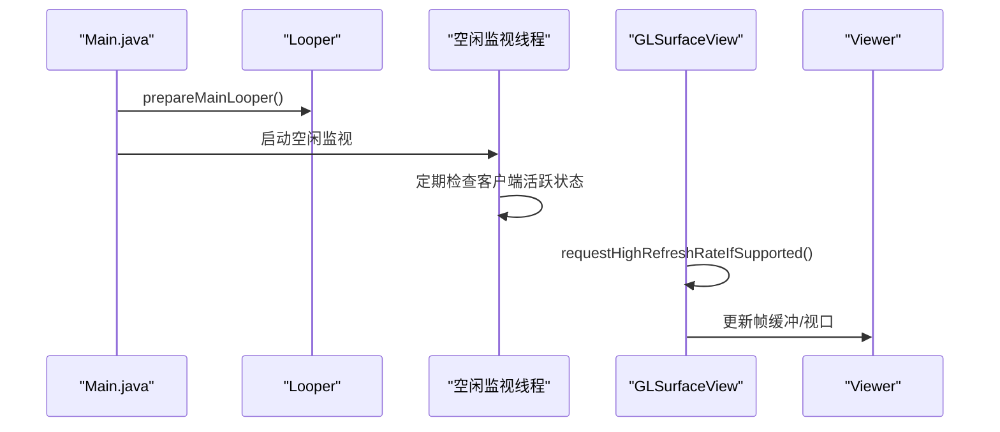
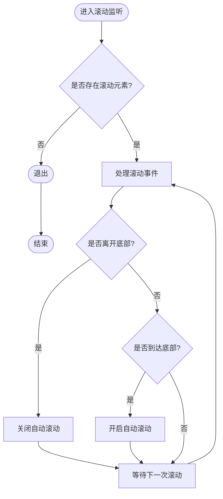
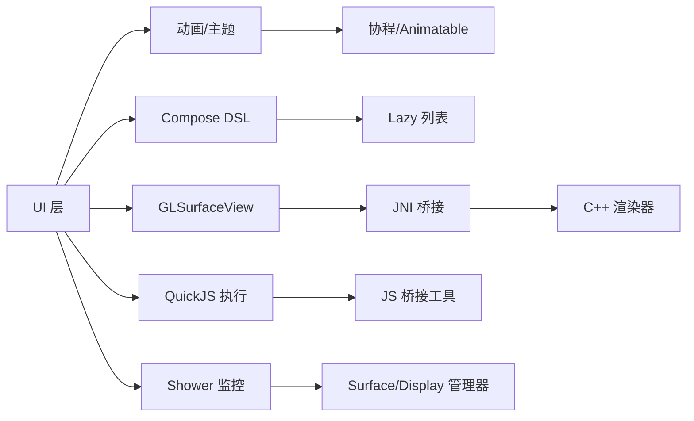

# UI 响应性优化

<cite>
**本文引用的文件**   
- [ui.md](file://docs/package_dev/ui.md)
- [SimpleAnimation.kt](file://app/src/main/java/com/ai/assistance/operit/ui/common/animations/SimpleAnimation.kt)
- [LazyLayoutItemAnimation.kt](file://app/src/main/java/com/ai/assistance/operit/ui/features/chat/components/lazy/LazyLayoutItemAnimation.kt)
- [LiquidGlass.kt](file://app/src/main/java/com/ai/assistance/operit/ui/theme/LiquidGlass.kt)
- [MmdGlSurfaceView.kt](file://mmd/src/main/java/com/ai/assistance/mmd/MmdGlSurfaceView.kt)
- [MmdNative.kt](file://mmd/src/main/java/com/ai/assistance/mmd/MmdNative.kt)
- [MmdRendererBridge.cpp](file://mmd/src/main/cpp/android/MmdRendererBridge.cpp)
- [Viewer.cpp](file://mmd/src/main/cpp/Saba/Viewer/Viewer.cpp)
- [ViewerContext.cpp](file://mmd/src/main/cpp/Saba/Viewer/ViewerContext.cpp)
- [ScrollToBottomButton.tsx](file://web-chat/src/ui/features/chat/components/ScrollToBottomButton.tsx)
- [generate_compose_dsl_artifacts.py](file://tools/compose_dsl/generate_compose_dsl_artifacts.py)
- [quickjs_jni.cpp](file://quickjs/src/main/cpp/quickjs_jni.cpp)
- [bridge_contract/common.js](file://app/src/androidTest/js/com/ai/assistance/operit/core/tools/javascript/bridge_contract/common.js)
- [bridge_edges.js](file://app/src/androidTest/js/com/ai/assistance/operit/core/tools/javascript/bridge_edges/bridge_edges.js)
- [Main.java](file://tools/shower/app/src/main/java/com/ai/assistance/shower/Main.java)
- [SurfaceControl.java](file://tools/shower/app/src/main/java/com/ai/assistance/shower/wrappers/SurfaceControl.java)
- [DisplayManager.java](file://tools/shower/app/src/main/java/com/ai/assistance/shower/wrappers/DisplayManager.java)
</cite>

## 目录
1. [简介](#简介)
2. [项目结构](#项目结构)
3. [核心组件](#核心组件)
4. [架构总览](#架构总览)
5. [详细组件分析](#详细组件分析)
6. [依赖关系分析](#依赖关系分析)
7. [性能考量](#性能考量)
8. [故障排查指南](#故障排查指南)
9. [结论](#结论)
10. [附录](#附录)

## 简介
本指南聚焦于 Operit 的 UI 响应性优化，围绕主线程保护策略（耗时操作异步化、主线程阻塞检测、ANR 监控）、异步处理技术（协程、线程池、任务调度）、动画性能优化（硬件加速、流畅度与帧率控制）、布局优化（视图层级简化、过度绘制减少、绘制性能提升）以及 UI 响应性监控工具（ANR 监控器、性能指标采集、用户体验分析）展开。文档同时提供针对聊天界面滚动、工具包加载、动画效果等具体场景的优化案例，并覆盖低端设备、高刷屏、大屏设备的性能适配建议与最佳实践。

## 项目结构
Operit 的 UI 响应性涉及多层能力：
- Compose 与 Web Chat：负责现代 UI 构建与交互，包含动画、滚动与自动滚动逻辑。
- MMD 渲染：OpenGL 渲染管线，涉及高刷新率适配与渲染帧率控制。
- JavaScript 桥接与运行时：通过 QuickJS 与 Java 线程协作，避免阻塞主线程。
- Shower 工具：用于显示与输入自动化，包含 Looper 主循环准备与空闲检测，便于识别主线程卡顿风险。

```mermaid
graph TB
subgraph "应用层(UI)"
A["Compose 动画<br/>SimpleAnimation.kt"]
B["列表项动画<br/>LazyLayoutItemAnimation.kt"]
C["液体玻璃主题<br/>LiquidGlass.kt"]
D["聊天滚动按钮<br/>ScrollToBottomButton.tsx"]
E["Compose DSL 渲染<br/>generate_compose_dsl_artifacts.py"]
end
subgraph "渲染层"
F["MMD GLSurfaceView<br/>MmdGlSurfaceView.kt"]
G["JNI 桥接<br/>MmdRendererBridge.cpp"]
H["Viewer 渲染器<br/>Viewer.cpp"]
I["Viewer 上下文<br/>ViewerContext.cpp"]
end
subgraph "脚本与桥接"
J["QuickJS JNI 执行<br/>quickjs_jni.cpp"]
K["JS 桥接通用工具<br/>bridge_contract/common.js"]
L["JS 桥接测试用例<br/>bridge_edges.js"]
end
subgraph "系统与监控"
M["Shower 主进程<br/>Main.java"]
N["SurfaceControl 包装<br/>SurfaceControl.java"]
O["DisplayManager 包装<br/>DisplayManager.java"]
end
A --> B
B --> E
C --> A
D --> A
F --> G
G --> H
H --> I
J --> K
K --> L
M --> N
M --> O
```

**图表来源**
- [SimpleAnimation.kt:1-31](file://app/src/main/java/com/ai/assistance/operit/ui/common/animations/SimpleAnimation.kt#L1-L31)
- [LazyLayoutItemAnimation.kt:1-281](file://app/src/main/java/com/ai/assistance/operit/ui/features/chat/components/lazy/LazyLayoutItemAnimation.kt#L1-L281)
- [LiquidGlass.kt:1-128](file://app/src/main/java/com/ai/assistance/operit/ui/theme/LiquidGlass.kt#L1-L128)
- [ScrollToBottomButton.tsx:33-74](file://web-chat/src/ui/features/chat/components/ScrollToBottomButton.tsx#L33-L74)
- [generate_compose_dsl_artifacts.py:961-988](file://tools/compose_dsl/generate_compose_dsl_artifacts.py#L961-L988)
- [MmdGlSurfaceView.kt:43-149](file://mmd/src/main/java/com/ai/assistance/mmd/MmdGlSurfaceView.kt#L43-L149)
- [MmdRendererBridge.cpp:260-299](file://mmd/src/main/cpp/android/MmdRendererBridge.cpp#L260-L299)
- [Viewer.cpp:291-302](file://mmd/src/main/cpp/Saba/Viewer/Viewer.cpp#L291-L302)
- [ViewerContext.cpp:100-133](file://mmd/src/main/cpp/Saba/Viewer/ViewerContext.cpp#L100-L133)
- [quickjs_jni.cpp:333-565](file://quickjs/src/main/cpp/quickjs_jni.cpp#L333-L565)
- [bridge_contract/common.js:1-40](file://app/src/androidTest/js/com/ai/assistance/operit/core/tools/javascript/bridge_contract/common.js#L1-L40)
- [bridge_edges.js:504-528](file://app/src/androidTest/js/com/ai/assistance/operit/core/tools/javascript/bridge_edges/bridge_edges.js#L504-L528)
- [Main.java:366-397](file://tools/shower/app/src/main/java/com/ai/assistance/shower/Main.java#L366-L397)
- [SurfaceControl.java:1-45](file://tools/shower/app/src/main/java/com/ai/assistance/shower/wrappers/SurfaceControl.java#L1-L45)
- [DisplayManager.java:88-121](file://tools/shower/app/src/main/java/com/ai/assistance/shower/wrappers/DisplayManager.java#L88-L121)

**章节来源**
- [ui.md:1-203](file://docs/package_dev/ui.md#L1-L203)
- [MmdGlSurfaceView.kt:103-123](file://mmd/src/main/java/com/ai/assistance/mmd/MmdGlSurfaceView.kt#L103-L123)

## 核心组件
- Compose 动画与主题
  - 简单可见性动画：通过 alpha 动画替代复杂动画，降低兼容性问题与主线程压力。
  - 列表项动画：基于 Animatable 的出现/消失/位移动画，支持插值与中断恢复。
  - 液体玻璃主题：在支持的系统版本上启用 Backdrop 效果，提供视觉与性能平衡。
- 渲染与帧率控制
  - MMD GLSurfaceView：通过 queueEvent 将渲染操作切换到 GL 线程，避免阻塞主线程；在支持的设备上调用 setFrameRate 提升刷新率。
  - Viewer/ViewerContext：控制帧时间步长、深度测试与混合，确保渲染稳定。
- 异步执行与桥接
  - QuickJS JNI：串行执行 JS 时加锁，避免并发竞争；提供挂起点与中断能力，防止长时间阻塞。
  - JS 桥接：提供线程与 FutureTask 工具，便于在测试中验证异步行为。
- 监控与空闲检测
  - Shower 主进程：准备主 Looper 并启动空闲监视线程，检测无客户端活动时退出，有助于定位主线程卡顿导致的无响应。

**章节来源**
- [SimpleAnimation.kt:9-31](file://app/src/main/java/com/ai/assistance/operit/ui/common/animations/SimpleAnimation.kt#L9-L31)
- [LazyLayoutItemAnimation.kt:41-241](file://app/src/main/java/com/ai/assistance/operit/ui/features/chat/components/lazy/LazyLayoutItemAnimation.kt#L41-L241)
- [LiquidGlass.kt:31-127](file://app/src/main/java/com/ai/assistance/operit/ui/theme/LiquidGlass.kt#L31-L127)
- [MmdGlSurfaceView.kt:43-123](file://mmd/src/main/java/com/ai/assistance/mmd/MmdGlSurfaceView.kt#L43-L123)
- [Viewer.cpp:291-302](file://mmd/src/main/cpp/Saba/Viewer/Viewer.cpp#L291-L302)
- [ViewerContext.cpp:100-117](file://mmd/src/main/cpp/Saba/Viewer/ViewerContext.cpp#L100-L117)
- [quickjs_jni.cpp:333-479](file://quickjs/src/main/cpp/quickjs_jni.cpp#L333-L479)
- [bridge_contract/common.js:28-40](file://app/src/androidTest/js/com/ai/assistance/operit/core/tools/javascript/bridge_contract/common.js#L28-L40)
- [bridge_edges.js:504-528](file://app/src/androidTest/js/com/ai/assistance/operit/core/tools/javascript/bridge_edges/bridge_edges.js#L504-L528)
- [Main.java:328-363](file://tools/shower/app/src/main/java/com/ai/assistance/shower/Main.java#L328-L363)

## 架构总览
Operit 的 UI 响应性优化贯穿“UI 层 → 渲染层 → 异步执行 → 监控”的链路。主线程仅负责轻量的 UI 事件与状态变更，耗时计算与 I/O 放入后台线程或异步任务；渲染与动画在独立线程中进行；通过桥接与监控工具对潜在阻塞进行检测与告警。

**图表来源**
- [MmdGlSurfaceView.kt:43-123](file://mmd/src/main/java/com/ai/assistance/mmd/MmdGlSurfaceView.kt#L43-L123)
- [MmdRendererBridge.cpp:260-299](file://mmd/src/main/cpp/android/MmdRendererBridge.cpp#L260-L299)
- [Viewer.cpp:291-302](file://mmd/src/main/cpp/Saba/Viewer/Viewer.cpp#L291-L302)
- [quickjs_jni.cpp:333-479](file://quickjs/src/main/cpp/quickjs_jni.cpp#L333-L479)
- [Main.java:328-363](file://tools/shower/app/src/main/java/com/ai/assistance/shower/Main.java#L328-L363)

## 详细组件分析

### 组件一：主线程保护与异步处理
- 策略
  - 将渲染与模型/动画设置通过 queueEvent 切换至 GL 线程，避免主线程阻塞。
  - 在 JS 执行路径中使用锁与挂起点，防止长时间占用主线程。
  - 通过 Shower 主进程准备 Looper 并空闲检测，辅助识别主线程卡顿。
- 关键实现
  - GLSurfaceView 渲染器与 setFrameRate 调用。
  - QuickJS JNI 的串行执行与中断能力。
  - Shower 主循环准备与空闲监视线程。

**图表来源**
- [MmdGlSurfaceView.kt:77-123](file://mmd/src/main/java/com/ai/assistance/mmd/MmdGlSurfaceView.kt#L77-L123)
- [quickjs_jni.cpp:333-479](file://quickjs/src/main/cpp/quickjs_jni.cpp#L333-L479)
- [Main.java:366-397](file://tools/shower/app/src/main/java/com/ai/assistance/shower/Main.java#L366-L397)

**章节来源**
- [MmdGlSurfaceView.kt:77-123](file://mmd/src/main/java/com/ai/assistance/mmd/MmdGlSurfaceView.kt#L77-L123)
- [quickjs_jni.cpp:333-479](file://quickjs/src/main/cpp/quickjs_jni.cpp#L333-L479)
- [Main.java:328-363](file://tools/shower/app/src/main/java/com/ai/assistance/shower/Main.java#L328-L363)

### 组件二：动画性能优化
- 策略
  - 使用 alpha 动画替代复杂动画，降低兼容性与性能开销。
  - 列表项动画采用 Animatable，支持插值、中断与恢复，避免重复布局。
  - 在支持的系统版本启用液体玻璃主题，利用系统 Backdrop 加速。
- 关键实现
  - SimpleAnimatedVisibility：基于 alpha 的可见性切换。
  - LazyLayoutItemAnimation：出现/消失/位移三类动画，支持取消与恢复。
  - LiquidGlass：在 TIRAMISU+ 启用 Backdrop，降级到自绘阴影与边框。

**图表来源**
- [SimpleAnimation.kt:14-31](file://app/src/main/java/com/ai/assistance/operit/ui/common/animations/SimpleAnimation.kt#L14-L31)
- [LazyLayoutItemAnimation.kt:41-241](file://app/src/main/java/com/ai/assistance/operit/ui/features/chat/components/lazy/LazyLayoutItemAnimation.kt#L41-L241)
- [LiquidGlass.kt:31-127](file://app/src/main/java/com/ai/assistance/operit/ui/theme/LiquidGlass.kt#L31-L127)

**章节来源**
- [SimpleAnimation.kt:9-31](file://app/src/main/java/com/ai/assistance/operit/ui/common/animations/SimpleAnimation.kt#L9-L31)
- [LazyLayoutItemAnimation.kt:163-213](file://app/src/main/java/com/ai/assistance/operit/ui/features/chat/components/lazy/LazyLayoutItemAnimation.kt#L163-L213)
- [LiquidGlass.kt:27-127](file://app/src/main/java/com/ai/assistance/operit/ui/theme/LiquidGlass.kt#L27-L127)

### 组件三：布局与绘制优化
- 策略
  - Compose DSL 渲染中根据内容节点签名触发 scrollToItem，避免不必要的滚动。
  - 通过液体玻璃主题在支持设备上启用系统加速，减少自绘成本。
- 关键实现
  - Compose DSL LazyColumn 自动滚动逻辑。
  - 液体玻璃主题在不支持时的降级方案。

**图表来源**
- [generate_compose_dsl_artifacts.py:961-988](file://tools/compose_dsl/generate_compose_dsl_artifacts.py#L961-L988)
- [LiquidGlass.kt:46-83](file://app/src/main/java/com/ai/assistance/operit/ui/theme/LiquidGlass.kt#L46-L83)

**章节来源**
- [generate_compose_dsl_artifacts.py:961-988](file://tools/compose_dsl/generate_compose_dsl_artifacts.py#L961-L988)
- [LiquidGlass.kt:46-83](file://app/src/main/java/com/ai/assistance/operit/ui/theme/LiquidGlass.kt#L46-L83)

### 组件四：UI 响应性监控与 ANR 监控
- 策略
  - 通过 Shower 主进程准备主 Looper 并启动空闲监视线程，检测长时间无客户端活动时退出，间接反映主线程卡顿风险。
  - 在渲染层通过 setFrameRate 提升刷新率，结合 Viewer 的帧时间控制，保障流畅度。
- 关键实现
  - 主 Looper 准备与空闲检测线程。
  - GLSurfaceView 的 setFrameRate 调用。
  - Viewer 的帧时间步长裁剪与视口更新。

**图表来源**
- [Main.java:366-397](file://tools/shower/app/src/main/java/com/ai/assistance/shower/Main.java#L366-L397)
- [MmdGlSurfaceView.kt:103-123](file://mmd/src/main/java/com/ai/assistance/mmd/MmdGlSurfaceView.kt#L103-L123)
- [Viewer.cpp:291-302](file://mmd/src/main/cpp/Saba/Viewer/Viewer.cpp#L291-L302)

**章节来源**
- [Main.java:328-363](file://tools/shower/app/src/main/java/com/ai/assistance/shower/Main.java#L328-L363)
- [MmdGlSurfaceView.kt:103-123](file://mmd/src/main/java/com/ai/assistance/mmd/MmdGlSurfaceView.kt#L103-L123)
- [ViewerContext.cpp:100-117](file://mmd/src/main/cpp/Saba/Viewer/ViewerContext.cpp#L100-L117)

### 组件五：Web Chat 滚动与自动滚动
- 策略
  - 通过监听 scrollTop 与底部阈值判断用户交互，动态开启/关闭自动滚动，避免频繁滚动影响体验。
- 关键实现
  - 滚动按钮组件的状态机与阈值判断。

**图表来源**
- [ScrollToBottomButton.tsx:33-74](file://web-chat/src/ui/features/chat/components/ScrollToBottomButton.tsx#L33-L74)

**章节来源**
- [ScrollToBottomButton.tsx:33-74](file://web-chat/src/ui/features/chat/components/ScrollToBottomButton.tsx#L33-L74)

## 依赖关系分析
- UI 层依赖 Compose 动画与主题模块，列表项动画依赖协程与 Animatable。
- 渲染层依赖 JNI 桥接与 C++ 渲染器，受 Viewer/ViewerContext 控制帧率与视口。
- 异步执行依赖 QuickJS JNI 与 JS 桥接工具，保证主线程不被阻塞。
- 监控依赖 Shower 主进程与系统 Surface/Display 管理器。

**图表来源**
- [SimpleAnimation.kt:14-31](file://app/src/main/java/com/ai/assistance/operit/ui/common/animations/SimpleAnimation.kt#L14-L31)
- [LazyLayoutItemAnimation.kt:41-241](file://app/src/main/java/com/ai/assistance/operit/ui/features/chat/components/lazy/LazyLayoutItemAnimation.kt#L41-L241)
- [generate_compose_dsl_artifacts.py:961-988](file://tools/compose_dsl/generate_compose_dsl_artifacts.py#L961-L988)
- [MmdGlSurfaceView.kt:43-123](file://mmd/src/main/java/com/ai/assistance/mmd/MmdGlSurfaceView.kt#L43-L123)
- [MmdRendererBridge.cpp:260-299](file://mmd/src/main/cpp/android/MmdRendererBridge.cpp#L260-L299)
- [Viewer.cpp:291-302](file://mmd/src/main/cpp/Saba/Viewer/Viewer.cpp#L291-L302)
- [quickjs_jni.cpp:333-479](file://quickjs/src/main/cpp/quickjs_jni.cpp#L333-L479)
- [bridge_contract/common.js:28-40](file://app/src/androidTest/js/com/ai/assistance/operit/core/tools/javascript/bridge_contract/common.js#L28-L40)
- [Main.java:366-397](file://tools/shower/app/src/main/java/com/ai/assistance/shower/Main.java#L366-L397)
- [SurfaceControl.java:1-45](file://tools/shower/app/src/main/java/com/ai/assistance/shower/wrappers/SurfaceControl.java#L1-L45)
- [DisplayManager.java:88-121](file://tools/shower/app/src/main/java/com/ai/assistance/shower/wrappers/DisplayManager.java#L88-L121)

**章节来源**
- [MmdGlSurfaceView.kt:43-123](file://mmd/src/main/java/com/ai/assistance/mmd/MmdGlSurfaceView.kt#L43-L123)
- [quickjs_jni.cpp:333-479](file://quickjs/src/main/cpp/quickjs_jni.cpp#L333-L479)
- [Main.java:366-397](file://tools/shower/app/src/main/java/com/ai/assistance/shower/Main.java#L366-L397)

## 性能考量
- 主线程保护
  - 将渲染与模型/动画设置放入 GL 线程；JS 执行串行加锁；避免在主线程执行 I/O 或重型计算。
- 帧率与流畅度
  - 在支持设备上调用 setFrameRate 提升刷新率；Viewer 侧裁剪帧时间步长，避免过快推进动画时间。
- 动画与绘制
  - 使用 alpha 动画与系统 Backdrop；减少过度绘制与复杂阴影；合理使用 Lazy 列表与自动滚动。
- 监控与诊断
  - 通过 Shower 主进程准备 Looper 并空闲检测，定位主线程卡顿；结合日志与异常上报完善 ANR 监控。

[本节为通用指导，无需列出具体文件来源]

## 故障排查指南
- 主线程阻塞/ANR
  - 使用 Shower 的空闲检测线程观察长时间无客户端活动后退出的情况，作为主线程卡顿的信号。
  - 检查是否有在主线程执行的耗时任务，必要时迁移到后台线程或使用异步桥接。
- 渲染卡顿
  - 确认 GLSurfaceView 的 queueEvent 是否正确使用；检查 setFrameRate 调用是否成功。
  - 查看 Viewer 的帧时间步长与视口更新逻辑，避免过大帧推进导致掉帧。
- 动画异常
  - 检查 SimpleAnimatedVisibility 与 LazyLayoutItemAnimation 的状态机，确认动画未被意外中断或重复启动。
  - 在不支持的系统版本上，液体玻璃主题会降级，需关注阴影与边框绘制性能。

**章节来源**
- [Main.java:328-363](file://tools/shower/app/src/main/java/com/ai/assistance/shower/Main.java#L328-L363)
- [MmdGlSurfaceView.kt:103-123](file://mmd/src/main/java/com/ai/assistance/mmd/MmdGlSurfaceView.kt#L103-L123)
- [ViewerContext.cpp:100-117](file://mmd/src/main/cpp/Saba/Viewer/ViewerContext.cpp#L100-L117)
- [SimpleAnimation.kt:14-31](file://app/src/main/java/com/ai/assistance/operit/ui/common/animations/SimpleAnimation.kt#L14-L31)
- [LazyLayoutItemAnimation.kt:163-213](file://app/src/main/java/com/ai/assistance/operit/ui/features/chat/components/lazy/LazyLayoutItemAnimation.kt#L163-L213)
- [LiquidGlass.kt:46-83](file://app/src/main/java/com/ai/assistance/operit/ui/theme/LiquidGlass.kt#L46-L83)

## 结论
Operit 的 UI 响应性优化以“主线程保护 + 异步执行 + 渲染与动画优化 + 监控诊断”为核心路径。通过将渲染与动画置于独立线程、使用系统加速与合理的帧率控制、在 Compose 中采用轻量动画与自动滚动策略，并结合 Shower 的空闲检测与 Looper 准备，能够有效降低 ANR 风险并提升整体流畅度。针对不同设备的性能适配建议如下：
- 低端设备：减少复杂动画与过度绘制，优先使用 alpha 动画与系统 Backdrop；降低刷新率或关闭高阶特效。
- 高刷屏：在支持设备上调用 setFrameRate 提升刷新率；确保渲染帧时间步长合理。
- 大屏设备：优化列表自动滚动策略，避免频繁滚动；合理使用液体玻璃主题，兼顾视觉与性能。

[本节为总结性内容，无需列出具体文件来源]

## 附录
- UI 能力接口参考：可通过 Tools.UI 与 UINode 进行页面读取与元素交互，便于自动化与测试场景下的性能验证。

**章节来源**
- [ui.md:17-196](file://docs/package_dev/ui.md#L17-L196)