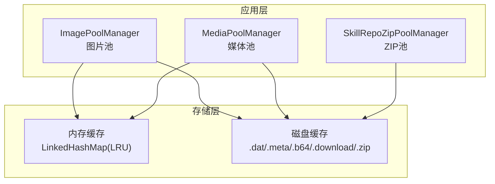
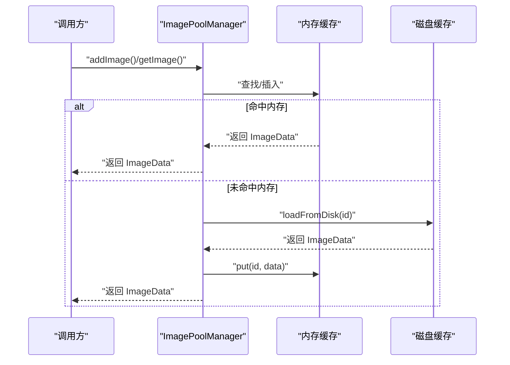
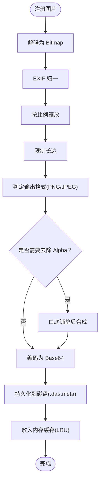
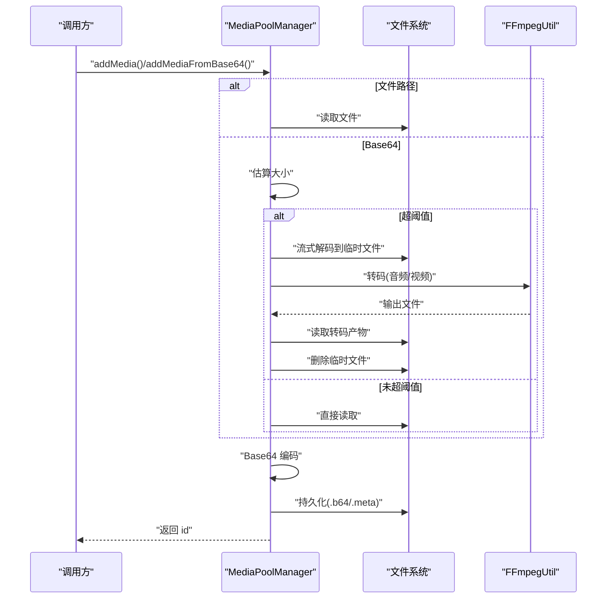
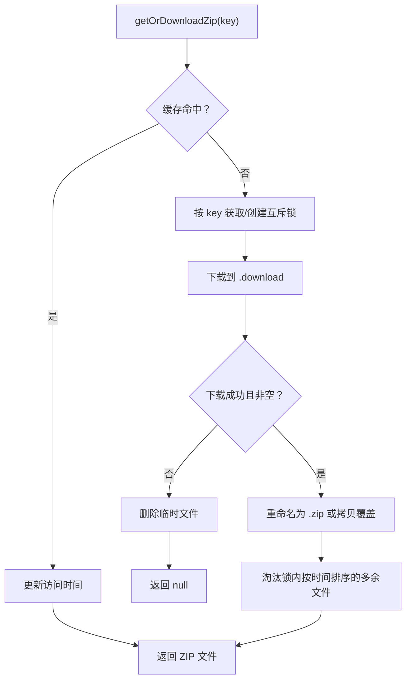
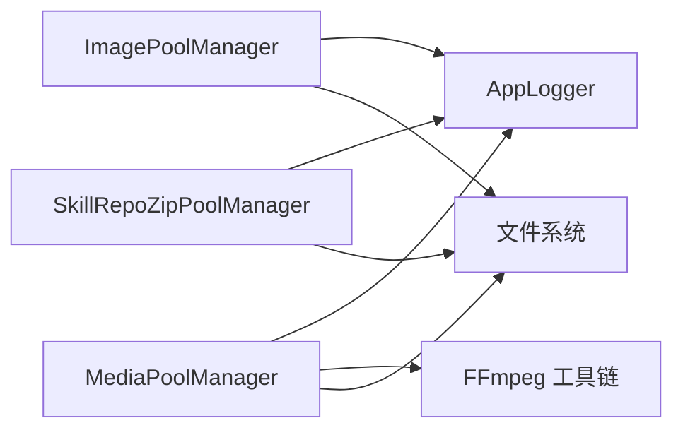

# 内存管理优化

<cite>
**本文引用的文件**
- [ImagePoolManager.kt](file://app/src/main/java/com/ai/assistance/operit/util/ImagePoolManager.kt)
- [MediaPoolManager.kt](file://app/src/main/java/com/ai/assistance/operit/util/MediaPoolManager.kt)
- [SkillRepoZipPoolManager.kt](file://app/src/main/java/com/ai/assistance/operit/util/SkillRepoZipPoolManager.kt)
- [AppLogger.kt](file://app/src/main/java/com/ai/assistance/operit/util/AppLogger.kt)
- [memory.md](file://docs/package_dev/memory.md)
- [extended_memory_tools.js](file://examples/extended_memory_tools.js)
- [memory_scoring_sim.py](file://tools/memory/memory_scoring_sim.py)
- [Operit 记忆管理系统设计思想与详细流程分析.md](file://my_docs/Operit 记忆管理系统设计思想与详细流程分析.md)
</cite>

## 目录
1. [简介](#简介)
2. [项目结构](#项目结构)
3. [核心组件](#核心组件)
4. [架构总览](#架构总览)
5. [详细组件分析](#详细组件分析)
6. [依赖分析](#依赖分析)
7. [性能考量](#性能考量)
8. [故障排查指南](#故障排查指南)
9. [结论](#结论)
10. [附录](#附录)

## 简介
本指南聚焦 Operit 的内存管理优化，围绕对象生命周期管理、对象池复用、内存泄漏预防、垃圾回收优化、不同场景下的内存策略，以及内存监控与分析方法展开。文档以 ImagePoolManager、MediaPoolManager、SkillRepoZipPoolManager 为核心，系统讲解其内存复用机制与最佳实践，并结合日志与工具链提供可落地的监控与诊断手段。

## 项目结构
Operit 的内存优化主要分布在以下模块：
- 图片内存池：ImagePoolManager（内存 + 磁盘双缓存，LRU 淘汰）
- 媒体内存池：MediaPoolManager（Base64 缓存，按大小限制与转码）
- 技能仓库 ZIP 缓存池：SkillRepoZipPoolManager（基于 SHA-256 的键控缓存，带并发互斥与容量淘汰）

图表来源
- [ImagePoolManager.kt:1-693](file://app/src/main/java/com/ai/assistance/operit/util/ImagePoolManager.kt#L1-L693)
- [MediaPoolManager.kt:1-375](file://app/src/main/java/com/ai/assistance/operit/util/MediaPoolManager.kt#L1-L375)
- [SkillRepoZipPoolManager.kt:1-130](file://app/src/main/java/com/ai/assistance/operit/util/SkillRepoZipPoolManager.kt#L1-L130)

章节来源
- [ImagePoolManager.kt:1-693](file://app/src/main/java/com/ai/assistance/operit/util/ImagePoolManager.kt#L1-L693)
- [MediaPoolManager.kt:1-375](file://app/src/main/java/com/ai/assistance/operit/util/MediaPoolManager.kt#L1-L375)
- [SkillRepoZipPoolManager.kt:1-130](file://app/src/main/java/com/ai/assistance/operit/util/SkillRepoZipPoolManager.kt#L1-L130)

## 核心组件
- 图片池（ImagePoolManager）
  - 统一解码、方向归一、缩放、长边限制、格式判定与转换、透明度处理、Base64 编码与元信息持久化
  - LRU 内存缓存 + 磁盘持久化，支持最大池容量控制与预加载
- 媒体池（MediaPoolManager）
  - 对超大媒体进行转码以满足阈值限制，Base64 流式解码与磁盘临时文件配合
  - LRU 内存缓存 + 磁盘持久化，支持最大输入字节限制
- ZIP 池（SkillRepoZipPoolManager）
  - 基于 key 的 SHA-256 截断前缀命名，互斥锁保证并发安全，按最后访问时间淘汰

章节来源
- [ImagePoolManager.kt:37-693](file://app/src/main/java/com/ai/assistance/operit/util/ImagePoolManager.kt#L37-L693)
- [MediaPoolManager.kt:11-375](file://app/src/main/java/com/ai/assistance/operit/util/MediaPoolManager.kt#L11-L375)
- [SkillRepoZipPoolManager.kt:9-130](file://app/src/main/java/com/ai/assistance/operit/util/SkillRepoZipPoolManager.kt#L9-L130)

## 架构总览
三类池均采用“内存 + 磁盘”的混合策略，通过 LRU 或容量控制实现内存压力下的降载；同时提供预加载与懒加载能力，降低首帧延迟与抖动。

图表来源
- [ImagePoolManager.kt:122-246](file://app/src/main/java/com/ai/assistance/operit/util/ImagePoolManager.kt#L122-L246)
- [ImagePoolManager.kt:624-647](file://app/src/main/java/com/ai/assistance/operit/util/ImagePoolManager.kt#L624-L647)

## 详细组件分析

### 图片池（ImagePoolManager）
- 生命周期与复用
  - 注册阶段：统一解码、EXIF 归一、缩放、长边限制、格式判定、透明度处理、编码为 Base64 并持久化元信息
  - 使用阶段：LRU 内存缓存优先，缺失则从磁盘加载并回填内存
  - 清理阶段：池满触发 LRU 淘汰并删除对应磁盘文件
- 关键参数
  - 默认缩放百分比、JPEG 质量、最大长边、池容量
  - 输出格式 AUTO 时根据是否有 Alpha 自动选择 PNG/JPEG
- 性能要点
  - Bitmap.Config 与 inPreferredConfig 设置，避免不必要的像素格式开销
  - 长边限制与缩放减少内存峰值
  - 透明度处理时新建位图并绘制，注意及时回收工作位图
- 内存泄漏预防
  - 所有工作位图在 finally 中回收
  - EXIF 旋转与缩放产生的中间位图及时回收
  - Base64 编码后释放中间字节数组

图表来源
- [ImagePoolManager.kt:248-358](file://app/src/main/java/com/ai/assistance/operit/util/ImagePoolManager.kt#L248-L358)
- [ImagePoolManager.kt:601-647](file://app/src/main/java/com/ai/assistance/operit/util/ImagePoolManager.kt#L601-L647)

章节来源
- [ImagePoolManager.kt:37-693](file://app/src/main/java/com/ai/assistance/operit/util/ImagePoolManager.kt#L37-L693)

### 媒体池（MediaPoolManager）
- 生命周期与复用
  - 接收文件路径或 Base64，估算大小，必要时转码至阈值以内
  - 将媒体编码为 Base64 存入内存缓存，并持久化到磁盘（.b64 + .meta）
  - LRU 淘汰时删除对应磁盘文件
- 关键参数
  - 最大输入字节阈值（默认 20MB），超限自动转码
  - Base64 流式解码，避免一次性加载大文件到内存
- 性能要点
  - 转码命令链路（音频/视频）在限定时间内尝试多种参数组合
  - 估算与实际大小不一致时，以实际为准，避免误判
- 内存泄漏预防
  - 转码产物与临时文件在使用后删除
  - Base64 解码失败或读取失败时清理临时文件

图表来源
- [MediaPoolManager.kt:166-300](file://app/src/main/java/com/ai/assistance/operit/util/MediaPoolManager.kt#L166-L300)
- [MediaPoolManager.kt:338-357](file://app/src/main/java/com/ai/assistance/operit/util/MediaPoolManager.kt#L338-L357)

章节来源
- [MediaPoolManager.kt:11-375](file://app/src/main/java/com/ai/assistance/operit/util/MediaPoolManager.kt#L11-L375)

### ZIP 池（SkillRepoZipPoolManager）
- 生命周期与复用
  - 以 key 的 SHA-256 前 16 字节命名，避免长文件名与冲突
  - 并发下载时按 key 加锁，避免重复下载
  - 按最后访问时间淘汰超出容量的缓存文件
- 性能要点
  - 互斥锁与淘汰锁分离，降低竞争
  - 命中缓存时仅更新访问时间，不复制文件
- 内存泄漏预防
  - 下载失败或空文件时清理临时文件
  - 重命名失败时回退到拷贝并删除临时文件

图表来源
- [SkillRepoZipPoolManager.kt:67-128](file://app/src/main/java/com/ai/assistance/operit/util/SkillRepoZipPoolManager.kt#L67-L128)

章节来源
- [SkillRepoZipPoolManager.kt:9-130](file://app/src/main/java/com/ai/assistance/operit/util/SkillRepoZipPoolManager.kt#L9-L130)

## 依赖分析
- 组件耦合
  - 三类池均依赖 AppLogger 进行日志记录，便于追踪缓存命中、淘汰与异常
  - 媒体池依赖 FFmpeg 工具链进行转码（外部集成）
- 外部依赖与集成点
  - FFmpeg 工具链（媒体池）
  - 磁盘文件系统（三类池）
  - 日志系统（AppLogger）

图表来源
- [ImagePoolManager.kt:37-693](file://app/src/main/java/com/ai/assistance/operit/util/ImagePoolManager.kt#L37-L693)
- [MediaPoolManager.kt:11-375](file://app/src/main/java/com/ai/assistance/operit/util/MediaPoolManager.kt#L11-L375)
- [SkillRepoZipPoolManager.kt:9-130](file://app/src/main/java/com/ai/assistance/operit/util/SkillRepoZipPoolManager.kt#L9-L130)
- [AppLogger.kt:1-376](file://app/src/main/java/com/ai/assistance/operit/util/AppLogger.kt#L1-L376)

章节来源
- [AppLogger.kt:1-376](file://app/src/main/java/com/ai/assistance/operit/util/AppLogger.kt#L1-L376)

## 性能考量
- 内存分配模式
  - 图片池：统一 ARGB_8888 配置，避免重复转换；长边限制与缩放降低像素占用
  - 媒体池：Base64 编码与磁盘持久化，避免大对象常驻内存
  - ZIP 池：键控命名与互斥锁，降低并发冲突
- GC 压力控制
  - LRU 淘汰与容量上限，防止缓存无限增长
  - 及时回收中间位图与临时文件
- 大对象处理
  - 媒体池对超大文件进行转码，严格控制阈值
  - ZIP 池通过分段下载与重命名/拷贝策略，避免长时间持有大文件句柄

## 故障排查指南
- 常见问题与定位
  - 图片池：解码失败、EXIF 读取异常、MIME 类型不一致
  - 媒体池：Base64 估算失败、转码失败、读取失败
  - ZIP 池：下载失败、重命名失败、淘汰失败
- 日志与监控
  - 使用 AppLogger 记录关键事件（命中、淘汰、异常），便于定位问题
  - 结合内存监控工具观察内存曲线与 GC 行为
- 诊断建议
  - 图片池：检查输入路径与 MIME、确认 EXIF 是否损坏、验证缩放与长边限制参数
  - 媒体池：检查转码命令、输入大小、磁盘空间与权限
  - ZIP 池：检查网络连通性、磁盘权限、互斥锁状态

章节来源
- [AppLogger.kt:1-376](file://app/src/main/java/com/ai/assistance/operit/util/AppLogger.kt#L1-L376)
- [ImagePoolManager.kt:37-693](file://app/src/main/java/com/ai/assistance/operit/util/ImagePoolManager.kt#L37-L693)
- [MediaPoolManager.kt:11-375](file://app/src/main/java/com/ai/assistance/operit/util/MediaPoolManager.kt#L11-L375)
- [SkillRepoZipPoolManager.kt:9-130](file://app/src/main/java/com/ai/assistance/operit/util/SkillRepoZipPoolManager.kt#L9-L130)

## 结论
通过“内存 + 磁盘”的混合缓存与严格的容量控制，Operit 的三类池在图片、媒体与 ZIP 场景下实现了稳定的内存占用与良好的性能表现。结合日志与工具链，可以持续监控与优化内存行为，确保在复杂业务场景下的稳定性与可维护性。

## 附录

### 内存监控与分析方法
- 内存使用统计
  - 使用 AppLogger 记录缓存命中率、淘汰次数与异常事件
  - 结合系统内存监控工具观察堆外与堆内变化
- 泄漏检测工具
  - 使用 Android Studio Profiler 或 Heap Viewer 检查 Bitmap 与大对象残留
  - 检查磁盘缓存目录大小与文件数量，确认未被清理的临时文件
- 性能基准测试
  - 使用 memory_scoring_sim.py 对记忆候选评分进行仿真，评估阈值与权重对性能的影响
  - 通过 extended_memory_tools.js 的工具接口进行端到端回归测试

章节来源
- [memory.md:1-234](file://docs/package_dev/memory.md#L1-L234)
- [extended_memory_tools.js:118-235](file://examples/extended_memory_tools.js#L118-L235)
- [memory_scoring_sim.py:1-800](file://tools/memory/memory_scoring_sim.py#L1-L800)

### 最佳实践清单
- 图片池
  - 控制缩放与长边，避免过度放大
  - 使用 AUTO 格式时关注 Alpha 通道，必要时强制 PNG
  - 及时回收中间位图，避免内存碎片
- 媒体池
  - 严格设置阈值，超限自动转码
  - Base64 流式解码，避免 OOM
  - 转码失败时清理临时文件
- ZIP 池
  - 并发下载加锁，避免重复下载
  - 淘汰策略按最后访问时间，保持热点命中
- 通用
  - 使用 AppLogger 记录关键路径
  - 定期巡检磁盘缓存，清理无效文件
  - 在高负载场景下调小池容量，降低 GC 压力