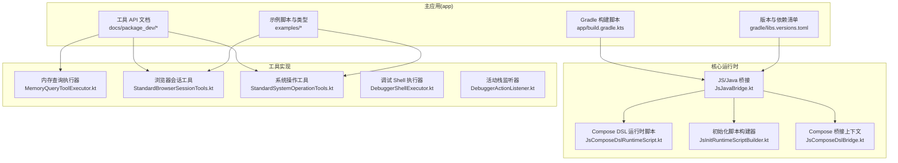
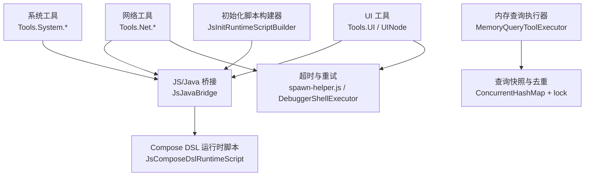
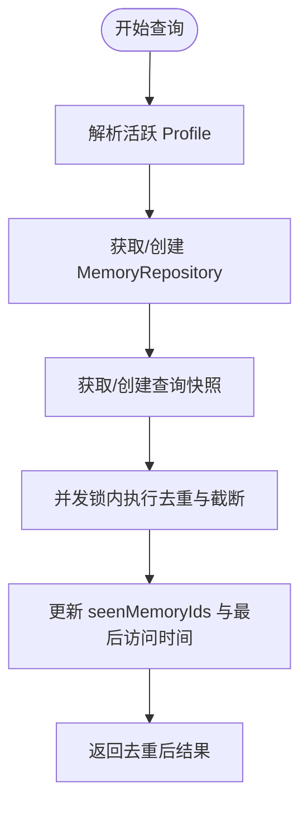
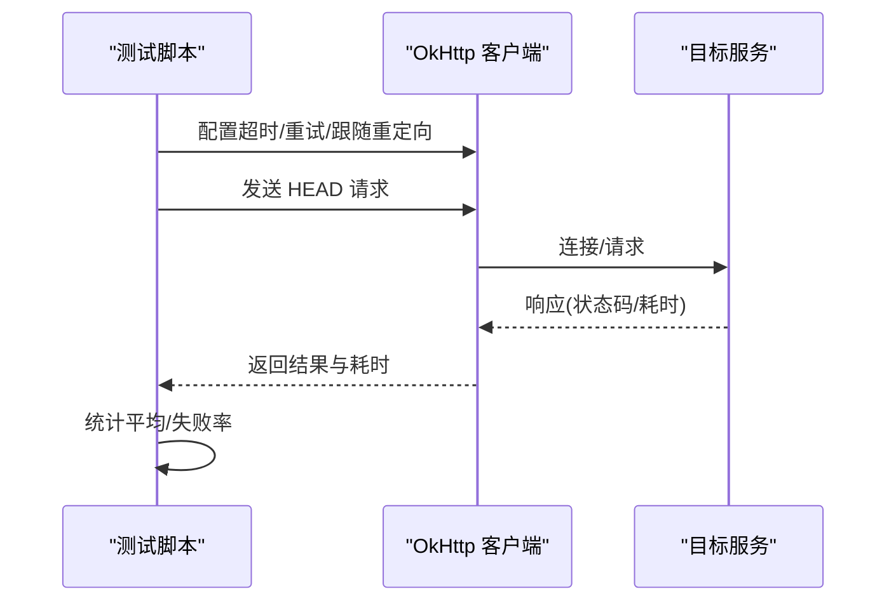
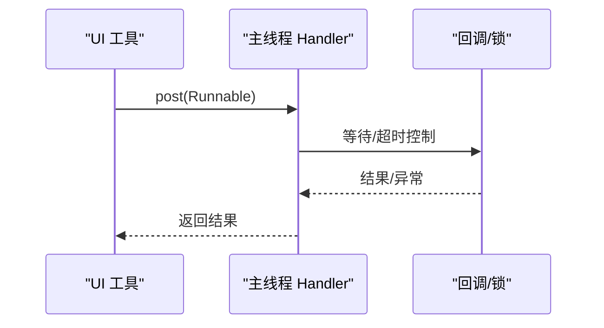
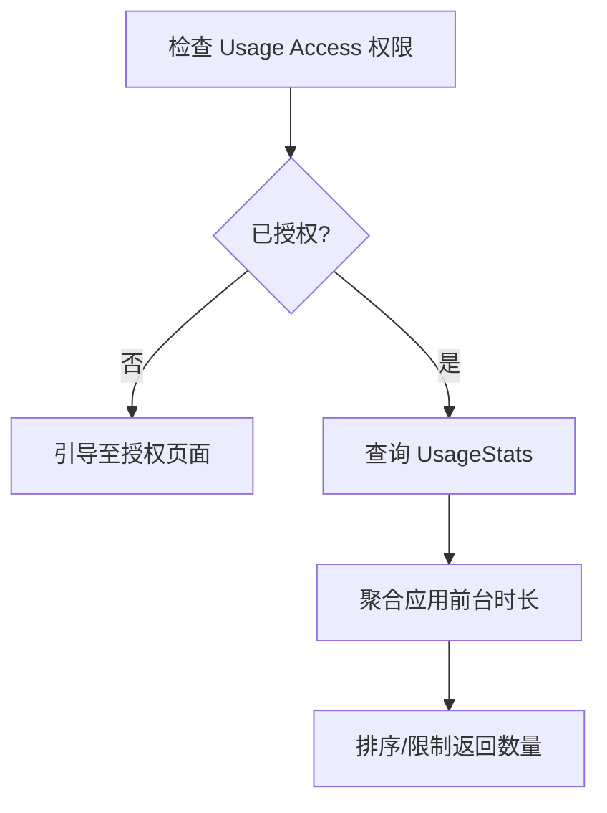
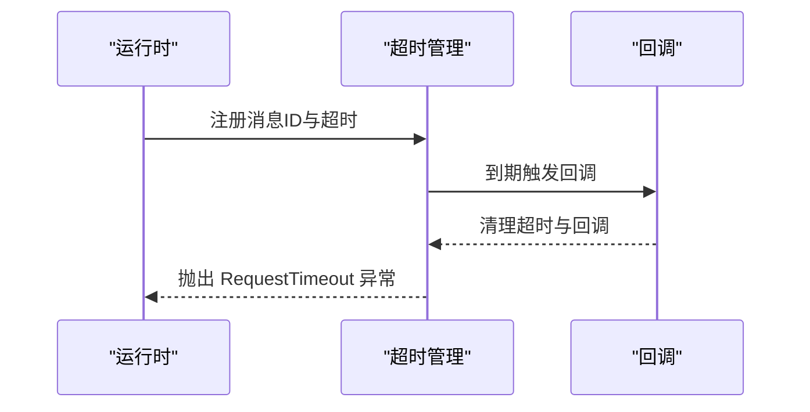

# 性能优化

<cite>
**本文引用的文件**
- [app/build.gradle.kts](file://app/build.gradle.kts)
- [gradle/libs.versions.toml](file://gradle/libs.versions.toml)
- [docs/package_dev/memory.md](file://docs/package_dev/memory.md)
- [docs/package_dev/network.md](file://docs/package_dev/network.md)
- [docs/package_dev/ui.md](file://docs/package_dev/ui.md)
- [docs/package_dev/system.md](file://docs/package_dev/system.md)
- [examples/network_test.ts](file://examples/network_test.ts)
- [examples/network_test.js](file://examples/network_test.js)
- [examples/types/results.d.ts](file://examples/types/results.d.ts)
- [app/src/main/java/com/ai/assistance/operit/core/tools/defaultTool/standard/MemoryQueryToolExecutor.kt](file://app/src/main/java/com/ai/assistance/operit/core/tools/defaultTool/standard/MemoryQueryToolExecutor.kt)
- [app/src/main/java/com/ai/assistance/operit/core/tools/defaultTool/standard/StandardBrowserSessionTools.kt](file://app/src/main/java/com/ai/assistance/operit/core/tools/defaultTool/standard/StandardBrowserSessionTools.kt)
- [app/src/main/java/com/ai/assistance/operit/core/tools/defaultTool/standard/StandardSystemOperationTools.kt](file://app/src/main/java/com/ai/assistance/operit/core/tools/defaultTool/standard/StandardSystemOperationTools.kt)
- [app/src/main/java/com/ai/assistance/operit/core/tools/system/shell/DebuggerShellExecutor.kt](file://app/src/main/java/com/ai/assistance/operit/core/tools/system/shell/DebuggerShellExecutor.kt)
- [app/src/main/java/com/ai/assistance/operit/core/tools/javascript/JsComposeDslRuntimeScript.kt](file://app/src/main/java/com/ai/assistance/operit/core/tools/javascript/JsComposeDslRuntimeScript.kt)
- [app/src/main/java/com/ai/assistance/operit/core/tools/javascript/JsJavaBridge.kt](file://app/src/main/java/com/ai/assistance/operit/core/tools/javascript/JsJavaBridge.kt)
- [app/src/main/java/com/ai/assistance/operit/core/tools/javascript/JsInitRuntimeScriptBuilder.kt](file://app/src/main/java/com/ai/assistance/operit/core/tools/javascript/JsInitRuntimeScriptBuilder.kt)
- [app/src/main/java/com/ai/assistance/operit/core/tools/javascript/JsComposeDslBridge.kt](file://app/src/main/java/com/ai/assistance/operit/core/tools/javascript/JsComposeDslBridge.kt)
- [app/src/main/java/com/ai/assistance/operit/core/tools/system/action/DebuggerActionListener.kt](file://app/src/main/java/com/ai/assistance/operit/core/tools/system/action/DebuggerActionListener.kt)
- [app/src/main/java/com/ai/assistance/operit/core/tools/ToolResultDataClasses.kt](file://app/src/main/java/com/ai/assistance/operit/core/tools/ToolResultDataClasses.kt)
- [app/src/main/assets/bridge/spawn-helper.js](file://app/src/main/assets/bridge/spawn-helper.js)
</cite>

## 目录
1. [引言](#引言)
2. [项目结构](#项目结构)
3. [核心组件](#核心组件)
4. [架构总览](#架构总览)
5. [详细组件分析](#详细组件分析)
6. [依赖分析](#依赖分析)
7. [性能考虑](#性能考虑)
8. [故障排查指南](#故障排查指南)
9. [结论](#结论)
10. [附录](#附录)

## 引言
本指南面向 Operit AI 的开发者，系统性地梳理并提出性能优化策略，覆盖内存管理、网络优化、UI 响应性、电池优化、性能监控与验证方法。文档以仓库现有实现为依据，结合 API 文档与源码片段路径，给出可落地的优化建议与最佳实践。

## 项目结构
Operit AI 采用模块化工程组织，主模块 app 包含 Android 应用、Compose UI、脚本桥接与工具集；docs 提供工具 API 文档；examples 展示网络测试脚本与类型定义；各子模块（如 llama、mnn、dragonbones、mmd、fbx、quickjs、showerclient）承载推理、渲染与桥接能力。

**图示来源**
- [app/build.gradle.kts:1-445](file://app/build.gradle.kts#L1-L445)
- [gradle/libs.versions.toml:1-271](file://gradle/libs.versions.toml#L1-L271)
- [docs/package_dev/memory.md:1-234](file://docs/package_dev/memory.md#L1-L234)
- [docs/package_dev/network.md:1-224](file://docs/package_dev/network.md#L1-L224)
- [docs/package_dev/system.md:1-237](file://docs/package_dev/system.md#L1-L237)
- [examples/network_test.ts:171-214](file://examples/network_test.ts#L171-L214)
- [examples/network_test.js:458-559](file://examples/network_test.js#L458-L559)
- [app/src/main/java/com/ai/assistance/operit/core/tools/javascript/JsJavaBridge.kt:431-643](file://app/src/main/java/com/ai/assistance/operit/core/tools/javascript/JsJavaBridge.kt#L431-L643)
- [app/src/main/java/com/ai/assistance/operit/core/tools/javascript/JsComposeDslRuntimeScript.kt:217-243](file://app/src/main/java/com/ai/assistance/operit/core/tools/javascript/JsComposeDslRuntimeScript.kt#L217-L243)
- [app/src/main/java/com/ai/assistance/operit/core/tools/javascript/JsInitRuntimeScriptBuilder.kt:1-35](file://app/src/main/java/com/ai/assistance/operit/core/tools/javascript/JsInitRuntimeScriptBuilder.kt#L1-L35)
- [app/src/main/java/com/ai/assistance/operit/core/tools/javascript/JsComposeDslBridge.kt:179-205](file://app/src/main/java/com/ai/assistance/operit/core/tools/javascript/JsComposeDslBridge.kt#L179-L205)
- [app/src/main/java/com/ai/assistance/operit/core/tools/defaultTool/standard/MemoryQueryToolExecutor.kt:31-292](file://app/src/main/java/com/ai/assistance/operit/core/tools/defaultTool/standard/MemoryQueryToolExecutor.kt#L31-L292)
- [app/src/main/java/com/ai/assistance/operit/core/tools/defaultTool/standard/StandardBrowserSessionTools.kt:1716-1769](file://app/src/main/java/com/ai/assistance/operit/core/tools/defaultTool/standard/StandardBrowserSessionTools.kt#L1716-L1769)
- [app/src/main/java/com/ai/assistance/operit/core/tools/defaultTool/standard/StandardSystemOperationTools.kt:669-790](file://app/src/main/java/com/ai/assistance/operit/core/tools/defaultTool/standard/StandardSystemOperationTools.kt#L669-L790)
- [app/src/main/java/com/ai/assistance/operit/core/tools/system/shell/DebuggerShellExecutor.kt:164-191](file://app/src/main/java/com/ai/assistance/operit/core/tools/system/shell/DebuggerShellExecutor.kt#L164-L191)
- [app/src/main/java/com/ai/assistance/operit/core/tools/system/action/DebuggerActionListener.kt:200-221](file://app/src/main/java/com/ai/assistance/operit/core/tools/system/action/DebuggerActionListener.kt#L200-L221)

**章节来源**
- [app/build.gradle.kts:1-445](file://app/build.gradle.kts#L1-L445)
- [gradle/libs.versions.toml:1-271](file://gradle/libs.versions.toml#L1-L271)

## 核心组件
- 内存与检索：通过内存查询执行器维护查询快照与去重集合，避免重复检索与缓存污染，提升检索吞吐与稳定性。
- 网络与会话：提供 HTTP 与浏览器会话 API，支持超时、重试、跟随重定向与 Cookie 管理，便于在工具链中进行网络优化。
- UI 自动化与响应：提供 UINode 与 UI 动作 API，支持主线程同步执行与超时控制，保障 UI 操作的稳定性与可预期性。
- 系统与设备：提供设备信息、应用使用时长统计、通知与位置、Shell/Intent/Broadcast、终端会话等能力，支撑电池与资源使用策略制定。
- JS/Java 桥接与 Compose：通过桥接层与初始化脚本构建器，确保跨语言调用的安全与可控，配合 Compose DSL 运行时脚本实现中间态渲染与状态变更批处理。

**章节来源**
- [docs/package_dev/memory.md:1-234](file://docs/package_dev/memory.md#L1-L234)
- [docs/package_dev/network.md:1-224](file://docs/package_dev/network.md#L1-L224)
- [docs/package_dev/ui.md:1-203](file://docs/package_dev/ui.md#L1-L203)
- [docs/package_dev/system.md:1-237](file://docs/package_dev/system.md#L1-L237)
- [app/src/main/java/com/ai/assistance/operit/core/tools/defaultTool/standard/MemoryQueryToolExecutor.kt:31-292](file://app/src/main/java/com/ai/assistance/operit/core/tools/defaultTool/standard/MemoryQueryToolExecutor.kt#L31-L292)
- [app/src/main/java/com/ai/assistance/operit/core/tools/defaultTool/standard/StandardBrowserSessionTools.kt:1716-1769](file://app/src/main/java/com/ai/assistance/operit/core/tools/defaultTool/standard/StandardBrowserSessionTools.kt#L1716-L1769)
- [app/src/main/java/com/ai/assistance/operit/core/tools/defaultTool/standard/StandardSystemOperationTools.kt:669-790](file://app/src/main/java/com/ai/assistance/operit/core/tools/defaultTool/standard/StandardSystemOperationTools.kt#L669-L790)
- [app/src/main/java/com/ai/assistance/operit/core/tools/javascript/JsJavaBridge.kt:431-643](file://app/src/main/java/com/ai/assistance/operit/core/tools/javascript/JsJavaBridge.kt#L431-L643)
- [app/src/main/java/com/ai/assistance/operit/core/tools/javascript/JsComposeDslRuntimeScript.kt:217-243](file://app/src/main/java/com/ai/assistance/operit/core/tools/javascript/JsComposeDslRuntimeScript.kt#L217-L243)
- [app/src/main/java/com/ai/assistance/operit/core/tools/javascript/JsInitRuntimeScriptBuilder.kt:106-121](file://app/src/main/java/com/ai/assistance/operit/core/tools/javascript/JsInitRuntimeScriptBuilder.kt#L106-L121)

## 架构总览
下图展示性能相关关键路径：网络请求与浏览器会话、JS/Java 桥接、UI 主线程同步、内存检索与快照去重、系统使用统计与活动栈监控。

**图示来源**
- [docs/package_dev/network.md:1-224](file://docs/package_dev/network.md#L1-L224)
- [docs/package_dev/ui.md:1-203](file://docs/package_dev/ui.md#L1-L203)
- [docs/package_dev/system.md:1-237](file://docs/package_dev/system.md#L1-L237)
- [app/src/main/java/com/ai/assistance/operit/core/tools/defaultTool/standard/MemoryQueryToolExecutor.kt:31-292](file://app/src/main/java/com/ai/assistance/operit/core/tools/defaultTool/standard/MemoryQueryToolExecutor.kt#L31-L292)
- [app/src/main/java/com/ai/assistance/operit/core/tools/javascript/JsJavaBridge.kt:431-643](file://app/src/main/java/com/ai/assistance/operit/core/tools/javascript/JsJavaBridge.kt#L431-L643)
- [app/src/main/java/com/ai/assistance/operit/core/tools/javascript/JsComposeDslRuntimeScript.kt:217-243](file://app/src/main/java/com/ai/assistance/operit/core/tools/javascript/JsComposeDslRuntimeScript.kt#L217-L243)
- [app/src/main/java/com/ai/assistance/operit/core/tools/javascript/JsInitRuntimeScriptBuilder.kt:106-121](file://app/src/main/java/com/ai/assistance/operit/core/tools/javascript/JsInitRuntimeScriptBuilder.kt#L106-L121)
- [app/src/main/assets/bridge/spawn-helper.js:21928-21962](file://app/src/main/assets/bridge/spawn-helper.js#L21928-L21962)
- [app/src/main/java/com/ai/assistance/operit/core/tools/system/shell/DebuggerShellExecutor.kt:164-191](file://app/src/main/java/com/ai/assistance/operit/core/tools/system/shell/DebuggerShellExecutor.kt#L164-L191)

## 详细组件分析

### 内存管理与检索优化
- 快照与去重：通过查询快照状态与并发安全集合，实现跨调用的稳定去重，避免重复检索与缓存污染。
- 限制与清理：限制每个 Profile 的快照数量，防止快照膨胀导致内存压力。
- 结果截断：当 limit 较大时采用截断模式，平衡结果质量与性能。

**图示来源**
- [app/src/main/java/com/ai/assistance/operit/core/tools/defaultTool/standard/MemoryQueryToolExecutor.kt:31-292](file://app/src/main/java/com/ai/assistance/operit/core/tools/defaultTool/standard/MemoryQueryToolExecutor.kt#L31-L292)

**章节来源**
- [docs/package_dev/memory.md:24-50](file://docs/package_dev/memory.md#L24-L50)
- [app/src/main/java/com/ai/assistance/operit/core/tools/defaultTool/standard/MemoryQueryToolExecutor.kt:31-292](file://app/src/main/java/com/ai/assistance/operit/core/tools/defaultTool/standard/MemoryQueryToolExecutor.kt#L31-L292)

### 网络优化技术
- 客户端配置：统一配置连接、读取、写入超时，支持跟随重定向与连接失败重试。
- 请求测试：通过 HEAD 请求与计时统计评估网络连通性与延迟分布。
- 会话与 Cookie：持久浏览器会话与 Cookie 管理减少握手成本，提升连续请求效率。
- 错误重试：针对特定中断异常进行有限重试，避免瞬时网络波动影响任务成功率。

**图示来源**
- [examples/network_test.ts:171-214](file://examples/network_test.ts#L171-L214)
- [examples/network_test.js:458-559](file://examples/network_test.js#L458-L559)
- [docs/package_dev/network.md:21-51](file://docs/package_dev/network.md#L21-L51)

**章节来源**
- [docs/package_dev/network.md:1-224](file://docs/package_dev/network.md#L1-L224)
- [examples/network_test.ts:171-214](file://examples/network_test.ts#L171-L214)
- [examples/network_test.js:458-559](file://examples/network_test.js#L458-L559)

### UI 响应性优化
- 主线程保护：提供主线程同步执行与超时控制，避免阻塞 UI 线程。
- 中间态渲染：Compose DSL 运行时脚本支持中间态队列与状态变更批处理，降低频繁重绘。
- 事件调度：桥接层对挂起调用进行回调注册与释放，确保生命周期内资源回收。

**图示来源**
- [app/src/main/java/com/ai/assistance/operit/core/tools/defaultTool/standard/StandardBrowserSessionTools.kt:1716-1769](file://app/src/main/java/com/ai/assistance/operit/core/tools/defaultTool/standard/StandardBrowserSessionTools.kt#L1716-L1769)
- [app/src/main/java/com/ai/assistance/operit/core/tools/javascript/JsComposeDslRuntimeScript.kt:217-243](file://app/src/main/java/com/ai/assistance/operit/core/tools/javascript/JsComposeDslRuntimeScript.kt#L217-L243)
- [app/src/main/java/com/ai/assistance/operit/core/tools/javascript/JsJavaBridge.kt:431-643](file://app/src/main/java/com/ai/assistance/operit/core/tools/javascript/JsJavaBridge.kt#L431-L643)

**章节来源**
- [docs/package_dev/ui.md:17-157](file://docs/package_dev/ui.md#L17-L157)
- [app/src/main/java/com/ai/assistance/operit/core/tools/defaultTool/standard/StandardBrowserSessionTools.kt:1716-1769](file://app/src/main/java/com/ai/assistance/operit/core/tools/defaultTool/standard/StandardBrowserSessionTools.kt#L1716-L1769)
- [app/src/main/java/com/ai/assistance/operit/core/tools/javascript/JsComposeDslRuntimeScript.kt:217-243](file://app/src/main/java/com/ai/assistance/operit/core/tools/javascript/JsComposeDslRuntimeScript.kt#L217-L243)

### 电池优化策略
- 应用使用时长统计：基于 UsageStats 授权与查询，识别高占用前台应用，辅助制定后台限制策略。
- 活动栈监控：通过 Shell 命令周期性监控 Activity 栈变化，判断前台切换与潜在卡顿风险。
- 终端会话与 Shell：提供显式超时控制，避免长时间阻塞导致电量消耗。

**图示来源**
- [app/src/main/java/com/ai/assistance/operit/core/tools/defaultTool/standard/StandardSystemOperationTools.kt:669-790](file://app/src/main/java/com/ai/assistance/operit/core/tools/defaultTool/standard/StandardSystemOperationTools.kt#L669-L790)
- [app/src/main/java/com/ai/assistance/operit/core/tools/system/action/DebuggerActionListener.kt:200-221](file://app/src/main/java/com/ai/assistance/operit/core/tools/system/action/DebuggerActionListener.kt#L200-L221)
- [docs/package_dev/system.md:54-91](file://docs/package_dev/system.md#L54-L91)

**章节来源**
- [docs/package_dev/system.md:1-237](file://docs/package_dev/system.md#L1-L237)
- [app/src/main/java/com/ai/assistance/operit/core/tools/defaultTool/standard/StandardSystemOperationTools.kt:669-790](file://app/src/main/java/com/ai/assistance/operit/core/tools/defaultTool/standard/StandardSystemOperationTools.kt#L669-L790)
- [app/src/main/java/com/ai/assistance/operit/core/tools/system/action/DebuggerActionListener.kt:200-221](file://app/src/main/java/com/ai/assistance/operit/core/tools/system/action/DebuggerActionListener.kt#L200-L221)

### 性能监控与工具
- ANR 监控：通过超时与最大总时长控制，结合错误码与异常抛出，快速暴露阻塞点。
- 内存使用分析：利用设备信息与应用使用时长结果数据结构，结合日志与统计输出，形成基线。
- 超时与重试：在 JS 桥接侧清理定时器与回调，避免悬挂任务造成资源泄漏。

**图示来源**
- [app/src/main/assets/bridge/spawn-helper.js:21928-21962](file://app/src/main/assets/bridge/spawn-helper.js#L21928-L21962)
- [app/src/main/java/com/ai/assistance/operit/core/tools/javascript/JsInitRuntimeScriptBuilder.kt:106-121](file://app/src/main/java/com/ai/assistance/operit/core/tools/javascript/JsInitRuntimeScriptBuilder.kt#L106-L121)
- [examples/types/results.d.ts:252-316](file://examples/types/results.d.ts#L252-L316)

**章节来源**
- [examples/types/results.d.ts:252-316](file://examples/types/results.d.ts#L252-L316)
- [app/src/main/assets/bridge/spawn-helper.js:21928-21962](file://app/src/main/assets/bridge/spawn-helper.js#L21928-L21962)
- [app/src/main/java/com/ai/assistance/operit/core/tools/javascript/JsInitRuntimeScriptBuilder.kt:106-121](file://app/src/main/java/com/ai/assistance/operit/core/tools/javascript/JsInitRuntimeScriptBuilder.kt#L106-L121)

## 依赖分析
- 构建与打包：Gradle 脚本定义编译 SDK、目标 SDK、ABI 过滤、打包排除与签名配置，nightly 变体用于持续集成。
- 版本与依赖：libs.versions.toml 统一管理 Compose、OkHttp、Room、WorkManager、协程等版本，确保一致性与升级可控。
- 关键依赖：OkHttp、Retrofit、Jsoup、Room、ObjectBox、Compose、协程、WorkManager 等构成网络、存储、UI 与后台任务的基础。

**图示来源**
- [app/build.gradle.kts:1-445](file://app/build.gradle.kts#L1-L445)
- [gradle/libs.versions.toml:1-271](file://gradle/libs.versions.toml#L1-L271)

**章节来源**
- [app/build.gradle.kts:1-445](file://app/build.gradle.kts#L1-L445)
- [gradle/libs.versions.toml:1-271](file://gradle/libs.versions.toml#L1-L271)

## 性能考虑
- 内存管理
  - 控制快照数量上限，定期清理长时间未访问的快照，避免内存膨胀。
  - 在高并发查询场景下，合理拆分查询与分页，避免一次性截断过多导致 GC 压力。
  - 对于大型文档型记忆，结合分块检索与阈值过滤，减少不必要的内容加载。
- 网络优化
  - 统一配置超时与重试策略，针对瞬时失败进行指数退避或抖动重试。
  - 使用持久会话与 Cookie 缓存，减少握手与鉴权开销。
  - 对于长连接场景，启用连接池与 Keep-Alive，降低连接建立成本。
- UI 响应性
  - 严格限制主线程同步执行时间，必要时将耗时操作下沉到后台协程。
  - 合理使用中间态渲染与状态批处理，减少重组频率。
  - 对 UI 动作进行节流与去抖，避免高频点击导致的 UI 卡顿。
- 电池优化
  - 基于应用使用时长统计，识别高耗电应用并限制其后台活动。
  - 对长时间运行的任务设置明确超时与进度重置，避免 CPU 持续占用。
  - 使用 WorkManager 与 AlarmManager 合理安排周期性任务，避免唤醒过于频繁。

[本节为通用指导，无需特定文件来源]

## 故障排查指南
- ANR 与超时
  - 检查超时管理器是否正确清理定时器与回调，避免悬挂任务。
  - 对阻塞操作增加最大总时长限制，及时抛出超时异常以便定位。
- 网络不稳定
  - 使用网络测试脚本进行连通性与延迟评估，识别慢请求与失败点。
  - 针对特定中断异常进行有限重试，避免无限循环。
- UI 卡顿
  - 使用主线程同步执行与超时控制，定位阻塞点。
  - 检查 Compose 状态变更批处理是否生效，减少不必要的重组。
- 电池消耗异常
  - 通过应用使用时长统计与活动栈监控，判断前台切换与潜在卡顿。
  - 对 Shell 命令与终端会话设置超时，避免长时间阻塞。

**章节来源**
- [app/src/main/assets/bridge/spawn-helper.js:21928-21962](file://app/src/main/assets/bridge/spawn-helper.js#L21928-L21962)
- [examples/network_test.ts:171-214](file://examples/network_test.ts#L171-L214)
- [examples/network_test.js:458-559](file://examples/network_test.js#L458-L559)
- [app/src/main/java/com/ai/assistance/operit/core/tools/defaultTool/standard/StandardBrowserSessionTools.kt:1716-1769](file://app/src/main/java/com/ai/assistance/operit/core/tools/defaultTool/standard/StandardBrowserSessionTools.kt#L1716-L1769)
- [app/src/main/java/com/ai/assistance/operit/core/tools/system/shell/DebuggerShellExecutor.kt:164-191](file://app/src/main/java/com/ai/assistance/operit/core/tools/system/shell/DebuggerShellExecutor.kt#L164-L191)
- [app/src/main/java/com/ai/assistance/operit/core/tools/system/action/DebuggerActionListener.kt:200-221](file://app/src/main/java/com/ai/assistance/operit/core/tools/system/action/DebuggerActionListener.kt#L200-L221)

## 结论
Operit AI 的性能优化应围绕“内存可控、网络高效、UI 流畅、电池友好”四大支柱展开。通过查询快照去重、统一网络配置与重试、主线程保护与中间态渲染、应用使用统计与活动栈监控，结合构建与依赖的版本治理，可在保证功能完整性的同时显著提升用户体验与系统稳定性。

[本节为总结，无需特定文件来源]

## 附录
- 优化案例模板
  - 识别瓶颈：通过日志与统计输出定位慢查询、长连接或主线程阻塞。
  - 实施优化：引入快照去重、调整超时与重试、迁移耗时操作到后台协程、启用持久会话。
  - 验证效果：对比前后平均耗时、失败率与电池消耗，确认优化收益。
- 场景化策略
  - 启动优化：预热关键模块、延迟加载非必要资源、合并初始化步骤。
  - 运行时优化：批量处理状态变更、限制 UI 重绘频率、启用连接池与缓存。
  - 内存优化：控制快照数量、分页检索、及时释放无用对象与回调。

[本节为通用指导，无需特定文件来源]