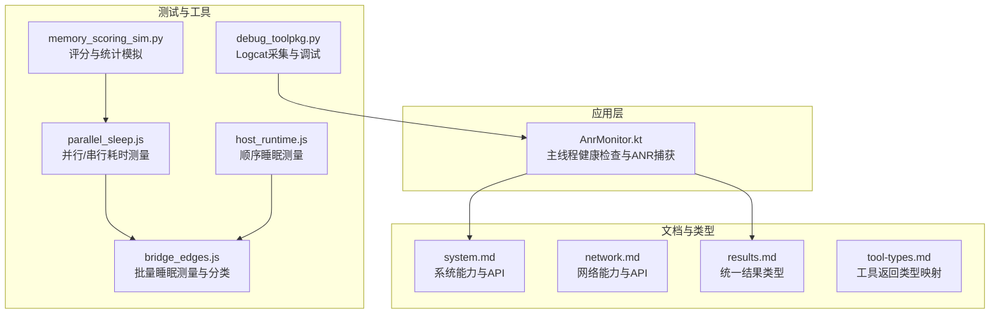
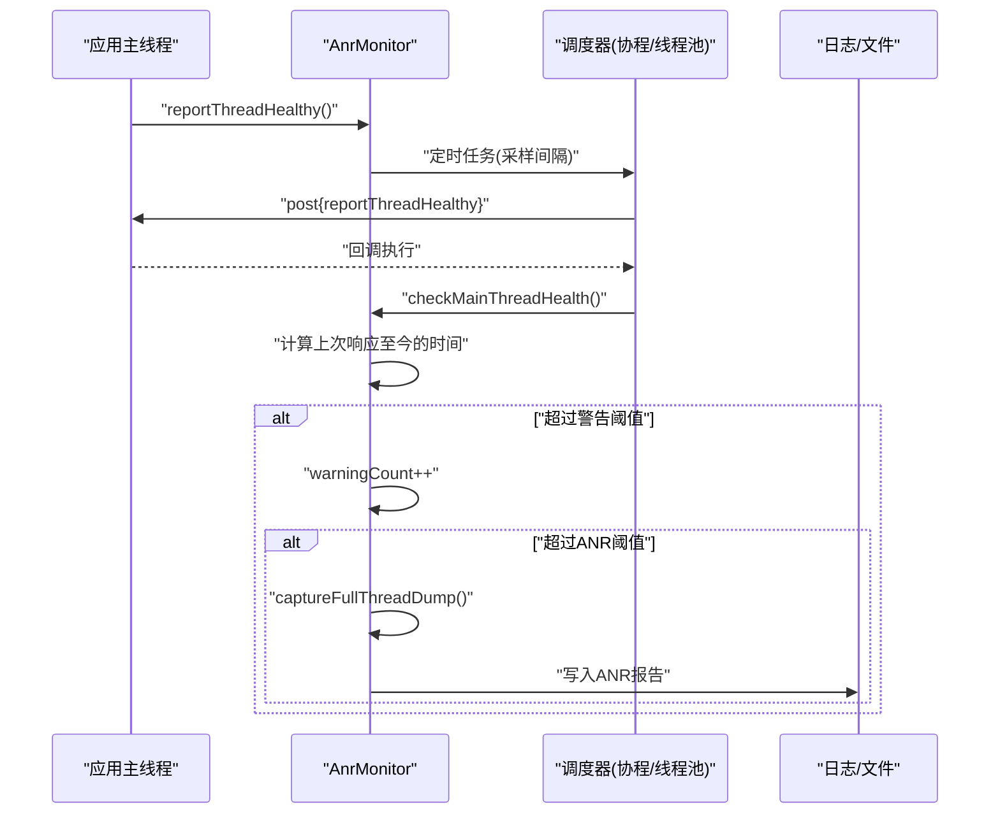
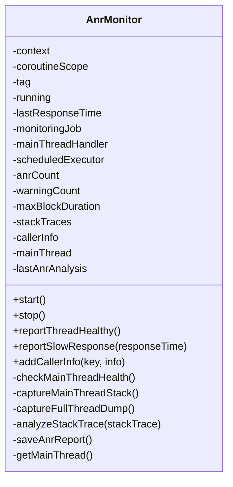
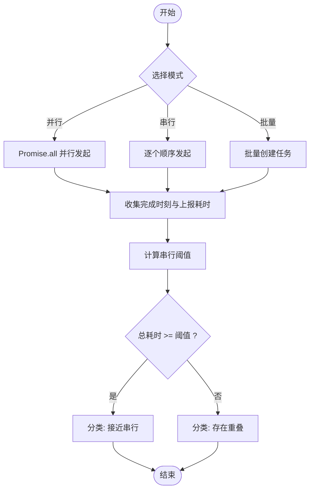
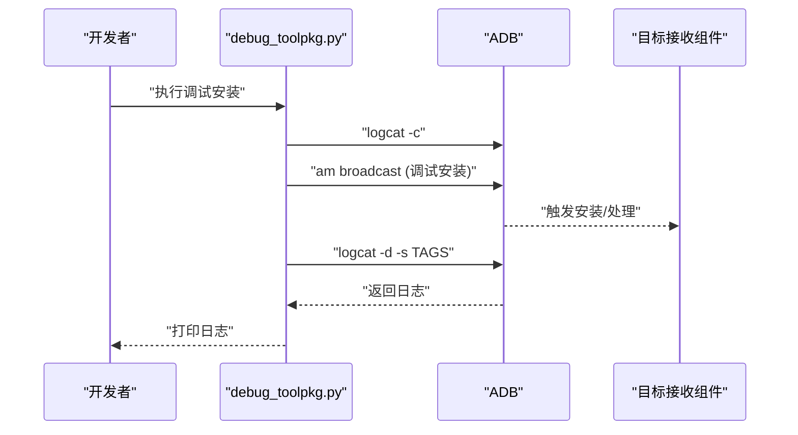
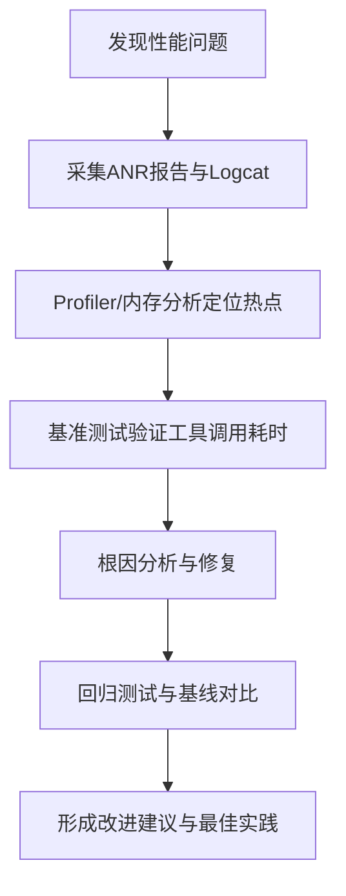
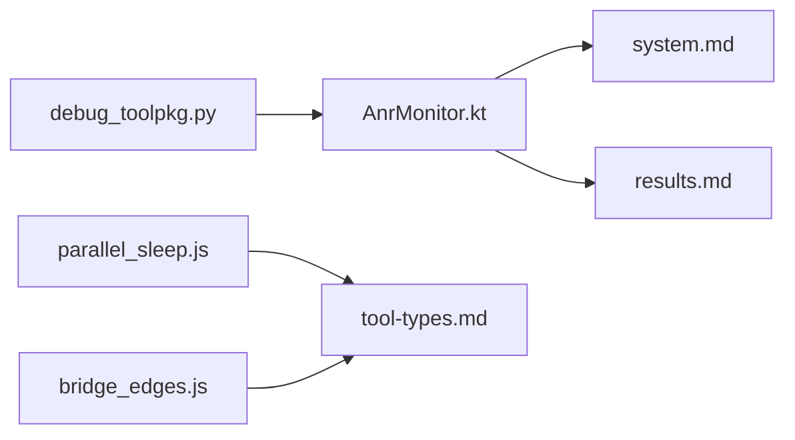

# 性能监控

<cite>
**本文引用的文件**
- [AnrMonitor.kt](file://app/src/main/java/com/ai/assistance/operit/util/AnrMonitor.kt)
- [system.md](file://docs/package_dev/system.md)
- [network.md](file://docs/package_dev/network.md)
- [results.md](file://docs/package_dev/results.md)
- [tool-types.md](file://docs/package_dev/tool-types.md)
- [debug_toolpkg.py](file://tools/debug_toolpkg.py)
- [parallel_sleep.js](file://app/src/androidTest/js/com/ai/assistance/operit/core/tools/javascript/script_mode_contract/parallel_sleep.js)
- [host_runtime.js](file://app/src/androidTest/js/com/ai/assistance/operit/core/tools/javascript/bridge_contract/host_runtime.js)
- [bridge_edges.js](file://app/src/androidTest/js/com/ai/assistance/operit/core/tools/javascript/bridge_edges/bridge_edges.js)
- [memory_scoring_sim.py](file://tools/memory/memory_scoring_sim.py)
</cite>

## 目录
1. [简介](#简介)
2. [项目结构](#项目结构)
3. [核心组件](#核心组件)
4. [架构总览](#架构总览)
5. [详细组件分析](#详细组件分析)
6. [依赖分析](#依赖分析)
7. [性能考量](#性能考量)
8. [故障排查指南](#故障排查指南)
9. [结论](#结论)
10. [附录](#附录)

## 简介
本技术指南围绕 Operit 的性能监控体系展开，重点覆盖 ANR 监控机制与实践、性能指标采集策略（内存、CPU、网络）、性能分析工具链（Logcat、Profiler、内存分析）、性能基准测试方法（启动时间、功能响应时间、资源使用）、问题诊断流程与最佳实践。文档同时提供可落地的监控配置示例与场景化关注点，帮助开发者快速建立性能基线并持续优化。

## 项目结构
Operit 在应用层提供 ANR 监控核心实现，在文档与工具链层面提供系统、网络、结果类型与调试脚本支撑。Android 测试脚本提供了性能基准测试的参考模式（如并行/串行睡眠任务的耗时测量）。

**图表来源**
- [AnrMonitor.kt](file://app/src/main/java/com/ai/assistance/operit/util/AnrMonitor.kt)
- [system.md](file://docs/package_dev/system.md)
- [network.md](file://docs/package_dev/network.md)
- [results.md](file://docs/package_dev/results.md)
- [tool-types.md](file://docs/package_dev/tool-types.md)
- [parallel_sleep.js](file://app/src/androidTest/js/com/ai/assistance/operit/core/tools/javascript/script_mode_contract/parallel_sleep.js)
- [host_runtime.js](file://app/src/androidTest/js/com/ai/assistance/operit/core/tools/javascript/bridge_contract/host_runtime.js)
- [bridge_edges.js](file://app/src/androidTest/js/com/ai/assistance/operit/core/tools/javascript/bridge_edges/bridge_edges.js)
- [debug_toolpkg.py](file://tools/debug_toolpkg.py)
- [memory_scoring_sim.py](file://tools/memory/memory_scoring_sim.py)

**章节来源**
- [AnrMonitor.kt](file://app/src/main/java/com/ai/assistance/operit/util/AnrMonitor.kt)
- [system.md](file://docs/package_dev/system.md)
- [network.md](file://docs/package_dev/network.md)
- [results.md](file://docs/package_dev/results.md)
- [tool-types.md](file://docs/package_dev/tool-types.md)
- [parallel_sleep.js](file://app/src/androidTest/js/com/ai/assistance/operit/core/tools/javascript/script_mode_contract/parallel_sleep.js)
- [host_runtime.js](file://app/src/androidTest/js/com/ai/assistance/operit/core/tools/javascript/bridge_contract/host_runtime.js)
- [bridge_edges.js](file://app/src/androidTest/js/com/ai/assistance/operit/core/tools/javascript/bridge_edges/bridge_edges.js)
- [debug_toolpkg.py](file://tools/debug_toolpkg.py)
- [memory_scoring_sim.py](file://tools/memory/memory_scoring_sim.py)

## 核心组件
- ANR 监控器：基于主线程 Handler 回调周期性探测，阈值触发堆栈转储与报告生成，支持备用线程池监控与调用者信息追踪。
- 性能基准测试脚本：提供并行/串行睡眠任务的耗时测量与结果分类，便于评估工具调用与桥接开销。
- 调试与日志：通过 ADB 广播触发安装并采集 Logcat，聚焦关键标签输出，辅助定位性能问题。
- 统一结果类型与工具类型映射：为网络、系统、UI 等能力提供标准化返回结构，便于性能数据的统一采集与分析。

**章节来源**
- [AnrMonitor.kt](file://app/src/main/java/com/ai/assistance/operit/util/AnrMonitor.kt)
- [parallel_sleep.js](file://app/src/androidTest/js/com/ai/assistance/operit/core/tools/javascript/script_mode_contract/parallel_sleep.js)
- [bridge_edges.js](file://app/src/androidTest/js/com/ai/assistance/operit/core/tools/javascript/bridge_edges/bridge_edges.js)
- [debug_toolpkg.py](file://tools/debug_toolpkg.py)
- [results.md](file://docs/package_dev/results.md)
- [tool-types.md](file://docs/package_dev/tool-types.md)

## 架构总览
下图展示了 ANR 监控在应用中的运行时架构：监控器通过协程或线程池定期轮询主线程健康状态，超过阈值时进行堆栈转储与报告落盘；测试脚本提供性能基准数据；调试脚本负责日志采集。

**图表来源**
- [AnrMonitor.kt](file://app/src/main/java/com/ai/assistance/operit/util/AnrMonitor.kt)

**章节来源**
- [AnrMonitor.kt](file://app/src/main/java/com/ai/assistance/operit/util/AnrMonitor.kt)

## 详细组件分析

### ANR 监控器（AnrMonitor）
- 机制概述
  - 通过主线程 Handler post 触发“已响应”标记，周期性检查上次响应至今的时间差。
  - 超过警告阈值记录慢响应次数与最长阻塞时间；超过 ANR 阈值触发全量线程转储与报告生成。
  - 支持备用线程池监控，避免协程异常导致监控失效。
  - 提供调用者信息添加接口，辅助定位来源。
- 阈值与采样
  - 默认阈值：警告阈值与 ANR 阈值、采样间隔、最大堆栈历史数等均内置。
  - 可通过扩展点调整阈值与采样频率以适配不同机型与场景。
- 堆栈捕获与报告
  - 全量线程转储包含主线程状态与分析摘要，支持去重输出。
  - 报告落盘包含系统信息、内存统计、堆栈历史与调用者信息。
- 关键实现要点
  - 主线程引用获取与回退策略。
  - 堆栈分析仅保留目标包名片段，便于聚焦业务代码。
  - 保存报告时包含时间戳与设备信息，便于归档与对比。

**图表来源**
- [AnrMonitor.kt](file://app/src/main/java/com/ai/assistance/operit/util/AnrMonitor.kt)

**章节来源**
- [AnrMonitor.kt](file://app/src/main/java/com/ai/assistance/operit/util/AnrMonitor.kt)

### 性能基准测试（并行/串行睡眠）
- 目标
  - 评估工具调用与桥接层在并行/串行场景下的耗时特征与重叠程度。
- 方法
  - 并行模式：使用 Promise.all 同时发起多次睡眠任务，统计总耗时与单次耗时。
  - 串行模式：依次发起睡眠任务，记录每次完成时刻。
  - 批量模式：对不同工具调用路径（toolCall 与 Tools.System.sleep）进行对比。
- 结果分类
  - 基于总耗时与串行阈值，将执行形态分为“接近串行/存在重叠”。

**图表来源**
- [parallel_sleep.js](file://app/src/androidTest/js/com/ai/assistance/operit/core/tools/javascript/script_mode_contract/parallel_sleep.js)
- [bridge_edges.js](file://app/src/androidTest/js/com/ai/assistance/operit/core/tools/javascript/bridge_edges/bridge_edges.js)
- [host_runtime.js](file://app/src/androidTest/js/com/ai/assistance/operit/core/tools/javascript/bridge_contract/host_runtime.js)

**章节来源**
- [parallel_sleep.js](file://app/src/androidTest/js/com/ai/assistance/operit/core/tools/javascript/script_mode_contract/parallel_sleep.js)
- [bridge_edges.js](file://app/src/androidTest/js/com/ai/assistance/operit/core/tools/javascript/bridge_edges/bridge_edges.js)
- [host_runtime.js](file://app/src/androidTest/js/com/ai/assistance/operit/core/tools/javascript/bridge_contract/host_runtime.js)

### 调试与日志采集（Logcat）
- 流程
  - 清空设备日志缓冲区。
  - 发送调试安装广播，触发目标接收组件处理。
  - 等待一段时间后，按指定标签抓取日志并输出。
- 适用场景
  - 安装/升级后验证日志链路。
  - 定位 ANR 或崩溃前后关键事件。

**图表来源**
- [debug_toolpkg.py](file://tools/debug_toolpkg.py)

**章节来源**
- [debug_toolpkg.py](file://tools/debug_toolpkg.py)

### 性能指标采集策略
- 内存使用统计
  - 可通过系统 API 获取前台应用使用时长等指标，辅助定位内存压力与后台占用。
  - 运行时可结合内存评分模拟脚本进行统计分析与阈值评估。
- CPU 占用率监控
  - 可结合系统使用时长统计与网络/IO 活动，间接评估 CPU 压力。
- 网络性能测量
  - 使用网络工具集进行 HTTP 请求、网页访问与持久会话控制，记录响应时间、状态码与内容长度等指标。

**章节来源**
- [system.md](file://docs/package_dev/system.md)
- [network.md](file://docs/package_dev/network.md)
- [results.md](file://docs/package_dev/results.md)
- [memory_scoring_sim.py](file://tools/memory/memory_scoring_sim.py)

### 性能分析工具使用
- Logcat 分析
  - 使用调试脚本按标签抓取日志，结合 ANR 报告定位异常时间点。
- 性能 Profiler
  - 利用 Android Studio Profiler 采集 CPU、内存、网络与线程热点，配合 ANR 报告进行根因分析。
- 内存分析工具
  - 使用 Heap 分析与 Allocation Tracker，结合内存评分模拟脚本评估阈值与分布。

**章节来源**
- [debug_toolpkg.py](file://tools/debug_toolpkg.py)
- [AnrMonitor.kt](file://app/src/main/java/com/ai/assistance/operit/util/AnrMonitor.kt)
- [memory_scoring_sim.py](file://tools/memory/memory_scoring_sim.py)

### 性能基准测试方法
- 启动时间测试
  - 通过系统 API 启动目标应用，记录前台切换时间与关键界面渲染完成时间。
- 功能响应时间测试
  - 使用工具调用与桥接层发起多次任务，统计平均/中位/尾延迟与抖动。
- 资源使用测试
  - 采集 CPU/内存/网络指标，结合日志与堆栈转储进行关联分析。

**章节来源**
- [system.md](file://docs/package_dev/system.md)
- [parallel_sleep.js](file://app/src/androidTest/js/com/ai/assistance/operit/core/tools/javascript/script_mode_contract/parallel_sleep.js)
- [bridge_edges.js](file://app/src/androidTest/js/com/ai/assistance/operit/core/tools/javascript/bridge_edges/bridge_edges.js)

### 性能问题诊断流程
- 问题定位
  - 依据 ANR 报告与 Logcat 关键标签，确认异常时间点与调用链。
  - 使用 Profiler 与内存分析工具交叉验证 CPU/内存热点。
- 根因分析
  - 结合堆栈分析与调用者信息，定位业务逻辑瓶颈。
  - 使用性能基准测试脚本验证工具调用路径的耗时特征。
- 解决方案验证
  - 修复后重新运行基准测试与日志采集，确认指标回归基线。

**图表来源**
- [AnrMonitor.kt](file://app/src/main/java/com/ai/assistance/operit/util/AnrMonitor.kt)
- [debug_toolpkg.py](file://tools/debug_toolpkg.py)
- [parallel_sleep.js](file://app/src/androidTest/js/com/ai/assistance/operit/core/tools/javascript/script_mode_contract/parallel_sleep.js)

**章节来源**
- [AnrMonitor.kt](file://app/src/main/java/com/ai/assistance/operit/util/AnrMonitor.kt)
- [debug_toolpkg.py](file://tools/debug_toolpkg.py)
- [parallel_sleep.js](file://app/src/androidTest/js/com/ai/assistance/operit/core/tools/javascript/script_mode_contract/parallel_sleep.js)

### 监控配置示例与基线建立
- 设置 ANR 监控
  - 在应用初始化阶段启动监控器，确保在主线程生命周期内持续运行。
  - 根据机型差异调整采样间隔与阈值，建立不同场景的基线。
- 解读监控数据
  - 关注警告次数、ANR 次数与最长阻塞时间，结合堆栈分析定位包名片段。
  - 保存报告并按时间戳归档，便于趋势分析。
- 建立性能基线
  - 使用性能基准测试脚本在稳定环境下多次运行，统计平均值与分位数。
  - 结合内存评分模拟脚本设定阈值，形成可量化的性能目标。

**章节来源**
- [AnrMonitor.kt](file://app/src/main/java/com/ai/assistance/operit/util/AnrMonitor.kt)
- [parallel_sleep.js](file://app/src/androidTest/js/com/ai/assistance/operit/core/tools/javascript/script_mode_contract/parallel_sleep.js)
- [memory_scoring_sim.py](file://tools/memory/memory_scoring_sim.py)

### 场景化性能监控重点
- 启动优化监控
  - 关注冷启动到首帧时间，结合 ANR 报告与日志定位阻塞点。
- 运行时性能监控
  - 持续采集主线程响应时间、慢响应次数与最长阻塞时间，建立动态阈值。
- 内存泄漏监控
  - 使用内存分析工具与评分模拟脚本，识别异常增长与阈值突破。

**章节来源**
- [AnrMonitor.kt](file://app/src/main/java/com/ai/assistance/operit/util/AnrMonitor.kt)
- [memory_scoring_sim.py](file://tools/memory/memory_scoring_sim.py)

## 依赖分析
- 组件耦合
  - ANR 监控器依赖主线程 Handler 与日志系统；与系统 API 文档、结果类型文档存在契约约束。
  - 性能基准测试脚本依赖工具类型映射与统一结果类型，保证返回结构一致性。
- 外部集成
  - 调试脚本依赖 ADB 与广播机制，用于触发安装与采集日志。
- 潜在循环依赖
  - 当前结构清晰，无明显循环依赖迹象。

**图表来源**
- [AnrMonitor.kt](file://app/src/main/java/com/ai/assistance/operit/util/AnrMonitor.kt)
- [system.md](file://docs/package_dev/system.md)
- [results.md](file://docs/package_dev/results.md)
- [tool-types.md](file://docs/package_dev/tool-types.md)
- [parallel_sleep.js](file://app/src/androidTest/js/com/ai/assistance/operit/core/tools/javascript/script_mode_contract/parallel_sleep.js)
- [bridge_edges.js](file://app/src/androidTest/js/com/ai/assistance/operit/core/tools/javascript/bridge_edges/bridge_edges.js)
- [debug_toolpkg.py](file://tools/debug_toolpkg.py)

**章节来源**
- [AnrMonitor.kt](file://app/src/main/java/com/ai/assistance/operit/util/AnrMonitor.kt)
- [system.md](file://docs/package_dev/system.md)
- [results.md](file://docs/package_dev/results.md)
- [tool-types.md](file://docs/package_dev/tool-types.md)
- [parallel_sleep.js](file://app/src/androidTest/js/com/ai/assistance/operit/core/tools/javascript/script_mode_contract/parallel_sleep.js)
- [bridge_edges.js](file://app/src/androidTest/js/com/ai/assistance/operit/core/tools/javascript/bridge_edges/bridge_edges.js)
- [debug_toolpkg.py](file://tools/debug_toolpkg.py)

## 性能考量
- 采样频率与阈值
  - 采样间隔过短会增加额外开销，过长可能导致错过瞬态阻塞；阈值需结合机型与业务场景调优。
- 堆栈转储成本
  - 全量线程转储会带来 IO 与解析成本，建议在 ANR 触发时才进行，并限制历史数量。
- 基准测试稳定性
  - 多次运行取统计值，避免单次异常影响结论；注意环境一致性与负载隔离。

## 故障排查指南
- ANR 报告缺失
  - 检查监控器是否启动、阈值是否合理、日志权限是否满足。
- 日志采集不完整
  - 确认广播触发成功、等待时间充足、标签过滤正确。
- 基准测试结果异常
  - 核对工具调用路径与参数，确认并行/串行模式与阈值计算逻辑。

**章节来源**
- [AnrMonitor.kt](file://app/src/main/java/com/ai/assistance/operit/util/AnrMonitor.kt)
- [debug_toolpkg.py](file://tools/debug_toolpkg.py)
- [parallel_sleep.js](file://app/src/androidTest/js/com/ai/assistance/operit/core/tools/javascript/script_mode_contract/parallel_sleep.js)

## 结论
通过 ANR 监控器、性能基准测试脚本、调试与日志采集工具以及统一结果类型与工具类型映射，Operit 形成了可落地的性能监控闭环。建议在不同场景下建立差异化阈值与基线，持续迭代优化并沉淀最佳实践。

## 附录
- 相关文档与类型映射
  - 系统能力与 API：参见系统文档。
  - 网络能力与 API：参见网络文档。
  - 统一结果类型：参见结果文档。
  - 工具返回类型映射：参见工具类型文档。

**章节来源**
- [system.md](file://docs/package_dev/system.md)
- [network.md](file://docs/package_dev/network.md)
- [results.md](file://docs/package_dev/results.md)
- [tool-types.md](file://docs/package_dev/tool-types.md)