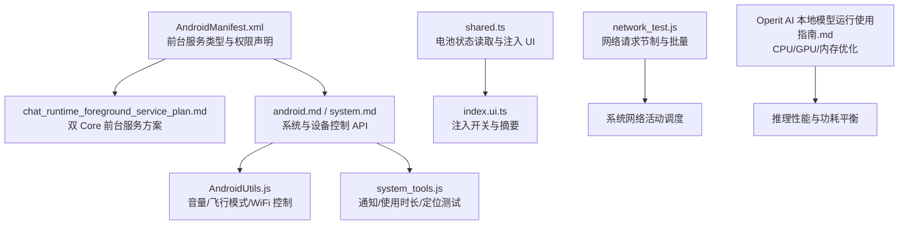
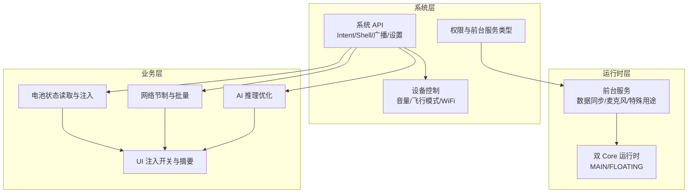
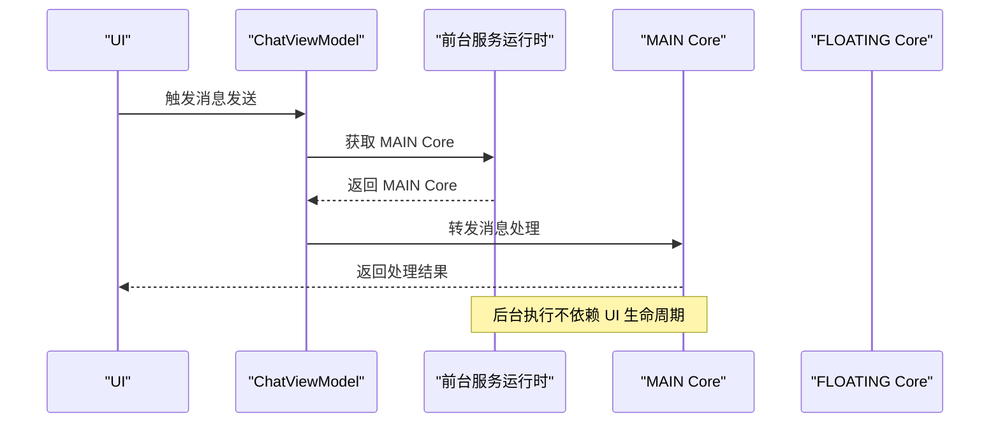
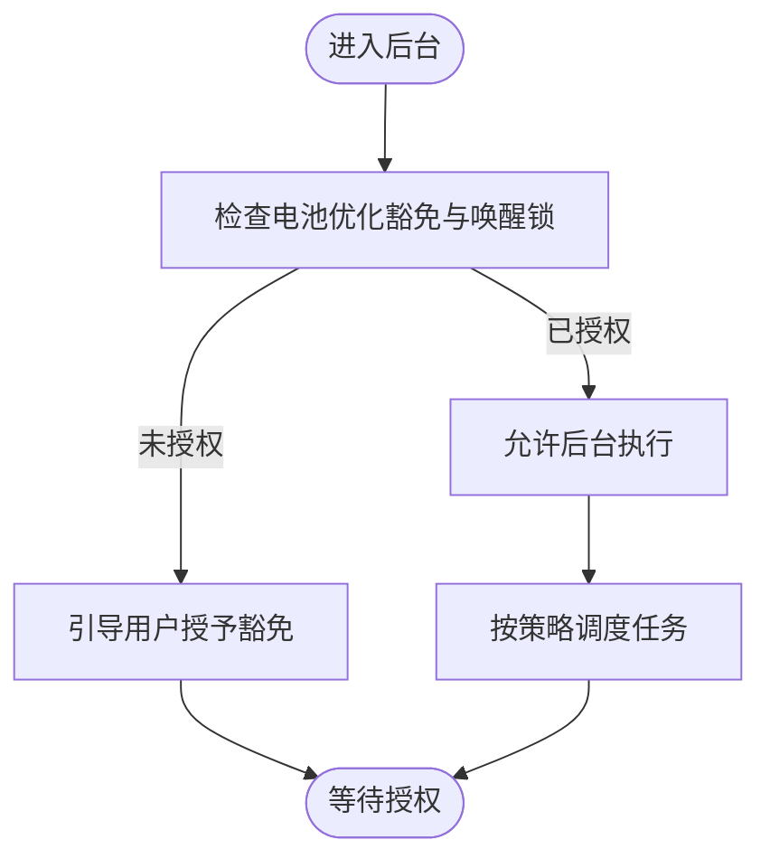
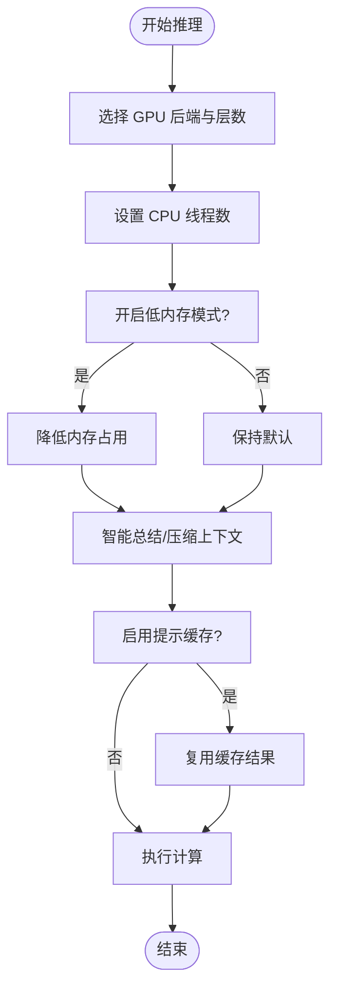
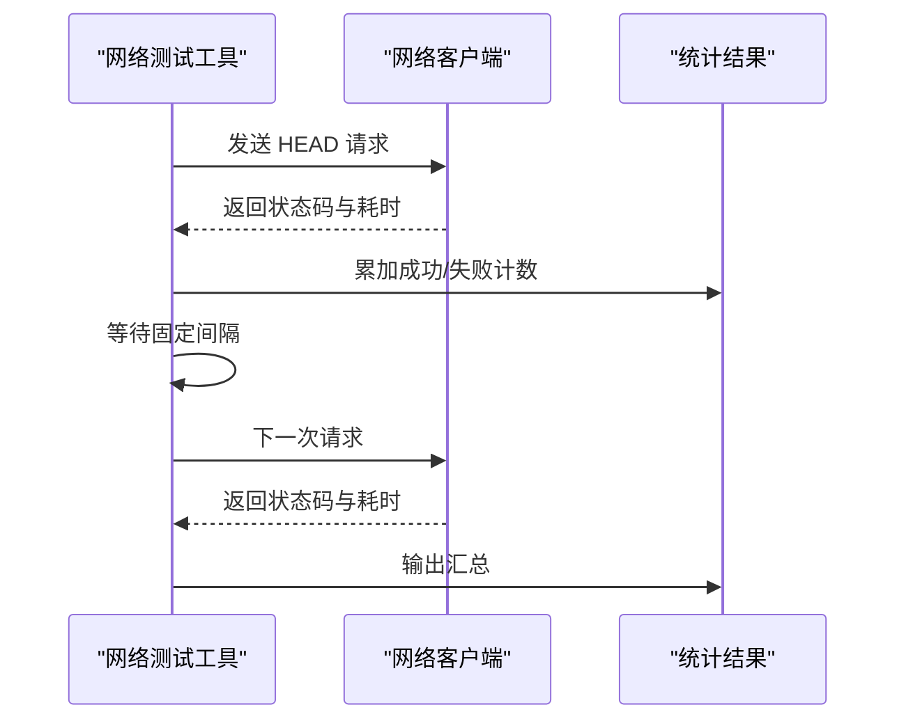
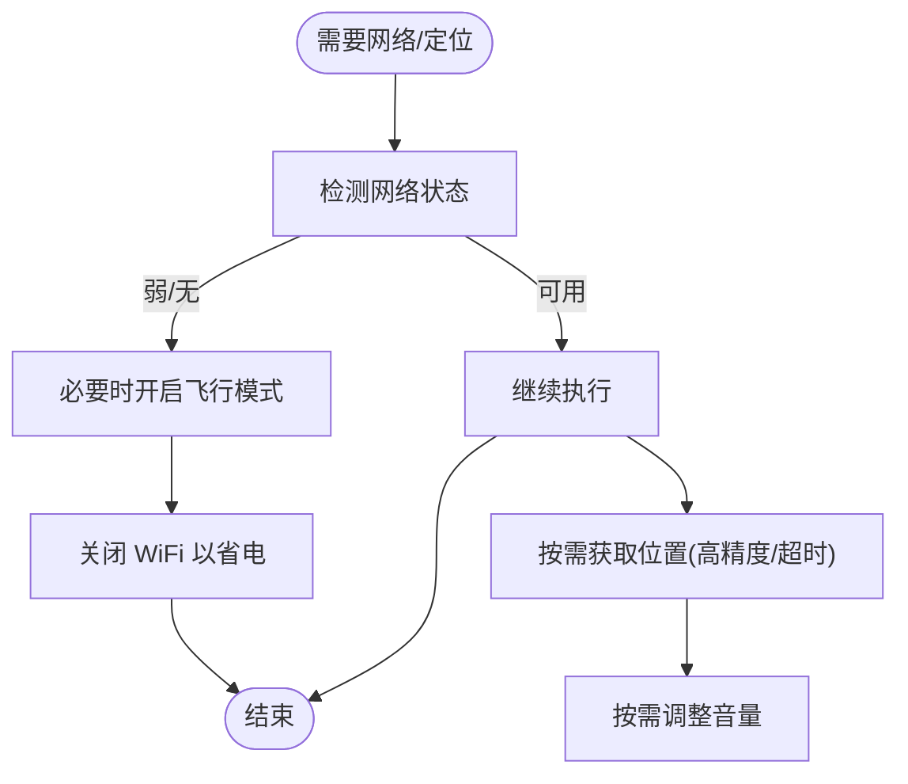
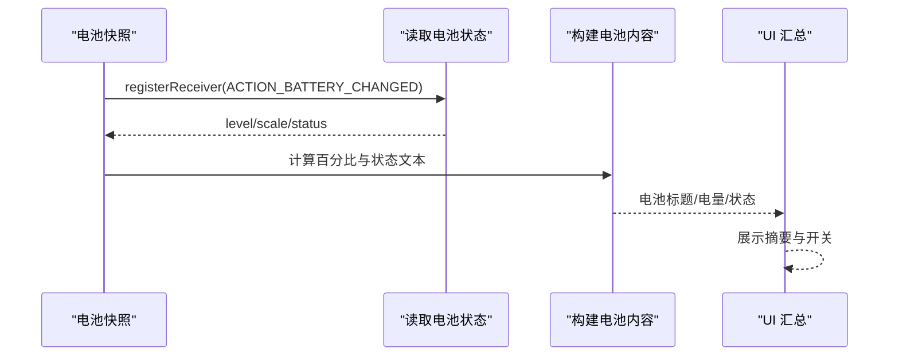
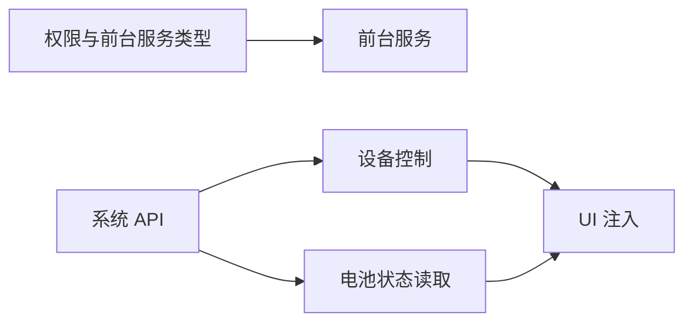

# 电池优化

<cite>
**本文引用的文件**   
- [AndroidManifest.xml](file://app/src/main/AndroidManifest.xml)
- [chat_runtime_foreground_service_plan.md](file://docs/chat_runtime_foreground_service_plan.md)
- [android.md](file://docs/package_dev/android.md)
- [system.md](file://docs/package_dev/system.md)
- [shared.ts](file://examples/message_insert/src/shared.ts)
- [index.ui.ts](file://examples/message_insert/src/ui/index.ui.ts)
- [AndroidUtils.js](file://app/src/main/assets/js/AndroidUtils.js)
- [system_tools.js](file://examples/system_tools.js)
- [Operit AI 本地模型运行使用指南.md](file://my_docs/Operit AI 本地模型运行使用指南.md)
- [network_test.js](file://examples/network_test.js)
</cite>

## 目录
1. [简介](#简介)
2. [项目结构](#项目结构)
3. [核心组件](#核心组件)
4. [架构总览](#架构总览)
5. [详细组件分析](#详细组件分析)
6. [依赖分析](#依赖分析)
7. [性能考量](#性能考量)
8. [故障排查指南](#故障排查指南)
9. [结论](#结论)
10. [附录](#附录)

## 简介
本指南围绕 Operit 的电池优化展开，聚焦后台服务与系统资源的高效使用，涵盖以下主题：
- 后台服务优化：前台服务管理、后台执行限制、服务生命周期优化
- CPU 使用控制：频率与线程调节、计算密集型任务优化、空闲时间利用
- 网络活动管理：请求节制、批量与异步、调度与重试策略
- 传感器与硬件资源优化：位置服务、相机与音频的按需启用
- 电池使用监控：电量快照、后台活动追踪、性能影响评估
- 实战案例：AI 推理、工具执行、消息处理的电池优化策略
- Android 版本差异：8.0+ 后台限制、Doze 模式、应用待机优化
- 最佳实践与设备兼容性

## 项目结构
Operit 在 AndroidManifest 中声明了与电池优化密切相关的权限与前台服务类型，配合文档与脚本工具，形成从系统 API 到业务场景的闭环。

**图表来源**
- [AndroidManifest.xml:15-55](file://app/src/main/AndroidManifest.xml#L15-L55)
- [chat_runtime_foreground_service_plan.md:1-409](file://docs/chat_runtime_foreground_service_plan.md#L1-L409)
- [android.md:130-172](file://docs/package_dev/android.md#L130-L172)
- [system.md:110-149](file://docs/package_dev/system.md#L110-L149)
- [AndroidUtils.js:934-978](file://app/src/main/assets/js/AndroidUtils.js#L934-L978)
- [system_tools.js:245-270](file://examples/system_tools.js#L245-L270)
- [shared.ts:646-697](file://examples/message_insert/src/shared.ts#L646-L697)
- [index.ui.ts:248-328](file://examples/message_insert/src/ui/index.ui.ts#L248-L328)
- [network_test.js:458-489](file://examples/network_test.js#L458-L489)
- [Operit AI 本地模型运行使用指南.md:624-801](file://my_docs/Operit AI 本地模型运行使用指南.md#L624-L801)

**章节来源**
- [AndroidManifest.xml:15-55](file://app/src/main/AndroidManifest.xml#L15-L55)
- [chat_runtime_foreground_service_plan.md:1-409](file://docs/chat_runtime_foreground_service_plan.md#L1-L409)
- [android.md:130-172](file://docs/package_dev/android.md#L130-L172)
- [system.md:110-149](file://docs/package_dev/system.md#L110-L149)

## 核心组件
- 前台服务与权限
  - 声明前台服务类型：数据同步、麦克风、特殊用途，用于维持网络与音频等关键通道的稳定性。
  - 声明电池优化豁免与唤醒锁，避免被系统节流。
- 系统与设备控制 API
  - Intent/PackageManager/ContentProvider/SystemManager/DeviceController 提供系统设置与设备控制能力。
  - Tools.System 提供应用管理、通知、定位、Shell、广播等系统交互。
- 电池状态读取与注入 UI
  - 通过广播监听电池变化，读取电量与状态，注入到消息附件中，便于用户感知。
- 网络活动节制
  - HEAD 请求轻量探测、间隔重试、批量收集结果，降低频繁连接带来的功耗。
- AI 推理优化
  - GPU 后端与层数、CPU 线程数、低内存模式、提示缓存、上下文长度等参数，平衡速度与功耗。

**章节来源**
- [AndroidManifest.xml:15-55](file://app/src/main/AndroidManifest.xml#L15-L55)
- [android.md:130-172](file://docs/package_dev/android.md#L130-L172)
- [system.md:110-149](file://docs/package_dev/system.md#L110-L149)
- [shared.ts:646-697](file://examples/message_insert/src/shared.ts#L646-L697)
- [network_test.js:458-489](file://examples/network_test.js#L458-L489)
- [Operit AI 本地模型运行使用指南.md:624-801](file://my_docs/Operit AI 本地模型运行使用指南.md#L624-L801)

## 架构总览
Operit 的电池优化以“前台服务 + 系统 API + 场景化策略”为核心，通过权限与服务类型声明保证运行时稳定性，借助系统 API 实现资源按需启用与节制，最终在业务场景中落实优化策略。

**图表来源**
- [AndroidManifest.xml:15-55](file://app/src/main/AndroidManifest.xml#L15-L55)
- [chat_runtime_foreground_service_plan.md:90-172](file://docs/chat_runtime_foreground_service_plan.md#L90-L172)
- [android.md:130-172](file://docs/package_dev/android.md#L130-L172)
- [system.md:110-149](file://docs/package_dev/system.md#L110-L149)
- [shared.ts:646-697](file://examples/message_insert/src/shared.ts#L646-L697)
- [network_test.js:458-489](file://examples/network_test.js#L458-L489)
- [Operit AI 本地模型运行使用指南.md:624-801](file://my_docs/Operit AI 本地模型运行使用指南.md#L624-L801)

## 详细组件分析

### 后台服务与前台服务管理
- 前台服务类型
  - 数据同步、麦克风、特殊用途，确保网络与音频通道在后台不被系统限制。
- 双 Core 运行时
  - MAIN Core 与 FLOATING Core 分离，分别服务主聊天与悬浮窗，避免 UI 生命周期耦合导致的后台执行不稳定。
- 生命周期优化
  - 将聊天运行时迁移至前台服务生命周期，减少 ViewModel 生命周期对后台执行的影响。

**图表来源**
- [chat_runtime_foreground_service_plan.md:256-336](file://docs/chat_runtime_foreground_service_plan.md#L256-L336)

**章节来源**
- [AndroidManifest.xml:350-359](file://app/src/main/AndroidManifest.xml#L350-L359)
- [chat_runtime_foreground_service_plan.md:90-172](file://docs/chat_runtime_foreground_service_plan.md#L90-L172)

### 后台执行限制与应用待机优化
- 权限与豁免
  - 声明忽略电池优化权限与唤醒锁，降低系统 Doze/应用待机对关键任务的影响。
- 系统设置读写
  - 通过 SystemManager 读取/设置系统设置，间接影响后台行为（如飞行模式、WiFi）。

**图表来源**
- [AndroidManifest.xml:48-51](file://app/src/main/AndroidManifest.xml#L48-L51)
- [android.md:134-142](file://docs/package_dev/android.md#L134-L142)

**章节来源**
- [AndroidManifest.xml:48-51](file://app/src/main/AndroidManifest.xml#L48-L51)
- [android.md:134-142](file://docs/package_dev/android.md#L134-L142)

### CPU 使用控制与计算密集型任务优化
- GPU 后端与层数
  - Vulkan/OpenCL/OpenGLES 后端选择与 GPU 层数配置，平衡推理速度与功耗。
- CPU 线程数
  - 根据 SoC 平台推荐线程数，避免过多线程导致上下文切换开销。
- 低内存模式与上下文管理
  - 降低内存占用与智能总结，减少峰值功耗。
- 提示缓存与上下文长度
  - 通过缓存与上下文裁剪减少重复计算。

**图表来源**
- [Operit AI 本地模型运行使用指南.md:624-801](file://my_docs/Operit AI 本地模型运行使用指南.md#L624-L801)

**章节来源**
- [Operit AI 本地模型运行使用指南.md:624-801](file://my_docs/Operit AI 本地模型运行使用指南.md#L624-L801)

### 网络活动管理：节制、批量与调度
- 轻量探测
  - 使用 HEAD 请求进行连通性探测，降低开销。
- 间隔与批量
  - 请求间加入固定间隔，批量收集结果，减少频繁唤醒。
- 异常与重试
  - 失败计数与统计，便于后续重试策略调整。

**图表来源**
- [network_test.js:458-489](file://examples/network_test.js#L458-L489)

**章节来源**
- [network_test.js:458-489](file://examples/network_test.js#L458-L489)

### 传感器与硬件资源优化：位置、相机与音频
- 位置服务
  - 通过 Tools.System.getLocation 获取位置，支持高精度与超时控制，避免长时间定位造成耗电。
- 音频与媒体
  - 通过 DeviceController.setVolume 控制音量，避免不必要的媒体唤醒。
- 飞行模式与 WiFi
  - setAirplaneMode 与 setWiFi 用于在网络不佳时主动降低功耗。

**图表来源**
- [system.md:106-108](file://docs/package_dev/system.md#L106-L108)
- [AndroidUtils.js:934-978](file://app/src/main/assets/js/AndroidUtils.js#L934-L978)

**章节来源**
- [system.md:106-108](file://docs/package_dev/system.md#L106-L108)
- [AndroidUtils.js:934-978](file://app/src/main/assets/js/AndroidUtils.js#L934-L978)

### 电池使用监控与后台活动追踪
- 电池状态读取
  - 通过 ACTION_BATTERY_CHANGED 广播读取电量与状态，注入到消息附件，便于用户感知。
- 后台活动追踪
  - 通过 Tools.System.getNotifications 与 getAppUsageTime 获取通知与前台使用时长，辅助评估性能影响。
- UI 汇总
  - UI 提供注入开关与摘要，帮助用户快速了解注入内容与限制。

**图表来源**
- [shared.ts:646-697](file://examples/message_insert/src/shared.ts#L646-L697)
- [system.md:102-104](file://docs/package_dev/system.md#L102-L104)
- [system.md:80-91](file://docs/package_dev/system.md#L80-L91)
- [index.ui.ts:248-328](file://examples/message_insert/src/ui/index.ui.ts#L248-L328)

**章节来源**
- [shared.ts:646-697](file://examples/message_insert/src/shared.ts#L646-L697)
- [system.md:80-91](file://docs/package_dev/system.md#L80-L91)
- [index.ui.ts:248-328](file://examples/message_insert/src/ui/index.ui.ts#L248-L328)

### 具体电池优化案例
- AI 推理
  - 选择合适 GPU 后端与层数，设置 CPU 线程数，开启低内存模式与提示缓存，控制上下文长度，减少功耗。
- 工具执行
  - 在执行 C 代码等高耗时任务时，尽量使用编译优化参数与临时文件清理，避免重复编译与磁盘 IO。
- 消息处理
  - 将消息处理迁移至前台服务运行时，避免 UI 生命周期影响后台执行；对网络请求采用节制与批量策略。

**章节来源**
- [Operit AI 本地模型运行使用指南.md:624-801](file://my_docs/Operit AI 本地模型运行使用指南.md#L624-L801)
- [network_test.js:458-489](file://examples/network_test.js#L458-L489)
- [chat_runtime_foreground_service_plan.md:256-336](file://docs/chat_runtime_foreground_service_plan.md#L256-L336)

### Android 版本差异与适配要点
- Android 8.0+ 后台限制
  - 使用前台服务类型声明，避免被系统限制网络与音频通道。
- Doze 模式
  - 通过忽略电池优化权限与唤醒锁，降低系统节流影响；必要时使用飞行模式/WiFi 控制。
- 应用待机优化
  - 通过系统设置读写与设备控制 API，在网络不佳时主动降低功耗。

**章节来源**
- [AndroidManifest.xml:15-55](file://app/src/main/AndroidManifest.xml#L15-L55)
- [android.md:134-142](file://docs/package_dev/android.md#L134-L142)
- [AndroidUtils.js:934-978](file://app/src/main/assets/js/AndroidUtils.js#L934-L978)

## 依赖分析
- 权限与前台服务类型
  - 前台服务类型声明直接影响系统对网络与音频通道的后台放行策略。
- 系统 API 与脚本工具
  - SystemManager/DeviceController 与 AndroidUtils.js 提供底层控制能力，支撑电池优化策略落地。
- 业务注入与 UI
  - shared.ts 与 index.ui.ts 将电池状态与注入开关可视化，便于用户感知与控制。

**图表来源**
- [AndroidManifest.xml:15-55](file://app/src/main/AndroidManifest.xml#L15-L55)
- [android.md:134-172](file://docs/package_dev/android.md#L134-L172)
- [shared.ts:646-697](file://examples/message_insert/src/shared.ts#L646-L697)
- [index.ui.ts:248-328](file://examples/message_insert/src/ui/index.ui.ts#L248-L328)

**章节来源**
- [AndroidManifest.xml:15-55](file://app/src/main/AndroidManifest.xml#L15-L55)
- [android.md:134-172](file://docs/package_dev/android.md#L134-L172)
- [shared.ts:646-697](file://examples/message_insert/src/shared.ts#L646-L697)
- [index.ui.ts:248-328](file://examples/message_insert/src/ui/index.ui.ts#L248-L328)

## 性能考量
- 前台服务生命周期优于 UI 生命周期，减少后台任务中断。
- 网络请求采用轻量探测与批量策略，降低频繁唤醒。
- AI 推理通过 GPU/CPU 参数与内存策略平衡速度与功耗。
- 位置与媒体按需启用，避免不必要的唤醒与计算。

## 故障排查指南
- 电池状态不可用
  - 检查 ACTION_BATTERY_CHANGED 广播是否注册成功，确认 context 可用。
- 网络测试失败
  - 检查 URL 可达性、HEAD 请求状态码与异常日志，适当增加间隔与重试次数。
- 前台服务被系统限制
  - 确认前台服务类型声明与电池优化豁免权限，必要时引导用户手动授予。

**章节来源**
- [shared.ts:646-697](file://examples/message_insert/src/shared.ts#L646-L697)
- [network_test.js:458-489](file://examples/network_test.js#L458-L489)
- [AndroidManifest.xml:48-51](file://app/src/main/AndroidManifest.xml#L48-L51)

## 结论
通过前台服务生命周期、系统 API 控制与场景化优化策略，Operit 能够在保证功能体验的同时显著降低电池消耗。建议在实际部署中结合设备特性与用户场景，动态调整 GPU/CPU 参数、网络策略与注入开关，持续监控电池状态与后台活动，以获得最佳的续航表现。

## 附录
- 相关文档与 API
  - [android.md](file://docs/package_dev/android.md)
  - [system.md](file://docs/package_dev/system.md)
  - [chat_runtime_foreground_service_plan.md](file://docs/chat_runtime_foreground_service_plan.md)
  - [Operit AI 本地模型运行使用指南.md](file://my_docs/Operit AI 本地模型运行使用指南.md)