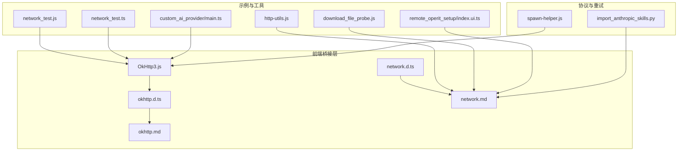
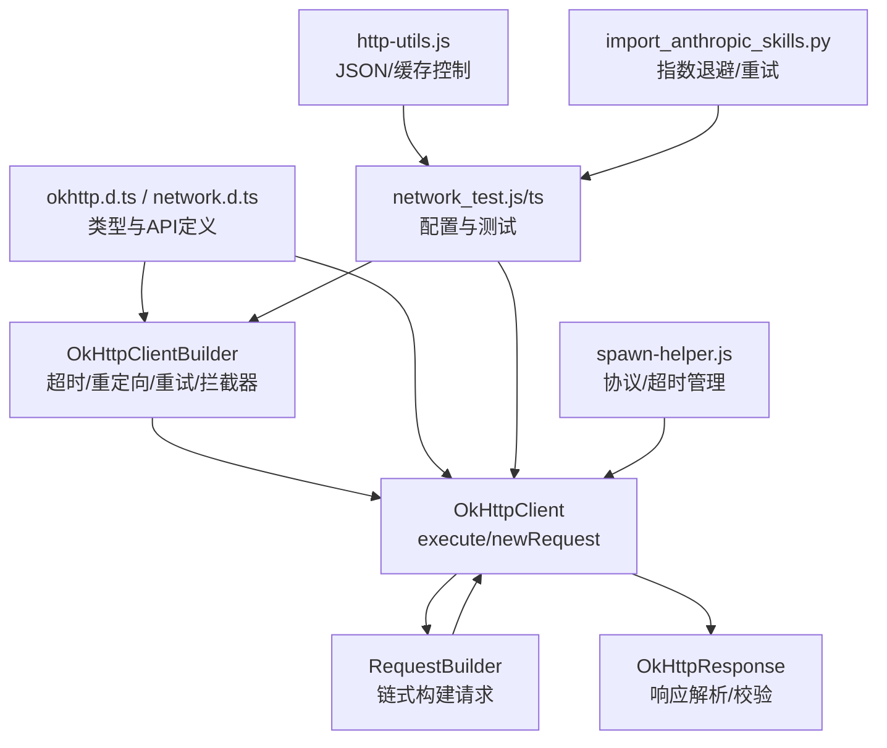
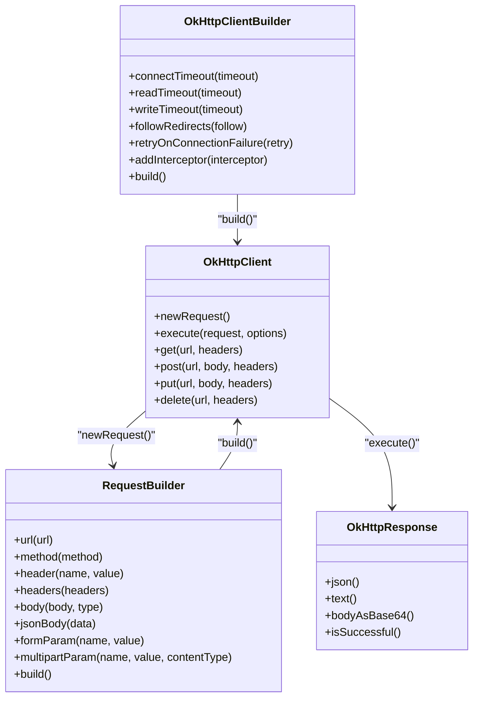
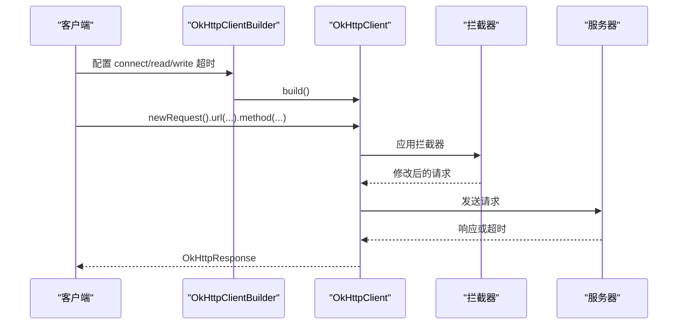
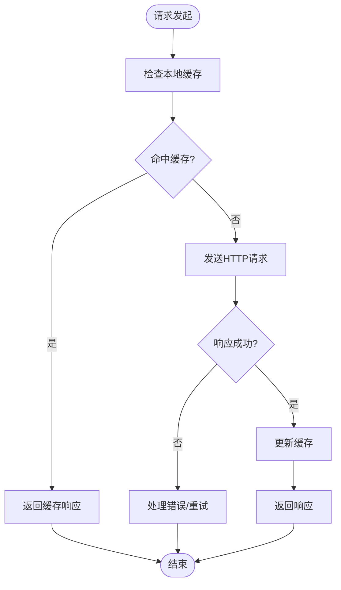
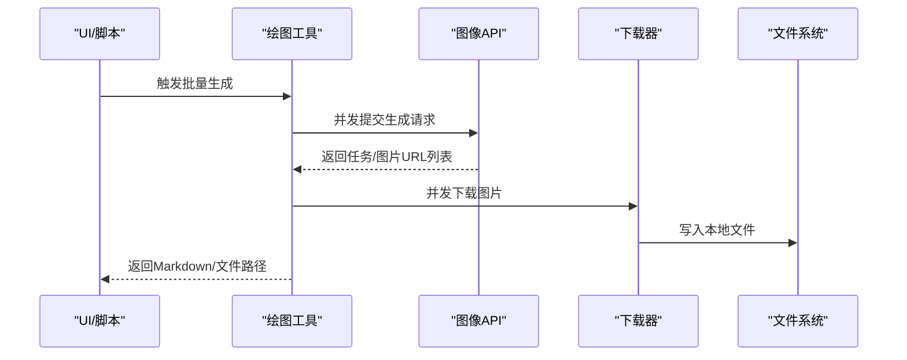
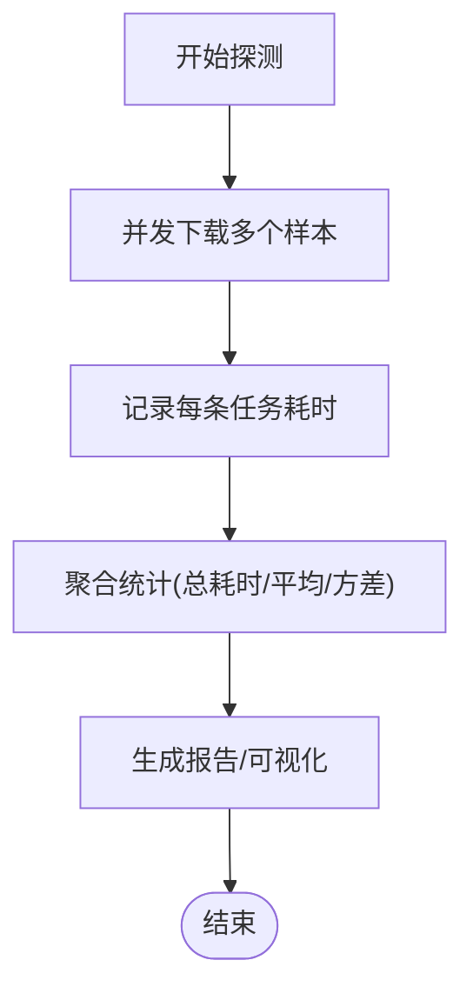
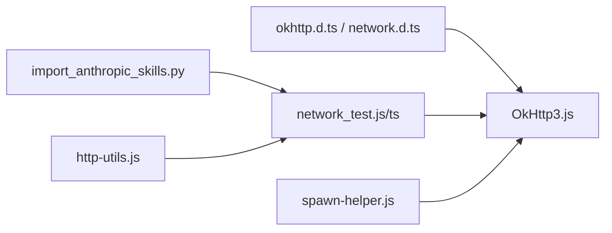

# 网络优化

<cite>
**本文引用的文件**
- [OkHttp3.js](file://app/src/main/assets/js/OkHttp3.js)
- [okhttp.d.ts](file://examples/types/okhttp.d.ts)
- [okhttp.md](file://docs/package_dev/okhttp.md)
- [network.md](file://docs/package_dev/network.md)
- [network.d.ts](file://examples/types/network.d.ts)
- [network_test.js](file://examples/network_test.js)
- [network_test.ts](file://examples/network_test.ts)
- [custom_ai_provider/main.ts](file://examples/custom_ai_provider/src/main.ts)
- [http-utils.js](file://examples/windows_control/resources/pc_agent/operit-pc-agent/src/lib/http-utils.js)
- [spawn-helper.js](file://app/src/main/assets/bridge/spawn-helper.js)
- [import_anthropic_skills.py](file://tools/github/import_anthropic_skills.py)
- [qwen_draw.ts](file://examples/qwen_draw.ts)
- [siliconflow_draw.ts](file://examples/siliconflow_draw.ts)
- [xai_draw.ts](file://examples/xai_draw.ts)
- [minimax_draw.ts](file://examples/minimax_draw.ts)
- [download_file_probe.js](file://app/src/androidTest/js/com/ai/assistance/operit/core/tools/javascript/script_mode_contract/download_file_probe.js)
- [remote_operit_setup/index.ui.ts](file://examples/remote_operit/src/ui/remote_operit_setup/index.ui.ts)
</cite>

## 目录
1. [简介](#简介)
2. [项目结构](#项目结构)
3. [核心组件](#核心组件)
4. [架构总览](#架构总览)
5. [详细组件分析](#详细组件分析)
6. [依赖分析](#依赖分析)
7. [性能考量](#性能考量)
8. [故障排查指南](#故障排查指南)
9. [结论](#结论)
10. [附录](#附录)

## 简介
本指南围绕 Operit 的网络优化实践，系统梳理连接池与连接复用、超时与重试、请求缓存、请求合并与批量、压缩传输、网络监控与诊断，并结合 AI 模型下载、工具包更新、API 请求等典型场景给出可操作的优化策略与最佳实践。文档同时覆盖不同网络环境（WiFi、移动网络、弱网）的适配建议，帮助开发者在真实环境中稳定、高效地完成网络任务。

## 项目结构
Operit 在前端桥接层提供了 OkHttp 的 JavaScript 封装，配合类型定义与示例脚本，形成统一的网络请求与缓存、监控能力。核心文件分布如下：
- 桥接层与类型定义：OkHttp3.js、okhttp.d.ts、okhttp.md
- 网络工具与 API：network.md、network.d.ts
- 端到端网络测试：network_test.js、network_test.ts
- 自定义 AI 提供者示例：custom_ai_provider/main.ts
- 服务器侧 HTTP 实用库：http-utils.js
- 协议与超时管理：spawn-helper.js
- 外部服务集成与重试：import_anthropic_skills.py
- AI 绘图与批量下载：qwen_draw.ts、siliconflow_draw.ts、xai_draw.ts、minimax_draw.ts
- 下载性能探测：download_file_probe.js
- 远程连接状态与超时：remote_operit_setup/index.ui.ts

**图表来源**
- [OkHttp3.js:1-350](file://app/src/main/assets/js/OkHttp3.js#L1-L350)
- [okhttp.d.ts:1-258](file://examples/types/okhttp.d.ts#L1-L258)
- [okhttp.md:1-158](file://docs/package_dev/okhttp.md#L1-L158)
- [network.d.ts:1-353](file://examples/types/network.d.ts#L1-L353)
- [network.md:1-224](file://docs/package_dev/network.md#L1-L224)
- [network_test.js:157-682](file://examples/network_test.js#L157-L682)
- [network_test.ts:157-257](file://examples/network_test.ts#L157-L257)
- [custom_ai_provider/main.ts:186-220](file://examples/custom_ai_provider/src/main.ts#L186-L220)
- [http-utils.js:1-62](file://examples/windows_control/resources/pc_agent/operit-pc-agent/src/lib/http-utils.js#L1-L62)
- [download_file_probe.js:119-164](file://app/src/androidTest/js/com/ai/assistance/operit/core/tools/javascript/script_mode_contract/download_file_probe.js#L119-L164)
- [remote_operit_setup/index.ui.ts:216-262](file://examples/remote_operit/src/ui/remote_operit_setup/index.ui.ts#L216-L262)
- [spawn-helper.js:21900-21962](file://app/src/main/assets/bridge/spawn-helper.js#L21900-L21962)
- [import_anthropic_skills.py:113-145](file://tools/github/import_anthropic_skills.py#L113-L145)

**章节来源**
- [OkHttp3.js:1-350](file://app/src/main/assets/js/OkHttp3.js#L1-L350)
- [okhttp.d.ts:1-258](file://examples/types/okhttp.d.ts#L1-L258)
- [okhttp.md:1-158](file://docs/package_dev/okhttp.md#L1-L158)
- [network.d.ts:1-353](file://examples/types/network.d.ts#L1-L353)
- [network.md:1-224](file://docs/package_dev/network.md#L1-L224)

## 核心组件
- OkHttp 客户端封装：提供链式构建请求、超时配置、重定向与重试、拦截器等能力，便于统一管理连接池与连接复用。
- 类型与 API：通过 okhttp.d.ts 与 network.d.ts 明确请求/响应结构、超时与缓存参数、Cookie 管理等。
- 网络测试工具：network_test.js/ts 展示如何动态配置超时、重定向与重试，并对多种 HTTP 方法进行验证。
- 服务器侧实用库：http-utils.js 提供 JSON 解析、响应头与缓存控制等基础能力。
- 协议与超时：spawn-helper.js 中的协议超时管理与最大总时长控制，保障长链路稳定性。
- 外部服务重试：import_anthropic_skills.py 展示指数退避与 Retry-After 头处理。
- 批量与下载：AI 绘图工具与下载探针体现批量处理与并发控制的实践。

**章节来源**
- [OkHttp3.js:14-98](file://app/src/main/assets/js/OkHttp3.js#L14-L98)
- [okhttp.d.ts:11-258](file://examples/types/okhttp.d.ts#L11-L258)
- [network.d.ts:293-304](file://examples/types/network.d.ts#L293-L304)
- [network_test.js:170-230](file://examples/network_test.js#L170-L230)
- [network_test.ts:171-244](file://examples/network_test.ts#L171-L244)
- [http-utils.js:41-62](file://examples/windows_control/resources/pc_agent/operit-pc-agent/src/lib/http-utils.js#L41-L62)
- [spawn-helper.js:21900-21962](file://app/src/main/assets/bridge/spawn-helper.js#L21900-L21962)
- [import_anthropic_skills.py:113-145](file://tools/github/import_anthropic_skills.py#L113-L145)

## 架构总览
下图展示了前端 OkHttp 客户端、类型定义、网络工具与测试脚本之间的交互关系，以及与服务器侧工具和协议超时管理的衔接。

**图表来源**
- [OkHttp3.js:14-98](file://app/src/main/assets/js/OkHttp3.js#L14-L98)
- [okhttp.d.ts:115-192](file://examples/types/okhttp.d.ts#L115-L192)
- [network.d.ts:293-304](file://examples/types/network.d.ts#L293-L304)
- [network_test.js:170-230](file://examples/network_test.js#L170-L230)
- [network_test.ts:171-244](file://examples/network_test.ts#L171-L244)
- [http-utils.js:41-62](file://examples/windows_control/resources/pc_agent/operit-pc-agent/src/lib/http-utils.js#L41-L62)
- [spawn-helper.js:21900-21962](file://app/src/main/assets/bridge/spawn-helper.js#L21900-L21962)
- [import_anthropic_skills.py:113-145](file://tools/github/import_anthropic_skills.py#L113-L145)

## 详细组件分析

### 连接池与连接复用
- 客户端构建与复用：通过 OkHttpClientBuilder 配置 connectTimeout/readTimeout/writeTimeout，结合 OkHttp.newClient()/newBuilder() 实现客户端复用，避免频繁创建连接导致的开销。
- 重定向与重试：followRedirects 与 retryOnConnectionFailure 控制重定向行为与连接失败时的自动重试，有助于提升成功率与稳定性。
- 拦截器：addInterceptor 支持在请求发出前统一注入头信息、追踪 ID 等，便于日志与监控。

**图表来源**
- [OkHttp3.js:14-98](file://app/src/main/assets/js/OkHttp3.js#L14-L98)
- [okhttp.d.ts:115-192](file://examples/types/okhttp.d.ts#L115-L192)

**章节来源**
- [OkHttp3.js:14-98](file://app/src/main/assets/js/OkHttp3.js#L14-L98)
- [okhttp.d.ts:115-192](file://examples/types/okhttp.d.ts#L115-L192)

### 超时与重试策略
- 超时配置：connectTimeout/readTimeout/writeTimeout 分别对应建立连接、读取响应、写入请求的超时阈值，应根据网络环境与业务特征进行差异化设置。
- 重试策略：retryOnConnectionFailure 开启后，连接失败时自动重试；外部服务重试可参考 import_anthropic_skills.py 的指数退避与 Retry-After 头处理，避免对上游造成冲击。
- 协议级超时：spawn-helper.js 中的 DEFAULT_REQUEST_TIMEOUT_MSEC 与最大总时长控制，确保长链路不会无限等待。

**图表来源**
- [OkHttp3.js:93-98](file://app/src/main/assets/js/OkHttp3.js#L93-L98)
- [okhttp.d.ts:115-192](file://examples/types/okhttp.d.ts#L115-L192)
- [spawn-helper.js:21900-21962](file://app/src/main/assets/bridge/spawn-helper.js#L21900-L21962)

**章节来源**
- [network_test.js:170-230](file://examples/network_test.js#L170-L230)
- [network_test.ts:171-244](file://examples/network_test.ts#L171-L244)
- [custom_ai_provider/main.ts:186-220](file://examples/custom_ai_provider/src/main.ts#L186-L220)
- [import_anthropic_skills.py:113-145](file://tools/github/import_anthropic_skills.py#L113-L145)
- [spawn-helper.js:21900-21962](file://app/src/main/assets/bridge/spawn-helper.js#L21900-L21962)

### 请求缓存与失效机制
- HTTP 缓存头：服务器端通过 Cache-Control: no-store 禁止缓存，确保数据新鲜度；客户端侧可通过拦截器统一添加/修改缓存相关头。
- 响应缓存策略：结合 OkHttp 的缓存能力与拦截器，可在请求前检查本地缓存命中情况，减少重复请求。
- 缓存失效：通过 ETag/Last-Modified 或自定义版本头实现精准失效；在弱网环境下可适当放宽缓存窗口以提升体验。

**图表来源**
- [http-utils.js:41-62](file://examples/windows_control/resources/pc_agent/operit-pc-agent/src/lib/http-utils.js#L41-L62)
- [OkHttp3.js:58-70](file://app/src/main/assets/js/OkHttp3.js#L58-L70)

**章节来源**
- [http-utils.js:41-62](file://examples/windows_control/resources/pc_agent/operit-pc-agent/src/lib/http-utils.js#L41-L62)
- [OkHttp3.js:58-70](file://app/src/main/assets/js/OkHttp3.js#L58-L70)

### 请求合并与批量处理
- 批量下载与生成：AI 绘图工具（如 qwen_draw.ts、siliconflow_draw.ts、xai_draw.ts、minimax_draw.ts）通过批量生成与并发下载，显著缩短端到端时延。
- 并发控制：download_file_probe.js 展示了并发下载的探测与汇总，避免过度并发导致的资源争用。
- 合并策略：对同一域名的请求进行合并或复用连接，减少握手成本；对小请求采用合并上传（multipart/form-data）降低 RTT。

**图表来源**
- [qwen_draw.ts:271-308](file://examples/qwen_draw.ts#L271-L308)
- [siliconflow_draw.ts:506-531](file://examples/siliconflow_draw.ts#L506-L531)
- [xai_draw.ts:501-536](file://examples/xai_draw.ts#L501-L536)
- [minimax_draw.ts:450-477](file://examples/minimax_draw.ts#L450-L477)
- [download_file_probe.js:136-161](file://app/src/androidTest/js/com/ai/assistance/operit/core/tools/javascript/script_mode_contract/download_file_probe.js#L136-L161)

**章节来源**
- [qwen_draw.ts:271-308](file://examples/qwen_draw.ts#L271-L308)
- [siliconflow_draw.ts:506-531](file://examples/siliconflow_draw.ts#L506-L531)
- [xai_draw.ts:501-536](file://examples/xai_draw.ts#L501-L536)
- [minimax_draw.ts:450-477](file://examples/minimax_draw.ts#L450-L477)
- [download_file_probe.js:136-161](file://app/src/androidTest/js/com/ai/assistance/operit/core/tools/javascript/script_mode_contract/download_file_probe.js#L136-L161)

### 压缩传输与内容协商
- 压缩：在请求头中声明 Accept-Encoding 并启用服务器端 gzip/br 压缩，可显著降低大响应体积。
- 内容协商：通过 Accept/Accept-Language 等头优化内容分发，减少不必要的数据传输。

**章节来源**
- [OkHttp3.js:93-98](file://app/src/main/assets/js/OkHttp3.js#L93-L98)

### 网络监控与诊断
- 延迟测量：通过 download_file_probe.js 记录每个任务的耗时，聚合统计总耗时与平均耗时。
- 连接质量评估：结合网络测试脚本（network_test.js/ts）对连接、DNS、TLS 握手、首包时延等进行评估。
- 远程连接状态：remote_operit_setup/index.ui.ts 展示了连接卡片状态与超时配置，便于用户感知网络状况。

**图表来源**
- [download_file_probe.js:136-161](file://app/src/androidTest/js/com/ai/assistance/operit/core/tools/javascript/script_mode_contract/download_file_probe.js#L136-L161)
- [network_test.js:532-559](file://examples/network_test.js#L532-L559)
- [network_test.ts:171-244](file://examples/network_test.ts#L171-L244)
- [remote_operit_setup/index.ui.ts:236-262](file://examples/remote_operit/src/ui/remote_operit_setup/index.ui.ts#L236-L262)

**章节来源**
- [download_file_probe.js:136-161](file://app/src/androidTest/js/com/ai/assistance/operit/core/tools/javascript/script_mode_contract/download_file_probe.js#L136-L161)
- [network_test.js:532-559](file://examples/network_test.js#L532-L559)
- [network_test.ts:171-244](file://examples/network_test.ts#L171-L244)
- [remote_operit_setup/index.ui.ts:236-262](file://examples/remote_operit/src/ui/remote_operit_setup/index.ui.ts#L236-L262)

### 不同网络环境的优化策略
- WiFi：高带宽、低延迟，适合并发与批量操作；可适度提高超时阈值以充分利用带宽。
- 移动网络：RTT 波动较大，建议开启 retryOnConnectionFailure 与指数退避；适当增大 connect/read 超时，启用缓存以减少重复请求。
- 弱网：优先保证关键路径（如认证、核心 API）的可用性；对非关键下载与生成任务采用降级策略（如降低分辨率、减少并发）。

**章节来源**
- [custom_ai_provider/main.ts:186-220](file://examples/custom_ai_provider/src/main.ts#L186-L220)
- [import_anthropic_skills.py:113-145](file://tools/github/import_anthropic_skills.py#L113-L145)

## 依赖分析
- 类型与实现耦合：okhttp.d.ts 与 OkHttp3.js 形成强耦合，前者约束后者行为；network.d.ts 与 network.md 则提供更高层的工具 API。
- 测试与实现绑定：network_test.js/ts 依赖 OkHttp3.js 的配置能力，验证超时、重定向与重试效果。
- 协议与超时：spawn-helper.js 的协议超时管理与 OkHttp 的超时配置共同保障长链路稳定性。
- 外部服务集成：import_anthropic_skills.py 的重试策略可作为 OkHttp 重试的补充，尤其在上游限流场景。

**图表来源**
- [okhttp.d.ts:1-258](file://examples/types/okhttp.d.ts#L1-L258)
- [network.d.ts:1-353](file://examples/types/network.d.ts#L1-L353)
- [OkHttp3.js:1-350](file://app/src/main/assets/js/OkHttp3.js#L1-L350)
- [network_test.js:170-230](file://examples/network_test.js#L170-L230)
- [network_test.ts:171-244](file://examples/network_test.ts#L171-L244)
- [spawn-helper.js:21900-21962](file://app/src/main/assets/bridge/spawn-helper.js#L21900-L21962)
- [import_anthropic_skills.py:113-145](file://tools/github/import_anthropic_skills.py#L113-L145)
- [http-utils.js:41-62](file://examples/windows_control/resources/pc_agent/operit-pc-agent/src/lib/http-utils.js#L41-L62)

**章节来源**
- [okhttp.d.ts:1-258](file://examples/types/okhttp.d.ts#L1-L258)
- [network.d.ts:1-353](file://examples/types/network.d.ts#L1-L353)
- [OkHttp3.js:1-350](file://app/src/main/assets/js/OkHttp3.js#L1-L350)
- [network_test.js:170-230](file://examples/network_test.js#L170-L230)
- [network_test.ts:171-244](file://examples/network_test.ts#L171-L244)
- [spawn-helper.js:21900-21962](file://app/src/main/assets/bridge/spawn-helper.js#L21900-L21962)
- [import_anthropic_skills.py:113-145](file://tools/github/import_anthropic_skills.py#L113-L145)
- [http-utils.js:41-62](file://examples/windows_control/resources/pc_agent/operit-pc-agent/src/lib/http-utils.js#L41-L62)

## 性能考量
- 连接池大小：根据并发请求数与目标域名数量合理设置连接池上限，避免过多空闲连接占用资源。
- 超时参数：connect/read/write 超时应与业务 SLA 和网络特征匹配；弱网环境适当放宽。
- 重试策略：指数退避 + jitter，避免雪崩效应；尊重上游 Retry-After。
- 缓存策略：对静态或变化频率低的数据启用缓存，结合 ETag/Last-Modified 实现精准失效。
- 压缩与合并：启用压缩与请求合并，减少带宽与 RTT。
- 监控与采样：对关键路径进行采样与聚合，持续观察延迟分布与错误率。

## 故障排查指南
- 超时问题：检查 connect/read/write 超时设置是否过短；结合 spawn-helper.js 的最大总时长判断是否存在协议层阻塞。
- 连接失败：开启 retryOnConnectionFailure 并观察指数退避效果；必要时增加重试次数与退避系数。
- 缓存异常：确认服务器 Cache-Control 设置与客户端拦截器逻辑；检查缓存键一致性。
- 重定向循环：调整 followRedirects 与拦截器中的 Location 处理逻辑。
- 大文件下载：使用并发下载与断点续传（若支持），并监控磁盘 IO 与内存占用。

**章节来源**
- [spawn-helper.js:21900-21962](file://app/src/main/assets/bridge/spawn-helper.js#L21900-L21962)
- [import_anthropic_skills.py:113-145](file://tools/github/import_anthropic_skills.py#L113-L145)
- [http-utils.js:41-62](file://examples/windows_control/resources/pc_agent/operit-pc-agent/src/lib/http-utils.js#L41-L62)

## 结论
Operit 的网络优化以 OkHttp 客户端为核心，结合类型定义、测试脚本与协议超时管理，形成了从连接池复用、超时与重试、缓存与失效、批量与压缩到监控与诊断的完整闭环。针对不同网络环境，应差异化配置超时与重试策略，并通过监控持续迭代优化，最终实现稳定、高效、可观测的网络体验。

## 附录
- 快速参考
  - 客户端配置：connectTimeout/readTimeout/writeTimeout/followRedirects/retryOnConnectionFailure
  - 请求构建：链式设置 URL、方法、头、体，支持 JSON/Form/Multipart
  - 响应处理：json()/text()/bodyAsBase64()/isSuccessful()
  - 批量下载：并发控制与耗时统计
  - 重试策略：指数退避 + Retry-After 头处理

**章节来源**
- [okhttp.md:1-158](file://docs/package_dev/okhttp.md#L1-L158)
- [network.md:1-224](file://docs/package_dev/network.md#L1-L224)
- [download_file_probe.js:136-161](file://app/src/androidTest/js/com/ai/assistance/operit/core/tools/javascript/script_mode_contract/download_file_probe.js#L136-L161)