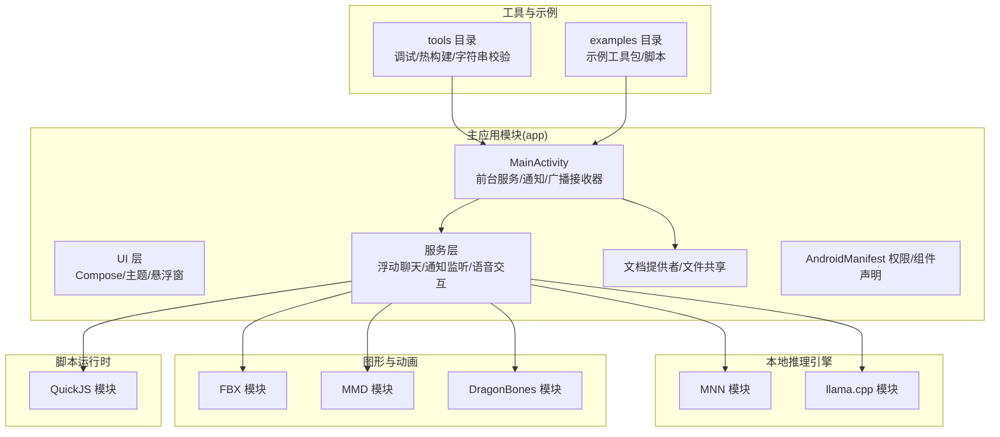
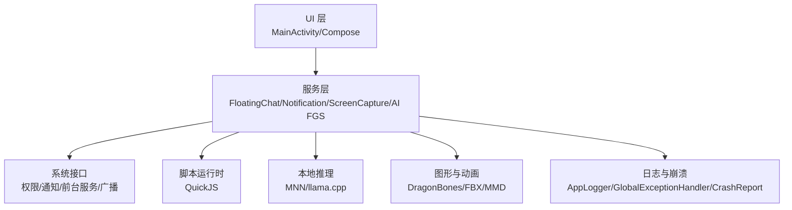
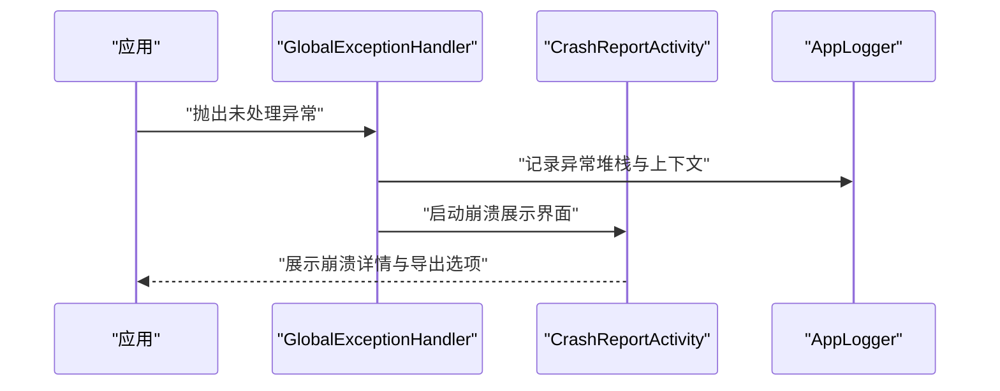
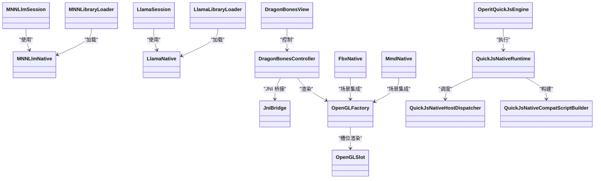
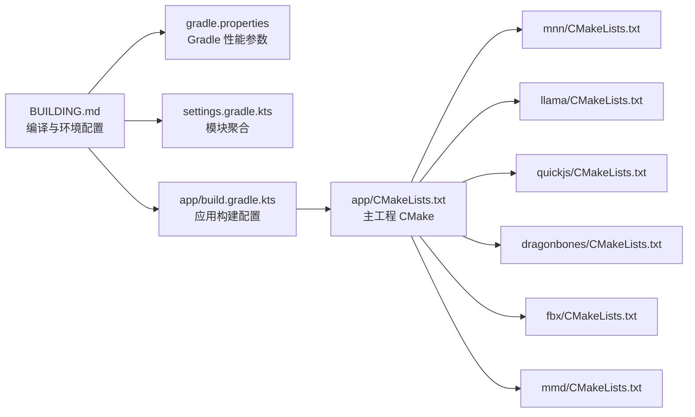
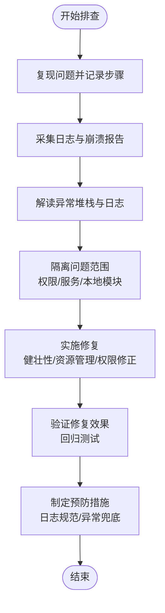

# 故障排除指南

<cite>
**本文引用的文件**
- [README.md](file://README.md)
- [BUILDING.md](file://docs/BUILDING.md)
- [AndroidManifest.xml](file://app/src/main/AndroidManifest.xml)
- [CrashReportActivity.kt](file://app/src/main/java/com/ai/assistance/operit/ui/error/CrashReportActivity.kt)
- [GlobalExceptionHandler.kt](file://app/src/main/java/com/ai/assistance/operit/util/GlobalExceptionHandler.kt)
- [AppLogger.kt](file://app/src/main/java/com/ai/assistance/operit/util/AppLogger.kt)
- [LogcatScreen.kt](file://app/src/main/java/com/ai/assistance/operit/ui/features/toolbox/screens/logcat/LogcatScreen.kt)
- [LogcatManager.kt](file://app/src/main/java/com/ai/assistance/operit/ui/features/toolbox/screens/logcat/LogcatManager.kt)
- [LogModels.kt](file://app/src/main/java/com/ai/assistance/operit/ui/features/toolbox/screens/logcat/LogModels.kt)
- [LogcatExportHelper.kt](file://app/src/main/java/com/ai/assistance/operit/ui/features/toolbox/screens/logcat/LogcatExportHelper.kt)
- [LogcatViewModel.kt](file://app/src/main/java/com/ai/assistance/operit/ui/features/toolbox/screens/logcat/LogcatViewModel.kt)
- [TtsException.kt](file://app/src/main/java/com/ai/assistance/operit/api/voice/TtsException.kt)
- [CrashRecoveryState.kt](file://app/src/main/java/com/ai/assistance/operit/util/CrashRecoveryState.kt)
- [OperitQuickJsEngine.kt](file://quickjs/src/main/java/com/ai/assistance/operit/core/tools/javascript/OperitQuickJsEngine.kt)
- [QuickJsNativeRuntime.kt](file://quickjs/src/main/java/com/ai/assistance/operit/core/tools/javascript/QuickJsNativeRuntime.kt)
- [QuickJsNativeHostDispatcher.kt](file://quickjs/src/main/java/com/ai/assistance/operit/core/tools/javascript/QuickJsNativeHostDispatcher.kt)
- [QuickJsNativeCompatScriptBuilder.kt](file://quickjs/src/main/java/com/ai/assistance/operit/core/tools/javascript/QuickJsNativeCompatScriptBuilder.kt)
- [MNNLlmNative.kt](file://mnn/src/main/java/com/ai/assistance/mnn/MNNLlmNative.kt)
- [MNNLlmSession.kt](file://mnn/src/main/java/com/ai/assistance/mnn/MNNLlmSession.kt)
- [LlamaNative.kt](file://llama/src/main/java/com/ai/assistance/llama/LlamaNative.kt)
- [LlamaSession.kt](file://llama/src/main/java/com/ai/assistance/llama/LlamaSession.kt)
- [FbxNative.kt](file://fbx/src/main/java/com/ai/assistance/fbx/FbxNative.kt)
- [MmdNative.kt](file://mmd/src/main/java/com/ai/assistance/mmd/MmdNative.kt)
- [DragonBonesView.kt](file://dragonbones/src/main/java/com/dragonbones/DragonBonesView.kt)
- [DragonBonesController.kt](file://dragonbones/src/main/java/com/dragonbones/DragonBonesController.kt)
- [JniBridge.kt](file://dragonbones/src/main/java/com/dragonbones/JniBridge.kt)
- [JniBridge.cpp](file://dragonbones/cpp/JniBridge.cpp)
- [MNNForwardType.kt](file://mnn/src/main/java/com/ai/assistance/mnn/MNNForwardType.kt)
- [MNNImageProcess.kt](file://mnn/src/main/java/com/ai/assistance/mnn/MNNImageProcess.kt)
- [MNNModule.kt](file://mnn/src/main/java/com/ai/assistance/mnn/MNNModule.kt)
- [MNNNetInstance.kt](file://mnn/src/main/java/com/ai/assistance/mnn/MNNNetInstance.kt)
- [MNNModuleNative.kt](file://mnn/src/main/java/com/ai/assistance/mnn/MNNModuleNative.kt)
- [MNNNetNative.kt](file://mnn/src/main/java/com/ai/assistance/mnn/MNNNetNative.kt)
- [MNNLibraryLoader.kt](file://mnn/src/main/java/com/ai/assistance/mnn/MNNLibraryLoader.kt)
- [LlamaLibraryLoader.kt](file://llama/src/main/java/com/ai/assistance/llama/LlamaLibraryLoader.kt)
- [FbxLibraryLoader.kt](file://fbx/src/main/java/com/ai/assistance/fbx/FbxLibraryLoader.kt)
- [MmdLibraryLoader.kt](file://mmd/src/main/java/com/ai/assistance/mmd/MmdLibraryLoader.kt)
- [MNNNetNative.cpp](file://mnn/src/main/cpp/MNNNetNative.cpp)
- [MNNModuleNative.cpp](file://mnn/src/main/cpp/MNNModuleNative.cpp)
- [MNNLlmNative.cpp](file://mnn/src/main/cpp/MNNLlmNative.cpp)
- [LlamaNative.cpp](file://llama/src/main/cpp/llama_jni_stub.cpp)
- [FbxNative.cpp](file://fbx/src/main/cpp/fbx_jni.cpp)
- [MmdNative.cpp](file://mmd/src/main/cpp/android/)
- [DragonBones.cpp](file://dragonbones/cpp/dragonBones/core/DragonBones.cpp)
- [Animation.cpp](file://dragonbones/cpp/dragonBones/animation/Animation.cpp)
- [AnimationState.cpp](file://dragonbones/cpp/dragonBones/animation/AnimationState.cpp)
- [Armature.cpp](file://dragonbones/cpp/dragonBones/armature/Armature.cpp)
- [Slot.cpp](file://dragonbones/cpp/dragonBones/armature/Slot.cpp)
- [OpenGLFactory.cpp](file://dragonbones/cpp/opengl/OpenGLFactory.cpp)
- [OpenGLSlot.cpp](file://dragonbones/cpp/opengl/OpenGLSlot.cpp)
- [JniBridge.cpp](file://dragonbones/cpp/JniBridge.cpp)
- [JniBridge.h](file://dragonbones/cpp/JniBridge.h)
- [CMakeLists.txt](file://dragonbones/CMakeLists.txt)
- [CMakeLists.txt](file://mnn/CMakeLists.txt)
- [CMakeLists.txt](file://llama/CMakeLists.txt)
- [CMakeLists.txt](file://fbx/CMakeLists.txt)
- [CMakeLists.txt](file://mmd/CMakeLists.txt)
- [CMakeLists.txt](file://quickjs/CMakeLists.txt)
- [CMakeLists.txt](file://app/CMakeLists.txt)
- [build.gradle.kts](file://app/build.gradle.kts)
- [gradle.properties](file://gradle.properties)
- [settings.gradle.kts](file://settings.gradle.kts)
- [build.gradle.kts](file://build.gradle.kts)
- [packages_whitelist.txt](file://packages_whitelist.txt)
- [sync_example_packages.py](file://sync_example_packages.py)
- [README.md](file://dragonbones/README.md)
- [README.md](file://quickjs/README.md)
- [README.md](file://mnn/README.md)
- [README.md](file://llama/README.md)
- [README.md](file://fbx/README.md)
- [README.md](file://mmd/README.md)
</cite>

## 目录
1. [引言](#引言)
2. [项目结构](#项目结构)
3. [核心组件](#核心组件)
4. [架构总览](#架构总览)
5. [详细组件分析](#详细组件分析)
6. [依赖关系分析](#依赖关系分析)
7. [性能考虑](#性能考虑)
8. [故障排除指南](#故障排除指南)
9. [结论](#结论)
10. [附录](#附录)

## 引言
本指南面向用户与开发者，提供 Operit AI 的系统化故障排除方法，覆盖安装问题、启动失败、功能异常、性能问题、崩溃分析、调试技巧与系统集成问题排查。Operit AI 是一款功能完备的移动端 AI 助手应用，具备工具调用、工作流与自动化、智能记忆库、多模型支持、本地推理、系统集成（无障碍/ADB/Root）等能力。为确保可追溯性，本指南中的所有技术细节均基于仓库内实际文件与实现。

## 项目结构
Operit 采用多模块架构，主模块负责 UI、服务与集成，子模块分别承载本地推理引擎（MNN/llama.cpp）、图形与动画（FBX/MMD/DragonBones）、脚本运行时（QuickJS）等。构建与调试工具分布在 tools 与 examples 目录，文档与构建指南位于 docs。

**图表来源**
- [AndroidManifest.xml:1-513](file://app/src/main/AndroidManifest.xml#L1-L513)
- [CMakeLists.txt](file://app/CMakeLists.txt)
- [CMakeLists.txt](file://mnn/CMakeLists.txt)
- [CMakeLists.txt](file://llama/CMakeLists.txt)
- [CMakeLists.txt](file://quickjs/CMakeLists.txt)
- [CMakeLists.txt](file://dragonbones/CMakeLists.txt)
- [CMakeLists.txt](file://mmd/CMakeLists.txt)
- [CMakeLists.txt](file://fbx/CMakeLists.txt)

**章节来源**
- [README.md:1-469](file://README.md#L1-L469)
- [AndroidManifest.xml:1-513](file://app/src/main/AndroidManifest.xml#L1-L513)

## 核心组件
- 应用入口与生命周期
  - MainActivity：应用主入口，处理多种 Intent、文件打开与分享、系统 ASSIST/VOICE_ASSIST。
  - OperitApplication：应用级初始化与全局配置。
- 服务与前台服务
  - FloatingChatService、ScreenCaptureService、OperitNotificationListenerService、AIForegroundService 等，用于悬浮窗、录屏、通知监听与网络保持。
- 文档提供者与文件系统
  - WorkspaceDocumentsProvider、MemoryDocumentsProvider，支持 SAF 绑定与文档管理。
- 权限与安全
  - Manifest 声明大量权限（网络、存储、前台服务、录音、摄像头、系统弹窗、忽略电池优化等），并配置 FileProvider、Firebase ML 关闭等。
- 日志与崩溃
  - AppLogger 提供统一日志；GlobalExceptionHandler 捕获未处理异常；CrashReportActivity 展示崩溃详情；LogcatScreen/LogcatManager 提供日志采集与导出。
- 本地推理与多媒体
  - MNN/llama.cpp、QuickJS、DragonBones/FBX/MMD 等模块通过 JNI 与本地库交互。
- 工具与示例
  - tools 与 examples 提供调试、热构建、脚本包打包与示例工具。

**章节来源**
- [AndroidManifest.xml:1-513](file://app/src/main/AndroidManifest.xml#L1-L513)
- [AppLogger.kt](file://app/src/main/java/com/ai/assistance/operit/util/AppLogger.kt)
- [GlobalExceptionHandler.kt](file://app/src/main/java/com/ai/assistance/operit/util/GlobalExceptionHandler.kt)
- [CrashReportActivity.kt](file://app/src/main/java/com/ai/assistance/operit/ui/error/CrashReportActivity.kt)
- [LogcatScreen.kt](file://app/src/main/java/com/ai/assistance/operit/ui/features/toolbox/screens/logcat/LogcatScreen.kt)
- [LogcatManager.kt](file://app/src/main/java/com/ai/assistance/operit/ui/features/toolbox/screens/logcat/LogcatManager.kt)

## 架构总览
Operit 的运行时由 Android 应用层、服务层、本地推理与多媒体层、脚本运行时层构成。应用通过前台服务维持网络与系统能力，服务间通过广播与系统接口交互，本地模块通过 JNI 与 C/C++ 本地库通信。

**图表来源**
- [AndroidManifest.xml:195-510](file://app/src/main/AndroidManifest.xml#L195-L510)
- [OperitQuickJsEngine.kt](file://quickjs/src/main/java/com/ai/assistance/operit/core/tools/javascript/OperitQuickJsEngine.kt)
- [MNNLlmNative.kt](file://mnn/src/main/java/com/ai/assistance/mnn/MNNLlmNative.kt)
- [LlamaNative.kt](file://llama/src/main/java/com/ai/assistance/llama/LlamaNative.kt)
- [DragonBonesView.kt](file://dragonbones/src/main/java/com/dragonbones/DragonBonesView.kt)
- [AppLogger.kt](file://app/src/main/java/com/ai/assistance/operit/util/AppLogger.kt)
- [GlobalExceptionHandler.kt](file://app/src/main/java/com/ai/assistance/operit/util/GlobalExceptionHandler.kt)

## 详细组件分析

### 日志与崩溃组件
- 日志采集与导出
  - LogcatScreen/LogcatManager 提供实时日志采集、过滤与导出，便于定位 UI、服务与本地模块问题。
  - LogcatExportHelper 支持导出到文件，便于问题上报与留存。
- 崩溃捕获与展示
  - GlobalExceptionHandler 捕获未处理异常，配合 CrashReportActivity 展示崩溃详情，便于用户与开发者快速定位。
- 日志工具链
  - AppLogger 提供统一日志入口，便于在各模块中统一输出与分级。

**图表来源**
- [GlobalExceptionHandler.kt](file://app/src/main/java/com/ai/assistance/operit/util/GlobalExceptionHandler.kt)
- [CrashReportActivity.kt](file://app/src/main/java/com/ai/assistance/operit/ui/error/CrashReportActivity.kt)
- [AppLogger.kt](file://app/src/main/java/com/ai/assistance/operit/util/AppLogger.kt)

**章节来源**
- [LogcatScreen.kt](file://app/src/main/java/com/ai/assistance/operit/ui/features/toolbox/screens/logcat/LogcatScreen.kt)
- [LogcatManager.kt](file://app/src/main/java/com/ai/assistance/operit/ui/features/toolbox/screens/logcat/LogcatManager.kt)
- [LogcatExportHelper.kt](file://app/src/main/java/com/ai/assistance/operit/ui/features/toolbox/screens/logcat/LogcatExportHelper.kt)
- [LogcatViewModel.kt](file://app/src/main/java/com/ai/assistance/operit/ui/features/toolbox/screens/logcat/LogcatViewModel.kt)
- [GlobalExceptionHandler.kt](file://app/src/main/java/com/ai/assistance/operit/util/GlobalExceptionHandler.kt)
- [CrashReportActivity.kt](file://app/src/main/java/com/ai/assistance/operit/ui/error/CrashReportActivity.kt)
- [AppLogger.kt](file://app/src/main/java/com/ai/assistance/operit/util/AppLogger.kt)

### 本地推理与多媒体组件
- MNN 与 llama.cpp
  - MNNLlmNative/MNNLlmSession、LlamaNative/LlamaSession 提供本地推理能力；MNNLibraryLoader/LlamaLibraryLoader 负责库加载。
- 图形与动画
  - DragonBonesView/DragonBonesController 与 JniBridge、OpenGLFactory/OpenGLSlot 协同实现动画渲染；FBX/MMD 模块提供模型加载与渲染。
- 脚本运行时
  - OperitQuickJsEngine/QuickJsNativeRuntime/QuickJsNativeHostDispatcher/QuickJsNativeCompatScriptBuilder 提供 JS 执行与桥接。

**图表来源**
- [MNNLlmNative.kt](file://mnn/src/main/java/com/ai/assistance/mnn/MNNLlmNative.kt)
- [MNNLlmSession.kt](file://mnn/src/main/java/com/ai/assistance/mnn/MNNLlmSession.kt)
- [LlamaNative.kt](file://llama/src/main/java/com/ai/assistance/llama/LlamaNative.kt)
- [LlamaSession.kt](file://llama/src/main/java/com/ai/assistance/llama/LlamaSession.kt)
- [MNNLibraryLoader.kt](file://mnn/src/main/java/com/ai/assistance/mnn/MNNLibraryLoader.kt)
- [LlamaLibraryLoader.kt](file://llama/src/main/java/com/ai/assistance/llama/LlamaLibraryLoader.kt)
- [DragonBonesView.kt](file://dragonbones/src/main/java/com/dragonbones/DragonBonesView.kt)
- [DragonBonesController.kt](file://dragonbones/src/main/java/com/dragonbones/DragonBonesController.kt)
- [JniBridge.kt](file://dragonbones/src/main/java/com/dragonbones/JniBridge.kt)
- [OpenGLFactory.kt](file://dragonbones/src/main/java/com/dragonbones/opengl/OpenGLFactory.kt)
- [OpenGLSlot.kt](file://dragonbones/src/main/java/com/dragonbones/opengl/OpenGLSlot.kt)
- [FbxNative.kt](file://fbx/src/main/java/com/ai/assistance/fbx/FbxNative.kt)
- [MmdNative.kt](file://mmd/src/main/java/com/ai/assistance/mmd/MmdNative.kt)
- [OperitQuickJsEngine.kt](file://quickjs/src/main/java/com/ai/assistance/operit/core/tools/javascript/OperitQuickJsEngine.kt)
- [QuickJsNativeRuntime.kt](file://quickjs/src/main/java/com/ai/assistance/operit/core/tools/javascript/QuickJsNativeRuntime.kt)
- [QuickJsNativeHostDispatcher.kt](file://quickjs/src/main/java/com/ai/assistance/operit/core/tools/javascript/QuickJsNativeHostDispatcher.kt)
- [QuickJsNativeCompatScriptBuilder.kt](file://quickjs/src/main/java/com/ai/assistance/operit/core/tools/javascript/QuickJsNativeCompatScriptBuilder.kt)

**章节来源**
- [MNNLlmNative.kt](file://mnn/src/main/java/com/ai/assistance/mnn/MNNLlmNative.kt)
- [MNNLlmSession.kt](file://mnn/src/main/java/com/ai/assistance/mnn/MNNLlmSession.kt)
- [LlamaNative.kt](file://llama/src/main/java/com/ai/assistance/llama/LlamaNative.kt)
- [LlamaSession.kt](file://llama/src/main/java/com/ai/assistance/llama/LlamaSession.kt)
- [DragonBonesView.kt](file://dragonbones/src/main/java/com/dragonbones/DragonBonesView.kt)
- [DragonBonesController.kt](file://dragonbones/src/main/java/com/dragonbones/DragonBonesController.kt)
- [FbxNative.kt](file://fbx/src/main/java/com/ai/assistance/fbx/FbxNative.kt)
- [MmdNative.kt](file://mmd/src/main/java/com/ai/assistance/mmd/MmdNative.kt)
- [OperitQuickJsEngine.kt](file://quickjs/src/main/java/com/ai/assistance/operit/core/tools/javascript/OperitQuickJsEngine.kt)
- [QuickJsNativeRuntime.kt](file://quickjs/src/main/java/com/ai/assistance/operit/core/tools/javascript/QuickJsNativeRuntime.kt)
- [QuickJsNativeHostDispatcher.kt](file://quickjs/src/main/java/com/ai/assistance/operit/core/tools/javascript/QuickJsNativeHostDispatcher.kt)
- [QuickJsNativeCompatScriptBuilder.kt](file://quickjs/src/main/java/com/ai/assistance/operit/core/tools/javascript/QuickJsNativeCompatScriptBuilder.kt)

### 语音与 TTS 异常
- TTS 异常类型
  - TtsException 定义语音合成相关异常，便于在 UI 与服务层进行差异化处理与提示。
- 常见问题
  - 语音合成失败、音频焦点冲突、TTS 引擎不可用等，可通过日志与异常类型快速定位。

**章节来源**
- [TtsException.kt](file://app/src/main/java/com/ai/assistance/operit/api/voice/TtsException.kt)

## 依赖关系分析
- 构建与环境
  - BUILDING.md 提供 Linux/Ubuntu 下的完整编译指南，包括 JDK 17、Android 命令行工具、SDK/NDK 版本、Gradle 性能优化、GitHub OAuth 配置、依赖库放置与预构建步骤。
- 依赖库与资源
  - 项目依赖 models.zip、subpack.zip、jniLibs.zip、libs.zip 等资源包，需放置到指定目录后方可编译。
- 模块化与 CMake
  - 各子模块（MNN/llama/quickjs/dragonbones/fbx/mmd）均提供 CMakeLists.txt，主 app/CMakeLists.txt 聚合本地库与资源。

**图表来源**
- [BUILDING.md:1-266](file://docs/BUILDING.md#L1-L266)
- [gradle.properties](file://gradle.properties)
- [settings.gradle.kts](file://settings.gradle.kts)
- [build.gradle.kts](file://build.gradle.kts)
- [app/build.gradle.kts](file://app/build.gradle.kts)
- [CMakeLists.txt](file://app/CMakeLists.txt)
- [CMakeLists.txt](file://mnn/CMakeLists.txt)
- [CMakeLists.txt](file://llama/CMakeLists.txt)
- [CMakeLists.txt](file://quickjs/CMakeLists.txt)
- [CMakeLists.txt](file://dragonbones/CMakeLists.txt)
- [CMakeLists.txt](file://fbx/CMakeLists.txt)
- [CMakeLists.txt](file://mmd/CMakeLists.txt)

**章节来源**
- [BUILDING.md:1-266](file://docs/BUILDING.md#L1-L266)
- [gradle.properties](file://gradle.properties)
- [settings.gradle.kts](file://settings.gradle.kts)
- [build.gradle.kts](file://build.gradle.kts)
- [app/build.gradle.kts](file://app/build.gradle.kts)

## 性能考虑
- CPU 与内存
  - 本地推理（MNN/llama.cpp）与图形渲染（DragonBones/FBX/MMD）对 CPU 与 GPU/内存占用较高，建议在设备允许时开启更高刷新率与高性能模式，避免后台杀进程与省电策略干扰。
- 网络与前台服务
  - AIForegroundService 使用多种前台服务类型（dataSync、microphone、specialUse）保持网络与语音能力，需关注电池与通知权限。
- 构建与运行优化
  - Gradle 并行与 JVM 内存参数可显著缩短构建时间；运行时建议开启忽略电池优化与前台服务权限，减少被系统回收的概率。

**章节来源**
- [AndroidManifest.xml:32-53](file://app/src/main/AndroidManifest.xml#L32-L53)
- [AndroidManifest.xml:350-359](file://app/src/main/AndroidManifest.xml#L350-L359)
- [gradle.properties](file://gradle.properties)

## 故障排除指南

### 一、安装与构建问题
- 症状
  - 缺少依赖库导致编译失败；环境变量未生效；NDK 版本不符；未接受许可协议；GitHub OAuth 未配置。
- 排查步骤
  - 检查 BUILDING.md 的环境与许可步骤是否完成，确认 JDK 17、Android 命令行工具、SDK/NDK 版本、Gradle 参数与依赖库放置。
  - 若出现“Missing web-chat/dist”或“ERROR: prebuild step failed”，先安装 web-chat 前端依赖并执行构建，再运行预构建脚本。
  - 若出现“NDK not found”，确认已使用 sdkmanager 安装指定版本 NDK。
- 验证方法
  - 成功生成 app-debug.apk；web-chat 与示例包已同步至 assets；Gradle 能正常解析模块与本地库。

**章节来源**
- [BUILDING.md:254-266](file://docs/BUILDING.md#L254-L266)
- [BUILDING.md:169-253](file://docs/BUILDING.md#L169-L253)

### 二、启动失败与权限问题
- 症状
  - 应用无法启动、白屏、崩溃；前台服务启动失败；权限未授予导致功能受限。
- 排查步骤
  - 通过日志采集（LogcatScreen）查看启动阶段异常；检查 AndroidManifest 权限声明与前台服务类型配置；确认忽略电池优化、系统弹窗、录音、摄像头等关键权限已授予。
  - 若涉及无障碍/ADB/Root 自动化，确认对应权限与服务已启用。
- 验证方法
  - 应用可正常进入主界面；前台服务图标显示且无权限报错；相关功能（悬浮窗、录屏、通知监听）可用。

**章节来源**
- [AndroidManifest.xml:13-67](file://app/src/main/AndroidManifest.xml#L13-L67)
- [AndroidManifest.xml:328-359](file://app/src/main/AndroidManifest.xml#L328-L359)
- [LogcatScreen.kt](file://app/src/main/java/com/ai/assistance/operit/ui/features/toolbox/screens/logcat/LogcatScreen.kt)

### 三、功能异常（工具调用、TTS、本地推理）
- 症状
  - 工具调用失败、TTS 异常、本地模型推理报错、图形渲染异常。
- 排查步骤
  - 使用 AppLogger 输出关键路径日志；针对 TTS 异常，捕获 TtsException 并区分引擎、音频焦点与资源问题；针对本地推理，检查 MNNLibraryLoader/LlamaLibraryLoader 是否加载成功；针对图形渲染，检查 OpenGLFactory/OpenGLSlot 初始化与 JniBridge 调用。
- 验证方法
  - 工具调用返回预期结果；TTS 正常播放；本地模型推理完成；动画/模型渲染正常。

**章节来源**
- [AppLogger.kt](file://app/src/main/java/com/ai/assistance/operit/util/AppLogger.kt)
- [TtsException.kt](file://app/src/main/java/com/ai/assistance/operit/api/voice/TtsException.kt)
- [MNNLibraryLoader.kt](file://mnn/src/main/java/com/ai/assistance/mnn/MNNLibraryLoader.kt)
- [LlamaLibraryLoader.kt](file://llama/src/main/java/com/ai/assistance/llama/LlamaLibraryLoader.kt)
- [OpenGLFactory.kt](file://dragonbones/src/main/java/com/dragonbones/opengl/OpenGLFactory.kt)
- [OpenGLSlot.kt](file://dragonbones/src/main/java/com/dragonbones/opengl/OpenGLSlot.kt)
- [JniBridge.kt](file://dragonbones/src/main/java/com/dragonbones/JniBridge.kt)

### 四、性能问题（ANR、内存、CPU、电量）
- ANR 诊断
  - 使用 LogcatScreen 捕获主线程阻塞日志；结合 AppLogger 关键路径日志定位耗时操作；避免在主线程执行网络/IO/本地推理。
- 内存分析
  - 观察内存峰值与 GC 行为；避免大对象常驻与泄漏；合理释放本地资源（JNI）。
- CPU 使用分析
  - 本地推理与图形渲染占比较高，建议在空闲时段执行重型任务；监控 CPU 频率与温度。
- 电量分析
  - 关注前台服务类型与唤醒锁使用；确保忽略电池优化；减少不必要的后台活动。

**章节来源**
- [LogcatScreen.kt](file://app/src/main/java/com/ai/assistance/operit/ui/features/toolbox/screens/logcat/LogcatScreen.kt)
- [AppLogger.kt](file://app/src/main/java/com/ai/assistance/operit/util/AppLogger.kt)
- [AndroidManifest.xml:32-53](file://app/src/main/AndroidManifest.xml#L32-L53)

### 五、系统集成问题（权限、服务冲突、资源竞争）
- 权限冲突
  - 检查 AndroidManifest 权限声明与运行时授权状态；避免重复或冗余权限；确保 FileProvider、文档提供者权限正确。
- 服务冲突
  - 前台服务类型与系统策略冲突时，检查 AndroidManifest 中的 foregroundServiceType 与 specialUse 配置；必要时调整服务策略。
- 资源竞争
  - 本地推理与图形渲染同时占用 GPU/CPU/内存，建议错峰执行；监控系统资源使用情况。

**章节来源**
- [AndroidManifest.xml:13-67](file://app/src/main/AndroidManifest.xml#L13-L67)
- [AndroidManifest.xml:328-359](file://app/src/main/AndroidManifest.xml#L328-L359)

### 六、崩溃报告分析
- 崩溃收集
  - GlobalExceptionHandler 捕获未处理异常；CrashReportActivity 展示崩溃详情与导出按钮。
- 崩溃日志解读
  - 通过 AppLogger 与日志采集定位异常发生前后的关键调用链；区分业务异常与系统异常。
- 修复建议
  - 针对空指针、数组越界、资源未释放等常见异常完善健壮性；对本地模块异常增加兜底与降级策略。

**章节来源**
- [GlobalExceptionHandler.kt](file://app/src/main/java/com/ai/assistance/operit/util/GlobalExceptionHandler.kt)
- [CrashReportActivity.kt](file://app/src/main/java/com/ai/assistance/operit/ui/error/CrashReportActivity.kt)
- [AppLogger.kt](file://app/src/main/java/com/ai/assistance/operit/util/AppLogger.kt)

### 七、调试技巧与流程
- 日志分析
  - 使用 LogcatScreen 实时采集日志，导出到文件；结合 AppLogger 分级输出定位问题。
- 错误堆栈解读
  - 结合 GlobalExceptionHandler 与 CrashReportActivity，快速定位异常类型与发生位置。
- 内存分析
  - 使用系统内存分析工具观察分配与释放；避免大对象与循环引用。
- 网络抓包
  - 使用系统或第三方工具抓取应用网络请求，核对鉴权、超时与返回码。

[本图为概念性流程图，无需图表来源]

## 结论
Operit AI 的故障排除应围绕“日志采集—异常定位—修复验证—预防加固”的闭环展开。通过统一的日志与崩溃处理、完善的权限与服务配置、以及对本地推理与图形渲染的资源管理，可有效降低问题发生概率并提升定位效率。建议在开发与运维中固化上述流程与工具链，持续优化用户体验与系统稳定性。

## 附录
- 构建与依赖
  - 参考 BUILDING.md 完成环境与依赖配置；确保依赖库放置正确；使用 Gradle 性能参数加速构建。
- 模块与本地库
  - 各子模块（MNN/llama/quickjs/dragonbones/fbx/mmd）通过 CMake 聚合，注意本地库加载顺序与 ABI 兼容性。
- 示例与工具
  - 使用 tools 与 examples 目录中的脚本与工具进行快速验证与调试；通过 packages_whitelist.txt 与 sync_example_packages.py 管理示例包。

**章节来源**
- [BUILDING.md:1-266](file://docs/BUILDING.md#L1-L266)
- [packages_whitelist.txt](file://packages_whitelist.txt)
- [sync_example_packages.py](file://sync_example_packages.py)
- [CMakeLists.txt](file://app/CMakeLists.txt)
- [CMakeLists.txt](file://mnn/CMakeLists.txt)
- [CMakeLists.txt](file://llama/CMakeLists.txt)
- [CMakeLists.txt](file://quickjs/CMakeLists.txt)
- [CMakeLists.txt](file://dragonbones/CMakeLists.txt)
- [CMakeLists.txt](file://fbx/CMakeLists.txt)
- [CMakeLists.txt](file://mmd/CMakeLists.txt)