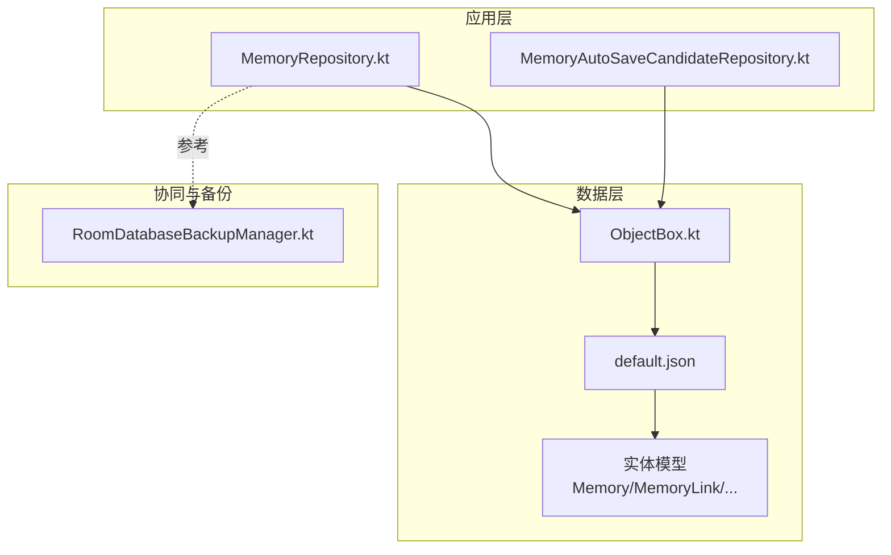
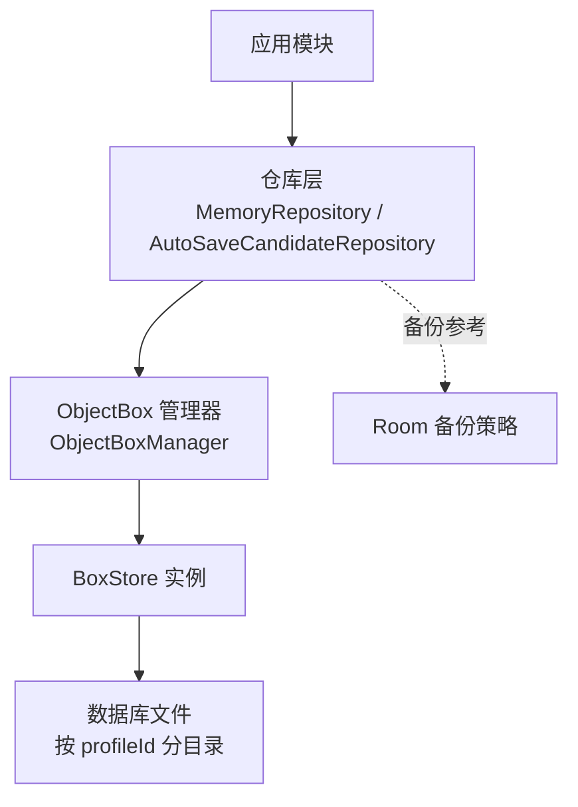
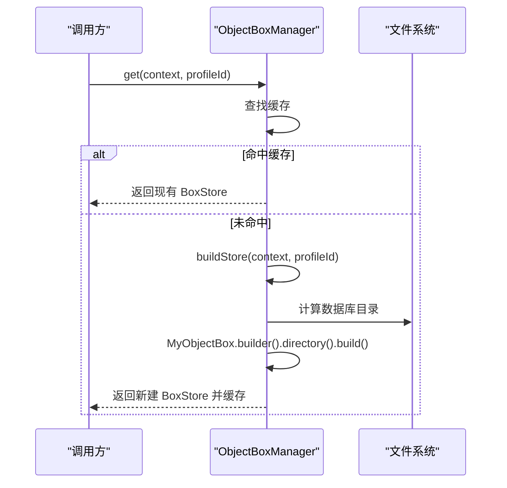
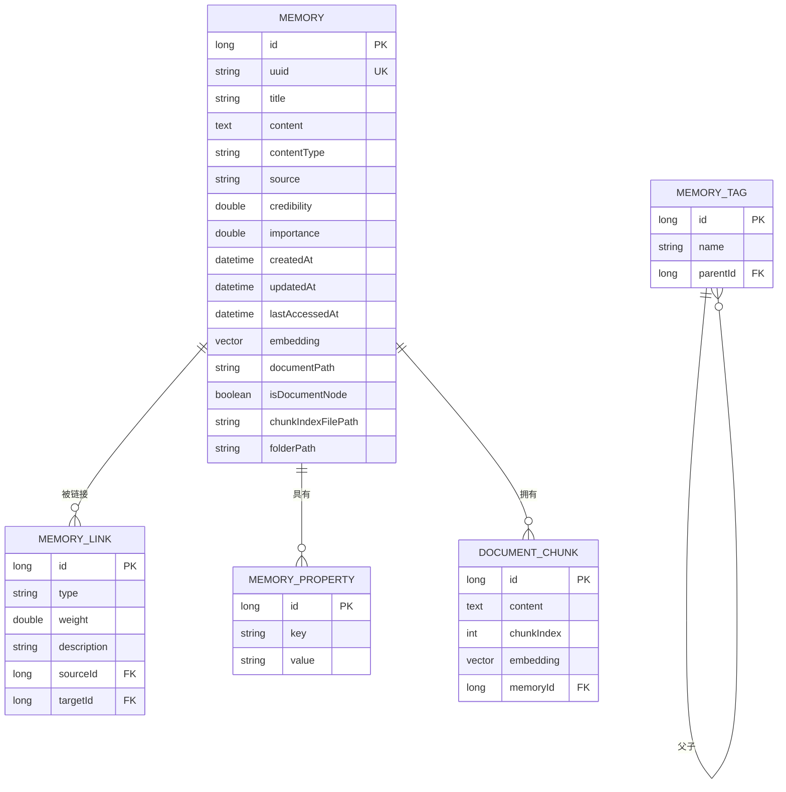
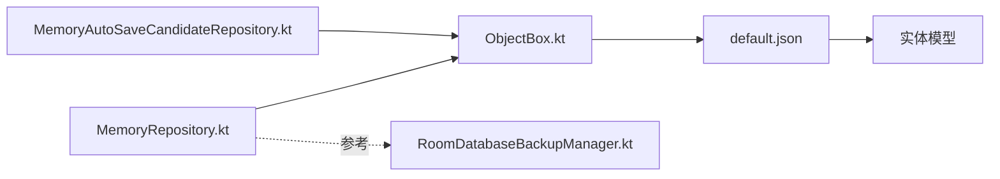

# ObjectBox 数据库集成

<cite>
**本文引用的文件**   
- [ObjectBox.kt](file://app/src/main/java/com/ai/assistance/operit/data/db/ObjectBox.kt)
- [default.json](file://app/objectbox-models/default.json)
- [default.json.bak](file://app/objectbox-models/default.json.bak)
- [RoomDatabaseBackupManager.kt](file://app/src/main/java/com/ai/assistance/operit/data/backup/RoomDatabaseBackupManager.kt)
- [MemoryRepository.kt](file://app/src/main/java/com/ai/assistance/operit/data/repository/MemoryRepository.kt)
- [MemoryAutoSaveCandidateRepository.kt](file://app/src/main/java/com/ai/assistance/operit/data/repository/MemoryAutoSaveCandidateRepository.kt)
- [DocumentChunk.kt](file://app/src/main/java/com/ai/assistance/operit/data/model/DocumentChunk.kt)
- [Memory.kt](file://app/src/main/java/com/ai/assistance/operit/data/model/Memory.kt)
- [MemoryLink.kt](file://app/src/main/java/com/ai/assistance/operit/data/model/MemoryLink.kt)
- [MemoryProperty.kt](file://app/src/main/java/com/ai/assistance/operit/data/model/MemoryProperty.kt)
- [MemoryTag.kt](file://app/src/main/java/com/ai/assistance/operit/data/model/MemoryTag.kt)
</cite>

## 目录
1. [简介](#简介)
2. [项目结构](#项目结构)
3. [核心组件](#核心组件)
4. [架构总览](#架构总览)
5. [详细组件分析](#详细组件分析)
6. [依赖分析](#依赖分析)
7. [性能考虑](#性能考虑)
8. [故障排查指南](#故障排查指南)
9. [结论](#结论)
10. [附录](#附录)

## 简介
本文件系统性梳理 Operit 中 ObjectBox 数据库的集成方案，覆盖初始化配置、模型定义、数据库路径管理、查询优化、与 Room 的协同备份策略、内存管理与并发访问等主题。文档同时提供面向开发者的扩展与优化建议，帮助在保持向后兼容的前提下持续演进数据层。

## 项目结构
ObjectBox 在本项目中的落地主要由以下部分组成：
- 模型定义：位于 app/objectbox-models/default.json，描述实体、属性、索引与关系，并包含模型版本信息与退休 ID 列表。
- 存储管理：位于 app/src/main/java/com/ai/assistance/operit/data/db/ObjectBox.kt，负责 BoxStore 的按配置文件（profileId）实例化、目录选择、生命周期管理与物理删除。
- 实体模型：位于 app/src/main/java/com/ai/assistance/operit/data/model/ 下，对应 default.json 中的实体，如 Memory、MemoryLink、MemoryProperty、MemoryTag、DocumentChunk。
- 备份与协同：RoomDatabaseBackupManager.kt 展示了与 Room 协同的备份策略，ObjectBox 当前未直接实现备份工具，但可借鉴其“检查点/落盘”思路进行一致性保障。

**图表来源**
- [ObjectBox.kt:1-61](file://app/src/main/java/com/ai/assistance/operit/data/db/ObjectBox.kt#L1-L61)
- [default.json:1-359](file://app/objectbox-models/default.json#L1-L359)
- [RoomDatabaseBackupManager.kt:1-216](file://app/src/main/java/com/ai/assistance/operit/data/backup/RoomDatabaseBackupManager.kt#L1-L216)

**章节来源**
- [ObjectBox.kt:1-61](file://app/src/main/java/com/ai/assistance/operit/data/db/ObjectBox.kt#L1-L61)
- [default.json:1-359](file://app/objectbox-models/default.json#L1-L359)
- [RoomDatabaseBackupManager.kt:1-216](file://app/src/main/java/com/ai/assistance/operit/data/backup/RoomDatabaseBackupManager.kt#L1-L216)

## 核心组件
- ObjectBox 管理器（ObjectBoxManager）
  - 提供按 profileId 的 BoxStore 单例缓存与并发安全管理。
  - 支持按需构建、关闭与物理删除数据库目录，兼容旧版默认数据库命名。
- 模型定义（default.json）
  - 统一声明实体、属性、索引与关系，包含模型版本、最小解析器版本、退休 ID 清单与版本号。
- 实体模型（Kotlin 映射）
  - 通过注解生成的实体类与仓库层交互，支撑查询、插入、更新与删除。

**章节来源**
- [ObjectBox.kt:9-60](file://app/src/main/java/com/ai/assistance/operit/data/db/ObjectBox.kt#L9-L60)
- [default.json:307-359](file://app/objectbox-models/default.json#L307-L359)

## 架构总览
ObjectBox 在 Operit 中作为本地轻量级嵌入式数据库，承担非结构化/半结构化数据的高效存储与检索任务；与 Room 的协同体现在备份策略层面，确保跨存储的一致性与可恢复性。

**图表来源**
- [ObjectBox.kt:13-31](file://app/src/main/java/com/ai/assistance/operit/data/db/ObjectBox.kt#L13-L31)
- [RoomDatabaseBackupManager.kt:69-109](file://app/src/main/java/com/ai/assistance/operit/data/backup/RoomDatabaseBackupManager.kt#L69-L109)

## 详细组件分析

### ObjectBox 初始化与数据库路径管理
- 按配置文件（profileId）构建 BoxStore，支持默认与自定义目录名，避免多用户或多会话场景下的冲突。
- 使用线程安全的并发容器缓存已创建的 Store，减少重复初始化开销。
- 提供关闭与物理删除能力，删除时先关闭再递归删除目录，保证资源释放与磁盘清理。

**图表来源**
- [ObjectBox.kt:13-31](file://app/src/main/java/com/ai/assistance/operit/data/db/ObjectBox.kt#L13-L31)

**章节来源**
- [ObjectBox.kt:9-60](file://app/src/main/java/com/ai/assistance/operit/data/db/ObjectBox.kt#L9-L60)

### 模型定义与实体关系
default.json 描述了如下关键实体与关系：
- Memory：核心记忆体实体，包含标识、元信息、时间戳、嵌入向量、文档路径与节点标记等。
- MemoryLink：记忆体之间的链接，具备权重与描述，使用双向索引指向 Memory。
- MemoryProperty：键值对属性集合，用于扩展元数据。
- MemoryTag：标签树，支持父子关系，具备自引用索引。
- DocumentChunk：文档分片，与 Memory 建立一对多关系，便于向量化检索与分页。

**图表来源**
- [default.json:9-301](file://app/objectbox-models/default.json#L9-L301)

**章节来源**
- [default.json:1-359](file://app/objectbox-models/default.json#L1-L359)

### default.json 的结构与作用
- 版本与兼容性
  - modelVersion 与 modelVersionParserMinimum 用于控制模型解析与迁移策略。
  - version 字段指示模型文件格式版本，配合生成器使用。
- 退休 ID 列表
  - retiredEntityUids / retiredIndexUids / retiredPropertyUids / retiredRelationUids 用于历史兼容与迁移清理。
- 索引与标志位
  - 属性上的 indexId 与 flags（如 2048、520）表明索引与关系目标，影响查询性能与外键约束。

**章节来源**
- [default.json:307-359](file://app/objectbox-models/default.json#L307-L359)
- [default.json.bak:251-303](file://app/objectbox-models/default.json.bak#L251-L303)

### 查询优化与索引策略
- 基于索引的查询
  - Memory.folderPath、MemoryLink.sourceId/targetId、MemoryTag.parentId、DocumentChunk.memoryId 等均声明了 indexId，适合高频过滤与连接查询。
- 关系与连接
  - Memory.tags、Memory.properties、Memory.links 等关系定义，结合索引可实现高效的多表联结。
- 嵌入向量检索
  - embedding 字段类型为向量，适合相似度检索或 ANN 索引（需结合 ObjectBox 向量能力与查询构建器）。

**章节来源**
- [default.json:89-93](file://app/objectbox-models/default.json#L89-L93)
- [default.json:141-154](file://app/objectbox-models/default.json#L141-L154)
- [default.json:200-205](file://app/objectbox-models/default.json#L200-L205)
- [default.json:237-242](file://app/objectbox-models/default.json#L237-L242)

### 与 Room 的协同工作方式
- 备份策略参考
  - RoomDatabaseBackupManager.kt 展示了 WAL 检查点、压缩打包与保留策略，可借鉴到 ObjectBox 的一致性保障中（如写前刷盘、事务提交后落盘）。
- 数据同步与冲突处理
  - 项目中未见直接的 ObjectBox 与 Room 同步逻辑，建议采用“单源写入 + 外部导出/导入”的策略：写入端选择一种存储，另一端定期导出/导入以保持一致。

**章节来源**
- [RoomDatabaseBackupManager.kt:69-109](file://app/src/main/java/com/ai/assistance/operit/data/backup/RoomDatabaseBackupManager.kt#L69-L109)

### 内存管理与并发访问
- 对象生命周期
  - 通过 ObjectBoxManager 缓存 BoxStore，避免频繁打开/关闭带来的 IO 开销；在应用退出或切换用户时显式关闭或删除。
- 并发与锁
  - 使用 synchronized 与并发容器保护 Store 实例，防止并发初始化与竞态条件。
- 垃圾回收与内存泄漏预防
  - 确保在不再使用时关闭 BoxStore；避免持有实体对象过长生命周期导致的内存占用；对大字段（如 embedding、content）谨慎缓存。

**章节来源**
- [ObjectBox.kt:9-60](file://app/src/main/java/com/ai/assistance/operit/data/db/ObjectBox.kt#L9-L60)

### 实现示例与最佳实践
- 数据持久化
  - 使用仓库层（如 MemoryRepository）获取 BoxStore，执行实体的保存、更新与删除操作。
- 复杂查询
  - 结合索引字段进行 where 条件过滤，利用关系字段进行 join 查询；对向量字段使用相似度查询（需结合 ObjectBox 查询构建器）。
- 大数据量存储
  - 分批写入、批量查询；对大文本字段采用分片存储（如 DocumentChunk），并维护索引字段以加速检索。

**章节来源**
- [MemoryRepository.kt](file://app/src/main/java/com/ai/assistance/operit/data/repository/MemoryRepository.kt)
- [MemoryAutoSaveCandidateRepository.kt](file://app/src/main/java/com/ai/assistance/operit/data/repository/MemoryAutoSaveCandidateRepository.kt)
- [DocumentChunk.kt](file://app/src/main/java/com/ai/assistance/operit/data/model/DocumentChunk.kt)

## 依赖分析
- 组件耦合
  - 仓库层依赖 ObjectBoxManager 获取 BoxStore；实体模型依赖 default.json 的定义。
- 外部依赖
  - ObjectBox 运行时与生成器；Room 备份策略作为协同参考。
- 潜在风险
  - 模型变更需同步更新 default.json 与生成代码；索引与关系变更可能影响查询性能，应做回归测试。

**图表来源**
- [ObjectBox.kt:1-61](file://app/src/main/java/com/ai/assistance/operit/data/db/ObjectBox.kt#L1-L61)
- [default.json:1-359](file://app/objectbox-models/default.json#L1-L359)
- [RoomDatabaseBackupManager.kt:1-216](file://app/src/main/java/com/ai/assistance/operit/data/backup/RoomDatabaseBackupManager.kt#L1-L216)

**章节来源**
- [ObjectBox.kt:1-61](file://app/src/main/java/com/ai/assistance/operit/data/db/ObjectBox.kt#L1-L61)
- [default.json:1-359](file://app/objectbox-models/default.json#L1-L359)
- [RoomDatabaseBackupManager.kt:1-216](file://app/src/main/java/com/ai/assistance/operit/data/backup/RoomDatabaseBackupManager.kt#L1-L216)

## 性能考虑
- 索引优先：对高频过滤与排序字段建立索引（如 folderPath、sourceId/targetId、parentId、memoryId）。
- 查询构建：使用查询构建器组合 where、order、limit，避免一次性加载超大数据集。
- 批处理：大批量写入采用事务包裹，减少 IO 次数。
- 向量检索：对 embedding 字段使用相似度查询时，注意查询范围与阈值设置，避免全表扫描。
- 存储布局：按 profileId 分目录存放，避免多进程/多用户竞争导致的锁争用。

[本节为通用指导，无需具体文件分析]

## 故障排查指南
- 数据库无法打开
  - 检查 profileId 是否正确；确认数据库目录存在且有读写权限；必要时调用 delete 删除后重建。
- 查询性能差
  - 核对 default.json 中是否为相关字段建立了索引；检查查询条件是否能命中索引。
- 模型不匹配
  - 若 default.json 发生变更，需重新生成实体代码并清理旧数据；关注 retired* 列表，避免误用已退休 ID。
- 备份与恢复
  - 可参考 RoomDatabaseBackupManager.kt 的 WAL 检查点与打包策略，确保写入一致性。

**章节来源**
- [ObjectBox.kt:43-52](file://app/src/main/java/com/ai/assistance/operit/data/db/ObjectBox.kt#L43-L52)
- [RoomDatabaseBackupManager.kt:76-80](file://app/src/main/java/com/ai/assistance/operit/data/backup/RoomDatabaseBackupManager.kt#L76-L80)

## 结论
ObjectBox 在 Operit 中承担了高灵活性与高性能的本地存储职责，结合清晰的模型定义与严格的索引策略，能够满足复杂查询与向量检索需求。通过与 Room 的备份策略协同，可在不引入额外同步逻辑的前提下，保障数据一致性与可恢复性。建议在后续迭代中持续完善查询构建器使用、索引覆盖与批处理策略，以进一步提升吞吐与稳定性。

[本节为总结，无需具体文件分析]

## 附录

### 扩展与优化指导
- 添加新模型
  - 在 default.json 中新增实体与属性，分配唯一 ID；运行生成器生成实体类；在仓库层编写 CRUD 与查询方法。
- 优化查询性能
  - 为热点字段建立索引；使用查询构建器组合 where 与 order；对大结果集分页或流式处理。
- 并发访问
  - 使用 ObjectBoxManager 的缓存与锁；在业务层避免长时间持有实体对象；合理拆分读写事务。

**章节来源**
- [default.json:1-359](file://app/objectbox-models/default.json#L1-L359)
- [ObjectBox.kt:9-60](file://app/src/main/java/com/ai/assistance/operit/data/db/ObjectBox.kt#L9-L60)