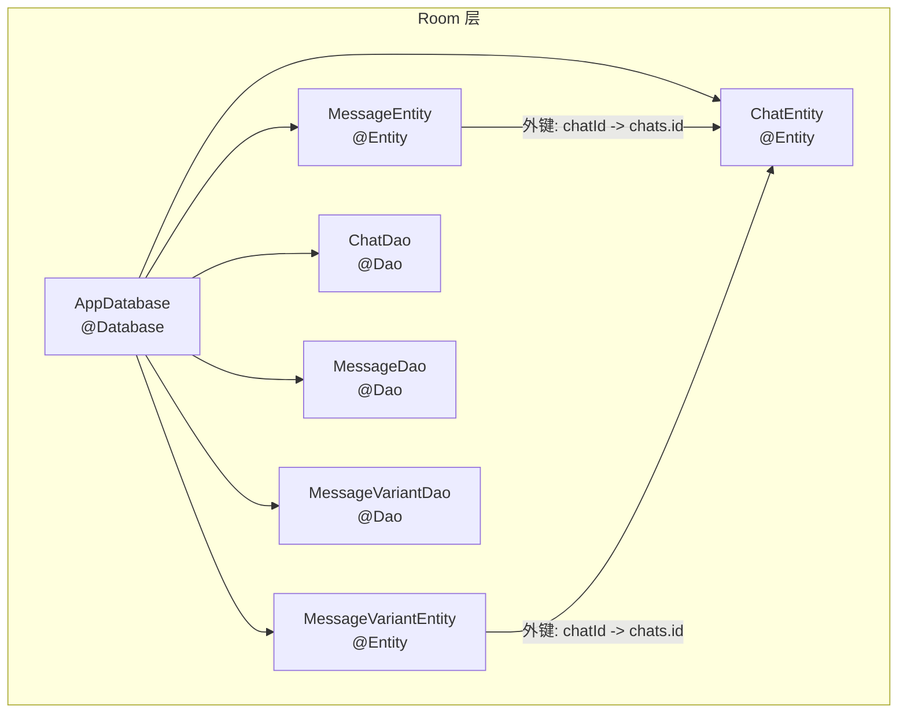
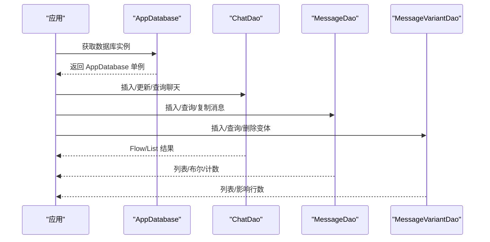
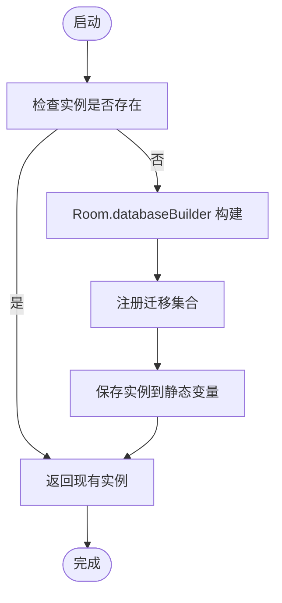
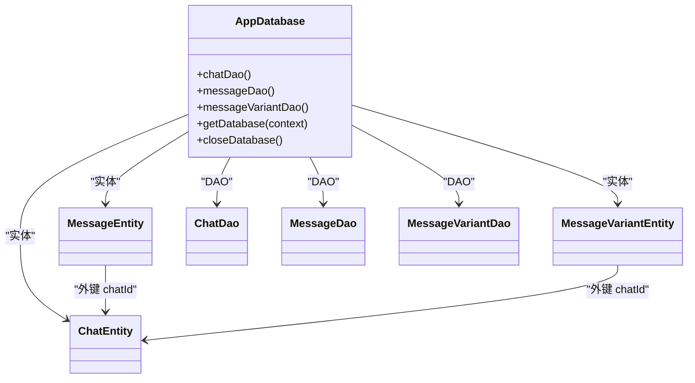

# Room 数据库设计

<cite>
**本文引用的文件**
- [AppDatabase.kt](file://app/src/main/java/com/ai/assistance/operit/data/db/AppDatabase.kt)
- [ChatEntity.kt](file://app/src/main/java/com/ai/assistance/operit/data/model/ChatEntity.kt)
- [MessageEntity.kt](file://app/src/main/java/com/ai/assistance/operit/data/model/MessageEntity.kt)
- [MessageVariantEntity.kt](file://app/src/main/java/com/ai/assistance/operit/data/model/MessageVariantEntity.kt)
- [ChatDao.kt](file://app/src/main/java/com/ai/assistance/operit/data/dao/ChatDao.kt)
- [MessageDao.kt](file://app/src/main/java/com/ai/assistance/operit/data/dao/MessageDao.kt)
- [MessageVariantDao.kt](file://app/src/main/java/com/ai/assistance/operit/data/dao/MessageVariantDao.kt)
</cite>

## 目录
1. [简介](#简介)
2. [项目结构](#项目结构)
3. [核心组件](#核心组件)
4. [架构总览](#架构总览)
5. [详细组件分析](#详细组件分析)
6. [依赖分析](#依赖分析)
7. [性能考虑](#性能考虑)
8. [故障排查指南](#故障排查指南)
9. [结论](#结论)
10. [附录](#附录)

## 简介
本文件围绕 Operit 的 Room 数据库设计进行系统化技术说明，重点覆盖以下方面：
- AppDatabase 的整体架构、数据库版本管理与迁移策略
- 实体关系映射与数据模型设计（ChatEntity、MessageEntity、MessageVariantEntity）
- DAO 接口设计模式与常用查询方法
- 索引策略（单列索引、复合索引）及其性能优化
- 典型使用方式（数据操作、复杂查询、事务处理）
- Room 注解最佳实践与扩展建议（新增表、查询优化、大数据量场景）

## 项目结构
Operit 的数据库层采用典型的 Room 分层组织：
- 数据库定义：AppDatabase（@Database）
- 实体模型：ChatEntity、MessageEntity、MessageVariantEntity（@Entity）
- 访问接口：ChatDao、MessageDao、MessageVariantDao（@Dao）
- 关系与索引：外键约束、单列/复合索引在实体与迁移脚本中统一体现

图表来源
- [AppDatabase.kt:16-31](file://app/src/main/java/com/ai/assistance/operit/data/db/AppDatabase.kt#L16-L31)
- [ChatEntity.kt:9-11](file://app/src/main/java/com/ai/assistance/operit/data/model/ChatEntity.kt#L9-L11)
- [MessageEntity.kt:8-20](file://app/src/main/java/com/ai/assistance/operit/data/model/MessageEntity.kt#L8-L20)
- [MessageVariantEntity.kt:8-22](file://app/src/main/java/com/ai/assistance/operit/data/model/MessageVariantEntity.kt#L8-L22)

章节来源
- [AppDatabase.kt:16-31](file://app/src/main/java/com/ai/assistance/operit/data/db/AppDatabase.kt#L16-L31)
- [ChatEntity.kt:9-11](file://app/src/main/java/com/ai/assistance/operit/data/model/ChatEntity.kt#L9-L11)
- [MessageEntity.kt:8-20](file://app/src/main/java/com/ai/assistance/operit/data/model/MessageEntity.kt#L8-L20)
- [MessageVariantEntity.kt:8-22](file://app/src/main/java/com/ai/assistance/operit/data/model/MessageVariantEntity.kt#L8-L22)

## 核心组件
- AppDatabase：集中声明实体、版本号、Schema 导出开关与迁移集合；提供单例构建器与关闭逻辑
- ChatEntity：聊天元数据，包含标识、标题、时间戳、令牌用量、窗口大小、分组、工作区、角色卡绑定、锁定等
- MessageEntity：消息记录，包含发送者、内容、时间戳、顺序索引、角色名、变体索引、提供商/模型、令牌用量、耗时统计、展示模式、收藏标记等
- MessageVariantEntity：消息变体，支持同一消息时间点的多版本内容与参数，通过 chatId+messageTimestamp+variantIndex 唯一约束
- ChatDao：聊天 CRUD、分组/角色卡绑定、统计查询、分支对话查询等
- MessageDao：消息范围查询、计数、预览、复制、收藏标记、搜索等
- MessageVariantDao：变体查询、插入、复制、删除等

章节来源
- [AppDatabase.kt:16-335](file://app/src/main/java/com/ai/assistance/operit/data/db/AppDatabase.kt#L16-L335)
- [ChatEntity.kt:9-92](file://app/src/main/java/com/ai/assistance/operit/data/model/ChatEntity.kt#L9-L92)
- [MessageEntity.kt:8-95](file://app/src/main/java/com/ai/assistance/operit/data/model/MessageEntity.kt#L8-L95)
- [MessageVariantEntity.kt:8-83](file://app/src/main/java/com/ai/assistance/operit/data/model/MessageVariantEntity.kt#L8-L83)
- [ChatDao.kt:13-284](file://app/src/main/java/com/ai/assistance/operit/data/dao/ChatDao.kt#L13-L284)
- [MessageDao.kt:11-284](file://app/src/main/java/com/ai/assistance/operit/data/dao/MessageDao.kt#L11-L284)
- [MessageVariantDao.kt:10-111](file://app/src/main/java/com/ai/assistance/operit/data/dao/MessageVariantDao.kt#L10-L111)

## 架构总览
Room 数据库采用“单例 + 版本迁移 + 外键 + 索引”的设计，确保：
- 数据一致性：通过外键级联删除保证消息与变体随聊天删除而清理
- 查询效率：针对高频查询建立单列与复合索引
- 可演进性：版本号递增，迁移脚本逐步添加列与索引

图表来源
- [AppDatabase.kt:290-322](file://app/src/main/java/com/ai/assistance/operit/data/db/AppDatabase.kt#L290-L322)
- [ChatDao.kt:17-26](file://app/src/main/java/com/ai/assistance/operit/data/dao/ChatDao.kt#L17-L26)
- [MessageDao.kt:18-21](file://app/src/main/java/com/ai/assistance/operit/data/dao/MessageDao.kt#L18-L21)
- [MessageVariantDao.kt:12-15](file://app/src/main/java/com/ai/assistance/operit/data/dao/MessageVariantDao.kt#L12-L15)

## 详细组件分析

### AppDatabase 设计与版本管理
- 实体清单与版本：声明三个实体，当前版本为 18，禁用 Schema 导出
- 单例构建：线程安全的懒加载单例，使用 Room.databaseBuilder 配置
- 迁移策略：覆盖从 1→2 至 17→18 的完整迁移链，涵盖列添加、索引创建、表重建等
- 关闭机制：提供显式关闭并释放引用，避免内存泄漏

图表来源
- [AppDatabase.kt:289-322](file://app/src/main/java/com/ai/assistance/operit/data/db/AppDatabase.kt#L289-L322)

章节来源
- [AppDatabase.kt:16-335](file://app/src/main/java/com/ai/assistance/operit/data/db/AppDatabase.kt#L16-L335)

### 实体关系与数据模型设计

#### ChatEntity（聊天元数据）
- 主键：String 类型的 id（默认随机生成）
- 时间戳：createdAt、updatedAt
- 令牌统计：inputTokens、outputTokens
- 窗口与排序：currentWindowSize、displayOrder
- 分组与工作区：group、workspace、workspaceEnv
- 父子关系：parentChatId 支持分支对话
- 绑定：characterCardName、characterGroupId（互斥）
- 锁定：locked 字段防止删除
- 转换：提供 toChatHistory/fromChatHistory 用于 UI 层转换

章节来源
- [ChatEntity.kt:9-92](file://app/src/main/java/com/ai/assistance/operit/data/model/ChatEntity.kt#L9-L92)

#### MessageEntity（消息记录）
- 主键：自增 messageId
- 外键：chatId → chats.id（级联删除）
- 索引：单列 chatId；复合索引 (chatId, timestamp)
- 内容与元信息：sender、content、timestamp、orderIndex
- 角色与变体：roleName、selectedVariantIndex
- 提供商与模型：provider、modelName
- 令牌与耗时：inputTokens、outputTokens、cachedInputTokens、sentAt、outputDurationMs、waitDurationMs
- 展示模式与收藏：displayMode、isFavorite

章节来源
- [MessageEntity.kt:8-95](file://app/src/main/java/com/ai/assistance/operit/data/model/MessageEntity.kt#L8-L95)

#### MessageVariantEntity（消息变体）
- 主键：自增 variantId
- 外键：chatId → chats.id（级联删除）
- 索引：(chatId, messageTimestamp)、(chatId, messageTimestamp, variantIndex) 唯一
- 字段：messageTimestamp、variantIndex、content、角色/提供商/模型、令牌与耗时统计

章节来源
- [MessageVariantEntity.kt:8-83](file://app/src/main/java/com/ai/assistance/operit/data/model/MessageVariantEntity.kt#L8-L83)

### DAO 接口设计与查询方法

#### ChatDao
- 基础查询：按 displayOrder 获取全部聊天；按 id 获取单聊
- 元数据更新：标题、工作区、分组、角色卡/群组绑定、锁定状态、顺序与分组等
- 批量更新：支持批量更新分组、角色卡/群组绑定、聊天列表
- 分组管理：重命名分组、删除分组内未锁定聊天、将分组内聊天移动到未分组
- 角色卡/群组统计：按角色卡/群组统计聊天与消息数量
- 分支对话：根据 parentChatId 查询主/分支对话

章节来源
- [ChatDao.kt:13-284](file://app/src/main/java/com/ai/assistance/operit/data/dao/ChatDao.kt#L13-L284)

#### MessageDao
- 范围查询：按 chatId 与时间戳区间查询消息；支持升序/降序、限制条数
- 计数与存在性：按时间上限计数、是否存在某时间前/后消息
- 预览与定位：生成消息预览（长度、内容片段、展示模式、收藏标记）
- 复制：将源聊天的消息复制到目标聊天（可选时间上限）
- 更新：整条消息更新、内容更新、变体索引更新、收藏标记更新
- 搜索：按内容关键词检索聊天 ID（去重）
- 角色名重命名：批量重命名角色名

章节来源
- [MessageDao.kt:11-284](file://app/src/main/java/com/ai/assistance/operit/data/dao/MessageDao.kt#L11-L284)

#### MessageVariantDao
- 查询：按聊天、按消息时间戳、按变体索引查询变体
- 插入：单条/批量插入变体
- 复制：将源聊天的变体复制到目标聊天（可选时间上限）
- 更新与删除：按变体索引更新、按变体索引删除、按消息时间戳删除、按聊天清空

章节来源
- [MessageVariantDao.kt:10-111](file://app/src/main/java/com/ai/assistance/operit/data/dao/MessageVariantDao.kt#L10-L111)

### 索引策略与性能优化
- 单列索引
  - messages.chatId：用于按聊天筛选消息
  - messages.(chatId, timestamp)：用于按聊天与时间范围高效查询
- 复合索引
  - message_variants.(chatId, messageTimestamp)：加速按聊天与消息时间戳查询
  - message_variants.(chatId, messageTimestamp, variantIndex) 唯一：保证同一消息的变体唯一性
- 迁移脚本中的索引创建：在版本升级时逐步添加索引，避免全表扫描
- 性能建议
  - 针对高频查询（按 chatId 与时间范围）优先使用复合索引
  - 对于大结果集的预览查询，控制返回字段与长度
  - 使用 Flow 或挂起函数结合协程，避免阻塞主线程

章节来源
- [MessageEntity.kt:19](file://app/src/main/java/com/ai/assistance/operit/data/model/MessageEntity.kt#L19)
- [MessageVariantEntity.kt:18-21](file://app/src/main/java/com/ai/assistance/operit/data/model/MessageVariantEntity.kt#L18-L21)
- [AppDatabase.kt:70-72](file://app/src/main/java/com/ai/assistance/operit/data/db/AppDatabase.kt#L70-L72)
- [AppDatabase.kt:166-172](file://app/src/main/java/com/ai/assistance/operit/data/db/AppDatabase.kt#L166-L172)
- [AppDatabase.kt:188](file://app/src/main/java/com/ai/assistance/operit/data/db/AppDatabase.kt#L188)

### Room 注解最佳实践
- @Database
  - entities 明确列出实体类
  - version 递增，配合 Migration 列表
  - exportSchema 控制是否导出 Schema
- @Entity
  - 指定 tableName，避免默认表名
  - foreignKeys 声明外键关系，onDelete=CASCADE 保持一致性
  - indices 定义单列/复合索引，提升查询性能
- @PrimaryKey
  - 主键类型与生成策略明确（UUID vs 自增）
- @Dao
  - 方法签名清晰，区分 Flow 与挂起函数
  - 复杂 SQL 使用 Query 注解，必要时拆分为多个方法
- @Insert/@Update/@Delete
  - onConflict 策略合理选择（REPLACE/ABORT/IGNORE/FAIL/ROLLBACK）
- 复杂查询
  - 使用 CASE WHEN、LIMIT、GROUP BY、LEFT JOIN 等组合
  - 注意字段别名与返回类型一致

章节来源
- [AppDatabase.kt:16-21](file://app/src/main/java/com/ai/assistance/operit/data/db/AppDatabase.kt#L16-L21)
- [ChatEntity.kt:9-11](file://app/src/main/java/com/ai/assistance/operit/data/model/ChatEntity.kt#L9-L11)
- [MessageEntity.kt:8-20](file://app/src/main/java/com/ai/assistance/operit/data/model/MessageEntity.kt#L8-L20)
- [MessageVariantEntity.kt:8-22](file://app/src/main/java/com/ai/assistance/operit/data/model/MessageVariantEntity.kt#L8-L22)
- [ChatDao.kt:13](file://app/src/main/java/com/ai/assistance/operit/data/dao/ChatDao.kt#L13)
- [MessageDao.kt:11](file://app/src/main/java/com/ai/assistance/operit/data/dao/MessageDao.kt#L11)
- [MessageVariantDao.kt:10](file://app/src/main/java/com/ai/assistance/operit/data/dao/MessageVariantDao.kt#L10)

### 典型使用示例与流程

#### 使用 DAO 进行数据操作
- 插入消息并返回主键
  - 示例路径：[MessageDao.insertMessage:173-175](file://app/src/main/java/com/ai/assistance/operit/data/dao/MessageDao.kt#L173-L175)
- 批量插入消息
  - 示例路径：[MessageDao.insertMessages:177-179](file://app/src/main/java/com/ai/assistance/operit/data/dao/MessageDao.kt#L177-L179)
- 复制消息到另一个聊天
  - 示例路径：[MessageDao.copyMessagesToChat:225-229](file://app/src/main/java/com/ai/assistance/operit/data/dao/MessageDao.kt#L225-L229)
- 更新消息内容
  - 示例路径：[MessageDao.updateMessageContent:231-233](file://app/src/main/java/com/ai/assistance/operit/data/dao/MessageDao.kt#L231-L233)
- 查询聊天的最新摘要时间戳
  - 示例路径：[MessageDao.getLatestSummaryTimestamp:144-147](file://app/src/main/java/com/ai/assistance/operit/data/dao/MessageDao.kt#L144-L147)

章节来源
- [MessageDao.kt:173-233](file://app/src/main/java/com/ai/assistance/operit/data/dao/MessageDao.kt#L173-L233)

#### 实现复杂查询
- 按时间范围查询消息（支持前后边界与上限）
  - 示例路径：[MessageDao.getMessagesForChatInRangeAsc:103-108](file://app/src/main/java/com/ai/assistance/operit/data/dao/MessageDao.kt#L103-L108)
- 获取聊天消息预览（含隐藏占位符处理）
  - 示例路径：[MessageDao.getLocatorPreviewsForChat:50-53](file://app/src/main/java/com/ai/assistance/operit/data/dao/MessageDao.kt#L50-L53)
- 按角色卡统计聊天与消息数量
  - 示例路径：[ChatDao.getCharacterCardChatStats:246-263](file://app/src/main/java/com/ai/assistance/operit/data/dao/ChatDao.kt#L246-L263)

章节来源
- [MessageDao.kt:50-108](file://app/src/main/java/com/ai/assistance/operit/data/dao/MessageDao.kt#L50-L108)
- [ChatDao.kt:246-263](file://app/src/main/java/com/ai/assistance/operit/data/dao/ChatDao.kt#L246-L263)

#### 处理事务
- Room 支持在数据库层执行事务，可在 DAO 中通过 Room 提供的事务 API 包裹多个写操作，确保原子性
- 建议：将“先删除旧变体，再插入新变体”、“复制消息与变体”等成组写操作放入单个事务中

[本节为通用指导，无需具体文件引用]

### 扩展与最佳实践
- 新增表
  - 在 @Database.entities 中加入新实体类
  - 在 AppDatabase 中添加 Migration，逐步添加列与索引
  - 在 DAO 中定义查询/更新方法，必要时增加索引
- 查询优化
  - 优先使用复合索引覆盖常见查询条件
  - 对大结果集使用 LIMIT 与分页
  - 使用 Flow 进行响应式查询，避免阻塞
- 大数据量场景
  - 合理拆分表或引入分区字段
  - 定期清理历史数据（如按时间上限删除）
  - 使用批量操作减少事务次数

[本节为通用指导，无需具体文件引用]

## 依赖分析
- 组件耦合
  - AppDatabase 聚合实体与 DAO，DAO 依赖实体模型
  - MessageEntity 与 MessageVariantEntity 通过外键关联 ChatEntity
- 外部依赖
  - Room 运行时、SQLite 支持库
- 循环依赖
  - 无直接循环依赖，遵循单向依赖（DB→Entities/DAO→Models）

图表来源
- [AppDatabase.kt:16-31](file://app/src/main/java/com/ai/assistance/operit/data/db/AppDatabase.kt#L16-L31)
- [ChatEntity.kt:9-11](file://app/src/main/java/com/ai/assistance/operit/data/model/ChatEntity.kt#L9-L11)
- [MessageEntity.kt:8-20](file://app/src/main/java/com/ai/assistance/operit/data/model/MessageEntity.kt#L8-L20)
- [MessageVariantEntity.kt:8-22](file://app/src/main/java/com/ai/assistance/operit/data/model/MessageVariantEntity.kt#L8-L22)

## 性能考虑
- 索引命中：针对高频查询（chatId、(chatId, timestamp)、(chatId, messageTimestamp, variantIndex)）建立索引
- 查询裁剪：仅返回必要字段，使用 LIMIT 控制结果集大小
- 流式查询：使用 Flow 实时响应数据库变化，避免一次性加载大量数据
- 批量操作：合并多次写入为批量插入/更新，减少事务开销

[本节为通用指导，无需具体文件引用]

## 故障排查指南
- 数据库版本不匹配
  - 现象：升级后崩溃或数据丢失
  - 处理：确认 Migration 列表完整，逐版本验证 SQL 正确性
  - 参考路径：[AppDatabase 迁移定义:36-335](file://app/src/main/java/com/ai/assistance/operit/data/db/AppDatabase.kt#L36-L335)
- 外键约束失败
  - 现象：删除聊天时报外键错误
  - 处理：确认外键级联删除配置正确，或先删除子表数据
  - 参考路径：[MessageEntity 外键:11-18](file://app/src/main/java/com/ai/assistance/operit/data/model/MessageEntity.kt#L11-L18)、[MessageVariantEntity 外键:10-17](file://app/src/main/java/com/ai/assistance/operit/data/model/MessageVariantEntity.kt#L10-L17)
- 查询性能差
  - 现象：按时间范围查询慢
  - 处理：确认索引存在且被使用，必要时调整查询条件
  - 参考路径：[消息复合索引](file://app/src/main/java/com/ai/assistance/operit/data/model/MessageEntity.kt#L19)、[变体复合索引:18-21](file://app/src/main/java/com/ai/assistance/operit/data/model/MessageVariantEntity.kt#L18-L21)

章节来源
- [AppDatabase.kt:36-335](file://app/src/main/java/com/ai/assistance/operit/data/db/AppDatabase.kt#L36-L335)
- [MessageEntity.kt:11-18](file://app/src/main/java/com/ai/assistance/operit/data/model/MessageEntity.kt#L11-L18)
- [MessageVariantEntity.kt:10-17](file://app/src/main/java/com/ai/assistance/operit/data/model/MessageVariantEntity.kt#L10-L17)
- [MessageEntity.kt:19](file://app/src/main/java/com/ai/assistance/operit/data/model/MessageEntity.kt#L19)
- [MessageVariantEntity.kt:18-21](file://app/src/main/java/com/ai/assistance/operit/data/model/MessageVariantEntity.kt#L18-L21)

## 结论
Operit 的 Room 数据库设计以“一致性 + 性能 + 可演进性”为核心目标：
- 通过外键与级联删除保障数据完整性
- 通过单列/复合索引覆盖高频查询路径
- 通过版本化迁移与单例构建器确保升级与稳定性
- DAO 层提供丰富的查询与批处理能力，满足复杂业务需求

[本节为总结性内容，无需具体文件引用]

## 附录
- 常用注解速查
  - @Database：声明实体、版本、迁移
  - @Entity：声明表名、外键、索引
  - @PrimaryKey：主键类型与生成策略
  - @Dao：声明 DAO 接口
  - @Query/@Insert/@Update/@Delete：声明 SQL 与冲突策略
- 建议的后续优化方向
  - 引入数据库只读副本与后台线程查询
  - 对超大聊天会话引入分页/游标式加载
  - 增加查询缓存与失效策略

[本节为通用指导，无需具体文件引用]