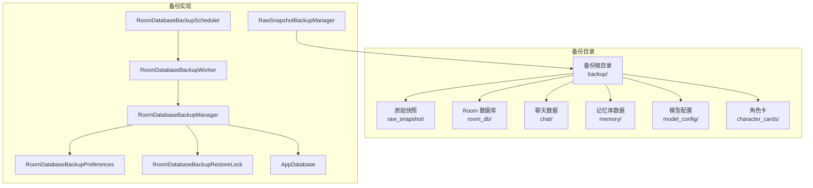
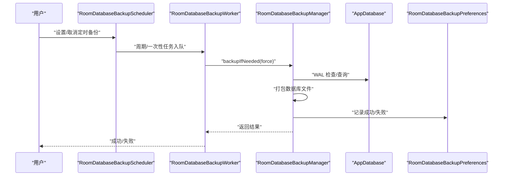
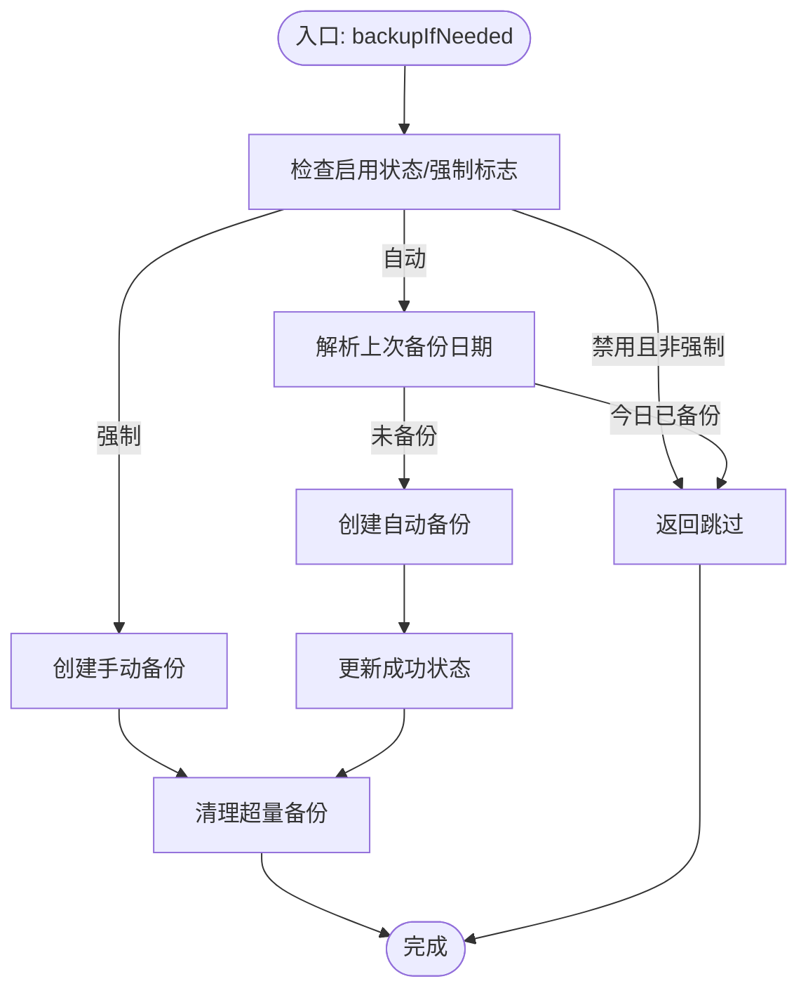
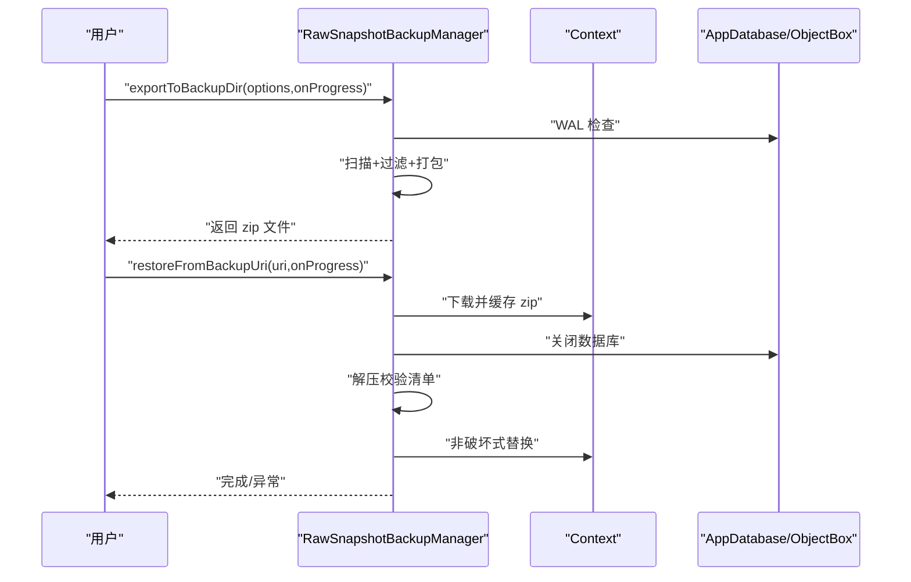
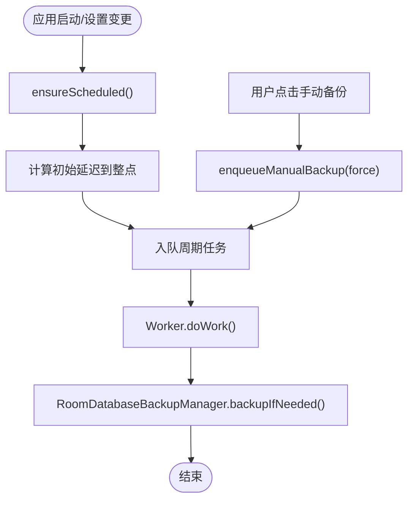
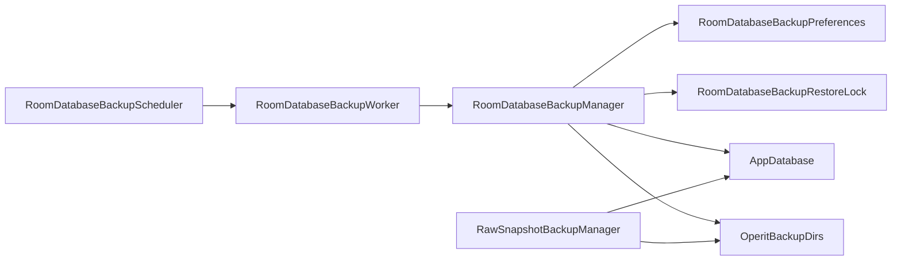

# 备份恢复系统

<cite>
**本文引用的文件**
- [OperitBackupDirs.kt](file://app/src/main/java/com/ai/assistance/operit/data/backup/OperitBackupDirs.kt)
- [RawSnapshotBackupManager.kt](file://app/src/main/java/com/ai/assistance/operit/data/backup/RawSnapshotBackupManager.kt)
- [RoomDatabaseBackupManager.kt](file://app/src/main/java/com/ai/assistance/operit/data/backup/RoomDatabaseBackupManager.kt)
- [RoomDatabaseBackupScheduler.kt](file://app/src/main/java/com/ai/assistance/operit/data/backup/RoomDatabaseBackupScheduler.kt)
- [RoomDatabaseBackupWorker.kt](file://app/src/main/java/com/ai/assistance/operit/data/backup/RoomDatabaseBackupWorker.kt)
- [RoomDatabaseBackupPreferences.kt](file://app/src/main/java/com/ai/assistance/operit/data/backup/RoomDatabaseBackupPreferences.kt)
- [RoomDatabaseBackupRestoreLock.kt](file://app/src/main/java/com/ai/assistance/operit/data/backup/RoomDatabaseBackupRestoreLock.kt)
- [AppDatabase.kt](file://app/src/main/java/com/ai/assistance/operit/data/db/AppDatabase.kt)
- [backup_rules.xml](file://app/src/main/res/xml/backup_rules.xml)
</cite>

## 目录
1. [简介](#简介)
2. [项目结构](#项目结构)
3. [核心组件](#核心组件)
4. [架构总览](#架构总览)
5. [详细组件分析](#详细组件分析)
6. [依赖关系分析](#依赖关系分析)
7. [性能考量](#性能考量)
8. [故障排查指南](#故障排查指南)
9. [结论](#结论)
10. [附录](#附录)

## 简介
本文件系统性阐述 Operit 的备份与恢复体系，覆盖以下方面：
- 备份策略设计：按需/定时备份、手动触发、自动清理
- 触发机制：WorkManager 周期任务与一次性任务
- 存储位置管理：统一备份根目录与子目录划分
- Room 数据库备份：任务调度、WAL 检查、打包压缩、去重清理
- 原始快照备份：文件系统级打包、清单校验、恢复替换
- 恢复流程：关闭数据库、解压校验、非破坏式替换、进度回调
- 安全性：文件系统访问控制、路径规范化、防路径穿越
- 错误处理：失败标记、重试建议、用户反馈
- 扩展指导：新增策略、性能优化、大容量数据处理

## 项目结构
备份与恢复相关代码集中于 app 模块的 data.backup 与 data.db 包中，并通过 Android 自动备份规则文件进行补充配置。

图表来源
- [OperitBackupDirs.kt:1-47](file://app/src/main/java/com/ai/assistance/operit/data/backup/OperitBackupDirs.kt#L1-L47)
- [RoomDatabaseBackupManager.kt:1-216](file://app/src/main/java/com/ai/assistance/operit/data/backup/RoomDatabaseBackupManager.kt#L1-L216)
- [RawSnapshotBackupManager.kt:1-589](file://app/src/main/java/com/ai/assistance/operit/data/backup/RawSnapshotBackupManager.kt#L1-L589)
- [RoomDatabaseBackupScheduler.kt:1-72](file://app/src/main/java/com/ai/assistance/operit/data/backup/RoomDatabaseBackupScheduler.kt#L1-L72)
- [RoomDatabaseBackupWorker.kt:1-40](file://app/src/main/java/com/ai/assistance/operit/data/backup/RoomDatabaseBackupWorker.kt#L1-L40)
- [RoomDatabaseBackupPreferences.kt:1-82](file://app/src/main/java/com/ai/assistance/operit/data/backup/RoomDatabaseBackupPreferences.kt#L1-L82)
- [RoomDatabaseBackupRestoreLock.kt:1-8](file://app/src/main/java/com/ai/assistance/operit/data/backup/RoomDatabaseBackupRestoreLock.kt#L1-L8)
- [AppDatabase.kt:1-335](file://app/src/main/java/com/ai/assistance/operit/data/db/AppDatabase.kt#L1-L335)

章节来源
- [OperitBackupDirs.kt:1-47](file://app/src/main/java/com/ai/assistance/operit/data/backup/OperitBackupDirs.kt#L1-L47)
- [RoomDatabaseBackupManager.kt:1-216](file://app/src/main/java/com/ai/assistance/operit/data/backup/RoomDatabaseBackupManager.kt#L1-L216)
- [RawSnapshotBackupManager.kt:1-589](file://app/src/main/java/com/ai/assistance/operit/data/backup/RawSnapshotBackupManager.kt#L1-L589)
- [RoomDatabaseBackupScheduler.kt:1-72](file://app/src/main/java/com/ai/assistance/operit/data/backup/RoomDatabaseBackupScheduler.kt#L1-L72)
- [RoomDatabaseBackupWorker.kt:1-40](file://app/src/main/java/com/ai/assistance/operit/data/backup/RoomDatabaseBackupWorker.kt#L1-L40)
- [RoomDatabaseBackupPreferences.kt:1-82](file://app/src/main/java/com/ai/assistance/operit/data/backup/RoomDatabaseBackupPreferences.kt#L1-L82)
- [RoomDatabaseBackupRestoreLock.kt:1-8](file://app/src/main/java/com/ai/assistance/operit/data/backup/RoomDatabaseBackupRestoreLock.kt#L1-L8)
- [AppDatabase.kt:1-335](file://app/src/main/java/com/ai/assistance/operit/data/db/AppDatabase.kt#L1-L335)

## 核心组件
- 备份目录管理：统一生成备份根目录与各子目录，确保存在性
- Room 数据库备份：按日/手动生成压缩包，含 WAL/SHM 文件，支持最大数量清理
- 原始快照备份：对应用数据目录进行扫描、过滤、打包，生成清单并可恢复
- 调度器：基于 WorkManager 的周期与一次性任务，带约束与延迟计算
- 工作线程：封装备份逻辑，记录成功/失败状态
- 配置存储：使用 DataStore 存储开关、最大保留数、最后成功/失败信息
- 并发锁：互斥保护备份/恢复期间的数据库访问
- 数据库：Room 数据库定义与迁移

章节来源
- [OperitBackupDirs.kt:1-47](file://app/src/main/java/com/ai/assistance/operit/data/backup/OperitBackupDirs.kt#L1-L47)
- [RoomDatabaseBackupManager.kt:1-216](file://app/src/main/java/com/ai/assistance/operit/data/backup/RoomDatabaseBackupManager.kt#L1-L216)
- [RawSnapshotBackupManager.kt:1-589](file://app/src/main/java/com/ai/assistance/operit/data/backup/RawSnapshotBackupManager.kt#L1-L589)
- [RoomDatabaseBackupScheduler.kt:1-72](file://app/src/main/java/com/ai/assistance/operit/data/backup/RoomDatabaseBackupScheduler.kt#L1-L72)
- [RoomDatabaseBackupWorker.kt:1-40](file://app/src/main/java/com/ai/assistance/operit/data/backup/RoomDatabaseBackupWorker.kt#L1-L40)
- [RoomDatabaseBackupPreferences.kt:1-82](file://app/src/main/java/com/ai/assistance/operit/data/backup/RoomDatabaseBackupPreferences.kt#L1-L82)
- [RoomDatabaseBackupRestoreLock.kt:1-8](file://app/src/main/java/com/ai/assistance/operit/data/backup/RoomDatabaseBackupRestoreLock.kt#L1-L8)
- [AppDatabase.kt:1-335](file://app/src/main/java/com/ai/assistance/operit/data/db/AppDatabase.kt#L1-L335)

## 架构总览
备份系统采用“策略-调度-执行-存储-清理”的分层设计，Room 数据库与原始快照分别由独立管理器负责；调度器通过 WorkManager 统一编排；配置与状态通过 DataStore 持久化。

图表来源
- [RoomDatabaseBackupScheduler.kt:1-72](file://app/src/main/java/com/ai/assistance/operit/data/backup/RoomDatabaseBackupScheduler.kt#L1-L72)
- [RoomDatabaseBackupWorker.kt:1-40](file://app/src/main/java/com/ai/assistance/operit/data/backup/RoomDatabaseBackupWorker.kt#L1-L40)
- [RoomDatabaseBackupManager.kt:1-216](file://app/src/main/java/com/ai/assistance/operit/data/backup/RoomDatabaseBackupManager.kt#L1-L216)
- [AppDatabase.kt:1-335](file://app/src/main/java/com/ai/assistance/operit/data/db/AppDatabase.kt#L1-L335)
- [RoomDatabaseBackupPreferences.kt:1-82](file://app/src/main/java/com/ai/assistance/operit/data/backup/RoomDatabaseBackupPreferences.kt#L1-L82)

## 详细组件分析

### RoomDatabaseBackupManager 实现原理
- 任务调度与触发
  - 支持按需强制备份与每日自动备份
  - 自动备份仅在当日未备份时执行
  - 强制备份直接生成手动命名的压缩包
- 数据序列化与压缩
  - 先执行 WAL 检查，保证一致性
  - 将数据库主文件、WAL、SHM 打包为 zip
  - 使用临时文件写入后原子重命名，避免损坏
- 自动清理策略
  - 基于 DataStore 记录的最大备份数量，去重并保留最新若干份
  - 同时兼容旧版遗留目录，统一清理
- 结果与状态
  - 返回是否执行、备份文件路径或跳过原因
  - 失败时记录错误信息，供 UI 展示

图表来源
- [RoomDatabaseBackupManager.kt:41-67](file://app/src/main/java/com/ai/assistance/operit/data/backup/RoomDatabaseBackupManager.kt#L41-L67)
- [RoomDatabaseBackupManager.kt:69-109](file://app/src/main/java/com/ai/assistance/operit/data/backup/RoomDatabaseBackupManager.kt#L69-L109)
- [RoomDatabaseBackupManager.kt:111-153](file://app/src/main/java/com/ai/assistance/operit/data/backup/RoomDatabaseBackupManager.kt#L111-L153)
- [RoomDatabaseBackupManager.kt:155-187](file://app/src/main/java/com/ai/assistance/operit/data/backup/RoomDatabaseBackupManager.kt#L155-L187)

章节来源
- [RoomDatabaseBackupManager.kt:1-216](file://app/src/main/java/com/ai/assistance/operit/data/backup/RoomDatabaseBackupManager.kt#L1-L216)
- [AppDatabase.kt:1-335](file://app/src/main/java/com/ai/assistance/operit/data/db/AppDatabase.kt#L1-L335)
- [RoomDatabaseBackupPreferences.kt:1-82](file://app/src/main/java/com/ai/assistance/operit/data/backup/RoomDatabaseBackupPreferences.kt#L1-L82)

### 原始快照备份与恢复
- 快照导出
  - 生成清单（包含格式版本、包名、创建时间、包含项等）
  - 扫描 filesDir、shared_prefs、datastore、databases 目录
  - 可选择是否包含终端类顶层目录，支持排除规则
  - 分阶段进度回调：准备、扫描、打包文件、打包共享偏好、打包 DataStore、打包数据库、收尾
- 快照恢复
  - 下载并缓存用户提供的 zip
  - 关闭 Room 与 ObjectBox 数据库
  - 解压到工作目录，校验清单版本与包名
  - 非破坏式替换：仅覆盖备份中存在的文件，保留本地未在备份中出现的文件
  - 支持保留部分顶层目录（如 usr/tmp/bin），以避免影响系统运行
  - 清理临时缓存与工作目录

图表来源
- [RawSnapshotBackupManager.kt:99-216](file://app/src/main/java/com/ai/assistance/operit/data/backup/RawSnapshotBackupManager.kt#L99-L216)
- [RawSnapshotBackupManager.kt:218-293](file://app/src/main/java/com/ai/assistance/operit/data/backup/RawSnapshotBackupManager.kt#L218-L293)

章节来源
- [RawSnapshotBackupManager.kt:1-589](file://app/src/main/java/com/ai/assistance/operit/data/backup/RawSnapshotBackupManager.kt#L1-L589)

### 调度机制与触发
- 周期任务
  - 每 24 小时一次，带“存储空间充足”约束
  - 初始延迟计算至目标整点，避免瞬时并发
- 一次性任务
  - 手动触发时传入 force 参数，绕过“今日已备份”限制
- 工作线程
  - doWork 中调用备份管理器，捕获异常并记录失败信息

图表来源
- [RoomDatabaseBackupScheduler.kt:20-61](file://app/src/main/java/com/ai/assistance/operit/data/backup/RoomDatabaseBackupScheduler.kt#L20-L61)
- [RoomDatabaseBackupWorker.kt:18-38](file://app/src/main/java/com/ai/assistance/operit/data/backup/RoomDatabaseBackupWorker.kt#L18-L38)

章节来源
- [RoomDatabaseBackupScheduler.kt:1-72](file://app/src/main/java/com/ai/assistance/operit/data/backup/RoomDatabaseBackupScheduler.kt#L1-L72)
- [RoomDatabaseBackupWorker.kt:1-40](file://app/src/main/java/com/ai/assistance/operit/data/backup/RoomDatabaseBackupWorker.kt#L1-L40)

### 存储位置管理
- 统一根目录：operit 根目录下的 backup
- 子目录划分：raw_snapshot、room_db、chat、memory、model_config、character_cards
- 目录不存在时自动创建

章节来源
- [OperitBackupDirs.kt:1-47](file://app/src/main/java/com/ai/assistance/operit/data/backup/OperitBackupDirs.kt#L1-L47)

### 配置与状态持久化
- 开关：是否启用每日备份
- 最大备份数：1~100 限定
- 最后备份日期、成功时间、最近错误
- 提供 Flow 读取与协程写入

章节来源
- [RoomDatabaseBackupPreferences.kt:1-82](file://app/src/main/java/com/ai/assistance/operit/data/backup/RoomDatabaseBackupPreferences.kt#L1-L82)

### 并发与锁
- 使用 Mutex 保护备份/恢复期间的数据库访问
- 避免同时写入导致的数据不一致

章节来源
- [RoomDatabaseBackupRestoreLock.kt:1-8](file://app/src/main/java/com/ai/assistance/operit/data/backup/RoomDatabaseBackupRestoreLock.kt#L1-L8)

### 数据库定义与迁移
- Room 数据库包含聊天与消息实体，提供多版本迁移
- 提供数据库关闭方法，便于恢复时安全关闭

章节来源
- [AppDatabase.kt:1-335](file://app/src/main/java/com/ai/assistance/operit/data/db/AppDatabase.kt#L1-L335)

## 依赖关系分析
- RoomDatabaseBackupManager 依赖 AppDatabase、RoomDatabaseBackupPreferences、RoomDatabaseBackupRestoreLock、OperitBackupDirs
- RoomDatabaseBackupScheduler 依赖 RoomDatabaseBackupWorker 与 WorkManager
- RawSnapshotBackupManager 依赖 OperitBackupDirs、AppDatabase、ObjectBoxManager
- RoomDatabaseBackupWorker 依赖 RoomDatabaseBackupManager 与 RoomDatabaseBackupPreferences

图表来源
- [RoomDatabaseBackupScheduler.kt:1-72](file://app/src/main/java/com/ai/assistance/operit/data/backup/RoomDatabaseBackupScheduler.kt#L1-L72)
- [RoomDatabaseBackupWorker.kt:1-40](file://app/src/main/java/com/ai/assistance/operit/data/backup/RoomDatabaseBackupWorker.kt#L1-L40)
- [RoomDatabaseBackupManager.kt:1-216](file://app/src/main/java/com/ai/assistance/operit/data/backup/RoomDatabaseBackupManager.kt#L1-L216)
- [RoomDatabaseBackupPreferences.kt:1-82](file://app/src/main/java/com/ai/assistance/operit/data/backup/RoomDatabaseBackupPreferences.kt#L1-L82)
- [RoomDatabaseBackupRestoreLock.kt:1-8](file://app/src/main/java/com/ai/assistance/operit/data/backup/RoomDatabaseBackupRestoreLock.kt#L1-L8)
- [AppDatabase.kt:1-335](file://app/src/main/java/com/ai/assistance/operit/data/db/AppDatabase.kt#L1-L335)
- [OperitBackupDirs.kt:1-47](file://app/src/main/java/com/ai/assistance/operit/data/backup/OperitBackupDirs.kt#L1-L47)
- [RawSnapshotBackupManager.kt:1-589](file://app/src/main/java/com/ai/assistance/operit/data/backup/RawSnapshotBackupManager.kt#L1-L589)

章节来源
- [RoomDatabaseBackupManager.kt:1-216](file://app/src/main/java/com/ai/assistance/operit/data/backup/RoomDatabaseBackupManager.kt#L1-L216)
- [RoomDatabaseBackupScheduler.kt:1-72](file://app/src/main/java/com/ai/assistance/operit/data/backup/RoomDatabaseBackupScheduler.kt#L1-L72)
- [RoomDatabaseBackupWorker.kt:1-40](file://app/src/main/java/com/ai/assistance/operit/data/backup/RoomDatabaseBackupWorker.kt#L1-L40)
- [RoomDatabaseBackupPreferences.kt:1-82](file://app/src/main/java/com/ai/assistance/operit/data/backup/RoomDatabaseBackupPreferences.kt#L1-L82)
- [RoomDatabaseBackupRestoreLock.kt:1-8](file://app/src/main/java/com/ai/assistance/operit/data/backup/RoomDatabaseBackupRestoreLock.kt#L1-L8)
- [AppDatabase.kt:1-335](file://app/src/main/java/com/ai/assistance/operit/data/db/AppDatabase.kt#L1-L335)
- [OperitBackupDirs.kt:1-47](file://app/src/main/java/com/ai/assistance/operit/data/backup/OperitBackupDirs.kt#L1-L47)
- [RawSnapshotBackupManager.kt:1-589](file://app/src/main/java/com/ai/assistance/operit/data/backup/RawSnapshotBackupManager.kt#L1-L589)

## 性能考量
- I/O 优化
  - 使用缓冲流与固定大小缓冲区，减少系统调用次数
  - 扫描阶段分批上报进度，避免主线程阻塞
- 压缩与校验
  - 仅打包必要文件，排除大型或可再生文件
  - WAL 检查确保一致性，降低恢复时回滚成本
- 并发与资源
  - 使用互斥锁避免并发写入
  - 临时文件写入后原子重命名，减少磁盘碎片
- 清理策略
  - 去重与保留最新策略，控制磁盘占用

[本节为通用性能建议，无需列出具体文件来源]

## 故障排查指南
- 备份失败
  - 查看最近错误信息（DataStore）
  - 检查存储空间是否充足
  - 确认数据库文件是否存在
- 恢复失败
  - 校验 zip 是否完整、清单是否存在
  - 确认包名匹配与格式版本受支持
  - 检查路径规范化与防路径穿越校验
- 进度卡住
  - 关注扫描与打包阶段的进度回调
  - 检查是否存在超大文件导致耗时
- 数据不一致
  - 确保恢复前数据库已关闭
  - 恢复后重启应用并验证数据完整性

章节来源
- [RoomDatabaseBackupWorker.kt:30-38](file://app/src/main/java/com/ai/assistance/operit/data/backup/RoomDatabaseBackupWorker.kt#L30-L38)
- [RoomDatabaseBackupPreferences.kt:71-73](file://app/src/main/java/com/ai/assistance/operit/data/backup/RoomDatabaseBackupPreferences.kt#L71-L73)
- [RawSnapshotBackupManager.kt:295-364](file://app/src/main/java/com/ai/assistance/operit/data/backup/RawSnapshotBackupManager.kt#L295-L364)

## 结论
Operit 的备份恢复系统以模块化方式实现了 Room 数据库与应用数据的双轨备份方案：前者聚焦数据库层面的一致性与自动化，后者覆盖文件系统级的可移植性与可控性。通过 WorkManager 的可靠调度、DataStore 的轻量配置、以及严格的清理与校验机制，系统在易用性与安全性之间取得平衡。后续可在策略扩展、压缩算法优化与大容量数据分片等方面持续演进。

[本节为总结性内容，无需列出具体文件来源]

## 附录

### 备份执行流程（Room 数据库）
- 确定备份类型（自动/手动）
- 执行 WAL 检查
- 打包数据库主文件、WAL、SHM
- 写入临时文件并原子重命名
- 更新成功状态与清理超量备份

章节来源
- [RoomDatabaseBackupManager.kt:69-153](file://app/src/main/java/com/ai/assistance/operit/data/backup/RoomDatabaseBackupManager.kt#L69-L153)
- [AppDatabase.kt:324-332](file://app/src/main/java/com/ai/assistance/operit/data/db/AppDatabase.kt#L324-L332)

### 恢复流程（原始快照）
- 下载并缓存 zip
- 关闭数据库
- 解压校验清单
- 非破坏式替换
- 清理临时文件

章节来源
- [RawSnapshotBackupManager.kt:218-293](file://app/src/main/java/com/ai/assistance/operit/data/backup/RawSnapshotBackupManager.kt#L218-L293)

### 配置与参数
- 是否启用每日备份
- 最大备份数量（1~100）
- 最近备份日期与成功时间
- 最近错误信息

章节来源
- [RoomDatabaseBackupPreferences.kt:42-80](file://app/src/main/java/com/ai/assistance/operit/data/backup/RoomDatabaseBackupPreferences.kt#L42-L80)

### 安全性保障
- 文件系统访问控制：仅操作应用私有目录
- 路径规范化与防路径穿越：校验解压目标路径前缀
- 清单校验：版本与包名校验，拒绝不匹配备份
- 非破坏式恢复：仅覆盖备份中存在的文件

章节来源
- [RawSnapshotBackupManager.kt:295-364](file://app/src/main/java/com/ai/assistance/operit/data/backup/RawSnapshotBackupManager.kt#L295-L364)
- [RawSnapshotBackupManager.kt:326-333](file://app/src/main/java/com/ai/assistance/operit/data/backup/RawSnapshotBackupManager.kt#L326-L333)

### Android 自动备份规则
- 通过 backup_rules.xml 配置自动备份范围（示例文件）
- 本项目同时提供自定义备份管理器，可与系统自动备份共存或替代

章节来源
- [backup_rules.xml:1-13](file://app/src/main/res/xml/backup_rules.xml#L1-L13)