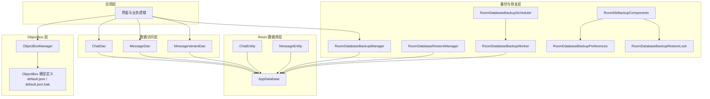
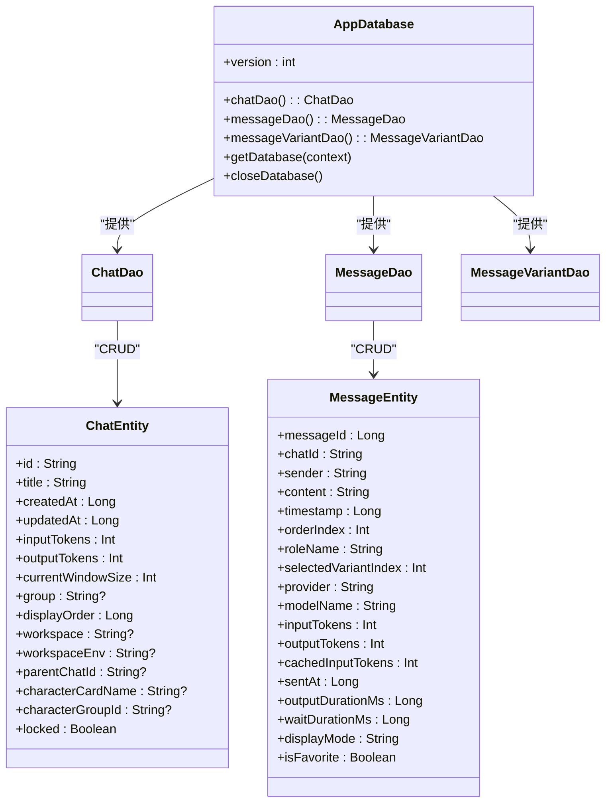
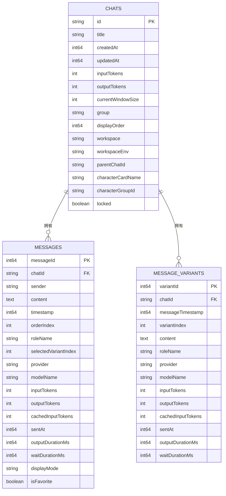
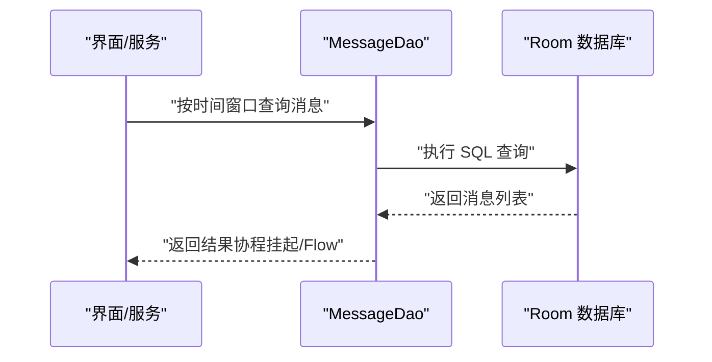
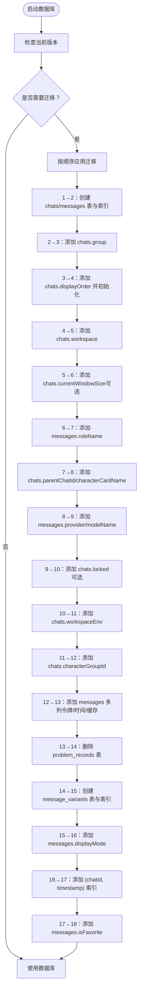
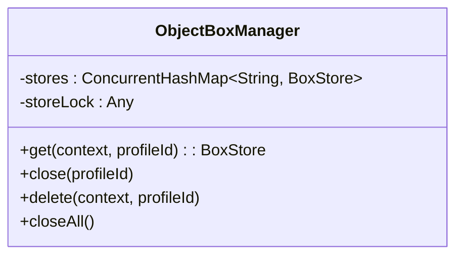
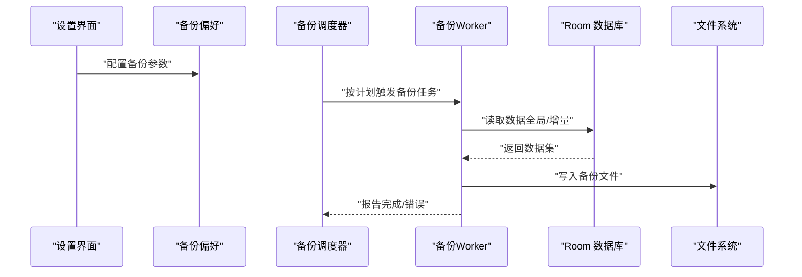
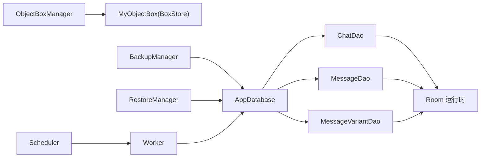

# 数据存储架构

<cite>
**本文引用的文件**
- [AppDatabase.kt](file://app/src/main/java/com/ai/assistance/operit/data/db/AppDatabase.kt)
- [ObjectBox.kt](file://app/src/main/java/com/ai/assistance/operit/data/db/ObjectBox.kt)
- [ChatDao.kt](file://app/src/main/java/com/ai/assistance/operit/data/dao/ChatDao.kt)
- [MessageDao.kt](file://app/src/main/java/com/ai/assistance/operit/data/dao/MessageDao.kt)
- [MessageVariantDao.kt](file://app/src/main/java/com/ai/assistance/operit/data/dao/MessageVariantDao.kt)
- [ChatEntity.kt](file://app/src/main/java/com/ai/assistance/operit/data/model/ChatEntity.kt)
- [MessageEntity.kt](file://app/src/main/java/com/ai/assistance/operit/data/model/MessageEntity.kt)
- [RoomDatabaseBackupManager.kt](file://app/src/main/java/com/ai/assistance/operit/data/backup/RoomDatabaseBackupManager.kt)
- [RoomDatabaseBackupPreferences.kt](file://app/src/main/java/com/ai/assistance/operit/data/backup/RoomDatabaseBackupPreferences.kt)
- [RoomDatabaseBackupRestoreLock.kt](file://app/src/main/java/com/ai/assistance/operit/data/backup/RoomDatabaseBackupRestoreLock.kt)
- [RoomDatabaseBackupScheduler.kt](file://app/src/main/java/com/ai/assistance/operit/data/backup/RoomDatabaseBackupScheduler.kt)
- [RoomDatabaseBackupWorker.kt](file://app/src/main/java/com/ai/assistance/operit/data/backup/RoomDatabaseBackupWorker.kt)
- [RoomDatabaseRestoreManager.kt](file://app/src/main/java/com/ai/assistance/operit/data/backup/RoomDatabaseRestoreManager.kt)
- [RoomDbBackupComponents.kt](file://app/src/main/java/com/ai/assistance/operit/ui/features/settings/components/RoomDbBackupComponents.kt)
- [default.json](file://app/libs/objectbox-models/default.json)
- [default.json.bak](file://app/libs/objectbox-models/default.json.bak)
</cite>

## 目录
1. [简介](#简介)
2. [项目结构](#项目结构)
3. [核心组件](#核心组件)
4. [架构总览](#架构总览)
5. [详细组件分析](#详细组件分析)
6. [依赖分析](#依赖分析)
7. [性能考量](#性能考量)
8. [故障排查指南](#故障排查指南)
9. [结论](#结论)
10. [附录](#附录)

## 简介
本文件系统性梳理 Operit AI 的数据存储架构，重点覆盖以下方面：
- Room 数据库存储：实体关系映射、DAO 接口设计、数据库版本管理与迁移策略
- ObjectBox 数据库集成：模型定义、查询优化与性能考虑
- 备份与恢复机制：全局备份、增量备份、恢复流程与一致性校验
- 数据访问模式：缓存策略、异步操作、线程安全
- 数据安全与隐私：敏感数据处理、加密存储、访问控制
- 扩展与优化建议：新增数据模型、查询性能优化、大数据量场景处理

## 项目结构
数据存储相关代码主要集中在 app 模块的 data 子包中，分为三层：
- 数据库层：Room 数据库与 ObjectBox 管理器
- 实体与访问层：Room 实体与 DAO 接口
- 备份与恢复层：Room 数据库备份与恢复管理器、调度器与 UI 组件

图表来源
- [AppDatabase.kt:17-335](file://app/src/main/java/com/ai/assistance/operit/data/db/AppDatabase.kt#L17-L335)
- [ChatDao.kt:14-284](file://app/src/main/java/com/ai/assistance/operit/data/dao/ChatDao.kt#L14-L284)
- [MessageDao.kt:12-284](file://app/src/main/java/com/ai/assistance/operit/data/dao/MessageDao.kt#L12-L284)
- [MessageVariantDao.kt:10-111](file://app/src/main/java/com/ai/assistance/operit/data/dao/MessageVariantDao.kt#L10-L111)
- [ChatEntity.kt:9-92](file://app/src/main/java/com/ai/assistance/operit/data/model/ChatEntity.kt#L9-L92)
- [MessageEntity.kt:8-95](file://app/src/main/java/com/ai/assistance/operit/data/model/MessageEntity.kt#L8-L95)
- [ObjectBox.kt:9-61](file://app/src/main/java/com/ai/assistance/operit/data/db/ObjectBox.kt#L9-L61)
- [RoomDatabaseBackupManager.kt](file://app/src/main/java/com/ai/assistance/operit/data/backup/RoomDatabaseBackupManager.kt)
- [RoomDatabaseRestoreManager.kt](file://app/src/main/java/com/ai/assistance/operit/data/backup/RoomDatabaseRestoreManager.kt)
- [RoomDatabaseBackupScheduler.kt](file://app/src/main/java/com/ai/assistance/operit/data/backup/RoomDatabaseBackupScheduler.kt)
- [RoomDatabaseBackupWorker.kt](file://app/src/main/java/com/ai/assistance/operit/data/backup/RoomDatabaseBackupWorker.kt)
- [RoomDatabaseBackupPreferences.kt](file://app/src/main/java/com/ai/assistance/operit/data/backup/RoomDatabaseBackupPreferences.kt)
- [RoomDatabaseBackupRestoreLock.kt](file://app/src/main/java/com/ai/assistance/operit/data/backup/RoomDatabaseBackupRestoreLock.kt)
- [RoomDbBackupComponents.kt](file://app/src/main/java/com/ai/assistance/operit/ui/features/settings/components/RoomDbBackupComponents.kt)
- [default.json](file://app/libs/objectbox-models/default.json)
- [default.json.bak](file://app/libs/objectbox-models/default.json.bak)

章节来源
- [AppDatabase.kt:17-335](file://app/src/main/java/com/ai/assistance/operit/data/db/AppDatabase.kt#L17-L335)
- [ObjectBox.kt:9-61](file://app/src/main/java/com/ai/assistance/operit/data/db/ObjectBox.kt#L9-L61)

## 核心组件
- Room 数据库与实体
  - AppDatabase：集中声明实体、版本与迁移策略，提供 DAO 访问入口
  - ChatEntity、MessageEntity：核心数据模型，定义表结构、索引与外键约束
  - ChatDao、MessageDao、MessageVariantDao：数据访问接口，覆盖增删改查、范围查询、统计与批量操作
- ObjectBox 数据库
  - ObjectBoxManager：多配置文件支持、线程安全的 BoxStore 管理、物理删除与关闭
  - default.json/default.json.bak：ObjectBox 模型定义文件，用于生成 MyObjectBox
- 备份与恢复
  - RoomDatabaseBackupManager、RoomDatabaseRestoreManager：备份与恢复管理
  - RoomDatabaseBackupScheduler、RoomDatabaseBackupWorker：调度与执行
  - RoomDatabaseBackupPreferences、RoomDatabaseBackupRestoreLock：偏好设置与锁控制
  - RoomDbBackupComponents：UI 设置组件

章节来源
- [AppDatabase.kt:17-335](file://app/src/main/java/com/ai/assistance/operit/data/db/AppDatabase.kt#L17-L335)
- [ChatEntity.kt:9-92](file://app/src/main/java/com/ai/assistance/operit/data/model/ChatEntity.kt#L9-L92)
- [MessageEntity.kt:8-95](file://app/src/main/java/com/ai/assistance/operit/data/model/MessageEntity.kt#L8-L95)
- [ChatDao.kt:14-284](file://app/src/main/java/com/ai/assistance/operit/data/dao/ChatDao.kt#L14-L284)
- [MessageDao.kt:12-284](file://app/src/main/java/com/ai/assistance/operit/data/dao/MessageDao.kt#L12-L284)
- [MessageVariantDao.kt:10-111](file://app/src/main/java/com/ai/assistance/operit/data/dao/MessageVariantDao.kt#L10-L111)
- [ObjectBox.kt:9-61](file://app/src/main/java/com/ai/assistance/operit/data/db/ObjectBox.kt#L9-L61)
- [RoomDatabaseBackupManager.kt](file://app/src/main/java/com/ai/assistance/operit/data/backup/RoomDatabaseBackupManager.kt)
- [RoomDatabaseRestoreManager.kt](file://app/src/main/java/com/ai/assistance/operit/data/backup/RoomDatabaseRestoreManager.kt)
- [RoomDatabaseBackupScheduler.kt](file://app/src/main/java/com/ai/assistance/operit/data/backup/RoomDatabaseBackupScheduler.kt)
- [RoomDatabaseBackupWorker.kt](file://app/src/main/java/com/ai/assistance/operit/data/backup/RoomDatabaseBackupWorker.kt)
- [RoomDatabaseBackupPreferences.kt](file://app/src/main/java/com/ai/assistance/operit/data/backup/RoomDatabaseBackupPreferences.kt)
- [RoomDatabaseBackupRestoreLock.kt](file://app/src/main/java/com/ai/assistance/operit/data/backup/RoomDatabaseBackupRestoreLock.kt)
- [RoomDbBackupComponents.kt](file://app/src/main/java/com/ai/assistance/operit/ui/features/settings/components/RoomDbBackupComponents.kt)

## 架构总览
Operit 的数据存储采用“Room + ObjectBox”双栈架构：
- Room 用于结构化聊天与消息数据，具备完善的实体关系、索引与迁移能力
- ObjectBox 用于需要高性能写入与复杂查询的场景，通过多配置文件隔离不同用户档案
- 备份与恢复模块围绕 Room 数据库构建，提供全局与增量备份、调度与 UI 控制

图表来源
- [AppDatabase.kt:17-335](file://app/src/main/java/com/ai/assistance/operit/data/db/AppDatabase.kt#L17-L335)
- [ChatEntity.kt:9-92](file://app/src/main/java/com/ai/assistance/operit/data/model/ChatEntity.kt#L9-L92)
- [MessageEntity.kt:8-95](file://app/src/main/java/com/ai/assistance/operit/data/model/MessageEntity.kt#L8-L95)
- [ChatDao.kt:14-284](file://app/src/main/java/com/ai/assistance/operit/data/dao/ChatDao.kt#L14-L284)
- [MessageDao.kt:12-284](file://app/src/main/java/com/ai/assistance/operit/data/dao/MessageDao.kt#L12-L284)
- [MessageVariantDao.kt:10-111](file://app/src/main/java/com/ai/assistance/operit/data/dao/MessageVariantDao.kt#L10-L111)

## 详细组件分析

### Room 数据库设计与实体关系
- 实体关系
  - ChatEntity：聊天元数据，包含标题、时间戳、令牌用量、窗口大小、分组、工作区、角色卡绑定、锁定状态等
  - MessageEntity：消息明细，包含发送者、内容、时间戳、顺序索引、角色名、变体索引、提供商与模型信息、令牌用量、耗时统计、显示模式与收藏标记；定义了与 ChatEntity 的级联删除外键
- 索引设计
  - messages 表：chatId 单列索引与 (chatId, timestamp) 复合索引，支撑按聊天与时间范围查询
  - message_variants 表：(chatId, messageTimestamp) 与 (chatId, messageTimestamp, variantIndex) 复合索引，支撑消息变体的高效检索
- 关系图

图表来源
- [ChatEntity.kt:9-92](file://app/src/main/java/com/ai/assistance/operit/data/model/ChatEntity.kt#L9-L92)
- [MessageEntity.kt:8-95](file://app/src/main/java/com/ai/assistance/operit/data/model/MessageEntity.kt#L8-L95)
- [AppDatabase.kt:139-173](file://app/src/main/java/com/ai/assistance/operit/data/db/AppDatabase.kt#L139-L173)

章节来源
- [ChatEntity.kt:9-92](file://app/src/main/java/com/ai/assistance/operit/data/model/ChatEntity.kt#L9-L92)
- [MessageEntity.kt:8-95](file://app/src/main/java/com/ai/assistance/operit/data/model/MessageEntity.kt#L8-L95)
- [AppDatabase.kt:139-173](file://app/src/main/java/com/ai/assistance/operit/data/db/AppDatabase.kt#L139-L173)

### DAO 接口设计与数据访问模式
- ChatDao
  - 支持按显示顺序流式查询、按 ID 查询、插入/更新/删除
  - 提供角色卡与角色群组绑定、分组管理、锁定状态、主/分支对话查询、统计聚合等高级操作
  - 返回 Flow 或挂起函数，便于与协程与响应式 UI 集成
- MessageDao
  - 支持按时间窗口的多种查询组合（升序/降序、上限/下限、区间）
  - 提供消息复制、变体索引更新、收藏标记更新、搜索聊天 ID、批量重命名角色名等
  - 提供消息计数与最大序号查询
- MessageVariantDao
  - 面向消息变体的 CRUD 与复制，支持按消息时间戳与变体索引定位变体

图表来源
- [MessageDao.kt:12-284](file://app/src/main/java/com/ai/assistance/operit/data/dao/MessageDao.kt#L12-L284)
- [AppDatabase.kt:22-31](file://app/src/main/java/com/ai/assistance/operit/data/db/AppDatabase.kt#L22-L31)

章节来源
- [ChatDao.kt:14-284](file://app/src/main/java/com/ai/assistance/operit/data/dao/ChatDao.kt#L14-L284)
- [MessageDao.kt:12-284](file://app/src/main/java/com/ai/assistance/operit/data/dao/MessageDao.kt#L12-L284)
- [MessageVariantDao.kt:10-111](file://app/src/main/java/com/ai/assistance/operit/data/dao/MessageVariantDao.kt#L10-L111)

### 数据库版本管理与迁移策略
- 当前版本：18
- 迁移策略
  - 逐版本迁移：从 1→2 至 17→18，涵盖表创建、列添加、索引创建、表重建与删除等
  - 兼容性处理：对可能缺失的列使用 try/catch 包裹，避免迁移失败
  - 历史表清理：在特定版本删除历史表（如 problem_records）
  - 新增变体表：在中间版本引入 message_variants 表及其索引
- 迁移流程图

图表来源
- [AppDatabase.kt:36-200](file://app/src/main/java/com/ai/assistance/operit/data/db/AppDatabase.kt#L36-L200)
- [AppDatabase.kt:202-287](file://app/src/main/java/com/ai/assistance/operit/data/db/AppDatabase.kt#L202-L287)
- [AppDatabase.kt:289-335](file://app/src/main/java/com/ai/assistance/operit/data/db/AppDatabase.kt#L289-L335)

章节来源
- [AppDatabase.kt:36-200](file://app/src/main/java/com/ai/assistance/operit/data/db/AppDatabase.kt#L36-L200)
- [AppDatabase.kt:202-287](file://app/src/main/java/com/ai/assistance/operit/data/db/AppDatabase.kt#L202-L287)
- [AppDatabase.kt:289-335](file://app/src/main/java/com/ai/assistance/operit/data/db/AppDatabase.kt#L289-L335)

### ObjectBox 数据库集成
- ObjectBoxManager
  - 多配置文件支持：根据 profileId 动态选择数据库目录，兼容 "default" 旧路径
  - 线程安全：使用同步块与并发哈希表管理多个 BoxStore 实例
  - 生命周期管理：提供关闭与物理删除（含关闭与递归删除目录）
- 模型定义
  - default.json/default.json.bak：ObjectBox 模型定义文件，由 Gradle 插件生成 MyObjectBox
- 使用建议
  - 为高频写入场景（如日志、临时指标）优先考虑 ObjectBox
  - 对于需要复杂关联与事务一致性的场景，Room 更合适
  - 不同 profileId 的数据应严格隔离，避免跨档混用

图表来源
- [ObjectBox.kt:9-61](file://app/src/main/java/com/ai/assistance/operit/data/db/ObjectBox.kt#L9-L61)

章节来源
- [ObjectBox.kt:9-61](file://app/src/main/java/com/ai/assistance/operit/data/db/ObjectBox.kt#L9-L61)
- [default.json](file://app/libs/objectbox-models/default.json)
- [default.json.bak](file://app/libs/objectbox-models/default.json.bak)

### 备份与恢复机制
- 组件职责
  - RoomDatabaseBackupManager：备份管理器，协调备份流程
  - RoomDatabaseRestoreManager：恢复管理器，负责恢复流程
  - RoomDatabaseBackupScheduler：备份调度器，基于 WorkManager 定时触发
  - RoomDatabaseBackupWorker：具体备份任务执行者
  - RoomDatabaseBackupPreferences：备份偏好设置（频率、目标路径等）
  - RoomDatabaseBackupRestoreLock：备份/恢复互斥锁，防止并发冲突
  - RoomDbBackupComponents：设置页面 UI 组件，暴露开关与参数
- 流程概览

图表来源
- [RoomDatabaseBackupScheduler.kt](file://app/src/main/java/com/ai/assistance/operit/data/backup/RoomDatabaseBackupScheduler.kt)
- [RoomDatabaseBackupWorker.kt](file://app/src/main/java/com/ai/assistance/operit/data/backup/RoomDatabaseBackupWorker.kt)
- [RoomDatabaseBackupManager.kt](file://app/src/main/java/com/ai/assistance/operit/data/backup/RoomDatabaseBackupManager.kt)
- [RoomDatabaseRestoreManager.kt](file://app/src/main/java/com/ai/assistance/operit/data/backup/RoomDatabaseRestoreManager.kt)
- [RoomDatabaseBackupPreferences.kt](file://app/src/main/java/com/ai/assistance/operit/data/backup/RoomDatabaseBackupPreferences.kt)
- [RoomDatabaseBackupRestoreLock.kt](file://app/src/main/java/com/ai/assistance/operit/data/backup/RoomDatabaseBackupRestoreLock.kt)
- [RoomDbBackupComponents.kt](file://app/src/main/java/com/ai/assistance/operit/ui/features/settings/components/RoomDbBackupComponents.kt)

章节来源
- [RoomDatabaseBackupManager.kt](file://app/src/main/java/com/ai/assistance/operit/data/backup/RoomDatabaseBackupManager.kt)
- [RoomDatabaseRestoreManager.kt](file://app/src/main/java/com/ai/assistance/operit/data/backup/RoomDatabaseRestoreManager.kt)
- [RoomDatabaseBackupScheduler.kt](file://app/src/main/java/com/ai/assistance/operit/data/backup/RoomDatabaseBackupScheduler.kt)
- [RoomDatabaseBackupWorker.kt](file://app/src/main/java/com/ai/assistance/operit/data/backup/RoomDatabaseBackupWorker.kt)
- [RoomDatabaseBackupPreferences.kt](file://app/src/main/java/com/ai/assistance/operit/data/backup/RoomDatabaseBackupPreferences.kt)
- [RoomDatabaseBackupRestoreLock.kt](file://app/src/main/java/com/ai/assistance/operit/data/backup/RoomDatabaseBackupRestoreLock.kt)
- [RoomDbBackupComponents.kt](file://app/src/main/java/com/ai/assistance/operit/ui/features/settings/components/RoomDbBackupComponents.kt)

### 数据访问模式与线程安全
- 异步与协程
  - DAO 方法广泛使用 suspend 函数与 Flow，确保 UI 线程不阻塞
  - ChatDao 的 Flow 返回值可用于实时 UI 列表刷新
- 线程安全
  - Room 数据库单例通过同步块与延迟初始化保证线程安全
  - ObjectBoxManager 使用同步块与并发哈希表管理多实例
- 缓存策略
  - Flow 可作为轻量缓存源，结合 Room 的查询结果进行 UI 响应
  - 对热点查询（如最近消息、变体）可在上层增加内存缓存

章节来源
- [ChatDao.kt:16-18](file://app/src/main/java/com/ai/assistance/operit/data/dao/ChatDao.kt#L16-L18)
- [AppDatabase.kt:290-335](file://app/src/main/java/com/ai/assistance/operit/data/db/AppDatabase.kt#L290-L335)
- [ObjectBox.kt:9-61](file://app/src/main/java/com/ai/assistance/operit/data/db/ObjectBox.kt#L9-L61)

### 数据安全与隐私保护
- 敏感数据处理
  - 在 Room 中避免存储明文敏感信息；如需记录，仅存储不可逆摘要或派生标识
  - 对外部接口调用参数与响应，应在传输层与存储层均采取脱敏策略
- 加密存储
  - Room：可结合加密库（如 SQLCipher）在构建数据库时启用加密
  - ObjectBox：可结合文件系统加密或应用层加密方案
- 访问控制
  - 通过权限与沙箱限制数据库文件访问
  - 备份文件应加密并限制访问权限
- 建议
  - 对涉及令牌用量、会话上下文等敏感字段，仅在内存中使用并在持久化前进行脱敏
  - 定期审计备份文件与日志，确保无敏感数据泄露

## 依赖分析
- 组件耦合
  - AppDatabase 与各 DAO 强耦合，DAO 依赖 Room 运行时
  - ChatEntity/MessageEntity 依赖 Room 注解与索引定义
  - ObjectBoxManager 依赖 MyObjectBox 生成的 BoxStore
  - 备份模块依赖 Room 数据库与 WorkManager
- 外部依赖
  - Room：数据库引擎、迁移框架
  - ObjectBox：本地对象数据库，模型由 default.json 定义
  - WorkManager：后台调度与执行

图表来源
- [AppDatabase.kt:17-335](file://app/src/main/java/com/ai/assistance/operit/data/db/AppDatabase.kt#L17-L335)
- [ObjectBox.kt:9-61](file://app/src/main/java/com/ai/assistance/operit/data/db/ObjectBox.kt#L9-L61)
- [RoomDatabaseBackupManager.kt](file://app/src/main/java/com/ai/assistance/operit/data/backup/RoomDatabaseBackupManager.kt)
- [RoomDatabaseRestoreManager.kt](file://app/src/main/java/com/ai/assistance/operit/data/backup/RoomDatabaseRestoreManager.kt)
- [RoomDatabaseBackupScheduler.kt](file://app/src/main/java/com/ai/assistance/operit/data/backup/RoomDatabaseBackupScheduler.kt)
- [RoomDatabaseBackupWorker.kt](file://app/src/main/java/com/ai/assistance/operit/data/backup/RoomDatabaseBackupWorker.kt)

章节来源
- [AppDatabase.kt:17-335](file://app/src/main/java/com/ai/assistance/operit/data/db/AppDatabase.kt#L17-L335)
- [ObjectBox.kt:9-61](file://app/src/main/java/com/ai/assistance/operit/data/db/ObjectBox.kt#L9-L61)

## 性能考量
- 查询优化
  - 利用复合索引：messages(chatId, timestamp) 与 message_variants(chatId, messageTimestamp[, variantIndex])，减少全表扫描
  - 时间窗口查询：通过边界条件与 LIMIT 控制返回规模
  - 变体查询：按消息时间戳与变体索引定位，避免跨聊天全表扫描
- 写入优化
  - 批量插入：MessageDao/MessageVariantDao 提供批量插入接口，降低事务开销
  - 变体复制：copyVariantsToChat 支持按时间窗口复制，减少重复计算
- 大数据量场景
  - 分页与窗口：使用时间戳边界与 LIMIT 控制每次加载量
  - 异步与流：Flow 与挂起函数配合协程，避免主线程阻塞
  - 缓存：对热点聊天与消息建立内存缓存，减少重复查询

章节来源
- [MessageDao.kt:12-284](file://app/src/main/java/com/ai/assistance/operit/data/dao/MessageDao.kt#L12-L284)
- [MessageVariantDao.kt:10-111](file://app/src/main/java/com/ai/assistance/operit/data/dao/MessageVariantDao.kt#L10-L111)
- [AppDatabase.kt:139-173](file://app/src/main/java/com/ai/assistance/operit/data/db/AppDatabase.kt#L139-L173)

## 故障排查指南
- 迁移失败
  - 现象：升级后无法打开数据库
  - 排查：检查迁移脚本是否抛出异常；确认 try/catch 是否覆盖了列存在性判断
  - 处置：回滚到上一版本，修复迁移脚本后再升级
- 数据不一致
  - 现象：变体索引与消息内容不匹配
  - 排查：核对 message_variants 的唯一索引与 (chatId, messageTimestamp, variantIndex)
  - 处置：重建索引或清理脏数据后重新导入
- 备份/恢复异常
  - 现象：备份文件损坏或恢复失败
  - 排查：检查备份偏好设置、锁状态与文件权限
  - 处置：清理锁文件、重新配置备份路径并重试

章节来源
- [AppDatabase.kt:36-200](file://app/src/main/java/com/ai/assistance/operit/data/db/AppDatabase.kt#L36-L200)
- [RoomDatabaseBackupPreferences.kt](file://app/src/main/java/com/ai/assistance/operit/data/backup/RoomDatabaseBackupPreferences.kt)
- [RoomDatabaseBackupRestoreLock.kt](file://app/src/main/java/com/ai/assistance/operit/data/backup/RoomDatabaseBackupRestoreLock.kt)

## 结论
Operit 的数据存储架构以 Room 为核心，辅以 ObjectBox 与完善的备份/恢复体系，满足聊天与消息的高可用与高性能需求。通过严格的实体关系设计、索引策略与迁移管理，系统在演进过程中保持了良好的数据完整性与可维护性。建议在后续迭代中进一步强化敏感数据处理与加密存储，并持续优化大体量场景下的查询与写入性能。

## 附录

### 实现示例与最佳实践
- 新增数据模型（Room）
  - 步骤：定义实体类与注解、在 AppDatabase 中注册、编写对应 DAO 接口、在迁移中添加必要列或表
  - 参考路径：[ChatEntity.kt:9-92](file://app/src/main/java/com/ai/assistance/operit/data/model/ChatEntity.kt#L9-L92)、[AppDatabase.kt:17-31](file://app/src/main/java/com/ai/assistance/operit/data/db/AppDatabase.kt#L17-L31)
- 查询性能优化
  - 使用复合索引与时间窗口查询，避免全表扫描
  - 参考路径：[MessageDao.kt:18-108](file://app/src/main/java/com/ai/assistance/operit/data/dao/MessageDao.kt#L18-L108)、[AppDatabase.kt:139-173](file://app/src/main/java/com/ai/assistance/operit/data/db/AppDatabase.kt#L139-L173)
- 大数据量场景
  - 分页与窗口查询、批量插入、异步与流式响应
  - 参考路径：[MessageDao.kt:177-179](file://app/src/main/java/com/ai/assistance/operit/data/dao/MessageDao.kt#L177-L179)、[ChatDao.kt:16-18](file://app/src/main/java/com/ai/assistance/operit/data/dao/ChatDao.kt#L16-L18)
- 备份与恢复
  - 配置备份偏好、调度与执行、UI 控制
  - 参考路径：[RoomDbBackupComponents.kt](file://app/src/main/java/com/ai/assistance/operit/ui/features/settings/components/RoomDbBackupComponents.kt)、[RoomDatabaseBackupScheduler.kt](file://app/src/main/java/com/ai/assistance/operit/data/backup/RoomDatabaseBackupScheduler.kt)、[RoomDatabaseBackupWorker.kt](file://app/src/main/java/com/ai/assistance/operit/data/backup/RoomDatabaseBackupWorker.kt)