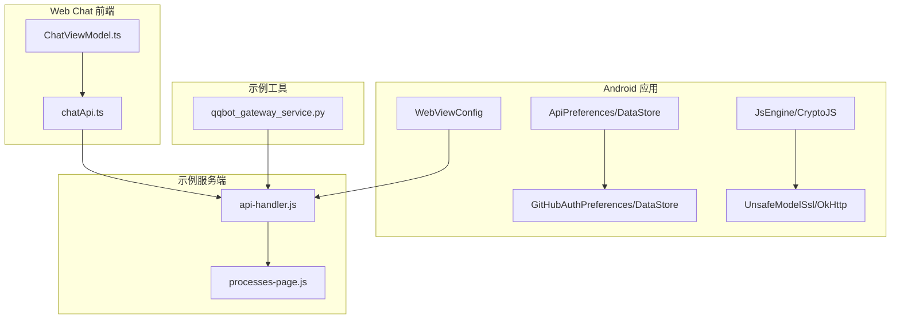
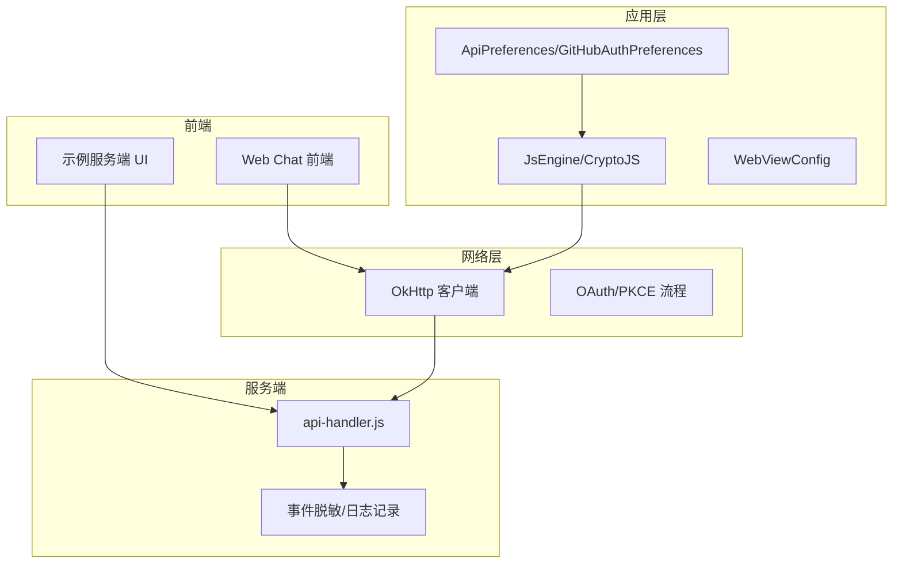
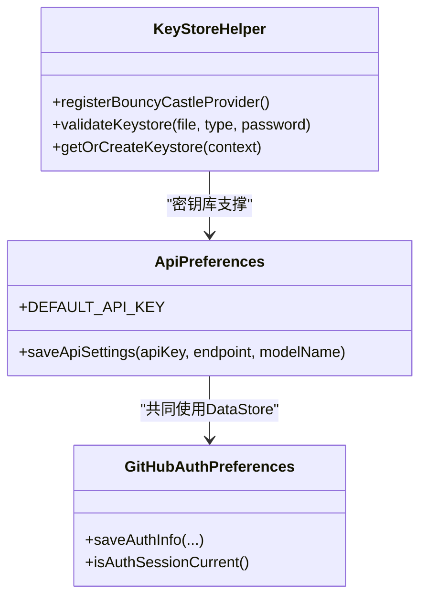
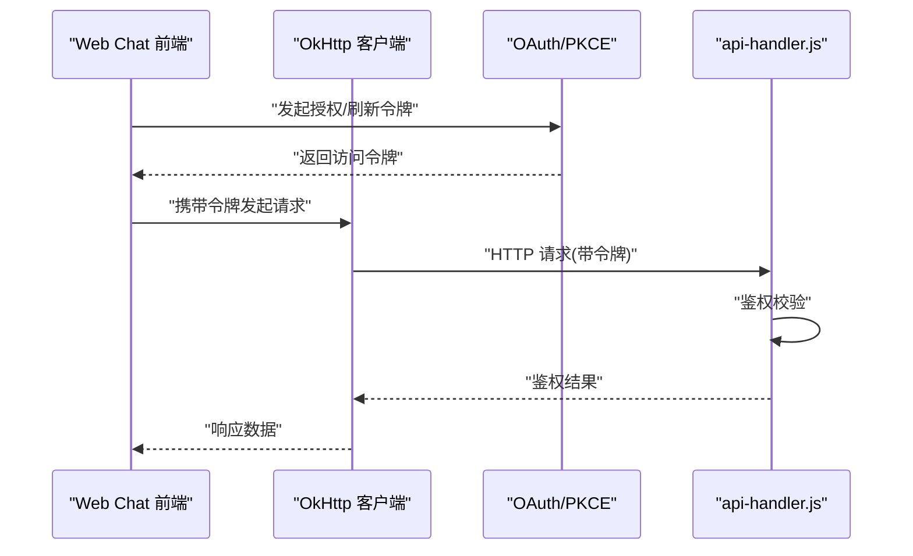
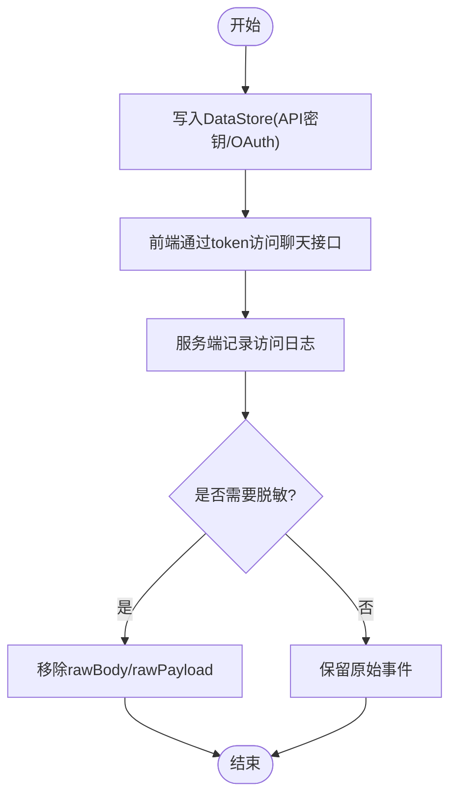
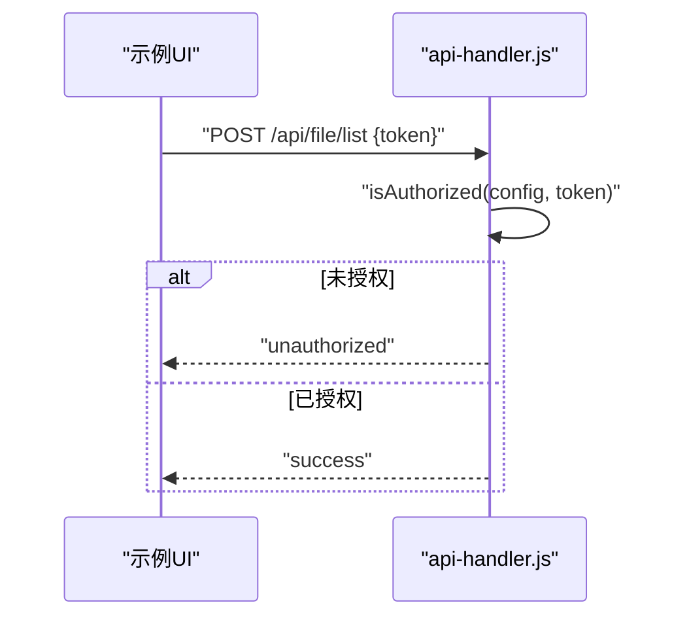
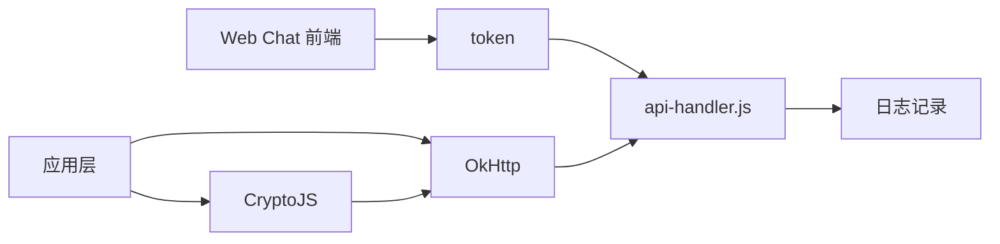

# 数据安全与隐私保护

<cite>
**本文引用的文件**
- [Operit 安全机制设计思想与详细流程分析.md](file://my_docs/Operit 安全机制设计思想与详细流程分析.md)
- [CryptoJS.js](file://app/src/main/assets/js/CryptoJS.js)
- [spawn-helper.js](file://app/src/main/assets/bridge/spawn-helper.js)
- [chatApi.ts](file://web-chat/src/ui/features/chat/util/chatApi.ts)
- [ChatViewModel.ts](file://web-chat/src/ui/features/chat/viewmodel/ChatViewModel.ts)
- [qqbot_gateway_service.py](file://examples/qqbot/resources/qqbot_gateway_service.py)
- [processes-page.js](file://examples/windows_control/resources/pc_agent/operit-pc-agent/public/scripts/features/processes-page.js)
- [api-handler.js](file://examples/windows_control/resources/pc_agent/operit-pc-agent/src/handlers/api-handler.js)
</cite>

## 目录
1. [引言](#引言)
2. [项目结构](#项目结构)
3. [核心组件](#核心组件)
4. [架构总览](#架构总览)
5. [详细组件分析](#详细组件分析)
6. [依赖关系分析](#依赖关系分析)
7. [性能考量](#性能考量)
8. [故障排查指南](#故障排查指南)
9. [结论](#结论)
10. [附录](#附录)

## 引言
本文件聚焦于 Operit 在数据安全与隐私保护方面的设计与实现，围绕静态数据加密、传输数据加密、密钥管理、敏感数据处理、访问控制、数据脱敏与匿名化、隐私合规、审计与监控、数据生命周期管理等主题，结合仓库中现有的安全机制与实现片段，给出可操作的实施建议与最佳实践。文档同时面向开发者，提供安全编码规范、漏洞防护与安全测试方法指引。

## 项目结构
Operit 由 Android 应用、Web Chat 前端、跨语言桥接脚本、示例服务端与工具组成。与数据安全直接相关的关键位置包括：
- Android 应用侧：偏好存储（DataStore）、网络栈（OkHttp）、JS 引擎与桥接（CryptoJS、spawn-helper）、WebView 安全配置
- Web Chat 前端：消息与聊天记录 API 调用封装
- 示例服务端：Windows PC Agent 的 API 处理与鉴权逻辑
- 示例工具：QQBot 网关事件清洗与脱敏

**图表来源**
- [Operit 安全机制设计思想与详细流程分析.md:34-113](file://my_docs/Operit 安全机制设计思想与详细流程分析.md#L34-L113)
- [chatApi.ts:201-235](file://web-chat/src/ui/features/chat/util/chatApi.ts#L201-L235)
- [ChatViewModel.ts:1449-1505](file://web-chat/src/ui/features/chat/viewmodel/ChatViewModel.ts#L1449-L1505)
- [api-handler.js:706-747](file://examples/windows_control/resources/pc_agent/operit-pc-agent/src/handlers/api-handler.js#L706-L747)
- [processes-page.js:120-150](file://examples/windows_control/resources/pc_agent/operit-pc-agent/public/scripts/features/processes-page.js#L120-L150)
- [qqbot_gateway_service.py:578-616](file://examples/qqbot/resources/qqbot_gateway_service.py#L578-L616)

**章节来源**
- [Operit 安全机制设计思想与详细流程分析.md:32-113](file://my_docs/Operit 安全机制设计思想与详细流程分析.md#L32-L113)

## 核心组件
- 安全存储与密钥管理
  - DataStore 加密与偏好存储：用于 API 密钥、OAuth 令牌、用户配置等敏感信息的持久化与访问控制
  - KeyStoreHelper：密钥库管理与 BouncyCastle 集成，支持 PKCS12/JKS 格式与密钥库验证
- 网络安全
  - OkHttp 客户端配置：超时控制、Cookie 管理、代理支持；可选禁用证书验证（仅特定场景）
  - OAuth 流程：PKCE、state 校验、作用域与版本控制
- 数据传输与前端交互
  - Web Chat API：消息查询、定位器预览等接口封装
  - 示例服务端 API：基于 token 的鉴权与日志记录
- 数据脱敏与匿名化
  - 事件队列脱敏：移除原始负载字段，仅保留必要字段
  - 前端输入与密码字段：示例中对 token 字段使用密码输入框

**章节来源**
- [Operit 安全机制设计思想与详细流程分析.md:654-706](file://my_docs/Operit 安全机制设计思想与详细流程分析.md#L654-L706)
- [Operit 安全机制设计思想与详细流程分析.md:864-920](file://my_docs/Operit 安全机制设计思想与详细流程分析.md#L864-L920)
- [Operit 安全机制设计思想与详细流程分析.md:709-777](file://my_docs/Operit 安全机制设计思想与详细流程分析.md#L709-L777)
- [spawn-helper.js:11861-11898](file://app/src/main/assets/bridge/spawn-helper.js#L11861-L11898)
- [chatApi.ts:201-235](file://web-chat/src/ui/features/chat/util/chatApi.ts#L201-L235)
- [api-handler.js:706-747](file://examples/windows_control/resources/pc_agent/operit-pc-agent/src/handlers/api-handler.js#L706-L747)
- [qqbot_gateway_service.py:595-601](file://examples/qqbot/resources/qqbot_gateway_service.py#L595-L601)
- [processes-page.js:120-150](file://examples/windows_control/resources/pc_agent/operit-pc-agent/public/scripts/features/processes-page.js#L120-L150)

## 架构总览
下图展示了数据安全相关组件之间的交互关系，涵盖静态存储、传输加密、鉴权与前端调用链路。

**图表来源**
- [Operit 安全机制设计思想与详细流程分析.md:34-113](file://my_docs/Operit 安全机制设计思想与详细流程分析.md#L34-L113)
- [chatApi.ts:201-235](file://web-chat/src/ui/features/chat/util/chatApi.ts#L201-L235)
- [api-handler.js:706-747](file://examples/windows_control/resources/pc_agent/operit-pc-agent/src/handlers/api-handler.js#L706-L747)
- [qqbot_gateway_service.py:578-616](file://examples/qqbot/resources/qqbot_gateway_service.py#L578-L616)

## 详细组件分析

### 静态数据加密与密钥管理
- DataStore 加密与偏好存储
  - 使用 DataStore 存储 API 密钥、OAuth 令牌、用户配置等敏感信息，具备自动加密能力
  - OAuth 令牌存储包含过期时间、刷新令牌、作用域与版本控制，支持完整清除
- 密钥库管理
  - KeyStoreHelper 支持 PKCS12/JKS 格式，启动时注册 BouncyCastle Provider，验证密钥库有效性
  - 提供密钥库自动恢复与格式兼容策略

**图表来源**
- [Operit 安全机制设计思想与详细流程分析.md:654-706](file://my_docs/Operit 安全机制设计思想与详细流程分析.md#L654-L706)
- [Operit 安全机制设计思想与详细流程分析.md:864-920](file://my_docs/Operit 安全机制设计思想与详细流程分析.md#L864-L920)

**章节来源**
- [Operit 安全机制设计思想与详细流程分析.md:780-861](file://my_docs/Operit 安全机制设计思想与详细流程分析.md#L780-L861)
- [Operit 安全机制设计思想与详细流程分析.md:864-920](file://my_docs/Operit 安全机制设计思想与详细流程分析.md#L864-L920)

### 传输数据加密与访问控制
- OkHttp 客户端安全配置
  - 超时控制、Cookie 管理、代理支持；可选禁用证书验证（仅特定场景）
- OAuth/PKCE 鉴权流程
  - 生成 PKCE 验证对，state 校验，作用域与版本控制，支持刷新令牌
- 示例服务端鉴权
  - 基于 token 的鉴权检查，成功/失败日志记录

**图表来源**
- [spawn-helper.js:11861-11898](file://app/src/main/assets/bridge/spawn-helper.js#L11861-L11898)
- [spawn-helper.js:23655-23711](file://app/src/main/assets/bridge/spawn-helper.js#L23655-L23711)
- [api-handler.js:706-747](file://examples/windows_control/resources/pc_agent/operit-pc-agent/src/handlers/api-handler.js#L706-L747)

**章节来源**
- [Operit 安全机制设计思想与详细流程分析.md:709-777](file://my_docs/Operit 安全机制设计思想与详细流程分析.md#L709-L777)
- [spawn-helper.js:11861-11898](file://app/src/main/assets/bridge/spawn-helper.js#L11861-L11898)
- [api-handler.js:706-747](file://examples/windows_control/resources/pc_agent/operit-pc-agent/src/handlers/api-handler.js#L706-L747)

### 敏感数据处理：用户个人信息、API 密钥、聊天记录
- API 密钥存储
  - 使用 DataStore 存储，配合 Base64 编码（降低明文暴露风险）
- 聊天记录与消息接口
  - Web Chat 提供消息列表与定位器预览接口，前端通过 token 访问
- 事件与日志脱敏
  - QQBot 网关事件在查询时可选择移除原始负载字段，避免敏感信息泄露

**图表来源**
- [Operit 安全机制设计思想与详细流程分析.md:654-706](file://my_docs/Operit 安全机制设计思想与详细流程分析.md#L654-L706)
- [chatApi.ts:201-235](file://web-chat/src/ui/features/chat/util/chatApi.ts#L201-L235)
- [qqbot_gateway_service.py:595-601](file://examples/qqbot/resources/qqbot_gateway_service.py#L595-L601)

**章节来源**
- [Operit 安全机制设计思想与详细流程分析.md:654-706](file://my_docs/Operit 安全机制设计思想与详细流程分析.md#L654-L706)
- [chatApi.ts:201-235](file://web-chat/src/ui/features/chat/util/chatApi.ts#L201-L235)
- [qqbot_gateway_service.py:595-601](file://examples/qqbot/resources/qqbot_gateway_service.py#L595-L601)

### 访问控制机制：权限验证、数据隔离、会话管理
- 服务端鉴权
  - 示例服务端对每个 API 调用进行 token 验证，失败返回未授权并记录日志
- 前端输入与会话
  - 示例 UI 对 token 字段使用密码输入框，避免明文显示
- 会话与令牌管理
  - OAuth 令牌包含过期时间与刷新令牌，支持版本控制与作用域校验

**图表来源**
- [api-handler.js:734-747](file://examples/windows_control/resources/pc_agent/operit-pc-agent/src/handlers/api-handler.js#L734-L747)
- [processes-page.js:120-150](file://examples/windows_control/resources/pc_agent/operit-pc-agent/public/scripts/features/processes-page.js#L120-L150)

**章节来源**
- [api-handler.js:706-747](file://examples/windows_control/resources/pc_agent/operit-pc-agent/src/handlers/api-handler.js#L706-L747)
- [processes-page.js:120-150](file://examples/windows_control/resources/pc_agent/operit-pc-agent/public/scripts/features/processes-page.js#L120-L150)

### 数据脱敏与匿名化
- 事件脱敏
  - QQBot 网关事件提供 sanitize 接口，可移除原始负载字段，仅保留必要字段
- 日志脱敏
  - 服务端日志记录包含关键上下文，但可通过配置降低敏感信息输出

**章节来源**
- [qqbot_gateway_service.py:595-601](file://examples/qqbot/resources/qqbot_gateway_service.py#L595-L601)

### 隐私合规与用户权利
- OAuth 状态校验与作用域控制
  - 通过 state 防止 CSRF，通过作用域与版本控制确保最小权限
- 用户同意与令牌过期
  - 令牌存储包含过期时间与刷新令牌，支持完整清除，便于用户撤销授权

**章节来源**
- [spawn-helper.js:11861-11898](file://app/src/main/assets/bridge/spawn-helper.js#L11861-L11898)
- [Operit 安全机制设计思想与详细流程分析.md:820-854](file://my_docs/Operit 安全机制设计思想与详细流程分析.md#L820-L854)

### 数据审计与监控
- 服务端日志
  - 成功/失败日志记录，便于审计与异常追踪
- 建议
  - 结合集中式日志系统与告警规则，对异常访问与鉴权失败进行告警

**章节来源**
- [api-handler.js:717-729](file://examples/windows_control/resources/pc_agent/operit-pc-agent/src/handlers/api-handler.js#L717-L729)

### 数据生命周期管理
- 令牌过期与刷新
  - OAuth 令牌包含过期时间与刷新令牌，支持自动续期与过期清理
- 建议
  - 对聊天记录与临时数据设定保留期限与自动清理策略，支持用户请求删除

**章节来源**
- [Operit 安全机制设计思想与详细流程分析.md:820-854](file://my_docs/Operit 安全机制设计思想与详细流程分析.md#L820-L854)

## 依赖关系分析
- 前端到服务端：Web Chat 通过 token 调用服务端 API，服务端进行鉴权与日志记录
- 应用层到网络层：应用侧通过 OkHttp 发起请求，可选禁用证书验证（仅特定场景）
- JS 引擎与加密：JS 侧提供 CryptoJS API，可用于前端侧加密/解密（如 AES）

**图表来源**
- [chatApi.ts:201-235](file://web-chat/src/ui/features/chat/util/chatApi.ts#L201-L235)
- [api-handler.js:706-747](file://examples/windows_control/resources/pc_agent/operit-pc-agent/src/handlers/api-handler.js#L706-L747)
- [CryptoJS.js:91-109](file://app/src/main/assets/js/CryptoJS.js#L91-L109)

**章节来源**
- [chatApi.ts:201-235](file://web-chat/src/ui/features/chat/util/chatApi.ts#L201-L235)
- [api-handler.js:706-747](file://examples/windows_control/resources/pc_agent/operit-pc-agent/src/handlers/api-handler.js#L706-L747)
- [CryptoJS.js:91-109](file://app/src/main/assets/js/CryptoJS.js#L91-L109)

## 性能考量
- OkHttp 超时控制与连接复用，避免阻塞与资源耗尽
- DataStore 异步写入，降低 UI 阻塞
- JS 引擎单线程执行，避免多线程竞争带来的额外开销

[本节为通用性能讨论，不直接分析具体文件]

## 故障排查指南
- 鉴权失败
  - 检查 token 是否正确传递与过期；确认服务端 isAuthorized 校验逻辑
- SSL 证书问题
  - 默认启用证书验证；仅在特殊场景使用禁用证书验证的配置
- 日志与审计
  - 关注服务端日志中的成功/失败记录，定位异常请求

**章节来源**
- [api-handler.js:706-747](file://examples/windows_control/resources/pc_agent/operit-pc-agent/src/handlers/api-handler.js#L706-L747)
- [Operit 安全机制设计思想与详细流程分析.md:709-777](file://my_docs/Operit 安全机制设计思想与详细流程分析.md#L709-L777)

## 结论
Operit 在数据安全与隐私保护方面构建了多层次的体系：静态数据通过 DataStore 加密存储，传输通过 OkHttp 与 OAuth/PKCE 保障，服务端具备鉴权与日志记录能力，前端具备输入脱敏与密码字段保护。结合现有实现，建议进一步引入证书固定、代码混淆、根检测增强、生物识别、审计日志与自动锁定等措施，持续提升整体安全性与合规性。

[本节为总结性内容，不直接分析具体文件]

## 附录

### 开发者实施指导
- 安全编码规范
  - 始终验证输入、使用最小权限、安全存储敏感数据、验证 OAuth 状态
- 漏洞防护措施
  - 启用证书验证、限制混合内容、使用安全浏览、严格 Cookie 管理
- 安全测试方法
  - 单元测试覆盖鉴权与存储逻辑，集成测试验证端到端数据流，渗透测试评估边界

**章节来源**
- [Operit 安全机制设计思想与详细流程分析.md:997-1024](file://my_docs/Operit 安全机制设计思想与详细流程分析.md#L997-L1024)